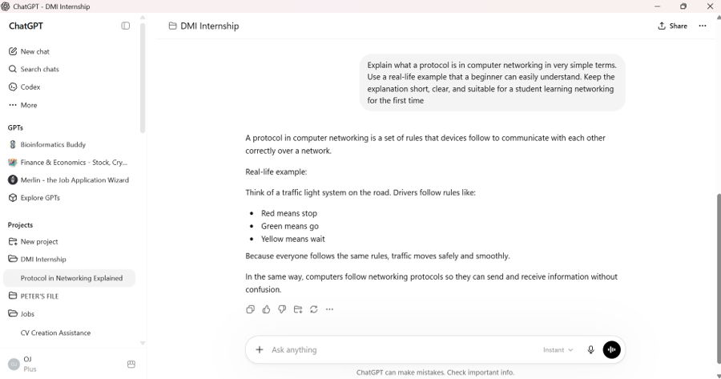
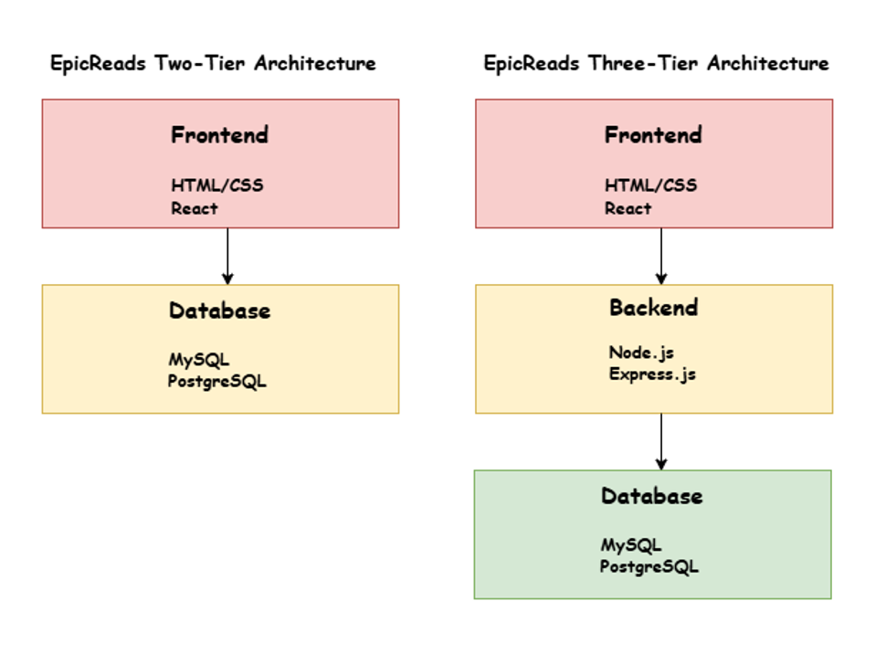
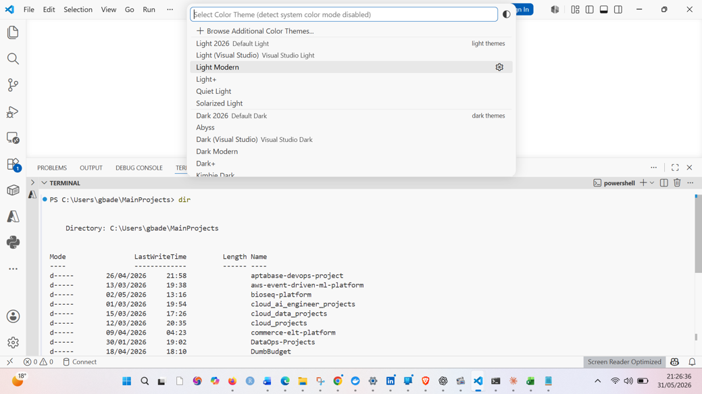

# Week 00 - Internet and Networking

Part of the DevOps Micro Internship (DMI) Cohort 3 with Agentic AI

---

# 🧑‍💻 Task 1: Using ChatGPT as Your Learning Assistant

## Scenario

You're new to DevOps and will frequently encounter technical questions. ChatGPT can be your learning companion.

## Your Task

Write a clear ChatGPT prompt to help you understand:

> "What is a protocol in networking? Explain with a simple real-life example."

Take a screenshot of your interaction showing:

* Your detailed prompt (with clear expectations)
* ChatGPT's simplified response with an example

## Screenshot

Save your screenshot in the `screenshots` folder and update the file name below.



---

## What I Learned (2–3 lines)

I learned that networking protocols are rules that help devices communicate correctly and efficiently. Protocols work like everyday rules, such as traffic laws or human language instructions, where both parties must follow the same conventions for the exchange to succeed. This task helped me understand networking concepts in a simpler and more practical way.

---

# 🌐 Task 2: Internet and Networking

## Scenario

Your friend is launching an online bookstore named **EpicReads**.

He asked you to explain how users globally can access his website hosted in Finland.

## Your Task

Write a short explanation (**100–150 words**) that includes:

* Packet Switching
* IP Address
* TCP/IP
* HTTP/HTTPS

💡 **Tip:** You may use ChatGPT (as demonstrated in Task 1) to refine your explanation.

## Answer

Packet Switching is a method in which data is broken into small pieces called packets before being sent across a network. It is like sending a large book in separate parcels through different routes to reach the same destination. An IP Address is a unique number assigned to a device on a network, similar to a home address used to deliver mail. TCP/IP is the set of rules that helps devices communicate properly on the internet, just like traffic rules help cars move safely on roads. HTTP and HTTPS are protocols used to access websites. HTTP transfers website data, while HTTPS adds security by encrypting the data in transit. HTTPS is like sending a locked letter instead of an open postcard, making online activities safer.

---

# 🏗️ Task 3: Application Architecture & Stack

## Scenario

EpicReads bookstore has two application versions:

### Two-Tier Application

* Frontend
* Database

### Three-Tier Application

* Frontend
* Backend
* Database

## Your Task

* Draw simple diagrams (hand-drawn or tool-based such as draw.io)
* Label each layer clearly
* List at least two common technologies or tools used for each layer
* Submit a screenshot or photo clearly showing your own drawing

## Diagram Screenshot / Photo

Save your diagram image in the `screenshots` folder and update the file name below.



---

## Technologies Used

### Frontend

* HTML, CSS
* React, Angular

### Backend

* Node.js with Express.js
* Django (Python)

### Database

* MySQL, PostgreSQL
* MongoDB, SQLite

---

# 🌍 Task 4: Domain Name & DNS (Basic Concepts)

## Scenario

Your friend's bookstore **EpicReads** is currently accessible through:

```text
52.172.142.222:3000
```

He purchased the domain:

```text
epicreads.com
```

## Your Task

In **50–100 words**, explain in your own words:

1. What is DNS (Domain Name System)?
2. Which DNS record type should be used to connect the domain to the given IP, and why?

## Answer

DNS (Domain Name System) is like the internet's phonebook. It translates easy-to-remember domain names such as `epicreads.com` into IP addresses that computers use to locate websites. Without DNS, users would need to remember numerical IP addresses to access websites.

To connect `epicreads.com` to the IP address `52.172.142.222`, an **A Record (Address Record)** should be used. An A Record maps a domain name directly to an IPv4 address, allowing users to access the website by typing the domain name instead of the numerical IP address.

---

# 💻 Task 5: Visual Studio Code Setup (Hands-on)

## Your Task

Install Visual Studio Code (if not already installed).

Take a screenshot of your VS Code environment showing:

* Terminal open inside VS Code
* Running a basic command:

### Windows

```powershell
dir
```

### Linux / macOS

```bash
pwd
ls
```

* Your selected VS Code theme clearly visible

⚠️ **Important:** The screenshot must show your username or another identifiable detail to confirm it is your environment.

## Screenshot

Save your screenshot in the `screenshots` folder and update the file name below.



---

# 🔗 Task 6: Publish Your Assignment as a LinkedIn Post

## Objective

Publishing on LinkedIn helps you:

* Build your professional online presence
* Reinforce your learning
* Document your DevOps journey publicly

## Your Task

Summarize your answers from Tasks 1–5 into a LinkedIn post.

Clearly structure your post into the following sections:

* ChatGPT
* Internet & Networking
* App Architecture
* DNS
* VS Code Setup

Add the following credit note at the end of your post:

> **P.S. This post is a part of DevOps Micro Internship with Agentic AI Cohort-3 by Pravin Mishra. You can start your DevOps journey by joining this Discord community: https://discord.pravinmishra.com/**

---

## LinkedIn Post URL

Paste your LinkedIn post URL here:

```text
https://www.linkedin.com/posts/oluwagbade-odimayo-_dmibypravinmishra-devops-agenticai-share-7478867195096322048-Gml_/?utm_source=share&utm_medium=member_desktop&rcm=ACoAAEisxRIBmu60CNDBQ0H53vTWkifIThNz8sc
```

## Blog Post URL

```text
https://dev.to/gbadedata/how-the-internet-actually-works-networking-dns-architecture-my-dmi-devops-journey-47dp
```

---

## LinkedIn Post Backup Copy

Paste the full text of your LinkedIn post here:

The full write-up is published on dev.to at the link above. It covers all five tasks: what networking protocols are and why they matter; packet switching, IP addressing, TCP/IP, and HTTP/HTTPS explained with real-life analogies; two-tier vs. three-tier application architecture with diagrams and technology tables; how DNS resolution works step by step and which record type connects epicreads.com to its IP; and a VS Code setup walkthrough with the extensions most useful for DevOps work.

---

# Reflection – Week 0

### What did you find easy?

I found the DNS and networking concepts relatively easy to understand because they relate directly to everyday internet usage. Once I had the right analogies in place (DNS as a phonebook, packets as parcels, HTTPS as a locked envelope), the technical details clicked into place quickly.

---

### What was difficult?

The differences between two-tier and three-tier architectures required more careful study, especially understanding how responsibilities are distributed across layers. The concepts sound simple in isolation, but understanding why separating business logic from the client changes everything about security, scalability, and maintainability takes deeper thinking.

---

### What will you improve next week?

Next week, I plan to deepen my understanding of system architecture and continue building practical experience with development and DevOps tools through hands-on exercises and projects. My goal is to close the gap between theoretical knowledge and practical muscle memory.

---

## 📌 About DMI & CloudAdvisory

DevOps Micro Internship (DMI) is a project-based DevOps program run by Pravin Mishra (The CloudAdvisory) focused on real-world execution, systems thinking, and career readiness.

It helps learners build strong DevOps foundations with hands-on experience.


## 📌 Resources

- 🌐 **DMI Official Website:** https://pravinmishra.com/dmi  
- 🎓 **DevOps for Beginners (Udemy):** https://www.udemy.com/course/devops-for-beginners-docker-k8s-cloud-cicd-4-projects/  
- 🎓 **Ultimate Agentic AI DevOps with Clude Code** https://www.udemy.com/course/ultimate-agentic-ai-devops-with-claude-code/?referralCode=448389767BC96284087B
- 🎓 **DevOps with Claude Code: Terraform, EKS, ArgoCD & Helm** https://www.udemy.com/course/devops-with-claude-code-terraform-eks-argocd-helm/?referralCode=1C5B734505D65A010FA3
- ▶️ **YouTube Playlist (DMI Cohort 3):** https://www.youtube.com/playlist?list=PLFeSNDtI4Cho  
- 🔗 **Pravin Mishra (LinkedIn):** https://www.linkedin.com/in/pravin-mishra-aws-trainer/  
- 🏢 **CloudAdvisory (LinkedIn):** https://www.linkedin.com/company/thecloudadvisory/

---

*This submission is part of DevOps Micro Internship (DMI) Cohort 3 — Agentic AI Track*
