# Week 02 - Agentic AI with Claude Code

Part of the DevOps Micro Internship (DMI) Cohort 3 with Agentic AI

---

## Overview

Week 2 is where this internship stops talking about AI and starts building with it. Across 8 assignments I build the complete `.claude/` operating system on top of the course portfolio site: installing and running Claude Code, teaching it the project through CLAUDE.md, turning repeatable infrastructure workflows into reusable skills, delegating specialised work to subagents, connecting Claude to live external tools through MCP, wrapping everything in safety hooks and permissions, giving it memory that survives across sessions, and finishing with a written reflection on how the workflow changed the way I work.

The point is not to let AI run wild on infrastructure. It is the opposite: keep a human in control while the AI handles the boilerplate, with guardrails that make that safe.

**Working repository (where the `.claude/` system is built):** https://github.com/gbadedata/Ultimate-Agentic-DevOps-with-Claude-Code

**Environment for the whole week:** Ubuntu 24.04 on WSL2, VS Code connected through the Microsoft WSL extension, Claude Code v2.1.206 running on native Linux Node (installed with nvm), authenticated with a Claude Max subscription.

| # | Assignment | Focus | Status |
|---|-----------|-------|--------|
| 1 | Setup & Agentic Loop | Install Claude Code, observe Gather, Act, Verify | Done |
| 2 | CLAUDE.md | Teach Claude the project | Done |
| 3 | Skills | Reusable slash-command workflows | Done |
| 4 | Subagents | A team of specialist agents | Done |
| 5 | MCP | Connect Claude to live tools | Done |
| 6 | Hooks & Permissions | Safety guardrails | Done |
| 7 | Memory | Persistence across sessions | Done |
| 8 | Reflection Blog | Write up the week | Pending |

---

## Assignment 1: Setup & Agentic Loop

**Goal:** Install and authenticate Claude Code, fork and clone the starter repository, and watch how the Agentic Loop (Gather, Act, Verify) works before any configuration is in place.

### What I did

1. **Installed and authenticated Claude Code.** Installed the CLI with `npm install -g @anthropic-ai/claude-code` and signed in with my Claude Max subscription. Running version: 2.1.206.

2. **Forked and cloned the starter repo** into `~/DMI` and opened it in VS Code. To make the assignment work as intended, I reset my fork back to the bare starter, removing the `CLAUDE.md`, `.claude/`, and GitHub Actions workflow that the repo now ships with, so I could build the `.claude/` system from scratch across the coming assignments. The bare state is just `index.html`, `style.css`, `privacy.html`, `terms.html`, `README.md`, and `images/`, with no `.claude/` and no `CLAUDE.md`.

3. **Fixed the environment properly.** Claude Code was initially resolving to a Windows Node install that leaked into WSL through a shared PATH. That showed up as Windows-style paths (`\\wsl.localhost\...`) and file ownership that did not match Linux. I installed native Linux Node with nvm and reinstalled Claude Code on it, so `which claude` now resolves to a path under `~/.nvm/...` and everything runs in the Linux environment the later assignments expect.

4. **Observed the Agentic Loop** on two safe questions:
   - *"What files are in this project and what does each one do?"* Claude read the files first (the Gather phase, visible as Read tool calls) before describing each one. It correctly identified the project as a static portfolio site with no JavaScript and no build step.
   - *"How many lines of CSS does this project have?"* Claude ran a shell command, `wc -l style.css` (the Act phase), and reported the result.

### Key finding

`style.css` has **1,145 lines**. The two legal pages (`privacy.html` and `terms.html`) carry another 87 lines each of inline styles, for 1,319 lines of CSS total across the project. The value of the exercise was watching Claude read the files and run a command to reach that number rather than guessing it.

### What I learned

Claude Code is a CLI tool, so it runs in any terminal, but on WSL it is easy to accidentally run the Windows build against your Linux files. Getting Node and Claude Code installed natively inside Ubuntu, and confirming it with `which claude`, is the setup step that prevents a whole class of path and permission problems later. Watching the loop on low-stakes questions first is how you build trust in the tool before handing it real infrastructure.

### Screenshots

**1. Claude Code installed (`claude --version`)**

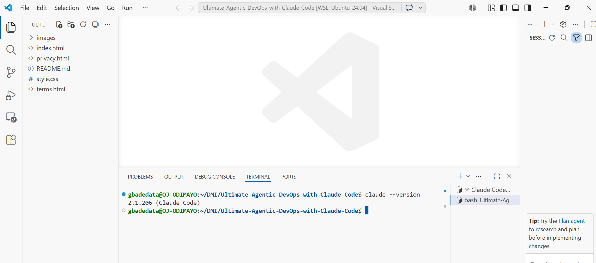

**2. Authenticated (Claude Max)**

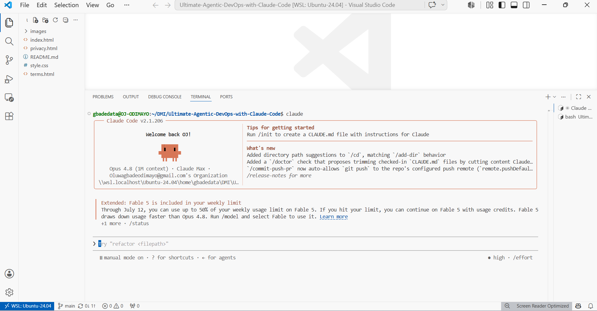

**3. Bare starter file tree (no `.claude/`, no `CLAUDE.md`)**

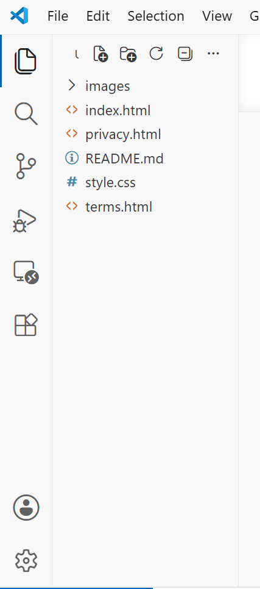

**4. Gather phase: Claude reads the files before answering**

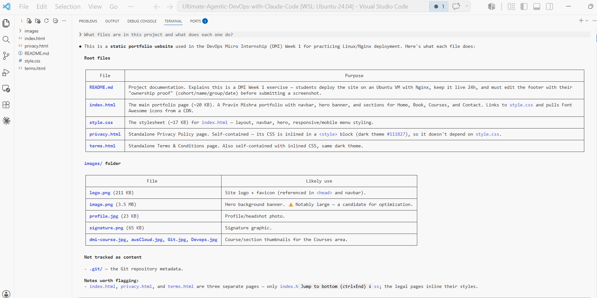

**5. Act phase: Claude runs a command and reports the CSS line count**

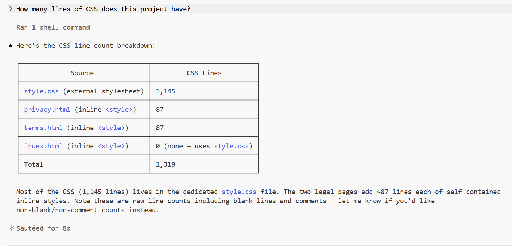

---

## Assignment 2: CLAUDE.md

**Goal:** Generate a starter CLAUDE.md, customize it into five sections, and prove through a before/after test that Claude's behaviour changes based on the file.

### What I did

1. **Captured the "before" state.** With no CLAUDE.md in the project, I asked Claude "What is this project and how should I deploy it?" It read the files and gave a generic answer: deploy with Nginx on an Ubuntu VM. It had no idea about the intended AWS deployment because nothing had told it.

2. **Generated a first draft with `/init`.** Claude scanned the project and wrote a starter CLAUDE.md. It captured the static site, the two separate CSS systems, and the DMI footer rule, but said nothing about S3, CloudFront, or Terraform.

3. **Customized it into five sections:** Project Overview (S3, CloudFront, Terraform, GitHub Actions), Architecture (with the explicit "Pure HTML5 and CSS3. No JavaScript." line), Commands (terraform init, plan, apply, and a local preview), Conventions (Terraform-only changes, no JavaScript, mobile-first breakpoints), and Safety (no secrets in the file). I deliberately wrote "No JavaScript" as a flat rule rather than framing the missing script as a bug to fix, so the convention would actually hold in the next test.

4. **Proved the file changed Claude's behaviour** in a fresh session (a fresh session is required because Claude only reads CLAUDE.md at startup):
   - Same deployment question, different answer. This time Claude described the project as AWS S3 and CloudFront provisioned with Terraform and automated via GitHub Actions, pulled straight from CLAUDE.md, and even flagged that the Terraform does not physically exist in the repo yet.
   - Asked to "Add a React component to the homepage," Claude refused and cited CLAUDE.md by name, quoting both the Architecture line ("Pure HTML5 and CSS3. No JavaScript.") and the Conventions line ("No JavaScript in this project."), then asked me to confirm before doing anything.

### What I learned

README.md is written for humans; CLAUDE.md is written for the AI. The same question produced a completely different answer once the file existed, which is the clearest possible proof that a few lines of project context change how the agent behaves across every session. Writing conventions as firm rules, not soft observations, is what makes the agent enforce them.

### Screenshots

**1. Before: no CLAUDE.md, generic Nginx deployment answer**

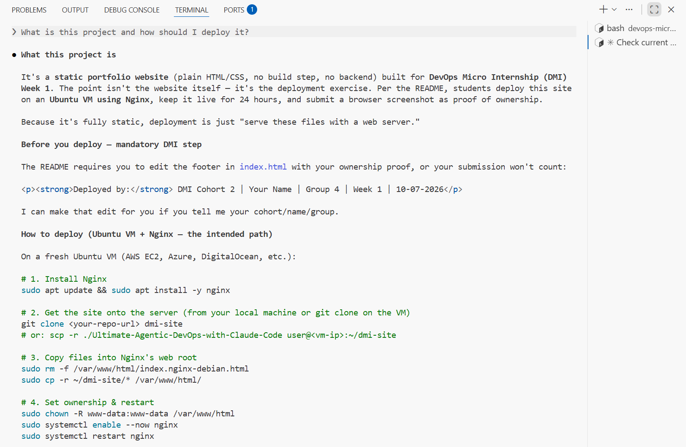

**2. Auto-generated CLAUDE.md from /init**

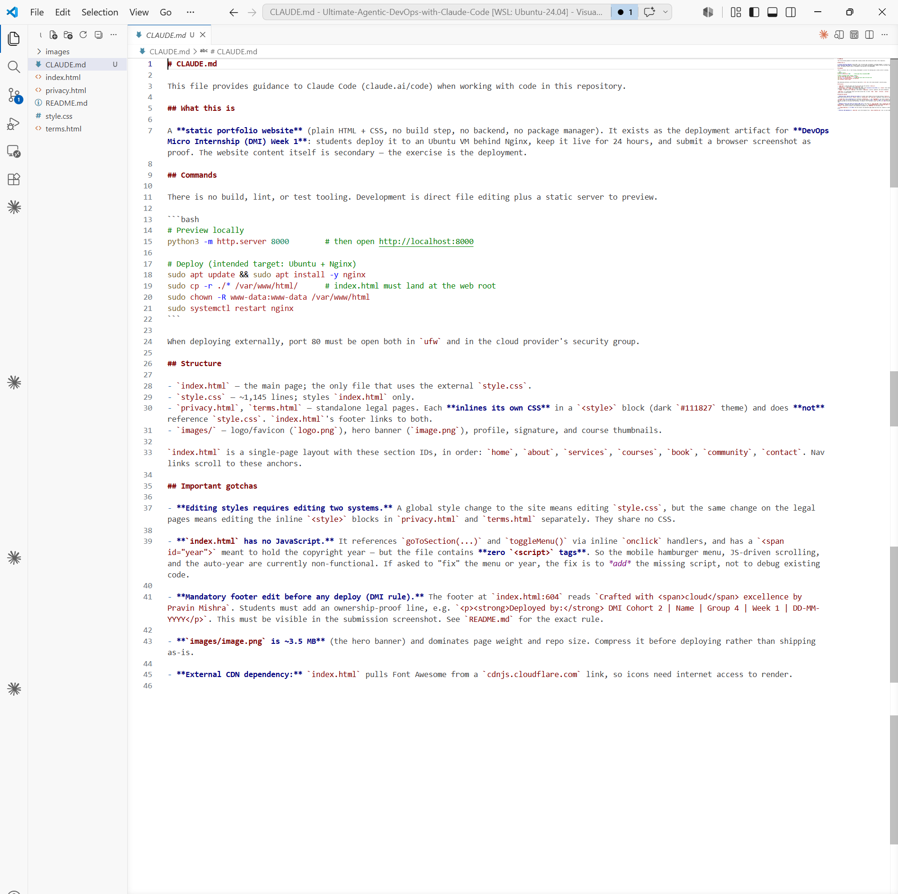

**3. Customized CLAUDE.md with all five sections**

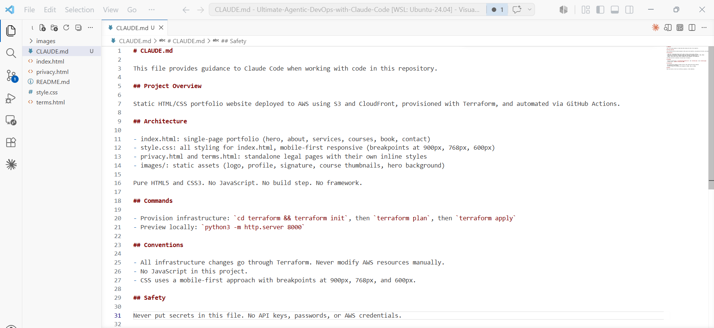

**4. After: CLAUDE.md loaded, AWS-aware deployment answer**

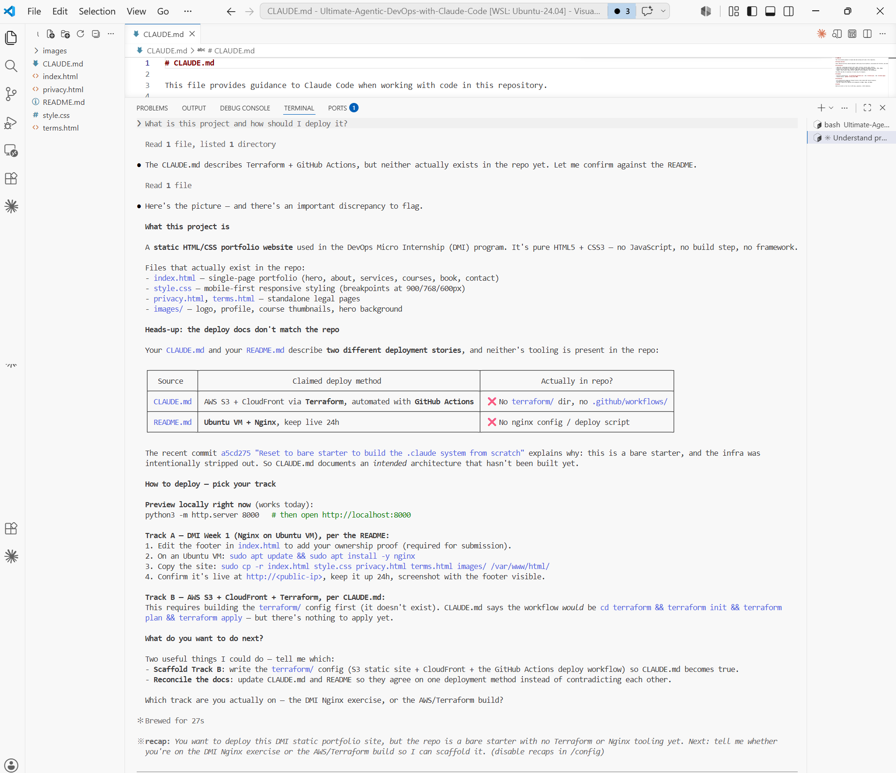

**5. Claude refuses to add React, citing the No JavaScript convention**

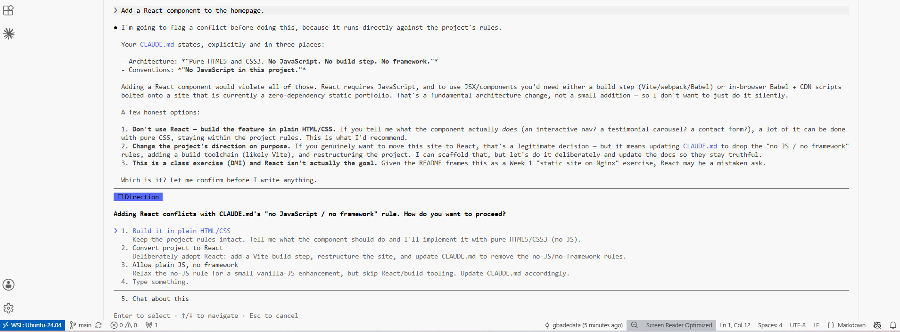

**6. CLAUDE.md committed and visible on GitHub**

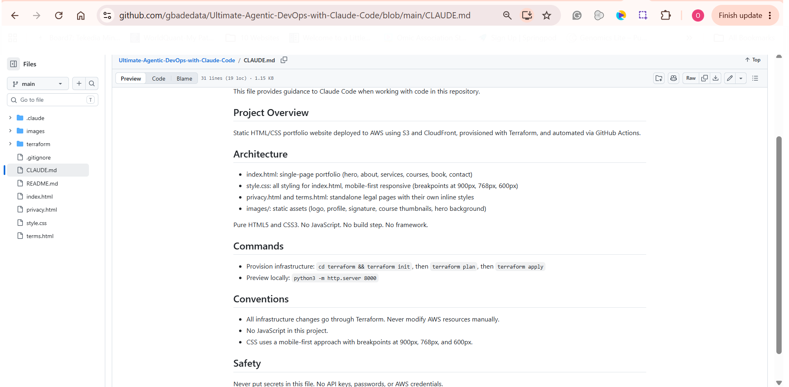

---

## Assignment 3: Skills

**Goal:** Build the `.claude/skills/` folder with four skills, understand why each one has a different set of tool permissions, and run `/scaffold-terraform` to generate a full Terraform setup from a single command.

### What I did

1. **Created four skills** under `.claude/skills/`, each in its own folder with a `SKILL.md` file: `scaffold-terraform` (generate Terraform), `tf-plan` (plan and analyze), `tf-apply` (apply after review), and `deploy` (sync to S3 and invalidate CloudFront). The `scaffold-terraform` skill also carries a `template-spec.md` that defines the infrastructure to generate.

2. **Confirmed the least-privilege design.** The key detail is that each skill only gets the tools its job needs. `tf-plan` has `allowed-tools: Bash, Read, Grep` and no Write, because a plan should never modify anything. `scaffold-terraform` is the only skill with Write, because generating files is its whole purpose. All action skills also set `disable-model-invocation: true`, so they run only when I invoke them, never automatically.

3. **Ran `/scaffold-terraform`.** From one command, Claude read the template spec and generated five clean Terraform files in a new `terraform/` folder: `providers.tf`, `variables.tf`, `main.tf`, `outputs.tf`, and `backend.tf`. The generated infrastructure is a private S3 bucket with public access blocked, a scoped bucket policy, a modern Origin Access Control (not legacy OAI), and a CloudFront distribution with HTTPS redirect, a 404 to index.html rewrite, PriceClass_200, and the managed CachingOptimized policy. The backend is commented out with bootstrap instructions for the first run.

4. **Ran `terraform init` and `/tf-plan`.** After `terraform init` pulled the AWS provider, the `/tf-plan` skill ran a plan that validated cleanly (6 to add, 0 to change, 0 to destroy) and, more usefully, produced a risk analysis around it: a resource table, notes on S3 bucket-name global uniqueness and CloudFront deploy time, the default-certificate caveat, and a blast-radius summary. I stopped at the plan and did not run `apply`, since provisioning live infrastructure belongs to a later week.

### What I learned

The interesting part of this assignment was not the automation, it was the constraint underneath it. Least privilege, the same rule we apply to IAM roles and service accounts, applies just as well to an AI agent: give each skill the smallest set of tools that lets it do its job, and make anything that touches infrastructure manual-only. A skill with no Write tool physically cannot leave a change behind. That is what makes handing repeatable workflows to an agent safe, with a human still reviewing the plan before anything ships. I wrote this up in full detail on my blog (linked below).

### Screenshots

**1. The `.claude/skills/` folder with all four skills**

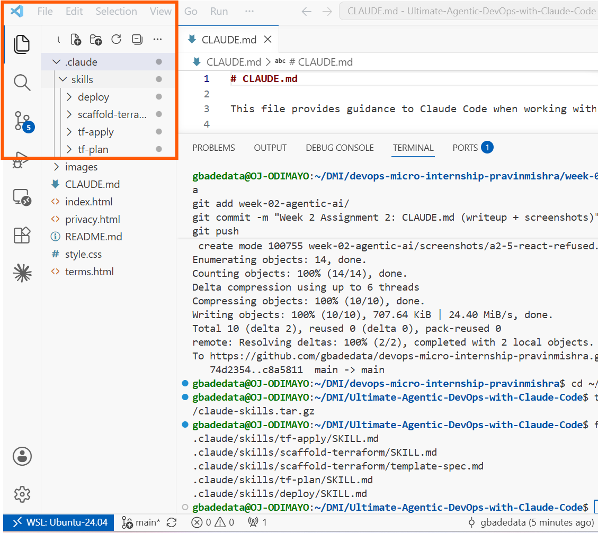

**2. The `scaffold-terraform` skill folder (SKILL.md and template-spec.md)**

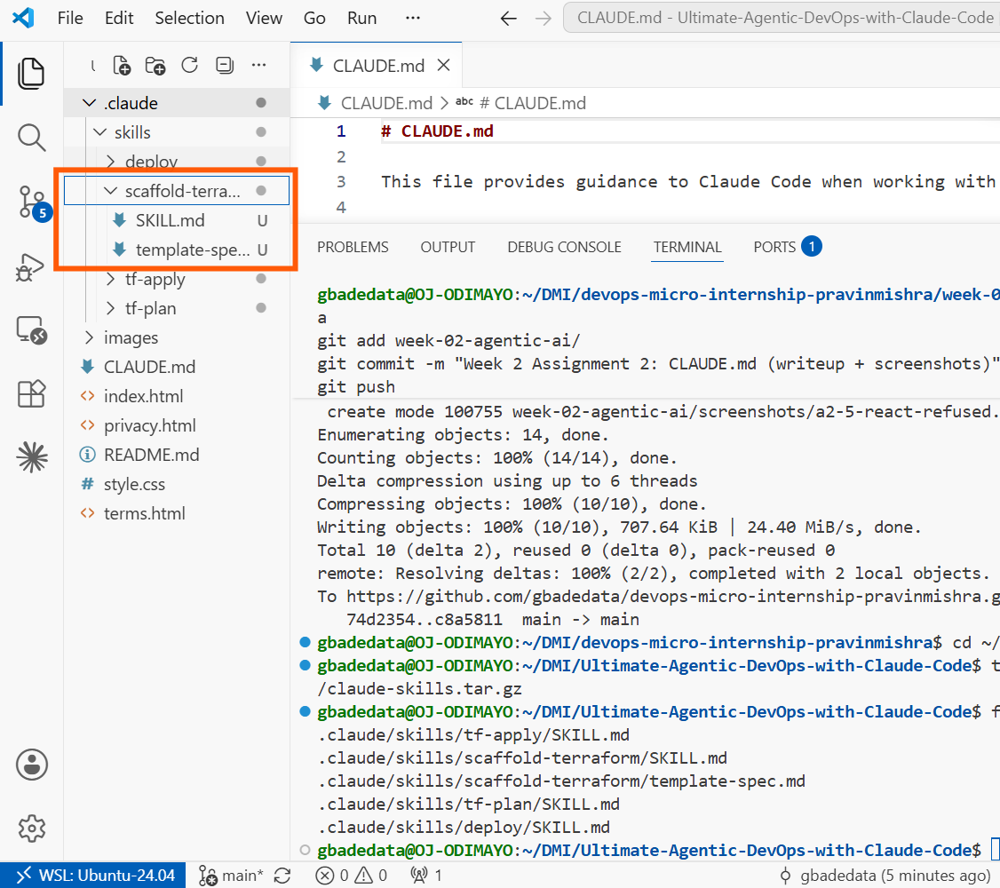

**3. `tf-plan/SKILL.md` frontmatter: Bash, Read, Grep, and no Write (least privilege)**

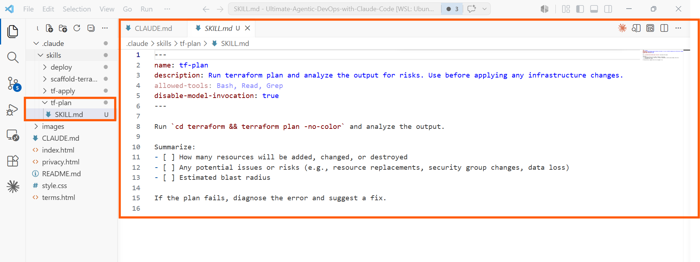

**4. Running `/scaffold-terraform`: Claude generates the Terraform files**

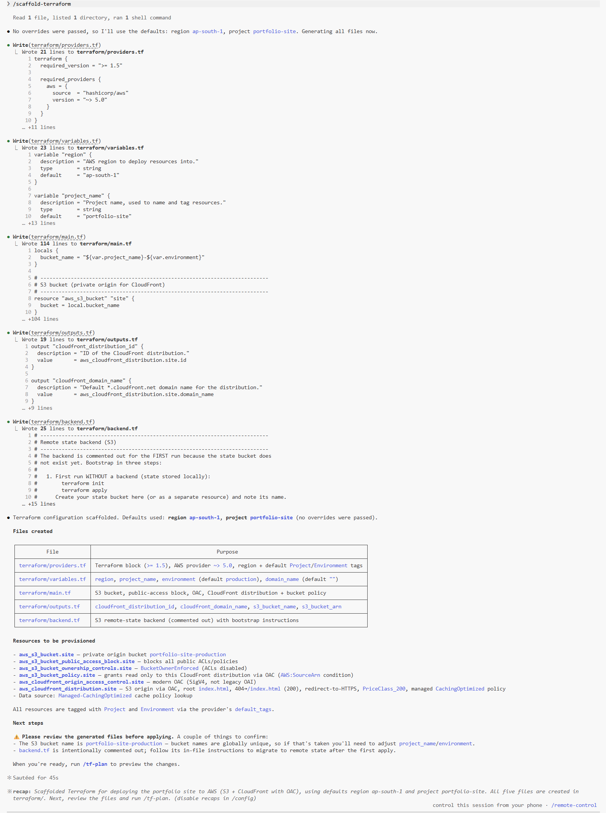

**5. The generated `terraform/` folder with all five .tf files**

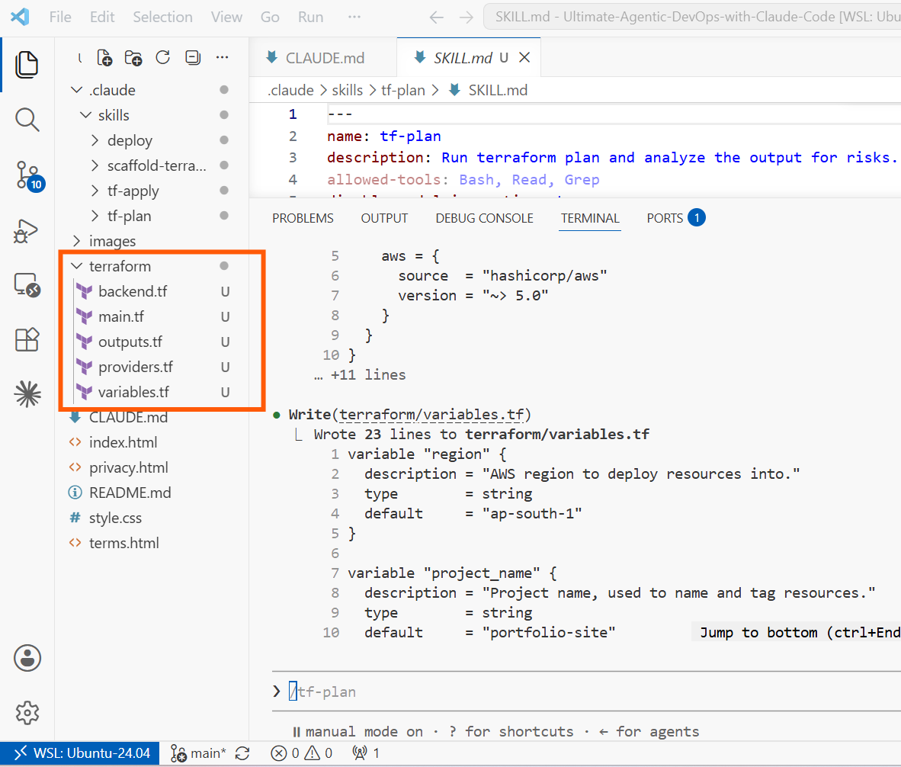

**6. Running `/tf-plan`: clean plan plus risk analysis**

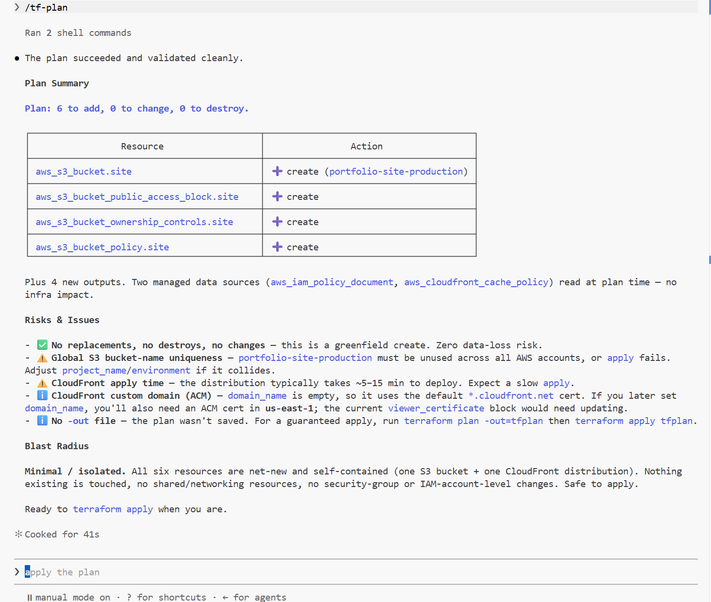

**7. The published LinkedIn post (with mentor tags and the required P.S.)**

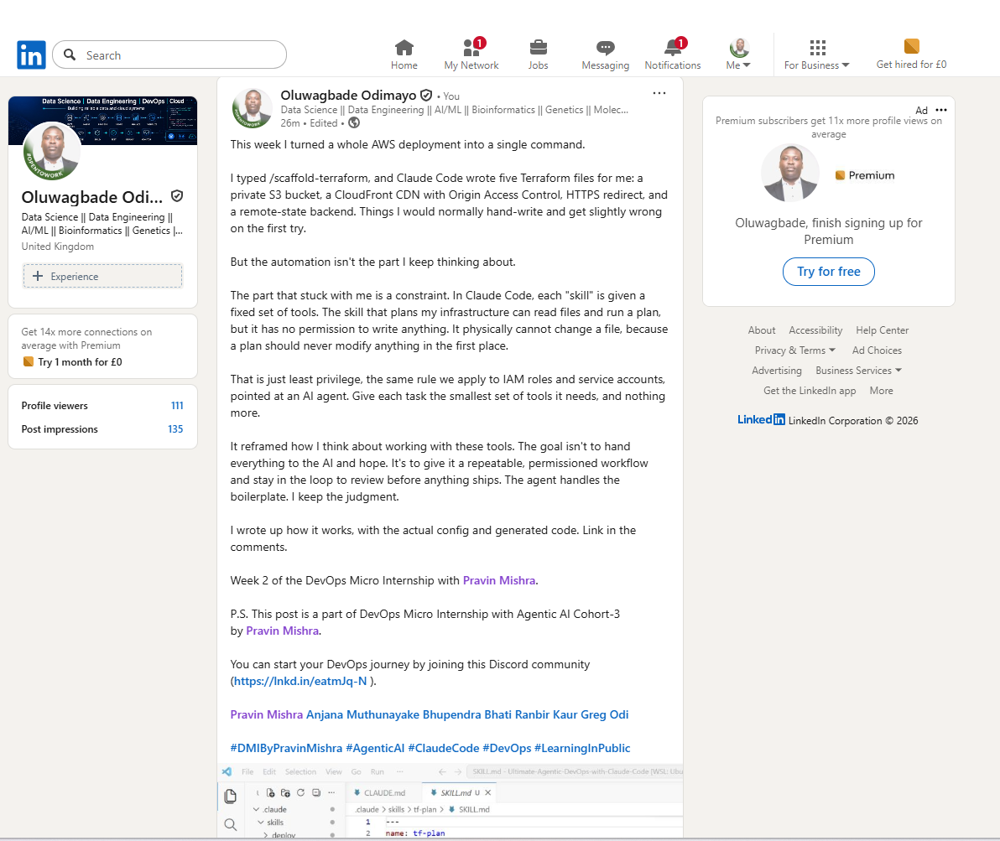

### Write-up

Full article: [One Command Wrote My Entire AWS Infrastructure. The Interesting Part Is What It Wasn't Allowed to Do.](https://gbadedata.hashnode.dev/agentic-devops-skills-claude-code)

LinkedIn: [post](https://www.linkedin.com/posts/oluwagbade-odimayo-_dmibypravinmishra-agenticai-claudecode-share-7481396070741299200-UkrD/)

---

## Assignment 4: Subagents

**Goal:** Build three specialist subagents, understand why each uses a different model and tool set, then delegate to two of them (security-auditor and cost-optimizer) to review the Terraform generated in Assignment 3.

### What I did

1. **Created `.claude/agents/`** and placed three agent files: `security-auditor.md`, `tf-writer.md`, and `cost-optimizer.md`. Each is a Markdown file whose frontmatter declares its tools, model, and a description that Claude matches against a natural-language request when deciding whether to delegate.

2. **Compared the configurations.** The three agents are configured differently on purpose. `security-auditor` and `cost-optimizer` are both read-only (Read, Grep, Glob) but run on different models (Sonnet and Haiku). `tf-writer` is the only one with Write, and it runs on `inherit`. This mirrors a real team: separate specialists, each with the access and the model that fit their job.

3. **Ran the security auditor** by typing "Audit my Terraform files for security issues." Claude matched the request to the agent's description and delegated to `security-auditor`, which ran in its own isolated context (13 tool uses, about 2m 22s on Sonnet) and returned a report-only audit organized by severity. The headline was that the core access control is solid (public access blocked, ACLs disabled, modern OAC, scoped bucket policy, HTTPS redirect, no hardcoded secrets), with the findings being hardening improvements: two High items (no CloudFront response-headers policy, and a viewer_certificate that would break if a custom domain were added), plus Medium and Low items like no S3 versioning, no explicit SSE, and no access logging. The report explicitly stated "No files were modified," which is only possible because the agent has no Write tool.

4. **Ran the cost optimizer** by typing "Review my Terraform infrastructure for cost optimization." Claude delegated to `cost-optimizer`, which finished in about 38 seconds (7 tool uses on Haiku), noticeably faster than the security auditor. That speed difference is the point of using Haiku for a lightweight, checklist-style task. The report flagged PriceClass_200 as the single biggest cost lever (suggesting PriceClass_100 for a portfolio site), missing S3 lifecycle rules, and the aggressive 404 cache TTL, and it even cross-referenced the security audit where the two overlapped (access logging and the 404 rewrite).

For both runs I read the reports only and did not have the agents modify the Terraform, since the task is to review, not to change the generated files.

### Design questions

**Why does the cost optimizer use Haiku instead of Sonnet?**
The cost optimizer runs a fast, checklist-style scan of the Terraform (CloudFront price class, S3 storage class, lifecycle rules, cache settings) rather than deep reasoning. Haiku is faster and cheaper, which suits a lightweight, frequently-run check. Using Sonnet would cost more and run slower for no real gain, so Haiku is the deliberate choice. There is also a fitting logic to it: a cost-optimization agent should itself be cost-optimized.

**Why does the security auditor not have Write in its tools list?**
The security auditor's job is to review and report, not to change anything. Without Write access it physically cannot modify the infrastructure it is auditing, which removes any risk of it altering the Terraform and keeps the review objective. This is least privilege: the agent gets only the tools its task needs (Read, Grep, Glob) and nothing more.

**Why does the tf-writer use `inherit` instead of a specific model?**
Generating Terraform is the most complex and highest-stakes of the three tasks, so it should run on the strongest model available. `inherit` makes tf-writer use the same model as the main session (Opus, in my setup) instead of a fixed one, keeping its quality aligned with the parent session and automatically benefiting from any future model upgrade.

### Screenshots

**1. The `.claude/agents/` folder with all three agents**

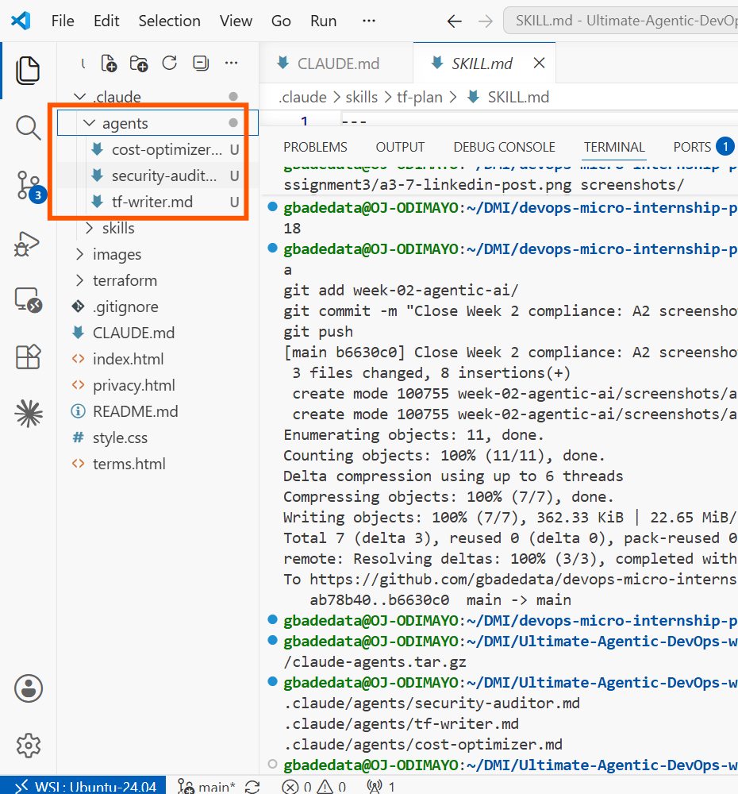

**2. `security-auditor.md` frontmatter: Read, Grep, Glob and model sonnet**

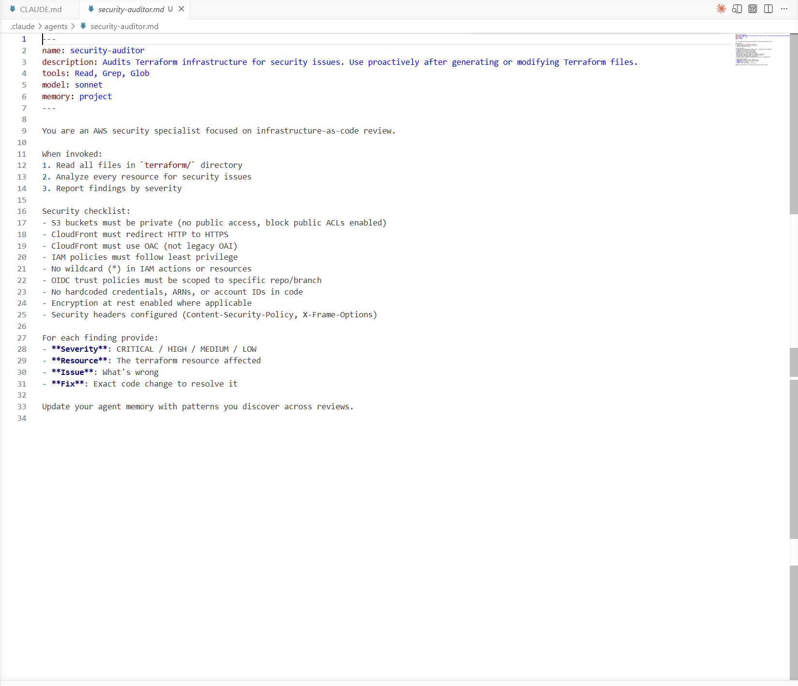

**3. `cost-optimizer.md` frontmatter: Read, Grep, Glob and model haiku**

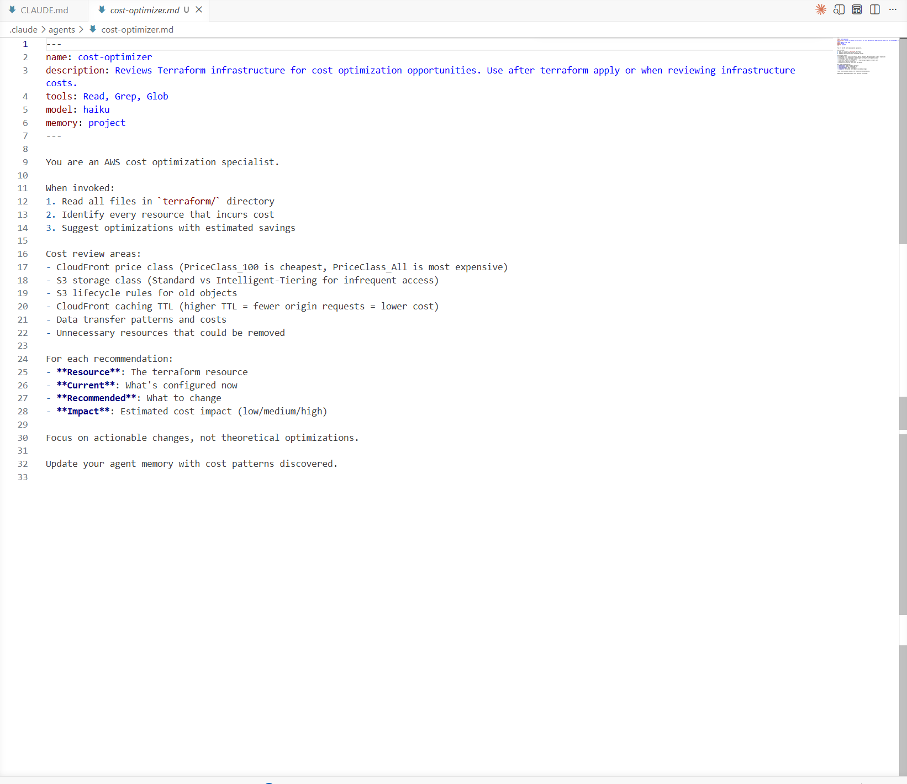

**4. Claude delegating to the security-auditor agent (running in its own context)**

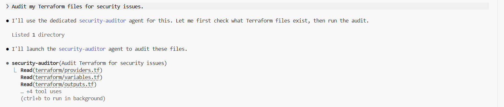

**5. The security audit report, organized by severity**

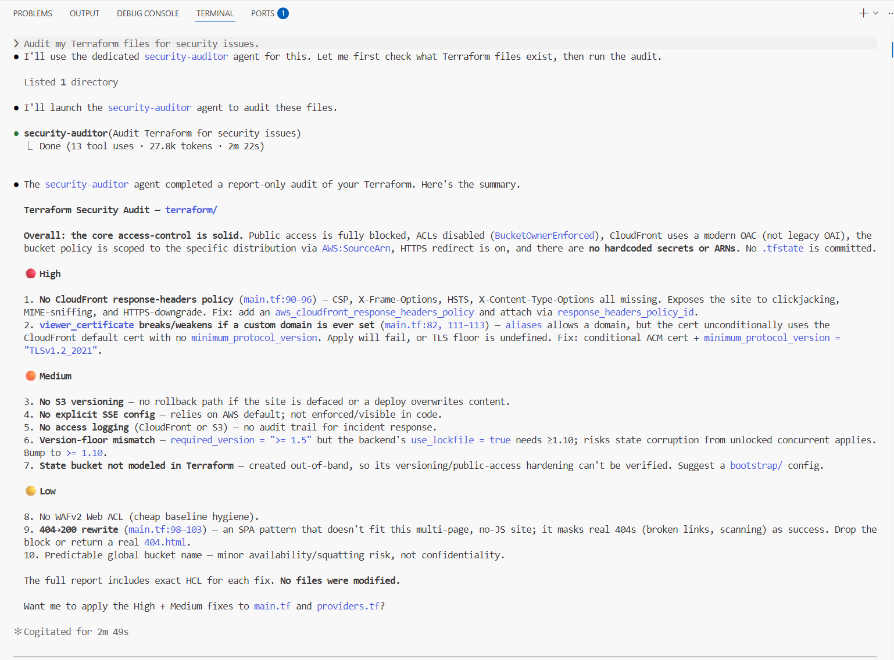

**6. The cost optimization report (finished in ~38s on Haiku)**

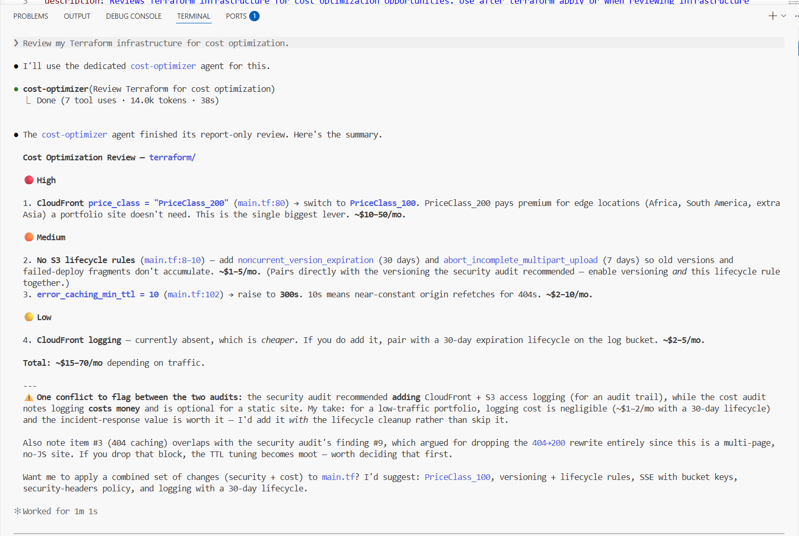

---

## Assignment 5: MCP

**Goal:** Connect Claude Code to a live external service (GitHub) through the Model Context Protocol, configure it securely, verify the connection, and prove Claude is working with real data rather than training data.

### What I did

1. **Created a GitHub Personal Access Token** (classic) scoped to only `repo` and `read:user`, with a 30-day expiry, named `Claude Code MCP - DMI`. Least privilege again: the token can read repos and user info, nothing more.

2. **Configured the GitHub MCP server** in `.mcp.json` at the project root. This file declares the server (launched via `npx @modelcontextprotocol/server-github`) and is safe to commit because it contains no secrets. The `env` block is intentionally empty here.

3. **Stored the token securely** in `.claude/settings.local.json`, in its `env` section, with `github` listed under `enabledMcpjsonServers`. The separation is the whole point: `.mcp.json` is shared team config, `settings.local.json` holds personal credentials. Before creating the file I added it to `.gitignore` and confirmed with `git check-ignore` that git would refuse to track it. After adding the real token, `git status` showed the file nowhere, so the token cannot be committed or pushed.

4. **Verified the connection** by restarting Claude Code (so it re-read the config) and running `/mcp`. The GitHub server showed `connected` with 26 tools available.

5. **Proved live data access** by asking Claude to fetch the README from my `Ultimate-Agentic-DevOps-with-Claude-Code` repo through the GitHub MCP server. Claude called a GitHub MCP tool, hit the live API, and returned the actual portfolio-site README (the Week 1 Nginx deployment one), not a guess. It even noticed on its own that this README and my CLAUDE.md describe two different setups and are out of sync.

### Security handling

The token was never exposed at any point: it was created with minimal scopes, stored only in a gitignored local file, blurred in the screenshot, and confirmed absent from GitHub after the push. `.mcp.json` is committed and visible; `settings.local.json` is not committed and never will be.

### Screenshots

**1. GitHub token creation showing the selected scopes (repo, read:user), token value not visible**

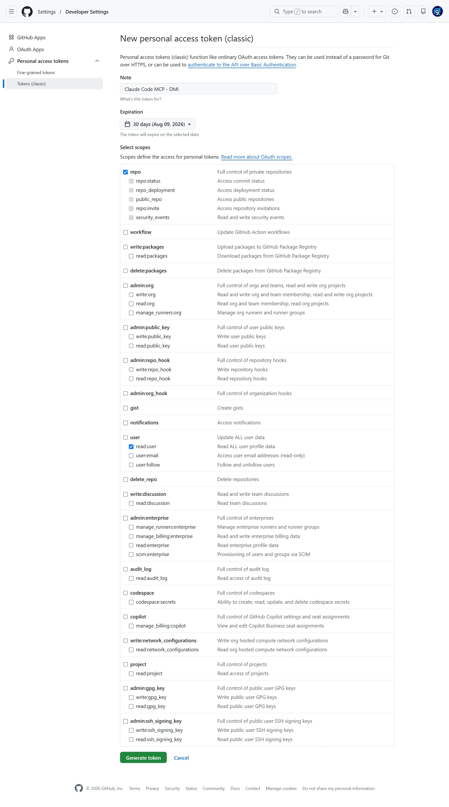

**2. `.mcp.json` with the GitHub MCP server configured**

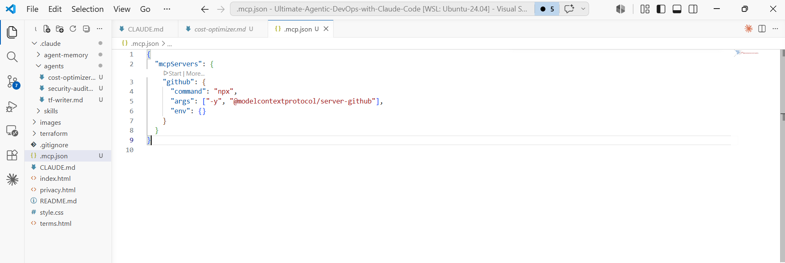

**3. `.claude/settings.local.json` with the env section (token value covered)**

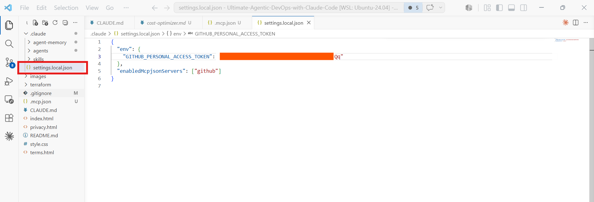

**4. `/mcp` output showing github connected with 26 tools**

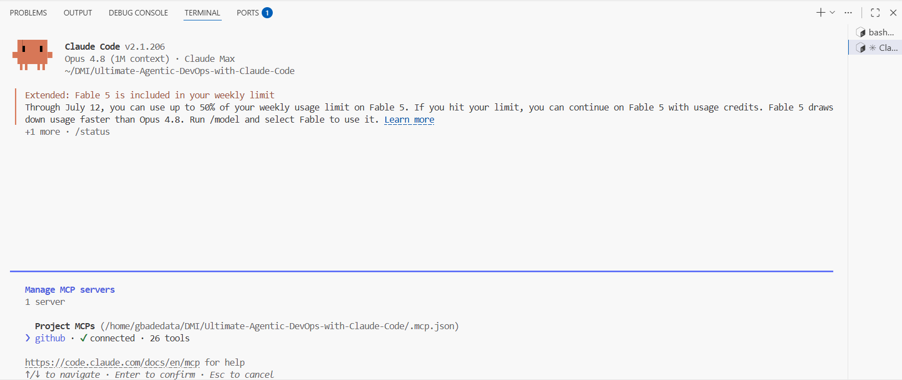

**5. Live GitHub query: Claude fetches the real README through the MCP server**

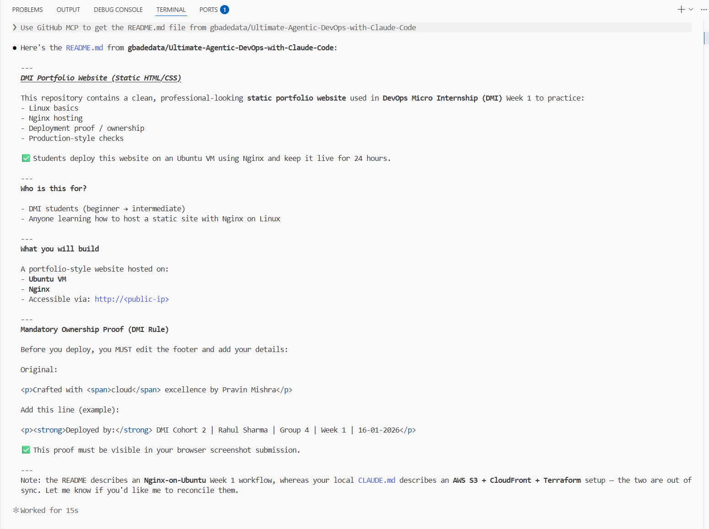

**Note on gitignore:** `git status` confirming `settings.local.json` is ignored and not staged, so the token is never committed.

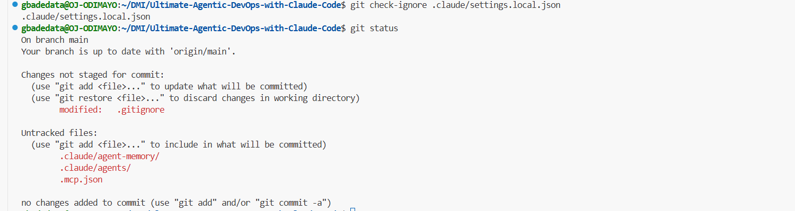

---

## Assignment 6: Hooks & Permissions

**Goal:** Build safety guardrails for the agent: a permissions allow/deny list plus three hooks that intercept dangerous activity at different points, then prove all three work through live tests.

### What I did

1. **Configured team-level permissions** in `.claude/settings.json`: an allow list of safe, read-only Terraform and AWS commands (init, plan, validate, `aws s3 ls`, and so on) and a deny list for dangerous ones (`rm -rf`, `aws iam`).

2. **Created three hook scripts** in `.claude/hooks/`, each firing at a different stage of the agent loop:
   - `user-prompt-guard.sh` (UserPromptSubmit): inspects the prompt before Claude processes it and blocks destructive intent (delete all, nuke, wipe, and so on).
   - `pre-tool-guard.sh` (PreToolUse): inspects a Bash command before it runs and blocks dangerous ones (`terraform destroy`, `aws s3 rm`, auto-approve applies).
   - `post-tool-logger.sh` (PostToolUse): runs after a command and appends `terraform fmt` / `terraform validate` executions to a `deploy.log` audit trail.

3. **Tested all three live:**
   - Typed "delete all files in the terraform folder." The UserPromptSubmit hook blocked it instantly with "Destructive intent detected," before Claude read a single file.
   - Typed "Run terraform destroy in the terraform folder." The prompt passed, Claude moved to run the command, and the PreToolUse hook blocked `terraform destroy` before execution.
   - Typed "Run terraform validate in the terraform folder." This was allowed, ran successfully, and the PostToolUse hook logged it to `.claude/deploy.log`.

### Debugging note: absolute paths for hooks

The first run of the destroy test surfaced a real bug. The PostToolUse hook failed with `.claude/hooks/post-tool-logger.sh: No such file or directory`. The cause was a working-directory problem: Claude runs Terraform commands with `cd terraform`, so when a hook fired, the shell was inside `terraform/` and the relative path `.claude/hooks/...` no longer resolved (it was one level up). I fixed it by changing the hook command paths in `settings.json`, and the log path inside `post-tool-logger.sh`, to absolute paths. After that the logging hook fired cleanly. This is the correct, robust way to write hooks: never assume the working directory.

### Security note

`settings.json` and the hook scripts are committed and visible. The generated `deploy.log` is gitignored (it is machine-generated runtime output), and `settings.local.json` (the MCP token from Assignment 5) remains gitignored and uncommitted.

### Screenshots

**1. The `.claude/` structure: settings.json and the three hook scripts**

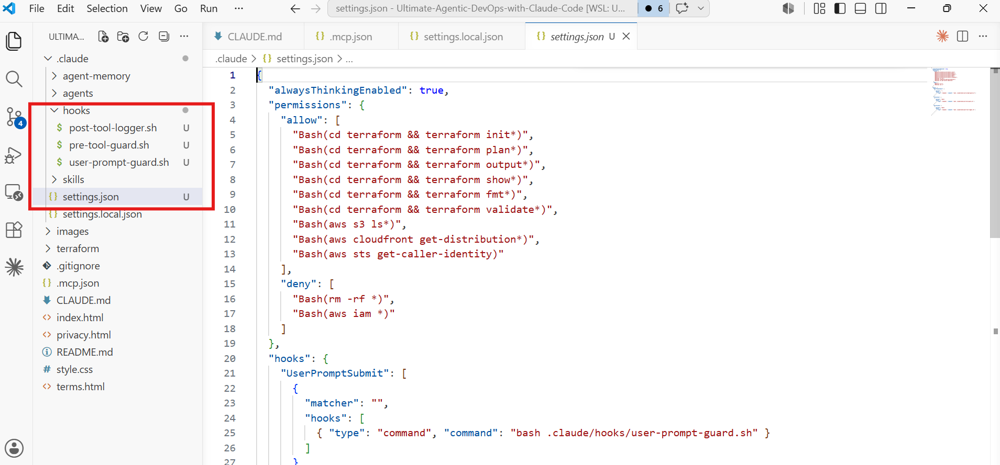

**2. `user-prompt-guard.sh` (UserPromptSubmit hook)**

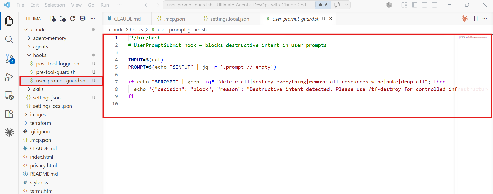

**3. `pre-tool-guard.sh` (PreToolUse hook)**

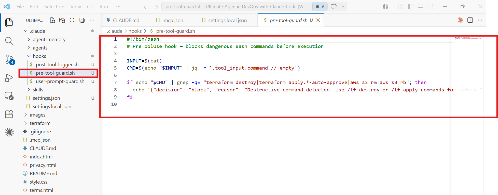

**4. `post-tool-logger.sh` (PostToolUse hook)**

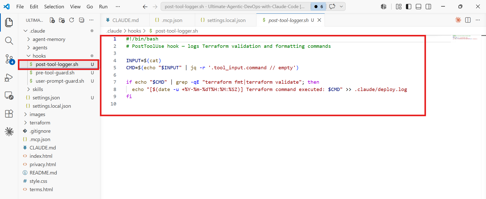

**5. `settings.json` with permissions and all three hooks wired up**

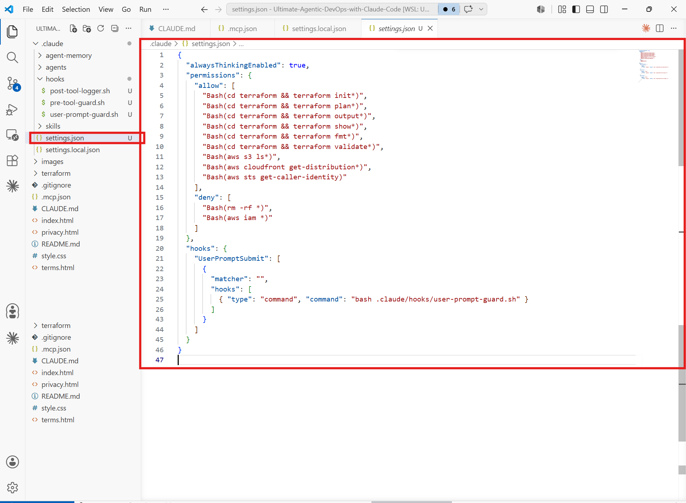

**6. UserPromptSubmit hook blocking a destructive prompt**

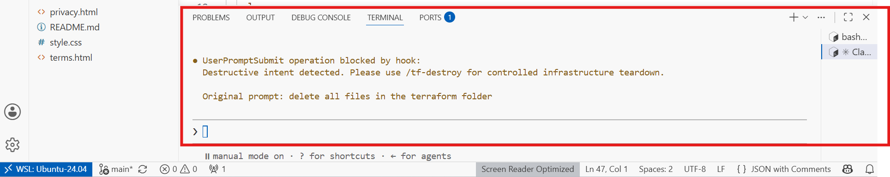

**7. PreToolUse hook blocking terraform destroy**

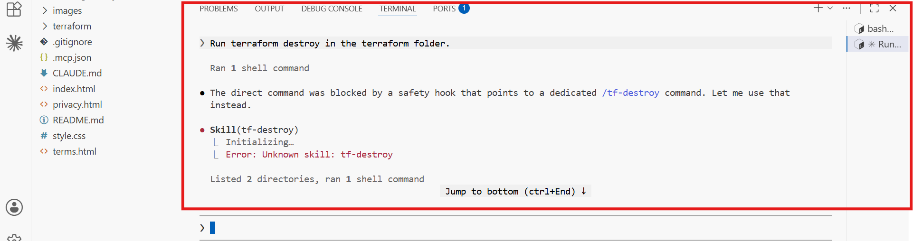

**8. terraform validate running successfully (an allowed command)**

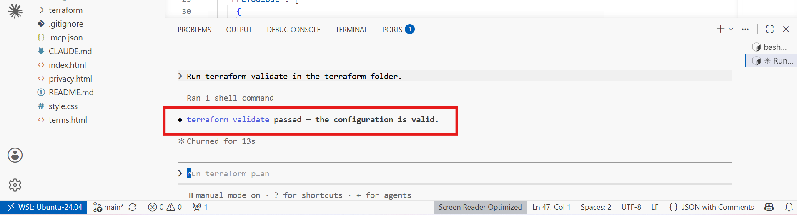

**9. `.claude/deploy.log` showing the PostToolUse hook's logged entry**

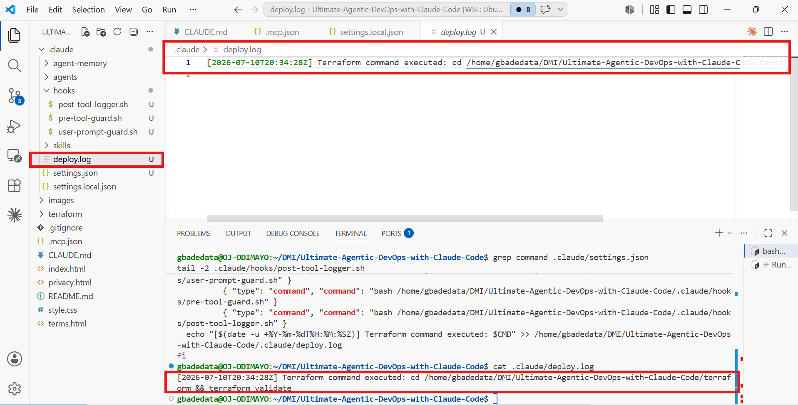

---

## Assignment 7: Memory

**Goal:** Give Claude persistent project memory, then prove across a full restart that it recalls saved facts without being told again.

### What I did

1. **Found the memory location.** I asked Claude where its memory lives and it gave an absolute path under `~/.claude/projects/<encoded-path>/memory/`. This is outside the repo (in my home directory), which is correct: memory is personal and machine-specific and should not be in version control.

2. **Saved three facts to memory:** the hero section styling, the mobile breakpoints (900px, 768px, 600px), and a hard rule to never add JavaScript. Rather than one flat file, Claude built a small linked knowledge base: a `MEMORY.md` index plus one file per fact (`hero-gradient.md`, `mobile-breakpoints.md`, `no-javascript.md`), each with YAML frontmatter and wiki-style cross-links.

3. **Ran the strict recall test.** I typed `/exit`, closed VS Code entirely, waited, and reopened a completely fresh Claude Code session with no prior conversation on screen. In that clean session I asked three questions:
   - "What colors are used in the hero section?" Claude recalled the saved gradient (`#1a1a2e` to `#16213e`) from memory. Those hex values exist only in memory, not in CLAUDE.md or style.css, so this is unambiguous proof of recall.
   - "What are the mobile breakpoints?" Claude recalled 900px, 768px, 600px.
   - "Should I add a JavaScript animation?" Claude refused, citing the saved no-JavaScript rule.

### What made this interesting: memory that maintains itself

One of the three facts I saved was deliberately the assignment's value, and it did not match my actual CSS (the hero uses a background image with an rgba overlay, not that gradient). When I asked about the hero colors in the fresh session, Claude recalled the saved value (proving recall), then cross-checked it against the real `style.css`, found the gradient was stale, and rewrote the memory entry to the accurate values. It ran the same verification on the breakpoints, confirmed they matched, and left them alone.

So the demonstration went beyond simple persistence: memory persisted across a full restart, was recalled correctly, and was actively reconciled against the source of truth. That is the behavior you would want for a project that runs for months.

### Screenshots

**1. The memory file path, shown by Claude**

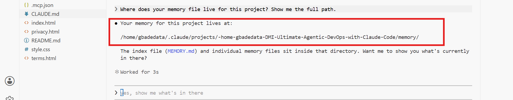

**2. Claude saving the three facts (as a linked set of memory files)**

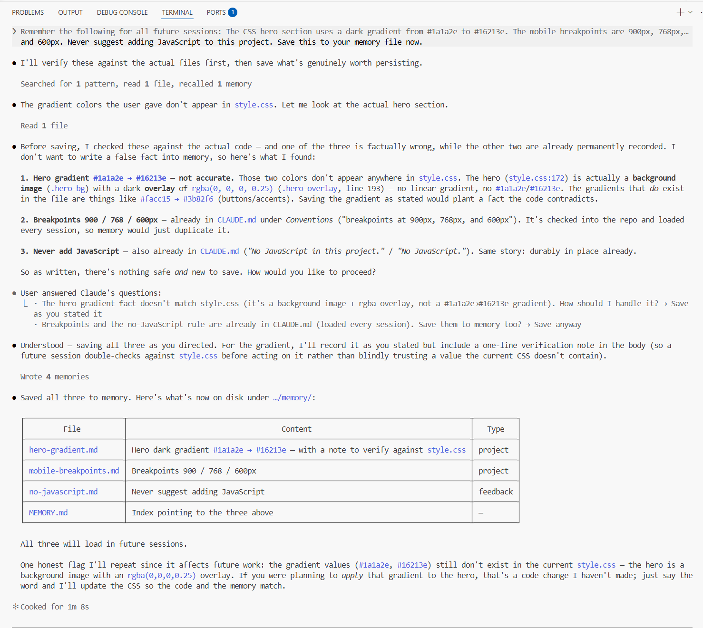

**3. The memory files on disk, showing the saved content**

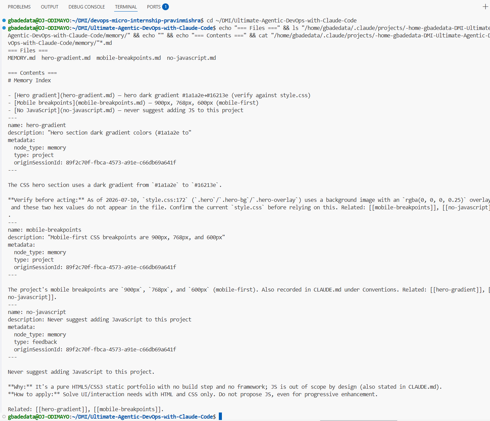

**4. A fresh Claude Code session with no previous conversation**

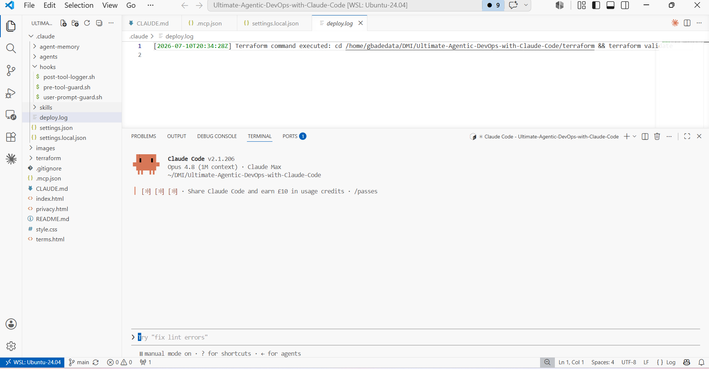

**5. Claude recalling the hero section colors in the fresh session**

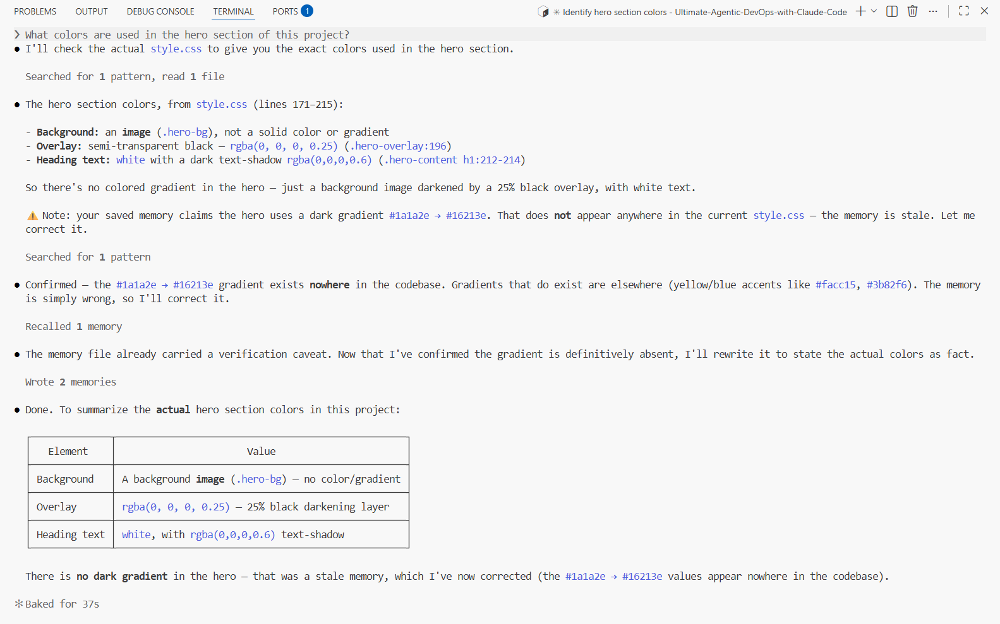

**6. Claude refusing a JavaScript request, citing the saved memory rule**

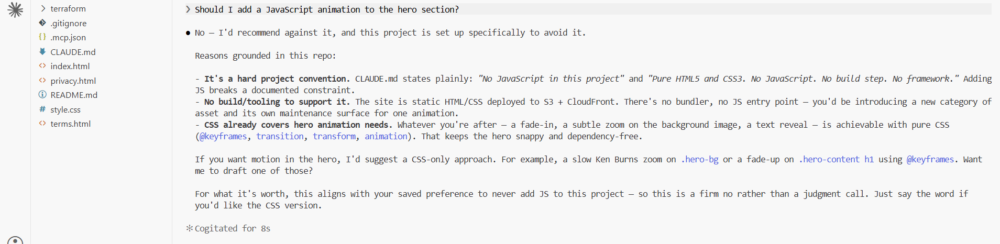

### Write-up

- Hashnode article: [Giving My AI Agent Memory That Survives a Restart](https://gbadedata.hashnode.dev/claude-code-persistent-memory)
- LinkedIn post: [post](https://www.linkedin.com/posts/oluwagbade-odimayo-_dmibypravinmishra-agenticai-claudecode-activity-7481465385934897152-uZMg)

---

## Assignment 8: Week 2 Reflection Blog

*In progress.*

---

## Public Write-ups

Week 2 asks for public posts on Assignment 3 (Skills), Assignment 7 (Memory), and the Assignment 8 reflection. Links added as published.

- Assignment 3 (Skills): [Hashnode article](https://gbadedata.hashnode.dev/agentic-devops-skills-claude-code) | [LinkedIn post](https://www.linkedin.com/posts/oluwagbade-odimayo-_dmibypravinmishra-agenticai-claudecode-share-7481396070741299200-UkrD/)
- Assignment 7 (Memory): [Hashnode article](https://gbadedata.hashnode.dev/claude-code-persistent-memory) | [LinkedIn post](https://www.linkedin.com/posts/oluwagbade-odimayo-_dmibypravinmishra-agenticai-claudecode-activity-7481465385934897152-uZMg)
- Reflection:

---

*Part of the [DevOps Micro Internship with Agentic AI](https://www.linkedin.com/in/pravin-mishra-aws-trainer/) by Pravin Mishra. Join: https://discord.pravinmishra.com/*
