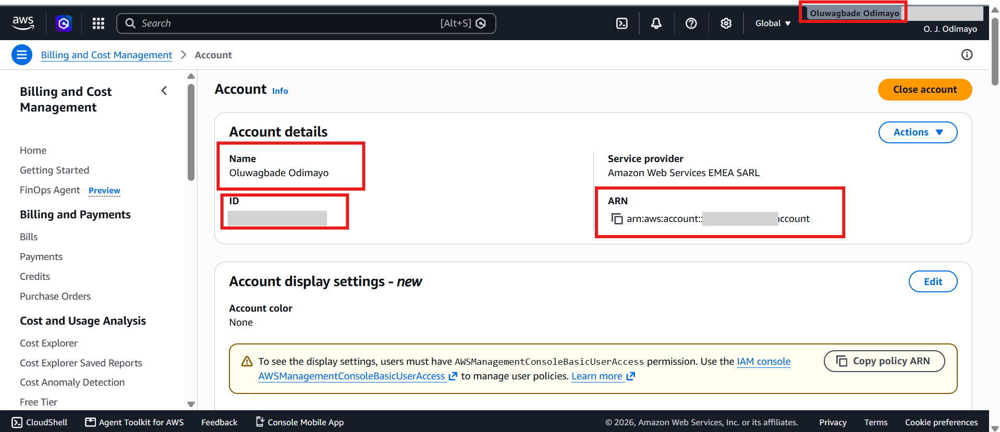

# Assignment 1 — AWS Free Tier Account Setup (EpicReads Cloud Onboarding)

Part of the DevOps Micro Internship (DMI) Cohort 3 with Agentic AI

---

## Purpose

In this assignment, you will create and verify an AWS Free Tier account as part of onboarding EpicReads — an online bookstore moving to the cloud. You will demonstrate an understanding of AWS fundamentals, Free Tier services, and account setup by answering conceptual questions and capturing proof of a working AWS Console login.

---

# Task 1 — Understanding AWS & Free Tier

## Goal

Demonstrate understanding of AWS basics and Free Tier usage by answering the following questions in your own words (3–4 lines each).

### Answers

#### Question 1 — What is an AWS account, and why do you need it at this stage?

An AWS account is the container that holds my cloud resources, my identity and my billing. Everything I create, an EC2 server, an S3 bucket, a security group, lives inside it and is billed to it. I need one at this stage because EpicReads is moving to the cloud, so from this week I stop practising locally and start provisioning real infrastructure that has a public IP and a real cost attached to it.

---

#### Question 2 — What is AWS Free Tier, and how long does it last?

AWS Free Tier is the programme that lets new customers use AWS at no cost while they learn, and it changed on 15 July 2025. Accounts created before that date sit on the legacy model: 12 months of service-specific free usage, plus always-free offers that never expire. Accounts created after it get a credit-based Free Plan instead: 100 USD in credits at sign-up, up to 100 USD more from onboarding activities, and the plan ends after 6 months or when the credits run out, whichever comes first. Over 30 services keep an always-free offer beyond both.

---

#### Question 3 — Name three AWS Free Tier services and their free usage limits.

On the legacy 12-month tier: EC2 gives 750 hours per month of a t2.micro or t3.micro instance, S3 gives 5 GB of standard storage with 20,000 GET and 2,000 PUT requests, and RDS gives 750 hours per month of a db.t3.micro with 20 GB of storage. Separately, the always-free offers do not expire: Lambda gives 1 million requests and 400,000 GB-seconds of compute per month, and DynamoDB gives 25 GB of storage. On a post-July-2025 account the EC2 and RDS hours are not free outright, they are drawn from the credit balance instead.

---

# Task 2 — Create AWS Free Tier Account

## Goal

Create a valid AWS Free Tier account and sign in to the AWS Management Console.

I used my existing AWS account rather than creating a new one. It predates the July 2025 Free Tier change and is on pay-as-you-go billing, so no Free Tier credits apply to it. Console access and account ownership are verified in Task 3.

> No screenshots required for this task. Completion is verified through Task 3.

---

# Task 3 — Verify AWS Account

## Goal

Confirm that your AWS account setup is complete by navigating to the Account section and capturing proof.

### Evidence

#### Screenshot 1 — AWS Account page showing account name (email may be blurred)

---

# Submission Instructions

- Add all required screenshots in your GitHub repository submission
- Full name must be visible in required screenshots
- Do not expose sensitive information (keys, passwords, account IDs)

---

# Completion Checklist

- [x] Task 1 answers written in own words
- [x] AWS Free Tier account created successfully
- [x] Signed in to AWS Management Console
- [x] Screenshot of AWS Account page captured (full name visible, no sensitive data)
- [x] All required screenshots added to repository

---

## 📌 About DMI & CloudAdvisory

DevOps Micro Internship (DMI) is a project-based DevOps program run by Pravin Mishra (The CloudAdvisory) focused on real-world execution, systems thinking, and career readiness.

It helps learners build strong DevOps foundations with hands-on experience.

---

## 📌 Resources

- 🌐 DMI Official Website: https://pravinmishra.com/dmi  
- 🎓 DevOps for Beginners (Udemy): https://www.udemy.com/course/devops-for-beginners-docker-k8s-cloud-cicd-4-projects/  
- 🎓 Agentic AI DevOps with Claude Code: https://www.udemy.com/course/ultimate-agentic-ai-devops-with-claude-code/  
- 🎓 DevOps with Claude Code: Terraform, EKS, ArgoCD & Helm: https://www.udemy.com/course/devops-with-claude-code-terraform-eks-argocd-helm/  
- ▶️ YouTube Playlist: https://www.youtube.com/playlist?list=PLFeSNDtI4Cho  
- 🔗 Pravin Mishra (LinkedIn): https://www.linkedin.com/in/pravin-mishra-aws-trainer/  
- 🏢 CloudAdvisory (LinkedIn): https://www.linkedin.com/company/thecloudadvisory/

---

*This submission is part of DevOps Micro Internship (DMI) Cohort 3 — Agentic AI Track.*