# Assignment 3 — Production Maintenance Drill (OPS Checklist)

Part of the DevOps Micro Internship (DMI) Cohort 3 with Agentic AI

---

## Purpose

In this assignment, you will treat your already deployed React application (on Ubuntu VM with Nginx) as a live production system. You will perform structured operational checks covering network validation, service health, log analysis, resource monitoring, configuration verification, and incident simulation with recovery — mirroring real on-call DevOps responsibilities.

---

# Task 1 — Server Access & Networking Validation

## Goal

Verify that the deployed React application is reachable from the browser and confirm basic network connectivity of the Ubuntu VM.

### Evidence

#### Screenshot 1 — Browser showing the React app with your Full Name visible on the UI

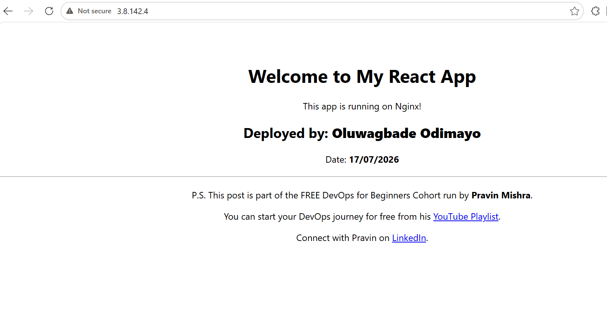

---

#### Screenshot 2 — Output of `ip a`

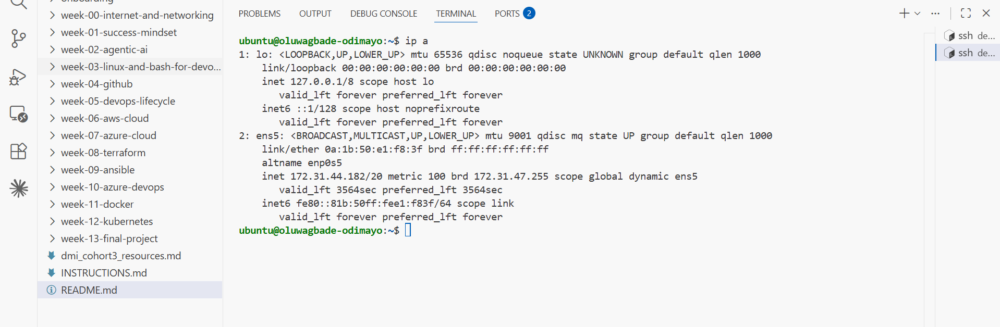

---

#### Screenshot 3 — Output of `sudo ss -tulpen`

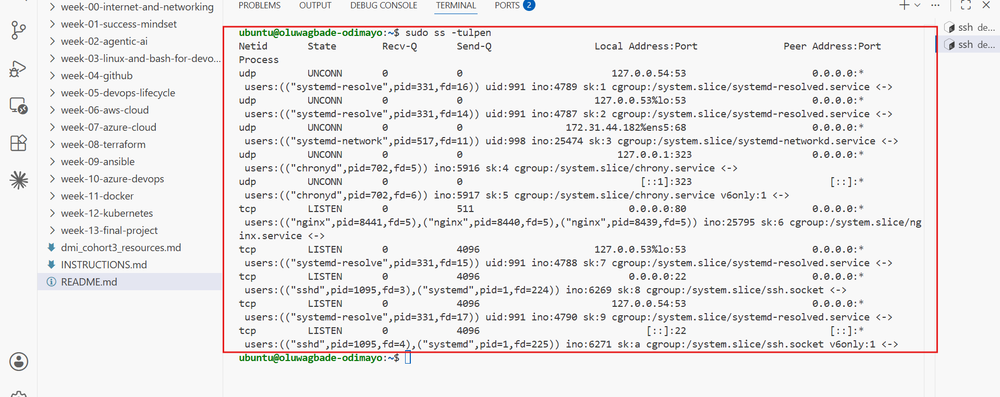

---

#### Screenshot 4 — Output of `sudo ufw status`

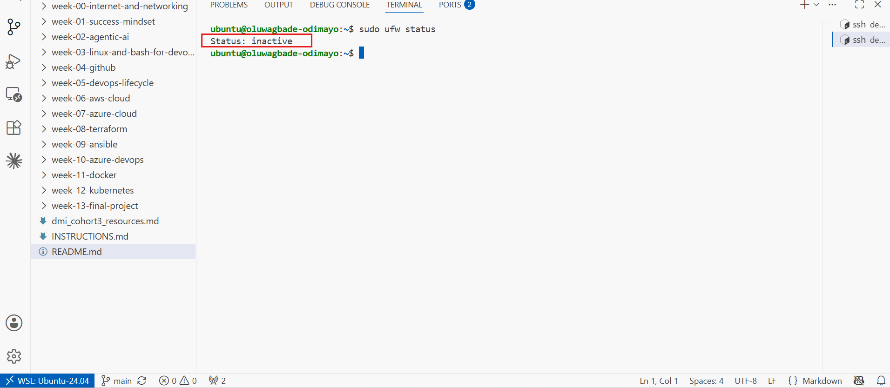

---

### Notes

Answer the following in your own words:

**1. What proves Nginx is listening on 0.0.0.0:80?**

The `ss -tulpen` output has the line `tcp LISTEN 0 511 0.0.0.0:80 0.0.0.0:*` with `users:(("nginx",pid=8441),("nginx",pid=8440),("nginx",pid=8439))`. Three things in that line prove it: the state is LISTEN, the local address is `0.0.0.0:80` rather than `127.0.0.1:80`, and the process holding the socket is nginx. `0.0.0.0` means every interface on the box, so the socket is reachable from outside and not just from localhost. The narrower `ss -lptn '( sport = :80 )'` returns the same single line, and the three PIDs match the master and two worker processes shown in `systemctl status nginx`.

---

**2. What proves SSH is active on port 22?**

`ss -tulpen` shows `tcp LISTEN 0 4096 0.0.0.0:22` owned by `("sshd",pid=1095)` and `("systemd",pid=1)`, plus a matching `[::]:22` line for IPv6. The systemd entry alongside sshd shows this is socket activation through `ssh.socket` rather than a permanently running daemon. The strongest proof is not in the output at all though: I am reading that output through an SSH session into this box, so port 22 is demonstrably accepting connections and authenticating my key.

---

**3. Did you find any unexpected open ports? Explain briefly.**

No. Only two sockets listen on `0.0.0.0`, and both are intentional: port 80 for nginx serving the React app, and port 22 for my SSH access. Everything else is bound to loopback or link-local and cannot be reached from the internet: `127.0.0.53:53` and `127.0.0.54:53` are the systemd-resolved DNS stub, `127.0.0.1:323` and `[::1]:323` are chronyd doing NTP, and `172.31.44.182%ens5:68` is the DHCP client holding its lease. Worth noting that `ufw status` returns `Status: inactive`. The host firewall is off, which is the Ubuntu default on an EC2 AMI, because the AWS security group filters traffic before it ever reaches the instance. So I have two firewalls available and only one of them is doing the work.

---

# Task 2 — Service Health & Systemd Validation (Nginx)

## Goal

Verify that Nginx is properly installed, running, enabled at boot, and safely configured.

### Evidence

#### Screenshot 1 — Output of `systemctl status nginx --no-pager`

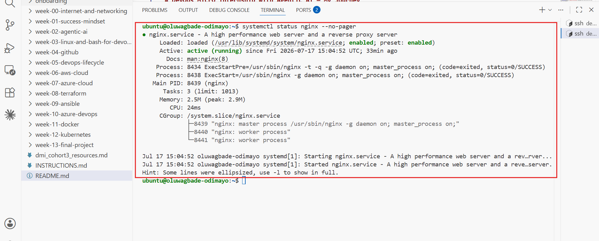

---

#### Screenshot 2 — Output of `sudo nginx -t`

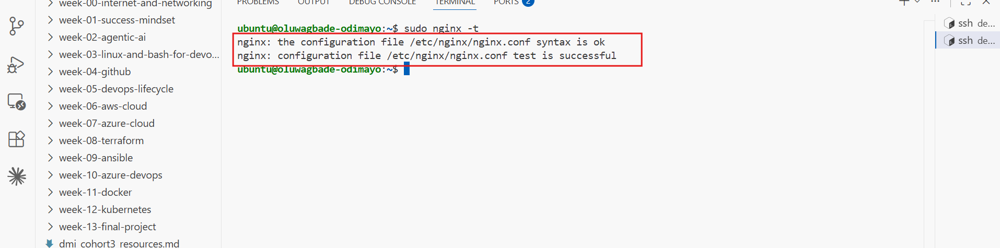

---

#### Screenshot 3 — Output of `sudo ss -lptn '( sport = :80 )'`

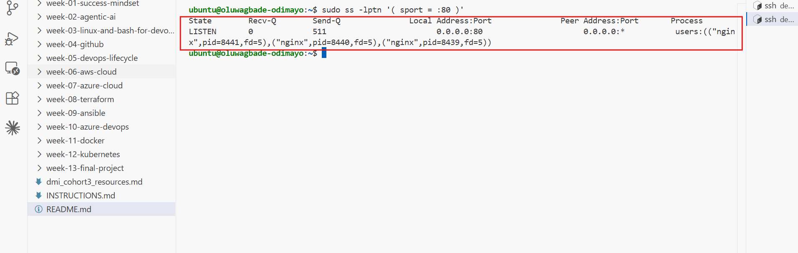

---

### Notes

Answer the following in your own words:

**1. What happens if Nginx fails to restart in production?**

The site goes down, and it stays down. `systemctl restart` stops the running process before it starts the new one, so if the new config is invalid nginx never comes back up and there is nothing left serving. Users get connection refused rather than a stale page. That failure mode is worse than it sounds because the restart looks like a routine action, so the outage arrives at a moment nobody is watching for it. This is why `nginx -t` belongs before every restart, and why `reload` is safer than `restart` for config changes: reload keeps the old workers alive until the new ones are ready.

---

**2. What's your basic rollback plan?**

Back the config up before touching it: `sudo cp /etc/nginx/sites-available/default /etc/nginx/sites-available/default.bak`. If `nginx -t` fails, restore with `sudo cp default.bak default`, re-run `nginx -t` to confirm syntax is ok, then `sudo systemctl reload nginx`. For the application itself, the production build stays at `~/my-react-app/build`, so the content can be redeployed with a single `sudo cp -r build/* /var/www/html/`. Either way the rollback is not finished until `curl -I http://localhost` returns `200 OK`. Restoring a file is not the same as restoring the service, and only the verification step proves it.

---

# Task 3 — Logs & Request Trace

## Goal

Verify real traffic flow and analyze logs to understand system behavior and errors.

### Evidence

#### Screenshot 1 — Output of `sudo tail -n 30 /var/log/nginx/access.log`

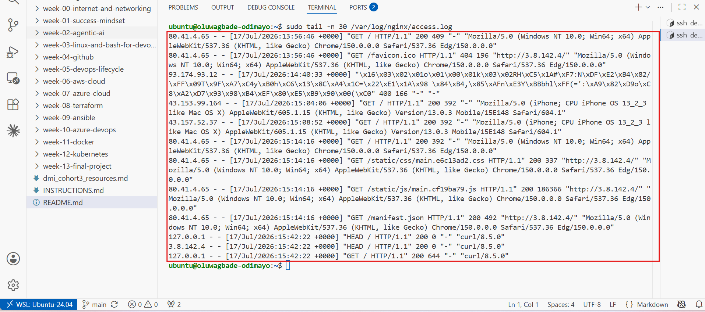

---

#### Screenshot 2 — Output of `sudo tail -n 30 /var/log/nginx/error.log`

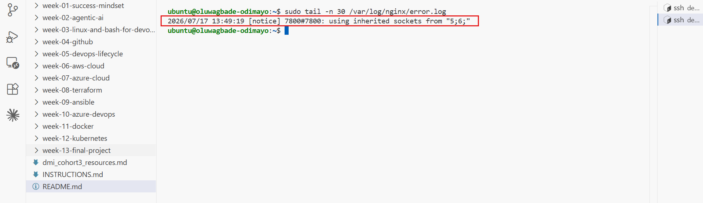

---

#### Screenshot 3 — Output of `sudo journalctl -u nginx --no-pager -n 50`

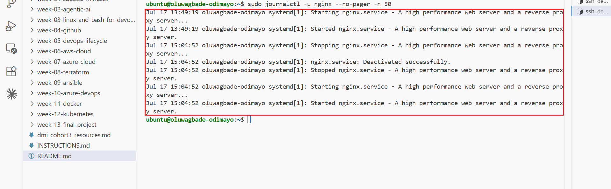

---

### Notes

Answer the following in your own words:

**1. Were there any errors in the logs?**

- If yes, mention 1–2 example error lines from the logs and explain what each one means in simple terms.
- If no, explain what it means if the error log is empty or shows no recent errors during your check.

The error log is nearly silent. Its only entry is `2026/07/17 13:49:19 [notice] 7800#7800: using inherited sockets from "5;6;"`, and that is a `[notice]`, not an error. It records nginx taking over listening sockets that systemd had already opened via socket activation, which is normal startup behaviour.

The access log is where the real non-200 responses are, and there are two worth explaining:

`80.41.4.65 - - [17/Jul/2026:13:56:46 +0000] "GET /favicon.ico HTTP/1.1" 404 196` means my own browser asked for the site icon and nginx could not find the file. At 13:56 the web root still held the default nginx welcome page, which ships no favicon. It resolved itself once I deployed the React build, which does include one.

`93.174.93.12 - - [17/Jul/2026:14:40:33 +0000] "\x16\x03\x01\x00\x02\x01..." 400 166` is more interesting. Those leading bytes are not text, they are a TLS ClientHello: `0x16` is the TLS handshake record type and `0x03 0x01` is the version. Something tried to speak HTTPS at my plain HTTP port, so nginx could not parse it as a request and returned `400 Bad Request`. That is nginx behaving correctly against a client that guessed wrong.

---

**2. If there were no errors, what does that indicate about the system?**

It indicates nginx started cleanly and has not hit a config, permission or file-not-found problem since. But a quiet error log is weak evidence on its own, and it is worth being precise about why. The error log only records nginx failing at nginx's level. It says nothing about whether anyone can reach the box, whether the security group is open, or whether the app renders correctly. A server with a perfect error log and a closed firewall looks identical to a healthy one from that file alone. Absence of errors is not presence of health. You need the access log showing real requests, and a `200` with a plausible body size, before you can claim the thing is actually working.

---

**3. Based on the access logs, were your curl requests visible in the log entries? What does that prove about traffic flow?**

Yes, all three appear at `15:42:22`:

- `127.0.0.1 - - "HEAD / HTTP/1.1" 200 0 "-" "curl/8.5.0"`
- `3.8.142.4 - - "HEAD / HTTP/1.1" 200 0 "-" "curl/8.5.0"`
- `127.0.0.1 - - "GET / HTTP/1.1" 200 644 "-" "curl/8.5.0"`

That proves the request path end to end: the request arrived, nginx matched it against the server block, served a response, and wrote the transaction to disk. Three details make it stronger. The `200 644` matches `index.html` at exactly 644 bytes in `ls -lah /var/www/html`, so the bytes on disk are the bytes going out. The `HEAD` requests return `200 0` because HEAD by definition returns headers with no body, which is why they cost nothing to run. And the second line logs a client address of `3.8.142.4`, my own public IP, not `127.0.0.1`: that request left the instance, went out to the internet, came back in through the security group on port 80 and hit nginx from the outside. Localhost only proves nginx is alive. That line proves the whole network path works.

The log also shows traffic I never asked for. `43.153.99.164` and `43.157.52.37` both requested `/` with identical iPhone user agents, and `93.174.93.12` sent the malformed TLS handshake. Nobody was given this IP. The box has been publicly reachable for roughly two hours and is already being scanned by bots sweeping the address range.

---

# Task 4 — System Resource Health Check (Capacity Red Flags)

## Goal

Assess server capacity and detect potential performance or failure risks.

### Evidence

#### Screenshot 1 — Output of `uptime`

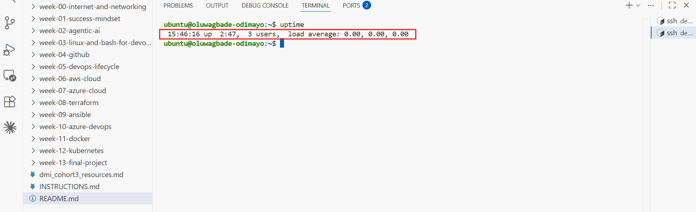

---

#### Screenshot 2 — Output of `free -h`

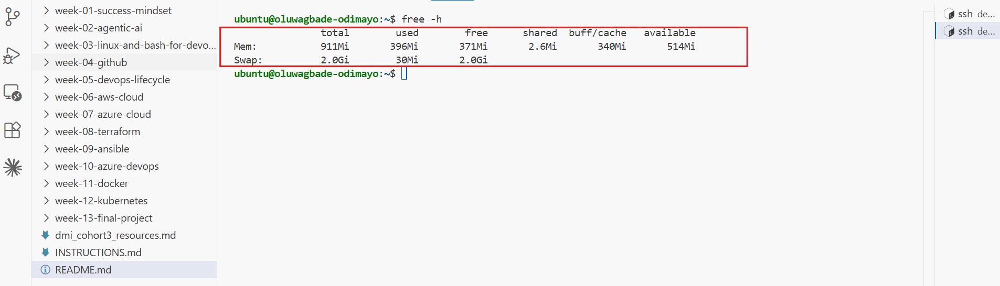

---

#### Screenshot 3 — Output of `df -h`

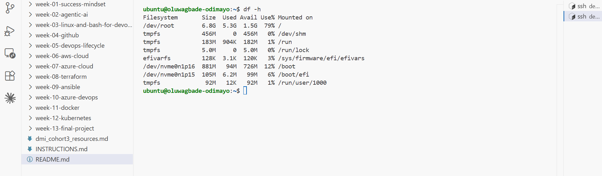

---

#### Screenshot 4 — Output of `sudo du -sh /var/* | sort -h`

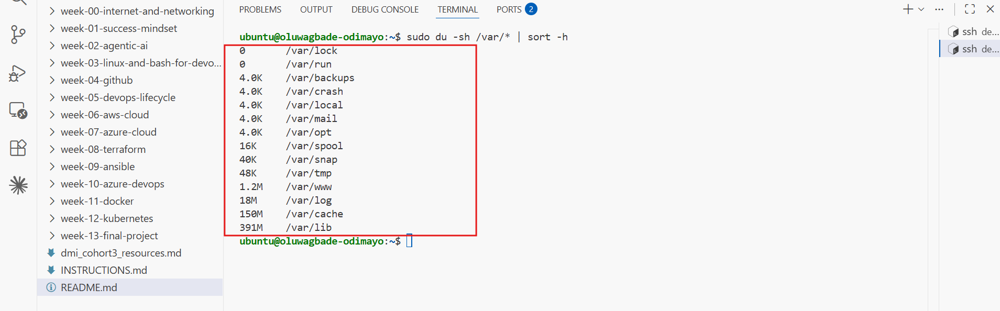

---

### Notes

Answer the following in your own words:

**1. Which resource looks most critical right now? (CPU/load, memory, or disk) Explain why.**

Disk, and it is not close.

`df -h` shows `/dev/root` at **79% used**: 5.3G consumed of 6.8G, with 1.5G available. That is the only figure anywhere near a threshold.

CPU is idle. `uptime` reports `load average: 0.00, 0.00, 0.00` across one, five and fifteen minutes, on a box that has been up 2:47. A static site served by nginx costs almost nothing to run.

Memory is fine but tight by design. `free -h` shows 911Mi total with 514Mi available, and the 2.0Gi swap I added is barely touched at 30Mi. It earned its place during `npm run build` and now sits as headroom.

`du -sh /var/*` shows where the disk went: `/var/lib` 391M, `/var/cache` 150M, `/var/log` 18M, `/var/www` only 1.2M. So the deployed site is a rounding error. The weight is apt's package cache and library state, plus `node_modules` in my home directory outside `/var` entirely. With 1.5G left, a couple more `npm install` runs or an unrotated log would put this box in real trouble.

---

**2. What happens if disk becomes 100% full in a production server?**

Writes start failing, and the failures do not look like disk failures. Nginx cannot append to `access.log` or `error.log`, so you lose your observability at the exact moment you need it most. Applications cannot write temp files, sessions or uploads. `apt` and deployments fail partway through. Databases refuse writes or corrupt. `systemd-journald` stops recording, so even the system's own account of what went wrong has a hole in it.

The nastiest part is the diagnosis. A full disk surfaces as unrelated-looking errors scattered across every service, so you burn time chasing symptoms before checking `df -h`. And recovery needs a shell, which may itself fail if the login process cannot write. On this box the realistic culprit would be `/var/log` growing unbounded, which is exactly what logrotate exists to prevent.

---

# Task 5 — Configuration & Deployment Verification

## Goal

Ensure the correct React build is deployed and Nginx is serving it properly.

### Evidence

#### Screenshot 1 — Output of `ls -lah /var/www/html | head -n 20`

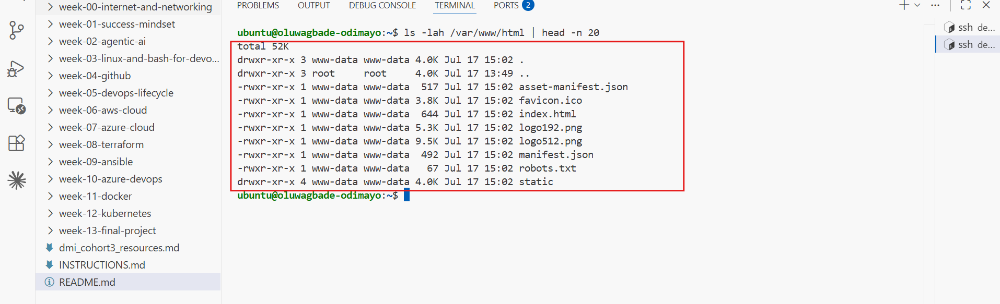

---

#### Screenshot 2 — Output of `grep -R "Deployed by" -n /var/www/html 2>/dev/null | head`

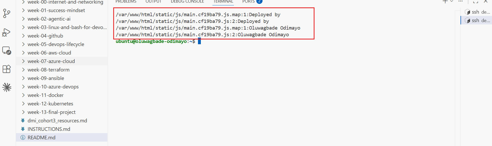

---

#### Screenshot 3 — Output of `grep -n "try_files" /etc/nginx/sites-available/default`

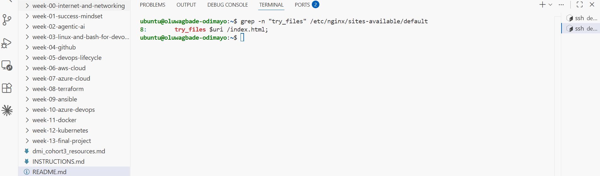

---

### Notes

Answer the following in your own words:

**1. How do you confirm that the correct version of the application is deployed?**

Three independent checks, each answering a different question.

**Are the right files there?** `ls -lah /var/www/html` lists `index.html`, `asset-manifest.json`, `favicon.ico` and `static/`, all timestamped `Jul 17 15:02`, which matches when I ran the deploy, and all owned `www-data:www-data`. Right files, right time, right owner.

**Is it the right build?** `grep -R "Deployed by" -o -n /var/www/html` returns:

```
/var/www/html/static/js/main.cf19ba79.js.map:1:Deployed by
/var/www/html/static/js/main.cf19ba79.js:2:Deployed by
```

and grepping my name returns `Oluwagbade Odimayo` from the same two files. This matters more than checking `App.js`, because the browser never runs `App.js`. It runs that minified bundle. Grepping the bundle proves my edit survived the webpack build rather than just existing in source.

Three details in that output are worth reading properly. The match is at line **2** of the `.js`, not line 1, because webpack puts a license banner comment on line 1 and then emits the entire application as one enormous line 2. The `cf19ba79` in the filename is a content hash, so any change to the source produces a different filename, and an unchanged hash means unchanged code. And the match also appears in `main.cf19ba79.js.map`, the source map, which webpack deploys alongside the bundle. That is a small thing worth noticing: source maps let anyone reconstruct my original unminified source from the public site. Harmless here, but on a real product that is an information leak you would strip before shipping.

**Does it actually serve?** The browser at `http://3.8.142.4` renders my name and date, and the access log shows `"GET / HTTP/1.1" 200 644`, where 644 matches `index.html` byte for byte in `ls -lah`. Files on disk prove nothing if nginx is pointed elsewhere. Only the rendered page proves all three layers agree.

---

# Task 6 — Nginx Configuration Failure Simulation

## Goal

Simulate a real-world Nginx misconfiguration and recover the service safely.

### Evidence

#### Screenshot 1 — Output of `sudo nginx -t` showing the syntax error (broken config)

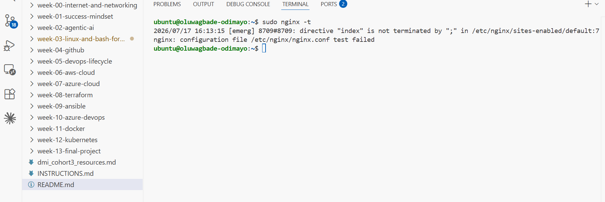

---

#### Screenshot 2 — Output of `sudo nginx -t` showing syntax ok (fixed config)

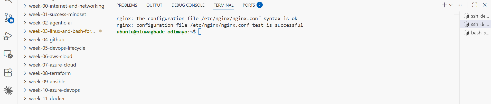

---

#### Screenshot 3 — Output of `curl -I http://<public-ip>` confirming recovery (200 OK)

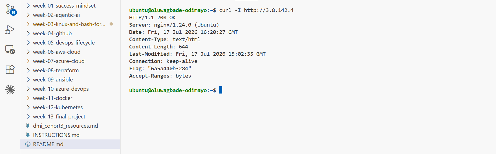

---

### Notes

Answer the following in your own words:

**1. What caused the configuration failure?**

I removed the semicolon from the end of the `index index.html;` directive using `sed`, simulating the single most common cause of a real nginx outage. `sudo nginx -t` then returned:

```
2026/07/17 16:13:15 [emerg] 8709#8709: directive "index" is not terminated by ";" in /etc/nginx/sites-enabled/default:7
nginx: configuration file /etc/nginx/nginx.conf test failed
```

Two details in that message are worth reading carefully.

**It says `sites-enabled`, but I edited `sites-available`.** That is not a mistake. `sites-enabled/default` is a symlink to `sites-available/default`, and `nginx.conf` only ever includes `sites-enabled/`. That is the whole point of the convention: `sites-available` is the library of every config you have, `sites-enabled` is the subset currently switched on, and the symlink between them lets you enable or disable a site without deleting anything.

**It says line 7, but my mistake is on line 5.** The parser reads `index index.html`, finds no `;`, and keeps consuming tokens looking for one. It only gives up when it reaches `{` on line 7, which cannot possibly continue an `index` directive. So the reported line number is where parsing broke, not where I erred. That is a genuinely useful debugging habit to carry: when nginx points at a line that looks fine, the real fault is above it.

`[emerg]` is nginx's highest severity level. It means the configuration is unloadable, not merely suspect.

---

**2. How did you fix the issue?**

My first attempt failed, and that turned out to be the most valuable part of this task.

I restored from the backup I had taken before editing, `sudo cp default.bak default`, re-ran `nginx -t`, and got the **exact same `[emerg]` error**. The rollback did nothing at all. One command found the reason:

```
$ grep -n "index index.html" /etc/nginx/sites-available/default.bak
5:    index index.html
```

No semicolon. **My backup was the broken file.** I had run the break block twice. The second run copied `default` to `default.bak` while `default` was already broken, silently overwriting my only good copy, and the `sed` that followed was a no-op because `index index.html;` no longer matched anything. I destroyed my own rollback and did not discover it until the moment I needed it.

The real fix was to stop trusting the backup and rebuild the config from a known-good source, rewriting all twelve lines with `tee`, then re-taking the backup **from the verified file** rather than from whatever happened to be sitting on disk:

```bash
echo 'server { ... }' | sudo tee /etc/nginx/sites-available/default > /dev/null
sudo cp /etc/nginx/sites-available/default /etc/nginx/sites-available/default.bak
sudo nginx -t              # syntax is ok / test is successful
sudo systemctl reload nginx
curl -I http://3.8.142.4   # HTTP/1.1 200 OK
```

Worth noting what did not happen: the site never went down. `nginx -t` reads the file from disk without touching the running process, and the previously loaded config stayed in memory serving traffic throughout. The config on disk was broken for roughly nine minutes and no user would have noticed, because I never restarted while it was broken.

---

**3. How can you avoid this kind of issue in real production systems?**

**Always run `nginx -t` before reloading.** This is the whole lesson of the task. The test is free, reads from disk, and cannot affect the running service. It caught a fatal config error while the site carried on serving from the old config in memory. Restarting first and testing afterwards inverts that into an outage.

**Reload, do not restart.** `reload` starts new workers on the new config and retires the old ones only once the new ones are up. `restart` stops everything first, so a bad config means the service simply never comes back.

**Never write to a fixed backup filename.** This is what actually bit me. `cp default default.bak` feels like safety and is a footgun: run it twice and the second run overwrites the good copy with the broken one. `sudo cp default default.$(date +%F-%H%M%S).bak` gives every backup a new name so nothing can clobber history. `cp -n` refuses to overwrite at all.

**The deeper point: an untested rollback is a hope, not a plan.** I had a backup and I had a rollback procedure. Both were worthless, because I had never verified the backup was good. The failure surfaced at the exact moment I was depending on it. In production, that moment is an incident with users watching.

**Stop hand-editing configs on the box.** Everything above is compensating for a bad workflow. The config belongs in version control and gets deployed, so history cannot be silently overwritten, every change is diffable and attributable, and rollback means checking out the previous commit rather than trusting a `.bak` that may or may not be what you assume it is.

---

# Task 7 — Web Application Failure Simulation

## Goal

Simulate missing deployment content and recover the application safely.

### Evidence

#### Screenshot 1 — Output of `curl -I http://<public-ip>` showing failure (non-200 response)

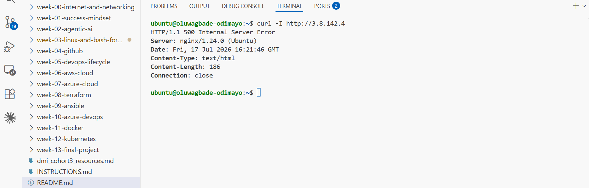

---

#### Screenshot 2 — Output of `curl -I http://<public-ip>` confirming recovery (200 OK)

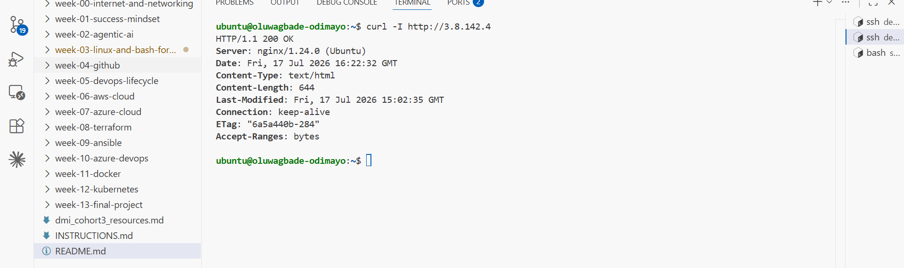

---

### Notes

Answer the following in your own words:

**1. What caused the application to break in this scenario?**

I moved the deployed entry point out of the web root:

```bash
sudo mv /var/www/html/index.html /var/www/html/index.html.bak
```

`curl -I http://3.8.142.4` then returned:

```
HTTP/1.1 500 Internal Server Error
Server: nginx/1.24.0 (Ubuntu)
Content-Length: 186
Connection: close
```

**I expected 404. Getting 500 is the interesting part, and the cause is my own config.**

A missing file should be a `404`. Instead nginx fell into an internal redirect loop:

1. `GET /` matches `location /`, which runs `try_files $uri /index.html;`
2. `$uri` is `/`, which resolves to a directory rather than a file, so that check fails
3. The last argument of `try_files` is a fallback, so nginx internally redirects to `/index.html`
4. `/index.html` no longer exists, so `location /` matches again, `try_files` runs again, and it falls back to `/index.html` again
5. Steps 3 and 4 repeat. Nginx caps internal redirects at 10, then abandons the request and returns `500`

I did not have to infer any of that. Nginx logged the loop by name in `/var/log/nginx/error.log`:

```
2026/07/17 16:21:46 [error] 8773#8773: *10 rewrite or internal redirection cycle while internally
redirecting to "/index.html", client: 3.8.142.4, server: _, request: "HEAD / HTTP/1.1", host: "3.8.142.4"
```

That single line names the failure mode (`rewrite or internal redirection cycle`), the file it was looping on (`/index.html`), and the request that triggered it. It is also a reminder of why Task 3 mattered: the access log told me *that* something returned 500, but only the error log told me *why*. Two files, two different jobs.

`error_page 404 /index.html;` points at the same absent file, so the escape hatch was missing too. `Content-Length: 186` is nginx's stock 500 page, which is what you get when there is no application left to render anything.

The lesson is sharper than "a file went missing". **The exact configuration that makes React client-side routing work is what turned a missing file into a server error.** `try_files ... /index.html` exists so that any unmatched URL falls back to the SPA entry point. That fallback cannot catch the entry point itself being gone, so a benign 404 escalates into a 500. Every single-page-app config has this property and almost nobody notices until they see it happen.

---

**2. How did you fix the issue and restore the application?**

```bash
sudo mv /var/www/html/index.html.bak /var/www/html/index.html
curl -I http://3.8.142.4
```

```
HTTP/1.1 200 OK
Content-Length: 644
Last-Modified: Fri, 17 Jul 2026 15:02:35 GMT
ETag: "6a5a440b-284"
```

Three details prove this is a real recovery rather than a plausible-looking one.

**No nginx restart was needed.** Nginx resolves files from disk on every request, so it never cached the absence. The moment the file existed again, the next request succeeded. Restarting would have been cargo-cult troubleshooting: the service was never the problem.

**`Content-Length: 644` matches `index.html` byte for byte** in `ls -lah /var/www/html`, so the file that came back is the file that left.

**`Last-Modified: 15:02:35` is my original deploy timestamp**, not the time of the restore. That proves I put the same artifact back rather than regenerating something new that merely happens to work.

I used `mv` here rather than `cp`, deliberately, having just been burned in Task 6. `mv` relocates the file, so the original is always exactly one command away and nothing can be overwritten. There is no way to run it twice and destroy the thing you are protecting.

---

**3. What steps would you take to prevent this kind of issue in real production systems?**

**Never hand-move files in a live web root.** Deploy atomically instead: build each release into its own versioned directory (`/var/www/releases/2026-07-17-1502/`) and point a `current` symlink at it. Going live becomes one `ln -sfn`, which is atomic, so no request ever sees a half-copied directory. Rollback is pointing the symlink back at the previous release: milliseconds, and no rebuild.

**Keep the previous release on disk.** Rollback should never depend on rebuilding. My `~/my-react-app/build` folder was the only thing standing between me and a three-minute `npm run build` under pressure.

**Monitor from outside, on content and not just status.** A check hitting `http://3.8.142.4` every 30 seconds and asserting both `200` and the presence of expected text would have caught this within half a minute. Checking only that the port answers would have missed it completely: nginx was healthy and listening the entire time, cheerfully returning 500s.

**Test your assumptions rather than reasoning about them.** I predicted `404` and got `500`. My mental model of my own config was wrong, and the only thing that revealed it was breaking the system deliberately and reading what came back. A monitoring rule written from my assumption, "alert if 404", would have sat silent through a complete outage. That is the entire argument for fire drills: you cannot find this by thinking harder, only by running it.

---

# Task 8 — Security & Reliability Review

## Goal

Review and reflect on the security and reliability practices applied during this assignment.

### Security & Reliability Notes

Answer the following in your own words:

**1. Why is SSH key-based authentication more secure than sharing passwords?**

The private key never crosses the network. Authentication is a challenge-response: the server sends something to sign, my client signs it with the key sitting at `~/.ssh/dmi-week3-key.pem` under `400` permissions, and the server verifies against the public half it already holds. Nothing reusable is ever transmitted, so intercepting the session gains an attacker nothing.

A password fails on every one of those counts. It is transmitted, it can be guessed, brute-forced at thousands of attempts per second, phished, or reused from a breach somewhere else entirely. My RSA key is not something a bot works through by trying.

Shared passwords add a second problem beyond security: they destroy accountability. If four people know the root password, the logs cannot tell you who did the thing that broke production. Keys are per-person and revocable individually.

---

**2. Why should only required ports be open on a production server?**

Every open port is attack surface, and my own access log proves this is not hypothetical. Within roughly two hours of this instance going live, `93.174.93.12` sent a raw TLS handshake at my HTTP port, and `43.153.99.164` and `43.157.52.37` both requested `/` with identical iPhone user agents from a cloud provider's address range. Nobody was given this IP. Bots sweep the entire IPv4 space continuously and found me within the hour.

That reframes the choices I made at launch. I opened port 80 to `0.0.0.0/0` deliberately, because a public website has to be publicly reachable and there is no way around that. But I restricted port 22 to my own IP. If SSH had been open to the world, those same scanners would be running credential attacks against it right now, and I would be relying entirely on my key to hold the line rather than on them never reaching the port at all.

The principle is that you cannot attack what you cannot reach. Closed ports need no patching, no hardening and no monitoring.

---

**3. Why is it important for Nginx to be enabled on boot?**

`systemctl status nginx` shows `Loaded: loaded (/usr/lib/systemd/system/nginx.service; enabled; preset: enabled)`. That `enabled` is what `systemctl enable` wrote, and it means systemd starts nginx as part of boot rather than waiting for a human.

Without it, the service survives only until the next reboot: planned patching, an AWS instance retirement notice, a kernel update, or a crash. The box would come back up healthy in every respect except that nothing would be listening on port 80, and the site would stay dark until somebody noticed and logged in. The whole point is that recovery does not depend on a person being awake.

`start` and `enable` answer different questions. `start` means running now. `enable` means running after the next boot. You need both, and it is an easy one to forget because the site looks perfect right up until the reboot.

---

**4. What are the risks of sharing secrets, keys, or credentials publicly?**

Bots scrape public GitHub pushes within minutes, and the consequences are immediate rather than theoretical. A leaked AWS access key gets used to spin up mining instances across every region, and the bill lands on my account, which is pay-as-you-go with nothing absorbing it. A leaked SSH private key is a full interactive shell on the box, no exploit needed.

The part people underestimate is that git makes it permanent. Deleting the file in a later commit does not remove it, the blob is still in history and still fetchable by anyone who clones. Once a secret has been pushed, the only real fix is rotating the secret itself, not editing the repo.

That is why my key lives at `~/.ssh/` with `400` permissions and never inside the repo, why I blurred the Account ID and ARN in my Assignment 1 screenshot, and why `settings.local.json` was gitignored before a token was ever written to it in Week 2.

---

**5. Why should cloud resources be stopped or terminated when they are no longer needed?**

Cost first, because it is the obvious one. This t3.micro runs about $0.0114 an hour, its public IPv4 another $0.005, plus the 8 GiB gp3 volume. Left running that is roughly $12 to $13 a month for a box doing nothing. My account is on pay-as-you-go with no Free Tier cover, so every hour is billed at full rate and nothing catches it for me.

The risk argument is the one that gets skipped, and it is the better argument. A forgotten instance is an unpatched instance. It keeps taking the scanner traffic already visible in my access log, nobody is applying security updates to it, and eventually a CVE lands in something it is running. It becomes someone else's resource.

Stop and terminate are not the same. Stop halts billing for compute but keeps the EBS volume, and reassigns a new public IP on restart, which would break every screenshot in this assignment. Terminate destroys the instance and its volume. Once my evidence is captured and pushed, terminate is the right call.

---

# LinkedIn Post (Required)

## Evidence

#### LinkedIn Post URL

Paste your LinkedIn post URL here:

https://www.linkedin.com/posts/oluwagbade-odimayo-_dmibypravinmishra-devops-linux-activity-7483962190299906048-k4yL

---

#### Screenshot — Published LinkedIn post


---

# Submission Instructions

- Add all required screenshots in your submission
- Full name must be visible in required screenshots
- Do not expose sensitive information (keys, passwords, account IDs)

---

# Completion Checklist

- [x] Task 1: Screenshots (browser, ip a, ss -tulpen, ufw status) + Notes answered
- [x] Task 2: Screenshots (nginx status, nginx -t, ss port 80) + Notes answered
- [x] Task 3: Screenshots (access log, error log, journalctl) + Notes answered
- [x] Task 4: Screenshots (uptime, free -h, df -h, du -sh) + Notes answered
- [x] Task 5: Screenshots (ls html, grep deployed by, grep try_files) + Notes answered
- [x] Task 6: Screenshots (nginx -t fail, nginx -t pass, curl recovery) + Notes answered
- [x] Task 7: Screenshots (curl failure, curl recovery) + Notes answered
- [x] Task 8: Security & Reliability Notes answered
- [x] LinkedIn post published and URL submitted
- [x] Full Name visible in all required screenshots
- [x] No sensitive data exposed

---

## 📌 About DMI & CloudAdvisory

DevOps Micro Internship (DMI) is a project-based DevOps program run by Pravin Mishra (The CloudAdvisory) focused on real-world execution, systems thinking, and career readiness.

It helps learners build strong DevOps foundations with hands-on experience.

---

## 📌 Resources

- 🌐 DMI Official Website: https://pravinmishra.com/dmi  
- 🎓 DevOps for Beginners (Udemy): https://www.udemy.com/course/devops-for-beginners-docker-k8s-cloud-cicd-4-projects/  
- 🎓 Agentic AI DevOps with Claude Code: https://www.udemy.com/course/ultimate-agentic-ai-devops-with-claude-code/  
- 🎓 DevOps with Claude Code: Terraform, EKS, ArgoCD & Helm: https://www.udemy.com/course/devops-with-claude-code-terraform-eks-argocd-helm/  
- ▶️ YouTube Playlist: https://www.youtube.com/playlist?list=PLFeSNDtI4Cho  
- 🔗 Pravin Mishra (LinkedIn): https://www.linkedin.com/in/pravin-mishra-aws-trainer/  
- 🏢 CloudAdvisory (LinkedIn): https://www.linkedin.com/company/thecloudadvisory/

---

*This submission is part of DevOps Micro Internship (DMI) Cohort 3 — Agentic AI Track.*