# Assignment 5 — Bash Script Automation Drill (OPS Checklist)

Part of the DevOps Micro Internship (DMI) Cohort 3 with Agentic AI

---

## Purpose

In this assignment, you will practice Bash scripting by building a series of small automation scripts covering environment setup, variables, arrays, loops, file conditionals, if-else logic, and functions. These scripts form the foundation of real-world Linux automation used in DevOps, cloud, and production support environments.

---

# Task 1 — Bash Environment & Workspace Setup

## Goal

Verify that Bash is available on your system and create a clean workspace for this assignment.

### Evidence

#### Screenshot 1 — Output of `echo $SHELL` and `bash --version`

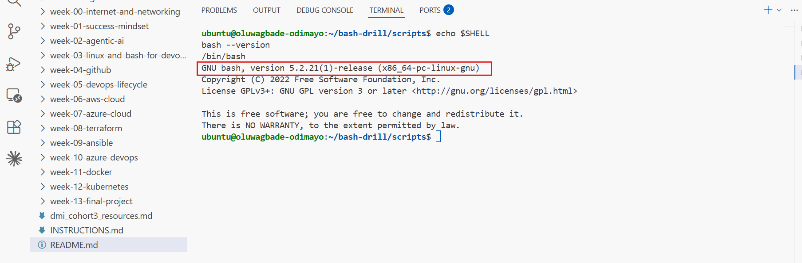

---

#### Screenshot 2 — Output of `pwd` and `ls -lah` showing the scripts directory

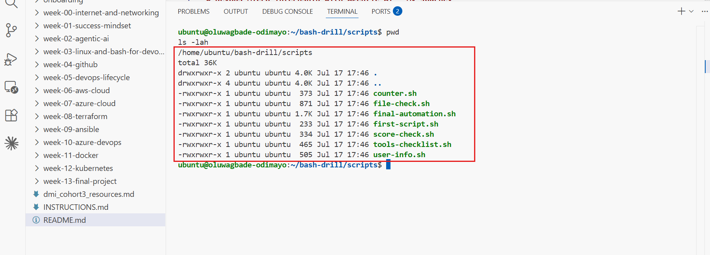

---

### Notes

Answer the following in your own words:

**1. What is Bash?**

Bash is the Bourne Again Shell: a command interpreter and a scripting language in one. It reads what I type, works out which program I mean, runs it, and hands back the output. It is also a full programming language with variables, arrays, loops, conditionals and functions, which is what makes it the default glue of Linux automation.

On this Ubuntu 24.04 EC2 instance it reports `GNU bash, version 5.2.21(1)-release (x86_64-pc-linux-gnu)`, and `echo $SHELL` confirms `/bin/bash` is my login shell. Everything I have done this week, deploying the React app, running the maintenance drill, breaking and recovering Nginx, went through Bash.

---

**2. What is the difference between shell and Bash?**

A shell is the category. Bash is one member of it.

"Shell" is the general name for any program that gives you a command-line interface to the operating system. Several exist and they are not interchangeable: `sh` (the original POSIX shell, on Ubuntu a symlink to `dash`), `bash`, `zsh` (the macOS default), `fish`, `ksh`. Bash is the most common on Linux and is Ubuntu's default interactive shell.

The distinction has a practical consequence I have to respect in my scripts. `#!/bin/bash` and `#!/bin/sh` are not the same interpreter. Arrays, `[[ ]]`, `local` inside functions, and `{1..5}` brace expansion are Bash features that plain `sh` does not have. My `tools-checklist.sh` uses `"${tools[@]}"` and my `final-automation.sh` uses `local tool="$1"`. Both would break under `sh`. Writing `#!/bin/bash` and then running the script with `sh script.sh` is a genuinely common way to get confusing errors.

---

**3. Why is it important to confirm the Bash version before writing scripts?**

Because Bash features arrived in specific versions, and a script written against a newer one fails on an older host in ways that are not obvious.

Concrete examples: associative arrays (`declare -A`) need Bash 4.0, released in 2009. `mapfile` and `readarray` need 4.0. The `${var^^}` uppercase expansion needs 4.0. macOS still ships Bash 3.2 by default for licensing reasons, so a script that works perfectly on my Ubuntu box can fail on a colleague's Mac with a syntax error that names the wrong line.

I am on **5.2.21**, which is recent and supports everything in this drill. But checking is a two-second habit that saves an hour of confusion later, and it is the same instinct as checking `node -v` before assuming a build will run.

---

# Task 2 — Your First Bash Script

## Goal

Create your first Bash script, make it executable, and run it from the terminal.

### Evidence

#### Screenshot 1 — Content of `first-script.sh`

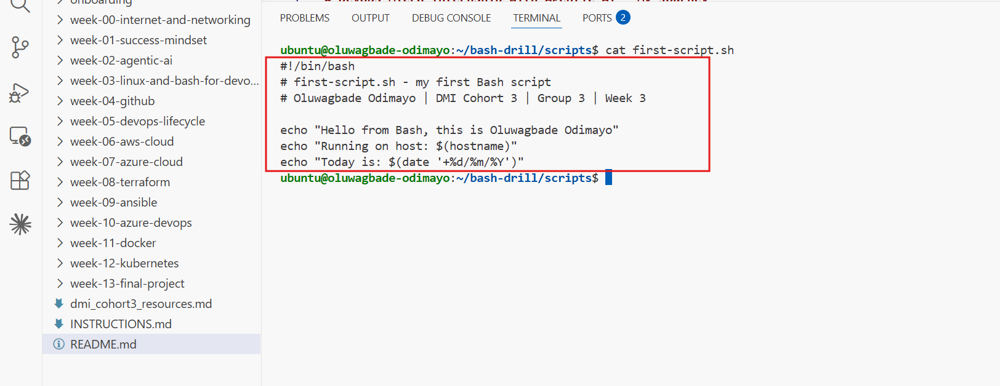

---

#### Screenshot 2 — Output of `./first-script.sh`

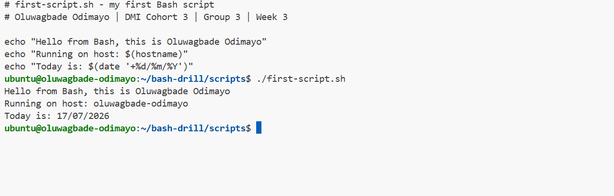

---

#### Screenshot 3 — Output of `ls -l first-script.sh` showing executable permission

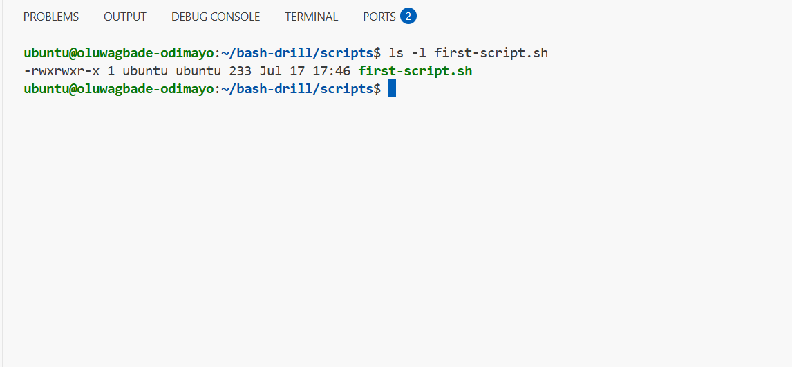

---

### Notes

Answer the following in your own words:

**1. What is the purpose of `#!/bin/bash`?**

It is the shebang, and it tells the kernel which interpreter to hand the file to.

When I run `./first-script.sh`, the kernel reads the first two bytes. If they are `#!`, it takes the rest of that line as the path to an interpreter and executes `/bin/bash ./first-script.sh` on my behalf. Without it, the kernel has no idea what this file is and either refuses to run it or falls back to whatever shell happens to be calling, which may not be Bash at all.

The `#` makes it a comment to Bash itself, so it costs nothing when the script runs. It is a message to the kernel, dressed as a comment.

This is also why the shebang and the actual features have to agree. My scripts declare `#!/bin/bash` and then use arrays and `local`, which is consistent. Declaring `#!/bin/sh` while using those features would be a lie the kernel happily believes right up until the script fails.

---

**2. Why do we use `chmod +x` before running a script?**

Because a file being readable is not the same as it being runnable. `chmod +x` sets the execute bit, which is what tells the kernel this file is allowed to be run as a program.

`ls -l first-script.sh` shows:

```
-rwxrwxr-x 1 ubuntu ubuntu 233 Jul 17 17:46 first-script.sh
```

The three `x` characters are the execute bit set for owner, group and others. Without them the file is just text, and `./first-script.sh` returns `Permission denied` no matter how correct the code inside is.

This is Linux's separation between "you may look at this" and "you may run this", and it exists for security. If any downloaded text file were automatically executable, a mistyped filename or a malicious download would be enough to run arbitrary code. The execute bit forces a deliberate act.

It is also why `bash first-script.sh` works even on a non-executable file: you are running `bash`, which is executable, and merely feeding my file to it as data.

---

**3. What is the difference between running a script using `./script.sh` and `bash script.sh`?**

They look identical here but they are doing different things.

**`./first-script.sh`** asks the kernel to execute the file. That requires the execute bit to be set, and the kernel reads the shebang to decide which interpreter to use. My script says `#!/bin/bash`, so Bash runs it.

**`bash first-script.sh`** runs the `bash` program and passes my file as an argument. The execute bit is irrelevant, because I am not executing my file, I am executing Bash. The shebang is ignored too, and treated as an ordinary comment, because the interpreter has already been chosen on the command line.

The practical differences:

- `./script.sh` needs `chmod +x`. `bash script.sh` does not.
- `./script.sh` honours the shebang. `bash script.sh` overrides it. So `sh script.sh` on a `#!/bin/bash` script will run under dash and break on any Bash-only feature.
- `./script.sh` needs a path. Bare `script.sh` will not work unless the directory is in `$PATH`, which is why the `./` is there at all. It means "the file in this directory", and it exists because Linux deliberately excludes the current directory from `$PATH` so that a malicious `ls` sitting in a folder you `cd` into cannot hijack the real one.

There is a third form worth knowing: `source script.sh` (or `. script.sh`) runs it in the *current* shell rather than a subshell, so variables it sets persist after it finishes. The other two both spawn a child process, which is why a script cannot change your working directory for you.

---

# Task 3 — Variables: User Information Script

## Goal

Use variables to store and display user-related information.

### Evidence

#### Screenshot 1 — Content of `user-info.sh`

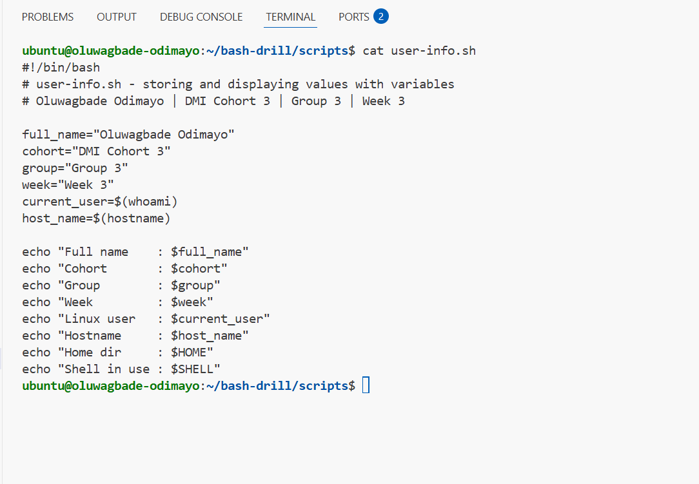

---

#### Screenshot 2 — Output of `./user-info.sh`

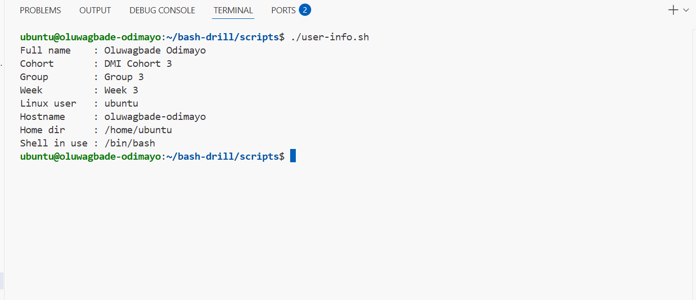

---

### Notes

Answer the following in your own words:

**1. What is a variable in Bash?**

A named container for a value, so the value can be written once and reused everywhere. In `user-info.sh` I set:

```bash
full_name="Oluwagbade Odimayo"
cohort="DMI Cohort 3"
current_user=$(whoami)
host_name=$(hostname)
```

Two different kinds are visible there. The first two hold literal strings. The last two use command substitution, `$( )`, which runs a command and stores its *output* in the variable. That is why the script printed `Linux user : ubuntu` and `Hostname : oluwagbade-odimayo` without me hardcoding either.

Bash variables are untyped. Everything is a string, and Bash decides how to treat it based on context. `score=85` in my `score-check.sh` is the string "85" until `-ge` forces a numeric comparison.

The script also reads two variables I never set: `$HOME` and `$SHELL`. Those are environment variables, inherited from the shell that launched the script, and they are the mechanism by which a process learns about the environment it is running in.

---

**2. Why should we avoid spaces around the `=` sign when creating variables?**

Because Bash would stop reading it as an assignment and start reading it as a command.

`name="OJ"` is an assignment. `name = "OJ"` is Bash trying to run a program called `name` with the arguments `=` and `OJ`, which fails with `name: command not found`.

The reason is that Bash splits every line on whitespace to work out what is a command and what are its arguments. An assignment is recognised only when it is one unbroken token: `word=value`, no spaces. The moment a space appears, the first word becomes a command name.

The trap is that the error message points at the wrong thing. You get `command not found` for a variable name, which reads like nonsense until you know why.

This is also why quoting matters. `full_name="Oluwagbade Odimayo"` needs the quotes, because without them the space would split the value and Bash would try to run `Odimayo` as a command with `full_name=Oluwagbade` set in its environment.

---

**3. How do you access the value stored inside a Bash variable?**

Prefix it with `$`. `full_name` is the name, `$full_name` is the value.

```bash
echo "Full name    : $full_name"
```

prints `Full name    : Oluwagbade Odimayo`.

The braces form `${full_name}` does the same but marks where the name ends, which matters when text follows immediately: `${file}_backup.txt` works, `$file_backup.txt` does not, because Bash reads `file_backup` as the variable name and finds it empty.

**Always quote the expansion.** `"$full_name"` rather than `$full_name`. Unquoted, Bash splits the value on whitespace, so `Oluwagbade Odimayo` becomes two separate arguments. That is harmless in an `echo` and catastrophic in `rm $path` when the path contains a space. Every expansion in all seven of my scripts is quoted, and `"${tools[@]}"` in `tools-checklist.sh` is the same principle applied to an array.

---

# Task 4 — Arrays & Loops: Tools Checklist Script

## Goal

Use arrays and loops to print a checklist of tools used in Bash scripting.

### Evidence

#### Screenshot 1 — Content of `tools-checklist.sh`

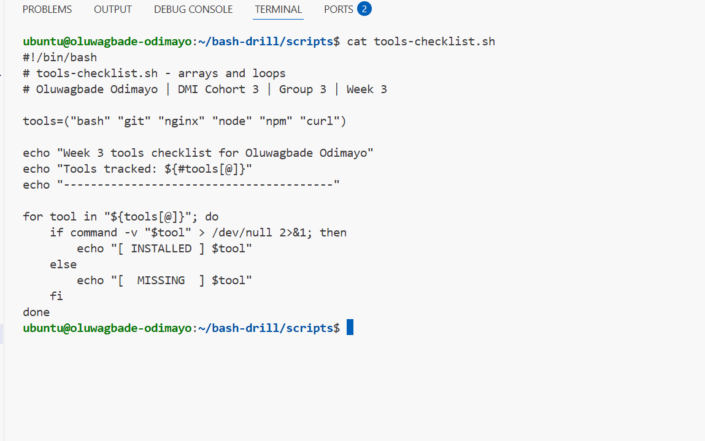

---

#### Screenshot 2 — Output of `./tools-checklist.sh`

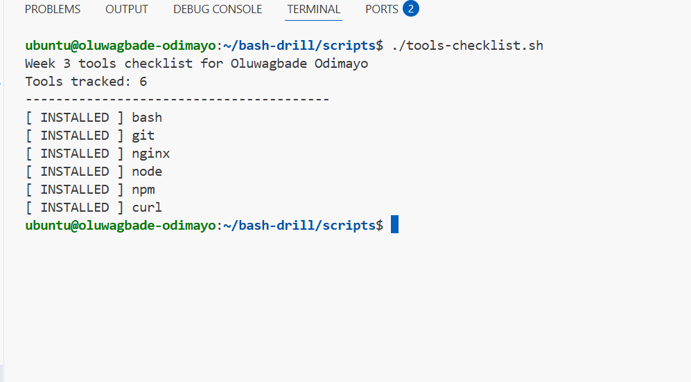

---

### Notes

Answer the following in your own words:

**1. What is an array in Bash?**

A single variable holding an ordered list of values, indexed from zero. In `tools-checklist.sh`:

```bash
tools=("bash" "git" "nginx" "node" "npm" "curl")
```

That is one variable holding six strings. `${tools[0]}` is `bash`, `${tools[5]}` is `curl`, `${tools[@]}` is all of them, and `${#tools[@]}` is the count, which is why the script printed `Tools tracked: 6` without me typing a 6 anywhere. If I add a seventh tool to the array, that number updates itself.

Bash arrays are sparse, so indices need not be contiguous, and they are one-dimensional. They are also a Bash feature rather than a POSIX one, which is the practical reason my shebang says `#!/bin/bash` and not `#!/bin/sh`.

---

**2. Why are arrays useful in scripts?**

They separate the data from the logic, which is the difference between a script you edit and a script you configure.

Without an array, checking six tools means six near-identical `if` blocks. Adding a seventh means copying and pasting a block and editing it, and now there are seven places for the logic to drift out of sync. If I want to change how the check works, I change it seven times and miss one.

With an array there is exactly one `if` block and one `for` loop. Adding `docker` to the list is a two-word edit to the array. The logic is untouched, so it cannot drift.

That principle scales directly into real DevOps work: a list of servers to health-check, a list of services to restart, a list of ports to verify. `final-automation.sh` uses the same pattern with `checks=("bash" "git" "nginx" "curl")`, and the loop that consumes it does not care how long the list is.

---

**3. What does `"${tools[@]}"` mean?**

It expands the array into all of its elements, with each element kept as one separate word. Every character in it is load-bearing.

- `tools` is the array name
- `[@]` means every element, rather than a single index
- `${...}` is the expansion
- **the double quotes are the important part**

`"${tools[@]}"` gives six words. `"${tools[*]}"` (a star instead of an at) gives *one* word with all six joined by spaces, so a loop over it runs once, not six times.

Unquoted `${tools[@]}` looks fine here and is a bug waiting to happen: without quotes Bash word-splits each element, so an entry like `"my tool"` would become two iterations. My array has no spaces in it today, which is exactly the sort of assumption that stops being true later.

`"${tools[@]}"` is the only form that is correct in every case, so it is the only one worth learning.

---

**4. What is the purpose of the `for` loop in this script?**

It applies one identical check to every element of the array, so the logic is written once and executed six times:

```bash
for tool in "${tools[@]}"; do
    if command -v "$tool" > /dev/null 2>&1; then
        echo "[ INSTALLED ] $tool"
    else
        echo "[  MISSING  ] $tool"
    fi
done
```

Each pass assigns one element to `$tool` and runs the body. The loop is what turns a list into work.

The check inside is worth explaining. `command -v` asks Bash to resolve a name to its path, which is a more reliable test than `which` (an external program that may not be installed) or checking a hardcoded path like `/usr/bin/nginx` (wrong, as it turns out: nginx actually lives in `/usr/sbin/nginx`). `> /dev/null 2>&1` throws away both stdout and stderr, because I only want the exit status, not the output. `if` then branches on that status: 0 means found.

My run returned six INSTALLED and zero MISSING, which is correct: bash, git and curl ship with Ubuntu, and I installed node, npm and nginx myself in Assignment 2.

---

# Task 5 — Loops: Number Counter Script

## Goal

Use loops to repeat a task multiple times.

### Evidence

#### Screenshot 1 — Content of `counter.sh`

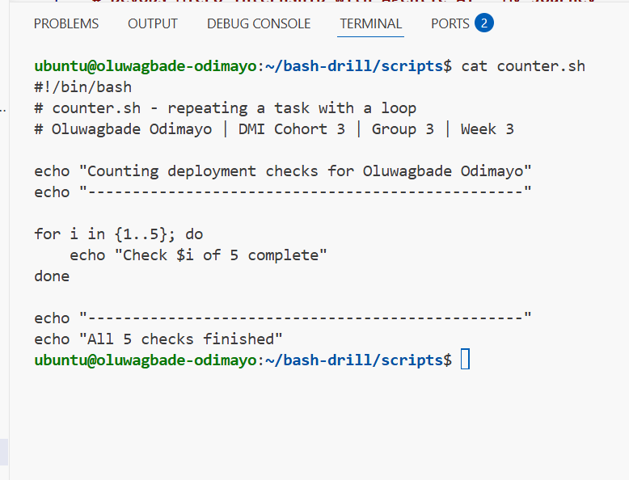

---

#### Screenshot 2 — Output of `./counter.sh`

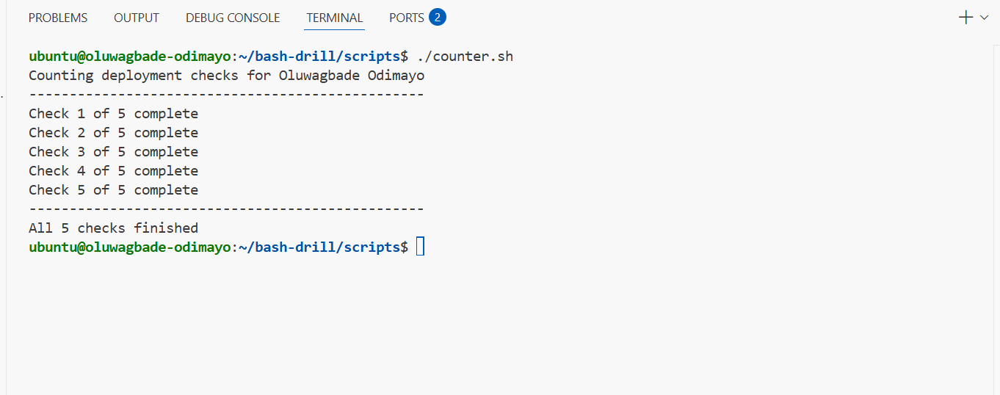

---

### Notes

Answer the following in your own words:

**1. What is a loop?**

A construct that repeats a block of code, either a fixed number of times or once per item in a collection, without the code being written out repeatedly.

`counter.sh` uses the simplest form:

```bash
for i in {1..5}; do
    echo "Check $i of 5 complete"
done
```

`{1..5}` is brace expansion. Bash expands it to `1 2 3 4 5` before the loop even starts, then the loop assigns each value to `$i` in turn. Five lines of output from one line of logic.

Bash has several loop types: `for` over a list (both of mine), `for ((i=0; i<5; i++))` C-style when you need arithmetic control, `while` which repeats as long as a condition holds, and `until` which is `while` inverted. `while read line` is the one you reach for constantly in real work, because it is how you process a file line by line.

---

**2. Why do we use loops in Bash scripting?**

Because repeated code is where bugs live, and because the alternative does not scale.

Three reasons, in order of how much they matter:

**Correctness.** Five copy-pasted `echo` lines means five chances to typo one. One loop means one line to get right. When I fix a bug in a loop, it is fixed everywhere by construction.

**Scale.** `counter.sh` runs five times. Changing it to 500 is a two-character edit. Writing 500 `echo` lines is not an option, and neither is writing 20.

**The data becomes configuration.** In `tools-checklist.sh` the loop lets the array be the thing I edit. Adding a tool never touches the logic. That is the pattern that makes automation maintainable: change what you check, not how you check it.

In real DevOps work this is everything. Restart a service on 40 hosts, verify 12 endpoints return 200, rotate logs in every directory under `/var/log`. All the same shape: a list and a loop.

---

**3. How many times did the loop run in your script?**

**Five times.** The output is unambiguous:

```
Counting deployment checks for Oluwagbade Odimayo
-------------------------------------------------
Check 1 of 5 complete
Check 2 of 5 complete
Check 3 of 5 complete
Check 4 of 5 complete
Check 5 of 5 complete
-------------------------------------------------
All 5 checks finished
```

`{1..5}` expands to five values, so the body runs five times with `$i` taking 1 through 5.

Worth noting that the two lines outside the loop, the header and the footer, each printed exactly once. That is the loop boundary made visible: only what sits between `do` and `done` repeats.

---

**4. What would you change if you wanted the loop to run 10 times?**

Change `{1..5}` to `{1..10}`:

```bash
for i in {1..10}; do
    echo "Check $i of 10 complete"
done
```

Two edits, not one. The range controls the iterations, but my `echo` has a hardcoded `of 5` in the text, so leaving it would produce `Check 7 of 5 complete`, which is nonsense.

That is a real lesson rather than a technicality. **The same fact was written in two places, so changing it in one place creates a lie.** The robust version keeps the number in a single variable:

```bash
total=10
for i in $(seq 1 "$total"); do
    echo "Check $i of $total complete"
done
```

Now the count exists once, and the loop and the message can never disagree. `seq` is used here rather than braces because brace expansion happens before variable expansion, so `{1..$total}` does not work: Bash expands the braces while `$total` is still literal text. That ordering catches people out constantly.

---

# Task 6 — Files & Conditionals: File Validation Script

## Goal

Use file checks and conditionals to verify whether files and directories exist.

### Evidence

#### Screenshot 1 — Output of `ls -lah ../test-folder`

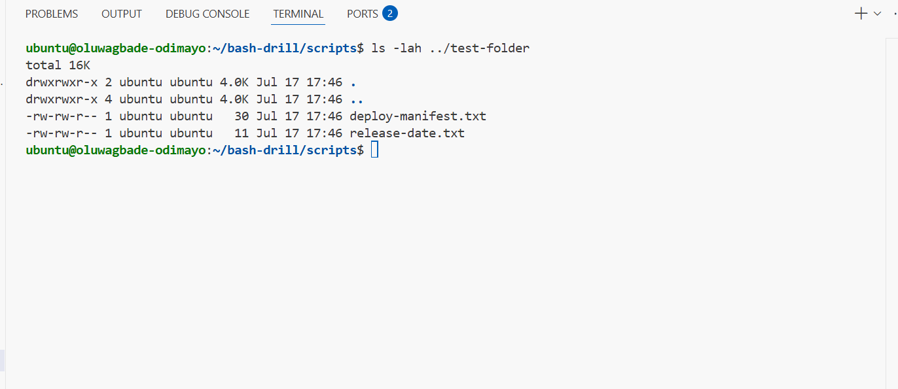

---

#### Screenshot 2 — Content of `file-check.sh`

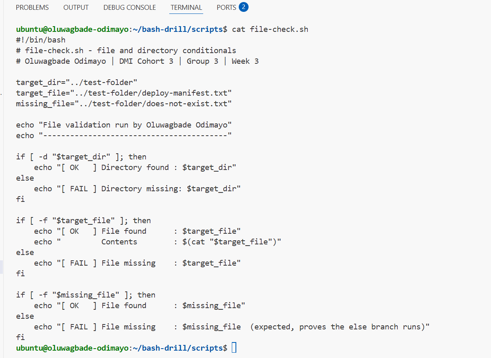

---

#### Screenshot 3 — Output of `./file-check.sh`

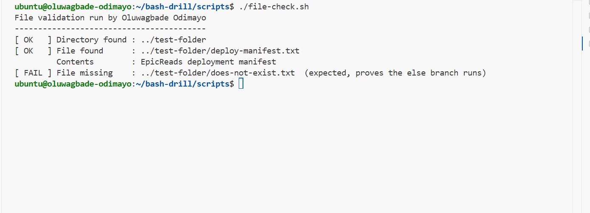

---

### Notes

Answer the following in your own words:

**1. What does `-d` check in Bash?**

`-d` tests whether a path exists **and is a directory**. It returns true only if both are so.

```bash
if [ -d "$target_dir" ]; then
    echo "[ OK   ] Directory found : $target_dir"
```

My run printed `[ OK   ] Directory found : ../test-folder`, so `../test-folder` exists and is a directory.

The detail worth catching is that `-d` is false for a file that exists. It is not an existence check, it is a type check. `-e` is the plain existence test that does not care what kind of thing it finds. Using `-e` where you meant `-d` is how you end up trying to `cd` into a text file.

This bit me indirectly in Assignment 3, incidentally: nginx's `try_files $uri` failed on `/` because `/` resolves to a directory rather than a file, and that failure kicked off the redirect loop that returned a 500. Same distinction, different tool.

---

**2. What does `-f` check in Bash?**

`-f` tests whether a path exists **and is a regular file**: not a directory, not a symlink to a directory, not a device node or socket.

```bash
if [ -f "$target_file" ]; then
    echo "[ OK   ] File found      : $target_file"
    echo "         Contents        : $(cat "$target_file")"
```

My run printed:

```
[ OK   ] File found      : ../test-folder/deploy-manifest.txt
         Contents        : EpicReads deployment manifest
```

So the file exists, is a regular file, and `$(cat ...)` read it. That second line is the point of checking first: `cat` on a missing file writes an error to stderr and gives you nothing useful. The `-f` guard means the read only happens when it can succeed.

The wider family is worth knowing: `-r` readable, `-w` writable, `-x` executable, `-s` exists and is non-empty, `-e` exists as anything at all. In a real deployment script `-s` is often the one you want, because a zero-byte config file passes `-f` and still breaks everything.

---

**3. Why should file and directory paths be stored in variables?**

Four reasons, and they compound.

**One place to change.** `file-check.sh` declares its three paths at the top. If the folder moves, I edit one line rather than hunting through the body for every mention.

**They cannot drift.** A path repeated in five places is five chances for one to be typed differently. That bug is invisible on inspection and only surfaces on the one branch you did not test.

**Readability.** `if [ -f "$target_file" ]` says what it is checking. `if [ -f "../test-folder/deploy-manifest.txt" ]` makes the reader parse a path to work out the intent.

**They can be made configurable.** A variable can be overridden: `target_dir="${1:-../test-folder}"` takes an argument and falls back to a default. A hardcoded string cannot.

The safety point matters most. In a script that deletes things, a path in a variable can be validated once before use. `rm -rf $dir` where `$dir` is empty expands to `rm -rf /`. Declaring paths in one place gives you exactly one place to guard.

---

**4. What happens if the file does not exist?**

The `-f` test returns false and the `else` branch runs. Nothing errors, nothing crashes, the script continues.

I proved this deliberately by including a third check for a file I never created:

```
[ FAIL ] File missing    : ../test-folder/does-not-exist.txt  (expected, proves the else branch runs)
```

That line is the most valuable output in the script. The first two checks passing tell me the script runs. Only the third tells me the script can **detect a failure**, which is what I actually want to know. A validation script that has never returned FAIL is untested, and an untested check is worse than no check, because it produces confidence without evidence.

This is the same lesson Assignment 3 taught me the hard way. My Nginx backup existed and looked perfect and was completely broken, and I only found out because I ran the rollback. Testing the happy path proves nothing about the sad one.

---

# Task 7 — Conditionals: Pass or Retry Script

## Goal

Use if-else conditionals to make decisions based on a variable value.

### Evidence

#### Screenshot 1 — Content of `score-check.sh` with `score=85`

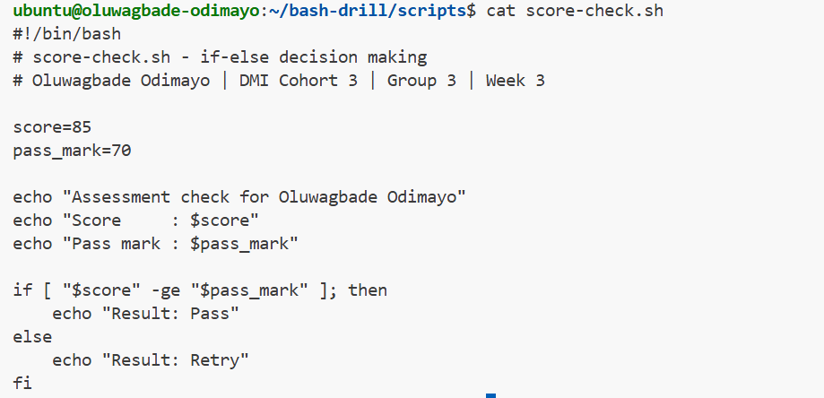

---

#### Screenshot 2 — Output showing `Result: Pass`

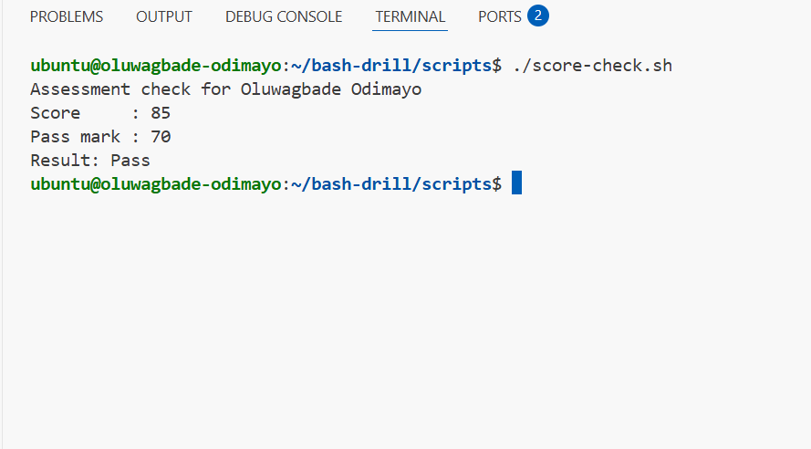

---

#### Screenshot 3 — Content of `score-check.sh` with `score=55`

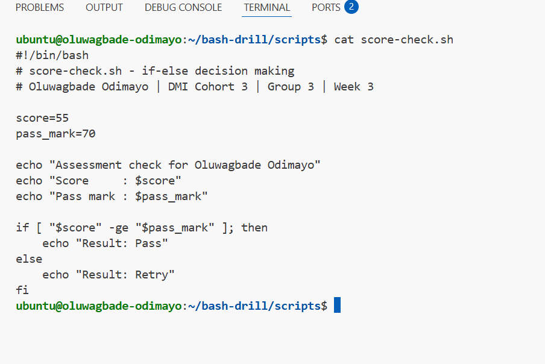

---

#### Screenshot 4 — Output showing `Result: Retry`

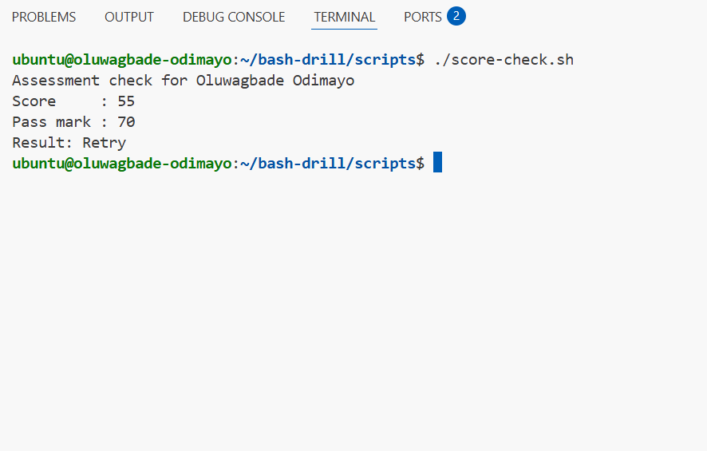

---

### Notes

Answer the following in your own words:

**1. What is the purpose of if-else in Bash?**

It lets a script take a different path depending on a condition, which is the difference between a list of commands and a program that makes decisions.

```bash
if [ "$score" -ge "$pass_mark" ]; then
    echo "Result: Pass"
else
    echo "Result: Retry"
fi
```

The `if` evaluates a condition and branches: one block when true, the other when false. Exactly one runs.

The mechanism underneath is worth understanding, because it explains everything else in Bash. `if` does not test a boolean. It runs a command and branches on its **exit status**, where 0 means success. `[` is not syntax, it is an actual program (`/usr/bin/[`, also built into Bash) that evaluates its arguments and exits 0 or 1. That is why the spaces matter: `[ "$score" -ge 70 ]` is a command with four arguments, and `["$score" -ge 70]` is a command called `[85` that does not exist.

This also explains `if command -v "$tool"` in my other scripts. No brackets at all, because `command -v` already returns a useful exit status. `if` works with any command, not just tests.

---

**2. What does `-ge` mean?**

Greater than or equal to, as a **numeric** comparison. `[ "$score" -ge "$pass_mark" ]` is true when 85 >= 70.

The full set is `-eq`, `-ne`, `-lt`, `-le`, `-gt`, `-ge`.

The reason Bash has these at all, rather than using `>` and `<`, is that `>` and `<` already mean redirection. `[ $a > $b ]` does not compare anything: it runs the test on `$a` alone and redirects the output into a file named after `$b`. It fails silently and creates a stray file. That is a genuinely nasty bug.

The other half is that string and numeric comparison are different operations. `[ "10" -gt "9" ]` is true. `[ "10" > "9" ]` inside `[[ ]]` is *false*, because as strings "10" sorts before "9". Bash is untyped, so the operator is the only thing that decides how the values are read. Choose the wrong one and the comparison is confidently wrong rather than broken.

---

**3. Why should conditions be tested with different values?**

Because testing one value only proves one branch exists.

I ran `score-check.sh` twice:

| `score` | Output |
|---|---|
| 85 | `Result: Pass` |
| 55 | `Result: Retry` |

The first run proves the `if` branch works. It says nothing at all about the `else`. A script with a broken `else`, a typo, an inverted comparison, a missing `fi`, would sail through the 85 test looking perfect and fail the first time real data went the other way.

The second run is what proves the logic, not just the script.

Boundaries matter too, and neither of my values is near one. `-ge` includes the pass mark, so `score=70` should Pass and `score=69` should Retry. Those two are the tests that actually catch an off-by-one, because that is precisely where `-ge` and `-gt` differ. Testing 85 and 55 proves the branches exist. Testing 69 and 70 would prove the *threshold* is right.

This is the same principle as my `file-check.sh` deliberately checking a file that does not exist, and the same principle as breaking Nginx on purpose in Assignment 3. You do not learn anything from a test that was always going to pass.

---

**4. How can conditionals help in automation scripts?**

They are what turn a script from a sequence of commands into something that can be trusted to run unattended.

A script without conditionals does the same thing regardless of what it finds. It copies files into a directory that may not exist, restarts a service that may already be broken, and reports success either way. A script with conditionals checks before acting and reports what it actually found.

Concretely, from my own work this week:

- `file-check.sh` verifies a file exists **before** trying to `cat` it, so a missing file produces a clear FAIL rather than a stderr error and an empty result
- `tools-checklist.sh` reports each tool as INSTALLED or MISSING instead of assuming
- `final-automation.sh` counts passes and failures and only declares `HEALTHY` when `fail_count` is 0, then exits with a status code a calling process can act on
- The Nginx workflow in Assignment 3 is the same idea: `nginx -t` before `reload`, so a bad config is caught while the service is still up

The pattern in all of them is **check, then act, then report**. That is what makes automation safe to run when nobody is watching, which is the only kind of automation worth having.

---

# Task 8 — Functions: Final Bash Automation Script

## Goal

Create a final Bash script using functions to organize reusable code.

### Evidence

#### Screenshot 1 — Content of `final-automation.sh`

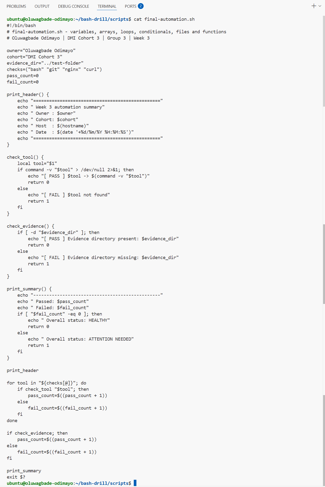

---

#### Screenshot 2 — Output of `./final-automation.sh`

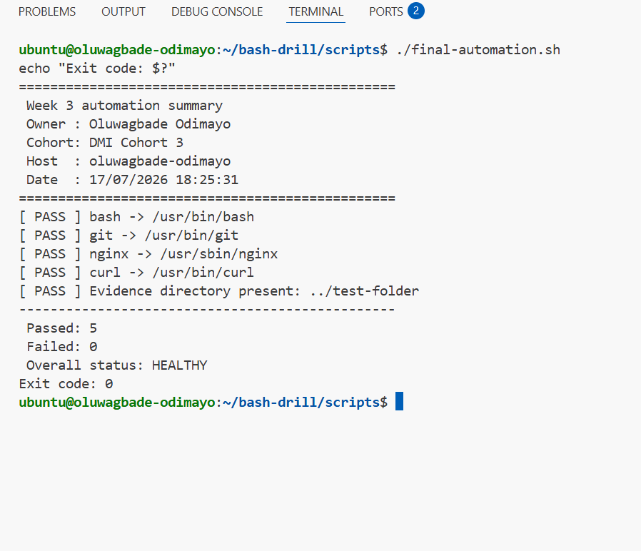

---

#### Screenshot 3 — Output of `ls -lah` showing all created scripts

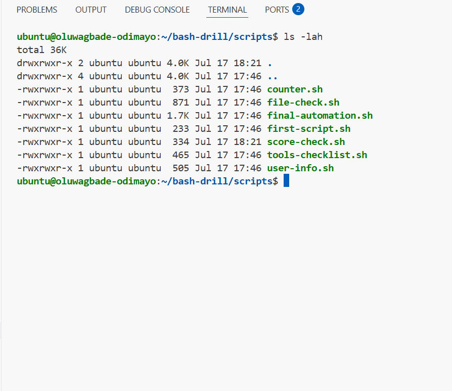

---

### Notes

Answer the following in your own words:

**1. What is a function in Bash?**

A named, reusable block of code that can be called by name, take arguments and return an exit status.

```bash
check_tool() {
    local tool="$1"
    if command -v "$tool" > /dev/null 2>&1; then
        echo "[ PASS ] $tool -> $(command -v "$tool")"
        return 0
    else
        echo "[ FAIL ] $tool not found"
        return 1
    fi
}
```

Three things in that are worth pointing at.

**`$1` is the first argument.** Functions receive arguments positionally, exactly like scripts do, so `check_tool "nginx"` puts `nginx` into `$1`.

**`local` scopes the variable to the function.** Without it, `tool` would be global and would leak into the rest of the script, silently colliding with anything else using that name. `local` is a Bash feature and one of the reasons my shebang is `#!/bin/bash`.

**`return` sets an exit status, not a value.** A Bash function cannot return a string. It returns a number, 0 to 255, where 0 means success. That is why `if check_tool "$tool"; then` works: the `if` is branching on the exit status, exactly as it would for any command. To get data out of a function you echo it and capture with `$( )`.

---

**2. Why are functions useful in scripts?**

**They remove duplication.** `check_tool` is written once and called four times. Without it, `final-automation.sh` would have four near-identical `if command -v` blocks, and improving the check would mean improving it four times and missing one.

**They name intent.** `print_header`, `check_tool`, `check_evidence`, `print_summary`. The bottom of my script reads almost like prose because the names say what happens. A reader can understand the flow without reading a single implementation.

**They isolate.** `local tool="$1"` means the function cannot corrupt the caller's variables. That containment is what makes it safe to change a function without auditing the entire script.

**They are testable.** A function can be called on its own with a known input. A 90-line linear script can only be tested by running the whole thing.

**They compose.** Because `check_tool` returns a status, I can write `if check_tool "$tool"; then pass_count=$((pass_count + 1)); fi`. The function slots into Bash's own control flow as if it were a built-in command.

---

**3. Which functions did you create in this script?**

Four, each with one responsibility:

| Function | Job | Returns |
|---|---|---|
| `print_header` | Prints the banner with owner, cohort, hostname and timestamp | nothing meaningful |
| `check_tool` | Takes a tool name in `$1`, resolves it with `command -v`, prints PASS or FAIL | `0` found, `1` missing |
| `check_evidence` | Tests the evidence directory with `-d`, prints PASS or FAIL | `0` present, `1` missing |
| `print_summary` | Prints the tallies and the overall verdict | `0` HEALTHY, `1` ATTENTION NEEDED |

The split is deliberate. The two `check_*` functions gather and judge one fact each. The two `print_*` functions handle presentation. Nothing does both.

That separation is what let the script's own output tell the truth about my box:

```
[ PASS ] bash -> /usr/bin/bash
[ PASS ] git -> /usr/bin/git
[ PASS ] nginx -> /usr/sbin/nginx
[ PASS ] curl -> /usr/bin/curl
[ PASS ] Evidence directory present: ../test-folder
 Passed: 5
 Failed: 0
 Overall status: HEALTHY
Exit code: 0
```

Small thing worth noticing in that output: nginx resolves to `/usr/sbin/nginx` while the other three are in `/usr/bin`. `sbin` is for system binaries intended for administration, which is exactly what a web server daemon is. Had I hardcoded `/usr/bin/nginx` instead of using `command -v`, the check would have reported a false FAIL on a perfectly healthy service.

---

**4. How does this final script combine variables, arrays, loops, conditionals, files, and functions?**

All six, each doing the job it is actually for:

**Variables** hold the configuration in one place: `owner="Oluwagbade Odimayo"`, `cohort="DMI Cohort 3"`, `evidence_dir="../test-folder"`, plus the `pass_count` and `fail_count` accumulators. `$(hostname)` and `$(date '+%d/%m/%Y %H:%M:%S')` use command substitution so the header reports where and when it ran rather than what I assumed.

**An array** holds the data: `checks=("bash" "git" "nginx" "curl")`. Adding a fifth tool is a two-word edit that touches no logic.

**A loop** applies the logic to the data: `for tool in "${checks[@]}"; do`. Written once, run four times.

**Conditionals** make the decisions at three levels. `command -v` inside `check_tool` decides PASS or FAIL. `if check_tool "$tool"` in the loop decides which counter to increment. `if [ "$fail_count" -eq 0 ]` in `print_summary` decides the overall verdict.

**A file check** verifies the evidence exists: `if [ -d "$evidence_dir" ]`, the same `-d` test from `file-check.sh`.

**Functions** hold it all together: four of them, each with one job, each returning a status the caller can branch on.

And they interlock rather than merely coexisting. The array feeds the loop. The loop calls the function. The function returns a status. The conditional reads that status and updates a variable. The variable decides the summary. The summary sets the exit code:

```bash
print_summary
exit $?
```

**`exit $?` is the piece that makes this real automation rather than a demo.** `$?` is the exit status of the last command, so the script exits with whatever `print_summary` returned. Mine exited `0` for HEALTHY. That single number is what lets this script be used by something else: `./final-automation.sh && ./deploy.sh` only deploys if the health check passed. A script that prints "HEALTHY" but always exits 0 is useless to a machine, no matter how good the output looks to a human.

---

# LinkedIn Post (Required)

## Evidence

#### LinkedIn Post URL

Paste your LinkedIn post URL here:

`Add your URL here`

---

#### Screenshot — Published LinkedIn post


---

# Submission Instructions

- Add all required screenshots in your submission
- Full name must be visible in required screenshots
- All script files must be created and run successfully
- Required notes must be answered clearly for every task
- Do not expose sensitive information (keys, passwords, credentials)

---

# Completion Checklist

- [x] Task 1: Environment setup verified, workspace created (Screenshots 1–2, Notes answered)
- [x] Task 2: First script created, executed, permissions verified (Screenshots 1–3, Notes answered)
- [x] Task 3: Variables script created and run (Screenshots 1–2, Notes answered)
- [x] Task 4: Arrays and loops script created and run (Screenshots 1–2, Notes answered)
- [x] Task 5: Counter loop script created and run (Screenshots 1–2, Notes answered)
- [x] Task 6: File validation script created and run (Screenshots 1–3, Notes answered)
- [x] Task 7: Pass/Retry conditional script tested with both values (Screenshots 1–4, Notes answered)
- [x] Task 8: Final automation script created and run (Screenshots 1–3, Notes answered)
- [x] All scripts run without errors
- [x] Full Name visible in all required screenshots
- [x] LinkedIn post published and URL submitted
- [x] No sensitive data exposed

---

## 📌 About DMI & CloudAdvisory

DevOps Micro Internship (DMI) is a project-based DevOps program run by Pravin Mishra (The CloudAdvisory) focused on real-world execution, systems thinking, and career readiness.

It helps learners build strong DevOps foundations with hands-on experience.

---

## 📌 Resources

- 🌐 DMI Official Website: https://pravinmishra.com/dmi  
- 🎓 DevOps for Beginners (Udemy): https://www.udemy.com/course/devops-for-beginners-docker-k8s-cloud-cicd-4-projects/  
- 🎓 Agentic AI DevOps with Claude Code: https://www.udemy.com/course/ultimate-agentic-ai-devops-with-claude-code/  
- 🎓 DevOps with Claude Code: Terraform, EKS, ArgoCD & Helm: https://www.udemy.com/course/devops-with-claude-code-terraform-eks-argocd-helm/  
- ▶️ YouTube Playlist: https://www.youtube.com/playlist?list=PLFeSNDtI4Cho  
- 🔗 Pravin Mishra (LinkedIn): https://www.linkedin.com/in/pravin-mishra-aws-trainer/  
- 🏢 CloudAdvisory (LinkedIn): https://www.linkedin.com/company/thecloudadvisory/

---

*This submission is part of DevOps Micro Internship (DMI) Cohort 3 — Agentic AI Track.*