# Assignment 6 — Build an AI-Assisted Linux Health Check (AI-Assisted Linux Incident Triage)

Part of the DevOps Micro Internship (DMI) Cohort 3 with Agentic AI

---

## Purpose

In this assignment, you will build a read-only Bash triage script that checks the health of your Ubuntu server and Nginx application, connect it to Claude Code as a reusable `/linux-triage` skill, simulate a controlled Nginx incident, use the skill to gather and analyze evidence, recover the service manually, and verify recovery. The workflow follows the Agentic Loop: Gather → Analyze → Human Act → Verify.

---

# Task 1 — Confirm the Healthy Baseline and Create the Workspace

## Goal

Confirm that Nginx and the React application are healthy before building the automation.

### Evidence

#### Screenshot 1 — Output of `systemctl is-active nginx`, `ss -ltn | grep ':80'`, and `curl -I http://localhost`

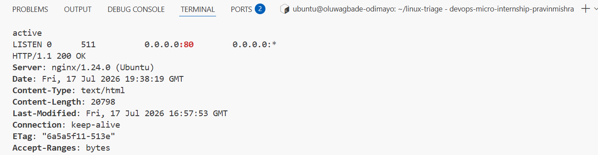

---

#### Screenshot 2 — Output of `pwd` and `find . -maxdepth 4 -type d | sort` showing the workspace folder structure

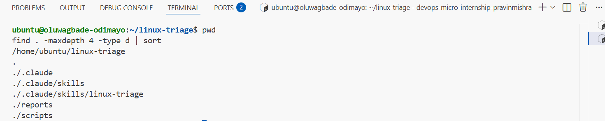

---

### Notes

Answer the following in your own words:

**1. What proves that Nginx is running?**

`systemctl is-active nginx` returned `active`. That is systemd reporting on the unit it manages, so it reflects the actual process state rather than my assumption about it.

It is worth being precise about what that single word does and does not prove. It proves a process exists and systemd considers the unit running. It does not prove anyone can reach it, that the config loaded is the one on disk, or that the site returns a page. Those are three separate claims needing three separate checks, which is exactly why the triage script has five and not one.

---

**2. What proves that the server is listening for HTTP traffic?**

Two pieces of evidence, at different layers.

`ss -ltn | grep ':80'` returned:

```
LISTEN 0      511    0.0.0.0:80    0.0.0.0:*
```

The state is LISTEN, and the local address is `0.0.0.0:80` rather than `127.0.0.1:80`. That distinction matters: `0.0.0.0` means every interface on the box, so the socket is reachable from outside and not only from localhost.

`curl -I http://localhost` then returned `HTTP/1.1 200 OK` with `Content-Length: 20798`. That is the stronger proof, because a listening socket only shows something is bound to the port. The 200 shows the whole chain works: process up, port bound, config loaded, content readable, response sent.

The 20798 bytes is a useful detail too. It matches `index.html` in `/var/www/html` exactly, which confirms the EpicReads portfolio from Assignment 4 is what is being served rather than a leftover default page.

---

**3. Why must you capture a healthy baseline before simulating an incident?**

Because without one, you cannot tell a failure from a thing that was never working.

If I break Nginx and my triage reports three FAILs, I have no way of knowing whether I caused all three or whether one of them was red before I touched anything. The baseline is the control. It is the difference between "this changed" and "this is bad", and only the first is actionable.

It also validates the instrument before you rely on it. My healthy run returned 5 PASS and exit code 0. That tells me the script's PASS path works. If I had only ever seen it during an incident, I would not know whether a green check meant healthy or meant the check was broken and defaulting to green. A test that has only ever returned one answer is untested.

Third, it gives recovery a definition. "Recovered" is not a feeling, it is "the same five checks now report what they reported at 20:24:09". Without the baseline, recovery is a judgement call. With it, it is a comparison.

Fourth, and this one I learned the hard way in Assignment 3: it captures the state you will need to restore. My Nginx backup that night was silently the broken file, and I only found out when the rollback did nothing. A baseline you have actually verified is worth more than one you assume.

---

# Task 2 — Create Project Context and Safety Rules in CLAUDE.md

## Goal

Tell Claude exactly what this project does and what it is not allowed to do.

### Evidence

#### Screenshot 3 — CLAUDE.md open in VS Code showing all four sections (Project Overview, Incident Workflow, Safety Rules, Output Rules)

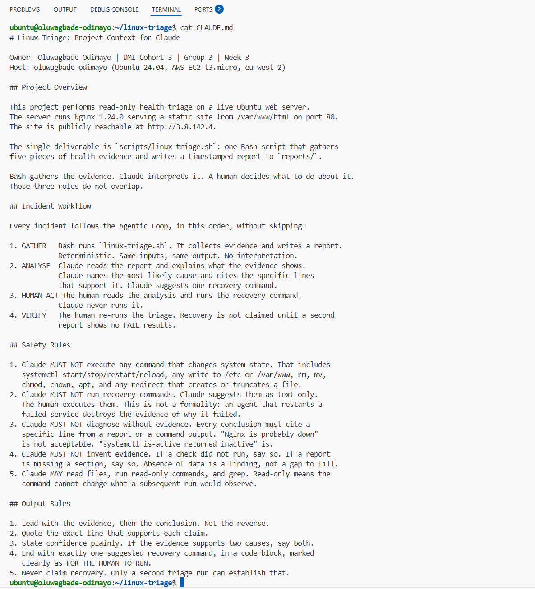

---

### Notes

Answer the following in your own words:

**1. Why should Claude receive project-specific operational rules?**

Because general capability is not the same as knowing what is off limits here.

Claude arrives knowing Nginx, systemd and Bash perfectly well. What it cannot know is that on this box, restarting a failed service is forbidden, that the report format matters, that the human is the only one permitted to change state, and why. Those are not facts about Linux. They are decisions about this project, and nothing in a model's training tells it which ones I made.

Without CLAUDE.md, the helpful thing and the correct thing diverge. A stopped Nginx with a one-command fix is exactly where an unbriefed agent would reach for `systemctl start`, because fixing it looks like helping. My rules make explicit that fixing it is the wrong move, and give the reason: an agent that restarts a failed service destroys the evidence of why it failed.

There is also the consistency argument. The rules live in a file, in the repo, not in my memory of what I told it last session. Every invocation of `/linux-triage` gets the same brief. That is the difference between a workflow and a conversation.

I watched this hold in practice. Across three separate invocations, including one where nginx was down and `sudo systemctl start nginx` was obviously the answer, Claude suggested the command and stopped. Not because it could not run it, but because CLAUDE.md said not to.

---

**2. Why is the human required to execute the recovery command?**

Because recovery is where the irreversible decisions live, and accountability cannot be delegated to something that cannot be held accountable.

Three reasons, in order of weight.

**Restarting destroys evidence.** This is the one people miss. `systemctl start nginx` makes the alert go green and the symptom disappear. It does not touch the cause. If nginx died because the disk filled, or the OOM killer took it, or the config will fail on next boot, the restart hides that and buys you a recurrence at a worse hour. The first instinct in an incident should be to preserve the scene.

**The agent cannot see the whole context.** My triage checks five things. It does not know there is a deploy in flight, or that this box is in a load balancer, or that a colleague is mid-investigation. `systemctl restart` during someone else's debugging session destroys their work and mine.

**Accountability needs a person.** If a restart makes things worse, an agent cannot be responsible for that. I can. The person running the command is the person who understood the tradeoff and chose to accept it.

The workflow makes this concrete rather than aspirational. Claude produced the command. I read the analysis, agreed with the reasoning, and typed it myself. Claude proposes, the human disposes, and the boundary is enforced by a tool list rather than by good intentions.

---

**3. Which rule prevents Claude from making an unsupported diagnosis?**

Safety Rule 3:

> *Claude MUST NOT diagnose without evidence. Every conclusion must cite a specific line from a report or a command output. "Nginx is probably down" is not acceptable. "systemctl is-active returned inactive" is.*

Rule 4 backs it up by closing the other half of the gap:

> *Claude MUST NOT invent evidence. If a check did not run, say so. If a report is missing a section, say so. Absence of data is a finding, not a gap to fill.*

Rule 3 governs what you may conclude. Rule 4 governs what you may claim to have observed. Together they force every statement back to a line someone can go and look at.

I saw both work. During the incident, Claude's analysis quoted the report by line number for every claim, and then wrote:

> *"The evidence does not tell us why it is inactive (clean stop vs crash vs failed boot). That requires `journalctl -u nginx`, which this triage did not collect, so I am not asserting it."*

That is the interesting part. The plausible completion was right there. "Nginx probably crashed" would have read fine and might even have been true. Rule 4 is what stopped it, and the honest gap is more useful than a confident guess, because a guess sends you looking in the wrong place.

---

# Task 3 — Use Agentic AI to Plan Before Writing the Script

## Goal

Use Claude Code to inspect the environment and produce a read-only plan before creating any Bash code.

### Evidence

#### Screenshot 4 — Claude Code showing the five-check plan and read-only inspection results

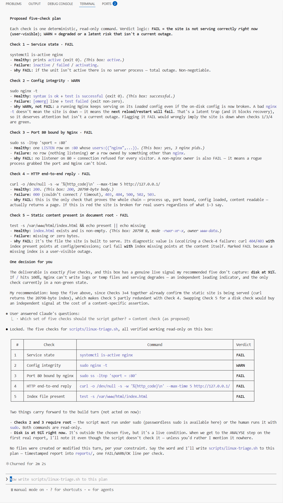

---

### Notes

Answer the following in your own words:

**1. Which part of this task represents the Gather phase?**

The read-only inspection Claude ran before proposing anything: `pwd`, `ls -la`, `id`, `sudo -n true`, `nginx -v`, `systemctl is-active nginx`, `ss -ltnH 'sport = :80'`, `nginx -t` both with and without sudo, `grep` for the document root in `/etc/nginx/`, `ls -la /var/www/html`, and `df -h /`.

Every one of those observes and none of them change anything. That is Gather: collect the facts before forming a view.

The point of doing it in this order is that the plan is then grounded in this box rather than in a general idea of what an Ubuntu web server looks like. And it paid off immediately, because the inspection turned up something I would not have predicted, covered in the next answer.

Analyse is the plan itself: which five checks, why each one, and why config is WARN while the other four are FAIL. Gather produced the facts. Analyse produced the argument.

---

**2. Did Claude follow the instruction not to create files? How did you verify this?**

Yes, and I verified it by comparison rather than by trusting the claim.

Before the planning turn:

```
$ find ~/linux-triage -type f | sort
./CLAUDE.md
```

One file. After the planning turn, the same command returned the same single line. Nothing created, nothing modified.

That matters more than Claude's own statement at the end of the turn, which was *"Inspection complete. Nothing was written or changed, all probes were read-only."* That is a claim about its own behaviour, and an agent asserting it followed the rules is exactly the thing you should not accept on trust. The filesystem is an independent witness. It does not have an opinion about whether it complied.

Worth noting what the check would not catch: a write outside `~/linux-triage`, or a change to file contents that left the file list identical. For this turn that is fine, since `find` covers the whole project tree and `CLAUDE.md` is the only file in it. In a larger project I would want checksums or `git status` rather than a file listing.

---

**3. Why is planning before coding useful in DevOps automation?**

Because the plan is cheap to change and the code is not, and because a plan built from inspection catches things a plan built from memory cannot.

That second half is not theoretical here. The inspection found something I did not know:

> *"`nginx -t` needs root. Run without sudo it emits a false `[emerg] open("/run/nginx.pid") failed (13: Permission denied)` and exits 1 even though the syntax is fine."*

If Claude had written the obvious script from memory, the config check would have run as `ubuntu`, seen exit code 1, and reported **FAIL on a perfectly healthy config, forever.** A permanently-red check is worse than no check: you learn to ignore it, and then you ignore it on the day it is real. That bug was found by trying the command instead of assuming it, and it cost one turn instead of an evening of confused debugging.

The plan also surfaced a decision that was mine to make rather than Claude's. It flagged that Check 5 (index file present) partly overlaps Check 4 (curl returns 200), and offered to swap it for a disk check given `/` was at 91%. That is a genuine tradeoff, and I would rather see it in a plan than discover it after the script is written. I kept the content check, because when I stop Nginx the two PASSes are what localise the fault.

And it separates the argument from the syntax. Reviewing "config should be WARN not FAIL, because a running Nginx keeps serving its loaded config" is a five-second read. Finding that same reasoning by reading 161 lines of Bash is not.

---

# Task 4 — Build the Linux Triage Bash Script

## Goal

Create one Bash script that gathers consistent Linux and Nginx health evidence.

### Evidence

#### Screenshot 5 — Top section of `linux-triage.sh` showing variables, thresholds, and the checks array

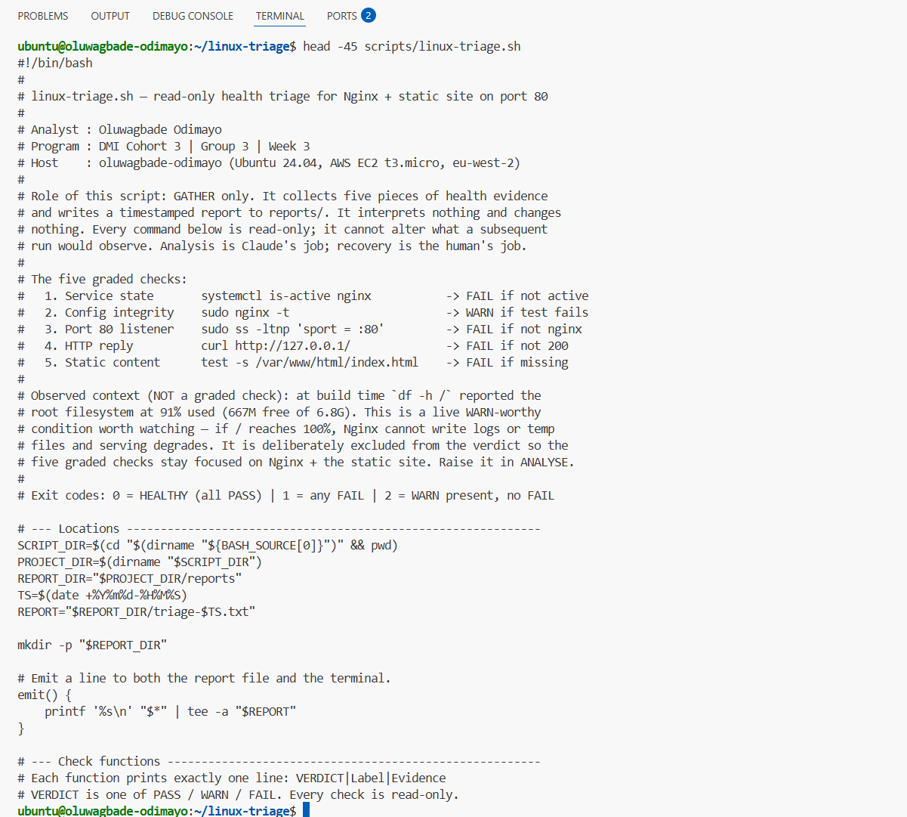

---

#### Screenshot 6 — Middle section showing check functions and conditionals

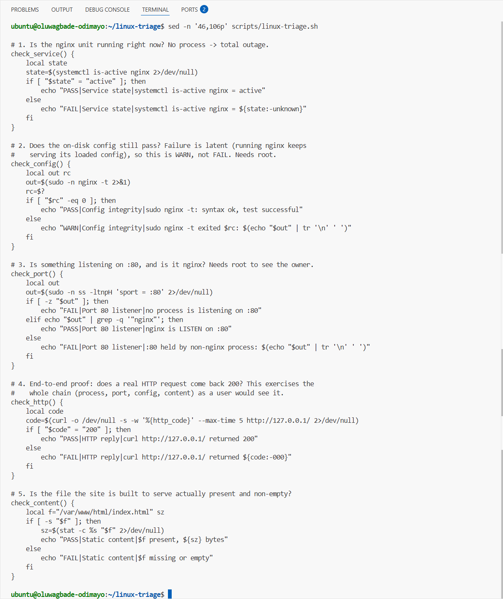

---

#### Screenshot 7 — Bottom section showing the loop, summary function, and exit behavior

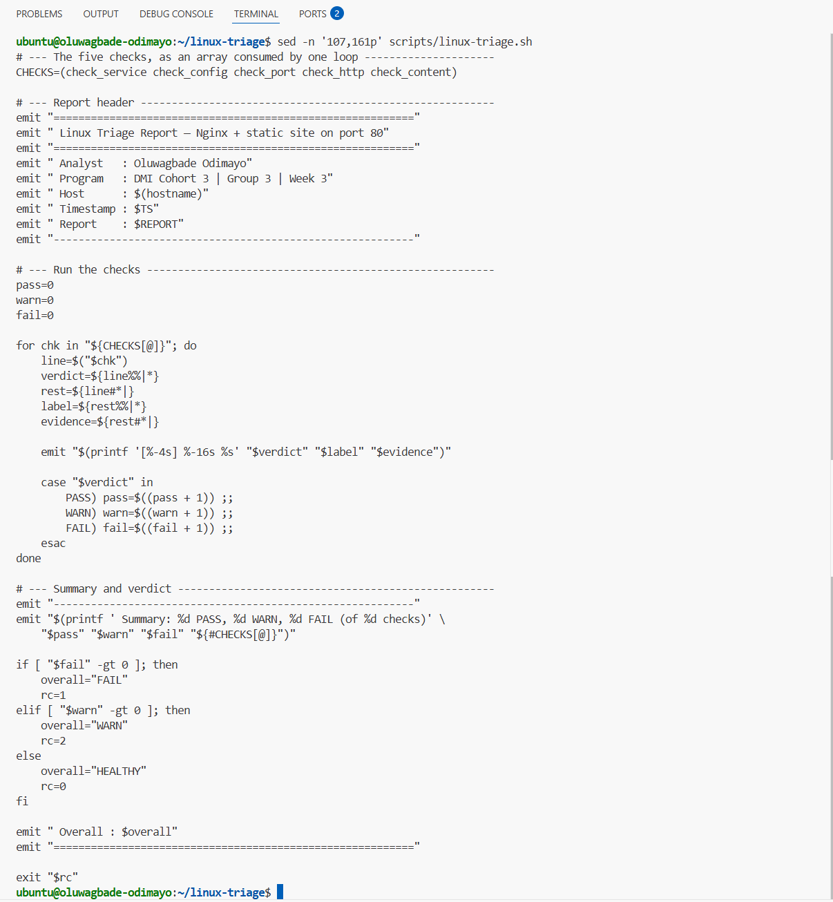

---

#### Screenshot 8 — Output of `bash -n scripts/linux-triage.sh` (no syntax errors) and `ls -l scripts/linux-triage.sh` showing executable permission

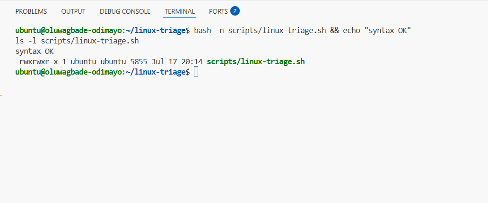

---

### Notes

Answer the following in your own words:

**1. What is stored in the checks array?**

Function names, not commands:

```bash
CHECKS=(check_service check_config check_port check_http check_content)
```

Five strings, each the name of a Bash function defined above it. That indirection is the interesting part. The array does not hold the commands, the thresholds, or the verdict logic. Each of those lives inside its own function, and the array holds only the ordered list of which functions to call.

The consequence is that adding a sixth check is a two-part change with no ripple: write `check_disk`, add its name to the array. The loop, the counters, the summary and the exit logic are untouched, because none of them know or care what the checks actually do. They only know each one prints a `VERDICT|Label|Evidence` line.

That contract is what makes the whole thing composable. The array is configuration. The functions are implementation. The loop is machinery. None of the three needs to know the internals of the others.

---

**2. How does the `for` loop use that array?**

It iterates the array and calls each element as a command, capturing what it prints:

```bash
for chk in "${CHECKS[@]}"; do
    line=$("$chk")
    verdict=${line%%|*}
    rest=${line#*|}
    label=${rest%%|*}
    evidence=${rest#*|}
    ...
done
```

`"$chk"` holds a string like `check_service`, and running `$("$chk")` executes the function of that name and captures its output. That is why the array can hold names rather than commands: Bash resolves the name to the function at call time.

The four lines after it split the returned `VERDICT|Label|Evidence` string on pipes using parameter expansion. `${line%%|*}` strips the longest match of `|*` from the end, leaving `PASS`. `${line#*|}` strips the shortest match of `*|` from the front, leaving the rest. Doing it this way rather than with `cut` or `awk` means no subprocess is spawned per field, which matters not at all at five checks and would matter at five hundred.

The `case` block then increments one of three counters based on the verdict, and those counters are what the summary and the exit code are computed from.

The whole thing is written once and runs five times. Adding checks does not lengthen it.

---

**3. Why are the health checks separated into functions?**

**Each one has a single job and a single reason to change.** `check_http` knows about curl and status codes. It knows nothing about report formatting, counters or exit codes. If I want to change the timeout from 5 seconds to 2, there is exactly one place to do it.

**`local` contains them.** Every check declares its variables with `local`, so `check_config`'s `out` and `rc` cannot collide with anything outside it. Without `local` those would be global and would leak between checks, which is the sort of bug that produces a wrong verdict rather than an error.

**They return a verdict through a contract.** Each prints one `VERDICT|Label|Evidence` line and nothing else. That uniform shape is what lets one loop handle all five without knowing what any of them do.

**They are testable in isolation.** I can run `check_port` on its own and see what it says. A 161-line linear script can only be tested by running the whole thing.

**They name the intent.** `check_service`, `check_config`, `check_port`, `check_http`, `check_content` reads as a list of what the script verifies. You can understand the coverage without reading a single command.

---

**4. What is the purpose of `$(...)` in this script?**

Command substitution: run a command and use its **output** as a value rather than letting it print to the screen.

It appears throughout, doing three distinct jobs.

**Capturing evidence to test against:**
```bash
state=$(systemctl is-active nginx 2>/dev/null)
code=$(curl -o /dev/null -s -w '%{http_code}' --max-time 5 http://127.0.0.1/)
```
Without `$( )` the output would print and the variable would be empty, so there would be nothing to compare in the `if`.

**Calling the check functions from the loop:**
```bash
line=$("$chk")
```
This is the one that makes the array-of-function-names pattern work at all.

**Building the report header at runtime:**
```bash
TS=$(date +%Y%m%d-%H%M%S)
emit " Host      : $(hostname)"
```
Which is why the report says `oluwagbade-odimayo` and `20260717-202409` rather than something I hardcoded and would later have to remember to update.

One detail worth knowing: `$( )` runs in a subshell, so a variable set inside it does not survive outside. And `$( )` is preferred over the older backtick form because it nests cleanly and does not require escaping.

---

**5. Why does the script use different exit codes for HEALTHY, WARN, and FAIL?**

Because an exit code is the only part of the output another program can read.

```bash
if [ "$fail" -gt 0 ]; then
    overall="FAIL"; rc=1
elif [ "$warn" -gt 0 ]; then
    overall="WARN"; rc=2
else
    overall="HEALTHY"; rc=0
fi
exit "$rc"
```

The banner and the PASS/FAIL lines are for me. The number is for machines. `0` HEALTHY, `1` any FAIL, `2` WARN with no FAIL.

That single number is what makes this usable in automation. `./scripts/linux-triage.sh && ./deploy.sh` deploys only on a clean bill of health. A cron job can page on 1 and log on 2. A CI pipeline can gate on it. A script that prints "HEALTHY" in large friendly letters and always exits 0 is worthless to every one of those, no matter how good the output looks to a human.

The three-way split is doing real work rather than being decorative. FAIL and WARN are genuinely different states and deserve different responses: FAIL means the site is down and someone should be woken up. WARN means something is degraded or latent and someone should look in the morning. Collapsing them into one non-zero code would force the caller to parse text to tell an outage from a warning, which is exactly what the exit code exists to avoid.

The precedence matters too: FAIL is checked first, so a run with both a FAIL and a WARN exits 1. The worst thing present wins, which is the only safe default.

My healthy run exited **0**. The incident run exited **1**.

---

# Task 5 — Run and Understand the Healthy-State Report

## Goal

Run the Bash script against the healthy server and verify that it creates a report.

### Evidence

#### Screenshot 9 — Output of `./scripts/linux-triage.sh` showing your Full Name and all five check results

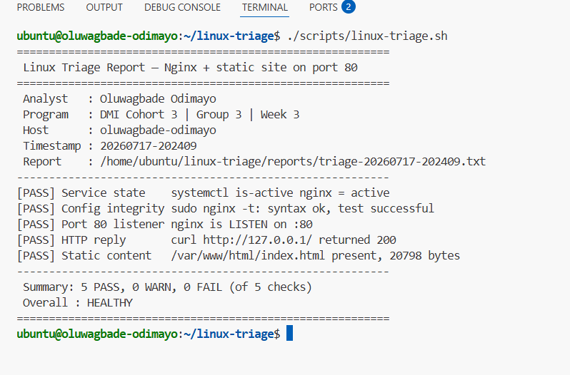

---

#### Screenshot 10 — Output showing the captured exit code and final summary

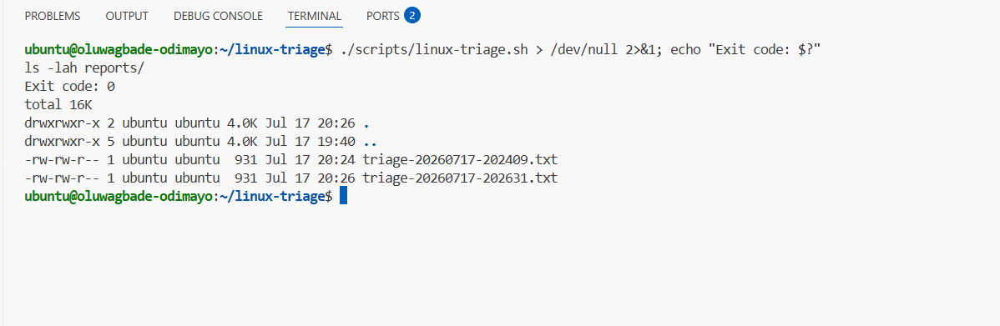

---

### Notes

Answer the following in your own words:

**1. What is the overall status of your healthy baseline?**

**HEALTHY. 5 PASS, 0 WARN, 0 FAIL, exit code 0.**

```
 Analyst   : Oluwagbade Odimayo
 Host      : oluwagbade-odimayo
 Timestamp : 20260717-202409
----------------------------------------------------------
[PASS] Service state    systemctl is-active nginx = active
[PASS] Config integrity sudo nginx -t: syntax ok, test successful
[PASS] Port 80 listener nginx is LISTEN on :80
[PASS] HTTP reply       curl http://127.0.0.1/ returned 200
[PASS] Static content   /var/www/html/index.html present, 20798 bytes
----------------------------------------------------------
 Summary: 5 PASS, 0 WARN, 0 FAIL (of 5 checks)
 Overall : HEALTHY
```

Written to `reports/triage-20260717-202409.txt`.

One honest caveat that the verdict does not carry: the root filesystem was at 91% during this run. It is not one of the five graded checks, so it cannot turn the verdict amber, and I deliberately left it out so the checks stay focused on Nginx and the site. But "HEALTHY" here means "these five things are fine", not "nothing on this box needs attention". A verdict is only as broad as what it measures.

---

**2. Which exact Linux evidence proves the application is serving traffic?**

```
[PASS] HTTP reply       curl http://127.0.0.1/ returned 200
```

That one line, and it is the only one of the five that proves it.

The other four are necessary but not sufficient. `systemctl is-active` proves a process exists. `ss` proves something is bound to port 80. `nginx -t` proves a file parses. `test -s index.html` proves a file exists. **All four can be green while the site returns a 500 to every visitor.**

I know that because I watched it happen in Assignment 3. I moved `index.html` out of the web root and got:

```
HTTP/1.1 500 Internal Server Error
```

Nginx was active, listening, and its config was valid. Four checks would have been green. Only the HTTP check would have caught it.

The `200` is the only assertion that exercises the whole chain end to end, the way a user does: process running, port bound, config loaded, file readable, response returned. Everything else is a component test. This is the integration test.

Supporting it, `Content-Length: 20798` matches `index.html` byte for byte in `/var/www/html`, which proves the bytes going out are the bytes on disk rather than a default page or a cached copy.

---

**3. Did your script return exit code 0 or 1? Explain why.**

**0**, on the healthy baseline.

The script computes it from the counters the loop built:

```bash
if [ "$fail" -gt 0 ]; then
    rc=1        # any FAIL at all
elif [ "$warn" -gt 0 ]; then
    rc=2        # WARN, but nothing failed
else
    rc=0        # everything passed
fi
```

With `fail=0` and `warn=0`, both conditions are false and it falls through to `rc=0`.

The contrast makes it concrete. During the incident the same script returned **1**, because `check_service`, `check_port` and `check_http` each returned FAIL, so `fail=3` and the first branch fired.

`0` is the universal Unix convention for success, which is why `&&` chains work: `./linux-triage.sh && ./deploy.sh` runs the deploy only on a 0. That convention is the whole reason the number is worth setting correctly rather than always exiting 0 and printing a status.

---

**4. What is the difference between a warning and a failure in this script?**

**FAIL means the site is broken for users right now. WARN means something is wrong but users cannot tell yet.**

That distinction decides the exit code, and it decides whether someone gets woken up.

Four of my five checks are FAIL conditions: service inactive, no listener on 80, curl not returning 200, index.html missing. Each of those is user-visible. Someone loading the site sees a failure.

**Config integrity is the only WARN, and the reasoning is the interesting part.** A broken `nginx -t` does **not** mean the site is down. Nginx loads its config into memory at start and keeps serving from that copy. You can corrupt the file on disk and the site carries on perfectly. What a failed `nginx -t` actually means is that the *next* reload or restart will fail, which is a trap rather than an outage.

Flagging that FAIL would be actively harmful. It would exit 1 and imply the site is down while checks 1, 3 and 4 sit green, and a monitoring system paging at 3am for a site that is serving fine is how people learn to ignore alerts.

I lived this in Assignment 3. I removed a semicolon from the config and `nginx -t` returned `[emerg]`. The site stayed up for the nine minutes it took me to notice and fix it, because I never restarted while it was broken. Zero users affected, real problem present. That is exactly the shape WARN exists to describe.

The precedence follows from this: FAIL is tested first, so a run with both exits 1. The worst thing present sets the verdict.

---

# Task 6 — Create and Run the /linux-triage Skill

## Goal

Turn the Bash script into a reusable, manually invoked Agentic AI workflow.

### Evidence

#### Screenshot 11 — `SKILL.md` showing the frontmatter, allowed tool restrictions, and safety rules

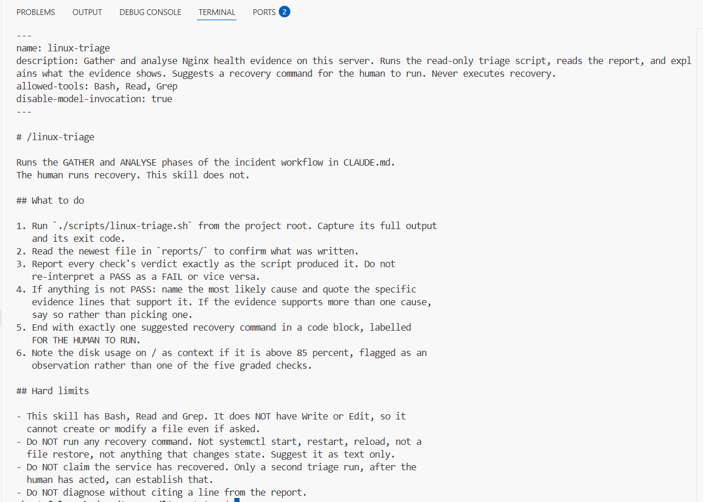

---

#### Screenshot 12 — `/linux-triage` output for the healthy server

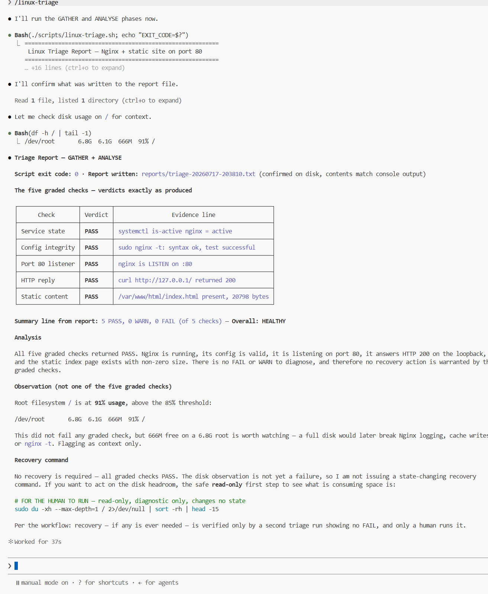

---

### Notes

Answer the following in your own words:

**1. Why does this skill have Bash, Read, and Grep, but not Write?**

Because the skill's job is to gather and analyse. Nothing in that requires creating or modifying a file.

```yaml
allowed-tools: Bash, Read, Grep
```

Bash runs the triage script. Read opens the report it wrote. Grep searches it. That is the complete set of things this skill needs to do its work, so that is the complete set it gets. Least privilege: not "what might be handy", but "what is necessary".

**Why it matters that this is a tool restriction rather than an instruction.** CLAUDE.md tells Claude not to modify files. That is a rule, and rules can be misread, over-ridden by a persuasive prompt, or forgotten in a long context. Omitting Write from `allowed-tools` means the capability is not there. Claude cannot edit a file even if it concluded it should, even if I asked it to, even if a prompt injection told it to. **A rule is a request. A missing tool is a constraint.**

The honest limitation, which I would rather state than gloss: **Bash is not read-only.** `sudo systemctl start nginx` is a Bash command, and this skill has Bash. So the tool list narrows the blast radius but does not eliminate it. The safety here is layered: CLAUDE.md's explicit prohibition, plus the skill's own hard limits, plus no Write. Claude respected the prohibition across three invocations, including one where nginx was down and the fix was one obvious command away. That is evidence the layer works, not proof that it always would.

---

**2. Why is `disable-model-invocation: true` useful for this skill?**

It means the skill runs **only when I type `/linux-triage`**, never because a model decided a conversation looked relevant.

Without it, Claude can invoke a skill on its own when the description seems to match what is being discussed. That is genuinely useful for something like a formatter. It is wrong for this, for three reasons.

**This skill touches production.** It runs a script against a live server, uses sudo twice, and writes a report. That should happen because a human decided to look, at a moment of their choosing. Not because I mentioned nginx in passing.

**Auto-invocation makes triage output untrustworthy as a record.** Every report in `reports/` should correspond to a deliberate act. If reports appear because a conversation drifted near the topic, the directory stops being an incident timeline and becomes noise.

**It is a defence against prompt injection.** If a model can auto-invoke a skill based on a description match, then text I did not write, in a file, a log, or a web page, can influence whether it fires. Requiring an explicit slash command means the trigger is a keystroke I made, not a string a model matched.

The general principle: anything that reaches out and touches a real system should be pulled by a human, not pushed by a model. This is the same instinct as the human running the recovery command.

---

**3. What part is performed by Bash, and what part is performed by Claude?**

A clean split, and the whole design rests on it.

**Bash gathers.** `linux-triage.sh` runs five commands and prints five verdicts. It is deterministic: same system state, same output, every time. It has no opinion. It cannot be persuaded, cannot be flattered into a different answer, and cannot hallucinate a check it did not run. It also cannot explain what any of it means.

**Claude analyses.** It reads the report and does the things the script cannot: recognises that three FAILs are one causal chain rather than three faults, uses the two PASSes to rule out config and content, spots that `000` means no connection rather than a server error, and states plainly what the evidence does not support.

**The human acts.** Neither of the other two changes anything.

Why the split rather than one or the other:

- **Bash alone** gives you five lines of raw verdict and no interpretation. You still need someone who knows what `curl returned 000` implies.
- **Claude alone**, with no script, is guessing. Ask an LLM "is my server healthy?" with no evidence and you get a plausible-sounding answer generated from training data rather than from your box.

Together, the deterministic part produces facts and the probabilistic part interprets them. Each does what it is actually good at. The evidence is reproducible because a script made it, and the reading of it is intelligent because a model did that part.

---

**4. Why is this better than asking Claude "Is my server healthy?" without giving it evidence?**

Because without evidence the answer is generated, not observed. It will read fluently and it will be about servers in general rather than about this one.

The concrete differences.

**Evidence over inference.** My skill's answer cites `systemctl is-active nginx = active` and `curl http://127.0.0.1/ returned 200`. Those are facts from this box at 20:24:09. A bare question produces confident prose with nothing underneath it, and confident prose is exactly what an LLM produces when it does not know.

**Reproducibility.** Same script, same system state, same five verdicts. Ask the open question twice and you may get two differently-worded answers with different emphasis. You cannot diff those. You can diff reports, which is precisely how I proved recovery: `incident-failure-report.txt` versus `recovery-report.txt`, same five checks, different verdicts.

**A record.** `reports/` now holds seven timestamped files. That is an incident timeline. A chat answer is a chat answer.

**Findable gaps.** Because the script defines the five checks, I know exactly what is not covered. Disk is not one of them, which is why Claude flagged 91% as an observation rather than folding it into the verdict. With an open-ended question you cannot tell what was not checked, because nothing was.

**The honest "I do not know".** During the incident Claude wrote that the evidence could not distinguish a clean stop from a crash, because the triage did not collect `journalctl`. That sentence is only possible when there is a defined evidence set with a defined edge. Ask an unanchored question and there is no edge, so there is nothing to be honest about.

---

# Task 7 — Simulate an Nginx Incident and Let the Skill Diagnose It

## Goal

Create a controlled service failure, gather evidence through Bash, and let Claude analyze the evidence without taking recovery action.

### Evidence

#### Screenshot 13 — Output showing Nginx is inactive and the HTTP request fails

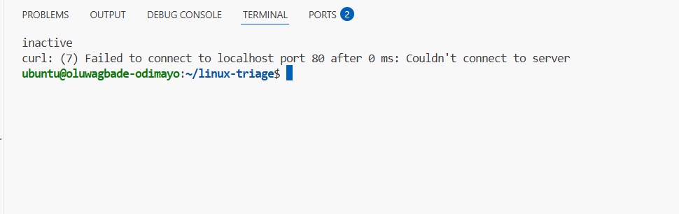

---

#### Screenshot 14 — `/linux-triage` output showing failed evidence, most likely cause, and a suggested recovery command

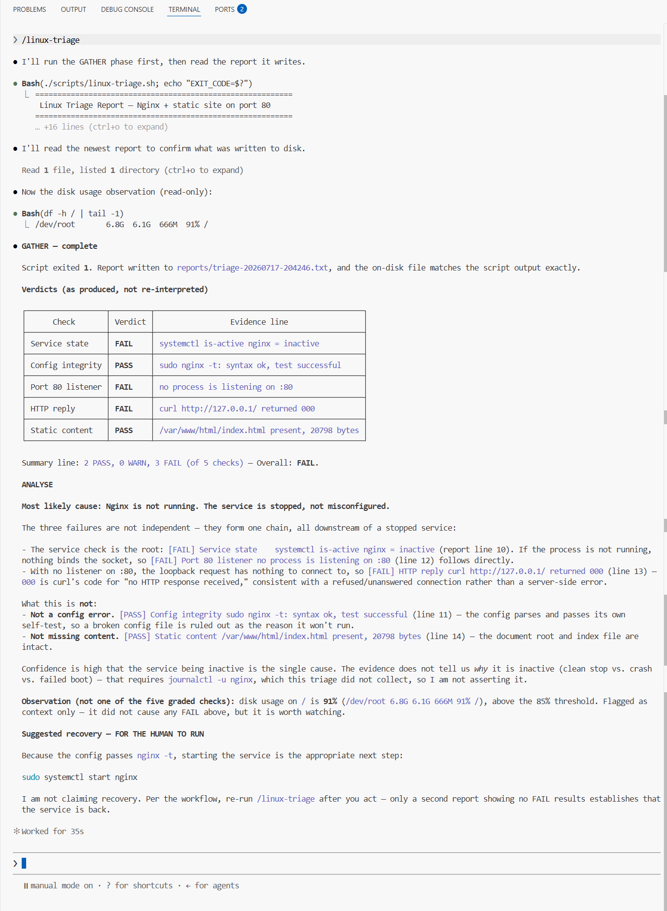

---

#### Screenshot 15 — `incident-failure-report.txt` showing the failed checks and your Full Name

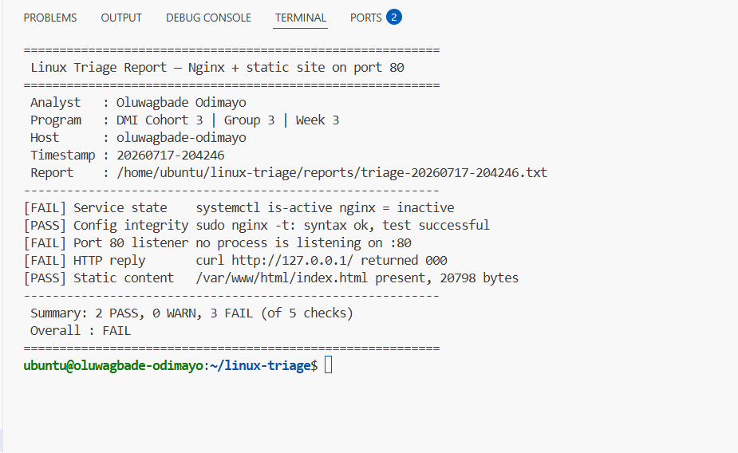

---

### Notes

Answer the following in your own words:

**1. Which three checks failed?**

**Service state, Port 80 listener, and HTTP reply.**

```
[FAIL] Service state    systemctl is-active nginx = inactive
[PASS] Config integrity sudo nginx -t: syntax ok, test successful
[FAIL] Port 80 listener no process is listening on :80
[FAIL] HTTP reply       curl http://127.0.0.1/ returned 000
[PASS] Static content   /var/www/html/index.html present, 20798 bytes
 Summary: 2 PASS, 0 WARN, 3 FAIL (of 5 checks)
 Overall : FAIL
```

Exit code 1. Report: `reports/incident-failure-report.txt`.

**The two that passed are as informative as the three that failed.** Config integrity passing rules out a broken config file. Static content passing rules out missing content. So the fault is not the configuration and not the files. It is the service itself, and the two green checks are what narrow it to that.

Five checks failing together would tell me almost nothing about where to look. Three failing while two hold tells me exactly where to look.

---

**2. What evidence supports the conclusion that Nginx is unavailable?**

Three lines, and they form a chain rather than three independent findings.

**`systemctl is-active nginx = inactive`** is the root. Systemd, the thing that manages the process, reports it is not running.

**`no process is listening on :80`** follows directly. `sudo ss -ltnp 'sport = :80'` returned nothing at all, not a row owned by something else. No process means nothing holds the socket. This is a consequence of the first, not a separate fault.

**`curl http://127.0.0.1/ returned 000`** is the third link, and the status code is the detail that carries the argument. **`000` is curl's code for no HTTP response received at all**, meaning the connection was refused or never established. That is materially different from `500`, `404` or `403`, which would all mean a server answered and rejected the request. `000` means nobody was listening.

The contrast with Assignment 3 makes the point. There I got a real `500` from a live Nginx that was serving errors. Here I got `000` from nothing at all. Same site down, completely different failure mode, and the status code is what distinguishes them.

**What the evidence does not support**, and Claude said so rather than filling the gap: it cannot tell why the service is inactive. A clean stop, a crash and an OOM kill are identical to `systemctl is-active`. That needs `journalctl -u nginx`, which the triage did not collect. So the conclusion stops at "the service is not running" and does not extend to "the service crashed".

---

**3. Did Claude execute the recovery command? Why is that important?**

**No.** It produced this and stopped:

> **Suggested recovery, FOR THE HUMAN TO RUN**
> Because the config passes `nginx -t`, starting the service is the appropriate next step:
> ```bash
> sudo systemctl start nginx
> ```
> I am not claiming recovery. Per the workflow, re-run `/linux-triage` after you act. Only a second report showing no FAIL results establishes that the service is back.

I read that, agreed with it, and ran the command myself at 20:46:18.

**Why it matters, in order of weight:**

**Restarting destroys the evidence of why it broke.** This is the real argument, and it is not obvious. The restart works, the alert clears, the graph goes green, and the cause is untouched. If nginx had died because the disk hit 100%, or the OOM killer took it, or a config change would fail on the next boot, an automatic restart hides every one of those and hands you a recurrence at a worse hour with less information. **In an incident, the first instinct should be to preserve the scene.**

**The agent cannot see the whole picture.** My triage checks five things. It does not know whether a deploy is in flight, whether this box is behind a load balancer, or whether a colleague is mid-investigation. A restart during someone else's debugging destroys their work.

**Accountability requires a person.** If that command had made things worse, Claude cannot answer for it. I can.

**What makes this real rather than a promise:** it was not that Claude chose to be careful. `allowed-tools: Bash, Read, Grep` plus CLAUDE.md's explicit prohibition meant the boundary existed independently of its judgement. And it held at the moment of maximum temptation: the fix was obvious, it was one command, and the skill had Bash. It suggested and stopped anyway.

---

**4. Which phase of the Agentic Loop is represented by the Bash report?**

**GATHER.**

`linux-triage.sh` collected five pieces of evidence and wrote `incident-failure-report.txt`. It made no judgement about what any of it meant. `[FAIL] Service state systemctl is-active nginx = inactive` is an observation, not a diagnosis.

Bash is the right tool for this phase precisely because it is stupid. It is deterministic: same system state, same output, every time. It cannot be persuaded, cannot hallucinate a check it did not run, and cannot decide a check "probably" passed. Those limitations are features when the job is producing facts that a decision will later rest on.

The report is also the artefact that makes everything afterwards auditable. It has a timestamp, it sits on disk, and anyone can read it and reach their own conclusion. If Claude's analysis were wrong, the report would still be right, and someone could catch the error. Evidence that only exists inside a conversation cannot be checked.

---

**5. Which phase is represented by Claude's explanation?**

**ANALYSE.**

Claude took the report as input and produced understanding as output. Four things it did that the script cannot:

**It found the causal chain.** *"The three FAILs are one fault, not three."* The script printed three independent lines. Claude recognised that service inactive causes no listener causes no connection, which turns three symptoms into one root cause.

**It used the PASSes as evidence.** *"Not a config error... Not missing content."* The two green checks are what localise the fault, and the script has no way to reason about that.

**It read the meaning of a value.** *"`000` is curl's code for no HTTP response received, consistent with a refused connection rather than a server-side error."* The script printed `000`. Claude explained why that number rather than `500` matters.

**It marked the boundary of its own evidence.** *"The evidence does not tell us why it is inactive... I am not asserting it."*

ANALYSE ends at a proposal. The command was written out, marked FOR THE HUMAN TO RUN, and not executed. The loop then handed to HUMAN ACT (me, running it) and VERIFY (a second triage). Four phases, three different actors, and no phase does another's job.

---

# Task 8 — Recover Manually, Verify Again, and Write the Incident Summary

## Goal

Recover the service as the human operator and prove that the system is healthy again.

### Evidence

#### Screenshot 16 — Output showing Nginx is active and `curl -I http://localhost` returns 200 OK

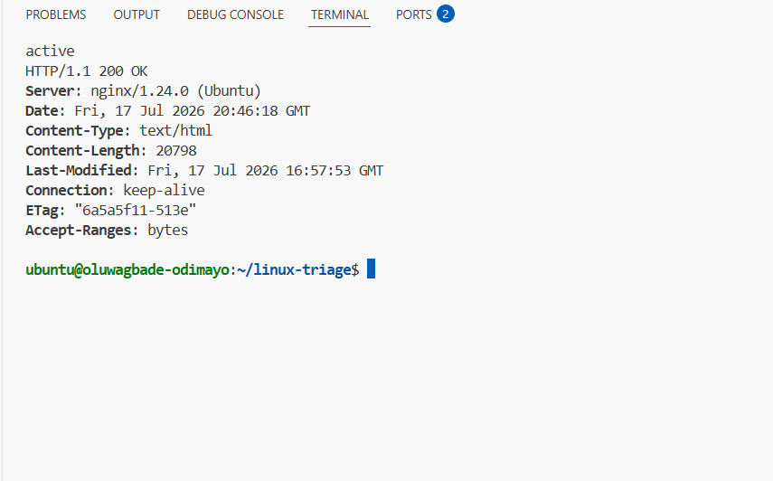

---

#### Screenshot 17 — Second `/linux-triage` output showing successful recovery with no FAIL results

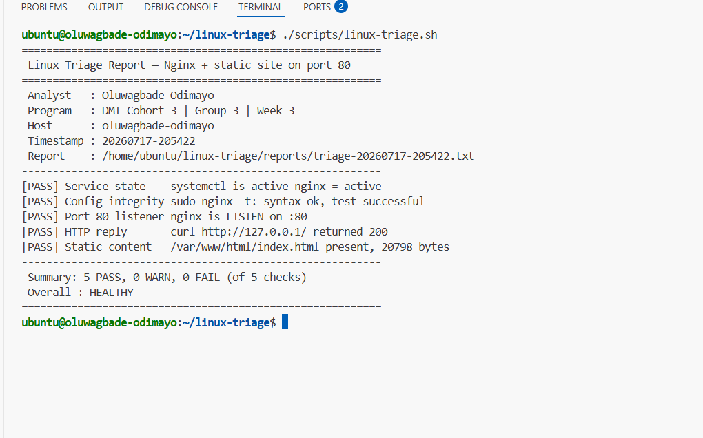

---

#### Screenshot 18 — Output of `ls -lah reports` showing both `incident-failure-report.txt` and `recovery-report.txt`

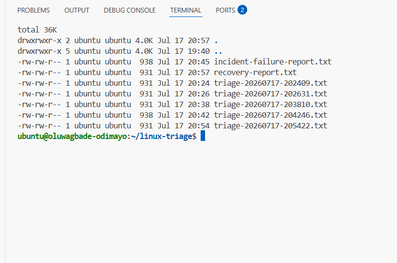

---

#### Screenshot 19 — `incident-summary.md` showing all required sections and your Full Name

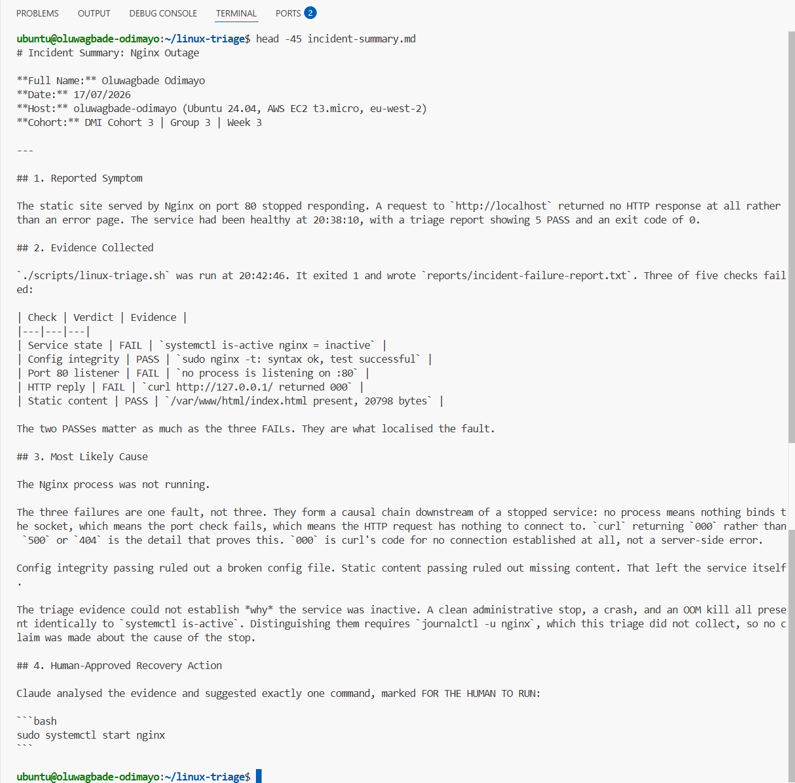

---

### Notes

Answer the following in your own words:

**1. What action did you execute manually?**

```bash
sudo systemctl start nginx
```

Run by me at **20:46:18**, after reading Claude's analysis and agreeing with its reasoning.

The reasoning I was agreeing with matters, because that is the difference between approving and rubber-stamping. Claude's argument was that config integrity passed, so the config was not the problem, so starting the service was the appropriate action rather than fixing something first. Had `nginx -t` been failing too, `start` would have been the wrong command: it would have failed, and the right move would have been to repair the config first. I checked that the recommendation followed from the evidence before I ran it.

Claude produced the command. I read it, understood why, and typed it. That is the HUMAN ACT phase, and the "human" part is doing real work rather than being ceremony.

---

**2. What evidence proves that the service recovered?**

`reports/recovery-report.txt`, generated at 20:54:22:

```
[PASS] Service state    systemctl is-active nginx = active
[PASS] Config integrity sudo nginx -t: syntax ok, test successful
[PASS] Port 80 listener nginx is LISTEN on :80
[PASS] HTTP reply       curl http://127.0.0.1/ returned 200
[PASS] Static content   /var/www/html/index.html present, 20798 bytes
 Summary: 5 PASS, 0 WARN, 0 FAIL (of 5 checks)
 Overall : HEALTHY
```

Exit code 0.

**What makes this proof rather than an impression is that it is the same five checks that reported the outage.** Three of them were FAIL at 20:42:46. All five are PASS at 20:54:22. Same script, same commands, same thresholds. The only variable is the system state, so the difference in output is attributable to the recovery and nothing else.

The `curl` line carries the most weight. `200` proves the whole chain works from a user's point of view: process up, port bound, config loaded, file readable, response returned. And `Content-Length: 20798` matches `index.html` on disk, so it is serving the right thing rather than merely serving something.

Also worth noting: `systemctl status` shows `Active: active (running) since Fri 2026-07-17 20:46:18 UTC`, which matches the moment I ran the command. The recovery is attributable to my action, not to something else that happened to fix it.

---

**3. Why is the second triage run necessary?**

Because "the command appeared to work" is not evidence, and the gap between those two things is where outages hide.

`sudo systemctl start nginx` returning to the prompt with no error means systemd accepted the request. It does not mean nginx is serving. The process could start and immediately exit. It could start and fail to bind port 80 because something else grabbed it. It could bind and then 500 on every request. **Every one of those is a silent start followed by a broken site.**

Only running the same checks again closes that gap. And it has to be the *same* checks, or the comparison means nothing. Verifying recovery with a different method than you used to detect the failure is comparing two things that were never comparable.

This is also the rule that stops the loop from being circular. CLAUDE.md says:

> *Claude MUST NOT claim the service has recovered. Only a second triage run, after the human has acted, can establish that.*

Claude honoured that both times. During the incident: *"I am not claiming recovery."* Recovery is a fact established by evidence, not a status announced by whoever ran the command.

And Assignment 3 is why I take this seriously rather than treating it as procedure. That night my rollback ran cleanly, returned no error, and accomplished absolutely nothing, because the backup I restored was itself the broken file. `cp` succeeded. The fix failed. I only found out because I re-ran `nginx -t`. **An action completing is not the same as an action working.**

---

**4. What could go wrong if an AI agent automatically restarted every failed service?**

It would work most of the time, and that is precisely what makes it dangerous.

**It destroys the evidence.** This is the big one. The restart succeeds, the alert clears, the dashboard goes green, and the cause is completely untouched. If nginx died because the disk hit 100%, because the OOM killer chose it, or because a config change will fail on the next boot, the restart hides every one of those. You have not fixed anything. You have deleted the information you needed to fix it and bought a recurrence at a worse hour.

**It masks a worsening trend.** A service restarting once a week, then daily, then hourly, is a system telling you something. An agent that silently restarts it turns that signal into silence, right up until the restart stops working.

**Restart loops.** If the cause persists, the agent restarts, it fails, the agent restarts. Now you have a flapping service, a log full of noise, and possibly a thundering herd against whatever is downstream.

**It acts on partial context.** My triage sees five things. It does not know a deploy is mid-flight, or that this box is drained from a load balancer, or that a colleague stopped nginx deliberately five minutes ago to investigate. A helpful restart destroys their work.

**Nobody is accountable.** If the restart makes it worse, the agent cannot answer for it.

**And the failure mode is the sinister kind:** it is right often enough to be trusted, then wrong on the day it matters, when the actual problem was the disk and you had no evidence left because everything looked green.

The 91% disk on this box makes it concrete. If `/` filled and nginx died, an auto-restarting agent would restart it, it would die again, and the loop would continue while the real problem, the disk, sat unexamined. A human seeing three FAILs and a 91% disk asks a different question entirely.

---

**5. In one sentence, explain the difference between using AI as a chatbot and using AI in this agentic workflow.**

A chatbot answers a question from its training data and stops at the edge of the conversation, whereas this workflow puts a deterministic script in front of it to produce real evidence from the actual machine, restricts its tools so it can read that evidence but cannot act on it, and keeps a human in the one seat where the irreversible decision gets made: the AI is not the thing being asked, it is one instrumented stage between Bash that cannot lie and a person who can be held responsible.

---

# Incident Summary

Fill in all seven sections below in your own words.

**Full Name:** Oluwagbade Odimayo

**Date:** 17/07/2026

---

**1. Reported Symptom**

The static EpicReads portfolio served by Nginx on port 80 stopped responding. A request to `http://localhost` returned no HTTP response at all rather than an error page. The service had been healthy at 20:38:10, with a triage report showing 5 PASS and exit code 0.

---

**2. Evidence Collected**

`./scripts/linux-triage.sh` ran at 20:42:46, exited **1**, and wrote `reports/incident-failure-report.txt`. Three of five checks failed:

| Check | Verdict | Evidence |
|---|---|---|
| Service state | FAIL | `systemctl is-active nginx = inactive` |
| Config integrity | PASS | `sudo nginx -t: syntax ok, test successful` |
| Port 80 listener | FAIL | `no process is listening on :80` |
| HTTP reply | FAIL | `curl http://127.0.0.1/ returned 000` |
| Static content | PASS | `/var/www/html/index.html present, 20798 bytes` |

The two PASSes are what localised the fault.

---

**3. Most Likely Cause**

The Nginx process was not running.

The three failures are one fault, not three: a causal chain downstream of a stopped service. No process means nothing binds the socket, which means the port check fails, which means the HTTP request has nothing to connect to. `curl` returning `000` rather than `500` or `404` is what proves it. `000` is curl's code for no connection established at all, not a server-side error.

Config integrity passing ruled out a broken config. Static content passing ruled out missing files. That left the service itself.

The triage could not establish **why** it was inactive. A clean stop, a crash and an OOM kill present identically to `systemctl is-active`. Distinguishing them needs `journalctl -u nginx`, which this triage did not collect, so no claim was made.

---

**4. Human-Approved Recovery Action**

Claude analysed the evidence and suggested exactly one command, marked FOR THE HUMAN TO RUN:

```bash
sudo systemctl start nginx
```

I read the analysis, checked that the recommendation followed from the evidence (config passed, so `start` rather than repair-then-start was correct), and executed it myself at 20:46:18.

Claude did not run it and could not have been expected to: the `/linux-triage` skill declares `allowed-tools: Bash, Read, Grep` with no Write, and CLAUDE.md forbids any state-changing command.

---

**5. Verification**

Recovery was not claimed on the strength of the command appearing to work. A second triage at 20:54:22 wrote `reports/recovery-report.txt`:

```
[PASS] Service state    systemctl is-active nginx = active
[PASS] Config integrity sudo nginx -t: syntax ok, test successful
[PASS] Port 80 listener nginx is LISTEN on :80
[PASS] HTTP reply       curl http://127.0.0.1/ returned 200
[PASS] Static content   /var/www/html/index.html present, 20798 bytes
 Summary: 5 PASS, 0 WARN, 0 FAIL (of 5 checks)
 Overall : HEALTHY
```

Exit code 0. The same five checks that reported the outage reported the recovery, which is what makes the comparison meaningful. `systemctl status` independently confirms `active (running) since 20:46:18 UTC`, matching the moment I acted.

---

**6. Safety Decision**

The agent gathered and analysed. It did not act.

This is not ceremony. An agent that restarts a failed service destroys the evidence of why it failed: the restart succeeds, the alert clears, and the cause survives untouched to recur at a worse time. Automated recovery trades diagnosis for uptime, and that trade should be made deliberately by a human who understands what is being given up.

The technical enforcement matters more than the instruction. `allowed-tools: Bash, Read, Grep` means the skill cannot write a file even if it decided to. `disable-model-invocation: true` means it fires only when I type the command, never because a model matched a description. **Rules in prose are a request. A missing tool is a constraint.**

Stated honestly: Bash is not read-only in principle, and `sudo systemctl start nginx` is itself a Bash command. The safety here rests on CLAUDE.md's explicit prohibition as much as on the tool list. Claude respected it across three invocations, including one where nginx was down and the fix was one obvious command away.

---

**7. Agentic Loop Mapping**

| Phase | Who | What happened |
|---|---|---|
| **GATHER** | Bash | `linux-triage.sh` ran five deterministic read-only checks and wrote a timestamped report. No interpretation. Same inputs, same output. |
| **ANALYSE** | Claude | Read the report, named the causal chain, cited the specific lines, ruled out config and content using the two PASSes, stated the limit of the evidence, suggested one command. |
| **HUMAN ACT** | Me | Read the analysis, agreed with the reasoning, ran `sudo systemctl start nginx` at 20:46:18. |
| **VERIFY** | Bash, then me | Second triage at 20:54:22. 5 PASS, exit 0. Only that report established recovery. |

The division is the point. Bash is deterministic and cannot be persuaded. Claude is good at reading evidence and should not be trusted with a restart. I am the only one accountable for what changes.

---

# LinkedIn Post (Required)

## Evidence

#### LinkedIn Post URL

Paste your LinkedIn post URL here:

https://www.linkedin.com/posts/oluwagbade-odimayo-_dmibypravinmishra-devops-linux-activity-7483962190299906048-k4yL

---

#### Screenshot — Published LinkedIn post


---

# GitHub Repository URL

Paste the URL of your GitHub folder or repository containing the assignment files here:

https://github.com/gbadedata/devops-micro-internship-pravinmishra/tree/main/week-03-linux-and-bash-for-devops

---

# Submission Instructions

- Add all required screenshots in your submission
- Full Name must be visible in required screenshots and the Bash report
- All written answers must be in your own words
- Do not expose sensitive information (keys, passwords, AWS account IDs, tokens)
- GitHub URL must be included in this document

---

# Completion Checklist

- [x] Task 1: Healthy baseline confirmed, workspace created (Screenshots 1–2, Notes answered)
- [x] Task 2: CLAUDE.md created with all four sections (Screenshot 3, Notes answered)
- [x] Task 3: Five-check plan produced by Claude using read-only tools (Screenshot 4, Notes answered)
- [x] Task 4: `linux-triage.sh` created, syntax validated, executable permission set (Screenshots 5–8, Notes answered)
- [x] Task 5: Healthy-state report generated with no FAIL result (Screenshots 9–10, Notes answered)
- [x] Task 6: `/linux-triage` skill created and run successfully on healthy server (Screenshots 11–12, Notes answered)
- [x] Task 7: Nginx incident simulated, failed evidence captured, Claude did not execute recovery (Screenshots 13–15, Notes answered)
- [x] Task 8: Nginx recovered manually, recovery verified, reports saved, incident summary complete (Screenshots 16–19, Notes answered)
- [x] Incident summary contains all seven required sections
- [x] LinkedIn post published and URL submitted
- [x] Full Name visible in all required screenshots and the Bash report
- [x] Skill does not have Write permission
- [x] Skill did not execute any recovery commands
- [x] No sensitive data exposed

---

## 📌 About DMI & CloudAdvisory

DevOps Micro Internship (DMI) is a project-based DevOps program run by Pravin Mishra (The CloudAdvisory) focused on real-world execution, systems thinking, and career readiness.

It helps learners build strong DevOps foundations with hands-on experience.

---

## 📌 Resources

- 🌐 DMI Official Website: https://pravinmishra.com/dmi  
- 🎓 DevOps for Beginners (Udemy): https://www.udemy.com/course/devops-for-beginners-docker-k8s-cloud-cicd-4-projects/  
- 🎓 Agentic AI DevOps with Claude Code: https://www.udemy.com/course/ultimate-agentic-ai-devops-with-claude-code/  
- 🎓 DevOps with Claude Code: Terraform, EKS, ArgoCD & Helm: https://www.udemy.com/course/devops-with-claude-code-terraform-eks-argocd-helm/  
- ▶️ YouTube Playlist: https://www.youtube.com/playlist?list=PLFeSNDtI4Cho  
- 🔗 Pravin Mishra (LinkedIn): https://www.linkedin.com/in/pravin-mishra-aws-trainer/  
- 🏢 CloudAdvisory (LinkedIn): https://www.linkedin.com/company/thecloudadvisory/

---

*This submission is part of DevOps Micro Internship (DMI) Cohort 3 — Agentic AI Track.*