# Assignment 3 — CodeTrack: Branching Workflow (Add & Verify a Contact Page)

Part of the DevOps Micro Internship (DMI) Cohort 3 with Agentic AI

---

## Purpose

In this assignment, you will add a new Contact page to CodeTrack using a clean feature-branch workflow. You will keep each change in a separate commit, prove that your default branch remains unchanged before the merge, and validate the result after merging.

---

# Task 1 — Confirm Repository State and Default Branch

## Goal

Start from a clean default branch (`main` or `master`) and confirm the repository status.

### Evidence

#### Screenshot 1 — Output of `git status` and `git branch` showing a clean status and the default branch checked out

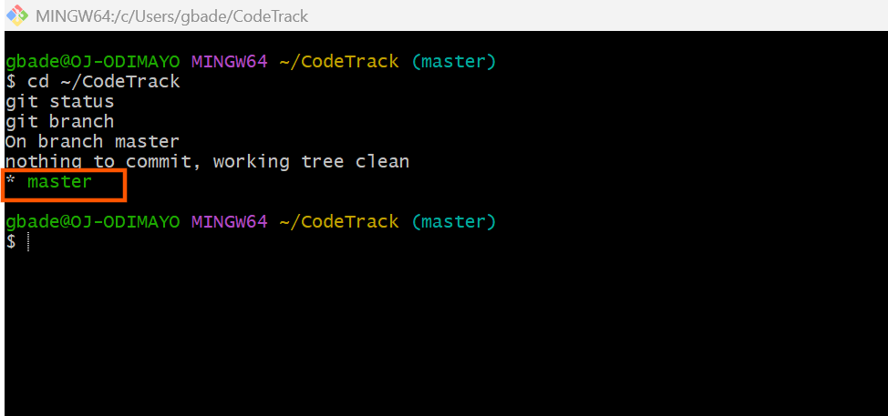

Started from a clean working tree with master checked out, so the feature branch would begin from a known good state.

---

# Task 2 — Create and Switch to a Feature Branch

## Goal

Create a branch named exactly `feature/contact-page` and switch to it.

### Evidence

#### Screenshot 2 — Output of `git checkout -b feature/contact-page` and `git branch` showing `* feature/contact-page`

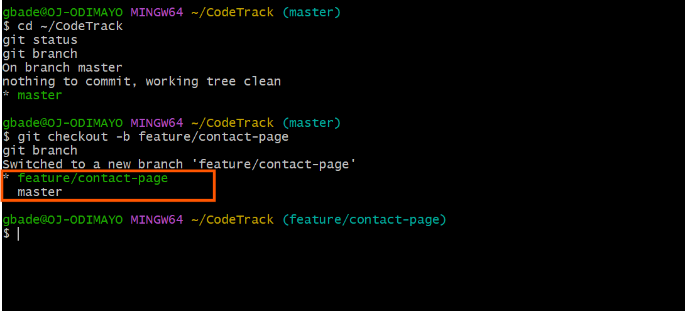

Created and switched to feature/contact-page in one step. The asterisk confirms it is the active branch.

---

# Task 3 — Add contact.html on the Feature Branch

## Goal

Create `contact.html` with the provided content and commit it alone using the message `feat(contact): add Contact page`.

### Evidence

#### Screenshot 3 — Output of `ls` showing `contact.html`

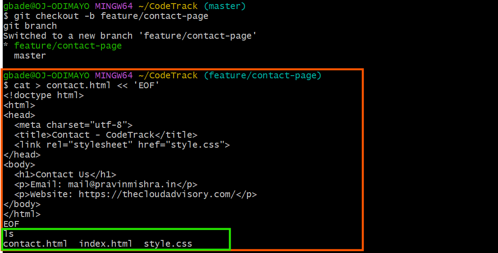

contact.html now exists in the working directory alongside the two original files.

---

#### Screenshot 4 — Output of `git commit`

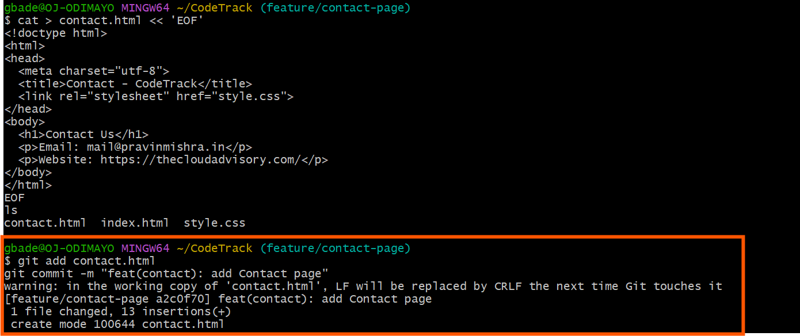

Committed the new page on its own, keeping the change isolated from the navigation update that follows.

---

#### Screenshot 5 — Output of `git log --oneline -3` showing the new commit

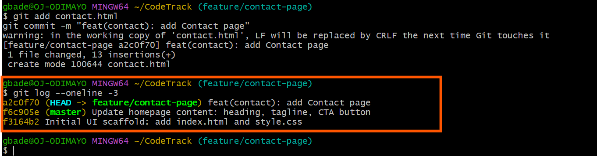

The feature commit sits at the top of the branch history.

---

# Task 4 — Add the Contact Link to index.html

## Goal

Add the provided Contact Page link to `index.html` and commit it separately using the message `feat(nav): add Contact Page link`.

### Evidence

#### Screenshot 6 — Output of `git status` showing `index.html` as modified before staging

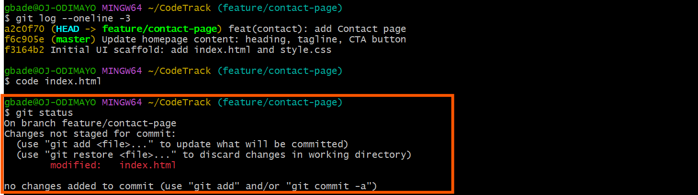

Git detected index.html as modified before staging, after adding the Contact Page paragraph.

---

#### Screenshot 7 — Output of `git commit`

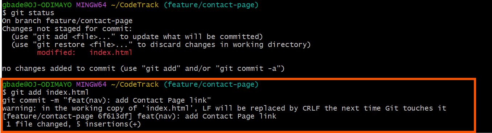

The navigation link committed separately, five insertions, so each change can be reviewed or reverted on its own.

---

#### Screenshot 8 — Browser showing the Contact Page link on the homepage while on `feature/contact-page`

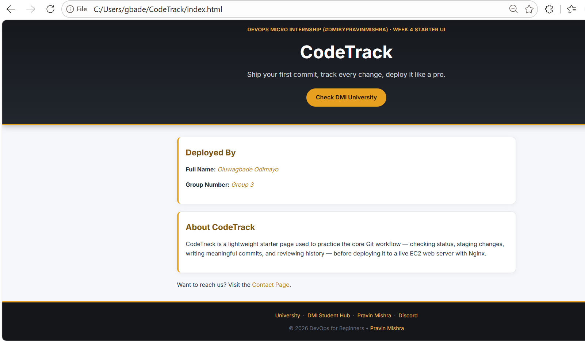

On feature/contact-page the homepage shows the Contact Page link near the foot of the container.

---

# Task 5 — Verify Isolation (Prove the Default Branch Is Unchanged)

## Goal

Switch back to the default branch and confirm that `contact.html` and the Contact Page link do not exist there yet.

### Evidence

#### Screenshot 9 — Terminal showing the checkout and `ls` output, proving `contact.html` is absent

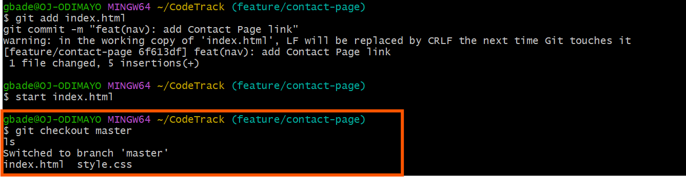

Back on master, ls lists only index.html and style.css. contact.html does not exist here, which proves the branch kept the work isolated.

---

#### Screenshot 10 — Browser showing the homepage on the default branch with no Contact Page link

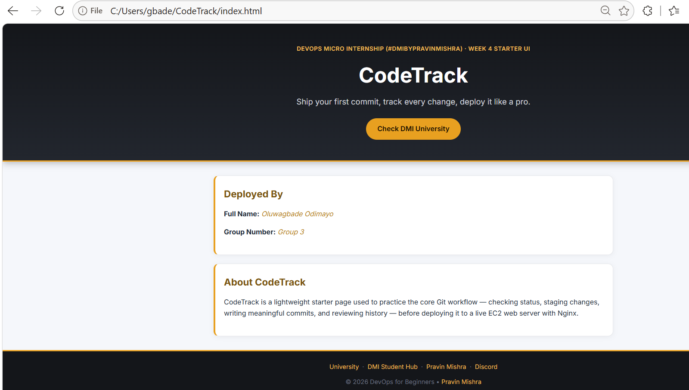

The same file path in the browser, but the Contact Page paragraph is gone. Git swapped the file contents when the branch changed.

---

# Task 6 — Merge the Feature Branch into the Default Branch

## Goal

Merge `feature/contact-page` into your default branch and confirm the Contact page works.

### Evidence

#### Screenshot 11 — Output of `git merge feature/contact-page`

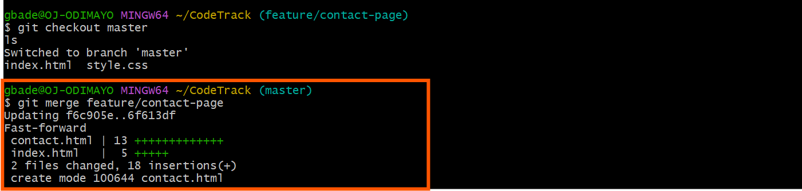

A fast-forward merge brought both commits into master: 2 files changed, 18 insertions.

---

#### Screenshot 12 — Output of `ls` showing `contact.html` after the merge

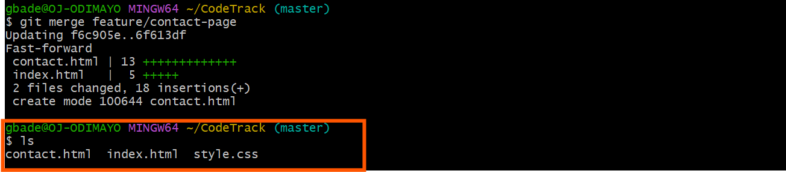

contact.html is now present on master.

---

#### Screenshot 13 — Browser showing the Contact page opened from the homepage link on the default branch

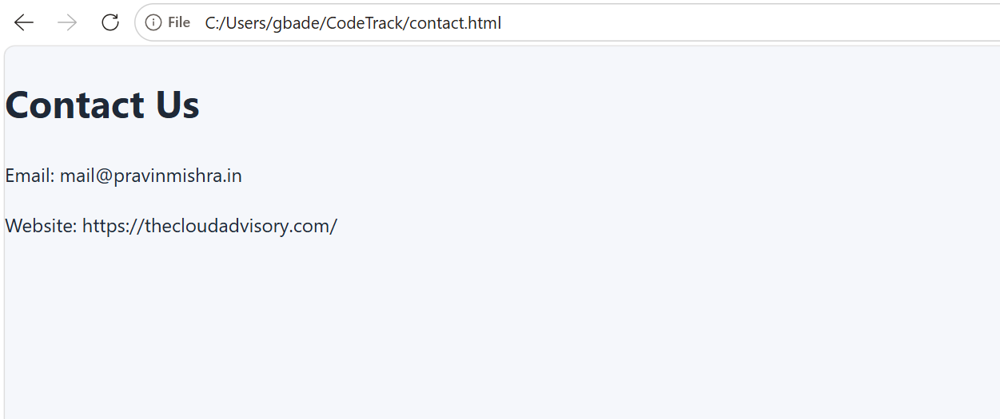

Clicking the homepage link on master opens contact.html, confirming the merged page and its link both work.

---

# Task 7 — Inspect History (Graph View)

## Goal

Display the repository history as a graph and locate both feature commits.

### Evidence

#### Screenshot 14 — Full output of `git log --oneline --graph --decorate --all`

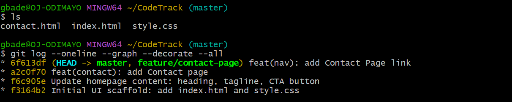

The graph shows both feature commits, feat(contact) and feat(nav), above the two Assignment 2 commits. The history is linear because the merge fast-forwarded.

---

# Task 8 — Optional Cleanup (Delete the Feature Branch)

## Goal

Delete the merged `feature/contact-page` branch to keep your branch list clean.

### Evidence

#### Screenshot 15 (Optional) — Output showing `feature/contact-page` deleted and no longer listed

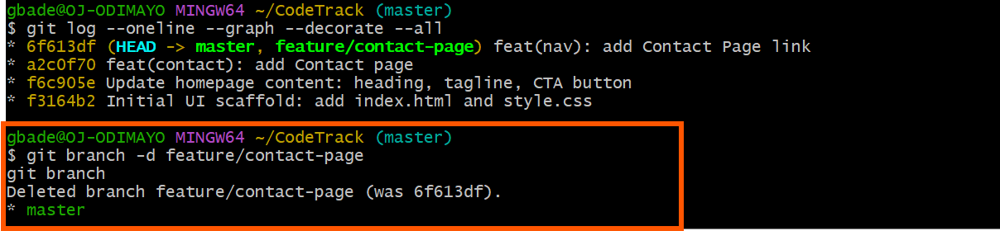

Deleted the merged branch. Git confirmed the commit it pointed to, and only master remains.

---

# Submission Instructions

- Tasks 1–7 are required; Task 8 is optional
- Add all required screenshots in your submission
- Evidence must show `contact.html` and the homepage link were absent before merging, and working after merging
- Do not expose passwords, access tokens, or private keys

---

# Completion Checklist

- [x] Repository confirmed clean on the default branch (Screenshot 1)
- [x] `feature/contact-page` created and checked out (Screenshot 2)
- [x] `contact.html` added in its own commit (Screenshots 3–5)
- [x] Homepage Contact link added in a separate commit (Screenshots 6–8)
- [x] Default branch proven unchanged before merge (Screenshots 9–10)
- [x] Feature branch merged and Contact page verified (Screenshots 11–13)
- [x] Graph history reviewed (Screenshot 14)
- [x] Optional cleanup completed (Screenshot 15)
- [x] No sensitive data exposed

---

## 📌 About DMI & CloudAdvisory

DevOps Micro Internship (DMI) is a project-based DevOps program run by Pravin Mishra (The CloudAdvisory) focused on real-world execution, systems thinking, and career readiness.

It helps learners build strong DevOps foundations with hands-on experience.

---

## 📌 Resources

- 🌐 DMI Official Website: https://pravinmishra.com/dmi  
- 🎓 DevOps for Beginners (Udemy): https://www.udemy.com/course/devops-for-beginners-docker-k8s-cloud-cicd-4-projects/  
- 🎓 Agentic AI DevOps with Claude Code: https://www.udemy.com/course/ultimate-agentic-ai-devops-with-claude-code/  
- 🎓 DevOps with Claude Code: Terraform, EKS, ArgoCD & Helm: https://www.udemy.com/course/devops-with-claude-code-terraform-eks-argocd-helm/  
- ▶️ YouTube Playlist: https://www.youtube.com/playlist?list=PLFeSNDtI4Cho  
- 🔗 Pravin Mishra (LinkedIn): https://www.linkedin.com/in/pravin-mishra-aws-trainer/  
- 🏢 CloudAdvisory (LinkedIn): https://www.linkedin.com/company/thecloudadvisory/

---

*This submission is part of DevOps Micro Internship (DMI) Cohort 3 — Agentic AI Track.*
