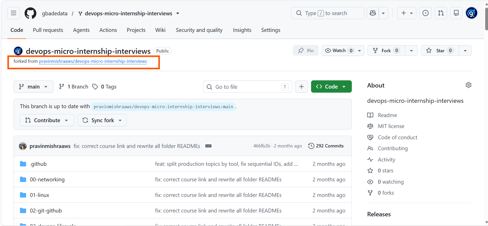
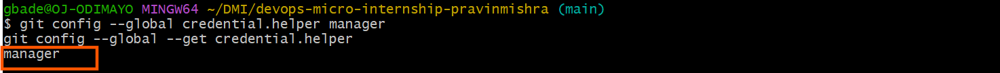
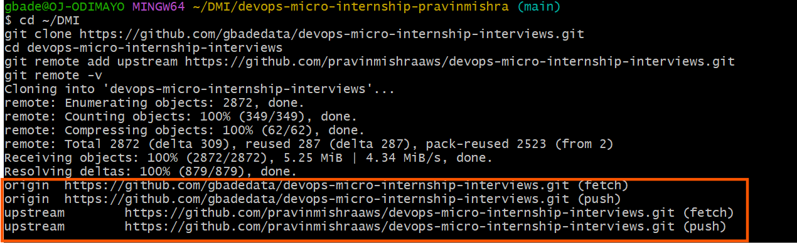
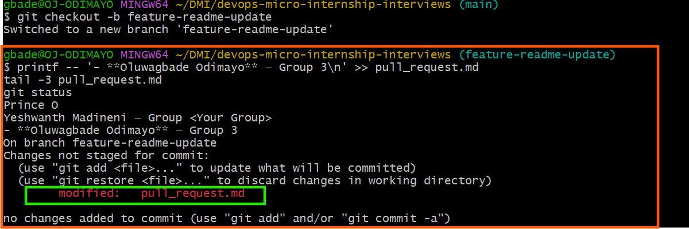
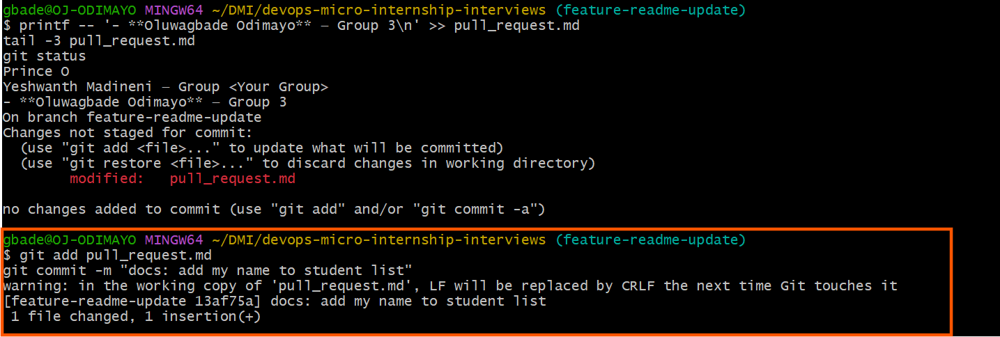
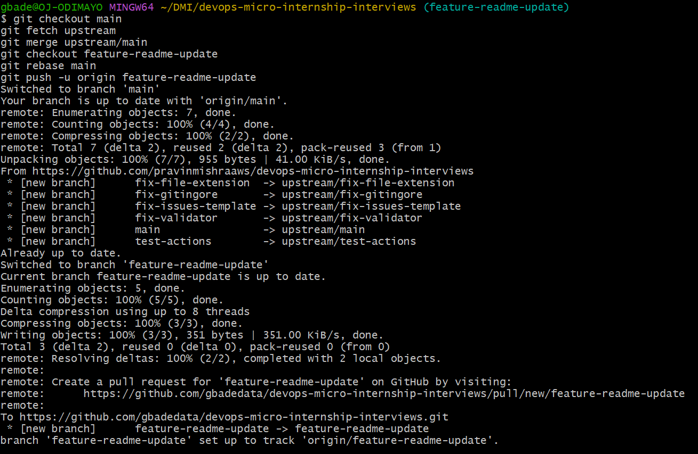
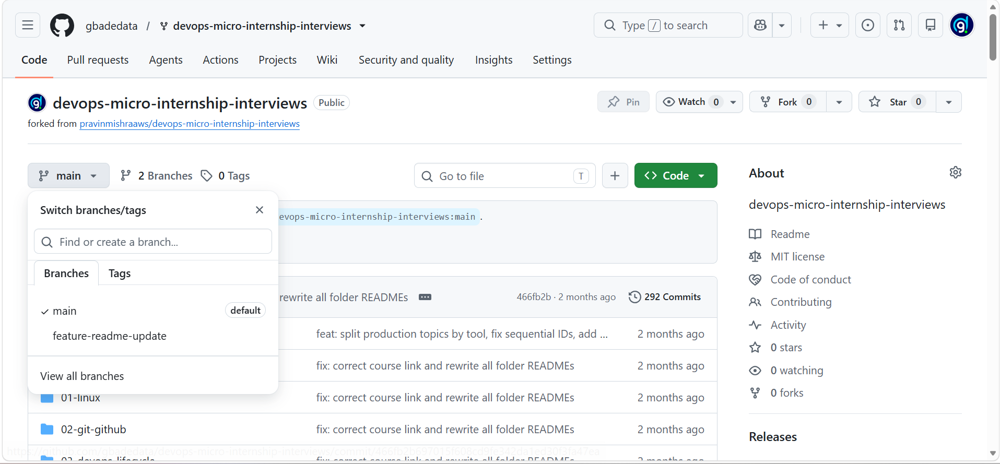
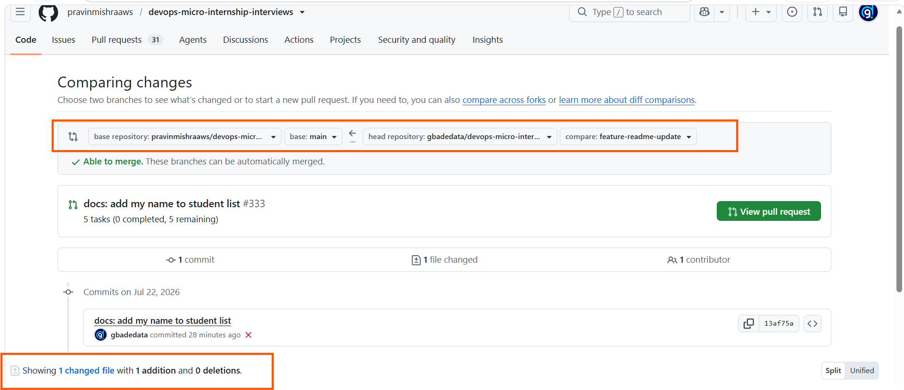
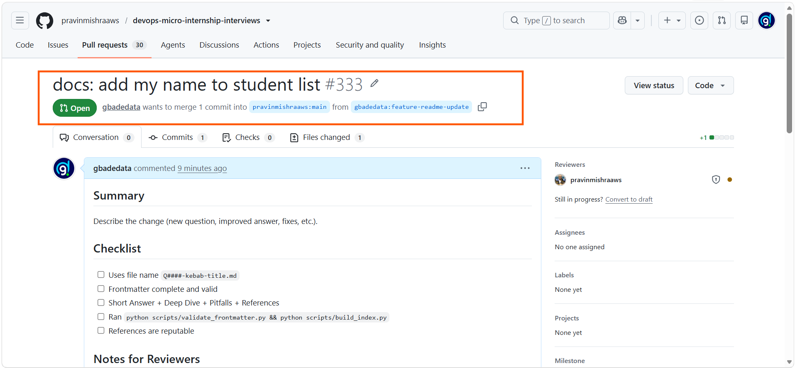
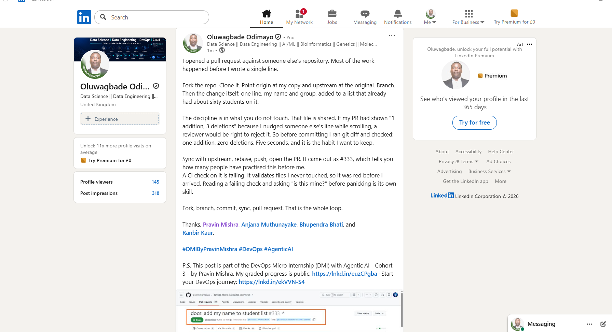

# Assignment 5 — Open-Source Collaboration: Fork, Clone, Sync & Pull Request

Part of the DevOps Micro Internship (DMI) Cohort 3 with Agentic AI

---

## Purpose

In this assignment, you will contribute one small documentation change to a shared repository using a standard open-source collaboration workflow: fork, clone, configure remotes, branch, commit, sync with upstream, push, and open a Pull Request. This is a different, separate practice repository from the one you submit your DMI work in.

---

# Task 0 — Fork the Upstream Repository

## Goal

Fork `pravinmishraaws/devops-micro-internship-interviews` into your own GitHub account.

### Evidence

#### Screenshot 1 — Your fork page with your username and `devops-micro-internship-interviews` visible in the browser URL

Forked the interviews repository into my own account. The URL shows gbadedata as the owner, and the forked from line records the original.

---

# Task 1 — Authenticate GitHub from the Terminal

## Goal

Configure one authentication method — HTTPS with a Personal Access Token, or SSH — so you can push to your fork. Use only one method.

### Evidence

#### Screenshot 2 — Output of `git config --global --get credential.helper` (HTTPS) or `ssh -T git@github.com` (SSH) showing successful authentication — never show your token or private key

Authentication is handled by Git Credential Manager over HTTPS. Credentials are stored by Windows Credential Manager rather than written into any file, so no Personal Access Token is ever displayed, saved in the repository, or exposed in a screenshot.

---

# Task 2 — Clone Your Fork and Configure Remotes

## Goal

Clone your fork locally, then add the original repository as `upstream`.

### Evidence

#### Screenshot 3 — Output of `git remote -v` showing `origin` pointing to your fork and `upstream` pointing to `pravinmishraaws/devops-micro-internship-interviews`

Two remotes: origin points at my fork, which I can push to, and upstream points at the original repository, which I can only read from. That split is what makes the fork workflow safe.

---

# Task 3 — Create a Feature Branch and Make Your Change

## Goal

Create the branch `feature-readme-update`, add only your own entry (`Full Name — Group <Group Name/Number>`) to the Student List at the end of `pull_request.md`, and commit it with the message `docs: add my name to student list`.

### Evidence

#### Screenshot 4 — Output of `git status` showing `pull_request.md` modified before staging

Only pull_request.md is modified, before staging.

---

#### Screenshot 5 — Output of `git commit`

Committed with the required message. One file, one line added.

---

# Task 4 — Synchronize with Upstream and Push to Your Fork

## Goal

Fetch and merge `upstream/main` into your local default branch, rebase your feature branch onto it, then push `feature-readme-update` to your fork.

### Evidence

#### Screenshot 6 — Output of `git push -u origin feature-readme-update` showing a successful push

Merging upstream/main reported already up to date and the rebase was clean, since the fork was current. The feature branch pushed to my fork and is now tracking origin.

---

#### Screenshot 7 — Your fork on GitHub showing `feature-readme-update` in the branch selector or a "Compare & pull request" banner

The branch selector on my fork lists both main and feature-readme-update, confirming the push arrived.

---

# Task 5 — Create a Pull Request to Upstream

## Goal

Open a Pull Request from `feature-readme-update` on your fork to `main` on the upstream repository, using the title `docs: add my name to student list`.

### Evidence

#### Screenshot 8 — Pull Request creation page showing the correct base repository, base branch, head repository, compare branch, and title

The comparison shows the correct configuration: base repository pravinmishraaws, base main, head repository gbadedata, compare feature-readme-update. It also confirms one changed file with one addition and zero deletions, which proves no other student's entry was touched.

---

#### Screenshot 9 — Successfully created Pull Request page with the PR number visible

Pull request #333 opened against the upstream repository. One CI check is failing, but it validates interview question files and index tables that my change never touches, so it was already failing before this pull request. The branch itself reports no conflicts and can be merged cleanly.

---

#### Pull Request URL

Paste your Pull Request URL here:

`https://github.com/pravinmishraaws/devops-micro-internship-interviews/pull/333`

---

# LinkedIn Post (Required)

## Evidence

#### LinkedIn Post URL

Paste your LinkedIn post URL here:

`https://www.linkedin.com/posts/oluwagbade-odimayo-_dmibypravinmishra-devops-agenticai-activity-7485689760557137920-QhT7`

---

#### Screenshot — LinkedIn post showing your successfully created Pull Request

The published LinkedIn post with the created pull request attached.

---

# Submission Instructions

- Add all required screenshots in your submission
- Do not expose a Personal Access Token, SSH private key, password, or authentication secret
- Only your own entry in `pull_request.md` may be added — do not edit or delete another student's entry
- Include your fork URL and Pull Request URL

---

## Fork URL

Paste your fork URL here:

`https://github.com/gbadedata/devops-micro-internship-interviews`

---

# Completion Checklist

- [x] Upstream repository forked to your GitHub account (Screenshot 1)
- [x] GitHub authentication configured securely (Screenshot 2)
- [x] Fork cloned locally with `origin` and `upstream` configured (Screenshot 3)
- [x] Only `pull_request.md` modified, with your own entry added (Screenshots 4–5)
- [x] Local default branch synchronized with `upstream/main`, feature branch rebased and pushed (Screenshots 6–7)
- [x] Pull Request opened against the correct upstream repository and branch (Screenshots 8–9)
- [x] Fork URL and Pull Request URL included
- [x] LinkedIn post published and URL submitted
- [x] No PAT, password, private key, or authentication secret exposed

---

## 📌 About DMI & CloudAdvisory

DevOps Micro Internship (DMI) is a project-based DevOps program run by Pravin Mishra (The CloudAdvisory) focused on real-world execution, systems thinking, and career readiness.

It helps learners build strong DevOps foundations with hands-on experience.

---

## 📌 Resources

- 🌐 DMI Official Website: https://pravinmishra.com/dmi  
- 🎓 DevOps for Beginners (Udemy): https://www.udemy.com/course/devops-for-beginners-docker-k8s-cloud-cicd-4-projects/  
- 🎓 Agentic AI DevOps with Claude Code: https://www.udemy.com/course/ultimate-agentic-ai-devops-with-claude-code/  
- 🎓 DevOps with Claude Code: Terraform, EKS, ArgoCD & Helm: https://www.udemy.com/course/devops-with-claude-code-terraform-eks-argocd-helm/  
- ▶️ YouTube Playlist: https://www.youtube.com/playlist?list=PLFeSNDtI4Cho  
- 🔗 Pravin Mishra (LinkedIn): https://www.linkedin.com/in/pravin-mishra-aws-trainer/  
- 🏢 CloudAdvisory (LinkedIn): https://www.linkedin.com/company/thecloudadvisory/

---

*This submission is part of DevOps Micro Internship (DMI) Cohort 3 — Agentic AI Track.*
