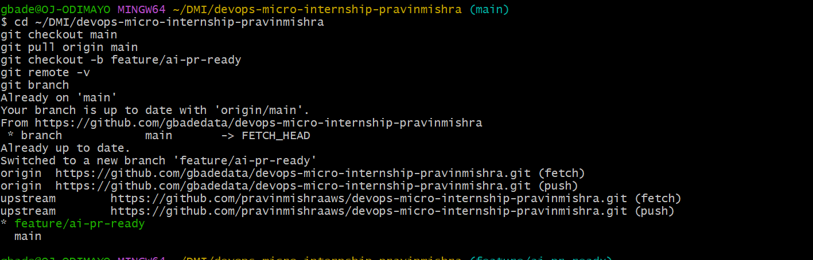
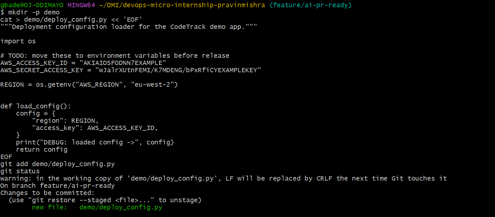
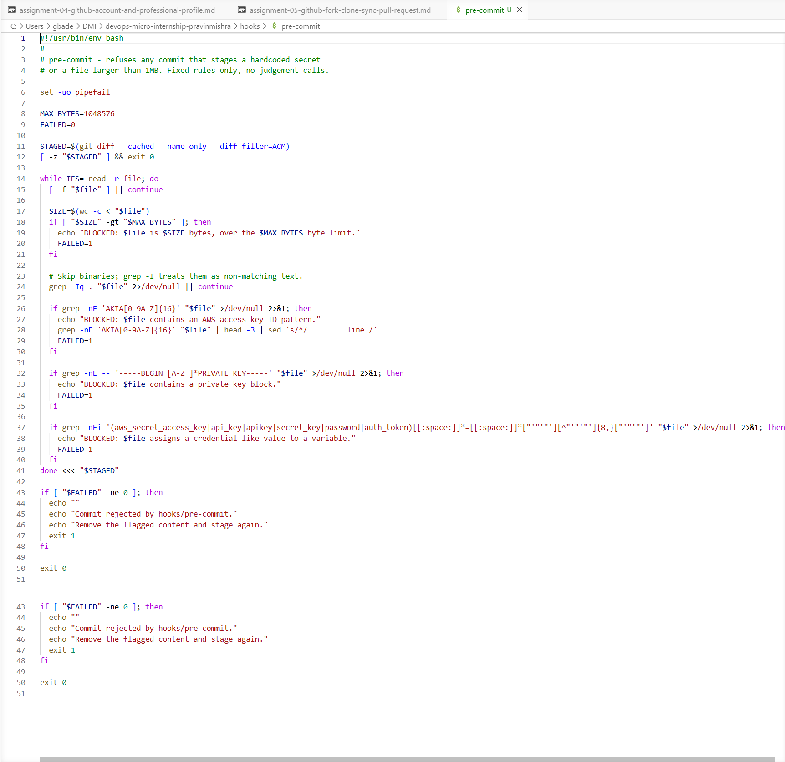
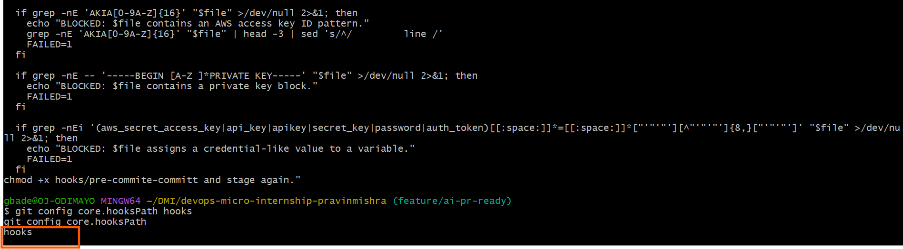
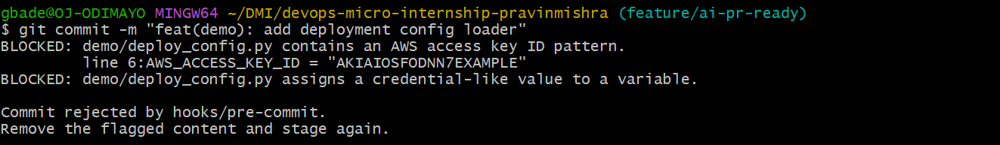
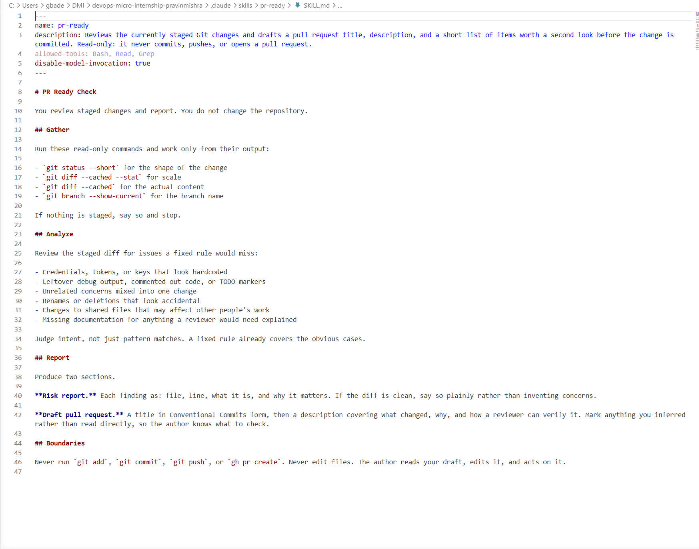
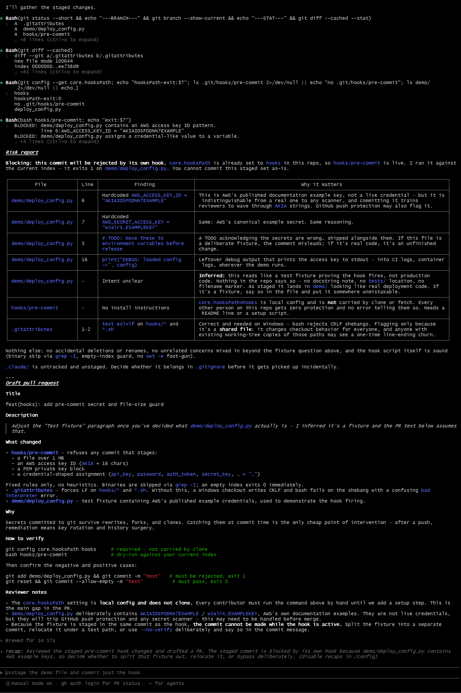
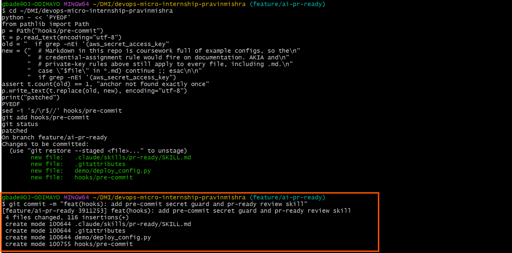
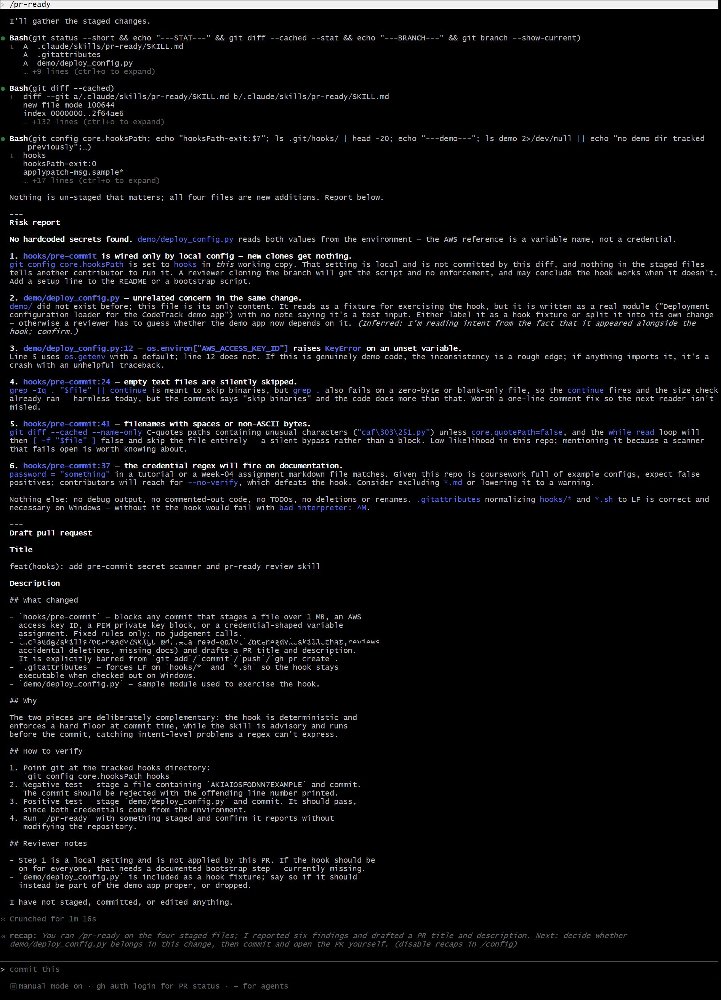
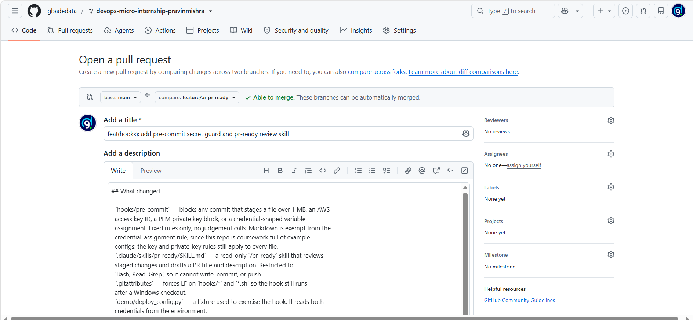

# Assignment 6 — Building an AI-Assisted Git Safety Net (PR Ready Check)

Part of the DevOps Micro Internship (DMI) Cohort 3 with Agentic AI

---

## Purpose

In Week 2 you built Claude Code hooks that block a dangerous action *before* it happens (`PreToolUse`), and a restricted skill that could look but not touch (`allowed-tools` without `Write`). In this assignment you will discover that Git has the exact same idea, decades older: a **pre-commit hook** that blocks a commit before it's created.

You will build both halves of a real "PR Ready" workflow:

1. A **Git hook that follows fixed rules** — scans staged changes for hardcoded secrets and oversized files and refuses the commit. No AI involved, no guessing, just a rule that gives the same answer every time.
2. A **restricted Claude Code skill** (`/pr-ready`) that reads your staged diff and drafts a Pull Request title, description, and a short list of things worth a second look — the kind of judgment a fixed rule can't make (mixed changes, missing context, unclear intent). The skill never commits, pushes, or opens the PR. You do that yourself, using its draft as a starting point.

This mirrors the Agentic Loop from Week 3's Linux triage assignment: **Gather → Analyze → Human Act → Verify**. The hook and the skill both gather and analyze; only you act.

---

# Task 0 — Confirm Your Fork and Create a Feature Branch

## Goal

Confirm you are working in your own fork, then create a dedicated branch for this assignment.

### Evidence

#### Screenshot 1 — Output of git remote -v and git branch showing the new branch

Working in my own fork, with origin pointing at it and upstream at Pravin's repository. The new branch feature/ai-pr-ready is checked out.

---

### Notes

**1. Why create a dedicated branch instead of doing this work on main?**

main should hold work that is finished and known to be good. This assignment deliberately stages a file containing a fake credential and a debug print, then proves a hook rejects it. That is broken-on-purpose work and it does not belong on the branch other people read. A branch keeps the experiment isolated until it is fixed, and it gives the change a natural review point in the pull request. If it had gone badly I could have deleted the branch and lost nothing.

---

# Task 1 — Stage a Change With Realistic Risk

## Goal

On your own fork of this repository (the one you've been submitting your DMI work in since onboarding), create a new branch and stage a change that a real reviewer should catch: a hardcoded-looking secret and a leftover debug statement.

### Evidence

#### Screenshot 1 — Output of  `git status` showing the staged file on feature/ai-pr-ready

The demo config staged, containing a fake AWS key pair and a leftover debug print.

---

### Notes

**1. Why does this assignment use an obviously fake key instead of a real one?**

A real credential committed to Git is compromised the moment it is pushed. Deleting it later does not help, because it stays in history, in every clone and every fork, and the key still needs rotating. This repository is public, so a real key would also be picked up by automated scanners within minutes. I used AWS's published documentation examples, which match the real key format exactly so the hook's pattern fires the same way, but are tied to no account and are recognisable to any reviewer as examples. The test is realistic without creating a real incident.

---

# Task 2 — Write a Real Git Pre-Commit Hook

## Goal

Create a tracked, shareable pre-commit hook that blocks a commit containing secret-like patterns or files over 1MB.

### Evidence

#### Screenshot 2 — `hooks/pre-commit` open in VS Code showing the full script

The full hook script: a size gate at 1MB, a binary skip, and three secret patterns.

---

#### Screenshot 3 — Output of `git config core.hooksPath` confirming it points to `hooks`

Git is pointed at the tracked hooks directory rather than the untracked one inside .git.

---

### Notes

**1. Why is `hooks/pre-commit` tracked in the repo instead of living only in `.git/hooks/`?**

Nothing inside .git is ever committed, so a hook living only in .git/hooks/ exists on one machine and disappears for everyone else. Cloning does not bring it. Tracking hooks/pre-commit in the repository makes it reviewable code: it appears in a diff, it can be discussed in a pull request, and everyone gets the same version. One gap remains, which /pr-ready pointed out and I noted in the PR: core.hooksPath is local configuration and does not travel with a clone either, so each person still has to run one command to switch it on.

---

**2. Compare this to `PreToolUse` from Week 2 Assignment 6. What does each one intercept, and what do they have in common?**

PreToolUse intercepts a tool call Claude Code is about to make and can refuse it before anything happens. A Git pre-commit hook intercepts a commit about to be created and can refuse it before the snapshot exists. What they share is position and posture: both sit in front of the action rather than reporting after it, both decide by fixed rule rather than judgement, and both fail closed. The difference is who they constrain. PreToolUse constrains an AI agent; the pre-commit hook constrains me. Git has been doing this for about twenty years.

---

# Task 3 — Prove the Hook Blocks the Risky Commit

## Goal

Attempt to commit the staged file from Task 1 and show the hook rejecting it.

### Evidence

#### Screenshot 4 — Terminal showing `git commit` rejected with the hook's "BLOCKED" message naming the exact file

The hook rejected the commit, naming the file and printing the offending line number. No commit was created.

---

### Notes

**1. Which line in `hooks/pre-commit` matched your fake key, and why did it match?**

The AWS access key rule matched, the grep for the AKIA prefix followed by sixteen uppercase letters and digits. AWS access key IDs have that fixed shape, and my fake key has exactly that shape, so it matched on line 6 and the hook printed the file and line number. The credential-assignment rule fired as well, because the same line assigns a long quoted literal to a variable whose name contains a credential word.

---

**2. Could this hook have caught a poorly-named variable that stores a secret without the `AKIA` prefix? What does that tell you about the limits of a fixed rule like this?**

No. A secret stored in something like cfg = "somelongvalue" has no recognisable prefix and no credential-sounding variable name, so nothing in the hook would match. That is the limit of a fixed rule: it only finds what it was told to look for. Its strength is the same property. It gives the same answer every time, cannot be argued with, and does not get tired at the end of a long day. It is a floor, not a ceiling, which is exactly why it needs a judgement-based pass beside it.

---

# Task 4 — Build the `/pr-ready` Skill

## Goal

Create a manually invoked Claude Code skill that reads your staged changes and produces a PR-readiness report and a draft PR description — without writing, committing, or pushing anything itself.

### Evidence

#### Screenshot 5 — `SKILL.md` frontmatter showing `allowed-tools: Bash, Read, Grep` (no `Write`) and `disable-model-invocation: true`

allowed-tools is limited to Bash, Read and Grep, with no Write, and disable-model-invocation is true so the skill only runs when I call it.

---

#### Screenshot 6 — `/pr-ready` output while the risky file is still staged, showing it flagged the secret and/or debug statement

The skill flagged both keys, the leftover DEBUG print, the misleading TODO comment, unclear intent (which it labelled Inferred), and the fact that core.hooksPath does not survive a clone.

---

### Notes

**1. Why does `/pr-ready` have `Bash` and `Read` but not `Write`?**

It needs Bash to run git status and git diff --cached, and Read to open files it wants to inspect. Both only observe. Write would let it change files, and that is the one thing it must not do, because its value comes from its report being a description of my work rather than a modification of it. If it could edit, I would have to review its edits as well as its findings. It closed its report by stating it had not staged, committed, or edited anything, which is the restriction visible in practice. disable-model-invocation: true adds a second boundary: it runs only when I type /pr-ready, so it never inserts itself into a task on its own.

---

**2. The pre-commit hook and `/pr-ready` both looked at the same staged diff. Did they flag the same things? What did one catch that the other didn't?**

Both caught the hardcoded key, and after that they diverged. Only the hook enforced: it exited non-zero and stopped the commit, which the skill cannot do. The skill caught four things the hook could not. The leftover DEBUG print, which would have written the key into any log the demo touched. A TODO comment shipped alongside the very secret it was apologising for. That core.hooksPath is local config, so nobody cloning the repo would be protected and nothing would tell them. And that my credential pattern would fire on documentation in a coursework repository, which would push me toward --no-verify and disable the hook entirely. None of those is expressible as a regex. All four are judgement about intent and consequence.

---

# Task 5 — Fix the Issues and Re-Verify

## Goal

Remove the secret and debug statement, then prove both gates now pass clean.

### Evidence

#### Screenshot 7 — `git commit` succeeding after the fix (no BLOCKED message)

After the fix the commit passed with no BLOCKED message. Four files, and the hook recorded as mode 100755.

---

#### Screenshot 8 — Second `/pr-ready` run showing a clean risk report and a drafted PR title + description

The second run opens with no hardcoded secrets found, then drafts a PR title and description. Its remaining findings are review observations rather than blockers.

---

### Notes

**1. What exactly did you change to satisfy the pre-commit hook?**

I removed both hardcoded assignments and the TODO comment above them, and deleted the debug print. The function now reads the access key from the environment at the point of use, so no credential exists in the file at all. That cleared both hook rules: no key-shaped string remains, and no variable is assigned a long quoted literal. Removing the debug print was not required by the hook. I did it because /pr-ready pointed out it would print the key into logs.

---

# Task 6 — Push and Open a Pull Request Using the AI Draft

## Goal

Push your branch and open a real Pull Request, using `/pr-ready`'s drafted title and description as your starting point — read it critically and edit before you use it.

**Important:** Open this Pull Request with base repository set to **your own fork** — not the shared upstream `pravinmishraaws/devops-micro-internship-pravinmishra` repository. This assignment's hook and skill files are your own practice work, not a change meant for the shared class repo.

### Evidence

#### Screenshot 9 — Your Pull Request showing the base repository is your own fork, plus the title and description, with the `/pr-ready` draft visible for comparison (paste it in the PR conversation or your notes below)

Pull request opened with the base repository set to my own fork, not upstream: 1 commit, 4 files changed.

---

#### PR Link

https://github.com/gbadedata/devops-micro-internship-pravinmishra/pull/1

---

### Notes

**1. What, if anything, did you edit in the AI's drafted PR description before using it? Why?**

Four changes. I added the markdown exemption to the What changed section, because I patched the hook after that draft was generated and the description would otherwise have been out of date. I removed its open question about whether the demo file belongs in this change, since a pull request description should state a decision rather than ask the reviewer to make one. I replaced a literal example key string in the verification steps with a generic description, because pasting key-shaped strings into a public repository invites secret scanners. And I kept its reviewer note about core.hooksPath not travelling with a clone, because that was a real gap I had not spotted myself.

---

**2. If you had blindly copy-pasted the AI's draft without reading it, what could go wrong?**

The draft described the demo file as a fixture containing AWS example credentials, which stopped being true the moment I fixed it. Pasting that unread would have put a false statement in a public pull request, and anyone reading the summary without opening the diff would have believed it. The draft also carried an open question addressed to me, which would have read as unfinished thinking. More broadly, the model marked one finding as Inferred, meaning it was guessing at my intent. A guess presented as fact in a PR description is worse than no description, because reviewers trust the summary.

---

**3. Why does this PR need to target your own fork instead of the shared upstream repository?**

The upstream repository is Pravin's shared class repo. A pull request there proposes merging my changes into everyone's copy, and this is my own practice work: a hook, a skill, and a deliberately broken demo file. None of it belongs in the shared template. GitHub also defaults the base repository to upstream when you open a PR from a fork, which I nearly walked into. The page showed 51 commits and 604 files changed against Pravin's repo before I corrected the base. Setting it to my own fork brought it to 1 commit and 4 files, which is the actual change.

---

# Task 7 — Map the Workflow to the Agentic Loop

## Goal

Explain this assignment's workflow using the same Gather → Analyze → Human Act → Verify structure from Week 3.

### Notes

**1. Which step(s) represent Gather?**

Task 1 and the opening moves of both tools. The hook runs git diff --cached --name-only to collect the staged files. /pr-ready runs git status, git diff --cached --stat, git diff --cached, and git branch --show-current. Both are only reading the current state; neither has judged anything yet.

---

**2. Which step(s) represent Analyze?**

Tasks 2 and 4, with their output appearing in Task 3 and the first /pr-ready run. The hook analyses by fixed rule: it greps each staged file for key patterns and checks size against a limit, giving the same verdict every time. The skill analyses by judgement: it reads the same diff and asks what a reviewer would question. The BLOCKED message and the six-finding risk report are those two analyses speaking.

---

**3. Which step is Human Act, and why must a human — not Claude — run `git commit`, `git push`, and open the PR?**

Tasks 5 and 6. I fixed the file, ran git commit and git push, and opened the pull request. These have to be mine because they are the irreversible steps and the ones carrying accountability. A commit enters history, a push is visible to others, and a pull request asks people to spend attention on my work. The tools gathered and analysed, but neither knows what I intended, and both said so: /pr-ready labelled one finding Inferred and closed by stating it had changed nothing. Authorship should sit with whoever can be asked to justify the change.

---

**4. Which step is Verify?**

The re-checks in Task 5. After the fix the commit succeeded with no BLOCKED message, which proves the fixed-rule gate agrees, and the second /pr-ready run reported no hardcoded secrets found, which proves the judgement pass agrees too. The pull request in Task 6 adds a third layer, since the diff is now visible to a human reviewer. Verify is not a single step, it is the same gates run again against the changed state.

---

**5. In one or two sentences: why do you need *both* the fixed-rule pre-commit hook and the AI skill? Isn't one enough?**

The hook cannot be reasoned with but only knows the patterns I gave it, so it catches the obvious case reliably and misses everything else. The skill sees intent-level problems a regex cannot express, but it advises rather than enforces and can be ignored or simply wrong. Together, one sets a floor that cannot be crossed by accident and the other raises the questions worth thinking about. Either alone leaves a gap the other covers.

---

# Task 8 — LinkedIn Post

## Goal

Publish a LinkedIn post summarizing what you built and what you learned about combining fixed-rule safety checks with AI-assisted review.

### Evidence

#### LinkedIn Post URL

https://www.linkedin.com/posts/oluwagbade-odimayo-_dmibypravinmishra-devops-agenticai-activity-7485721751016960001-369E

---

## Key Learnings

- A Git pre-commit hook is the same idea as a PreToolUse hook: intercept before the action, decide by rule, fail closed. Git has had it for two decades.
- Fixed rules and judgement cover different failure modes. My hook caught the AWS key and missed the debug print that would have leaked it into logs. The AI caught the print and could not stop the commit.
- Restricting a tool is what makes its output trustworthy. Because the skill had no Write access, its report was a description of my work rather than a modification of it.
- A safety check that produces false positives gets bypassed. My credential pattern would have fired on coursework markdown, which would have pushed me toward --no-verify and disabled the hook entirely.
- On Windows, line endings can silently break a shell script. Without .gitattributes forcing LF, the hook would fail on its shebang the next time Git rewrote the file.

---

# Submission Instructions

- Ensure `hooks/pre-commit` and `.claude/skills/pr-ready/SKILL.md` are committed to your GitHub repository
- Add all required screenshots to your submission
- All written answers must be in your own words
- Do not use a real secret or credential anywhere in your submission — the fake key in Task 1 is intentional and must stay clearly fake
- Open your Pull Request against your own fork, not the shared upstream repository
- Push your final changes to your forked repository
- Include your PR link and LinkedIn post URL

---

## GitHub Repository URL

Paste your forked repository URL here:

`https://github.com/gbadedata/devops-micro-internship-pravinmishra`

---

# Completion Checklist

- [x] Branch `feature/ai-pr-ready` created with a staged file containing a fake secret and a debug statement
- [x] `hooks/pre-commit` created and tracked in the repo (not only in `.git/hooks/`)
- [x] `core.hooksPath` configured to point at `hooks/`
- [x] Pre-commit hook shown blocking the risky commit
- [x] `.claude/skills/pr-ready/SKILL.md` created with correct `allowed-tools` (no `Write`) and `disable-model-invocation: true`
- [x] `/pr-ready` run against the risky diff and shown flagging issues
- [x] Risky file fixed; `git commit` succeeds cleanly
- [x] `/pr-ready` re-run showing a clean report and drafted PR title/description
- [x] Pull Request opened using the AI draft as a starting point, with your own fork as the base repository (not upstream), PR link included
- [x] Agentic Loop mapping (Task 7) completed in your own words
- [x] LinkedIn post published and URL submitted
- [x] All required screenshots added
- [x] GitHub repository URL provided

---

## 📌 About DMI & CloudAdvisory

DevOps Micro Internship (DMI) is a project-based DevOps program run by Pravin Mishra (The CloudAdvisory) focused on real-world execution, systems thinking, and career readiness.

It helps learners build strong DevOps foundations with hands-on experience.

---

## 📌 Resources

- 🌐 DMI Official Website: https://pravinmishra.com/dmi  
- 🎓 DevOps for Beginners (Udemy): https://www.udemy.com/course/devops-for-beginners-docker-k8s-cloud-cicd-4-projects/  
- 🎓 Agentic AI DevOps with Claude Code: https://www.udemy.com/course/ultimate-agentic-ai-devops-with-claude-code/  
- 🎓 DevOps with Claude Code: Terraform, EKS, ArgoCD & Helm: https://www.udemy.com/course/devops-with-claude-code-terraform-eks-argocd-helm/  
- ▶️ YouTube Playlist: https://www.youtube.com/playlist?list=PLFeSNDtI4Cho  
- 🔗 Pravin Mishra (LinkedIn): https://www.linkedin.com/in/pravin-mishra-aws-trainer/  
- 🏢 CloudAdvisory (LinkedIn): https://www.linkedin.com/company/thecloudadvisory/

---

*This submission is part of DevOps Micro Internship (DMI) Cohort 3 — Agentic AI Track.*
