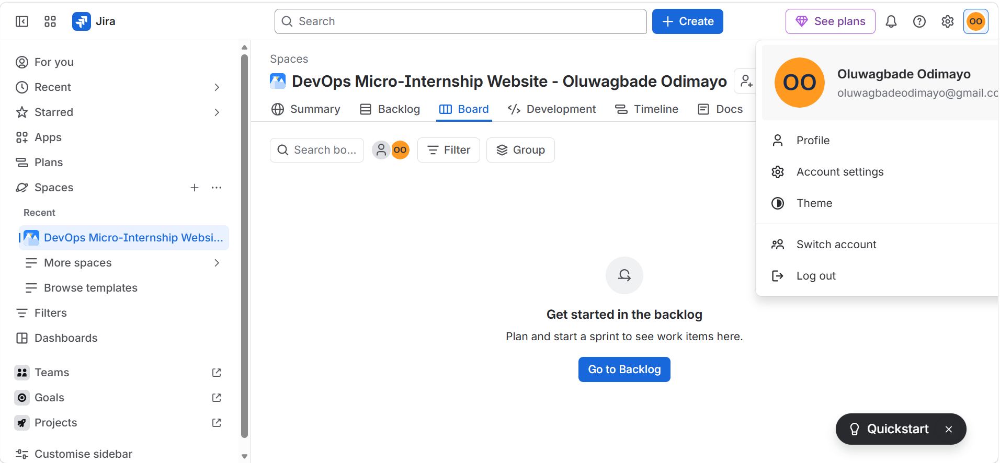
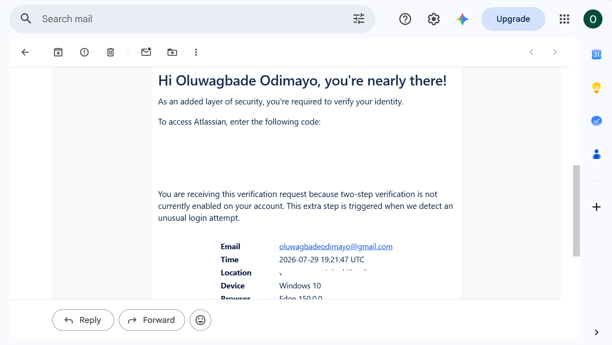
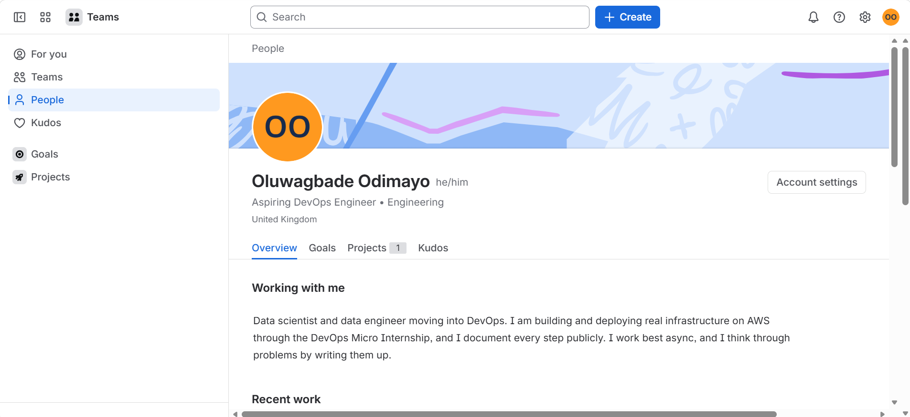
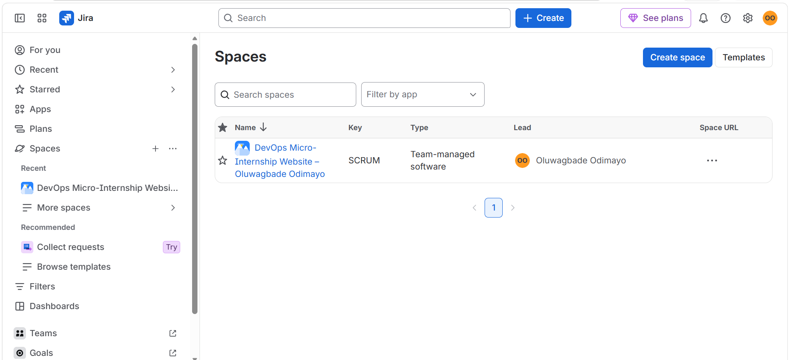
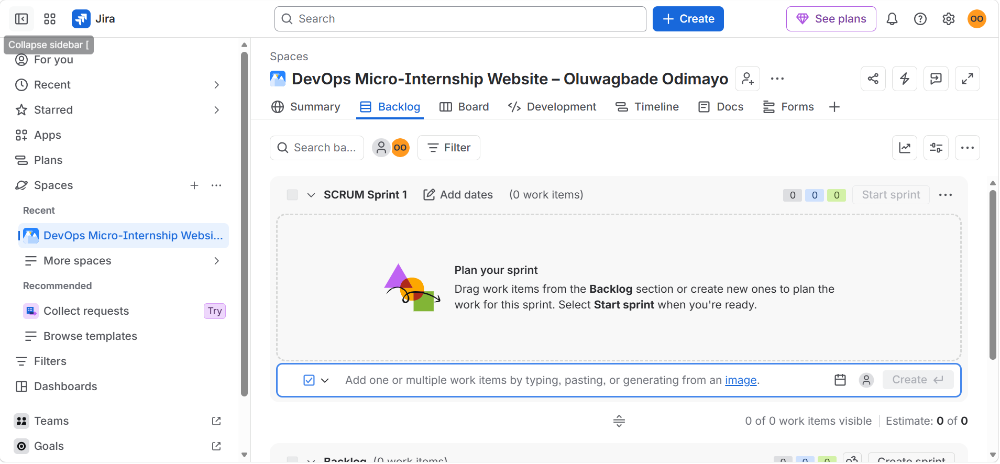

# Assignment 1 — Create Your Jira Account & Setup Profile

Part of the DevOps Micro Internship (DMI) Cohort 3 with Agentic AI

---

## Purpose

In this assignment, you will create or access a Jira Software Cloud account, verify your Atlassian identity when required, set up a professional profile, and explore the Jira dashboard and project areas. This prepares you for real-world Agile and DevOps collaboration, where Jira is commonly used to plan work, assign tickets, and track progress. You will explore the workspace only — you will not create any issues in this assignment.

---

# Task 1 — Sign Up for Jira Software Cloud

## Goal

Create or access your Jira Cloud account and reach the Jira Software workspace successfully.

### Evidence

#### Screenshot 1 — Jira welcome page, dashboard, or main workspace after successful login, with your name or avatar visible

Signed in to the Jira Software Cloud workspace with my space open on its Board view. The account menu is expanded because the avatar itself renders only as initials, so the full account name would not otherwise appear.

---

# Task 2 — Verify Your Atlassian Account

## Goal

Confirm your email address if Atlassian requests verification.

### Evidence

#### Screenshot 2 (if applicable) — Confirmation screen after email verification, or the inbox showing the Atlassian verification email subject

Atlassian verification email requesting confirmation of my identity before granting account access. The code block and the location line are redacted deliberately.

---

### Notes

If you signed up with Google and no separate email verification was required, state that here instead of a screenshot.

I signed up with an email address rather than Google, so Atlassian gated access behind email verification and sent a short-lived code to my Gmail account.

Capturing the evidence turned out to be the more interesting problem. Gmail places the verification code directly in the message subject line, which means the inbox list view exposes it even with every message left unopened. The message header, meanwhile, shows only my email address and not my display name. Since this assignment requires a visible full name and separately forbids exposing verification codes, those two views are mutually exclusive: one leaks the secret, the other loses the identity. I captured the message body instead, where Atlassian addresses me by full name, and redacted both the code and the location line.

Same principle as the GitHub credential setup in Week 4. Prove you control the identity, without publishing the secret that proves it.

---

# Task 3 — Set Up Your Professional Jira Profile

## Goal

Update your Jira profile with your full name, a job title or role (e.g. "Aspiring DevOps Engineer"), and a short professional bio.

### Evidence

#### Screenshot 3 — Updated profile page showing your full name, role/title, and bio

Profile updated with my full name, the role "Aspiring DevOps Engineer", and a short bio. The bio sits under "Working with me", which is the only free-text field this profile exposes.

---

# Task 4 — Explore the Jira Dashboard and Projects

## Goal

Locate the project list and open a project's Board or Backlog, and view Project settings, without creating, editing, or deleting any issues.

### Evidence

#### Screenshot 4 — "View all projects" page showing at least one project

The Jira space directory, which is the current equivalent of "View all projects" after Atlassian renamed Jira projects to spaces. One space is listed, with key SCRUM, type Team-managed software, and the lead showing my full name.

---

#### Screenshot 5 — Opened project showing either the Board or Backlog screen

The space Backlog. The sprint container and the backlog section each report zero work items, and the footer confirms "0 of 0 work items visible", so no issues were created anywhere in this assignment.

---

# Submission Instructions

- Add all required screenshots in your submission
- Full name must be visible in required screenshots
- Do not expose sensitive information (passwords, verification codes, account recovery details)

---

# Completion Checklist

- [x] Task 1: Jira Software Cloud account created or existing account accessed (Screenshot 1)
- [x] Task 2: Email verification completed, or a Google sign-in note included (Screenshot 2 or Notes)
- [x] Task 3: Professional profile updated with full name, role/title, and bio (Screenshot 3)
- [x] Task 4: Projects page and a Board or Backlog explored (Screenshots 4 & 5)
- [x] No Jira issues created
- [x] Full Name visible in required screenshots
- [x] No sensitive data exposed

---

## 📌 About DMI & CloudAdvisory

DevOps Micro Internship (DMI) is a project-based DevOps program run by Pravin Mishra (The CloudAdvisory) focused on real-world execution, systems thinking, and career readiness.

It helps learners build strong DevOps foundations with hands-on experience.

---

## 📌 Resources

- 🌐 DMI Official Website: https://dmi.pravinmishra.com?utm_source=github&utm_medium=readme  
- 🎓 University: https://university.pravinmishra.com?utm_source=github&utm_medium=readme  
- 💬 Discord Community: https://discord.pravinmishra.com?utm_source=github&utm_medium=readme  
- 📝 Blog: https://dmi.pravinmishra.com/blog?utm_source=github&utm_medium=readme  
- ▶️ YouTube Playlist: https://www.youtube.com/playlist?list=PLFeSNDtI4Cho  
- 🔗 Pravin Mishra (LinkedIn): https://www.linkedin.com/in/pravin-mishra-aws-trainer/  
- 🏢 CloudAdvisory (LinkedIn): https://www.linkedin.com/company/thecloudadvisory/

---

*This submission is part of DevOps Micro Internship (DMI) Cohort 3 — Agentic AI Track.*
