# Assignment 3 — Run a 5-Day Mini-Sprint in Jira and Ship an Increment

Part of the DevOps Micro Internship (DMI) Cohort 3 with Agentic AI

---

## Purpose

In this assignment, you will run a five-day mini-Sprint in Jira and ship a small but real footer improvement to your portfolio website running on EC2. You will track the work from Sprint Goal and Story through daily Sub-tasks, Daily Scrum comments, Git commits, repeated deployments, verification, a retrospective, the Burndown Chart, and a mandatory LinkedIn delivery story.

---

# Task 1 — Set Up and Start Sprint 1

## Goal

Create the footer Story (`Add footer with version and deploy date`, 1 point, `frontend` label) with its five required Sub-tasks (Day 1–Day 5), move it into Sprint 1, set the required Sprint Goal, and start the Sprint.

### Evidence

#### Screenshot 1 — Sprint 1 created with the Story inside it

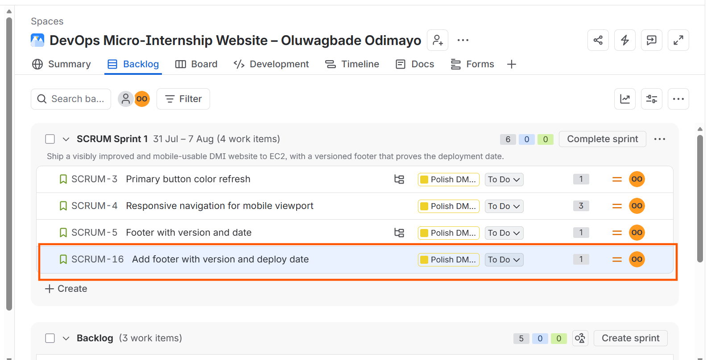

SCRUM Sprint 1, dated 31 July to 7 August, now holding SCRUM-16 `Add footer with version and deploy date` alongside the three Stories carried over from Assignment 2. One point, `frontend` label, parented to the Epic, assigned to me.

---

#### Screenshot 2 — Active Sprint board showing the Sprint Goal

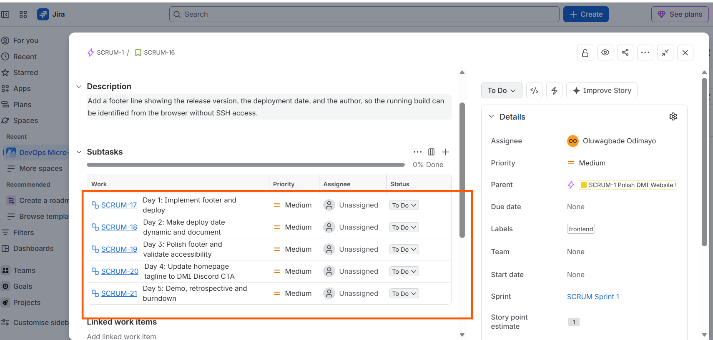

The active Sprint board with the goal readable in full: ship a visibly improved and mobile-usable DMI website to EC2, with a versioned footer that proves the deployment date. Seven days remaining, start and end dates visible.

---

# Task 2 — Day 1: Implement the Footer, Commit, and Deploy

## Goal

Add the required footer text (`Portfolio v1.0 — Deployed on <DD Mon YYYY> — By <Student Name>`) to the site on a `feature/footer-v1` branch, commit it, and deploy it to the public EC2 URL.

### Evidence

#### Screenshot 3 — Jira board showing the Day 1 Sub-task in Done

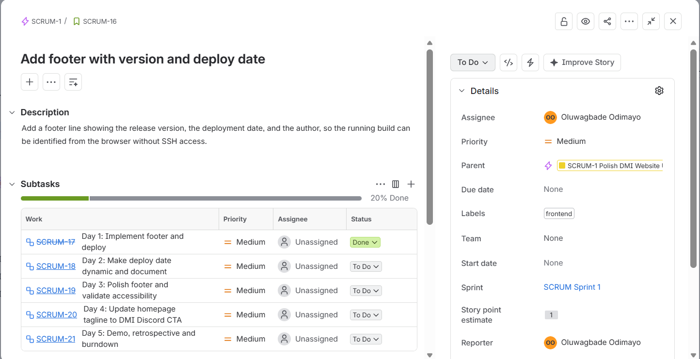

SCRUM-17 `Day 1: Implement footer and deploy` closed. The key renders struck through and the Story progress bar moves to 20%.

---

#### Screenshot 4 — Successful Git commit output

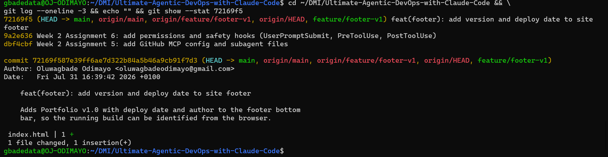

Commit `72169f5` on `feature/footer-v1`, one file changed, one insertion. The ref list shows the branch merged into `main` and both pushed, since the EC2 instance pulls from `main`.

---

#### Screenshot 5 — EC2 browser view showing the complete footer text, with the URL visible

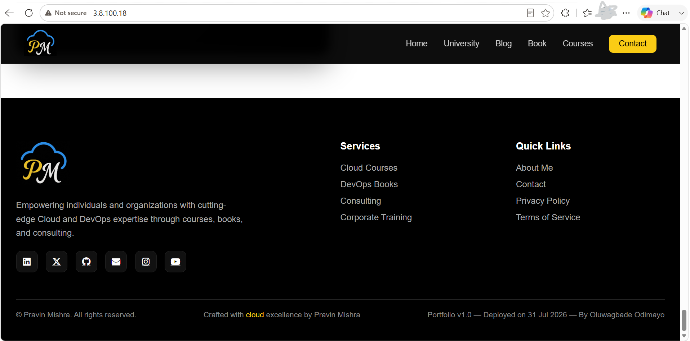

The footer live at `http://3.8.100.18`, reading `Portfolio v1.0 — Deployed on 31 Jul 2026 — By Oluwagbade Odimayo`.

At this stage the line sits in the same grey as the surrounding copyright text with no separation, which is the contrast problem addressed on Day 3.

---

#### Screenshot 6 — Jira Story comment showing the Day 1 Daily Scrum update

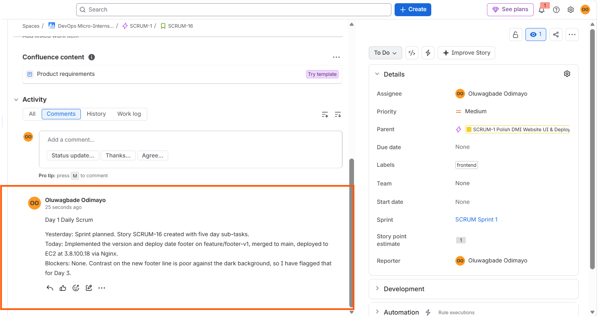

Day 1 update on SCRUM-16, recording the branch, the merge, the deploy target, and the contrast issue raised as a known problem for Day 3.

---

# Task 3 — Day 2: Make the Deploy Date Dynamic and Document It

## Goal

Update the footer so the deployment date is generated automatically (or updated consistently at deploy time), document the approach in `README.md`, commit, and redeploy.

### Evidence

#### Screenshot 7 — Code editor showing the footer and date logic

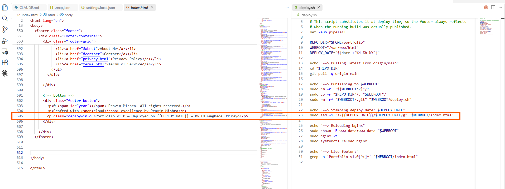

`index.html` line 605 on the left carrying the `{{DEPLOY_DATE}}` token, and `deploy.sh` line 23 on the right carrying the `sed` substitution that replaces it. The template and the mechanism that fills it, in one view.

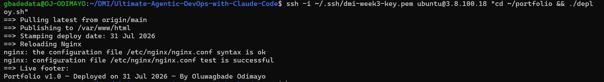

The script running against the instance. `==> Stamping deploy date: 31 Jul 2026` is the substitution happening on the server, followed by the Nginx config test and the live footer echoed back.

---

#### Screenshot 8 — EC2 browser view showing the updated footer with the current date

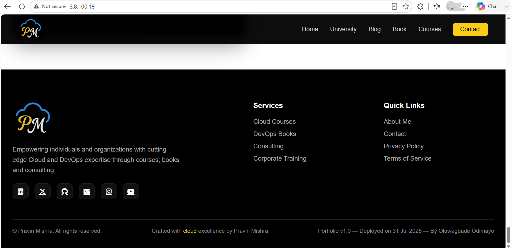

The footer after redeploying through `deploy.sh`. The rendered text is unchanged because the date it stamps happens to be the same day, but it is now generated at publish time rather than typed into the source.

---

#### Screenshot 9 — README snippet documenting the footer and date behavior

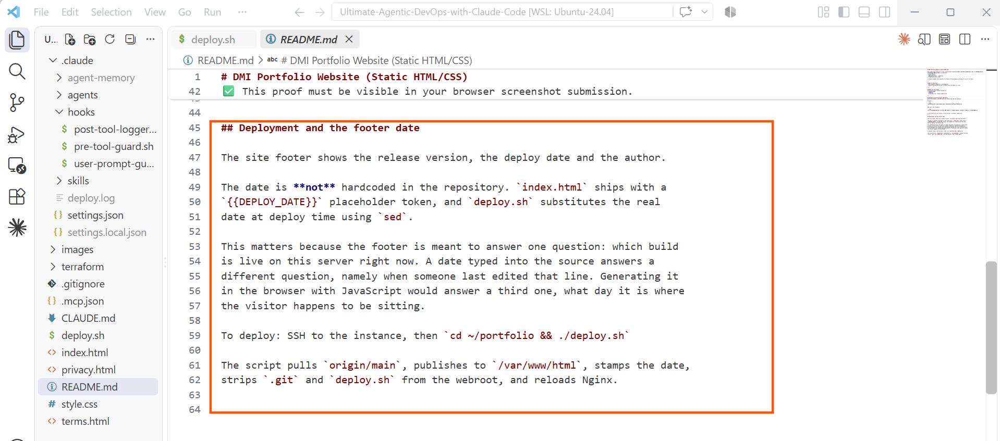

The README section explaining the token and the substitution, and why a date in source answers a different question from a date stamped at deploy.

---

#### Screenshot 10 — Jira Story comment showing the Day 2 Daily Scrum update

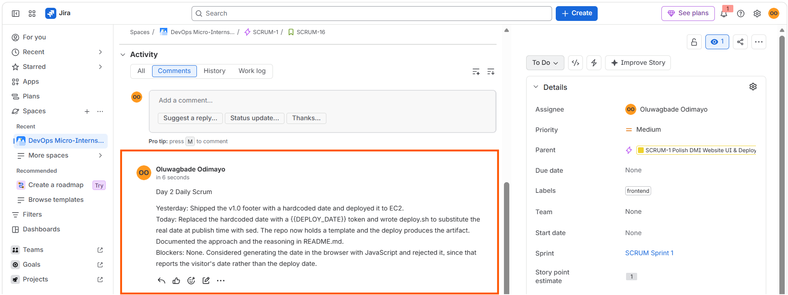

Day 2 update recording the move from a hardcoded date to a token plus `deploy.sh`, and the decision to reject a client-side JavaScript date.

---

# Task 4 — Day 3: Polish the Footer and Validate Accessibility

## Goal

Improve the footer's spacing, contrast, and readability, then validate it at both desktop and mobile viewport widths.

### Evidence

#### Screenshot 11 — Desktop EC2 view showing the polished footer

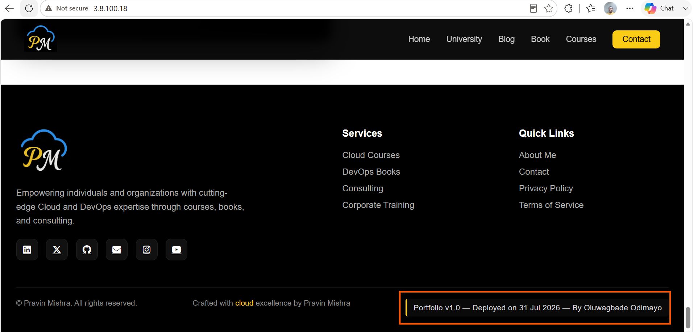

The footer after the Day 3 CSS change. Text lifted from `#888` to `#d4d4d8`, padding added, and a yellow left rule separating the deploy line from the copyright text beside it. Compare against Screenshot 5, where it was indistinguishable from its neighbours.

---

#### Screenshot 12 — Mobile responsive view showing the footer remains readable

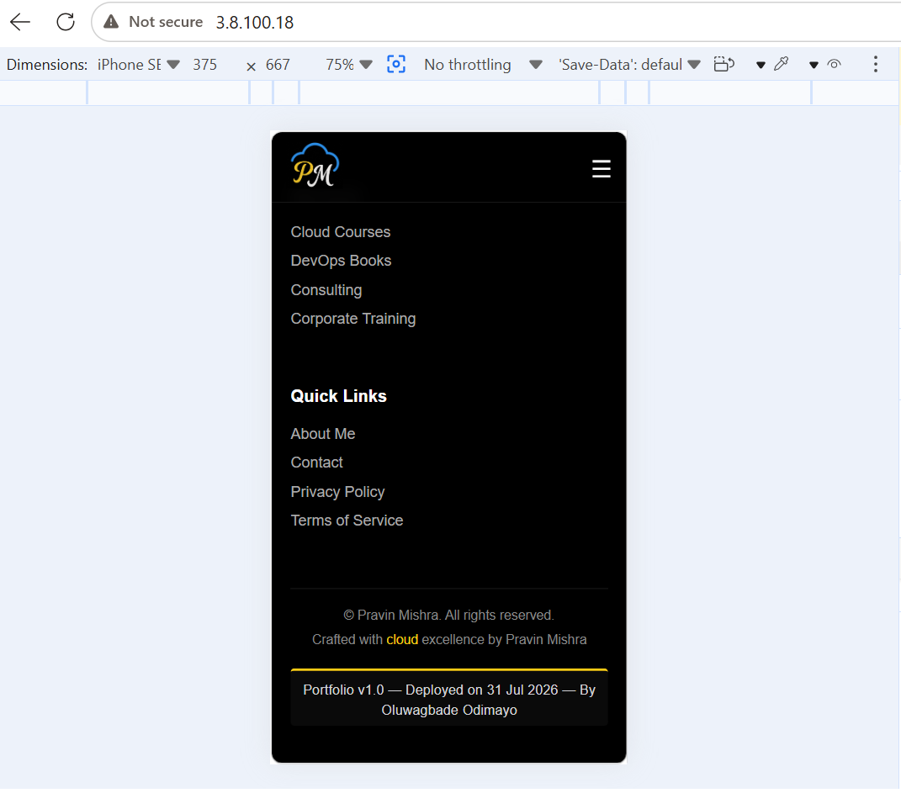

The same footer at 375 by 667 with the DevTools device toolbar visible. The media query has fired: below 900px `.footer-bottom` stacks vertically, so the left rule becomes a top rule and the text centres.

---

#### Screenshot 13 — Jira Story comment showing the Day 3 Daily Scrum update

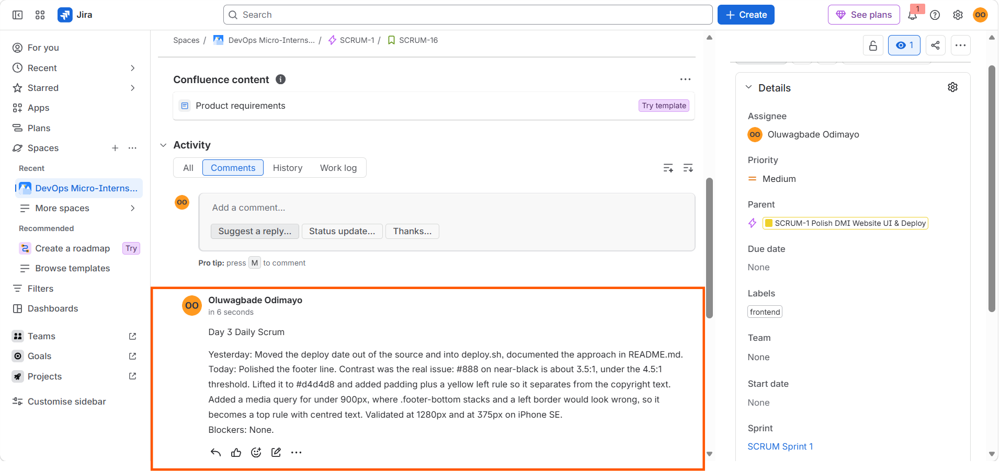

Day 3 update recording the contrast measurement, the colour change, the media query, and validation at both viewport widths.

---

# Task 5 — Day 4: Change the Homepage Tagline / Call-to-Action

## Goal

Replace the existing homepage tagline with the required DMI Discord call-to-action link and deploy it to EC2.

### Evidence

#### Screenshot 14 — EC2 browser view showing "Join DMI Cohort 3 on Discord and start your DevOps journey"

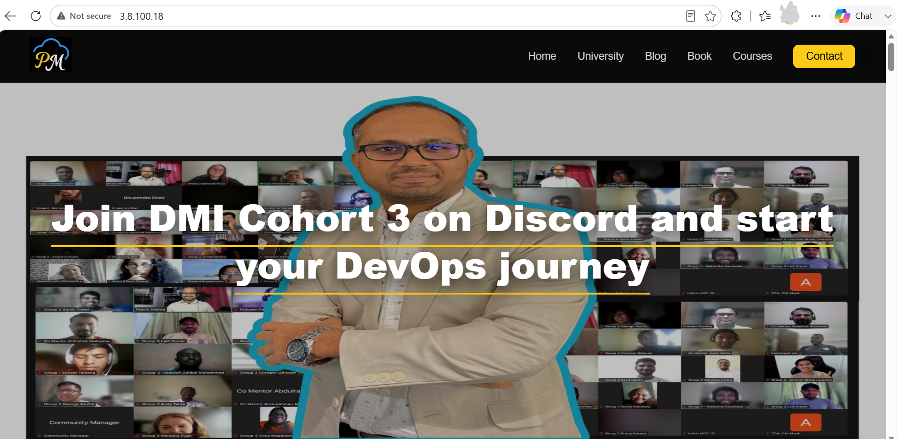

The homepage hero now reads "Join DMI Cohort 3 on Discord and start your DevOps journey", underlined in the template's yellow accent so it reads as a link rather than a heading.

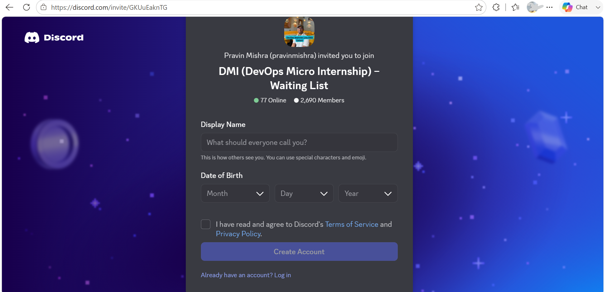

Clicking it resolves to the DMI Discord invite, confirming the link works rather than merely rendering.

---

# Task 6 — Day 5: Demo, Retrospective, and Burndown

## Goal

Record a two-to-three-minute demo video of the shipped footer, add a retrospective comment (what went well, what to improve, one DevOps pillar observed), post the Day 5 Daily Scrum update, and open the Burndown Chart.

### Evidence

#### Screenshot 15 — Burndown Chart for Sprint 1

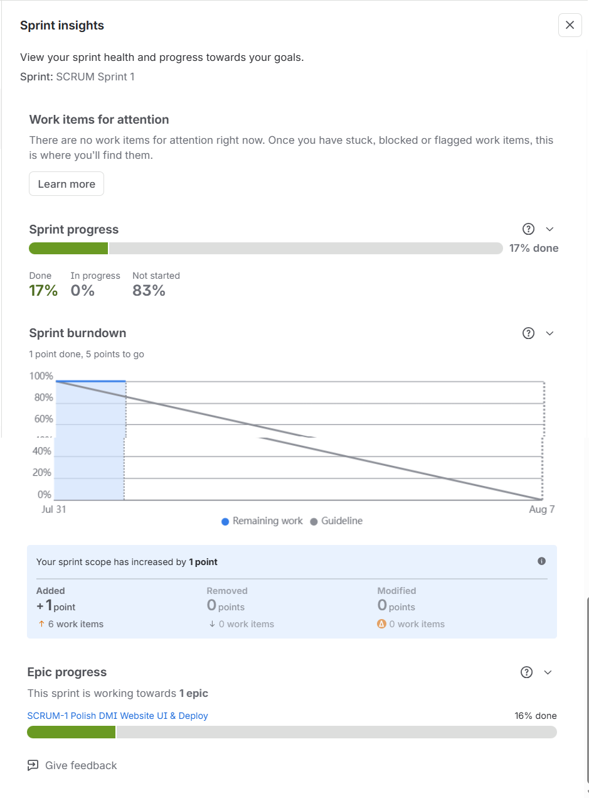

Sprint burndown reading one point done and five to go, with the Remaining work line stepping down as SCRUM-16 closed.

Worth noting how this behaves: story points burn when Stories close, not when Sub-tasks close. The chart stayed flat through all five Sub-tasks and only moved once SCRUM-16 itself moved to Done. The panel also records that sprint scope increased by one point, since this Story was added to an already-running Sprint.

---

#### Screenshot 16 — Jira retrospective comment

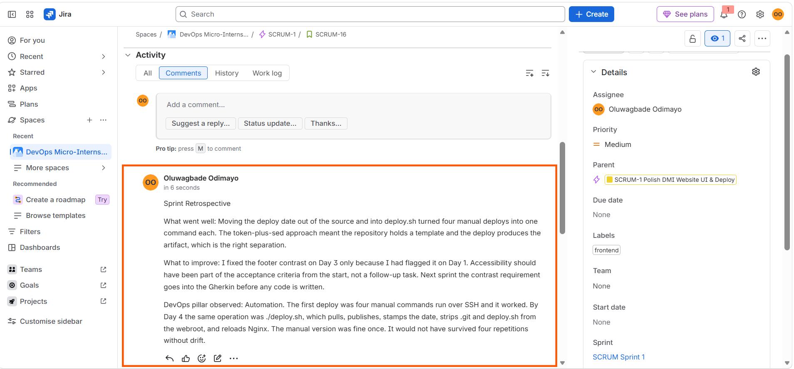

Retrospective on SCRUM-16 covering what went well, what to improve, and one DevOps pillar observed.

The improvement point is the honest one: the footer contrast was only fixed on Day 3 because it had been flagged on Day 1. Accessibility belonged in the acceptance criteria before any code was written, not in a follow-up task.

---

#### Screenshot 17 — Final EC2 browser view showing the complete footer requirement

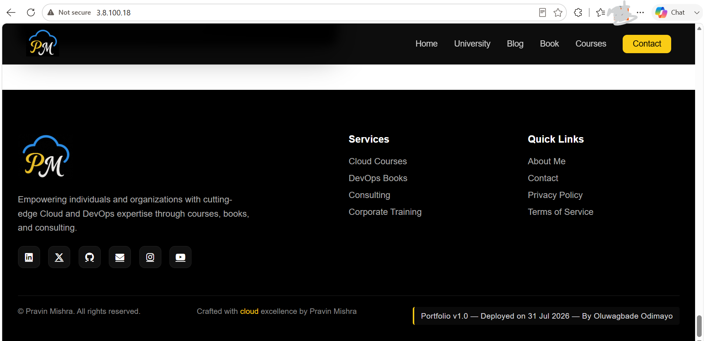

The finished increment at `http://3.8.100.18`, showing the complete required footer text with the URL in frame.

---

#### Demo Video URL

Paste your unlisted YouTube or accessible Google Drive demo-video link here:

https://drive.google.com/file/d/1KGDA0Evo3mPYgVFup3YWYyedAMquKy4d/view?usp=sharing

---

# LinkedIn Post (Required)

## Goal

Publish a LinkedIn post about your five-day mini-Sprint, including your GitHub repository URL, your public EC2 live URL, three to five lines on what you shipped and learned, and one proof image (Burndown Chart, active Sprint board, or the EC2 footer).

## Evidence

#### LinkedIn Post URL

Paste your LinkedIn post URL here:

https://www.linkedin.com/posts/oluwagbade-odimayo-_dmibypravinmishra-devops-agile-activity-7489039632316207105-4OJN

---

#### Screenshot — Published LinkedIn post showing the required links and proof image

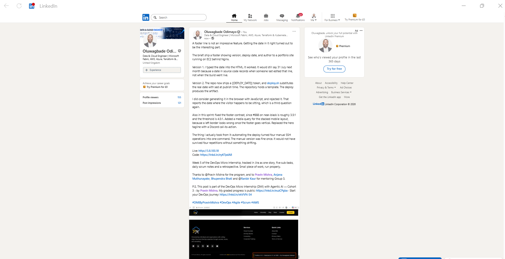

The published post carrying the repository URL, the live EC2 URL, what shipped and what I took from it, the proof image, the required credit line and hashtag, and tags for Pravin Mishra and the Group 3 mentors.

---

# Submission Instructions

- Add all required screenshots in your submission
- Full name must be visible in required screenshots
- Include your GitHub repository URL and public EC2 live URL
- Do not expose sensitive information (private keys, passwords, tokens, account IDs)

---

# Completion Checklist

- [x] Task 1: Sprint 1 started with the required Sprint Goal (Screenshots 1 & 2)
- [x] Task 2: Day 1 footer implemented, committed, and deployed (Screenshots 3–6)
- [x] Task 3: Day 2 deploy date made dynamic and documented (Screenshots 7–10)
- [x] Task 4: Day 3 footer polished and validated on desktop and mobile (Screenshots 11–13)
- [x] Task 5: Day 4 DMI Discord call-to-action deployed and clickable (Screenshot 14)
- [x] Task 6: Day 5 demo, retrospective, and Burndown evidence completed (Screenshots 15–17, video URL)
- [x] Daily Scrum comments posted for Days 1–5
- [x] LinkedIn post published and URL submitted
- [x] Full Name visible in required screenshots
- [x] No sensitive data exposed

---

## 📌 About DMI & CloudAdvisory

DevOps Micro Internship (DMI) is a project-based DevOps program run by Pravin Mishra (The CloudAdvisory) focused on real-world execution, systems thinking, and career readiness.

It helps learners build strong DevOps foundations with hands-on experience.

---

## 📌 Resources

- 🌐 DMI Official Website: https://dmi.pravinmishra.com?utm_source=github&utm_medium=readme  
- 🎓 University: https://university.pravinmishra.com?utm_source=github&utm_medium=readme  
- 💬 Discord Community: https://discord.pravinmishra.com?utm_source=github&utm_medium=readme  
- 📝 Blog: https://dmi.pravinmishra.com/blog?utm_source=github&utm_medium=readme  
- ▶️ YouTube Playlist: https://www.youtube.com/playlist?list=PLFeSNDtI4Cho  
- 🔗 Pravin Mishra (LinkedIn): https://www.linkedin.com/in/pravin-mishra-aws-trainer/  
- 🏢 CloudAdvisory (LinkedIn): https://www.linkedin.com/company/thecloudadvisory/

---

*This submission is part of DevOps Micro Internship (DMI) Cohort 3 — Agentic AI Track.*
