# Assignment 4 — Gotto Job: Backlog Refinement & Sprint 1 in Jira

Part of the DevOps Micro Internship (DMI) Cohort 3 with Agentic AI

---

## Purpose

In this 90-minute, time-boxed exercise, you will act as a Scrum team — or run in Solo Mode, playing every role yourself — to turn the Gotto Job template into a value-ordered backlog, estimate the work in story points, plan Sprint 1, open the burndown chart, and ship one small UI-only increment (text, color, spacing, a label, or a CTA — no backend changes).

---

# Task 1 — Roles & Mode Setup (Team vs Solo)

## Goal

Choose Team Mode or Solo Mode, and document how each Scrum role (Product Owner, Scrum Master, Dev Lead, DevOps Lead) was handled.

### Evidence

#### Screenshot 1 — Jira "Create project" screen, or the project sidebar after creation

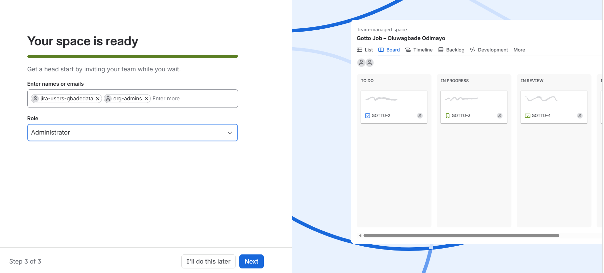

The `Gotto Job – Oluwagbade Odimayo` space after creation, sitting alongside the existing DevOps Micro-Internship space. Created from the Scrum template, team-managed, with sample work items deliberately declined so the backlog contains only Stories I authored.

---

### Notes

Write one line for each role: PO (what you prioritized), SM (how you ensured process), Dev Lead (what you built), DevOps Lead (how you shipped).

Mode: Solo Mode. I played all four roles myself, which is the honest description of a one-person exercise.

Product Owner: I ordered the backlog by value before estimating anything, rather than by effort. Discoverability ranked above trust, because a visitor who cannot find a relevant job never gets far enough to care whether the site looks credible. So the search call-to-action, the result count and the job card content came before footer trust signals and form labelling.

Scrum Master: I kept the exercise inside its time box and kept the sprint honest. Three Stories at four points, not six at eleven. I also held the sprint scope fixed once it had started, which is the easiest rule to break when nobody else would notice.

Dev Lead: I limited the increment to text on the hero heading and the primary search button. UI only, no backend, no data. The smallest change that still delivers what the top-ranked Story describes.

DevOps Lead: I deployed the Gotto Job template to the same EC2 instance already serving my portfolio site, using a separate Nginx location and a separate directory outside `/var/www/html`. That separation mattered because the portfolio deploy script clears its own webroot on every run and would otherwise have deleted this site.

---

# Task 2 — Create the Jira Project (Team-managed → Scrum)

## Goal

Create a Team-managed Scrum project named `Gotto Job – Team <#>` (Team Mode) or `Gotto Job – <YourName>` (Solo Mode).

### Evidence

#### Screenshot 2 — Project created page showing the project name and key

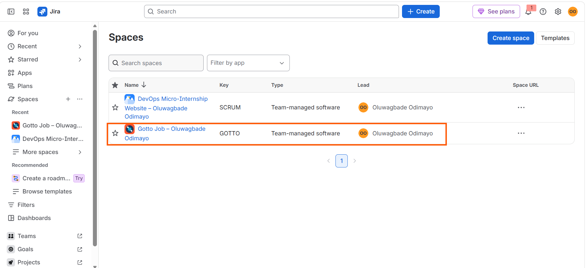

The space directory showing `Gotto Job – Oluwagbade Odimayo` with key `GOTTO`, type Team-managed software, and my name as lead.

---

# Task 3 — Create the Epic

## Goal

Create the Epic `Improve Gotto Job UI discoverability & trust` to group the UI improvement initiative.

### Evidence

#### Screenshot 3 — Backlog showing the Epic panel with the Epic visible

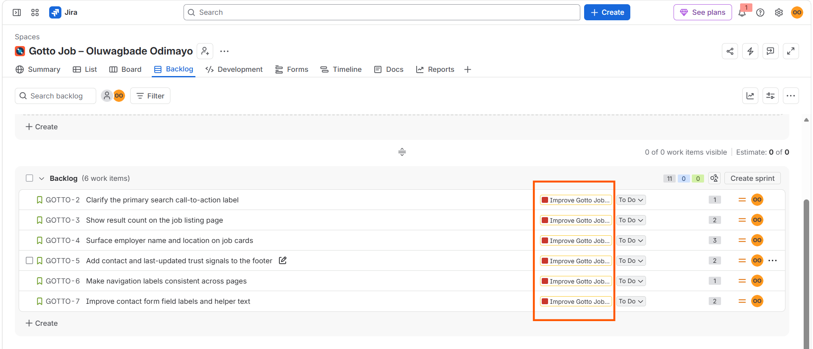

The Epic `Improve Gotto Job UI discoverability & trust`, created as GOTTO-1 and visible against the Stories in the backlog.

---

# Task 4 — Seed the Product Backlog (6–8 Stories + Fibonacci Points + Ranking)

## Goal

Create at least six Stories under the Epic, estimate each with 1, 2, or 3 story points, and rank them by value.

### Evidence

#### Screenshot 4 — Backlog showing the Epic and at least six Stories under it

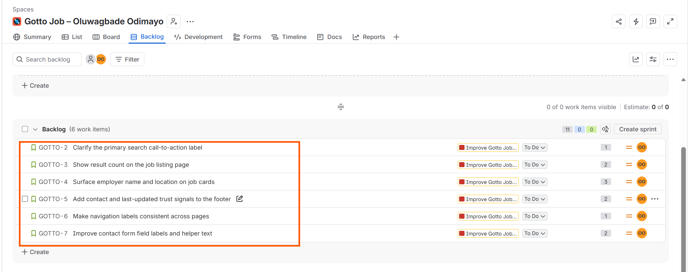

Six Stories, GOTTO-2 through GOTTO-7, all linked to the Epic. Backlog order is the value ranking: discoverability first, trust second.

| Rank | Key | Story | Points |
|---|---|---|---|
| 1 | GOTTO-2 | Clarify the primary search call-to-action label | 1 |
| 2 | GOTTO-3 | Show result count on the job listing page | 2 |
| 3 | GOTTO-4 | Surface employer name and location on job cards | 3 |
| 4 | GOTTO-5 | Add contact and last-updated trust signals to the footer | 2 |
| 5 | GOTTO-6 | Make navigation labels consistent across pages | 1 |
| 6 | GOTTO-7 | Improve contact form field labels and helper text | 2 |

---

#### Screenshot 5 — One Story opened showing its Story Points and acceptance criteria filled in

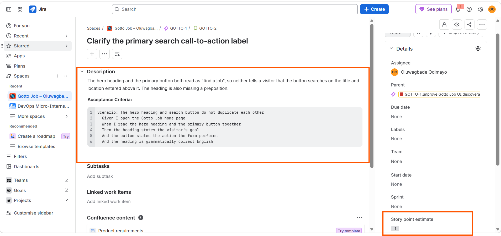

GOTTO-2 with a 1 point estimate and its acceptance criteria. Team-managed Jira has no dedicated acceptance criteria field, so the criteria sit in the description.

Worth recording that these criteria were rewritten before any code was written. The original version required the button label to name an action and an object. Opening the template showed it already read "Find a job", which satisfies that. The real defect was the hero heading above it duplicating the same idea while missing a preposition, so the criteria were rewritten to describe the actual problem.

---

# Task 5 — Planning Poker (Estimate + Debate Notes)

## Goal

Confirm the Story Points (1, 2, or 3) for each Story and record brief reasoning for each estimate.

### Evidence

#### Screenshot 6 — Backlog showing Story Points visible, or two or three Stories opened showing their points

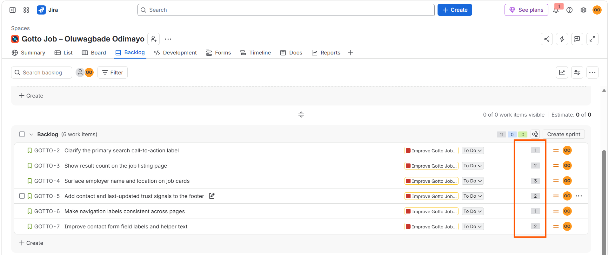

Story points visible across all six Stories: 1, 2, 3, 2, 1, 2. Eleven points total, all within the required Fibonacci range of 1, 2 or 3.

---

### Notes

For each story, explain in one or two lines why it is a 1, 2, or 3 (mention any debate, even in Solo Mode).

GOTTO-2, clarify the primary search call-to-action label, 1 point. A text change in a single template file with no layout impact. The only argument for making it a 2 was that it still needs deploying and verifying like anything else, which is true of a 1 as well.

GOTTO-3, show result count on the job listing page, 2 points. Still presentational, but the count has to render somewhere sensible and read correctly when there are zero results. That edge case is the difference between a 1 and a 2.

GOTTO-4, surface employer name and location on job cards, 3 points. I first estimated this at 2 and revised it upward. It changes a repeating component rather than a single element, so it has to be checked at more than one viewport width, and any layout regression multiplies across every card on the page.

GOTTO-5, add contact and last-updated trust signals to the footer, 2 points. Two separate pieces of information in a shared component, so the change lands on every page rather than one.

GOTTO-6, make navigation labels consistent across pages, 1 point. Text edits across five HTML files. Individually trivial, and the only real risk is missing a page.

GOTTO-7, improve contact form field labels and helper text, 2 points. Labels are straightforward, but helper text has to be written rather than edited, and writing takes longer than changing.

---

# Task 6 — Sprint Planning: Create Sprint 1 + Sprint Goal + Scope

## Goal

Create Sprint 1, move three or four Stories into it (approximately 3–6 points), set the Sprint Goal, and break each selected Story into Build, Verify, Deploy, and Screenshot Sub-tasks.

### Evidence

#### Screenshot 7 — Sprint 1 with the selected Stories inside it

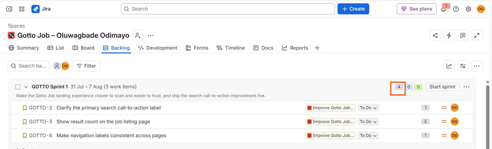

Sprint 1 holding GOTTO-2, GOTTO-3 and GOTTO-6, committed at four points against a backlog of eleven.

Sprint Goal: Make the Gotto Job landing experience clearer to scan and easier to trust, and ship the search call-to-action improvement live.

Three Stories rather than four was deliberate. Each selected Story needs four Sub-tasks, so three is twelve and four would have been sixteen, against a ninety minute time box.

---

#### Screenshot 8 — One Story showing the Sub-tasks created

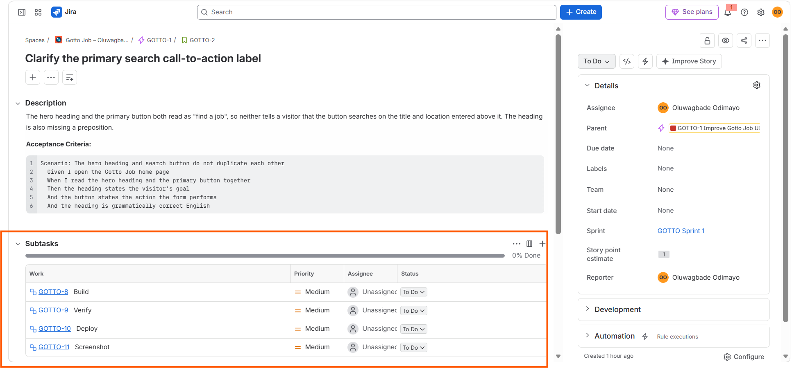

GOTTO-2 broken into Build, Verify, Deploy and Screenshot. The same four were applied to GOTTO-3 and GOTTO-6.

---

# Task 7 — Reports: Open Burndown Chart

## Goal

Open the Burndown Chart and confirm it exists for Sprint 1. It is acceptable if the chart is not yet populated.

### Evidence

#### Screenshot 9 — Burndown Chart page opened, even if empty

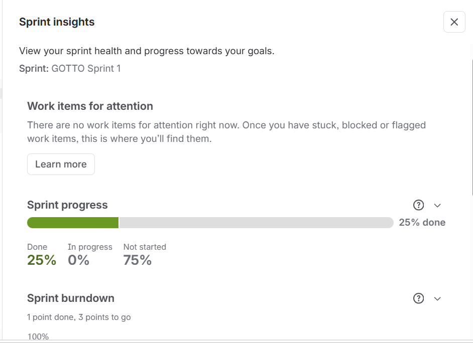

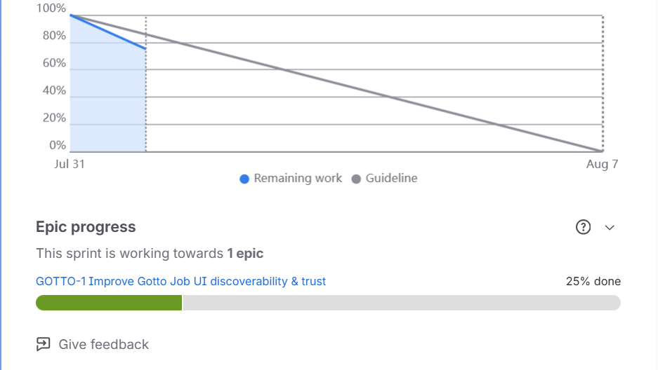

The Sprint insights panel for GOTTO Sprint 1, captured in two parts because the panel is taller than the viewport. This version of Jira surfaces the burndown through Sprint insights rather than a separate Reports page.

The chart is close to flat, which the task notes is acceptable for a sprint that has only just started. Points burn when a Story closes, not when its Sub-tasks close, so the line moves once rather than gradually.

---

# Task 8 — Ship One Small Increment (Build + Deploy + Proof)

## Goal

Implement one small UI-only Story from Sprint 1, commit it, deploy it live, and move the Story and its Sub-tasks to Done in Jira.

### Evidence

#### Screenshot 10 — Jira board showing the Story moved to Done

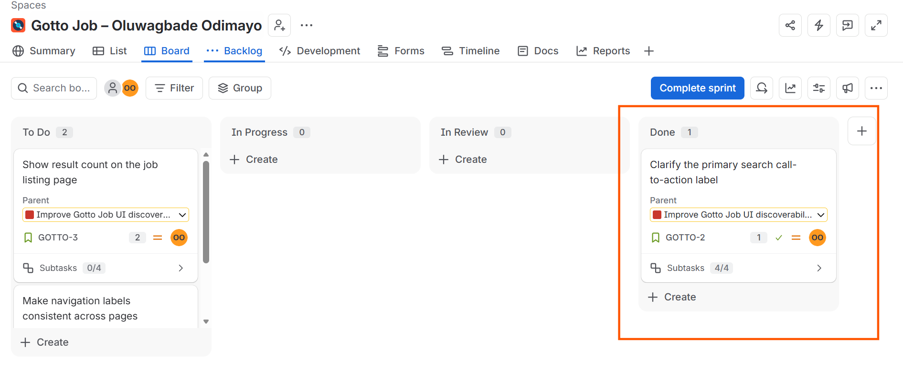

GOTTO-2 moved to Done along with its four Sub-tasks, after the change was committed, deployed and verified in the browser. GOTTO-3 and GOTTO-6 remain open, since that work has not been done.

---

#### Screenshot 11 — Git commit output

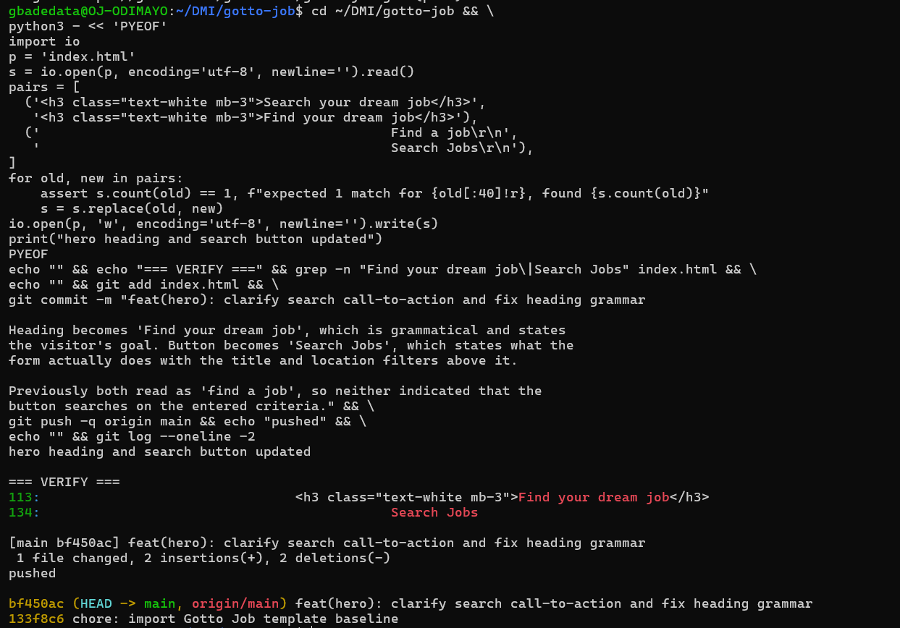

Commit `bf450ac` on `main`, one file changed, two insertions and two deletions.

The repository holds two commits by design: `133f8c6` imports the unmodified Tooplate template as a baseline, and `bf450ac` is the UI change. That way the increment shows as a two line diff rather than being buried inside a 2MB initial import.

---

#### Screenshot 12 — Live URL in the browser showing the UI change, with the URL visible

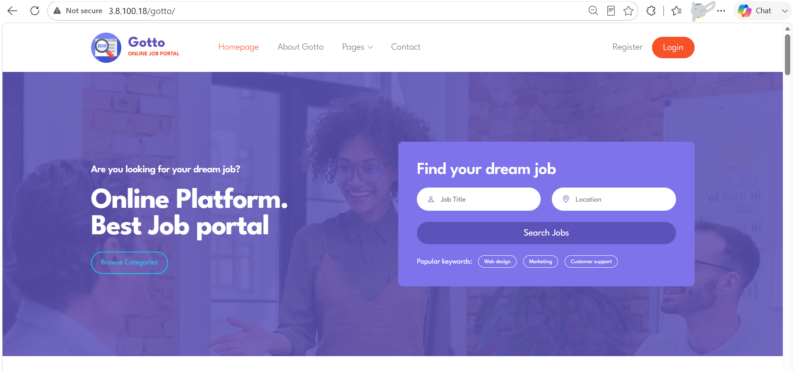

The change live at `http://3.8.100.18/gotto/`. Hero heading now reads "Find your dream job" and the primary button reads "Search Jobs", so the heading states the visitor's goal and the button states what the form does.

Served from `/var/www/gotto` through a dedicated Nginx location, on the same instance as the portfolio site at `/`. The first attempt used `alias` with `try_files`, which returned 404 because `$uri` still carries the location prefix inside an alias block. Switching to `root /var/www` resolved it, since the path then concatenates rather than being rewritten.

---

# Task 9 — Retro Notes (Scrum Pillar + Value)

## Goal

Add a retro comment covering what went well, what to improve, one Scrum pillar observed (Transparency, Inspection, or Adaptation), and one Scrum value (Openness, Focus, Commitment, Courage, or Respect).

### Evidence

#### Screenshot 13 — Jira retro comment visible

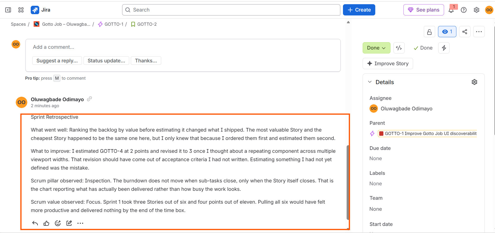

Retrospective on GOTTO-2 covering what went well, what to improve, one Scrum pillar and one Scrum value.

Pillar: Inspection. Value: Focus.

---

# LinkedIn Post (Required)

## Goal

Publish a LinkedIn post about what you delivered, including your live URL, three to five lines on what you did and learned, and one screenshot (Burndown Chart, Sprint board, or the live UI change).

## Evidence

#### LinkedIn Post URL

Paste your LinkedIn post URL here:

https://www.linkedin.com/posts/oluwagbade-odimayo-_dmibypravinmishra-devops-agile-share-7489074589528989697-KX_n

---

#### Screenshot 14 — Published LinkedIn post

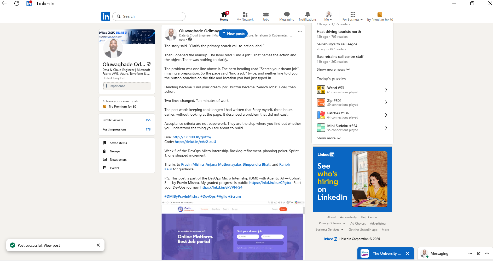

The published post carrying the live URL, the repository URL, what was delivered and what I took from it, and a proof image of the live UI change.

---

# Submission Instructions

- Add all required screenshots in your submission
- Full name must be visible in required screenshots
- Do not expose sensitive information (keys, passwords, account IDs)

---

# Completion Checklist

- [x] Task 1: Team Mode or Solo Mode selected and all four roles documented (Screenshot 1 & Notes)
- [x] Task 2: Team-managed Scrum project created with the required name (Screenshot 2)
- [x] Task 3: UI improvement Epic created (Screenshot 3)
- [x] Task 4: 6–8 Stories added under the Epic and ranked by value (Screenshots 4 & 5)
- [x] Task 5: Story Points set (1, 2, or 3) with reasoning recorded (Screenshot 6 & Notes)
- [x] Task 6: Sprint 1 created with Sprint Goal, 3–4 Stories, and Sub-tasks (Screenshots 7 & 8)
- [x] Task 7: Burndown Chart opened (Screenshot 9)
- [x] Task 8: One UI-only increment implemented, committed, deployed, and verified (Screenshots 10–12)
- [x] Task 9: Retro comment with one Scrum pillar and one Scrum value (Screenshot 13)
- [x] LinkedIn post published and URL submitted (Screenshot 14)
- [x] Full Name visible in required screenshots
- [x] No sensitive data exposed

---

## 📌 About DMI & CloudAdvisory

DevOps Micro Internship (DMI) is a project-based DevOps program run by Pravin Mishra (The CloudAdvisory) focused on real-world execution, systems thinking, and career readiness.

It helps learners build strong DevOps foundations with hands-on experience.

---

## 📌 Resources

- 🌐 DMI Official Website: https://dmi.pravinmishra.com?utm_source=github&utm_medium=readme  
- 🎓 University: https://university.pravinmishra.com?utm_source=github&utm_medium=readme  
- 💬 Discord Community: https://discord.pravinmishra.com?utm_source=github&utm_medium=readme  
- 📝 Blog: https://dmi.pravinmishra.com/blog?utm_source=github&utm_medium=readme  
- ▶️ YouTube Playlist: https://www.youtube.com/playlist?list=PLFeSNDtI4Cho  
- 🔗 Pravin Mishra (LinkedIn): https://www.linkedin.com/in/pravin-mishra-aws-trainer/  
- 🏢 CloudAdvisory (LinkedIn): https://www.linkedin.com/company/thecloudadvisory/

---

*This submission is part of DevOps Micro Internship (DMI) Cohort 3 — Agentic AI Track.*
