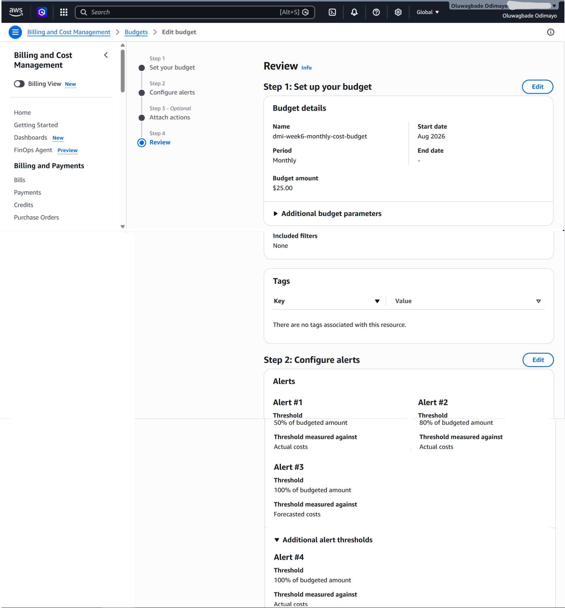

# Assignment 1 — Creating an AWS Free Tier Account & Setting Up Budget Management and Alerts

Part of the DevOps Micro Internship (DMI) Cohort 3 with Agentic AI

---

## Purpose

In this assignment, you will create your own AWS Free Tier account and configure budget management with cost alerts. This is an important first step: it lets you follow along with the rest of the course, and the alerts help ensure you do not exceed your budget.

---

# Task 1 — Sign Up for AWS and Access the Console

## Goal

Create your AWS Free Tier account, select the Basic Support Plan (Free), and log in to the AWS Management Console.

> No screenshot required for this task. Completion is verified through Task 2.

---

# Task 2 — Create a Monthly Cost Budget with Alerts

## Goal

In the Billing Dashboard, create a monthly Cost Budget with a name, amount, and start month, then configure alert thresholds (e.g. 50%, 80%, 100%) and a notification email address.

### Evidence

#### Screenshot 1 — AWS Budget setup page showing the budget name, budget amount, and alert thresholds

---

### Notes

Answer the following in your own words:

**1. Why is it important to set up budget alerts when using an AWS account?**

AWS charges by the hour, and the services that cost the most are usually the ones you forget rather than the ones you plan. My own account averaged $1.98 across the whole of July, so my normal spend is very small. A single NAT Gateway, which this week's high availability assignment requires, runs at roughly $0.045 per hour. Left running for a month by accident, that one resource would cost around $32, which is sixteen times my entire monthly baseline. Nothing about the AWS console would warn me while it happened.

Budget alerts close that gap. I set a $25 monthly cost budget with thresholds at 50%, 80% and 100%, so an email lands at roughly $12.50, well before the spend becomes painful. I also added a fourth alert at 100% measured against forecasted costs rather than actual costs, and that is the more useful of the two. An actual-cost alert tells me money has already gone. A forecast alert warns me when AWS projects I will exceed the budget by month end, which on a resource left running by mistake arrives days earlier and gives me time to tear it down while the cost is still pennies.

---

# Submission Instructions

- Add the required screenshot in your submission
- Do not expose sensitive billing, card, identity, or account information

---

# Completion Checklist

- [x] AWS Free Tier account created and Basic Support Plan (Free) selected
- [x] Logged in to the AWS Management Console
- [x] Monthly Cost Budget created with name, amount, and start month
- [x] Budget alert thresholds and notification email configured
- [x] Screenshot captured showing budget name, amount, and thresholds (Screenshot 1)
- [x] Notes question answered
- [x] No sensitive billing or account information exposed

---

## 📌 About DMI & CloudAdvisory

DevOps Micro Internship (DMI) is a project-based DevOps program run by Pravin Mishra (The CloudAdvisory) focused on real-world execution, systems thinking, and career readiness.

It helps learners build strong DevOps foundations with hands-on experience.

---

## 📌 Resources

- 🌐 DMI Official Website: https://dmi.pravinmishra.com?utm_source=github&utm_medium=readme  
- 🎓 University: https://university.pravinmishra.com?utm_source=github&utm_medium=readme  
- 💬 Discord Community: https://discord.pravinmishra.com?utm_source=github&utm_medium=readme  
- 📝 Blog: https://dmi.pravinmishra.com/blog?utm_source=github&utm_medium=readme  
- ▶️ YouTube Playlist: https://www.youtube.com/playlist?list=PLFeSNDtI4Cho  
- 🔗 Pravin Mishra (LinkedIn): https://www.linkedin.com/in/pravin-mishra-aws-trainer/  
- 🏢 CloudAdvisory (LinkedIn): https://www.linkedin.com/company/thecloudadvisory/

---

*This submission is part of DevOps Micro Internship (DMI) Cohort 3 — Agentic AI Track.*
