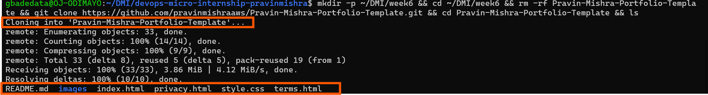
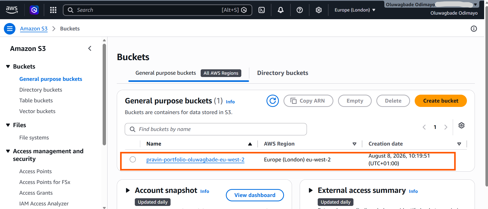
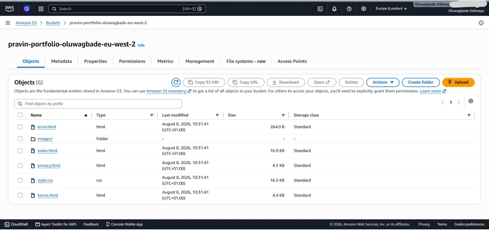
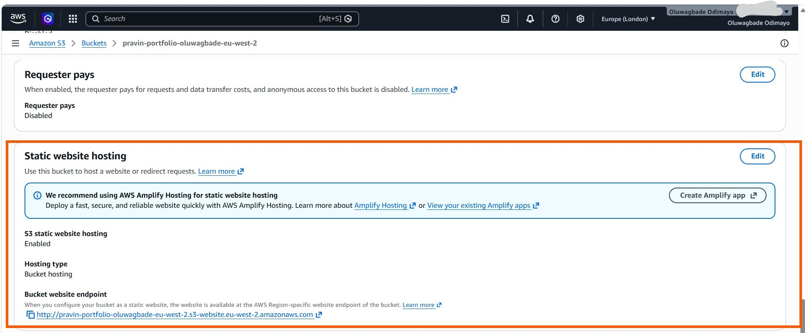
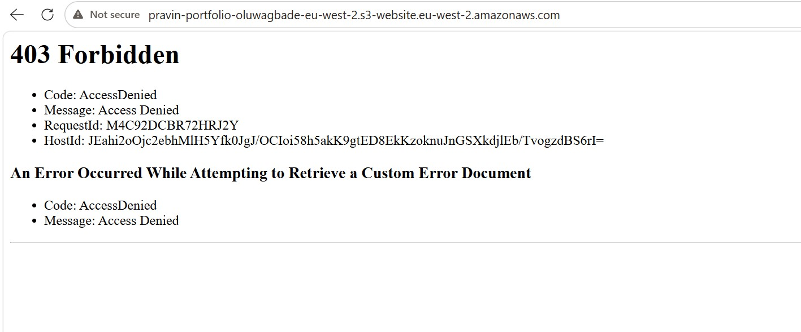
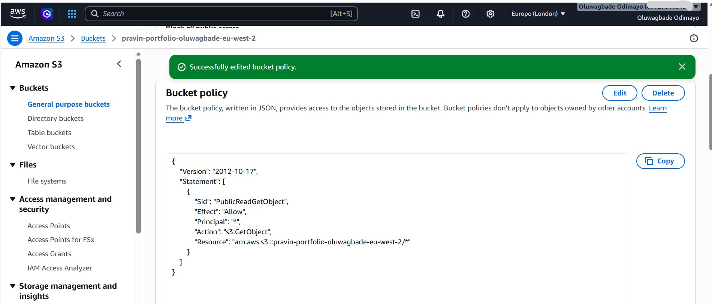
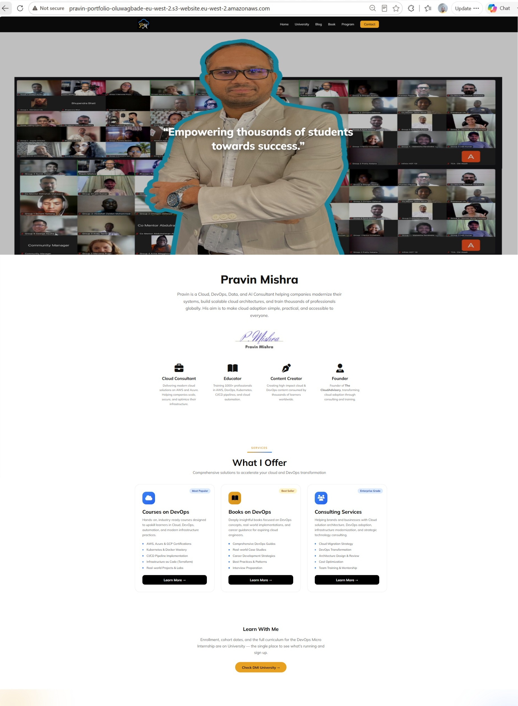
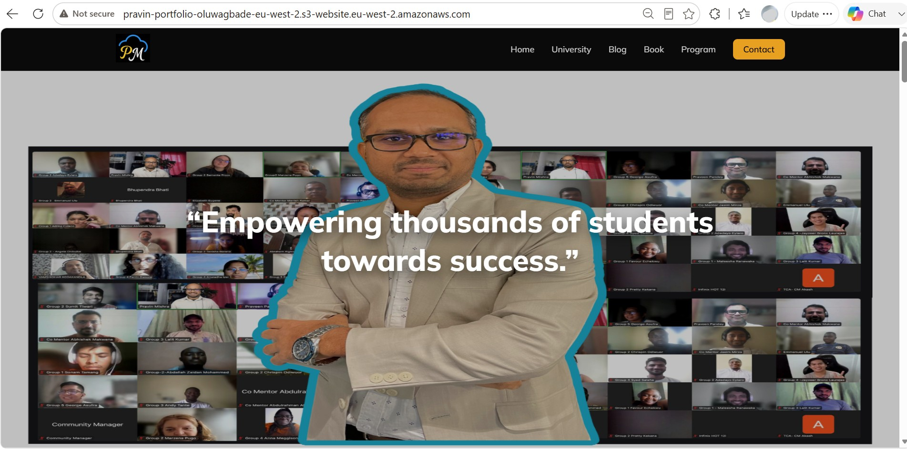

# Assignment 2 — Deploy Personal Portfolio Website on S3

Part of the DevOps Micro Internship (DMI) Cohort 3 with Agentic AI

---

## Purpose

In this assignment, you will deploy a static personal portfolio website quickly and reliably using Amazon S3 Static Website Hosting. You will download the portfolio template, create an S3 bucket, upload the static files, enable static website hosting, configure public read access, and validate the deployment through the S3 website endpoint.

---

# Task 1 — Download the Website Template Locally

## Goal

Download or clone the portfolio website template from GitHub and confirm `index.html` is present.

### Evidence

#### Screenshot 1 — File Explorer or terminal showing the template folder contents with `index.html` visible

---

# Task 2 — Create an S3 Bucket for Website Hosting

## Goal

Create a globally unique S3 bucket in your chosen AWS region.

### Evidence

#### Screenshot 2 — S3 bucket created screen showing the bucket name and region

---

# Task 3 — Upload Website Files to the Bucket

## Goal

Upload the contents of the template folder (not the folder itself) so `index.html` sits at the bucket root.

### Evidence

#### Screenshot 3 — S3 bucket Objects view showing `index.html` at the root level

---

# Task 4 — Enable Static Website Hosting

## Goal

Enable S3 Static Website Hosting with `index.html` as the index document and `error.html` as the error document.

### Evidence

#### Screenshot 4 — Static website hosting enabled screen showing the website endpoint

#### Additional evidence — Website endpoint tested before the bucket policy was applied

Loading the website endpoint at this point returned a 403 AccessDenied, and the page showed two stacked errors. The first was the request for `index.html` being refused. The second was S3 trying to fall back to the configured error document and being refused as well, because `error.html` is just another object in the same bucket with no public read permission. This confirmed that enabling static website hosting only tells S3 which file to serve, and grants nobody permission to read it. That is what the bucket policy in Task 5 does.

---

# Task 5 — Make the Website Public (Bucket Policy + Permissions)

## Goal

Adjust Block Public Access settings and save a bucket policy that grants public read access to the website objects.

### Evidence

#### Screenshot 5 — Bucket policy page showing the policy saved successfully, with the bucket name visible

---

# Task 6 — Verify Website Works (Public Endpoint Test)

## Goal

Load the site through the S3 website endpoint and confirm the homepage, images, and CSS load correctly.

### Evidence

#### Screenshot 6 — Browser showing the live website with the S3 website endpoint visible in the address bar

**Live S3 Website Endpoint:** http://pravin-portfolio-oluwagbade-eu-west-2.s3-website.eu-west-2.amazonaws.com

---

# Task 7 — (Optional) Update One Small Detail and Re-Upload

## Goal

Edit a small visible detail, re-upload it to S3, and confirm the change appears live.

### Evidence

#### Screenshot 7 (optional) — Before/after view, or a browser view showing the updated text

---

# Submission Instructions

- Add all required screenshots in your submission
- Include the live S3 Website Endpoint URL
- Do not expose sensitive AWS account information

---

# Completion Checklist

- [x] Task 1: Template downloaded/cloned with `index.html` confirmed (Screenshot 1)
- [x] Task 2: Globally unique S3 bucket created (Screenshot 2)
- [x] Task 3: Website files uploaded with `index.html` at bucket root (Screenshot 3)
- [x] Task 4: Static website hosting enabled (Screenshot 4)
- [x] Task 5: Public-read bucket policy saved (Screenshot 5)
- [x] Task 6: Live website verified through the S3 website endpoint (Screenshot 6)
- [x] Task 7: Optional small update re-uploaded and verified (Screenshot 7)
- [x] S3 Website Endpoint URL included
- [x] No sensitive account information exposed

---

## 📌 About DMI & CloudAdvisory

DevOps Micro Internship (DMI) is a project-based DevOps program run by Pravin Mishra (The CloudAdvisory) focused on real-world execution, systems thinking, and career readiness.

It helps learners build strong DevOps foundations with hands-on experience.

---

## 📌 Resources

- 🌐 DMI Official Website: https://dmi.pravinmishra.com?utm_source=github&utm_medium=readme  
- 🎓 University: https://university.pravinmishra.com?utm_source=github&utm_medium=readme  
- 💬 Discord Community: https://discord.pravinmishra.com?utm_source=github&utm_medium=readme  
- 📝 Blog: https://dmi.pravinmishra.com/blog?utm_source=github&utm_medium=readme  
- ▶️ YouTube Playlist: https://www.youtube.com/playlist?list=PLFeSNDtI4Cho  
- 🔗 Pravin Mishra (LinkedIn): https://www.linkedin.com/in/pravin-mishra-aws-trainer/  
- 🏢 CloudAdvisory (LinkedIn): https://www.linkedin.com/company/thecloudadvisory/

---

*This submission is part of DevOps Micro Internship (DMI) Cohort 3 — Agentic AI Track.*
