# Assignment 4 — Deploy EpicBook on Ubuntu VM + MySQL RDS with Secure Cloud Network

Part of the DevOps Micro Internship (DMI) Cohort 3 with Agentic AI

---

## Purpose

In this assignment, you will deploy the EpicBook web application in AWS using a secure two-tier architecture: an Ubuntu EC2 instance with Nginx in a public subnet, and a private MySQL RDS database with restricted security-group access. The completed deployment must prove that the frontend, backend, and private database communicate successfully end to end.

---

# Task 1 — Create VPC + Public/Private Subnets + Routing

## Goal

Create `epicbook-vpc` (10.0.0.0/16) with a public subnet (10.0.1.0/24) and a private subnet (10.0.2.0/24), attach an Internet Gateway, and route only the public subnet to it.

### Evidence

#### Screenshot 1 — VPC details showing CIDR 10.0.0.0/16

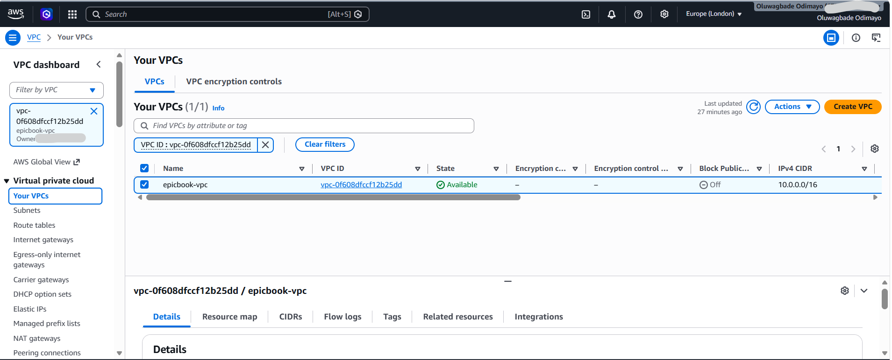

---

#### Screenshot 2 — Subnets list showing both subnets and their CIDRs

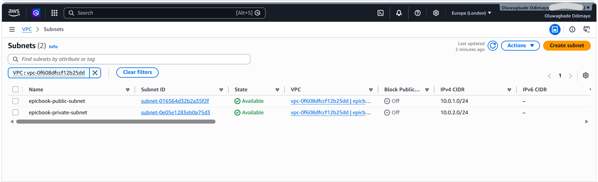

---

#### Screenshot 3 — Route table showing 0.0.0.0/0 → IGW and association with the public subnet

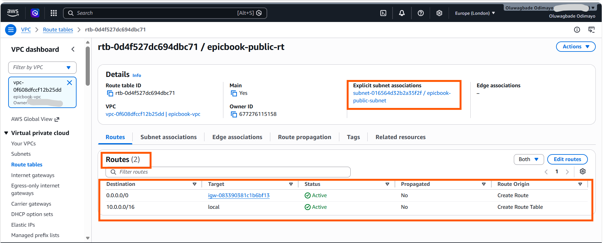

#### Additional evidence — Private route table with no internet route

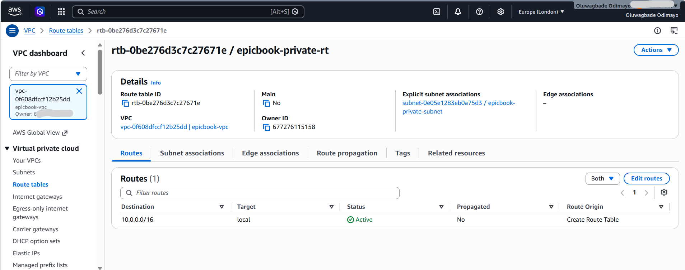

Creating a separate private route table was not in the task list but was necessary. A new subnet inherits the VPC main route table, which here is the public one carrying the 0.0.0.0/0 route to the internet gateway, so both private subnets would have had an internet path by default. Associating them with a dedicated table that holds only the local route is what actually makes them private.

---

# Task 2 — Create Security Groups (EC2 + RDS) with Least Privilege

## Goal

Create `epicbook-ec2-sg` (SSH from your IP, HTTP/HTTPS public) and `epicbook-rds-sg` (MySQL 3306 only from `epicbook-ec2-sg`).

### Evidence

#### Screenshot 4 — EC2 security-group inbound rules showing ports and sources

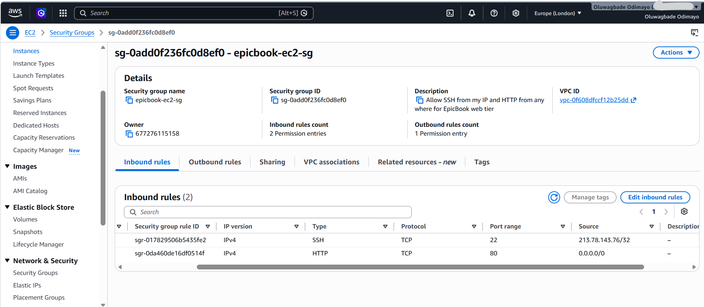

---

#### Screenshot 5 — RDS security-group inbound rule showing MySQL 3306 allowed from the EC2 security group

---

# Task 3 — Launch Ubuntu EC2 in Public Subnet

## Goal

Launch an Ubuntu 20.04 instance in the public subnet with `epicbook-ec2-sg` attached, and connect to it over SSH.

### Evidence

#### Screenshot 6 — EC2 instance summary showing the public IPv4 address, subnet, and security group

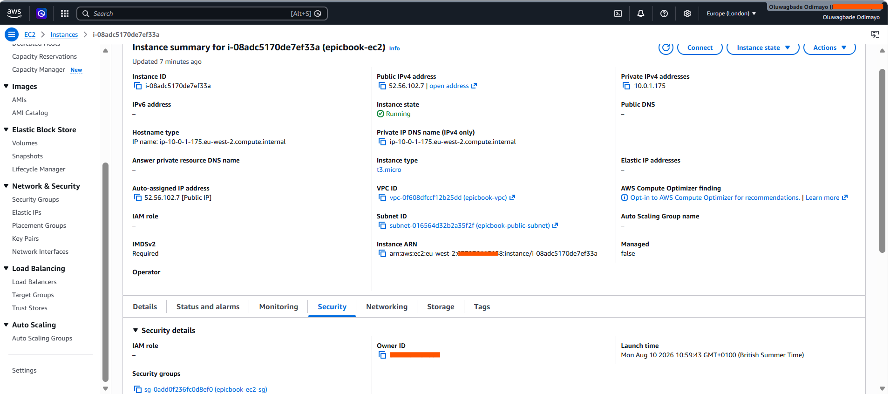

---

#### Screenshot 7 — Terminal showing a successful SSH login

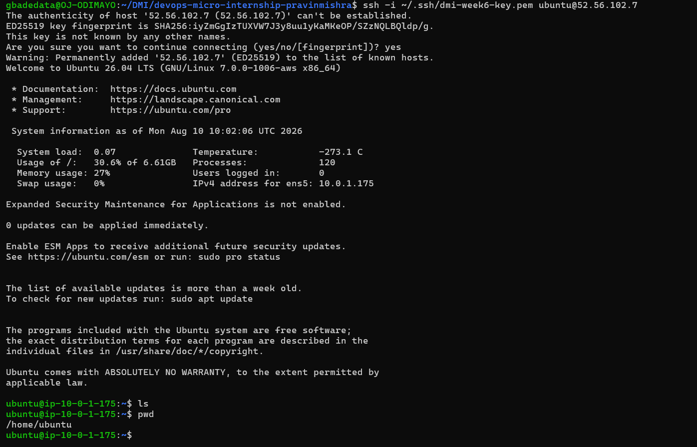

---

# Task 4 — Install Required Software on EC2

## Goal

Install Node.js, npm, Nginx, and the MySQL client on the instance, and confirm Nginx is running.

### Evidence

#### Screenshot 8 — Output of `node -v` and `npm -v`

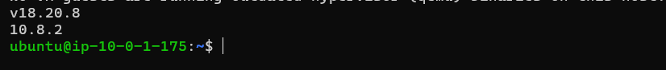

---

#### Screenshot 9 — Output of `systemctl status nginx`

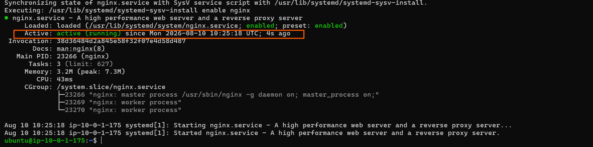

---

#### Screenshot 10 — Output of `mysql --version`

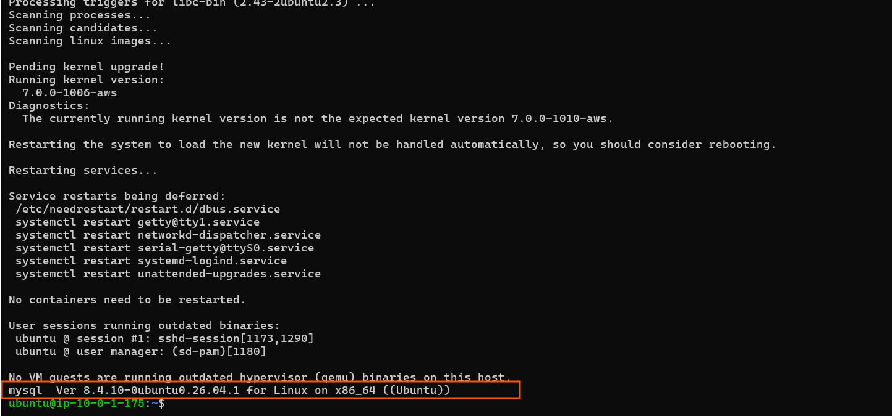

---

# Task 5 — Create RDS MySQL in Private Subnet (No Public Access)

## Goal

Create a private MySQL RDS instance in `epicbook-vpc` using a DB Subnet Group over the private subnet, with `epicbook-rds-sg` attached and public access disabled.

### Evidence

#### Screenshot 11 — RDS instance summary showing Publicly accessible: No

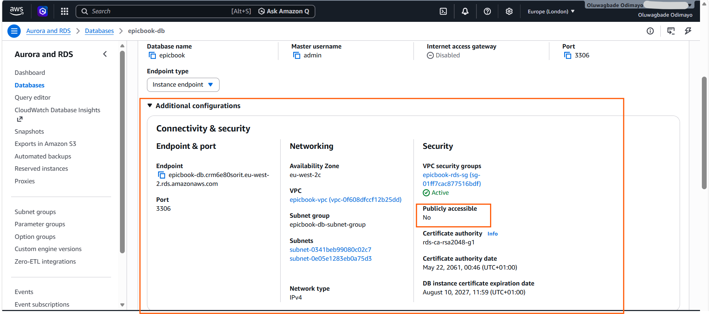

---

#### Screenshot 12 — Connectivity & security section showing the VPC and attached security group

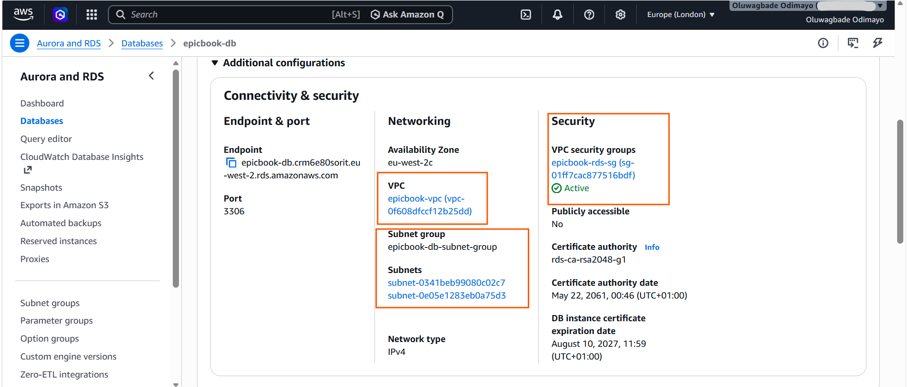

---

# Task 6 — Initialize Database (SQL Dump Import)

## Goal

Connect to RDS from EC2, create the `epicbook` database, and import the provided SQL dump.

### Evidence

#### Screenshot 13 — Terminal showing successful `SHOW TABLES;` output with tables listed

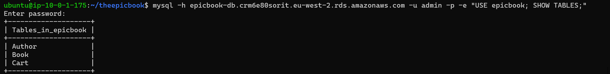

#### Additional evidence — Row counts confirming the seed data imported

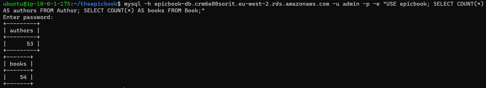

Tables existing does not prove data landed. The counts confirm 53 authors and 54 books, which also proves the import order held, since Book carries a foreign key to Author and would have failed had the seeds run the other way round.

---

# Task 7 — Deploy EpicBook Backend and Configure Environment Variables

## Goal

Clone the EpicBook repository, install backend dependencies, configure `.env` with the RDS endpoint and credentials, and start the backend on port 3000.

### Evidence

#### Screenshot 14 — Terminal showing the repository cloned and the `ls` output

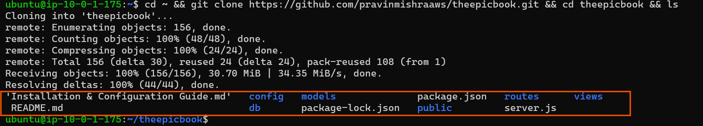

---

#### Screenshot 15 — Terminal showing the backend running, or `ss -tulpn` showing the port open

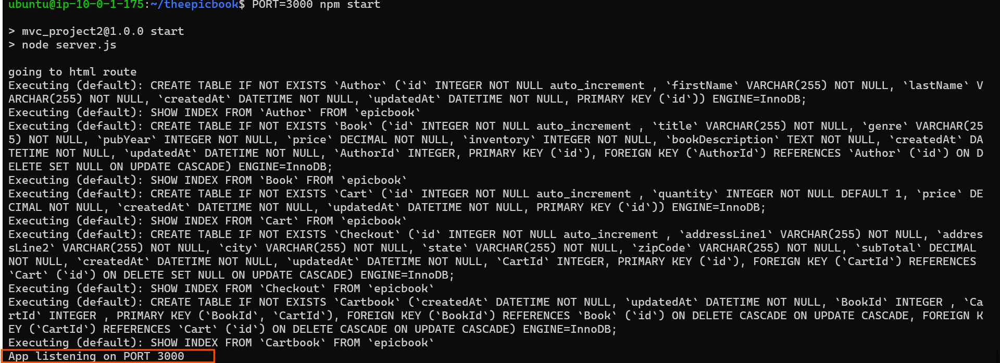

---

#### Screenshot 16 — `curl` output proving the backend responds

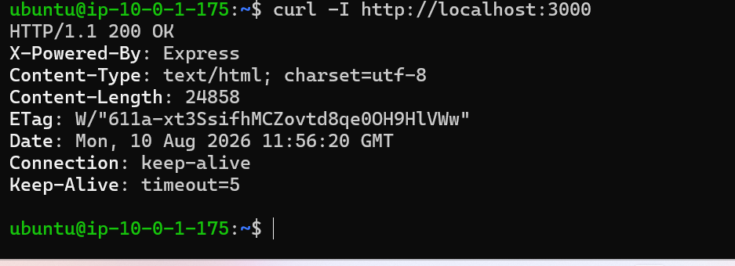

---

# Task 8 — Serve Frontend Using Nginx + Reverse Proxy to Backend

## Goal

Copy the frontend files to the Nginx web root and configure Nginx to reverse-proxy `/api/` to the Node backend.

### Evidence

#### Screenshot 17 — `nginx -t` success output

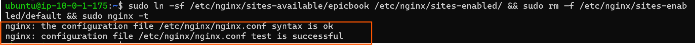

---

#### Screenshot 18 — Nginx configuration snippet showing the `/api/` reverse proxy

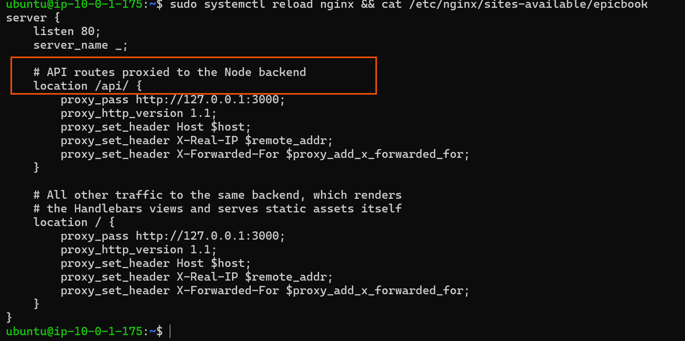

---

# Task 9 — End-to-End Testing (Frontend ↔ Backend ↔ RDS)

## Goal

Verify the frontend loads publicly, the backend responds through Nginx, and EC2 can query the private RDS database.

### Evidence

#### Screenshot 19 — Browser showing the EpicBook application loaded with the public IP visible

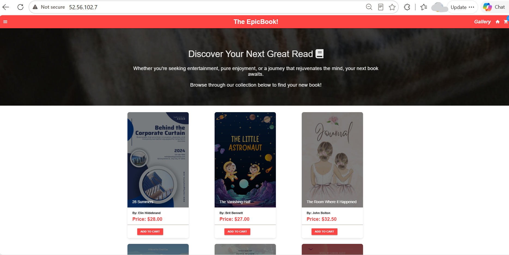

---

#### Screenshot 20 — Terminal showing a successful API call through the public endpoint

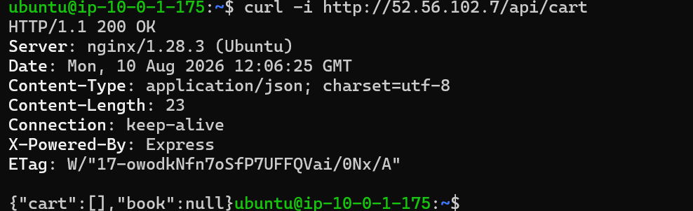

---

#### Screenshot 21 — Terminal showing a successful database connectivity test (`SELECT 1;` or similar)

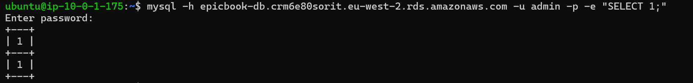

---

## Deployment notes

The brief and the actual repository disagree in four places, and following the brief literally would have produced a broken deployment. Reading the code first saved a lot of debugging.

**There is no .env support.** The task list says to create a .env file with DB_HOST, DB_USER and similar variables. The repository has no dotenv dependency and nothing loads one. Database configuration is read by models/index.js from config/config.json, keyed on NODE_ENV, so I edited the development block there instead. The only environment variable the code genuinely reads is PORT, which server.js picks up directly, so I started the app with PORT=3000 to match the port the assignment expects rather than the default of 8080.

**EpicBook is not a React application.** The brief describes copying a frontend build into the Nginx web root and proxying only /api/ to the backend. EpicBook is a server-rendered Express app using Handlebars templates, and it serves its own static assets through express.static. There is no build step and no separate frontend directory. Emptying /var/www/html and pointing Nginx at it would have served nothing, so I configured Nginx to proxy all traffic to the Node process and kept an explicit /api/ block for clarity.

**The proxy_pass trailing slash matters.** The configuration in the brief uses location /api/ with proxy_pass ending in a slash. That combination strips the location prefix, so a request for /api/cart reaches the backend as /cart, which is a Handlebars page route rather than the API. The response would have been HTML instead of JSON. Omitting the trailing slash passes the path through unchanged, which is why the API test returns JSON with both the Nginx and Express headers visible.

**The SQL dump hardcodes a different database name.** All three files in db/ open with USE bookstore and use fully qualified names such as bookstore.Author, so passing epicbook on the command line was silently overridden and the import failed with an unknown database error. Since the assignment specifies epicbook, I rewrote the dump files to match rather than creating a second database, which keeps the RDS instance consistent with both the assignment and the application config.

I also deviated on two versions. Ubuntu 20.04 is past end of standard support, so I used the current LTS AMI. Node 18 came from NodeSource because the distribution package is too old for this dependency tree, though NodeSource itself now flags 18 as unsupported and a current LTS would be the right choice for production.

One observation worth carrying into the security audit: npm install reported 45 vulnerabilities across a dependency tree last updated in 2020. Running npm audit fix --force would upgrade Sequelize and Express across major versions and break the application, which is a good illustration of why dependency risk is a lifecycle problem rather than something a single command resolves.

---

# Submission Instructions

- Add all required screenshots in your submission
- Do not expose PEM contents, passwords, `.env` values, or other secrets

---

# Completion Checklist

- [x] Task 1: VPC, public/private subnets, IGW, and public routing created (Screenshots 1–3)
- [x] Task 2: Least-privilege EC2 and RDS security groups created (Screenshots 4–5)
- [x] Task 3: Ubuntu EC2 launched in the public subnet with SSH verified (Screenshots 6–7)
- [x] Task 4: Node.js, npm, Nginx, and MySQL client installed (Screenshots 8–10)
- [x] Task 5: Private MySQL RDS created with no public access (Screenshots 11–12)
- [x] Task 6: Database initialized from the SQL dump (Screenshot 13)
- [x] Task 7: Backend deployed and responding on port 3000 (Screenshots 14–16)
- [x] Task 8: Nginx serving the frontend and reverse-proxying to the backend (Screenshots 17–18)
- [x] Task 9: Frontend, backend, and RDS verified end to end (Screenshots 19–21)
- [x] No sensitive data exposed

---

## 📌 About DMI & CloudAdvisory

DevOps Micro Internship (DMI) is a project-based DevOps program run by Pravin Mishra (The CloudAdvisory) focused on real-world execution, systems thinking, and career readiness.

It helps learners build strong DevOps foundations with hands-on experience.

---

## 📌 Resources

- 🌐 DMI Official Website: https://dmi.pravinmishra.com?utm_source=github&utm_medium=readme  
- 🎓 University: https://university.pravinmishra.com?utm_source=github&utm_medium=readme  
- 💬 Discord Community: https://discord.pravinmishra.com?utm_source=github&utm_medium=readme  
- 📝 Blog: https://dmi.pravinmishra.com/blog?utm_source=github&utm_medium=readme  
- ▶️ YouTube Playlist: https://www.youtube.com/playlist?list=PLFeSNDtI4Cho  
- 🔗 Pravin Mishra (LinkedIn): https://www.linkedin.com/in/pravin-mishra-aws-trainer/  
- 🏢 CloudAdvisory (LinkedIn): https://www.linkedin.com/company/thecloudadvisory/

---

*This submission is part of DevOps Micro Internship (DMI) Cohort 3 — Agentic AI Track.*
