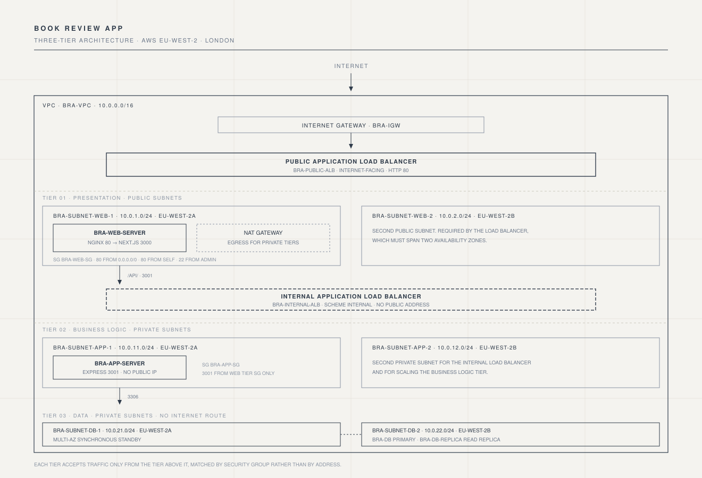
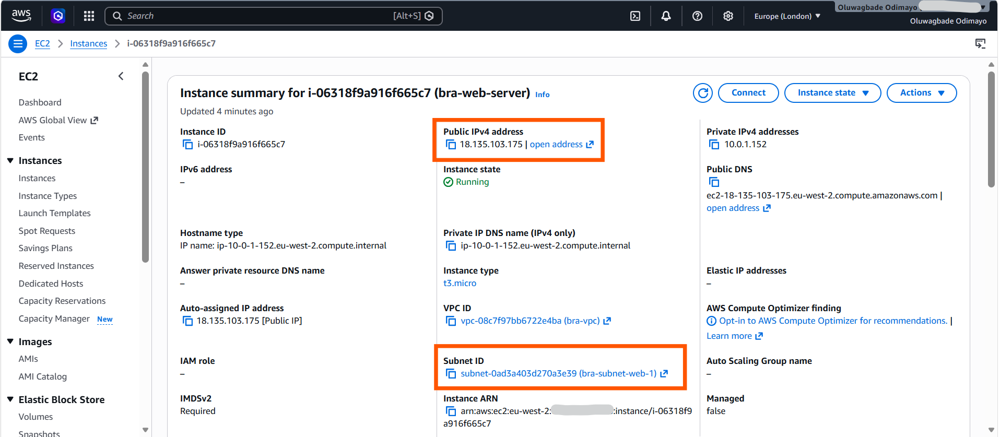
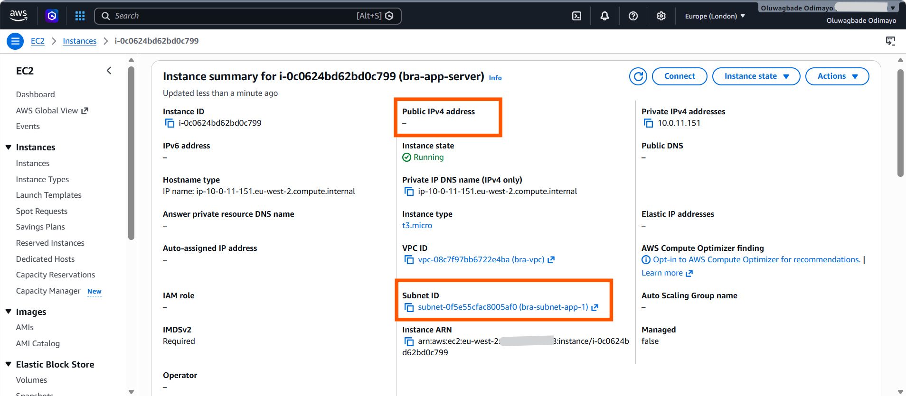
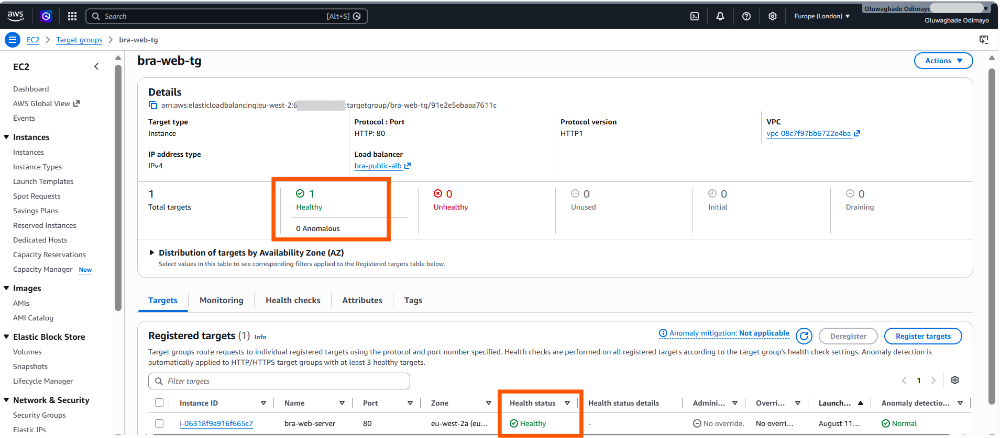
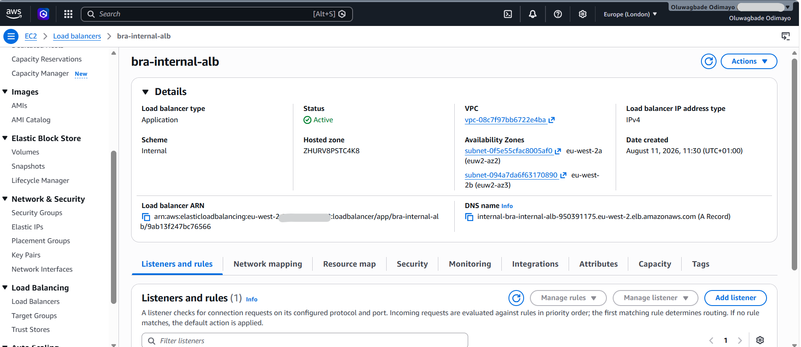
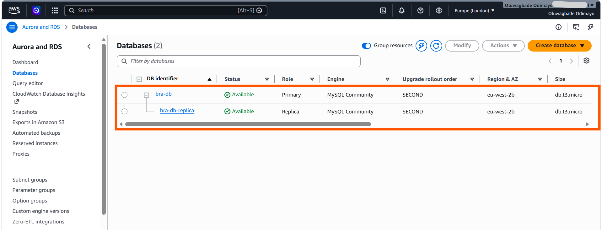
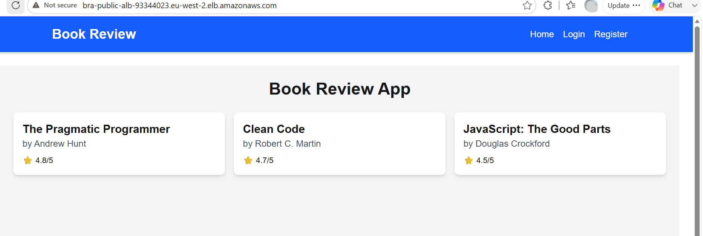
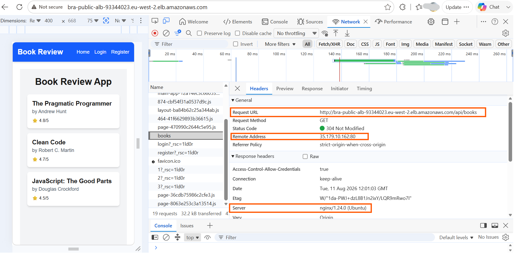
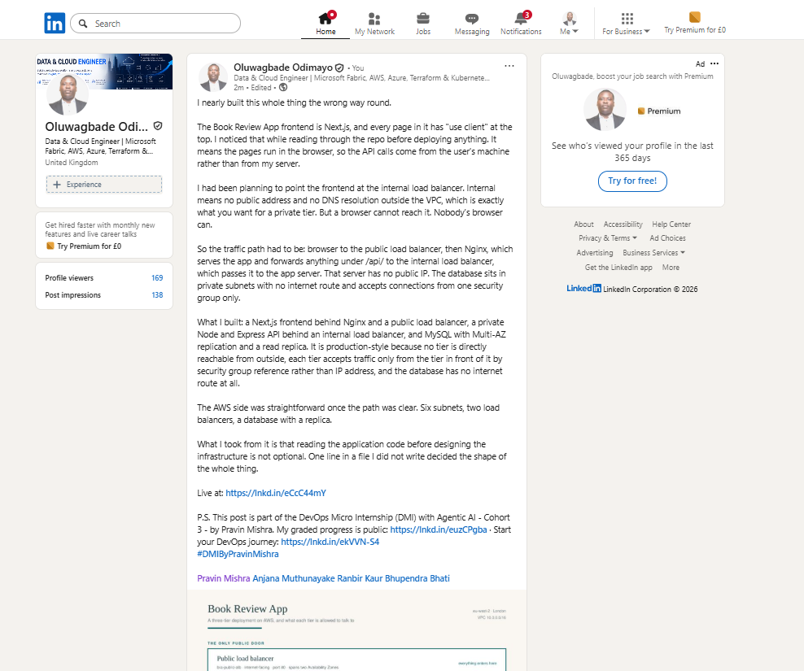

# Assignment 6 — Capstone Assignment — Deploy Book Review App (Three-Tier Architecture) on AWS

Part of the DevOps Micro Internship (DMI) Cohort 3 with Agentic AI

---

## Purpose

This is the most important assignment of the course. You will deploy the Book Review App in a fully production-style three-tier architecture on AWS: a Next.js Web Tier behind Nginx and a public ALB, a private Node.js/Express App Tier behind an internal ALB, and a private Multi-AZ MySQL RDS database with a read replica. You are expected to design, deploy, isolate, debug, and document the result independently.

---

# Task 1 — Architecture Diagram

## Goal

Create an architecture diagram showing the custom VPC (10.0.0.0/16), the six subnets across two Availability Zones (two public Web Tier, two private App Tier, two private Database Tier), the public ALB, Web Tier EC2/Nginx, internal ALB, private App Tier EC2, private Multi-AZ RDS with its read replica, and the permitted traffic flow.

### Evidence

#### Diagram image or link

---

# Task 2 — AWS Region & Services Used

## Goal

Record the AWS Region used and list every AWS service used across networking, compute, load balancing, security, and the database.

### Notes

**Region:**

`eu-west-2` (London). Chosen for proximity to reduce latency and to keep all resources in one region for simpler networking and lower data transfer cost.

---

**Services:**

**Networking:** Amazon VPC, subnets (six across two Availability Zones), Internet Gateway, NAT Gateway, route tables, Elastic IP (attached to the NAT Gateway only), Security Groups.

**Compute:** Amazon EC2 (two t3.micro instances running Ubuntu 24.04 LTS), EC2 key pairs.

**Load balancing:** Elastic Load Balancing, specifically two Application Load Balancers (one internet-facing, one internal) with their target groups and listeners.

**Database:** Amazon RDS for MySQL with Multi-AZ enabled, a read replica, and a DB subnet group spanning both private database subnets.

**Supporting services:** AWS Systems Manager Parameter Store (to resolve the current Ubuntu AMI), AWS Identity and Access Management, AWS CLI v2.

**On the instances:** Nginx as reverse proxy, Node.js 20, Next.js 15 for the web tier, Express with Sequelize for the app tier, and systemd to keep both services running.

---

# Task 3 — Public Entry Point

## Goal

Confirm the Book Review App loads through the public ALB DNS name.

### Evidence

#### Public ALB DNS

Paste your public ALB DNS name here:

`http://bra-public-alb-93344023.eu-west-2.elb.amazonaws.com`

---

# Task 4 — Evidence Screenshots

## Goal

Capture visual proof of every tier and load balancer.

### Evidence

#### Web EC2

---

#### App EC2

---

#### Public ALB

---

#### Internal ALB

---

#### RDS + Replica

---

#### App UI proof

#### Additional evidence: browser network trace confirming tier isolation

The request URL is the public load balancer, the remote address is a public AWS address, and the response carries an Nginx server header. The browser never contacts the internal load balancer, the application server, or the database, because none of them are addressable from outside the VPC.

---

# Task 5 — Summary

## Goal

Summarize what worked in the final deployment, the issues encountered and how each was fixed, and the tools or sources used to research and debug.

### Notes

**What worked:**

The three tiers came together cleanly once the traffic path was understood properly. A browser request reaches the public load balancer, which forwards to Nginx on the web server. Nginx serves the Next.js application for normal page requests and proxies anything under /api/ to the internal load balancer, which forwards to the Express backend on port 3001, which queries the Multi-AZ RDS instance over SSL. The backend created its own schema and seeded sample data on first start, so the application had real content immediately.

The isolation held under testing. The application server has no public IP address at all, the internal load balancer resolves only inside the VPC, and the database accepts connections only from the app tier security group. The browser network trace confirms this from the outside: every request the browser makes goes to the public load balancer and nothing else.

The security group chain works by group reference rather than IP range, which means it keeps working as instances are replaced. The web tier group carries both the public load balancer and the web server, so it needs a rule allowing port 80 from itself for load balancer to instance traffic. The same pattern applies to the app tier group and the internal load balancer.

---

**Issues + fixes:**

**The frontend is entirely client-rendered, which determined the build order.** Every page in the Next.js application is marked "use client", so all API calls run in the browser rather than on the server. That means NEXT_PUBLIC_API_URL has to be a hostname the browser can reach, and the internal load balancer is not one. Setting it to the internal ALB would have produced an application that worked in no environment at all. The fix was to point it at the public load balancer and have Nginx proxy /api/ onward to the internal ALB. Because Next.js bakes NEXT_PUBLIC_ variables into the JavaScript bundle at build time rather than reading them at runtime, the public load balancer had to exist before the frontend could be built.

**Nginx returned 404 on the API route immediately after a reload, then worked.** Nginx resolves upstream hostnames when its worker processes start, so a request that arrives during a reload can miss the new configuration. Retrying confirmed the path was correct. This is worth knowing beyond the assignment: a load balancer's IP addresses change over time, and Nginx will keep using stale ones unless a resolver directive is configured with the upstream held in a variable.

**The repository ships a committed .env file with working defaults.** It contained a database password and JWT_SECRET set to "mysecretkey", both publicly visible in the repository. Anyone could have forged a valid session token against a deployment that kept them. I replaced the file with real credentials and generated a random 32 byte JWT secret with openssl.

**A read replica cannot be created from a source with automated backups disabled.** My first instinct was to set backup retention to zero to save cost, which would have blocked the replica entirely. Setting retention to one day resolved it.

**Reaching the private application server needed a route in.** The app subnets have no inbound path from the internet, so I copied the key pair to the web server and connected onward from there. This works but is not good practice, since a private key now sits on an internet-facing machine. AWS Systems Manager Session Manager is the correct answer and would remove the need for SSH access and for port 22 in the security groups entirely.

**The NAT Gateway requires an Elastic IP, which sits awkwardly against the instruction to avoid Elastic IPs.** I read that rule as applying to instances, so that traffic enters through the load balancer rather than through individual servers. No EC2 instance in this build has an Elastic IP. The NAT Gateway's address is a requirement of the managed service and exists only to give the private tiers outbound access for package installation.

---

**Tools/sources used:**

AWS CLI v2 for building and inspecting every resource, which made the work repeatable and gave clearer error messages than the console in several places. AWS documentation for the read replica backup requirement and for Application Load Balancer scheme behaviour.

The application source code itself was the most useful reference. Reading frontend/src/services/api.js and frontend/src/app/page.js revealed the "use client" directive and the client-side API calls, which is what determined the entire traffic design. Reading backend/src/server.js confirmed the port and the Sequelize sync behaviour. Checking these before deploying prevented a design that would not have worked.

Claude for working through the architecture and debugging. Linux tooling on the instances: systemctl and journalctl for service state, getent for DNS resolution checks, and curl at each hop to isolate which part of the chain was failing rather than guessing.

---

# LinkedIn Post (Required)

## Goal

Publish a LinkedIn post sharing the capstone deployment, including the public ALB DNS (or a redacted screenshot), three to five lines on what you built and why it is production-style, and one proof screenshot.

## Evidence

#### LinkedIn Post URL

Paste your LinkedIn post URL here:

`https://www.linkedin.com/posts/oluwagbade-odimayo-_dmibypravinmishra-activity-7492925022974607360-bFS1`

---

#### Screenshot of LinkedIn post

---

# Submission Instructions

- Add all required screenshots and links in your submission
- Do not expose passwords, RDS credentials, connection strings, private keys, or account IDs

---

# Completion Checklist

- [x] Task 1: Architecture diagram completed
- [x] Task 2: AWS Region and services documented
- [x] Task 3: Public ALB DNS confirmed working
- [x] Task 4: All six evidence screenshots captured (Web Tier, App Tier, both ALBs, RDS + replica, app UI)
- [x] Task 5: Deployment summary completed (what worked, issues/fixes, tools/sources)
- [x] LinkedIn post published and URL submitted
- [x] App Tier and Database Tier confirmed not publicly accessible
- [x] No sensitive data exposed

---

## 📌 About DMI & CloudAdvisory

DevOps Micro Internship (DMI) is a project-based DevOps program run by Pravin Mishra (The CloudAdvisory) focused on real-world execution, systems thinking, and career readiness.

It helps learners build strong DevOps foundations with hands-on experience.

---

## 📌 Resources

- 🌐 DMI Official Website: https://dmi.pravinmishra.com?utm_source=github&utm_medium=readme  
- 🎓 University: https://university.pravinmishra.com?utm_source=github&utm_medium=readme  
- 💬 Discord Community: https://discord.pravinmishra.com?utm_source=github&utm_medium=readme  
- 📝 Blog: https://dmi.pravinmishra.com/blog?utm_source=github&utm_medium=readme  
- ▶️ YouTube Playlist: https://www.youtube.com/playlist?list=PLFeSNDtI4Cho  
- 🔗 Pravin Mishra (LinkedIn): https://www.linkedin.com/in/pravin-mishra-aws-trainer/  
- 🏢 CloudAdvisory (LinkedIn): https://www.linkedin.com/company/thecloudadvisory/

---

*This submission is part of DevOps Micro Internship (DMI) Cohort 3 — Agentic AI Track.*