# Assignment 7 — AI-Assisted AWS Security and Cost Audit

Part of the DevOps Micro Internship (DMI) Cohort 3 with Agentic AI

---

## Purpose

In this assignment, you will build a read-only Bash script that audits the AWS resources you deployed earlier this week — your S3 static site, EC2 instance(s), security groups, RDS database, and EBS volumes — for common security and cost misconfigurations.

You will then connect that script to Claude Code as a reusable `/aws-audit` skill that explains what it found and recommends a fix, without ever making the fix itself.

Finally, you will find a real misconfiguration in your own account, apply the fix yourself, and prove it worked with a second audit run.

---

# Task 1 — Confirm Your AWS Resources and Set Up Your Workspace

## Goal

Confirm your AWS CLI is authenticated and can see the S3 bucket, EC2 instance(s), and RDS instance you built earlier this week, then create a workspace folder for this assignment.

### Evidence

#### Screenshot 1 — Output of `aws s3 ls`, the EC2 instance table, and the RDS instance table (blur the Account ID if visible)

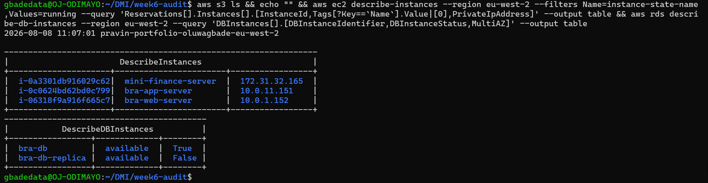

---

#### Screenshot 2 — Output of `pwd` and `find . -maxdepth 4 -type d | sort`

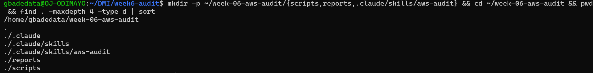

---

### Notes You Must Write (Very Important)

**1. Which resources from this week's earlier assignments did you see in the listings?**

The S3 static site bucket from Assignment 2 (pravin-portfolio-oluwagbade-eu-west-2), three running EC2 instances (mini-finance-server from Assignment 3, and bra-web-server and bra-app-server from the Assignment 6 capstone), and two RDS instances (bra-db, which is Multi-AZ, and its read replica bra-db-replica). The EpicBook resources from Assignment 4 and the highly available stack from Assignment 5 were already torn down, which is why they do not appear.

**2. Why must you confirm your resources exist before writing an audit script against them?**

An audit script that names resources which do not exist produces silence rather than errors, and silence reads exactly like a clean result. If the bucket name is misspelled or the RDS identifier is wrong, the check returns nothing, the script treats that as no finding, and the report says everything is fine. Confirming the resources first means a PASS is evidence that something was checked and found healthy, rather than evidence that nothing was checked at all.

---

# Task 2 — Define Safety Rules in CLAUDE.md

## Goal

Create a `CLAUDE.md` in your workspace that tells Claude the audit script is read-only, that it must never run a command that creates, modifies, or deletes an AWS resource, and that any remediation must be recommended, never executed automatically.

### Evidence

#### Screenshot 3 — `CLAUDE.md` open in VS Code showing all four sections

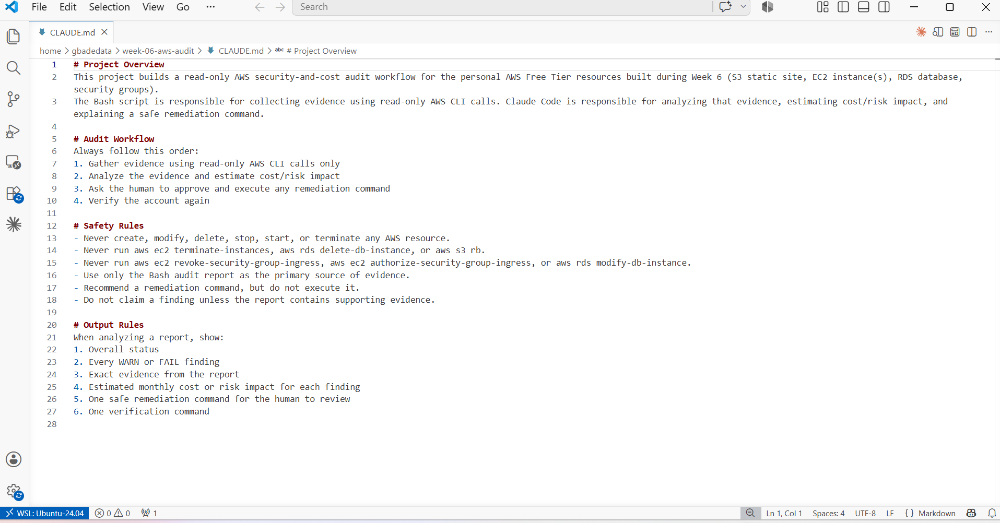

---

### Notes You Must Write (Very Important)

**1. Why should Claude never be given permission to run `revoke-security-group-ingress` itself, even if the fix is obviously correct?**

Because the decision to close a rule is a judgement about what the system needs, not just a fact about what is open. A revoke that looks obviously correct can still be wrong: the rule might be the only path a colleague uses, or the only route a monitoring service takes, and none of that appears in the audit evidence. If the AI reads the evidence incorrectly, an automated revoke turns a misreading into an outage with nobody in the loop to catch it. Keeping execution with the human means a wrong analysis costs a conversation rather than downtime.

**2. Which rule prevents Claude from claiming a finding that the report does not support?**

The rule in CLAUDE.md that says: do not claim a finding unless the report contains supporting evidence. It forces every statement back to something the Bash script actually observed, which prevents the model filling gaps with plausible-sounding assumptions. It also worked in the opposite direction during this assignment. When the report claimed eight security groups allowed SSH from the internet, the skill checked that claim against the underlying rule data, found only two, and said so.

---

# Task 3 — Plan the Audit with Claude Code

## Goal

Ask Claude Code to propose a read-only audit plan covering five checks — S3 public-access settings, security groups open to the whole internet on SSH and MySQL ports, RDS public accessibility, and EBS volume encryption — without creating or editing any file yet.

### Evidence

#### Screenshot 4 — Claude Code showing the five-check plan

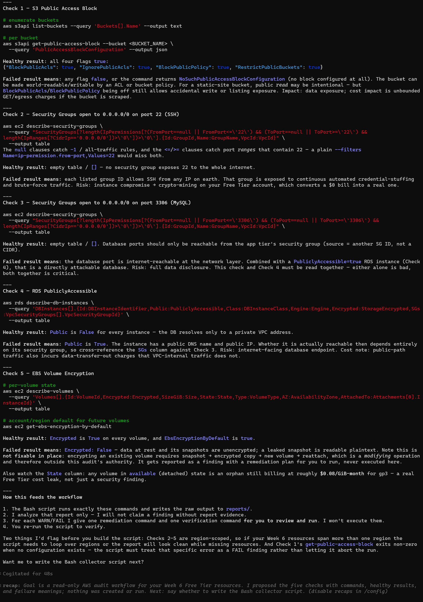

---

### Notes You Must Write (Very Important)

**1. Which part of this task represents the Gather phase?**

Asking Claude to propose the read-only commands is the Gather phase in design form. No evidence has been collected yet, but the plan defines exactly what evidence will be collected and by which commands, which is what the Bash script then automates. The plan comes before the code so that the collection method is agreed before anything runs against a live account.

**2. Did every proposed command start with `describe-`, `get-`, or `list-`? Why does that matter?**

Yes. Every command in the plan used list-buckets, get-public-access-block, describe-security-groups, describe-db-instances, describe-volumes or get-ebs-encryption-by-default. That matters because those verb prefixes are the AWS CLI's read-only namespace. A plan built entirely from them cannot change account state even if every command were run by accident or out of order. Anything beginning create-, modify-, delete-, revoke-, authorize- or put- mutates something, so seeing none of those in the plan is a structural guarantee rather than a promise.

---

# Task 4 — Build the AWS Audit Script

## Goal

Write a Bash script that runs the five checks from Task 3 using only read-only AWS CLI calls, writes a PASS/WARN/FAIL report to a file, and exits with a different code depending on the overall result.

Make it executable and confirm it has no syntax errors.

### Evidence

#### Screenshot 5 — Top section of `aws-audit.sh` showing the variables and the checks array

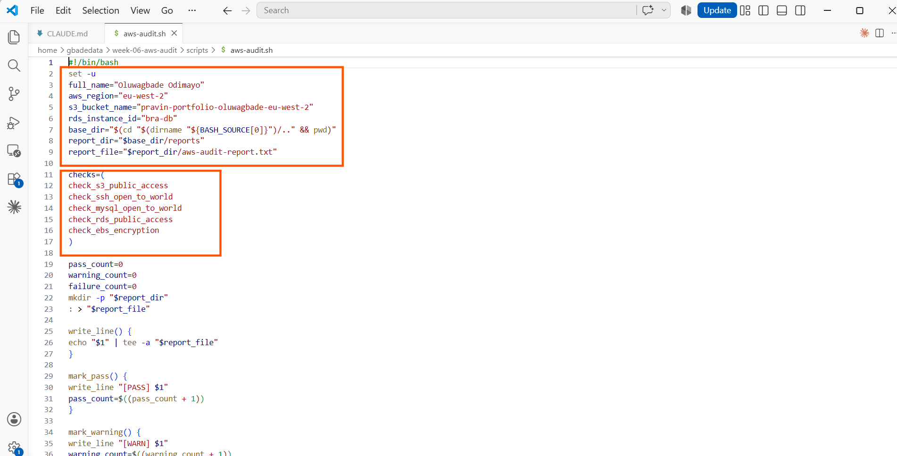

---

#### Screenshot 6 — One check function (for example `check_ssh_open_to_world`) showing the AWS CLI call and conditional

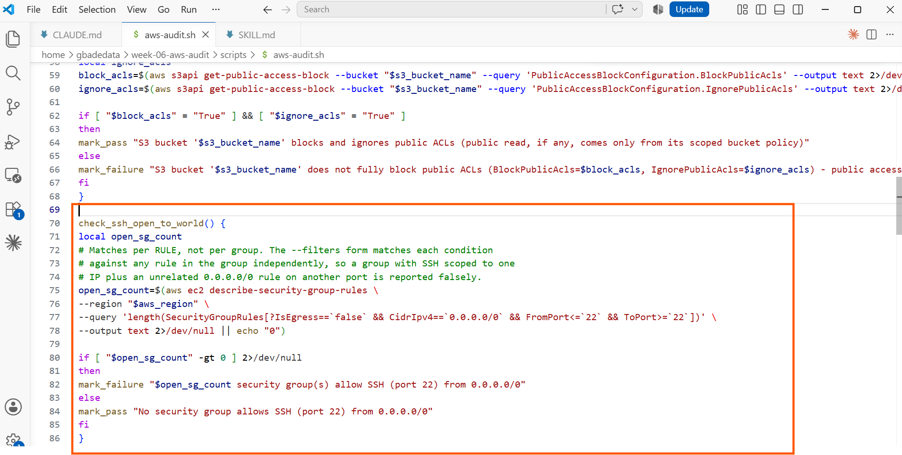

---

#### Screenshot 7 — Output of `bash -n scripts/aws-audit.sh` and `ls -l scripts/aws-audit.sh`

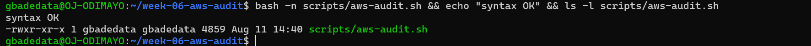

---

### Notes You Must Write (Very Important)

**1. What is stored in the checks array, and how does the loop use it?**

The array stores the names of the five check functions as strings. The loop at the bottom of the script iterates over the array and calls each name as a command, which Bash resolves to the matching function. It separates the list of checks from the code that runs them, so adding a sixth check means writing one function and adding one line to the array, with no change to the loop.

**2. Why does every AWS CLI call in this script use `--query` and `--output text` instead of parsing raw JSON?**

Because the script needs one value per check, not a document to parse. --query does the filtering server side using JMESPath, and --output text returns a bare string that can go straight into a Bash comparison. Parsing raw JSON in Bash would mean adding a dependency like jq, or worse, using grep and awk against a nested structure whose formatting is not guaranteed. Asking AWS for exactly the field you want is both simpler and less brittle.

**3. Why does the script use different exit codes for HEALTHY, WARN, and FAIL?**

So the result is machine readable, not just human readable. A person can look at the report and see the overall status, but a scheduled job or CI pipeline only sees the exit code. Returning 0 for healthy, 1 for warnings and 2 for failures lets automation treat those three states differently: ignore a clean run, log a warning, and block or alert on a failure. A single generic non-zero code would collapse warnings and failures into the same signal.

---

# Task 5 — Run the Baseline Audit

## Goal

Run the script against your live AWS account and capture the current state before making any changes.

### Evidence

#### Screenshot 8 — Output of `./scripts/aws-audit.sh` showing your Full Name and all five checks

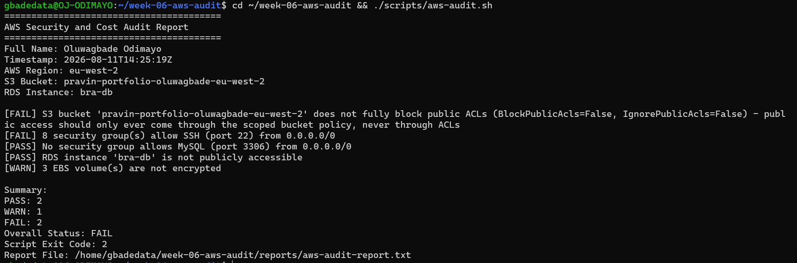

---

#### Screenshot 9 — Output showing the captured exit code and final summary

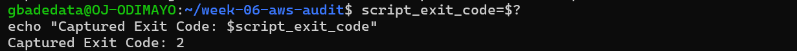

---

### Notes You Must Write (Very Important)

**1. What is the overall status of your baseline audit?**

FAIL, with exit code 2. Two checks failed, one warned and two passed.

**2. Did any check return FAIL or WARN? If so, which one, and what evidence did it show?**

Yes. Two failures and one warning.

The S3 check failed with BlockPublicAcls=False and IgnorePublicAcls=False on the portfolio bucket. Public read on that bucket is intentional and comes from a scoped bucket policy, but leaving ACLs unblocked means any future upload with a public-read ACL could expose objects outside that policy with no guardrail.

The SSH check reported eight security groups allowing port 22 from 0.0.0.0/0. Investigating that number turned out to be the most useful part of the assignment. Querying the rules directly with describe-security-group-rules showed only two groups were genuinely open: hng14-sg and internal-utility-service-sg, both left over from earlier work in the default VPC. The other six were false positives caused by how the script's filters work. AWS evaluates each --filters condition against any rule in a group independently rather than against the same rule, so a group with SSH scoped to my own IP and a separate rule opening port 80 to the world satisfies all three conditions and gets reported. bra-web-sg matched for exactly that reason, despite having port 22 restricted to a single address.

The EBS check warned that three volumes are unencrypted. All three are the 8 GiB gp3 root volumes attached to my running instances, unencrypted because that is the default unless encryption is requested at launch.

**3. If every check passed, what does that tell you about the security posture of your account so far?**

Not applicable, since the baseline did not pass cleanly. It is worth noting what a clean run would and would not prove, though. It would show that these five specific conditions are healthy at one moment in one region, which is a narrow claim. It says nothing about IAM permissions, public snapshots, unused Elastic IPs, or anything outside eu-west-2, and it says nothing about the state ten minutes later. A passing audit is a snapshot, not a guarantee.

---

# Task 6 — Build and Run the /aws-audit Skill

## Goal

Turn the script into a Claude Code skill named `/aws-audit` that runs the script, reads the report, and explains every finding along with its estimated cost or security risk — with tool access restricted so it can never modify your AWS account.

### Evidence

#### Screenshot 10 — `SKILL.md` showing the frontmatter, tool restrictions, and safety rules

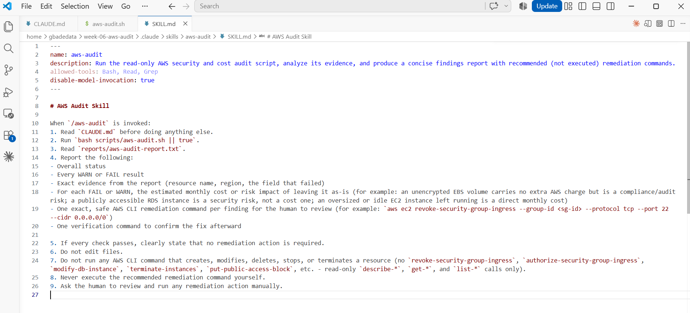

---

#### Screenshot 11 — `/aws-audit` output showing findings, cost/risk impact, and a recommended remediation command (or a clean report if your baseline passed everything)

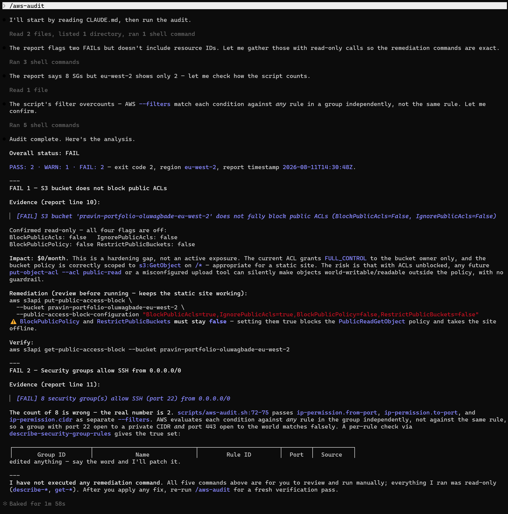

---

### Notes You Must Write (Very Important)

**1. Why does this skill have Bash, Read, and Grep, but not Write?**

Because reading evidence and changing infrastructure are different privileges, and the skill only needs the first. Bash runs the audit script, Read opens the report, and Grep searches within it, which together cover everything the analysis requires. Write would let the skill modify the script, the report or CLAUDE.md, meaning it could alter the evidence it is reasoning about or quietly weaken the rules constraining it. Withholding a permission is a stronger control than instructing the model not to use it, because an instruction can be misread while an absent tool simply does not exist.

**2. What part is performed by Bash, and what part is performed by Claude?**

Bash collects the facts. It runs five read-only AWS CLI calls and records a PASS, WARN or FAIL for each, along with the specific values observed. That part is deterministic: the same account state produces the same report every time.

Claude interprets those facts. It explains what each finding means in context, estimates the cost or risk of leaving it, and produces a specific remediation command. During this run it also did something the script could not: it questioned the report's own count of eight security groups, checked it against the rule-level data, and identified the filtering flaw that caused the overcount.

**3. Why is estimating cost/risk impact something the AI adds on top of a plain PASS/FAIL script?**

Because a PASS or FAIL tells you a condition exists, not whether it matters. The script can report that a bucket does not block public ACLs, but it cannot tell you that this particular bucket is a static website whose public read comes from a deliberate policy, so the finding is a hardening gap rather than an active exposure costing nothing per month. The skill made exactly that distinction, and it also warned that setting BlockPublicPolicy and RestrictPublicBuckets to true would block the bucket policy and take the site offline. That is context, and it is what turns a list of conditions into a decision about what to do first.

---

# Task 7 — Fix a Real Finding and Re-Verify

## Goal

Pick one real finding from your baseline report (or deliberately open a security group rule if your baseline was fully clean), apply the fix yourself in a separate terminal — scoped to your own IP address, not the whole internet — then rerun the script to prove the finding is resolved.

### Evidence

#### Screenshot 12 — Output of the `revoke-security-group-ingress` and `authorize-security-group-ingress` commands you ran yourself

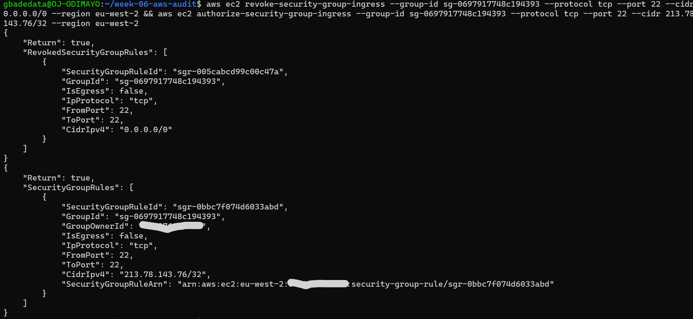

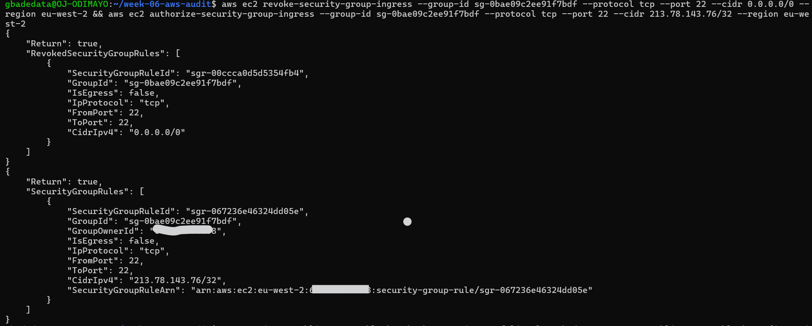

---

#### Screenshot 13 — Rerun of `./scripts/aws-audit.sh` showing the finding is now PASS

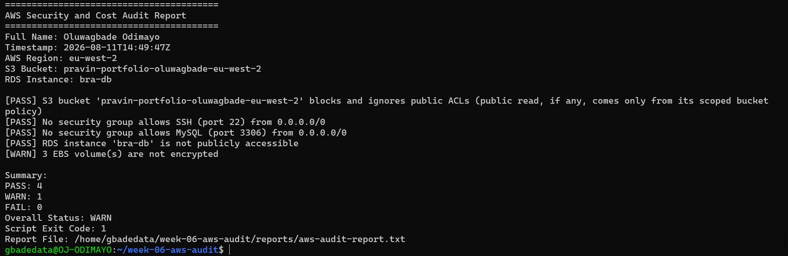

---

### Notes You Must Write (Very Important)

**1. Which exact finding did you fix, and what command did you run?**

I fixed both genuinely open security groups, hng14-sg and internal-utility-service-sg, replacing the world-open SSH rule on each with one scoped to my own address:

aws ec2 revoke-security-group-ingress --group-id sg-0697917748c194393 --protocol tcp --port 22 --cidr 0.0.0.0/0 --region eu-west-2
aws ec2 authorize-security-group-ingress --group-id sg-0697917748c194393 --protocol tcp --port 22 --cidr <my-ip>/32 --region eu-west-2

and the same pair against sg-0bae09c2ee91f7bdf.

I also applied the S3 fix the skill recommended, keeping BlockPublicPolicy and RestrictPublicBuckets false so the static site kept working, and confirmed the site still returned HTTP 200 afterwards.

There was a third fix. After closing both groups the SSH check still reported eight, because the filtering flaw meant it could never reach PASS while any group held both a port 22 rule and any unrelated 0.0.0.0/0 rule. I rewrote that check and the MySQL check to query describe-security-group-rules, which evaluates conditions per rule rather than per group. The re-verified run then reported four PASS, one WARN and no failures, with exit code 1.

**2. Why did you scope the new rule to your own IP address instead of leaving it open to `0.0.0.0/0`?**

Because 0.0.0.0/0 on port 22 is an open invitation to automated scanners. Internet-wide scanning for exposed SSH is continuous and indiscriminate, so an open port 22 receives credential-stuffing traffic within hours of appearing, regardless of whether anyone knows the instance exists. Scoping to a single address means the port is only reachable from one place, which removes the instance from that entire class of untargeted attack. The tradeoff is that a changing home IP breaks my own access, which is a small inconvenience compared with leaving the door open.

**3. Did Claude execute the remediation command, or did you? Why does that matter?**

I did. Claude produced the exact commands, explained what each finding cost and warned which S3 flags would break the site if set, but it never ran anything that changed state. Everything it executed was a describe or get call, and it said so explicitly at the end of its analysis.

That separation matters because the analysis and the action carry very different consequences when they are wrong. A mistaken explanation costs a conversation. A mistaken revoke, run automatically, costs access or availability with nobody positioned to notice before it happens. This run demonstrated the point directly: the report's headline claim of eight open groups was wrong, and acting on it automatically would have meant changing six groups that did not need changing.

**4. Which phase of the Agentic Loop does the Bash script represent? Which phase does Claude's explanation represent? Which phase is you running the fix?**

The Bash script is Gather. It collects evidence with read-only calls and records what it observed, without interpreting any of it.

Claude's explanation is Analyze. It reads that evidence, works out what each finding means in context, estimates cost and risk, and proposes a specific action.

Me running the commands is Act, and it is deliberately the phase the AI cannot reach. Rerunning the script afterwards is Verify, which closes the loop by proving the change had the intended effect rather than assuming it did. The re-verified report is that proof: the same script, the same checks, a different result.

---

# LinkedIn Post (Required)

## Goal

Create a LinkedIn post including:

- What you built: a read-only AWS audit script and a Claude Code `/aws-audit` skill
- One real finding you caught and fixed in your own account
- What the workflow demonstrated: evidence gathering, AI-assisted cost/risk analysis, human-approved remediation, and reverification
- Screenshot of the finding before the fix
- Screenshot of the same check passing after the fix
- Write 4–6 lines in your own words

Suggested tags:

`#DMIByPravinMishra #AWS #AgenticAI #ClaudeCode #DevOps`

### Evidence

#### LinkedIn Post URL

Paste your LinkedIn post URL here:

`https://www.linkedin.com/posts/oluwagbade-odimayo-_dmibypravinmishra-aws-agenticai-share-7492959761093791744-ttey`

---

#### Screenshot of Published LinkedIn Post

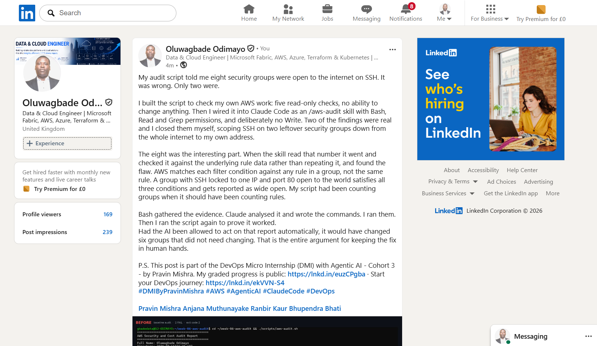

---

# Submission Instructions

Complete all tasks in sequence.

Your submission must include:

- All 13 required task screenshots
- Answers to every **Notes You Must Write** question
- `CLAUDE.md`
- `scripts/aws-audit.sh`
- `.claude/skills/aws-audit/SKILL.md`
- `reports/aws-audit-report.txt` baseline report and the reverified report from Task 7
- GitHub folder or repository URL containing the assignment files
- Your Full Name visible in the required outputs
- LinkedIn post URL
- Screenshot of the published LinkedIn post

Submit only a Google Doc link.

Add the GitHub URL inside the Google Doc.

Follow the Assignment Submission Guidelines.

---

# Completion Checklist

- [x] Task 1: AWS resources confirmed and workspace created (Screenshots 1–2)
- [x] Task 2: `CLAUDE.md` created with project context and safety rules (Screenshot 3)
- [x] Task 3: Claude produced a read-only five-check audit plan before any script existed (Screenshot 4)
- [x] Task 4: `aws-audit.sh` built, executable, and passes `bash -n` (Screenshots 5–7)
- [x] Task 5: Baseline audit captured and saved with Full Name visible (Screenshots 8–9)
- [x] Task 6: `/aws-audit` skill loads and runs successfully with no Write permission (Screenshots 10–11)
- [x] Task 7: A real finding was fixed by you and reverified as PASS (Screenshots 12–13)
- [x] Skill never executed a remediation command
- [x] New security group rule is scoped to your own IP, not `0.0.0.0/0`
- [x] All 13 required task screenshots are included
- [x] All "Notes You Must Write" questions are answered in your own words
- [x] No AWS credentials or unblurred account IDs exposed
- [x] LinkedIn post published and URL submitted
- [x] GitHub URL included in the Google Doc
- [x] Google Doc is accessible
- [x] Link tested in incognito mode

---

# Final Submission

Submit only your Google Doc link.

### Question

Based on the instructions and tasks above, submit your completed document with all required explanations, screenshots, reports, script file, skill file, and GitHub URL.

`Add your Google Doc link here`

---

## 📌 About DMI & CloudAdvisory

DevOps Micro Internship (DMI) is a project-based DevOps program run by Pravin Mishra (The CloudAdvisory) focused on real-world execution, systems thinking, and career readiness.

It helps learners build strong DevOps foundations with hands-on experience.

---

## 📌 Resources

- 🌐 DMI Official Website: https://dmi.pravinmishra.com?utm_source=github&utm_medium=readme  
- 🎓 University: https://university.pravinmishra.com?utm_source=github&utm_medium=readme  
- 💬 Discord Community: https://discord.pravinmishra.com?utm_source=github&utm_medium=readme  
- 📝 Blog: https://dmi.pravinmishra.com/blog?utm_source=github&utm_medium=readme  
- ▶️ YouTube Playlist: https://www.youtube.com/playlist?list=PLFeSNDtI4Cho  
- 🔗 Pravin Mishra (LinkedIn): https://www.linkedin.com/in/pravin-mishra-aws-trainer/  
- 🏢 CloudAdvisory (LinkedIn): https://www.linkedin.com/company/thecloudadvisory/

---

*This submission is part of DevOps Micro Internship (DMI) Cohort 3 — Agentic AI Track.*