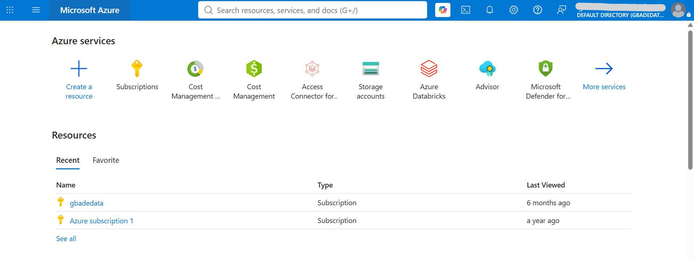
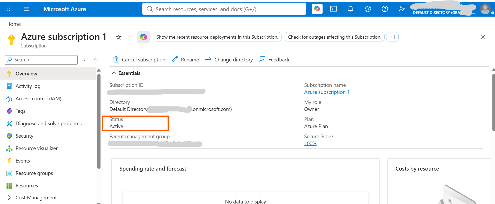

# Assignment 1 — Create and Set Up Your Azure Free Account

Part of the DevOps Micro Internship (DMI) Cohort 3 with Agentic AI

---

## Purpose

In this assignment, you will set up a fully functional Microsoft Azure Free Account so you are ready to start cloud-based assignments and hands-on labs. You will complete identity and payment verification, accept the required terms, sign in to the Azure Portal, and confirm the Free Trial subscription is available.

---

# Task 1 — 4 Create and Set Up Your Azure Free Account

## Goal

Complete the Azure Free Account registration process, including Microsoft account sign-in, personal details, identity and phone verification, payment verification, and acceptance of the required terms.

> No screenshot required for this task. Do not capture payment-card details. Completion is verified through Task 2.

---

# Task 5 — Access and Explore the Azure Portal

## Goal

Confirm successful Azure Portal access and Locate the required services and subscription.

### Evidence

#### Screenshot 1 — Azure Portal homepage after successful login

---

#### Screenshot 2 — "Subscriptions" section showing the "Free Trial" subscription

**Note on subscription type:** This task asks for a Free Trial subscription. The Azure free account is limited to one per customer, and this account has previously held an Azure subscription, so the free offer is no longer available to it. Microsoft's documented guidance for that situation, which the course solution document for this assignment also cites, is to use a pay-as-you-go subscription instead. The screenshot shows the subscription is Active and running under an Azure Plan, with my role as Owner. The subscription ID, directory name and parent management group ID are redacted.

---

### Notes

Write a three-to-four-line paragraph explaining which Azure services you plan to explore first and why.

I plan to start with Virtual Machines and Virtual Networks, because every other service this week sits on top of them. Coming from AWS, I want to see exactly how Resource Groups and Network Security Groups differ from tagging and security groups, since that mapping is where most of my early mistakes are likely to come from. After that, Azure Database for MySQL Flexible Server and Storage Accounts, as those cover the managed database and static hosting patterns the later assignments depend on. Cost Management is the one I will keep open throughout, since I am running on a pay-as-you-go subscription rather than free credits.

---

# Submission Instructions

- Add all required screenshots in your submission
- Do not expose payment-card details, phone numbers, or other sensitive account information

---

# Completion Checklist

- [ ] Azure Free Account created with identity, phone, and payment verification completed
- [ ] Microsoft Agreement and Offer Terms accepted
- [ ] Azure Portal accessed successfully (Screenshot 1)
- [ ] Free Trial subscription confirmed (Screenshot 2)
- [ ] Reflection paragraph written (Notes)
- [ ] No sensitive information exposed

---

## 📌 About DMI & CloudAdvisory

DevOps Micro Internship (DMI) is a project-based DevOps program run by Pravin Mishra (The CloudAdvisory) focused on real-world execution, systems thinking, and career readiness.

It helps learners build strong DevOps foundations with hands-on experience.

---

## 📌 Resources

- 🌐 DMI Official Website: https://dmi.pravinmishra.com?utm_source=github&utm_medium=readme  
- 🎓 University: https://university.pravinmishra.com?utm_source=github&utm_medium=readme  
- 💬 Discord Community: https://discord.pravinmishra.com?utm_source=github&utm_medium=readme  
- 📝 Blog: https://dmi.pravinmishra.com/blog?utm_source=github&utm_medium=readme  
- ▶️ YouTube Playlist: https://www.youtube.com/playlist?list=PLFeSNDtI4Cho  
- 🔗 Pravin Mishra (LinkedIn): https://www.linkedin.com/in/pravin-mishra-aws-trainer/  
- 🏢 CloudAdvisory (LinkedIn): https://www.linkedin.com/company/thecloudadvisory/

---

*This submission is part of DevOps Micro Internship (DMI) Cohort 3 — Agentic AI Track.*
