# Assignment 2 — Deploy a React App on an Azure VM (Ubuntu + Nginx)

Part of the DevOps Micro Internship (DMI) Cohort 3 with Agentic AI

---

## Purpose

In this assignment, you will provision a secure Ubuntu virtual machine in Microsoft Azure, build the `my-react-app` React application, and serve the production static build through Nginx. You will validate the deployment from the VM's public IP.

---

# Task 1 — Create a Resource Group

## Goal

Create the Azure Resource Group `react-app-rg` in a region close to you.

### Evidence

#### Screenshot 1 — Resource Group overview showing the name and region

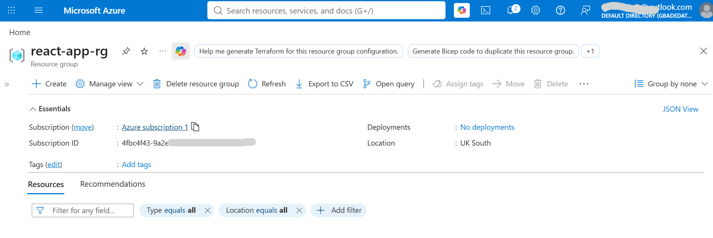

---

# Task 2 — Provision Ubuntu VM (20.04) with Correct Networking

## Goal

Create an Ubuntu 20.04 LTS VM (size B1s) with a Network Security Group allowing SSH (22, restricted to your IP where possible) and HTTP (80).

### Evidence

#### Screenshot 2 — Azure VM overview page showing the VM name, Resource Group, and region

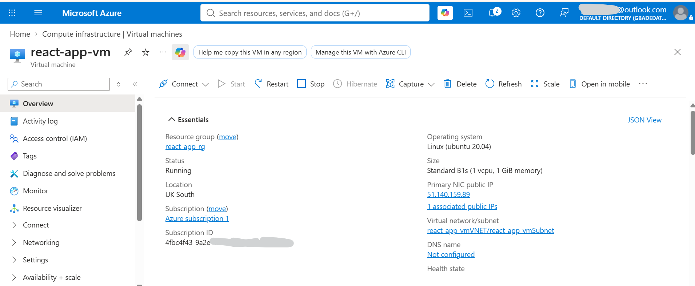

---

#### Screenshot 3 — Network Security Group inbound rules showing ports 22 and 80 allowed

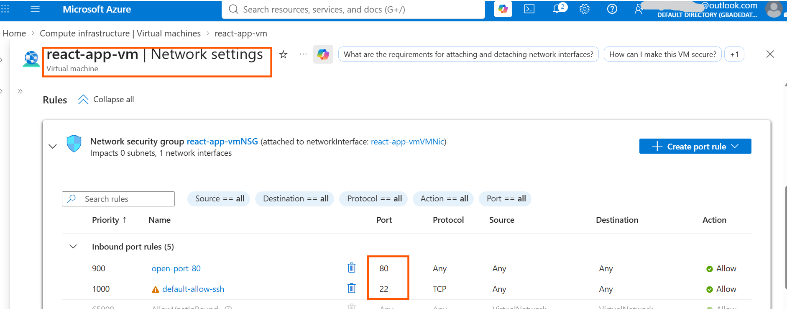

---

# Task 3 — SSH into the Azure VM

## Goal

Connect to the VM over SSH and confirm the Linux prompt is visible.

### Evidence

#### Screenshot 4 — Terminal showing a successful SSH login with the prompt visible

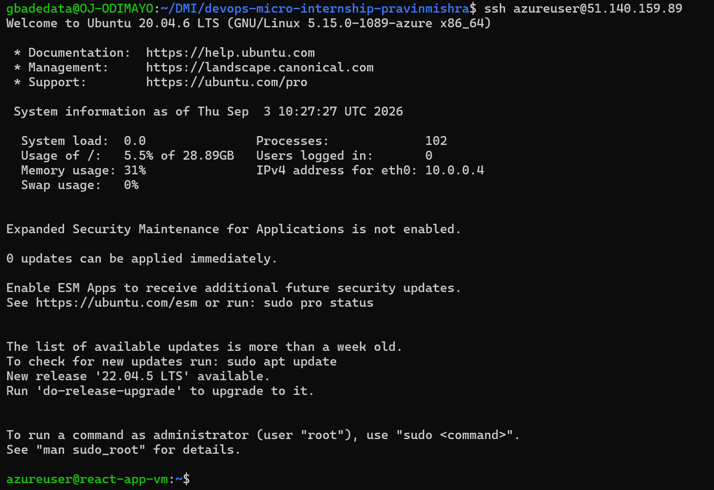

---

# Task 4 — Update OS and Install Prerequisites (Git, Node.js, npm)

## Goal

Update Ubuntu and install Git, Node.js, and npm.

### Evidence

#### Screenshot 5 — Terminal output showing `node -v` and `npm -v`

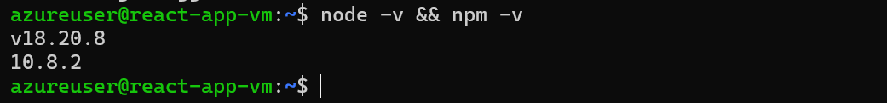

---

# Task 5 — Clone and Build the React App

## Goal

Clone `my-react-app`, install dependencies, and run `npm run build` to produce the `build/` directory.

### Evidence

#### Screenshot 6 — Terminal showing successful `npm run build` completion and `ls -la build` output

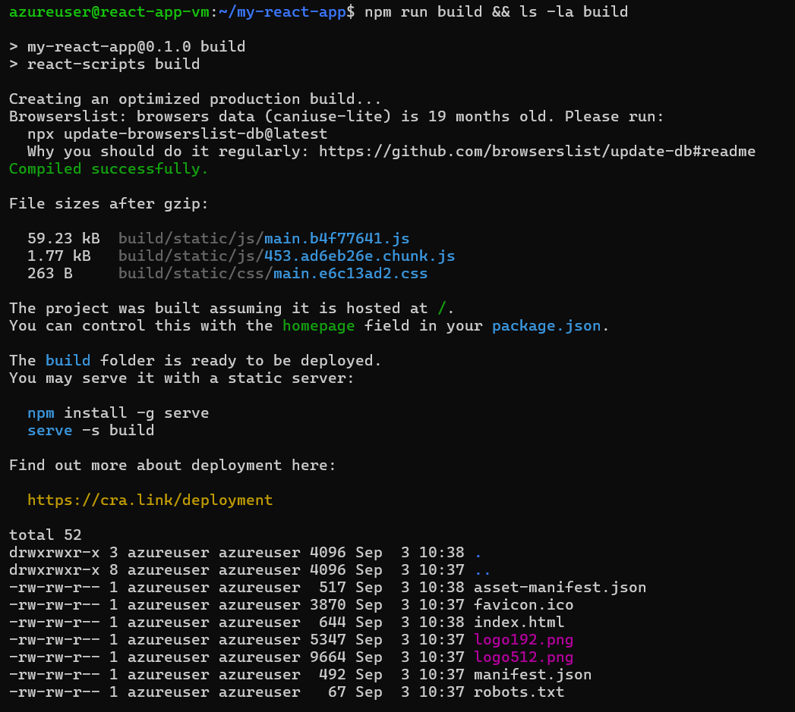

---

# Task 6 — Install and Configure Nginx to Serve the React Build

## Goal

Install Nginx and configure it to serve the `build/` directory with `try_files $uri /index.html;` for SPA routing support.

### Evidence

#### Screenshot 7 — Successful `sudo nginx -t` output

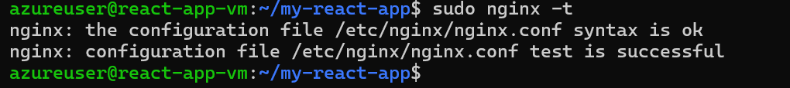

---

#### Screenshot 8 — Nginx configuration snippet showing the build root and `try_files` directive

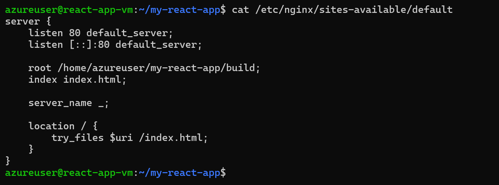

---

# Task 7 — Test the Deployment (Public IP)

## Goal

Confirm the React app loads through the VM's public IP, navigation works, and a nested route still works after a page refresh.

### Evidence

#### Screenshot 9 — Browser showing the React app with the public IP visible in the address bar

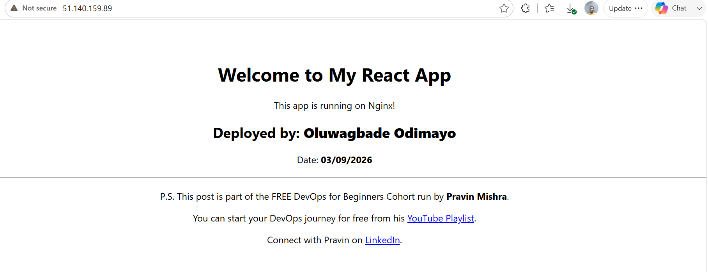

**SPA routing verification:** This app has no client-side router, so there are no nested links to click. Requesting a path directly tests the same behaviour that the `try_files $uri /index.html;` directive exists for. The screenshot below shows `/test-route` returning the application rather than a 404, which confirms Nginx falls back to `index.html` instead of looking for a file that does not exist.

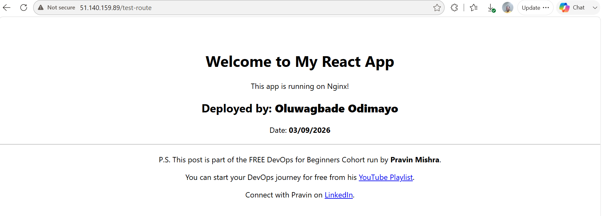

---

# Task 8 — Basic Hardening (Recommended)

## Goal

Restrict the SSH Network Security Group rule to your IP if not already restricted, and confirm the firewall does not block port 80.

### Evidence

#### Screenshot 10 (optional) — Network Security Group rule showing SSH restricted to your IP

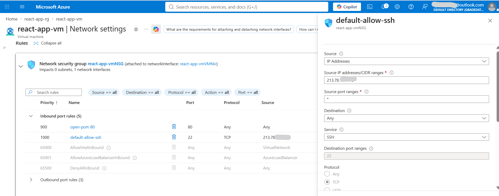

**Firewall check:** `sudo ufw status` on the VM returns `Status: inactive`, so nothing at the OS level blocks port 80. Inbound traffic is controlled entirely by the Network Security Group, where port 80 stays open to the internet and port 22 is now limited to a single source address.

**Note on the Ubuntu 20.04 image:** Canonical no longer lists plain Ubuntu Server 20.04 LTS in the Azure Portal Marketplace gallery. Searching there returns only Ubuntu Pro 20.04, which is a metered paid image, alongside third-party republished images from other publishers. The free Canonical image is still present in the platform and was confirmed with `az vm image list-skus --location uksouth --publisher Canonical --offer 0001-com-ubuntu-server-focal`, which returns `20_04-lts` and `20_04-lts-gen2`. `az vm image show` reported `"plan": null` for that URN, confirming no licence charge. The VM was therefore created by referencing the image URN directly rather than selecting it from the portal gallery, and `lsb_release -d` on the running VM reports `Ubuntu 20.04.6 LTS` as required.

---

# Submission Instructions

- Add all required screenshots in your submission
- Do not expose SSH private keys, passwords, or Azure account information

---

# Completion Checklist

- [ ] Task 1: Resource Group created (Screenshot 1)
- [ ] Task 2: Ubuntu VM provisioned with correct NSG rules (Screenshots 2 & 3)
- [ ] Task 3: SSH access verified (Screenshot 4)
- [ ] Task 4: Git, Node.js, and npm installed (Screenshot 5)
- [ ] Task 5: React app built successfully (Screenshot 6)
- [ ] Task 6: Nginx configured with SPA routing support (Screenshots 7 & 8)
- [ ] Task 7: App verified via the VM public IP, including route refresh (Screenshot 9)
- [ ] Task 8: SSH hardening applied (Screenshot 10, optional)
- [ ] No sensitive data exposed

---

## 📌 About DMI & CloudAdvisory

DevOps Micro Internship (DMI) is a project-based DevOps program run by Pravin Mishra (The CloudAdvisory) focused on real-world execution, systems thinking, and career readiness.

It helps learners build strong DevOps foundations with hands-on experience.

---

## 📌 Resources

- 🌐 DMI Official Website: https://dmi.pravinmishra.com?utm_source=github&utm_medium=readme  
- 🎓 University: https://university.pravinmishra.com?utm_source=github&utm_medium=readme  
- 💬 Discord Community: https://discord.pravinmishra.com?utm_source=github&utm_medium=readme  
- 📝 Blog: https://dmi.pravinmishra.com/blog?utm_source=github&utm_medium=readme  
- ▶️ YouTube Playlist: https://www.youtube.com/playlist?list=PLFeSNDtI4Cho  
- 🔗 Pravin Mishra (LinkedIn): https://www.linkedin.com/in/pravin-mishra-aws-trainer/  
- 🏢 CloudAdvisory (LinkedIn): https://www.linkedin.com/company/thecloudadvisory/

---

*This submission is part of DevOps Micro Internship (DMI) Cohort 3 — Agentic AI Track.*
