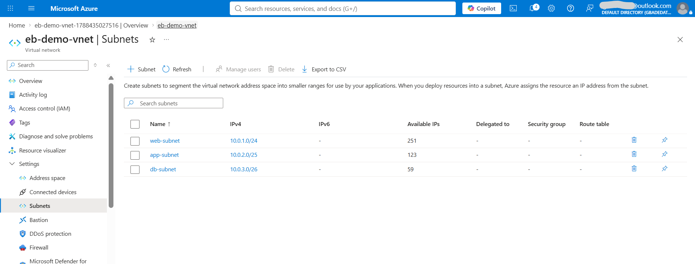
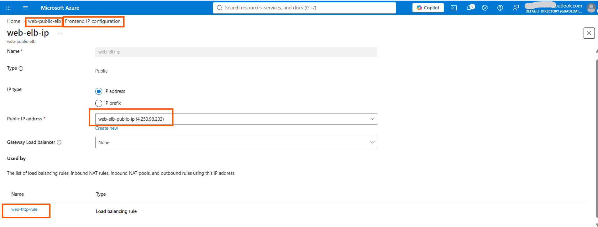
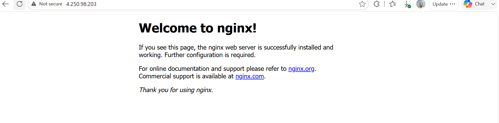

# Assignment 3 — Design a Three-Tier Network with Load Balancer on Azure

Part of the DevOps Micro Internship (DMI) Cohort 3 with Agentic AI

---

## Purpose

In this assignment, you will design and deploy a three-tier network architecture on Azure using a Virtual Network, subnets, a Virtual Machine, NGINX, and a Public Load Balancer. The web, application, and database tiers are separated into dedicated subnets, and a Public Load Balancer provides the application entry point.

---

# Task 1 — Create a Virtual Network with Three Subnets

## Goal

Create `eb-demo-vnet` (10.0.0.0/16) with `web-subnet` (10.0.1.0/24), `app-subnet` (10.0.2.0/25), and `db-subnet` (10.0.3.0/26), inside Resource Group `vnet-demo-rg`.

### Evidence

#### Screenshot 1 — Subnet configuration screen showing the three subnets and Bastion subnet (if enabled)

The three subnets are deliberately sized differently: web-subnet at 10.0.1.0/24 gives 251 usable addresses for the tier that scales out furthest, app-subnet at 10.0.2.0/25 gives 123, and db-subnet at 10.0.3.0/26 gives 59 for the tier that needs the fewest hosts. Azure reserves five addresses in every subnet, which is why the usable counts fall short of the raw block sizes.

Azure Bastion was not enabled. The VM is reached over SSH using its own public IP instead, so no AzureBastionSubnet appears in this configuration.

---

# Task 2 — Deploy the Web VM and Install NGINX

## Goal

Create Ubuntu 22.04 LTS VM `web-nginx` in `web-subnet` with a public IP and inbound SSH (22) and HTTP (80), then install and start NGINX and verify the default page via the VM's public IP.

> No screenshot required for this task. Completion is verified through Task 4.

---

# Task 3 — Create a Public Load Balancer

## Goal

Create Standard Public Load Balancer `web-public-elb` with frontend IP `web-elb-ip`, backend pool `web-backend-pool` (containing `web-nginx`), a TCP port-80 health probe `web-health-probe`, and load-balancing rule `web-http-rule`.

### Evidence

#### Screenshot 2 — Load Balancer frontend IP configuration

The frontend configuration web-elb-ip is backed by a dedicated Standard SKU public IP, web-elb-public-ip, on 4.250.98.203. This is a separate address from the VM's own public IP, which is what allows Task 4 to prove traffic arrives through the load balancer rather than directly at the VM. The "Used by" list confirms web-http-rule is bound to this frontend.

---

# Task 4 — Test the Architecture

## Goal

Confirm the NGINX default page is reachable through the Load Balancer's public IP.

### Evidence

#### Screenshot 3 — Browser showing the NGINX welcome page through the Load Balancer Public IP

Verified from the command line as well:

    $ az network lb probe list --resource-group vnet-demo-rg --lb-name web-public-elb
    Name              Protocol    Port
    web-health-probe  Tcp         80

    $ az network lb rule list --resource-group vnet-demo-rg --lb-name web-public-elb
    Name           Protocol    FrontendPort    BackendPort
    web-http-rule  Tcp         80              80

    $ curl -I http://4.250.98.203
    HTTP/1.1 200 OK
    Server: nginx/1.18.0 (Ubuntu)

The health probe polls TCP port 80 every five seconds, and the backend pool contains the web-nginx VM by NIC association. Traffic only reaches the VM once the probe reports the backend healthy.

---

# Task 5 — Clean Up Resources

## Goal

After capturing all required evidence, delete the `vnet-demo-rg` Resource Group to avoid ongoing charges.

> No screenshot required for this task.

---

# Submission Instructions

- Add all required screenshots in your submission
- Capture all evidence before deleting the Resource Group
- Do not expose passwords or sensitive Azure account information

---

# Completion Checklist

- [ ] Task 1: VNet and three subnets created (Screenshot 1)
- [ ] Task 2: Web VM created and NGINX installed and verified
- [ ] Task 3: Public Load Balancer configured (Screenshot 2)
- [ ] Task 4: NGINX reachable through the Load Balancer public IP (Screenshot 3)
- [ ] Task 5: Resource Group deleted after evidence was captured
- [ ] No sensitive data exposed

---

## 📌 About DMI & CloudAdvisory

DevOps Micro Internship (DMI) is a project-based DevOps program run by Pravin Mishra (The CloudAdvisory) focused on real-world execution, systems thinking, and career readiness.

It helps learners build strong DevOps foundations with hands-on experience.

---

## 📌 Resources

- 🌐 DMI Official Website: https://dmi.pravinmishra.com?utm_source=github&utm_medium=readme  
- 🎓 University: https://university.pravinmishra.com?utm_source=github&utm_medium=readme  
- 💬 Discord Community: https://discord.pravinmishra.com?utm_source=github&utm_medium=readme  
- 📝 Blog: https://dmi.pravinmishra.com/blog?utm_source=github&utm_medium=readme  
- ▶️ YouTube Playlist: https://www.youtube.com/playlist?list=PLFeSNDtI4Cho  
- 🔗 Pravin Mishra (LinkedIn): https://www.linkedin.com/in/pravin-mishra-aws-trainer/  
- 🏢 CloudAdvisory (LinkedIn): https://www.linkedin.com/company/thecloudadvisory/

---

*This submission is part of DevOps Micro Internship (DMI) Cohort 3 — Agentic AI Track.*
