# Assignment 5 — Deploy EpicBook Web App on Azure VM with Azure Database for MySQL

Part of the DevOps Micro Internship (DMI) with Agentic AI

---

## Purpose

In this assignment, you will deploy the EpicBook web application on Azure using an Ubuntu Virtual Machine to host the frontend and backend, and Azure Database for MySQL Flexible Server (private access) to store user and product data. You will build the network, provision the resources, deploy the application, and prove that the complete user flow works through the VM's public IP.

---

# Task 1 — Create Network Infrastructure

## Goal

Create a VNet (10.0.0.0/16) with a public subnet (10.0.1.0/24) for the VM and a private subnet (10.0.2.0/24) for MySQL, with NSGs allowing HTTP (80)/SSH (22) publicly and MySQL (3306) only from the VM subnet, plus a Public IP and Network Interface for the VM.

### Evidence

#### Screenshot 1 — Virtual Network overview showing the 10.0.0.0/16 address space and both subnets

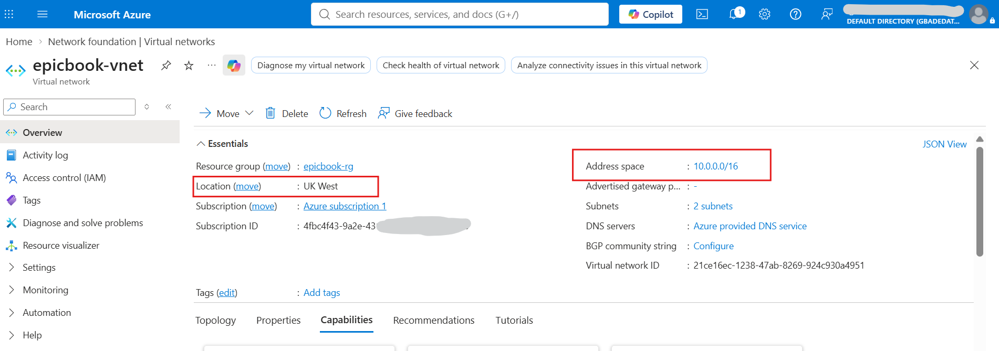

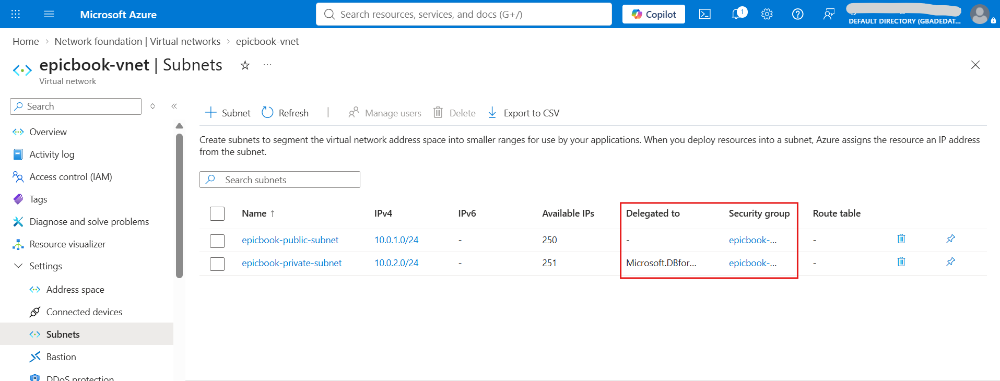

The private subnet is delegated to `Microsoft.DBforMySQL/flexibleServers`, which VNet-integrated MySQL requires, so nothing else can be deployed into it.

**Note on region:** everything in this assignment runs in UK West. The first build was in UK South, where Azure Database for MySQL Flexible Server turned out to be unavailable to this subscription. Even a read-only `az mysql flexible-server list-skus --location uksouth` returned `InternalServerError`, while UK West, North Europe and West Europe all listed the Burstable tier. Private access requires the server and the VNet to be in the same region, so the whole network was rebuilt in UK West.

---

#### Screenshot 2 — Public and private NSG inbound rules showing ports 80, 22, and restricted 3306 access

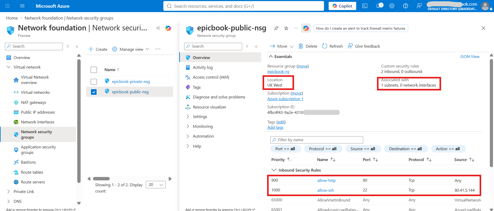

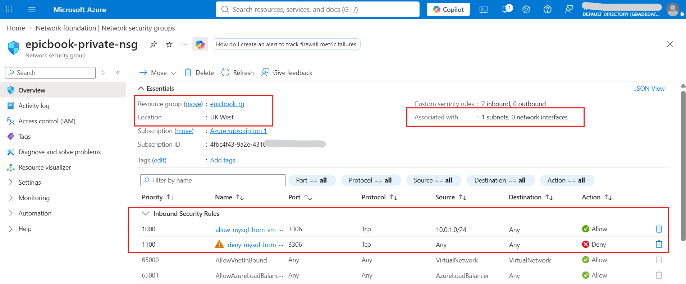

The deny rule at priority 1100 is what makes the restriction real. Without it, Azure's default `AllowVnetInBound` rule at priority 65000 would admit 3306 from anywhere inside the VNet, so an allow rule on its own would restrict nothing. After this NSG was attached, the app was restarted to force fresh database connections, and it reconnected normally.

---

#### Screenshot 3 — Public IP and Network Interface association for the Virtual Machine

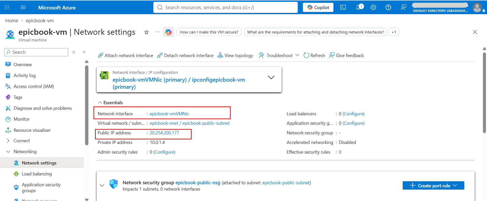

The NIC has no NSG of its own; inbound traffic is governed by the subnet NSG in Screenshot 2a.

---

# Task 2 — Provision Azure Virtual Machine

## Goal

Launch an Ubuntu 22.04 LTS VM (Standard B1s or equivalent) in the public subnet, and install Node.js, npm, Nginx, Git, and MySQL Client.

### Evidence

#### Screenshot 4 — Virtual Machine overview showing Ubuntu, size, public IP, and subnet

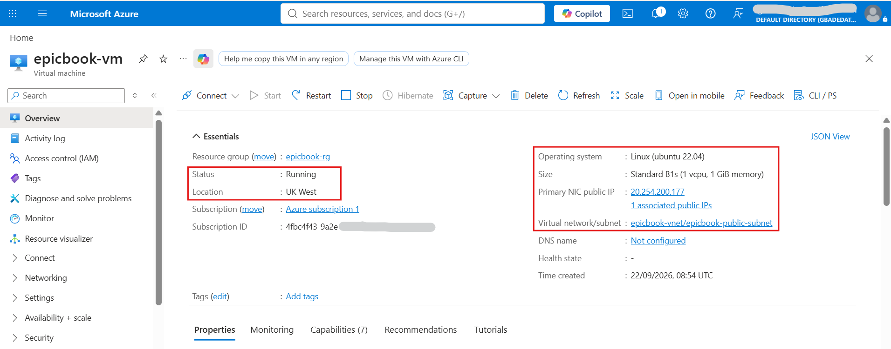

---

#### Screenshot 5 — Terminal showing successful software installation or installed-version checks

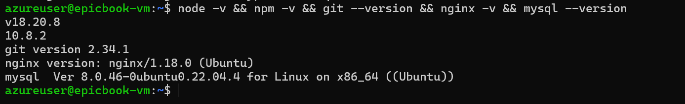

Node.js 18 was installed from NodeSource, because the version in Ubuntu 22.04's own repository is 12.x.

---

# Task 3 — Deploy the EpicBook Application

## Goal

Clone the EpicBook repository, install dependencies, build the frontend, configure Nginx to serve it, and configure the Node.js/Express.js backend to connect to MySQL using environment variables.

### Evidence

#### Screenshot 6 — Terminal showing the EpicBook repository cloned and dependencies installed

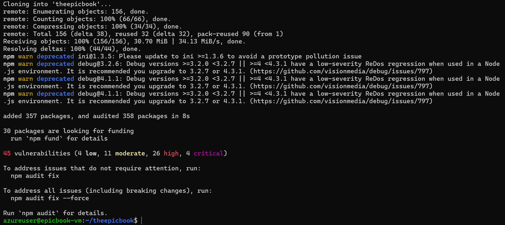

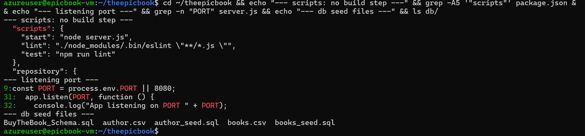

**No build step:** the Task 3 goal mentions building the frontend, but EpicBook is a server-rendered Express app that uses Handlebars templates, not a single-page app. `package.json` defines only `start`, `lint` and `test`, so there is no frontend build to run. The app listens on port 8080.

---

#### Screenshot 7 — Nginx configuration or service status proving the frontend is configured to be served

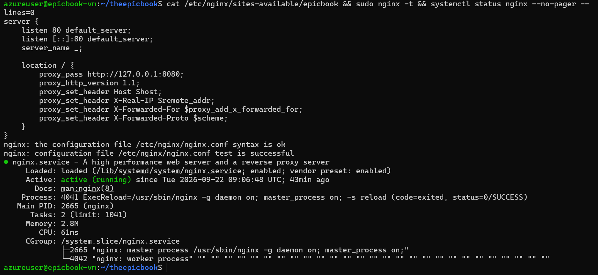

Because Node renders the HTML, Nginx serves the frontend by proxying port 80 to the app on `127.0.0.1:8080`, rather than serving a static build folder.

---

#### Screenshot 8 — Backend process or listening-port evidence (without exposing environment-variable secrets)

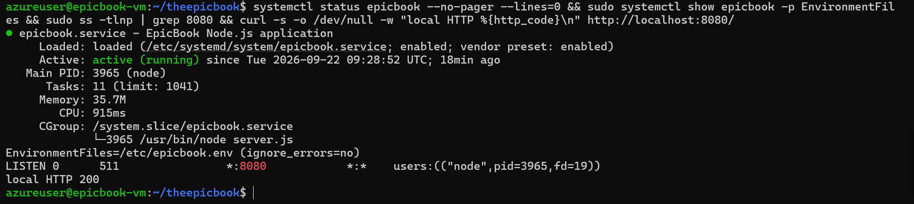

**Environment variables:** EpicBook's production configuration reads the database connection from one environment variable, `JAWSDB_URL`. As shipped, that path cannot work against Azure: `models/index.js` passed only the URL to Sequelize and dropped the rest of the configuration, including the SSL options, while Azure MySQL enforces TLS. Restoring the second argument, which matches the model loader that sequelize-cli generates, fixed it:

    -  sequelize = new Sequelize(process.env[config.use_env_variable]);
    +  sequelize = new Sequelize(process.env[config.use_env_variable], config);

The SSL options sit in the `production` block of `config/config.json`. `NODE_ENV`, `PORT` and `JAWSDB_URL` live in `/etc/epicbook.env`, owned by root with mode 600, and the systemd service loads them through `EnvironmentFile`. The screenshot shows the file reference but none of the values, and no credentials are stored in the repository's config file. The connection is encrypted with certificate verification switched off, matching the course setup; pinning Azure's CA certificate would be the production improvement.

---

# Task 4 — Setup Azure Database for MySQL

## Goal

Create a private Azure Database for MySQL Flexible Server (VNet Integration) in the private subnet, create the database user and schema, import the SQL dump, and restrict access to the VM subnet only.

### Evidence

#### Screenshot 9 — MySQL Flexible Server overview showing Private access (VNet Integration)

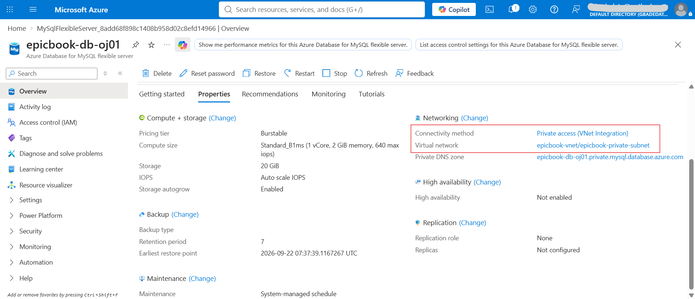

**Why the server was created in the portal:** `az mysql flexible-server create` (Azure CLI 2.90.0) rebuilt the existing VNet twice, once when given the VNet and subnet by name and again when given the full subnet ID. Each time it deleted the public subnet and recreated the private subnet at `10.0.0.0/24` instead of `10.0.2.0/24`. An Azure CLI pull request (#33446) traces a related fault to the command's VNet existence check, which uses an API version that regional network providers may not support yet. Combined with the CLI's documented fallback of creating a network with default address prefixes when it believes none exists, that matches what happened here. Both misplaced servers were deleted, the subnets restored, and the server created through the portal, which left the network untouched.

---

#### Screenshot 10 — Networking configuration showing the private subnet and restricted access

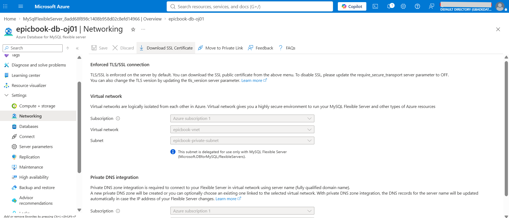

Access to the database is restricted at three levels. The server has no public endpoint and sits in a delegated subnet, so it is reachable only from inside the VNet. The private NSG in Screenshot 2b then allows port 3306 only from the VM subnet. Finally, the application's database user is `epicbook_app@10.0.1.%`, which can only sign in from the VM subnet and holds privileges on the `bookstore` database alone, so the app never uses the admin account.

---

#### Screenshot 11 — MySQL Client output showing the EpicBook database or imported tables (no password visible)

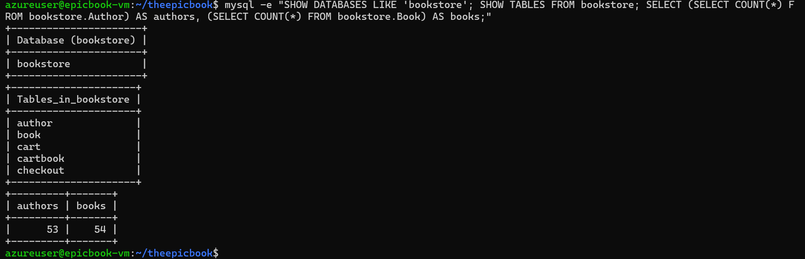

The schema file created `Author`, `Book` and `Cart`, and Sequelize created `Cartbook` and `Checkout` when the app first started. Table names appear in lowercase because the server uses `lower_case_table_names = 1`. The client reads its credentials from a `~/.my.cnf` with mode 600, so no password appears on screen.

---

# Task 5 — Test End-to-End Functionality

## Goal

Confirm the EpicBook application loads through the VM's public IP and that viewing products, adding items to the cart, and placing orders all work.

### Evidence

#### Screenshot 12 — Browser showing the EpicBook application with the Virtual Machine public IP visible

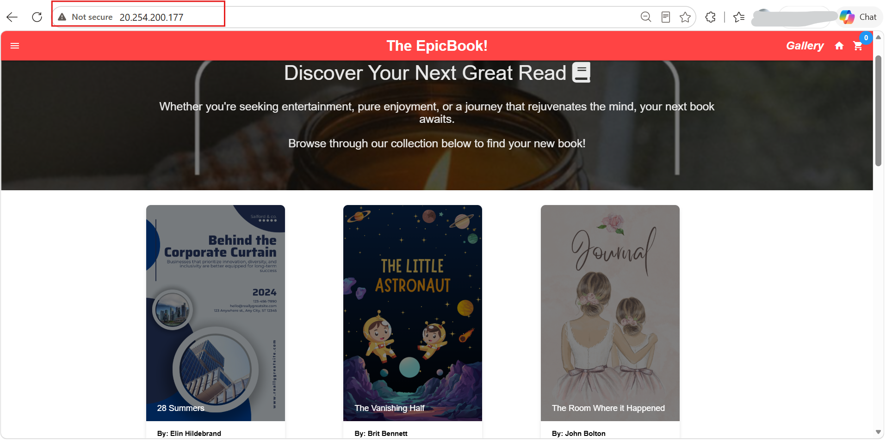

The homepage queries MySQL on every load for the books and their authors, the genre list and the cart count, so a rendered listing is itself proof of a working database connection.

---

#### Screenshot 13 — Proof of a successful database-backed action (viewing products, adding to cart, or placing an order)

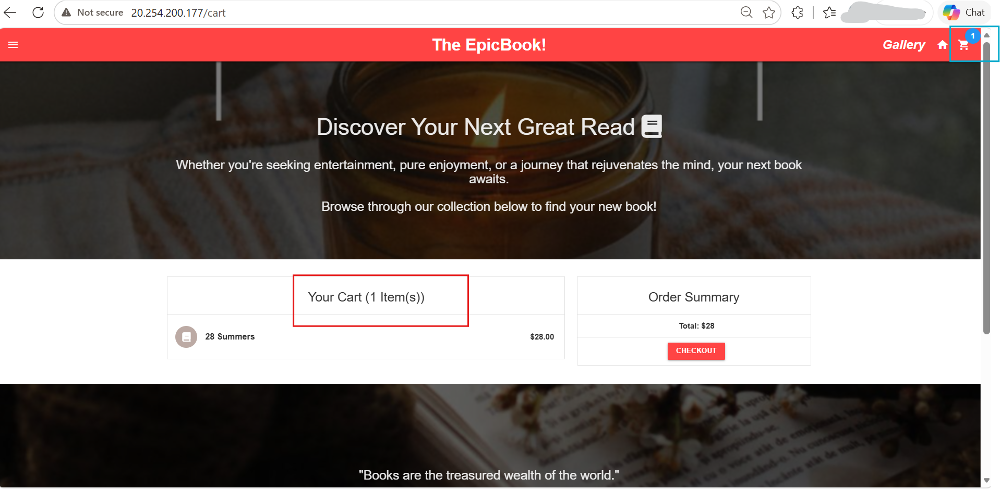

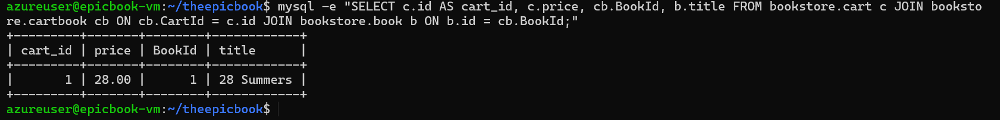

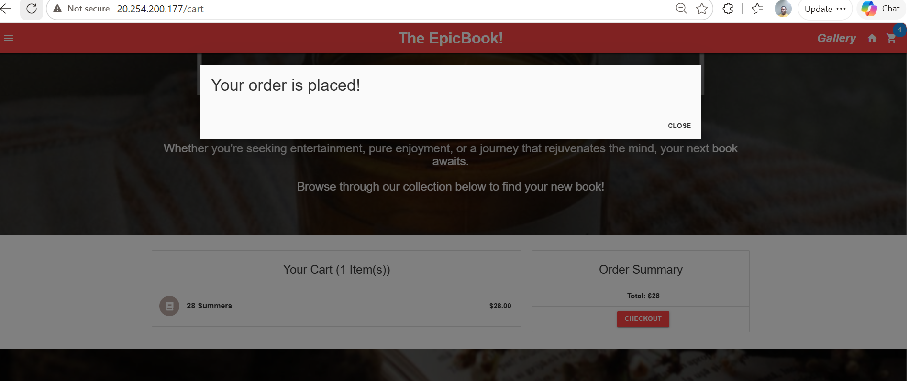

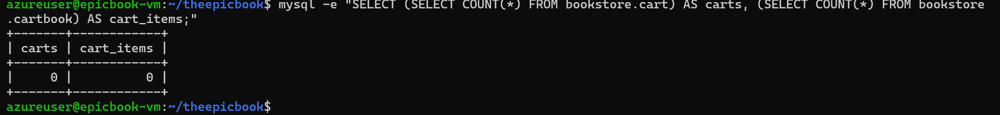

Viewing products, adding to the cart and checking out all work. One thing worth knowing about EpicBook: checking out does not record an order. The Checkout button shows the confirmation and calls `DELETE /api/cart/delete`, which clears the cart tables, and nothing is ever written to the `Checkout` table. Screenshots 13b and 13d show the database before and after.

---

#### Public IP URL

Paste the public IP URL of your Virtual Machine here:

`http://20.254.200.177`

---

# Submission Instructions

- Add all required screenshots in your submission
- Include the Virtual Machine public IP URL
- Do not expose database passwords, connection strings, or subscription IDs

---

# Completion Checklist

- [ ] Task 1: Network foundation created with public/private subnets and NSGs (Screenshots 1–3)
- [ ] Task 2: VM provisioned and required software installed (Screenshots 4–5)
- [ ] Task 3: EpicBook frontend and backend deployed (Screenshots 6–8)
- [ ] Task 4: Private Azure Database for MySQL created and data imported (Screenshots 9–11)
- [ ] Task 5: End-to-end functionality validated (Screenshots 12–13, Public IP URL)
- [ ] No sensitive data exposed

---

## 📌 About DMI & CloudAdvisory

DevOps Micro Internship (DMI) is a project-based DevOps program run by Pravin Mishra (The CloudAdvisory) focused on real-world execution, systems thinking, and career readiness.

It helps learners build strong DevOps foundations with hands-on experience.

---

## 📌 Resources

- 🌐 DMI Official Website: https://dmi.pravinmishra.com?utm_source=github&utm_medium=readme  
- 🎓 University: https://university.pravinmishra.com?utm_source=github&utm_medium=readme  
- 💬 Discord Community: https://discord.pravinmishra.com?utm_source=github&utm_medium=readme  
- 📝 Blog: https://dmi.pravinmishra.com/blog?utm_source=github&utm_medium=readme  
- ▶️ YouTube Playlist: https://www.youtube.com/playlist?list=PLFeSNDtI4Cho  
- 🔗 Pravin Mishra (LinkedIn): https://www.linkedin.com/in/pravin-mishra-aws-trainer/  
- 🏢 CloudAdvisory (LinkedIn): https://www.linkedin.com/company/thecloudadvisory/

---

*This submission is part of DevOps Micro Internship (DMI) — Agentic AI Track.*
