# Assignment 6 — Capstone: Deploy Book Review App (Three-Tier Architecture) on Azure

Part of the DevOps Micro Internship (DMI) with Agentic AI

---

## Purpose

This is the most important assignment of the course. You will deploy the Book Review App in a production-ready, best-practice-compliant three-tier architecture on Azure: separated presentation, application, and database tiers, least-privilege network access, a controlled public entry point, protected secrets, and availability/monitoring evidence.

---

# Task 1 — Design the Azure Three-Tier Architecture

## Goal

Create an architecture diagram and implementation plan identifying the presentation, application, and database components, the chosen Azure services, the public entry point, and the internal traffic paths.

### Evidence

#### Screenshot 1 — Architecture diagram showing the public entry point, three tiers, network boundaries, and traffic flow

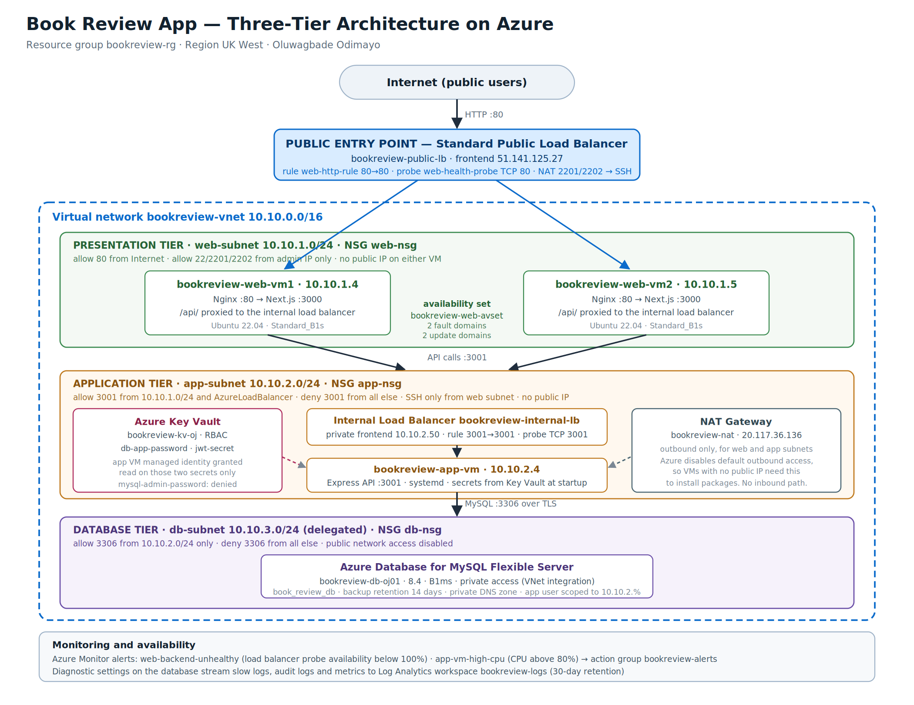

Traffic enters only at the public load balancer and passes through each tier in turn. The web tier is the only tier the load balancer can reach, the application tier accepts connections only from the web subnet, and the database accepts connections only from the application subnet.

---

#### Screenshot 2 — Written architecture assumptions and selected Azure services

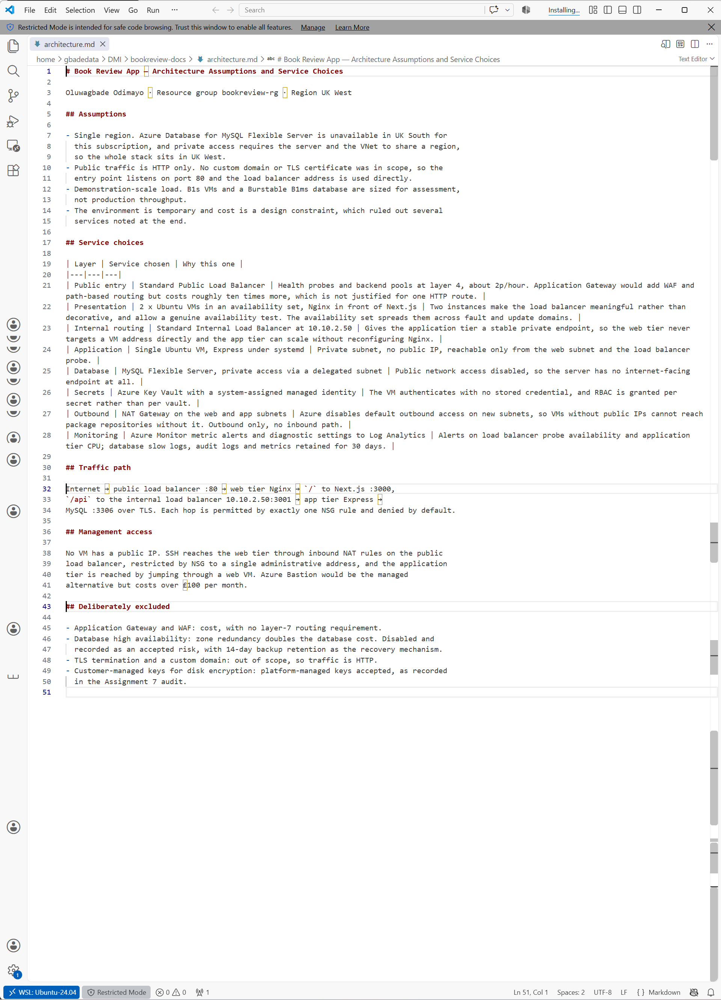

The main constraint shaping this design: Azure Database for MySQL Flexible Server is unavailable in UK South for this subscription, and private access requires the server and the VNet to share a region, so the entire deployment runs in UK West.

---

# Task 2 — Create the Azure Network Foundation

## Goal

Create a dedicated Resource Group and VNet with separate subnets for the web, application, and database tiers, keeping the application and database tiers without direct public access.

### Evidence

#### Screenshot 3 — Resource Group overview showing the assignment resources

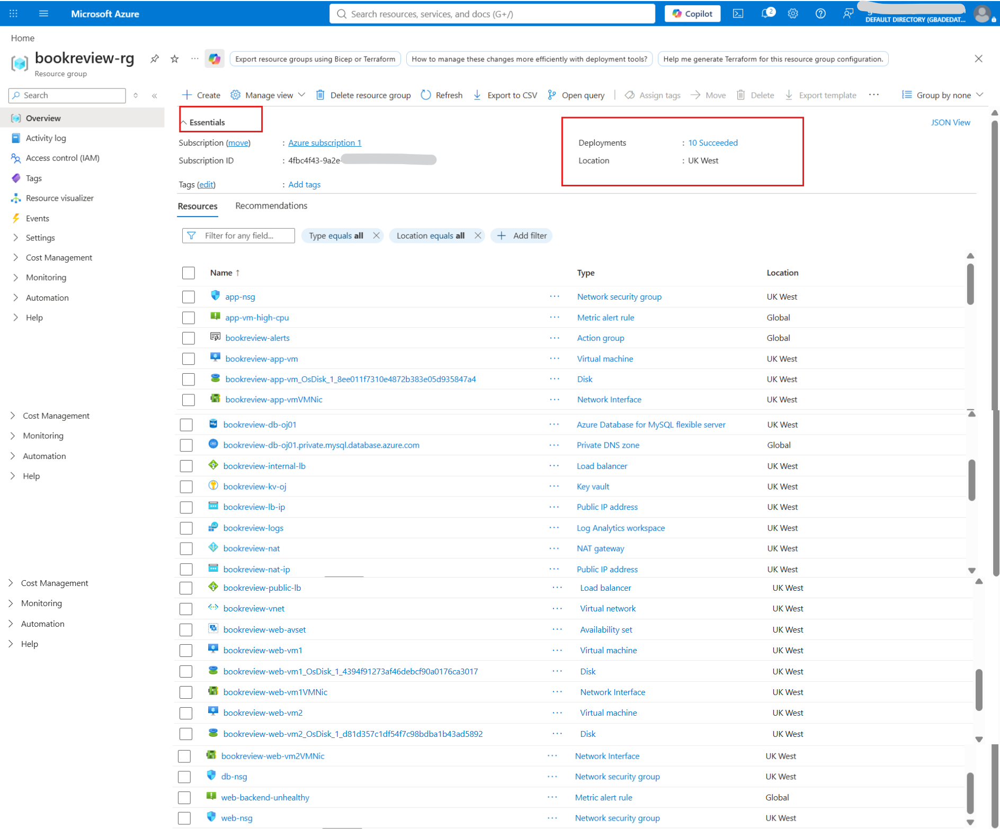

---

#### Screenshot 4 — VNet overview showing the address space and all required subnets

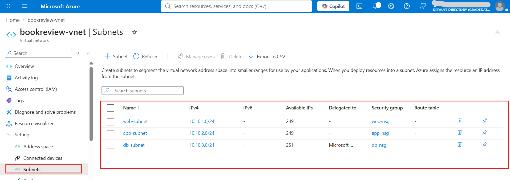

10.10.0.0/16 divided into web 10.10.1.0/24, app 10.10.2.0/24 and db 10.10.3.0/24. The database subnet is delegated to `Microsoft.DBforMySQL/flexibleServers`, which private access requires and which prevents anything else being deployed into it.

---

#### Screenshot 5 — Route-table or Private DNS evidence where applicable

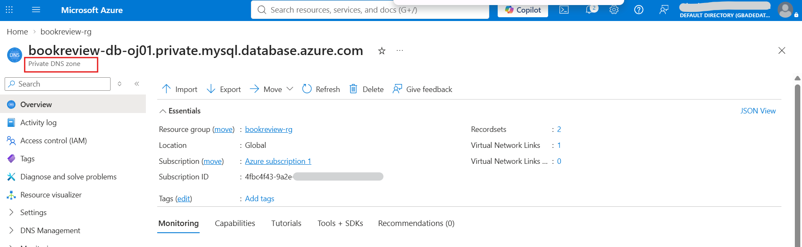

The zone resolves the server's public hostname to its private address inside the VNet, which is how the application tier reaches a database that has no public endpoint. No route tables were needed: the NAT gateway is associated with the web and app subnets directly, and Azure route tables do not accept a NAT gateway as a next hop.

---

# Task 3 — Configure Security and Secret Management

## Goal

Apply least-privilege NSG rules so traffic flows Internet → public entry point → web tier → application tier → database tier, and store credentials in Azure Key Vault or another approved secure mechanism.

### Evidence

#### Screenshot 6 — NSG rules proving least-privilege access between the tiers

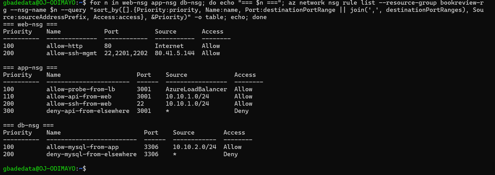

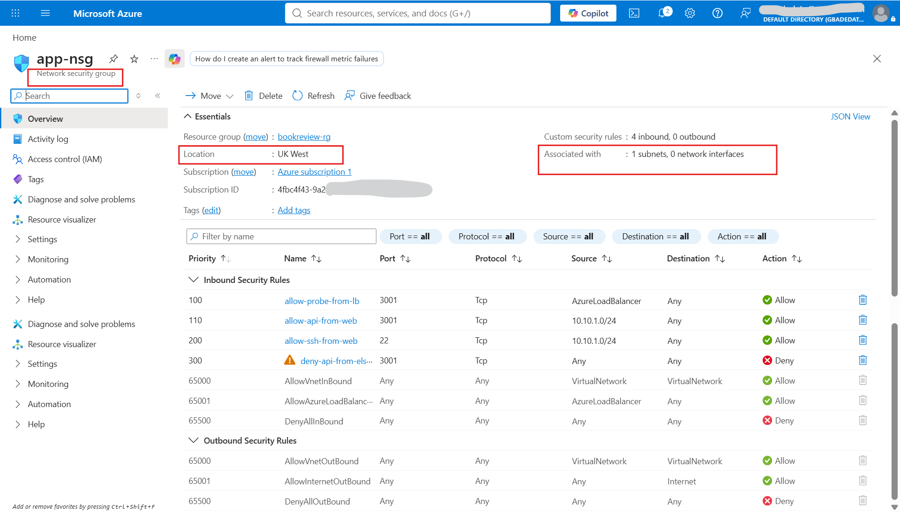

Each tier admits exactly one thing and denies the rest. The deny rules matter as much as the allows: Azure's default `AllowVnetInBound` rule at priority 65000 already permits all traffic within the VNet, so an allow rule on its own restricts nothing. The explicit denies at priority 300 and 200 are what actually confine 3001 to the web subnet and 3306 to the app subnet.

The rule at priority 100 in app-nsg admits the `AzureLoadBalancer` service tag on 3001. Without it the internal load balancer's health probe would be caught by the deny, and every backend would report unhealthy while the application itself was running perfectly.

---

#### Screenshot 7 — Key Vault or approved secret-management configuration (without displaying secret values)

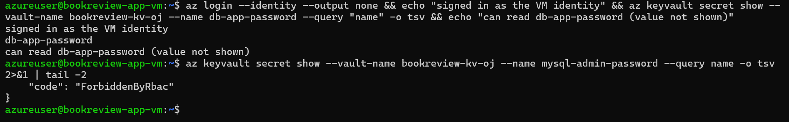

The application tier VM has a system-assigned managed identity with `Key Vault Secrets User` granted on two individual secrets rather than on the vault. It signs in with `az login --identity`, holding no stored credential of any kind, and fetches `db-app-password` and `jwt-secret` at deployment time.

The second half of that screenshot is the more useful half: the same identity requesting `mysql-admin-password` receives `ForbiddenByRbac`. Least privilege demonstrated rather than asserted. No secret value appears anywhere, and the database password was generated randomly and never displayed to anyone, including me.

---

# Task 4 — Deploy the Presentation (Web) Tier

## Goal

Deploy the Book Review App presentation layer on the approved web-tier compute service, configured to route requests to the internal application-tier endpoint, and not directly exposed except through the public entry service.

### Evidence

#### Screenshot 8 — Web-tier compute overview showing subnet and availability configuration

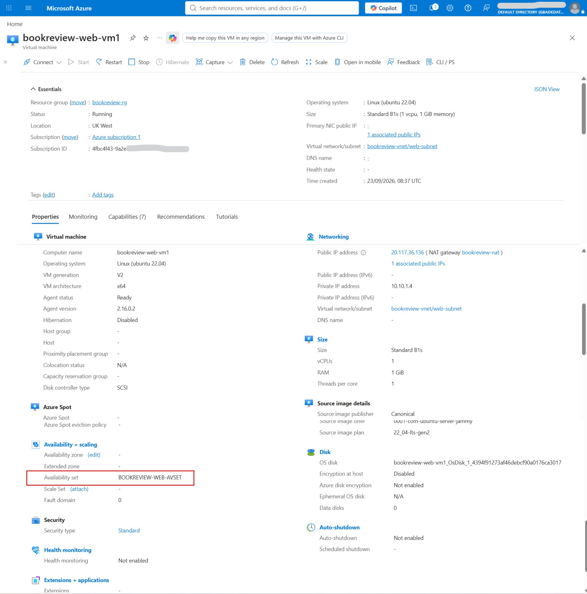

Both web VMs sit in `bookreview-web-avset` with two fault domains and two update domains, so a rack failure or a host update cannot take both offline at once. Neither has a public IP.

---

#### Screenshot 9 — Terminal or service output proving the presentation layer is running

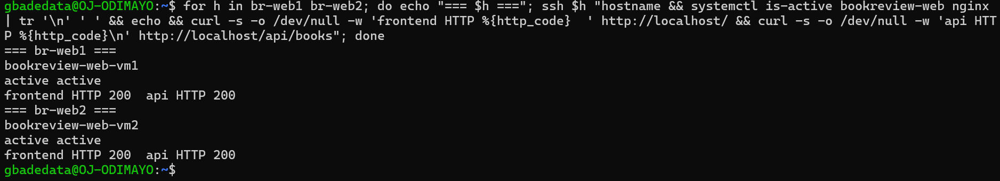

Nginx listens on 80 and splits traffic: `/` to the local Next.js process on 3000, and `/api/` to the internal load balancer. The web tier therefore never addresses an application VM directly.

---

# Task 5 — Deploy the Business (Application) Tier

## Goal

Deploy the Book Review App backend privately in the application subnet, configured to use the private database endpoint and secured environment values, reachable only through its internal endpoint.

### Evidence

#### Screenshot 10 — Application-tier compute overview showing private subnet placement

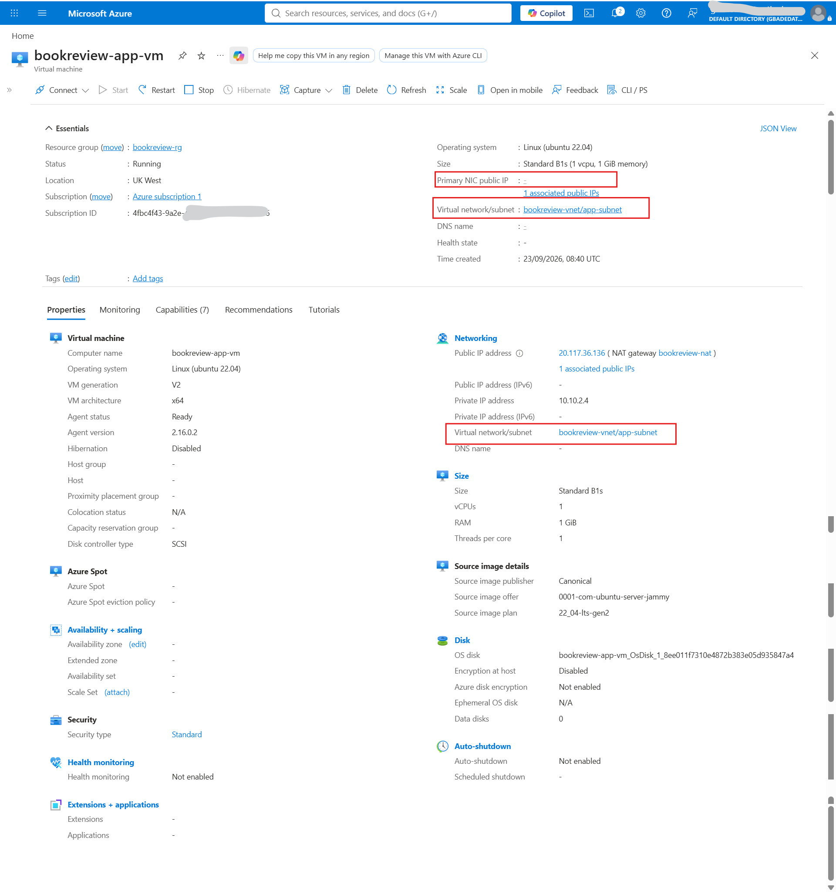

---

#### Screenshot 11 — Backend process, service, or listening-port evidence

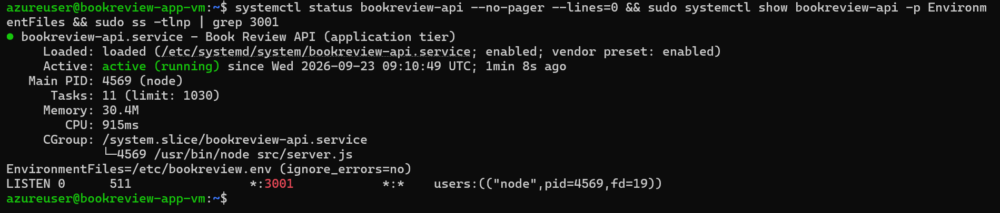

The service loads its configuration through systemd's `EnvironmentFile` from `/etc/bookreview.env`, which is root-owned at mode 600. The screenshot shows the file being referenced but none of its values.

---

#### Screenshot 12 — Internal health-check or API response (without exposing secrets)

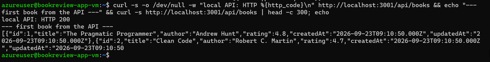

The startup log line `Database 'book_review_db' connected successfully with SSL!` is the useful one: it only appears after Sequelize authenticates, so it proves the Key Vault secret, the scoped database user, the delegated subnet, the NSG rules and TLS are all working together.

---

# Task 6 — Deploy the Managed Database Tier

## Goal

Create a private Azure managed database (public access disabled), with availability/backup/retention settings, the Book Review App schema imported, and access restricted to the application tier only.

### Evidence

#### Screenshot 13 — Database overview showing private connectivity and public access disabled

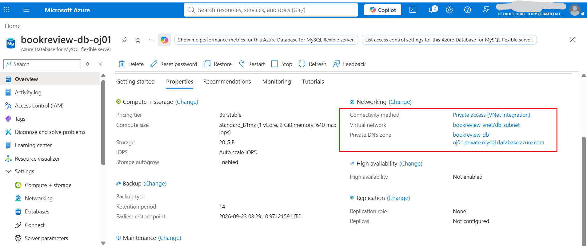

---

#### Screenshot 14 — Availability, backup, and retention configuration

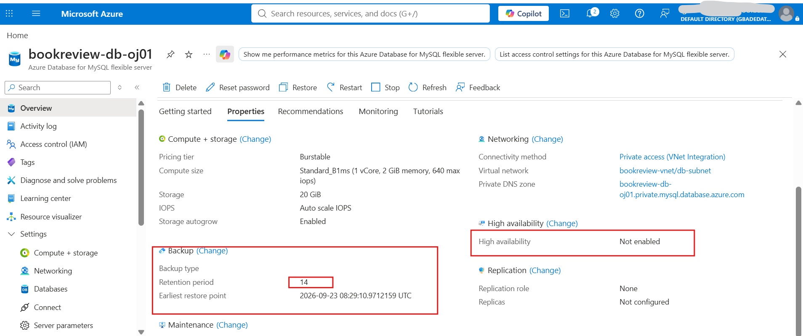

Backup retention was raised from the default 7 days to 14. High availability is disabled and geo-redundancy is off, both deliberately: zone redundancy doubles the database cost, which is not justified for an assessment environment. That is recorded as an accepted risk with the extended retention window as the recovery mechanism rather than left as an unexamined default.

---

#### Screenshot 15 — Successful schema or connectivity verification (without exposing credentials)

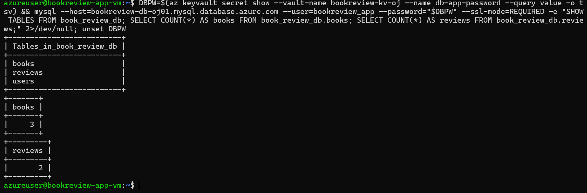

The schema was created by the application on first start rather than imported by hand, and the connection above uses `bookreview_app`, not the admin account. Its password comes from Key Vault, so no credential appears on screen.

---

# Task 7 — Configure Traffic Management, Availability, and Monitoring

## Goal

Configure the approved public entry service with health probes and backend pools, internal routing for the application tier where required, and enable Azure Monitor/diagnostics/logs/alerts for the key resources.

### Evidence

#### Screenshot 16 — Public entry service showing listener, frontend endpoint, and healthy web targets

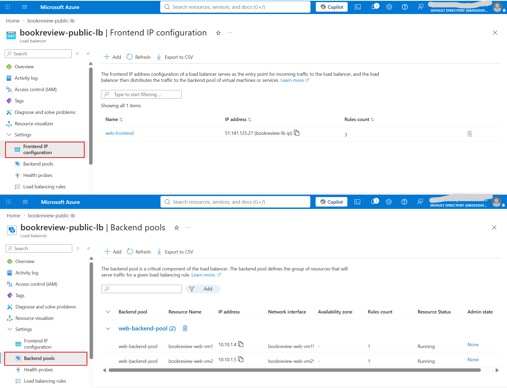

Frontend `web-frontend` on 51.141.125.27 carrying three rules: the HTTP load-balancing rule on 80, and two inbound NAT rules on 2201 and 2202 that provide SSH to each web VM. Both backend members show Running.

Management access is worth noting here. No VM has a public IP, so administrative SSH arrives through those NAT rules, restricted by NSG to a single address, and the application tier is reached by jumping through a web VM. Azure Bastion would be the managed equivalent but costs over £100 per month.

---

#### Screenshot 17 — Internal application-tier load-balancing or routing configuration where applicable

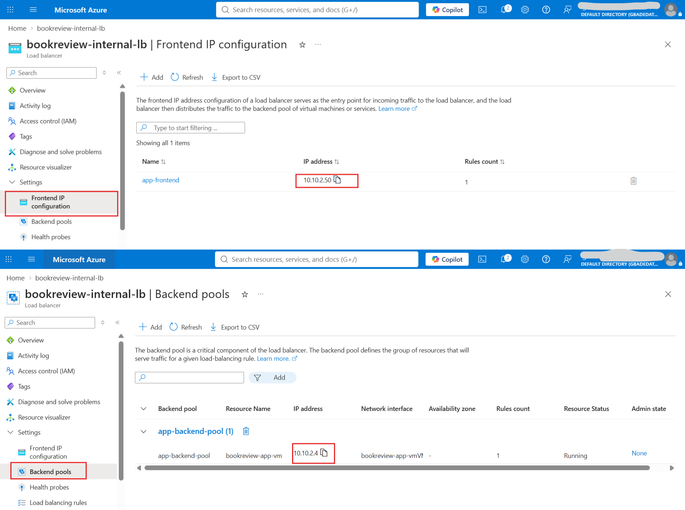

The application tier is addressed only as 10.10.2.50, never by VM address, so a second application VM could join the pool without touching the web tier's configuration.

---

#### Screenshot 18 — Azure Monitor, diagnostic settings, logs, metrics, or alert evidence

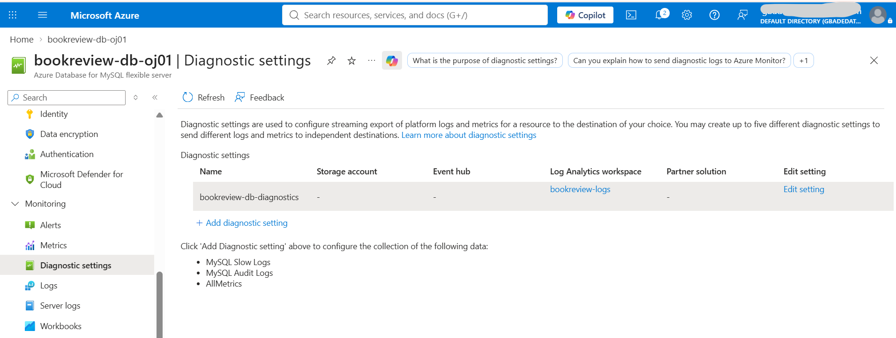

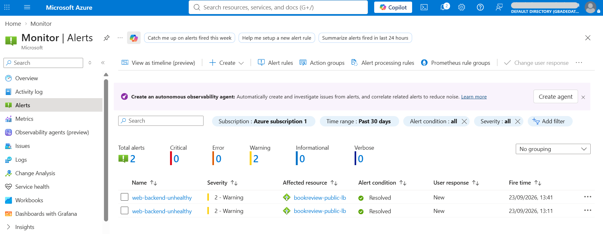

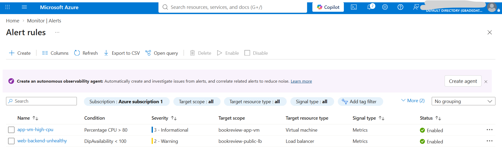

The middle screenshot is the one that matters. `web-backend-unhealthy` did not merely exist, it fired when a web VM was stopped during the availability test and returned to Resolved when the VM came back. The availability test and the monitoring validated each other.

---

# Task 8 — Validate the Production-Style Deployment

## Goal

Confirm the Book Review App works end to end through the public endpoint, with at least one database read and one write, confirm private tiers are not internet-reachable, and complete a safe availability test.

### Evidence

#### Screenshot 19 — Browser showing the Book Review App through the public endpoint

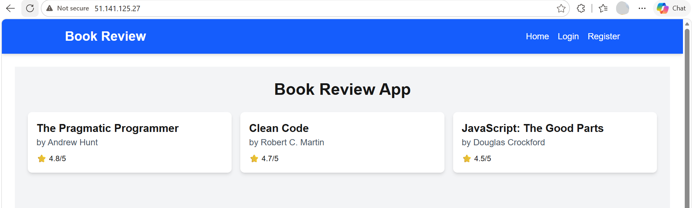

---

#### Screenshot 20 — Proof of successful database-backed read and write operations

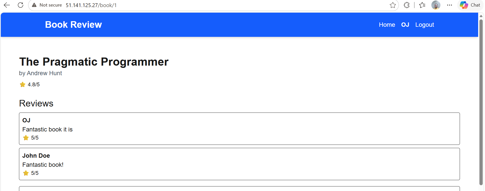

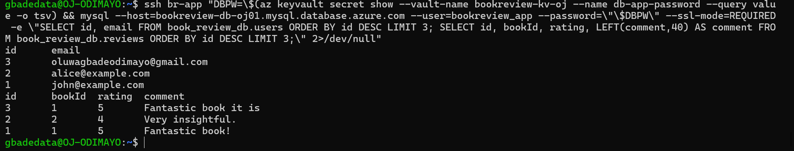

Registering an account and submitting a review exercises the write path; the book list is the read. The second screenshot confirms where the data went, queried through the application's own restricted database user. A browser screenshot on its own shows the page changed, not that it reached the database.

---

#### Screenshot 21 — Evidence that private tiers are not publicly accessible

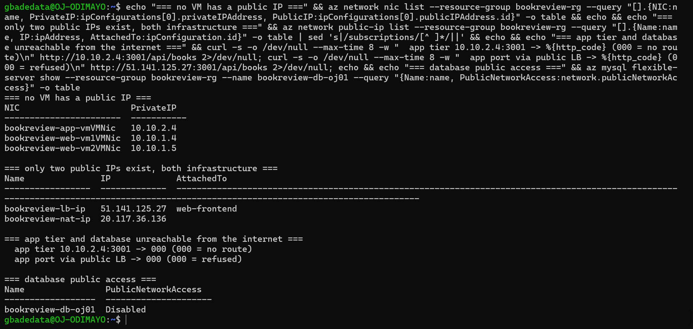

Four independent pieces of evidence in one view. No network interface carries a public IP. Only two public addresses exist in the resource group, one on the load balancer frontend and one on the NAT gateway for outbound traffic, neither attached to a VM. Requests to the application tier fail from outside the VNet, both to its private address and to port 3001 on the public endpoint, because no load-balancing rule forwards that port. And the database reports `publicNetworkAccess: Disabled`.

---

#### Screenshot 22 — Availability-test and healthy-target evidence

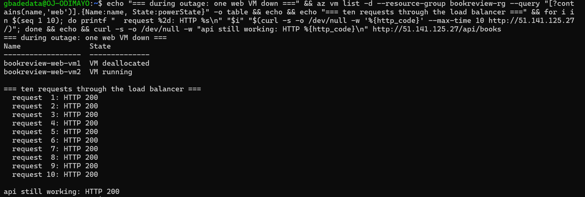

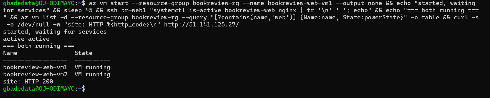

With `bookreview-web-vm1` deallocated, ten consecutive requests through the load balancer returned 200 and the API continued to answer, served entirely by the remaining VM. On restart, both `bookreview-web` and `nginx` came back without intervention because the systemd units are enabled, and the load balancer returned the VM to its pool once the health probe passed.

---

#### Public Endpoint

Paste your public endpoint URL here:

`http://51.141.125.27`

---

### Notes

Summarize what worked, issues encountered and how they were fixed, and the availability/security/secrets/monitoring/backup choices made.

**What worked.** The architecture came up as designed and behaved correctly under test: traffic reaches only the public load balancer, each tier admits exactly one upstream, the database has no public endpoint, and the application survived losing a web VM without interruption. The Key Vault and managed identity design worked first time, which was the part I expected to fight with.

**Issues encountered, and how they were fixed.**

The region moved. Azure Database for MySQL Flexible Server is unavailable in UK South for this subscription, to the point where even a read-only `az mysql flexible-server list-skus --location uksouth` returns `InternalServerError`, while UK West, North Europe and West Europe all answer normally. Private access requires the server and the VNet in the same region, so the deployment went to UK West.

The database was created in the portal rather than the CLI. `az mysql flexible-server create` in CLI 2.90.0 rebuilt an existing VNet twice during Assignment 5, deleting a subnet each time, when given the network by name and again when given a full resource ID. The portal path leaves the network untouched.

The application's frontend could not fetch data. The home page builds `${NEXT_PUBLIC_API_URL}/api/books` while `src/services/api.js` builds `${NEXT_PUBLIC_API_URL}/books`, so no single value satisfies both files. The backend mounts everything under `/api`, which makes `api.js` correct and the home page wrong, and the fix was to bring the home page into line and rebuild. Next.js inlines `NEXT_PUBLIC_*` values at build time, so a restart alone would not have applied it.

The application VM was refused when a load balancer command was run on it by mistake. That was the correct outcome and a useful accident: its managed identity holds read access to two secrets and nothing else.

Three resource providers needed one-time registration before use: `Microsoft.DBforMySQL`, `Microsoft.KeyVault` and `Microsoft.Insights`. None of this is visible until a command fails. Action groups also have to be created with `--location global` even though they live in a regional resource group.

**Availability.** Two web VMs in an availability set behind a Standard load balancer with a five-second health probe. High availability on the database is disabled as a cost decision, with 14-day backup retention as the recovery path.

**Security.** No VM has a public IP. Administrative SSH arrives through load balancer NAT rules restricted to one address, and the application tier is reached by jumping through a web VM. Each tier's NSG pairs an allow with an explicit deny, because Azure's default `AllowVnetInBound` rule would otherwise leave the allow doing nothing. The database user is scoped to the application subnet and to one database, and the application never uses the admin account.

**Secrets.** Azure Key Vault with a system-assigned managed identity and RBAC granted per secret. The application VM holds no stored credential and cannot read the administrator password. The database password was generated randomly and never displayed.

**Monitoring.** Azure Monitor alerts on load balancer probe availability and application tier CPU, routed to an action group. Database slow logs, audit logs and metrics stream to a Log Analytics workspace with 30-day retention. The availability alert fired and resolved during the availability test, so the monitoring is demonstrably working rather than merely configured.

**Backup.** Automated backups with 14-day retention, raised from the default 7. Geo-redundant backup is disabled as a cost decision for a single-region assessment environment.

---

# Submission Instructions

- Add all required screenshots and links in your submission
- Do not expose passwords, keys, connection strings, or subscription IDs

---

# Completion Checklist

- [ ] Task 1: Architecture diagram and assumptions documented (Screenshots 1–2)
- [ ] Task 2: Network foundation created with isolated tiers (Screenshots 3–5)
- [ ] Task 3: Least-privilege security and secret management configured (Screenshots 6–7)
- [ ] Task 4: Presentation tier deployed (Screenshots 8–9)
- [ ] Task 5: Application tier deployed privately (Screenshots 10–12)
- [ ] Task 6: Managed database tier deployed privately (Screenshots 13–15)
- [ ] Task 7: Public entry, internal routing, and monitoring configured (Screenshots 16–18)
- [ ] Task 8: End-to-end validation and availability test completed (Screenshots 19–22, Public Endpoint, Notes)
- [ ] No sensitive data exposed

---

## 📌 About DMI & CloudAdvisory

DevOps Micro Internship (DMI) is a project-based DevOps program run by Pravin Mishra (The CloudAdvisory) focused on real-world execution, systems thinking, and career readiness.

It helps learners build strong DevOps foundations with hands-on experience.

---

## 📌 Resources

- 🌐 DMI Official Website: https://dmi.pravinmishra.com?utm_source=github&utm_medium=readme  
- 🎓 University: https://university.pravinmishra.com?utm_source=github&utm_medium=readme  
- 💬 Discord Community: https://discord.pravinmishra.com?utm_source=github&utm_medium=readme  
- 📝 Blog: https://dmi.pravinmishra.com/blog?utm_source=github&utm_medium=readme  
- ▶️ YouTube Playlist: https://www.youtube.com/playlist?list=PLFeSNDtI4Cho  
- 🔗 Pravin Mishra (LinkedIn): https://www.linkedin.com/in/pravin-mishra-aws-trainer/  
- 🏢 CloudAdvisory (LinkedIn): https://www.linkedin.com/company/thecloudadvisory/

---

*This submission is part of DevOps Micro Internship (DMI) — Agentic AI Track.*
