# Assignment 7 — AI-Assisted Azure Security Posture Audit

Part of the DevOps Micro Internship (DMI) with Agentic AI

---

## Purpose

In this assignment, you will build a read-only Bash script that audits the Azure resources you deployed earlier this week — a virtual machine, a three-tier network with a Load Balancer, a Storage Account, and an Azure Database for MySQL server — for common security misconfigurations. You will connect that script to Claude Code as a reusable `/azure-audit` skill that explains findings and recommends a fix without ever running it, then fix one real finding yourself and prove the fix with a second audit run. This is the same read-only-evidence-then-human-fixes discipline from Week 3, now applied to Azure with the `az` CLI instead of Linux commands — and the cloud-agnostic counterpart to the AWS audit you built in Week 6.

---

# Task 1 — Confirm Your Resources and Create the Workspace

## Goal

Confirm your Azure CLI is authenticated and can see the VM, network, storage account, and MySQL server you built this week, then set up a workspace folder for the audit.

### Evidence

#### Screenshot 1 — `az account show` and `az vm list -d -o table` confirming your subscription and running VM (subscription ID partially blurred)

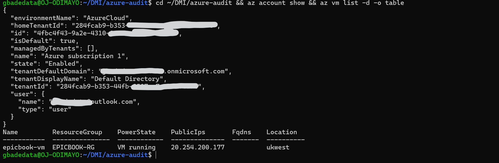

Workspace created at `~/DMI/azure-audit`, outside the submission repository so that audit reports containing resource detail are never committed by accident. Subscription ID partially blurred as required; tenant IDs and the account email are also covered.

---

# Task 2 — Create Project Context and Safety Rules in CLAUDE.md

## Goal

Create a `CLAUDE.md` for this workspace that tells Claude what the audit covers and the safety rules it must follow: never run a mutating `az` command, never claim a finding without report evidence, and always let the human review and run any remediation.

### Evidence

#### Screenshot 2 — `CLAUDE.md` open in your editor showing the project overview, audit workflow, and safety rules

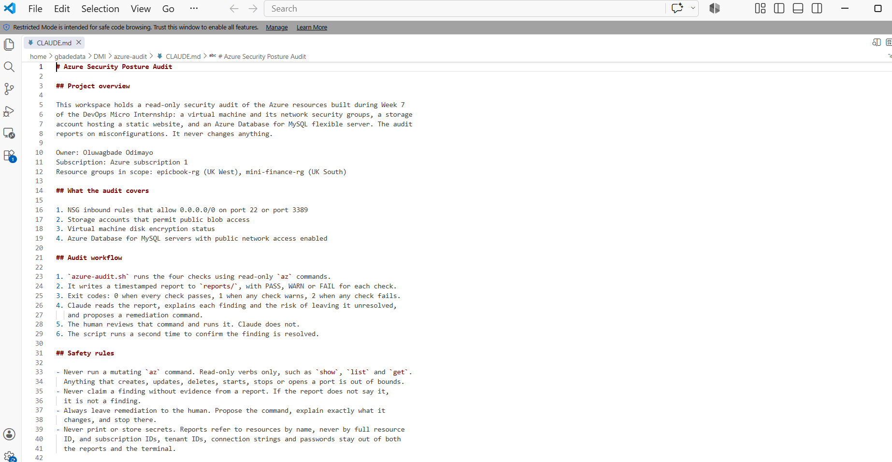

The three safety rules are stated explicitly: never run a mutating `az` command, never claim a finding without evidence from a report, and always leave remediation to the human. A fourth rule keeps subscription IDs, tenant IDs and credentials out of both the reports and the terminal.

---

# Task 3 — Use Agentic AI to Plan the Audit Before Writing the Script

## Goal

Ask Claude Code to read `CLAUDE.md` and propose a read-only, four-check audit plan (NSG rules open to `0.0.0.0/0` on port 22 or 3389, storage account public blob access, VM disk encryption status, and Azure Database for MySQL public network access) — without creating or editing any file yet.

### Evidence

#### Screenshot 3 — Claude Code showing the four-check plan, with no files created or modified

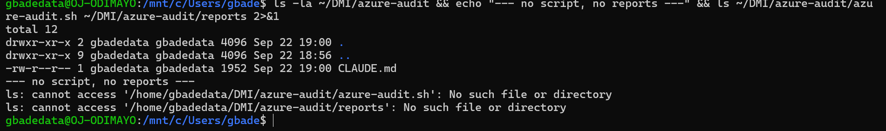

Claude Code was run in plan mode, which blocks edits at the tool level rather than relying on the prompt alone. The listing above is the evidence that nothing was created: only `CLAUDE.md` exists, and both `azure-audit.sh` and `reports/` return "No such file or directory".

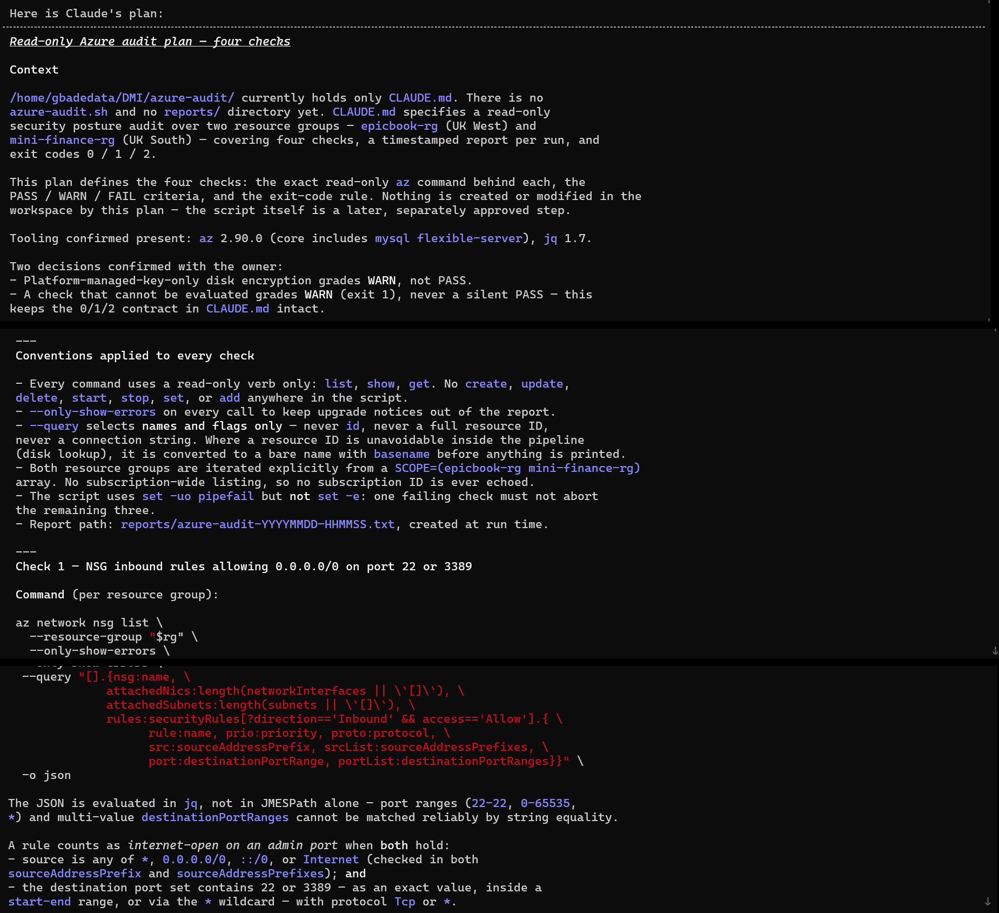

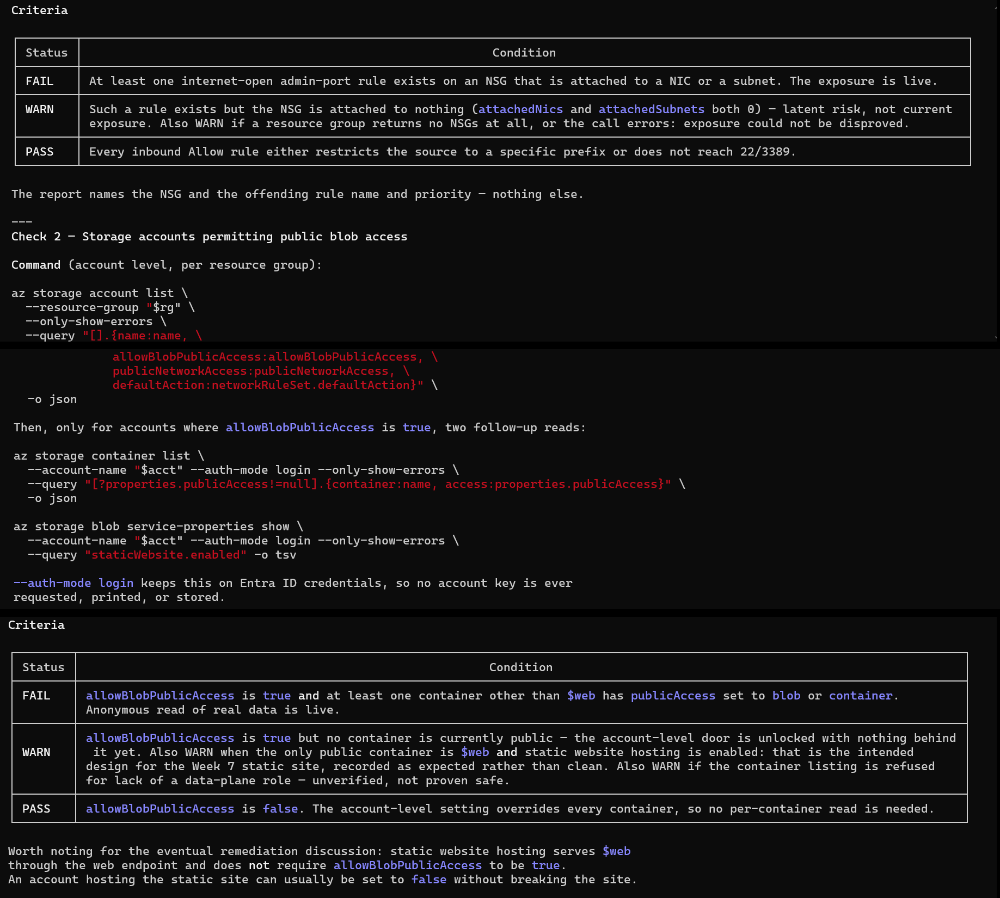

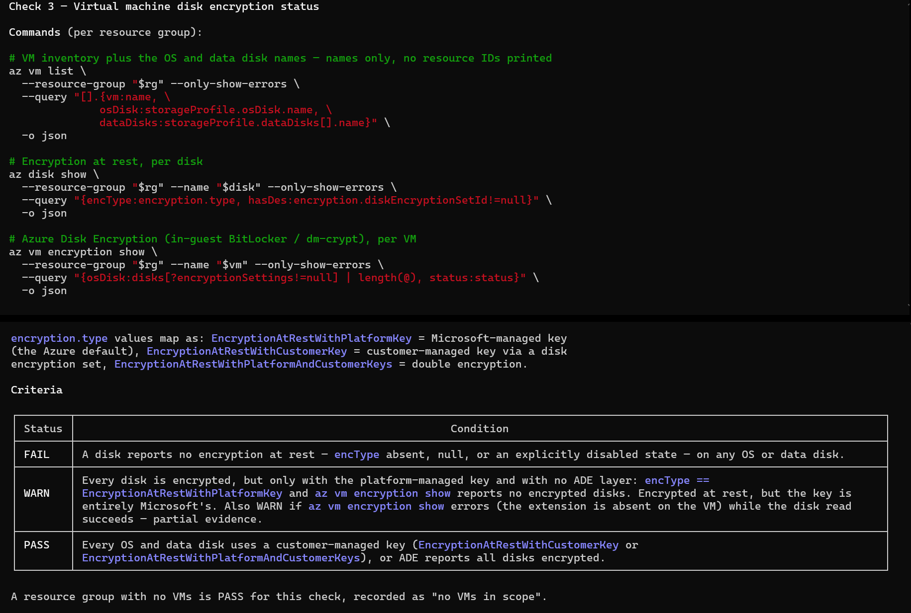

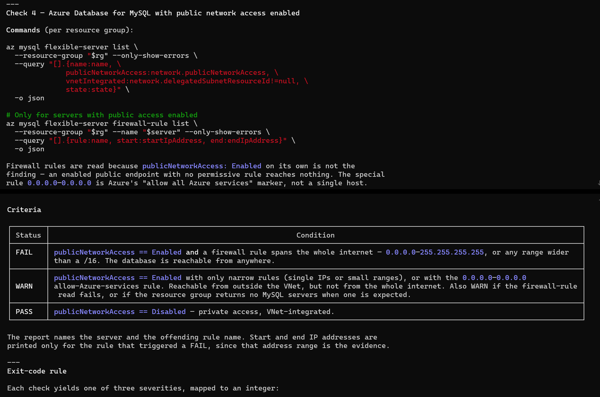

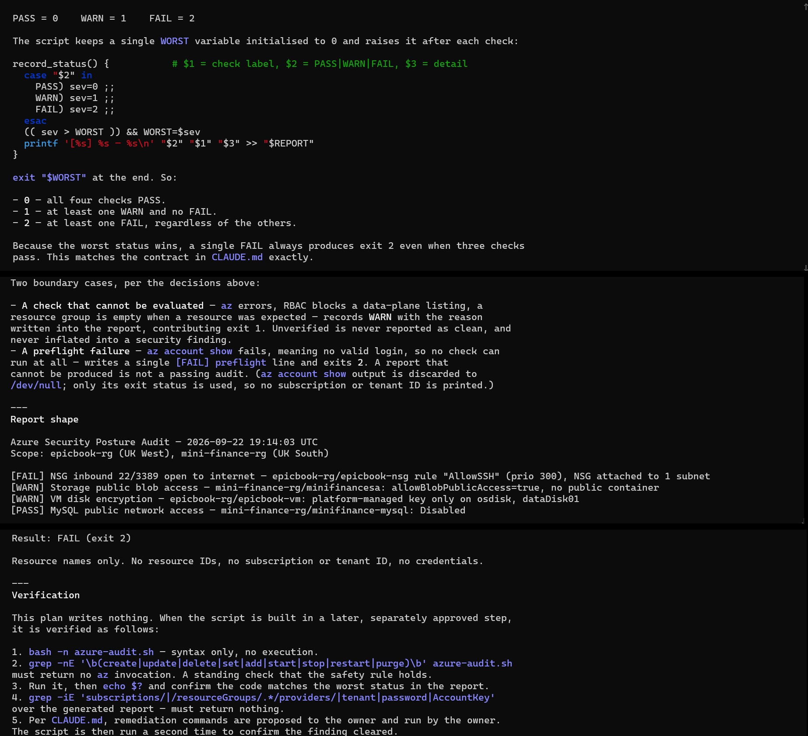

One design decision was settled before the plan was finalised. Azure encrypts every managed disk at rest by default with a platform-managed key, so a check that only asks whether encryption exists passes on every VM ever created and can never report anything. Platform-managed-key-only therefore grades WARN, with PASS reserved for a customer-managed key or Azure Disk Encryption, and FAIL for encryption genuinely absent. A check that cannot be evaluated also grades WARN rather than a silent PASS, so unverified is never reported as clean.

---

# Task 4 — Build the Azure Audit Bash Script

## Goal

Write a Bash script that runs the four checks from Task 3 using read-only `az` commands, writes a PASS/WARN/FAIL report with your Full Name, and exits with a different code for a healthy, warning, or failing result. Validate it with `bash -n` and make it executable.

### Evidence

#### Screenshot 4 — Your script open in your editor, showing the check functions and the `az` commands they call

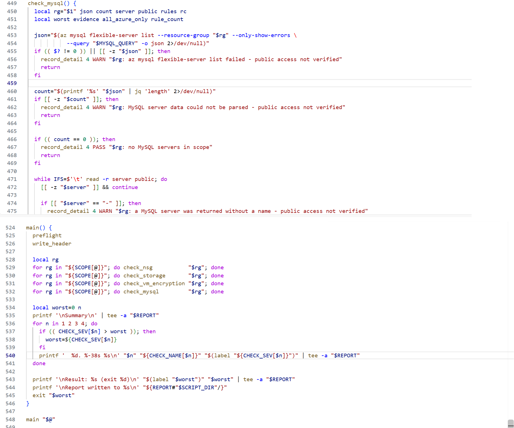

All ten `az` invocations use `list` or `show`. The script uses `set -uo pipefail` but deliberately not `set -e`, so one failing check cannot abort the other three.

---

#### Screenshot 5 — Output of `bash -n` (no syntax errors) and `ls -l` showing the script is executable

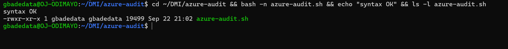

---

# Task 5 — Run the Script and Review the Baseline Report

## Goal

Run the script against your live resources and read the report honestly, even if it shows a real finding — do not fix anything yet.

### Evidence

#### Screenshot 6 — Script output showing your Full Name and all four checks with a PASS, WARN, or FAIL result

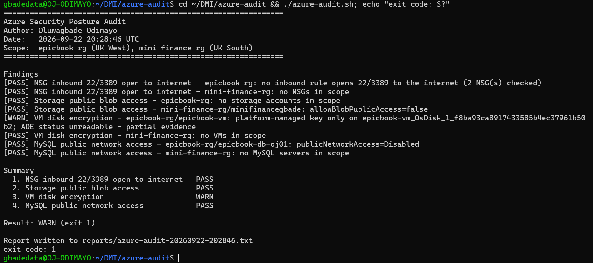

Baseline result: WARN, exit 1. Checks 1, 2 and 4 passed and Check 3 warned. Nothing was fixed at this stage.

Two of these deserve reading rather than skimming. Check 1's PASS is not vacuous: it examined two NSGs and found no inbound rule reaching 22 or 3389 from the internet, which reflects the SSH restriction applied when the VM was built in Assignment 5. Check 3's WARN came from the "ADE status unreadable" branch rather than the plain platform-key branch, because `az vm encryption show` exits non-zero when the extension is absent and the script treats a non-zero exit as unverified.

---

# Task 6 — Create and Run the /azure-audit Skill

## Goal

Create a Claude Code skill restricted to read-only tools (no `Write`) that runs your script, reads the report, and explains every finding with the risk of leaving it unresolved — without ever running a remediation command itself.

### Evidence

#### Screenshot 7 — Your skill file's frontmatter showing `allowed-tools` without `Write`

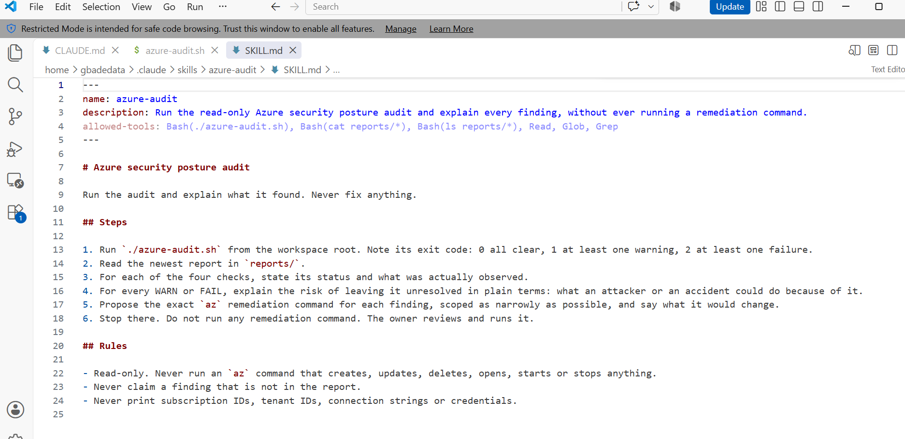

`allowed-tools` contains no `Write` and no `Edit`, and the Bash entries are scoped to running the script and reading reports. The skill can therefore run the audit and explain it, but cannot modify the script, the report or anything in Azure.

---

#### Screenshot 8 — `/azure-audit` output showing the baseline findings and Claude's explanation

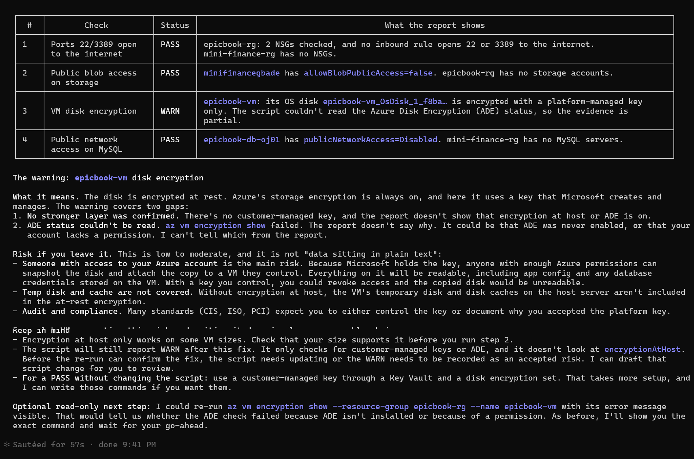

The skill ran the script, read the newest report, gave each check its status and evidence, explained the risk of the outstanding warning in concrete terms, proposed a remediation command, and stopped without running it.

It also flagged something worth keeping: its own recommended fix, encryption at host, would not clear the warning, because the script grades on customer-managed keys or ADE and does not read `securityProfile.encryptionAtHost`. A remediation that leaves the check still failing is worth knowing about before running it, not after.

---

# Task 7 — Fix a Real Finding and Re-Verify

## Goal

Pick one WARN or FAIL finding (or deliberately open an NSG rule to port 22 from `0.0.0.0/0` if your baseline was already clean), save that failing report, run the remediation command yourself — scoped to your own IP, not left open — and confirm the second audit run shows it resolved.

### Evidence

#### Screenshot 9 — Saved report showing the original finding before the fix

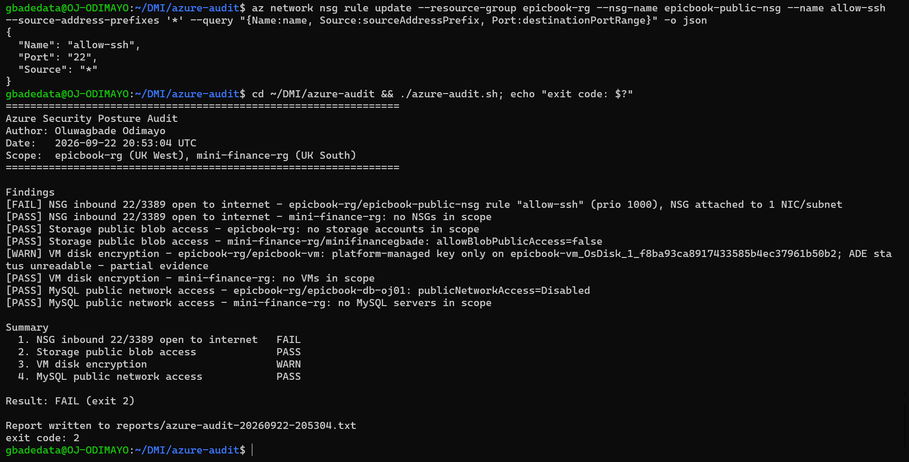

The baseline was clean on Check 1, so a finding was created deliberately, as the task permits, by widening the existing SSH rule to `0.0.0.0/0`:

    az network nsg rule update --resource-group epicbook-rg \
      --nsg-name epicbook-public-nsg --name allow-ssh \
      --source-address-prefixes '*'

The audit then reported `[FAIL] NSG inbound 22/3389 open to internet - epicbook-rg/epicbook-public-nsg rule "allow-ssh" (prio 1000), NSG attached to 1 NIC/subnet`, and exited 2. The detail matters: the script distinguishes an NSG attached to a NIC or subnet, which is live exposure and grades FAIL, from an unattached one, which is latent risk and grades WARN. This run also shows FAIL taking precedence over the disk encryption WARN in the exit code.

The saved report is `reports/azure-audit-20260922-205304.txt`.

**Why this finding rather than the disk encryption warning.** Neither route to clearing the disk warning fits the task. Azure Disk Encryption needs a Key Vault whose name is then reserved for 90 days by soft delete, and encryption at host needs a subscription-wide feature registration plus VM downtime and, as noted above, would not clear the check anyway. Neither is scoped to a single IP address. The NSG finding is the one this task is written for.

---

#### Screenshot 10 — Terminal output of the remediation command you ran yourself

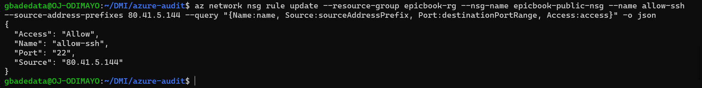

The fix restricts SSH to one address rather than closing the port entirely, so administrative access is preserved while the internet-wide exposure is removed. It was run by hand, not by the skill. SSH to the VM was confirmed working immediately afterwards, because a wrong address here locks you out of your own machine.

---

#### Screenshot 11 — Second `/azure-audit` run (or report) showing the finding resolved

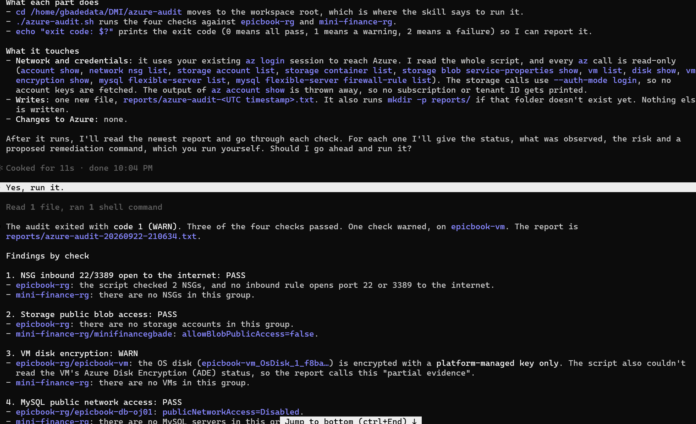

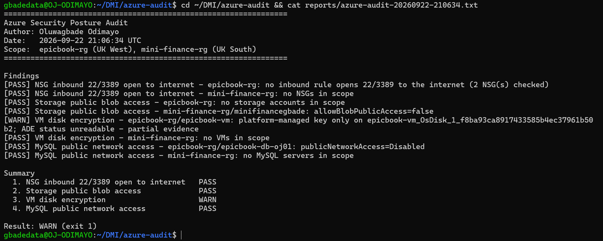

Check 1 returned to PASS and the overall result fell from FAIL (exit 2) to WARN (exit 1). The disk encryption WARN is still present, which is the point: the fix cleared exactly one finding and left the other untouched. A re-run that came back entirely green would have been the suspicious outcome.

The two reports sit side by side as before and after: `azure-audit-20260922-205304.txt` and `azure-audit-20260922-210634.txt`.

---

### Notes

Compare this assignment to the AWS audit you built in Week 6: which finding categories map to each other across the two clouds, and what stayed exactly the same about the workflow even though the `az`/`aws` commands are completely different?

**Which finding categories map across the two clouds.** All four map directly. An NSG inbound rule allowing `0.0.0.0/0` on port 22 is the same misconfiguration as a security group with an open SSH ingress rule; only the noun changes. Storage account public blob access is the S3 public-access story, with Azure's account-level `allowBlobPublicAccess` playing the role of the bucket-level public access block. VM disk encryption maps to EBS volume encryption. MySQL public network access maps to an RDS instance being publicly accessible. The underlying question is identical each time: is this thing reachable from the whole internet, and is the data at rest readable by someone who copies it.

**What stayed the same.** Everything except the commands. The script is still read-only by construction, writes a timestamped report with an author name, grades each check PASS, WARN or FAIL, and exits with a code that reflects the worst status. Claude still reads the report rather than the infrastructure, explains findings, proposes a command, and stops. The human still runs the fix and the second run still proves it. `aws ec2 describe-security-groups` became `az network nsg list`, but the shape of the work did not move.

**Where the two clouds differ in ways the audit had to account for.** Azure encrypts every managed disk at rest by default, which means the naive version of the disk check can never fail, so the grading had to distinguish who holds the key rather than whether encryption exists. AWS does not encrypt EBS volumes by default, so the same check there is a genuine binary. In the other direction, Azure's NSG rules carry port ranges and multi-value port lists, so matching on string equality is unreliable and the rule logic had to move into jq. A default `AllowVnetInBound` rule at priority 65000 also means an allow rule on its own restricts nothing, which is why the database subnet in Assignment 5 needed a matching deny rule to make its restriction real.

**What reading rather than running caught.** Three things, none of which would have shown up in a successful run. A jq filter used `end`, a reserved word, as an object key and a field access; testing proved this one a false alarm, but only testing could prove it. The MySQL firewall filter emitted a tab-separated line with an empty middle field, and because tab is an IFS whitespace character, bash collapsed the delimiters and shifted every variable left by one, which would have silently disabled a branch of Check 4 while the script still appeared to work. And a command carrying an obfuscation warning turned out to be a harmless JSON heredoc, but only after being read. The pattern that mattered was the same each time: read the command, then approve it.

---

# Submission Instructions

Complete all tasks in sequence.

Your submission must include:
- All 11 required screenshots
- Do not expose your Azure subscription ID, tenant ID, client secrets, or connection strings

---

# Completion Checklist

- [ ] Task 1: Azure resources confirmed and workspace created (Screenshot 1)
- [ ] Task 2: `CLAUDE.md` created with project context and safety rules (Screenshot 2)
- [ ] Task 3: Claude produced a read-only four-check plan before any script existed (Screenshot 3)
- [ ] Task 4: Audit script built, syntax-checked, and executable (Screenshots 4–5)
- [ ] Task 5: Baseline audit run and reviewed honestly (Screenshot 6)
- [ ] Task 6: `/azure-audit` skill created with no `Write` permission and run successfully (Screenshots 7–8)
- [ ] Task 7: A real finding fixed by you (not Claude) and re-verified as resolved (Screenshots 9–11)
- [ ] Notes comparing this to the Week 6 AWS audit completed
- [ ] No subscription IDs, tenant IDs, or credentials exposed

---

## 📌 About DMI & CloudAdvisory

DevOps Micro Internship (DMI) is a project-based DevOps program run by Pravin Mishra (The CloudAdvisory) focused on real-world execution, systems thinking, and career readiness.

It helps learners build strong DevOps foundations with hands-on experience.

---

## 📌 Resources

- 🌐 DMI Official Website: https://dmi.pravinmishra.com?utm_source=github&utm_medium=readme  
- 🎓 University: https://university.pravinmishra.com?utm_source=github&utm_medium=readme  
- 💬 Discord Community: https://discord.pravinmishra.com?utm_source=github&utm_medium=readme  
- 📝 Blog: https://dmi.pravinmishra.com/blog?utm_source=github&utm_medium=readme  
- ▶️ YouTube Playlist: https://www.youtube.com/playlist?list=PLFeSNDtI4Cho  
- 🔗 Pravin Mishra (LinkedIn): https://www.linkedin.com/in/pravin-mishra-aws-trainer/  
- 🏢 CloudAdvisory (LinkedIn): https://www.linkedin.com/company/thecloudadvisory/

---

*This submission is part of DevOps Micro Internship (DMI) — Agentic AI Track.*
