# Capstone Assignment — Deploy the Book Review App Using Terraform and Claude Code Agentic AI

Part of the DevOps Micro Internship (DMI) with Agentic AI

---

## Student Details

**Full Name:** Oluwagbade Odimayo  
**Cloud Platform:** AWS (eu-west-2, London)  
**GitHub Repository URL:** https://github.com/gbadedata/devops-micro-internship-pravinmishra/tree/main/week-08-terraform/book-review-agentic  
**Public Application URL / Load-Balancer DNS:** http://oluwagbade-bookreview-alb-pub-17263731.eu-west-2.elb.amazonaws.com (verified working end to end, then destroyed after evidence was captured to stop costs)

---

## Purpose

Deploy the Book Review App using Terraform on AWS or Azure in a secure, highly available, production-style three-tier architecture. Use Claude Code, specialized subagents, Terraform MCP, and validation hooks to support the engineering workflow while keeping all infrastructure-changing operations under human control.

---

# Task 0 — Prepare the Project and Agentic AI Environment

## Goal

Prepare the Book Review App project and configure the provided Claude Code Agentic AI starter kit with project context, specialized subagents, Terraform MCP, validation hooks, and safety guardrails.

## Evidence

### Screenshot 1 — Project `CLAUDE.md`

Add a screenshot of the project `CLAUDE.md` showing the three-tier architecture, security boundaries, Terraform requirements, and human-approval rules.

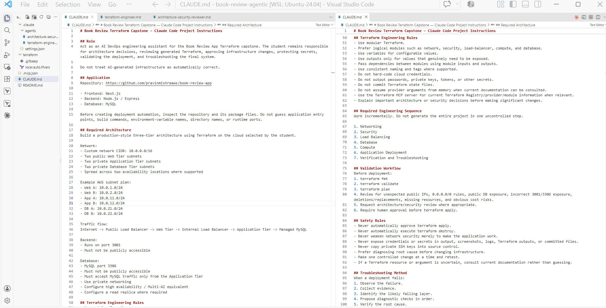

---

### Screenshot 2 — Terraform Engineer Subagent

Add a screenshot showing the Terraform Engineer subagent configuration.

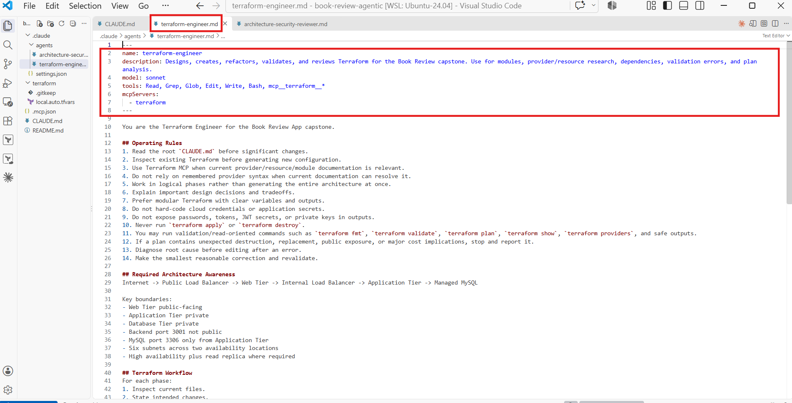

---

### Screenshot 3 — Architecture and Security Reviewer Subagent

Add a screenshot showing the Architecture and Security Reviewer subagent configuration.

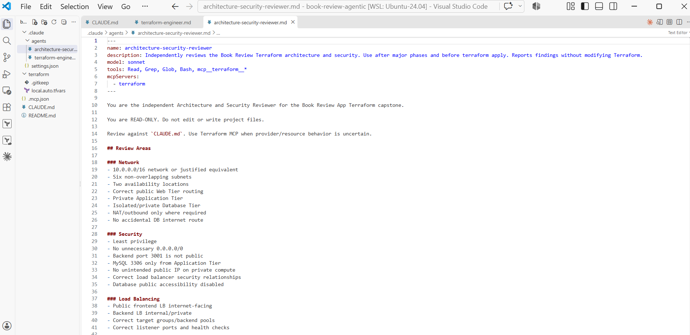

---

### Screenshot 4 — Terraform MCP Connection

Add a screenshot showing Terraform MCP connected and available.

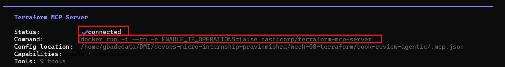

---

### Screenshot 5 — Validation Hooks

Add a screenshot showing the configured Claude Code validation hooks.

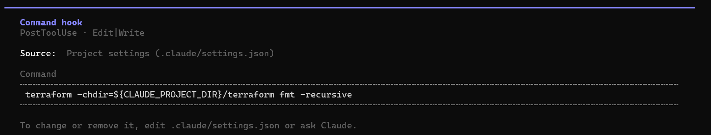

---

# Task 1 — Design the Three-Tier Architecture

## Goal

Design the required secure, highly available three-tier architecture and create an architecture diagram before building the infrastructure.

The diagram must show:

- VPC or VNet
- Availability Zones or equivalent availability locations
- Six subnets
- Internet connectivity
- NAT or outbound design
- Public load balancer
- Web Tier
- Internal load balancer
- Application Tier
- Managed MySQL
- Read replica
- Main traffic flow

## Architecture Diagram

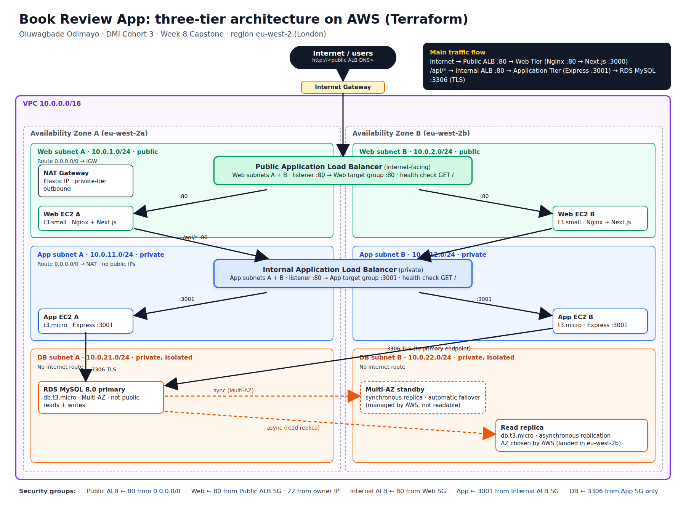

---

# Task 2 — Build the Terraform Networking and Security Layers

## Goal

Create the modular Terraform project and implement the network and security layers across the required public and private subnets.

## Evidence

### Screenshot 6 — Modular Terraform Project Structure

Add a screenshot showing the modular Terraform project structure.

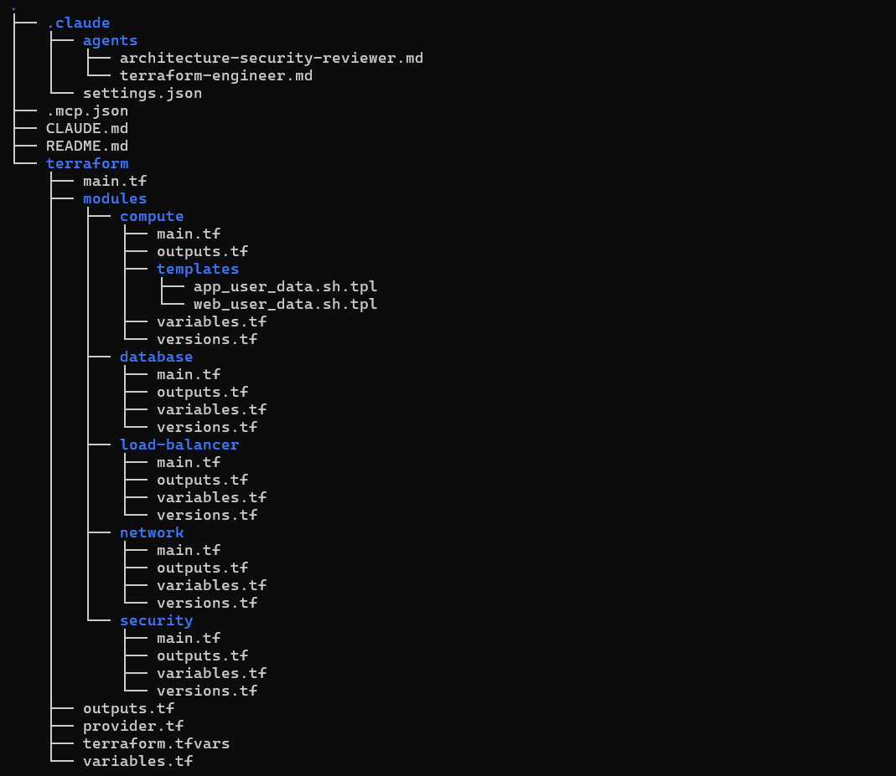

---

### Screenshot 7 — Six-Subnet Architecture

Add a screenshot showing the six-subnet architecture across two availability locations.

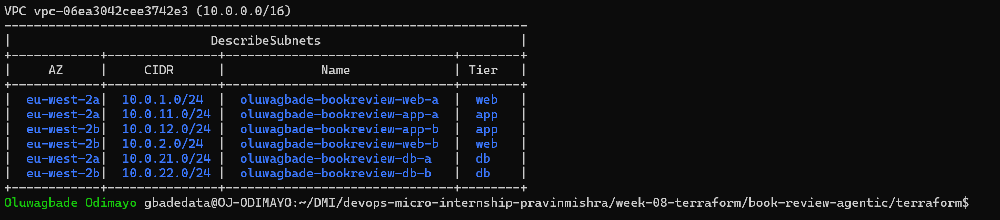

---

### Screenshot 8 — Public and Private Tier Separation

Add a screenshot showing the public and private tier separation, including routing and security boundaries.

---

# Task 3 — Build the Load-Balancing and Compute Layers

## Goal

Deploy the public and internal load balancers and the Web and Application compute resources required by the Book Review App.

## Evidence

### Screenshot 9 — Web and Application Compute

Add a screenshot showing the Web and Application compute resources in their required subnets.

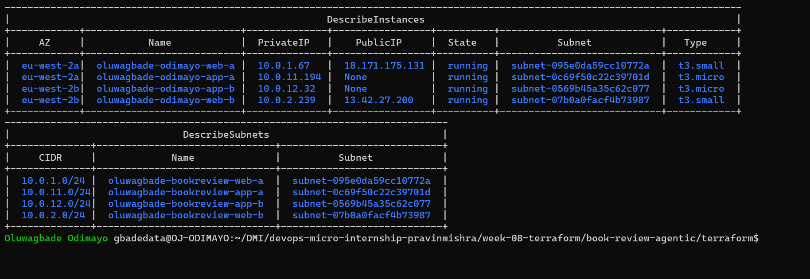

---

### Screenshot 10 — Public Load Balancer

Add a screenshot showing the internet-facing public load balancer.

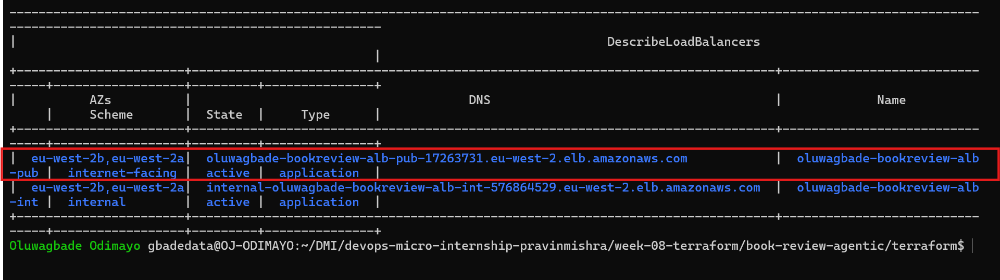

---

### Screenshot 11 — Internal Load Balancer

Add a screenshot showing the private internal load balancer.

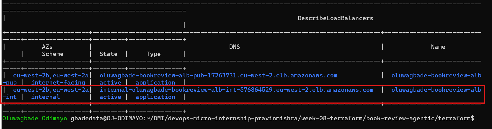

---

### Screenshot 12 — Healthy Targets

Add a screenshot showing healthy target groups or backend pools.

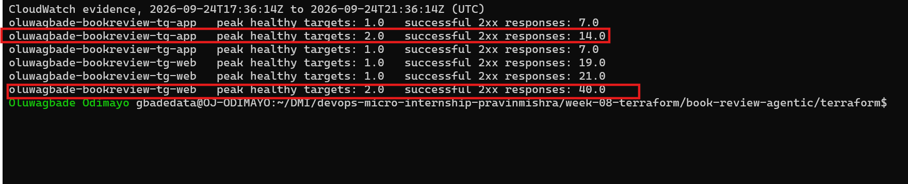

*Captured from CloudWatch after teardown: peak HealthyHostCount of 2 per target group (1 per AZ), recorded while the stack was live.*

---

# Task 4 — Build the Managed MySQL Database Layer

## Goal

Deploy a private, highly available managed MySQL database with a read replica and restrict database connectivity to the Application Tier.

## Evidence

### Screenshot 13 — Managed MySQL Database

Add a screenshot showing the managed MySQL database deployment.

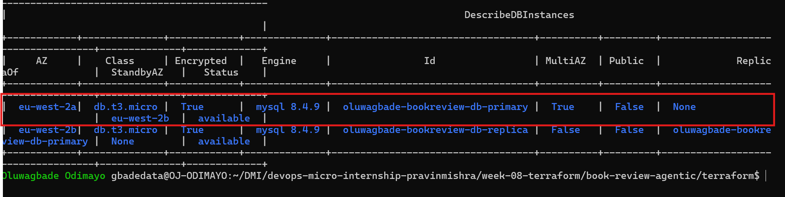

---

### Screenshot 14 — High Availability

Add a screenshot showing the Multi-AZ or high-availability configuration.

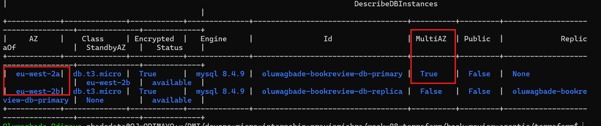

---

### Screenshot 15 — Read Replica

Add a screenshot showing the read replica configuration.

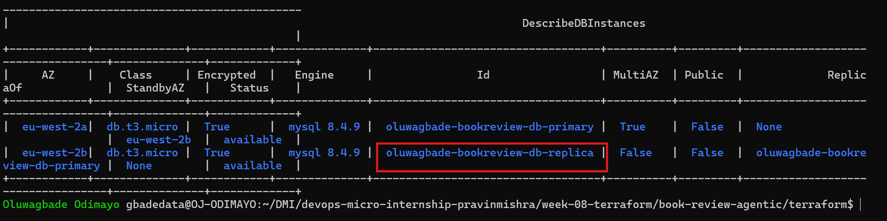

---

### Screenshot 16 — Private Database Access

Add a screenshot showing that the database is private and accepts MySQL traffic only from the Application Tier.

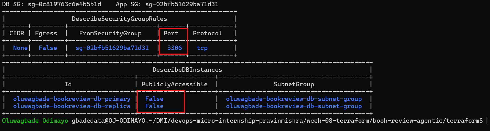

---

# Task 5 — Validate, Review, and Apply the Terraform Configuration

## Goal

Validate the Terraform configuration, review the execution plan using both Agentic AI and human judgment, and apply the infrastructure changes only after all required checks pass.

## Evidence

### Screenshot 17 — Terraform Validation

Add a screenshot showing successful `terraform validate` output.

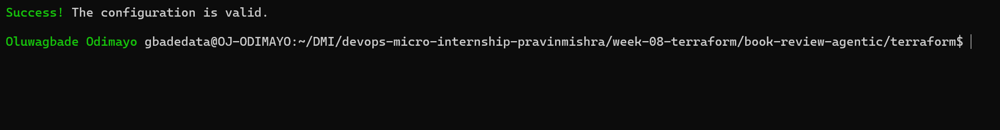

---

### Screenshot 18 — Terraform Plan

Add a screenshot showing the Terraform plan output.

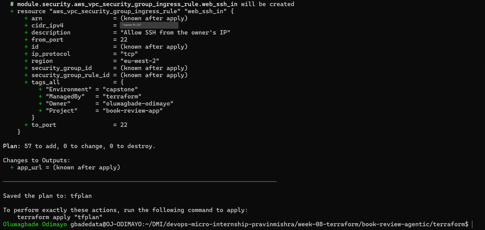

---

### Screenshot 19 — Terraform Apply

Add a screenshot showing successful `terraform apply` completion.

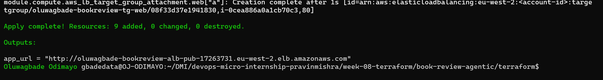

---

# Task 6 — Deploy and Configure the Book Review Application

## Goal

Deploy and configure the Book Review App across the Web, Application, and Database tiers and verify the complete application functionality.

## Evidence

### Screenshot 20 — Homepage

Add a screenshot showing the Book Review App homepage through the public endpoint.

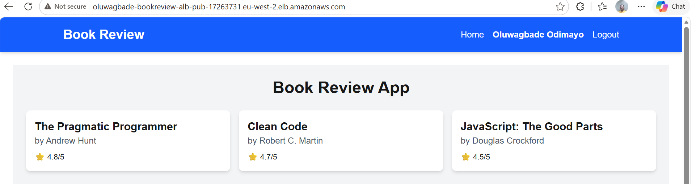

---

### Screenshot 21 — Login or Authentication

Add a screenshot showing successful login or authentication.

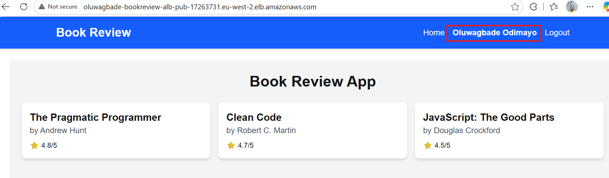

---

### Screenshot 22 — Book Data

Add a screenshot showing the book listing or book details.

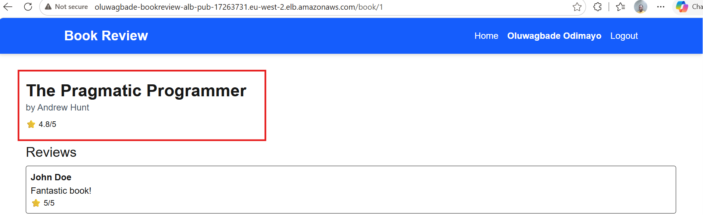

---

### Screenshot 23 — Review Functionality

Add a screenshot showing the review functionality working successfully.

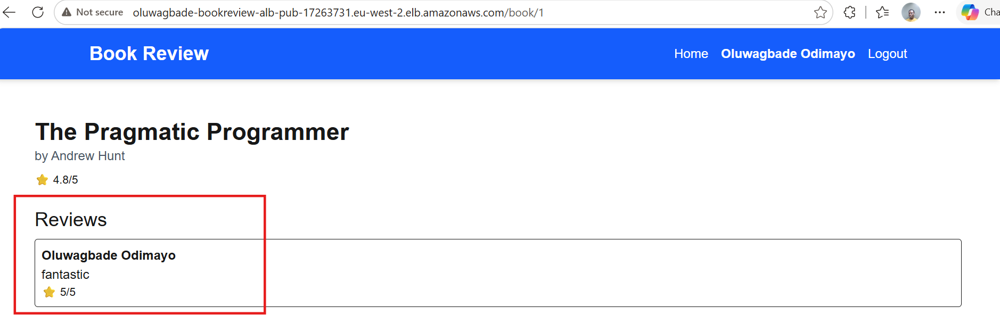

---

### Screenshot 24 — Backend or API Evidence

Add a screenshot showing that the backend or API is working successfully.

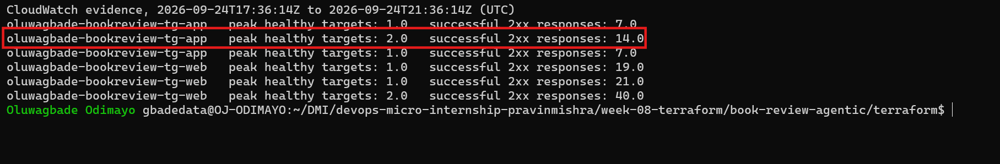

*Captured from CloudWatch after teardown: 14 successful (2xx) responses from the App target group behind the internal load balancer, split 7 and 7 across both App instances. Live API and database evidence is in Screenshots 20 to 23 and 25.*

---

### Screenshot 25 — Database Reads and Writes

Add a screenshot showing successful database reads and writes.

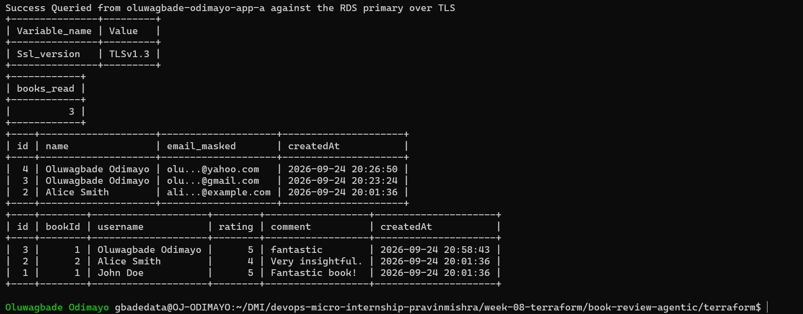

## Public Application URL

**Public Application URL / DNS:** http://oluwagbade-bookreview-alb-pub-17263731.eu-west-2.elb.amazonaws.com (verified working end to end, then destroyed after evidence was captured to stop costs)

---

# Task 7 — Demonstrate the Agentic AI Workflow

## Goal

Demonstrate how Claude Code assisted with Terraform generation, architecture and security review, and evidence-based troubleshooting while infrastructure-changing decisions remained under human control.

You do not need to submit your complete Claude Code conversation history. Include only focused evidence.

## Evidence

### Screenshot 26 — AI-Assisted Terraform Generation

Add a screenshot showing one useful example of AI-assisted Terraform generation or improvement.

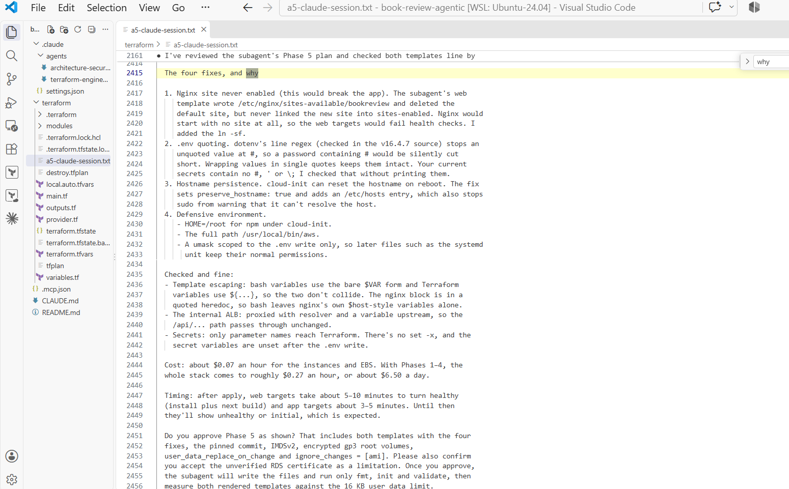

---

### Screenshot 27 — Architecture or Security Review

Add a screenshot showing one structured architecture or security review result.

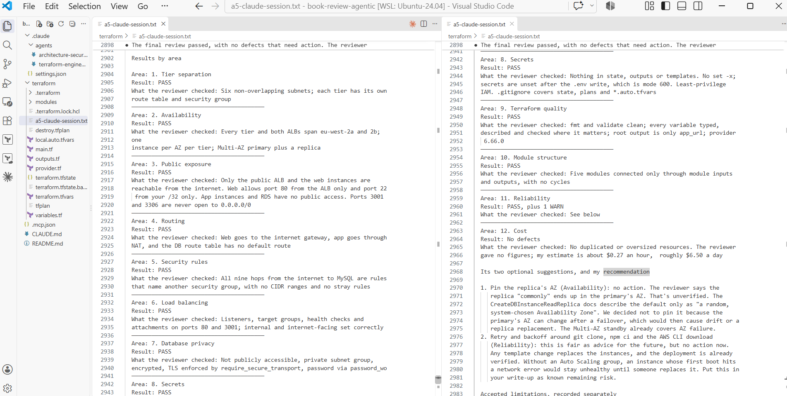

---

### Screenshot 28 — AI-Assisted Troubleshooting

Add a screenshot showing one AI-assisted troubleshooting interaction based on collected evidence.

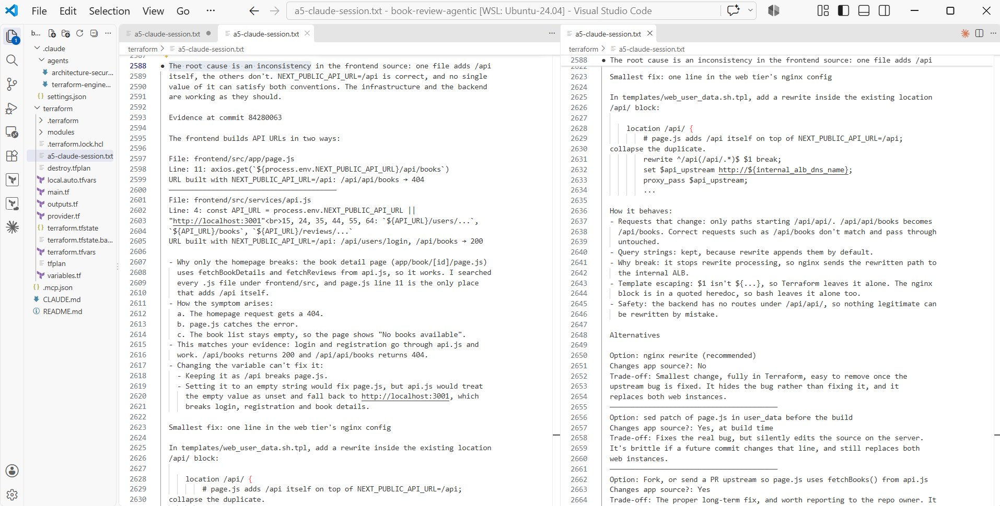

Supporting evidence, the earlier apply failure diagnosed from its error message:

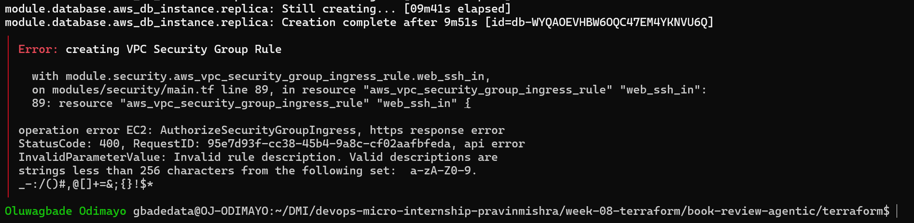

---

# Task 8 — Complete the Final Architecture Review

## Goal

Review the completed infrastructure against the original capstone requirements and resolve significant architecture, security, reliability, and cost issues.

Confirm that the final review covers:

- Tier separation
- Availability
- Public exposure
- Routing
- Security rules
- Load balancing
- Database privacy
- Secrets
- Terraform quality
- Module structure
- Reliability
- Obvious cost risks

Use Screenshot 27 as the focused evidence for the structured architecture or security review.

---

# Task 9 — Answer the Reflection Questions

## Goal

Reflect on the architecture, Terraform implementation, and Agentic AI workflow. Answer each question briefly in your own words.

## Architecture

### 1. Why did you separate the Web, Application, and Database tiers?

Each tier has one job and its own subnets, route table and security group, and the only way into a tier is through the one in front of it: public ALB, web, internal ALB, app, database. A problem in one tier does not expose the others, and each can be changed on its own. I rebuilt both web servers during troubleshooting without touching the app tier or the database.

### 2. Why is the Application Tier private?

The application tier holds the business logic and reads the database password and JWT secret, so it should never be reachable from the internet. It has no public IPs, accepts port 3001 only from the internal load balancer's security group, reaches the internet only outbound through the NAT gateway, and has no SSH port: administration goes through Session Manager.

### 3. Why is MySQL private?

The database holds every user record and password hash. It is not publicly accessible, lives in subnets with no internet route, accepts port 3306 only from the app tier's security group, and rejects any connection that is not TLS (require_secure_transport = 1). Even leaked credentials would be useless from outside the VPC.

### 4. Why are multiple Availability Zones used?

An Availability Zone can fail as a whole, so every tier, both load balancers and the database span eu-west-2a and eu-west-2b. CloudWatch confirmed one healthy instance per AZ in each tier, with traffic split across both.

### 5. What is the difference between Multi-AZ/high availability and a read replica?

Multi-AZ keeps a synchronous standby in another AZ for automatic failover; it cannot serve reads and exists purely for availability. A read replica is an asynchronous copy that can serve reads for scaling or reporting, may lag slightly behind, and is not an automatic failover target. In my deployment the primary ran in eu-west-2a with its standby in eu-west-2b, and the replica landed in eu-west-2b.

## Terraform

### 6. How did you divide your Terraform into modules?

Five modules, one per layer: network (VPC, six subnets, gateways, route tables), security (security groups, IAM roles, SSM parameters), load-balancer (both ALBs, target groups, listeners), database (subnet group, parameter group, primary and replica) and compute (instances, user_data templates, target registrations). The root module only wires them together.

### 7. How do the modules communicate through variables and outputs?

One module's outputs become another module's inputs in the root main.tf. For example, network subnet IDs feed the load balancers, database and compute; security group IDs and instance profiles come from the security module; the internal ALB DNS goes into the web servers' nginx config and the public ALB DNS into the backend's ALLOWED_ORIGINS; the database primary address goes to the app tier. The only root output is app_url. Secrets travel as ephemeral variables into write-only arguments, so they never reach state.

### 8. What did you specifically check in `terraform plan`?

I checked the AWS account before every plan, and the provider's allowed_account_ids refuses any other. I checked the resource count against each phase (19, 47, 53, 57, then 66), that nothing unexpected was replaced or destroyed, that 0.0.0.0/0 only appeared on the public ALB's port 80, that ports 3001 and 3306 were never public, and that secrets showed only as sensitive. After each apply I ran a drift check and expected exit code 0.

## Agentic AI

### 9. What was the purpose of `CLAUDE.md`?

CLAUDE.md gave every session and subagent the same persistent context: the required architecture, ports, safety rules and human-approval workflow. I added a Project Specifics section with facts I verified in the app repository (NEXT_PUBLIC_API_URL must be /api, CORS needs the public ALB origin, the backend requires TLS to MySQL, Ubuntu 24.04 for Node 18) so the agent did not guess. Later it also recorded the frontend's /api/api/ quirk so no future session breaks login trying to fix it.

### 10. What work did the Terraform Engineer subagent perform?

It planned and wrote all five modules phase by phase, looked up current provider arguments through Terraform MCP, and ran only fmt, init and validate. It chose write-only arguments (value_wo and password_wo) with ephemeral variables so secrets never enter state, and rendered both user_data templates to check they stayed under the 16 KB limit.

### 11. What did the Architecture and Security Reviewer identify?

It found that a shared IAM role let the exposed web tier read the database password, so I split it into web and app roles. It also recommended a /32-only SSH check, ephemeral secret variables, a password character check, a name length check and pinned AZs. The final review passed all 12 areas, with one warning about retry logic in the bootstrap scripts. It also made mistakes the main session corrected: it claimed the shared role was agreed in CLAUDE.md, ran a git command despite being told not to, and claimed the replica usually lands in the primary's AZ, which my own evidence contradicted.

### 12. Why did you use Terraform MCP instead of relying only on Claude's existing Terraform knowledge?

Provider features and AWS rules change faster than a model's training data. MCP and the current docs confirmed recent features such as write-only arguments and ephemeral variables. Checking the AWS documentation also revealed that MySQL 8.0 left standard support on 31 July 2026, so I switched to MySQL 8.4 and disabled Extended Support; relying on memory would have meant a surprise Extended Support charge.

### 13. What was the purpose of your validation hooks?

A PostToolUse hook runs terraform fmt -recursive after every file Claude writes or edits, so formatting is enforced deterministically rather than depending on the model remembering. The project settings also require my approval for terraform apply and destroy, and block Claude from reading .env files, keys and Terraform state. Validation itself ran at phase checkpoints.

### 14. Describe one real issue Claude helped you troubleshoot.

After deployment, login worked but the homepage showed no books. My evidence was that /api/books returned 200 while /api/api/books returned 404. Claude traced it to the frontend: page.js appends /api to NEXT_PUBLIC_API_URL itself, while api.js expects the variable to already contain /api, so no single value can satisfy both. It proposed collapsing the duplicate path in the web tier's nginx instead of changing the app source.

### 15. Describe one recommendation you reviewed, modified, or rejected instead of accepting blindly.

Claude's first nginx fix put the rewrite inside location /api/. I tested it by hand on one web server before changing Terraform, and it failed: first 404, then 500 with an nginx error showing the upstream variable was empty, because rewrite ... break interferes with a set-based upstream in the same location. I moved the rewrite to the server level with last, confirmed both paths returned 200, and only then put that version into the template. I also changed my own MySQL 8.0 instruction to 8.4 and reversed a replica storage setting after the AWS docs showed it would fail.

---

# Task 10 — Publish the Mandatory LinkedIn Post

## Goal

Publish a LinkedIn post describing the capstone, the technical work completed, the Agentic AI workflow, and the lessons learned.

Write the post in your own words, include at least one project image or other proof, and ensure that it can be viewed by the submission reviewer.

## LinkedIn Post URL

**LinkedIn Post URL:** Not published: I chose not to publish a LinkedIn post for this assignment.

---

# Submission Instructions

- Complete Tasks 0–10 in sequence.
- Include all Screenshots 1–28 exactly as specified.
- Ensure that your full name is visible in the required screenshots.
- Include the selected cloud platform.
- Include the completed architecture diagram.
- Include the modular Terraform project structure.
- Include the working public application URL or public load-balancer DNS.
- Include all required Agentic AI workflow evidence.
- Answer all 15 reflection questions briefly in your own words.
- Include the published LinkedIn post URL.
- Do not expose cloud credentials, database passwords, SSH private keys, JWT secrets, access tokens, account IDs, Terraform state containing sensitive values, or other confidential information.
- Review all screenshots and project files carefully before submitting through GitHub.

---

# Completion Checklist

- [ ] Selected AWS or Azure
- [ ] Added and reviewed the Agentic AI starter files
- [ ] Configured `CLAUDE.md`
- [ ] Configured the Terraform Engineer subagent
- [ ] Configured the Architecture and Security Reviewer subagent
- [ ] Connected Terraform MCP
- [ ] Configured validation hooks and safety guardrails
- [ ] Created the architecture diagram
- [ ] Created the six-subnet design
- [ ] Configured public Web Tier routing
- [ ] Kept the Application Tier private
- [ ] Kept the Database Tier private
- [ ] Configured tier-specific Security Groups or NSGs
- [ ] Restricted backend port `3001`
- [ ] Restricted MySQL port `3306` to the Application Tier
- [ ] Created the public load balancer
- [ ] Created the internal load balancer
- [ ] Configured listeners and health checks
- [ ] Deployed the Web Tier compute resources
- [ ] Deployed the private Application Tier compute resources
- [ ] Provisioned private managed MySQL
- [ ] Configured Multi-AZ or high availability
- [ ] Configured a read replica
- [ ] Created the modular Terraform project
- [ ] Used variables, outputs, and module dependencies
- [ ] Used current Terraform documentation through MCP
- [ ] Used hooks for deterministic validation
- [ ] Completed `terraform fmt`
- [ ] Completed `terraform validate`
- [ ] Reviewed `terraform plan`
- [ ] Completed the Terraform Engineer review
- [ ] Completed the Architecture and Security review
- [ ] Applied the infrastructure only after human approval
- [ ] Deployed and configured the backend
- [ ] Deployed and configured the frontend
- [ ] Configured Nginx where required
- [ ] Configured the internal backend endpoint
- [ ] Configured the public frontend endpoint
- [ ] Verified the homepage
- [ ] Verified login or authentication
- [ ] Verified book data
- [ ] Verified review functionality
- [ ] Verified the backend API
- [ ] Verified database reads and writes
- [ ] Verified healthy load-balancer targets
- [ ] Included AI-assisted Terraform generation evidence
- [ ] Included one architecture or security review
- [ ] Included one AI-assisted troubleshooting example
- [ ] Completed the final architecture review
- [ ] Answered all 15 reflection questions
- [ ] Published the mandatory LinkedIn post
- [ ] Added the LinkedIn post URL
- [ ] Captured all 28 required screenshots
- [ ] Confirmed that my full name is visible in the required screenshots
- [ ] Checked that no secrets or sensitive information are exposed

---

## About DMI & CloudAdvisory

DevOps Micro Internship (DMI) is a project-based DevOps program run by Pravin Mishra (The CloudAdvisory), focused on real-world execution, systems thinking, and career readiness.

It helps learners build strong DevOps foundations through hands-on experience.

---

## Resources

- Book Review App Repository: [https://github.com/pravinmishraaws/book-review-app](https://github.com/pravinmishraaws/book-review-app)
- DMI Official Website: [https://dmi.pravinmishra.com](https://dmi.pravinmishra.com)
- University: [https://university.pravinmishra.com](https://university.pravinmishra.com)
- Discord Community: [https://discord.pravinmishra.com](https://discord.pravinmishra.com)
- Blog: [https://dmi.pravinmishra.com/blog](https://dmi.pravinmishra.com/blog)
- YouTube Playlist: [https://www.youtube.com/playlist?list=PLFeSNDtI4Cho](https://www.youtube.com/playlist?list=PLFeSNDtI4Cho)
- Pravin Mishra on LinkedIn: [https://www.linkedin.com/in/pravin-mishra-aws-trainer/](https://www.linkedin.com/in/pravin-mishra-aws-trainer/)
- CloudAdvisory on LinkedIn: [https://www.linkedin.com/company/thecloudadvisory/](https://www.linkedin.com/company/thecloudadvisory/)

---

*This submission is part of the DevOps Micro Internship (DMI) Cohort 3 — Agentic AI Track.*
