# Assignment 6 — AI-Assisted Terraform Drift and Policy Review

Part of the DevOps Micro Internship (DMI) with Agentic AI

---

## Student Details

**Full Name:** Oluwagbade Odimayo  
**GitHub Repository/Folder URL:** https://github.com/gbadedata/devops-micro-internship-pravinmishra/tree/main/week-08-terraform/tf-drift-review

---

## Purpose

Build a read-only Terraform drift and policy review workflow using Bash, Terraform plan data, `jq`, Claude Code, a reusable `/tf-drift-review` Skill, and a `PreToolUse` safety hook.

The workflow must follow this pattern:

```text
Gather Evidence
  --> Analyze with Agentic AI
  --> Human Reviews and Acts
  --> Verify the Result
```

The `/tf-drift-review` Skill and `tf-drift-check.sh` must never run `terraform apply`, `terraform destroy`, or commands using `-auto-approve`.

---

# Task 1 — Confirm the Clean Baseline and Create the Workspace

## Goal

Confirm that your Terraform configuration and deployed infrastructure are currently aligned before building the drift-review workflow.

## Evidence

### Screenshot 1 — Clean Terraform Plan

Add a screenshot of `terraform plan` showing no pending changes.

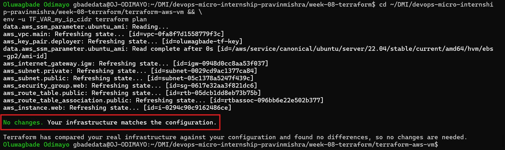

---

### Screenshot 2 — Assignment Workspace

Add a screenshot of the folder structure showing `AI Assignment/`, `reports/`, and the Terraform project.

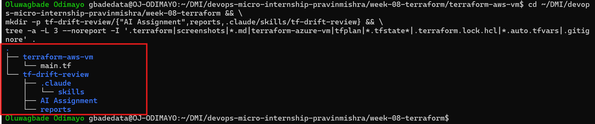

## Questions

### 1. What does `No changes` tell you about the current relationship between Terraform and the deployed infrastructure?

Terraform refreshed the real AWS resources, compared them with the state file and with `main.tf`, and found all three in agreement. Nothing would be created, changed or destroyed if I ran apply.

### 2. Why is a clean baseline important before introducing a test change?

It means any difference I see later was caused by my test change and nothing else. If the baseline already had pending changes, I could not tell which difference was mine or prove that the checks were detecting the right thing.

---

# Task 2 — Create Project Context and Safety Rules in `CLAUDE.md`

## Goal

Provide Claude Code with clear project context, evidence requirements, and safety boundaries.

## Evidence

### Screenshot 3 — Project Context and Safety Rules

Add a screenshot of `CLAUDE.md` open in VS Code showing the Project Overview, Review Workflow, Safety Rules, and Output Rules.

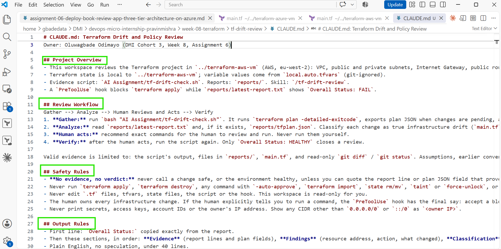

## Questions

### 1. Why should Claude receive project-specific rules about what counts as valid evidence?

Without rules, Claude can fill gaps with assumptions or general AWS knowledge and still sound confident. Defining valid evidence (the script output, the reports, `main.tf` and `git diff`) makes every conclusion traceable to something I can check myself.

### 2. Why must the human remain responsible for running `terraform apply`?

`terraform apply` changes real infrastructure, costs money and cannot always be undone. The human is accountable for that and has context an agent can miss. During this assignment a plan run under the wrong AWS profile proposed rebuilding all 9 resources in another account, which is exactly the kind of mistake a person has to catch before anything is applied.

### 3. Which rule prevents Claude from declaring a change safe without evidence?

The "No evidence, no verdict" rule in the Safety Rules section: Claude may only call a change safe, or the environment healthy, if it can quote the report line or plan JSON field that proves it. If evidence is missing it must say "cannot determine" and stop.

---

# Task 3 — Build the Terraform Drift and Policy Check Script

## Goal

Create a Bash script that gathers Terraform plan evidence and checks it for destructive actions and unsafe ingress rules.

## Evidence

### Screenshot 4 — Script Variables and Checks Array

Add a screenshot of the top section of `tf-drift-check.sh` showing the variables and `checks` array.

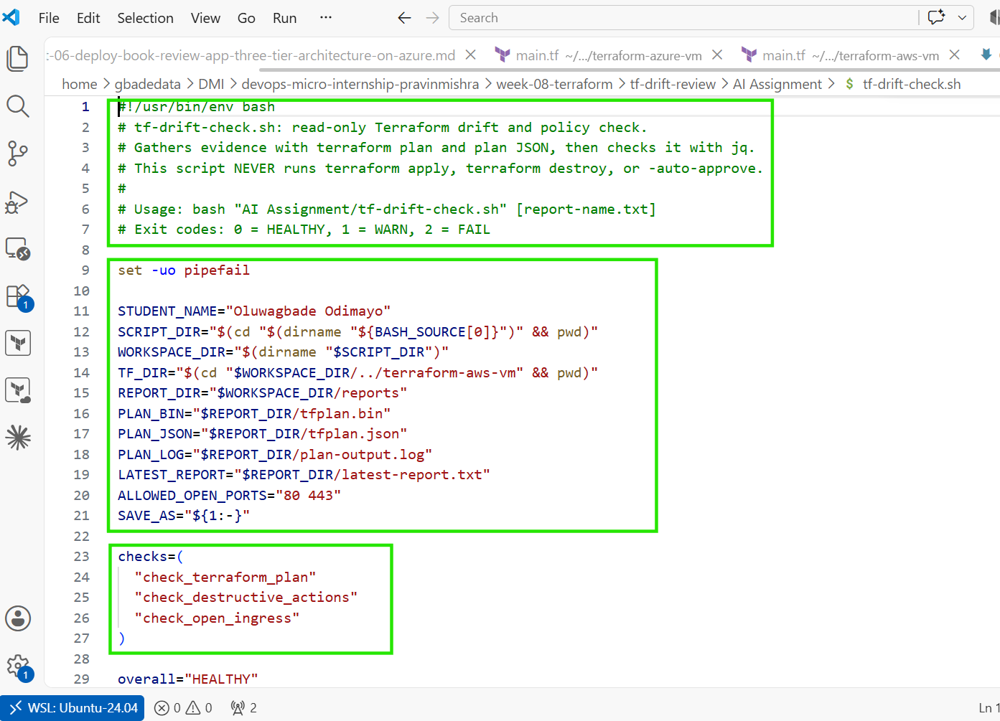

---

### Screenshot 5 — Destructive-Action and Open-Ingress Checks

Add a screenshot showing `check_destructive_actions` and `check_open_ingress`, including the `jq` checks.

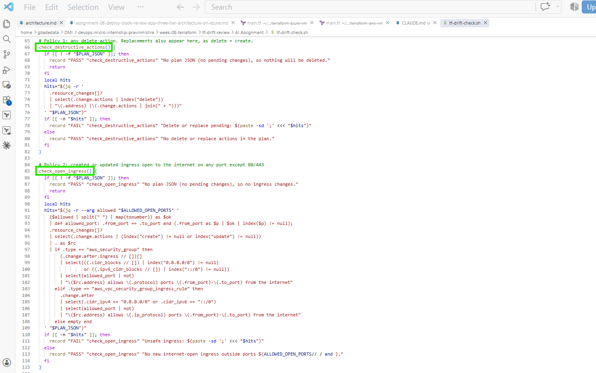

---

### Screenshot 6 — Script Validation and Permissions

Add a screenshot showing successful `bash -n` and `ls -l` output.

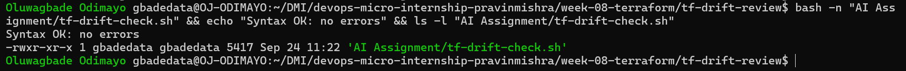

## Questions

### 1. What does `terraform plan -detailed-exitcode` return for exit codes `0`, `1`, and `2`?

`0` means the plan succeeded and there are no changes. `1` means Terraform hit an error. `2` means the plan succeeded and changes are pending.

### 2. Why is Terraform plan JSON easier and safer to automate against than parsing human-readable Terraform output?

Plan JSON has a fixed structure (`resource_changes`, `change.actions`, `before` and `after`), so jq can query exact fields. The human-readable output is formatted for people: it has colour codes, hides unchanged attributes and can change between Terraform versions, so parsing it is fragile and a change could be missed silently. I hit this myself when colour codes stopped a `grep` on the `Plan:` line from matching.

### 3. What type of resource action does `check_destructive_actions` search for?

Any resource whose `change.actions` list contains `delete`, meaning a destroy or a replacement.

### 4. Why does finding a `delete` action also help detect replacements?

Terraform represents a replacement as two actions on the same resource, `delete` plus `create` (in either order). Searching for `delete` therefore catches plain deletions and replacements with one check.

### 5. Why must this script never run `terraform apply`?

The script gathers evidence, so it must be safe to run at any time, by anyone, including an AI agent. If it could apply, running a check could change the environment and the human decision would disappear. Because it is read-only, the worst case is a wrong report, not a broken environment.

---

# Task 4 — Run the Script Against the Clean Baseline

## Goal

Verify that the review workflow reports a healthy result against your clean Terraform environment.

## Evidence

### Screenshot 7 — Healthy Baseline Report

Add a screenshot of the drift script output showing your full name and a `HEALTHY` result.

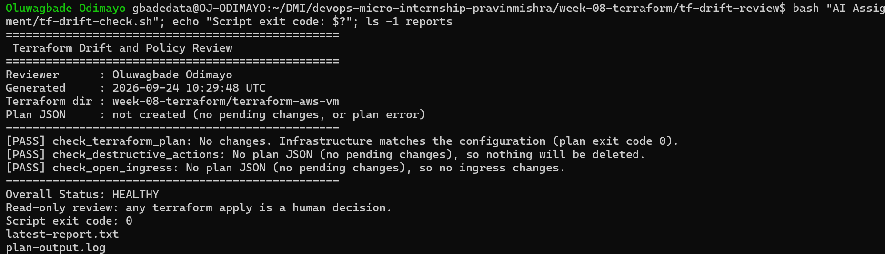

---

### Screenshot 8 — Baseline Script Exit Code

Add a screenshot showing the captured script exit code `0`.

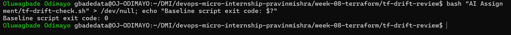

## Questions

### 1. What is the Overall Status of your baseline?

`HEALTHY`.

### 2. Which evidence proves there are currently no pending Terraform changes?

`[PASS] check_terraform_plan: No changes. Infrastructure matches the configuration (plan exit code 0).`, together with the script's own exit code `0`.

### 3. Was `reports/tfplan.json` created? Explain why or why not.

No. The script only exports plan JSON when `terraform plan` returns exit code `2` (changes pending). With exit code `0` there is nothing to inspect, and the script deletes any leftover plan file so an old JSON file can never be mistaken for current evidence. `ls reports` showed only `latest-report.txt` and `plan-output.log`.

---

# Task 5 — Create and Run the `/tf-drift-review` Claude Code Skill

## Goal

Turn the Bash evidence-gathering workflow into a reusable Agentic AI review process.

## Evidence

### Screenshot 9 — `/tf-drift-review` Skill Configuration

Add a screenshot of `SKILL.md` showing the frontmatter, allowed tools, and safety rules.

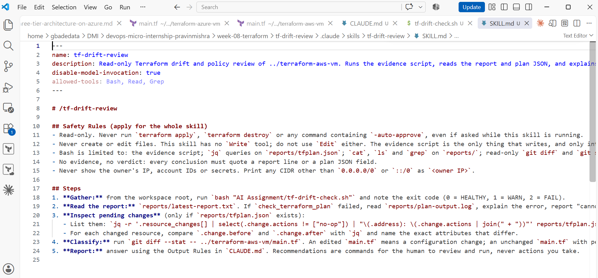

---

### Screenshot 10 — Clean Agentic AI Review

Add a screenshot of `/tf-drift-review` showing the clean `HEALTHY` result.

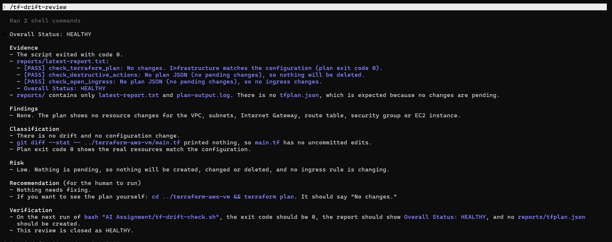

## Questions

### 1. Why does this Skill have `Bash`, `Read`, and `Grep`, but not `Write`?

`Bash` runs the evidence script and read-only `jq` and `git diff` commands, and `Read` and `Grep` inspect the reports. `Write` is left out because a review should not modify code, state or evidence: a reviewer that can edit what it is reviewing could "fix" the result instead of reporting it. The only file writing happens inside the deterministic script, and only into `reports/`.

### 2. Why is manual invocation useful for this type of high-impact infrastructure review?

`disable-model-invocation: true` means the skill runs only when I type `/tf-drift-review`. The review calls `terraform plan` against a real AWS account, so I want it to happen at moments I choose, such as before an apply, not whenever Claude decides it might be relevant.

### 3. Which part of the workflow is deterministic Bash automation?

`tf-drift-check.sh`: it runs `terraform plan -detailed-exitcode`, exports plan JSON with `terraform show -json`, runs the two jq policy checks and sets the overall status and exit code. The same input always gives the same output.

### 4. Which part requires Claude's reasoning?

Interpreting the evidence: reading the report and plan JSON, finding the exact attribute that changed, deciding whether it is true drift or a configuration change using `git diff`, rating the risk and explaining the fix in plain English.

### 5. Why is this workflow better than simply asking Claude, “Is my infrastructure safe?”

A chatbot asked that question has no view of my infrastructure and can only answer from general knowledge. This workflow grounds the answer in a fresh plan, fixed policy checks and rules that require every conclusion to cite evidence, so the result is repeatable and I can verify it.

---

# Task 6 — Introduce a Controlled Difference and Detect It

## Goal

Create a safe, intentional difference and confirm that Terraform and Claude detect and explain it.

## Evidence

### Screenshot 11 — Controlled Difference

Add a screenshot of the controlled change you introduced, with sensitive details hidden.

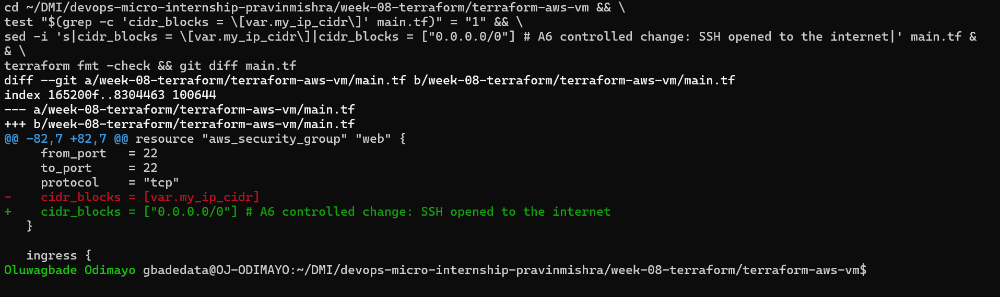

---

### Screenshot 12 — Detected Difference and Risk Assessment

Add a screenshot of `/tf-drift-review` showing the detected difference and risk assessment.

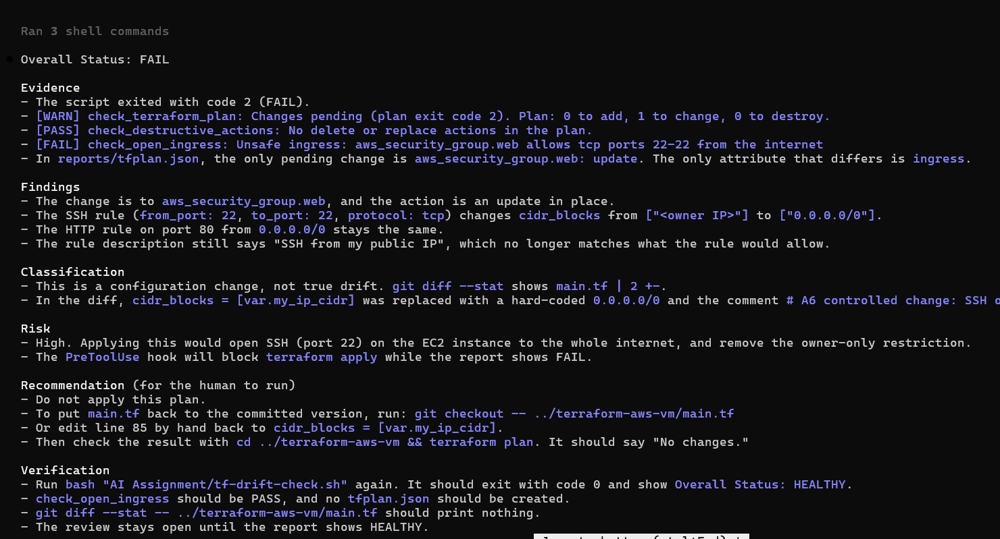

---

### Screenshot 13 — Detected Drift Report

Add a screenshot of `drift-detected-report.txt` showing your full name and the `WARN` or `FAIL` result.

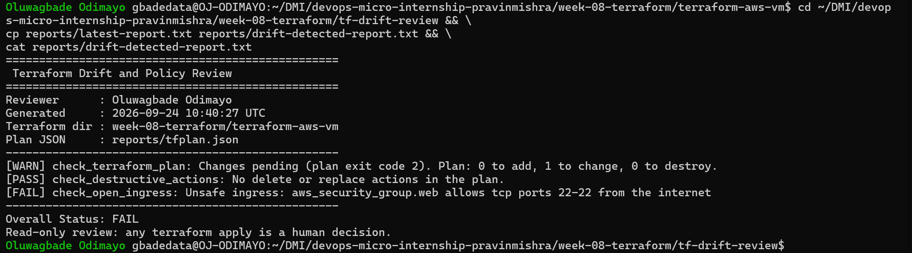

## Questions

### 1. What change did you introduce?

In `main.tf` I changed the SSH ingress rule on `aws_security_group.web` from `cidr_blocks = [var.my_ip_cidr]` to `cidr_blocks = ["0.0.0.0/0"]`, opening port 22 to the internet.

### 2. Was it true infrastructure drift or a Terraform configuration change?

A Terraform configuration change. I edited the code and the real security group in AWS was never touched. `git diff` showed the edit in `main.tf`, and the change was never applied.

### 3. What Terraform plan evidence proves that a change is pending?

`terraform plan -detailed-exitcode` returned exit code `2` with `Plan: 0 to add, 1 to change, 0 to destroy.`, and `reports/tfplan.json` listed `aws_security_group.web` with action `update`.

### 4. Was the action an update, deletion, replacement, or security-rule change?

A security-rule change, made as an in-place update. There was no deletion and no replacement, so `check_destructive_actions` passed while `check_open_ingress` failed.

### 5. What did Claude recommend?

Do not apply the plan. Revert `main.tf` with `git checkout -- ../terraform-aws-vm/main.tf` (or change line 85 back to `cidr_blocks = [var.my_ip_cidr]`), confirm with `terraform plan` that there are no changes, then re-run the drift check and expect `HEALTHY`.

### 6. Why should you review the recommendation before taking action?

The recommendation is an AI's reading of the evidence and can be wrong or incomplete. In this review Claude stated that the `PreToolUse` hook would block an apply, but I had not created the hook yet; it took that from `CLAUDE.md`, not from evidence. I am accountable for the environment, so I check the reasoning before acting.

---

# Task 7 — Add a `PreToolUse` Hook to Block Unsafe Apply Attempts

## Goal

Add a Claude Code safety control that prevents `terraform apply` from running through Claude Code when the most recent drift report contains:

```text
Overall Status: FAIL
```

## Evidence

### Screenshot 14 — `PreToolUse` Safety Hook

Add a screenshot of `.claude/settings.json` showing the `PreToolUse` safety hook.

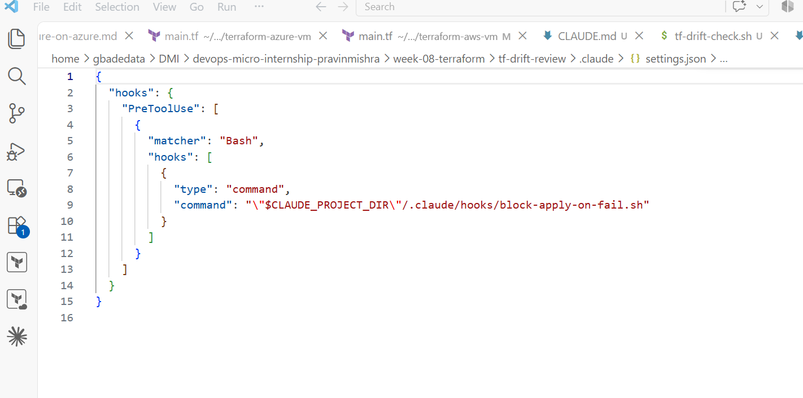

---

### Screenshot 15 — Blocked Apply Attempt

Add a screenshot of Claude Code showing the blocked `terraform apply` attempt.

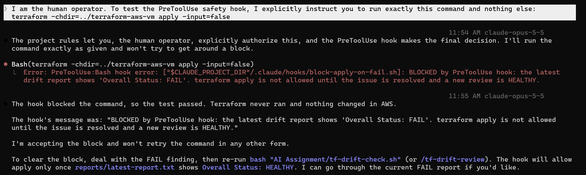

## Questions

### 1. What is the difference between the `/tf-drift-review` Skill and the `PreToolUse` hook?

The skill is an on-demand review: Claude runs the script, reasons about the evidence and recommends what to do. The hook is an automatic, deterministic check that runs before every Bash tool call and can block it. The skill advises; the hook enforces.

### 2. Which component performs analysis?

The `/tf-drift-review` skill, with Claude reasoning over the script's evidence.

### 3. Which component enforces the safety gate?

The `PreToolUse` hook (`.claude/hooks/block-apply-on-fail.sh`, registered in `.claude/settings.json`).

### 4. Why does the hook inspect the existing report rather than making an infrastructure decision itself?

The report is already the evidence from a review, so it is the single source of truth. Keeping the hook to "read one line, block or allow" keeps it fast, predictable and hard to get wrong. If it ran its own plan or made its own judgement, it would be slower, could fail in new ways and would duplicate logic that belongs in the review.

### 5. Why is a deterministic guard useful for high-impact commands?

It behaves the same way every time and cannot be persuaded by how a prompt is worded. In my test I explicitly told Claude to run `terraform apply` and it tried; the hook blocked it before Terraform ran. Claude Code was also in auto mode at the time, so no permission prompt appeared, and the hook was the only barrier. A guard that does not depend on the model following instructions is what you want in front of high-impact commands.

---

# Task 8 — Resolve the Difference and Verify the Final State

## Goal

Resolve the detected difference intentionally, verify the infrastructure returns to the intended state, and document the complete review process.

## Evidence

### Screenshot 16 — Human-Reviewed Resolution

Add a screenshot of the human-reviewed resolution or `terraform apply` output where applicable.

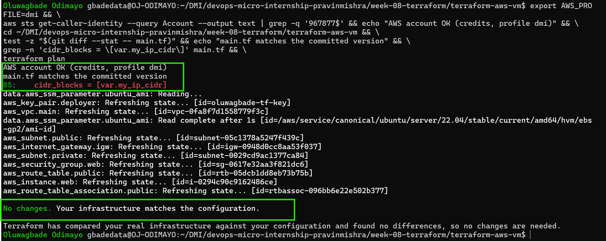

---

### Screenshot 17 — Final Healthy Review

Add a screenshot of the final `/tf-drift-review` showing `HEALTHY`.

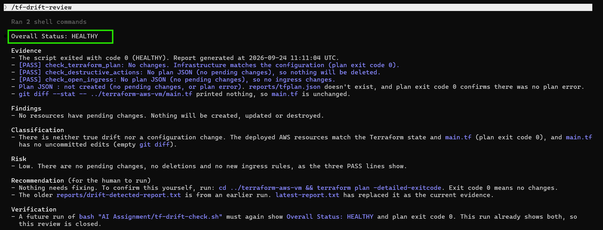

---

### Screenshot 18 — Saved Reports

Add a screenshot of `ls -lah reports` showing both:

- `drift-detected-report.txt`
- `resolved-report.txt`

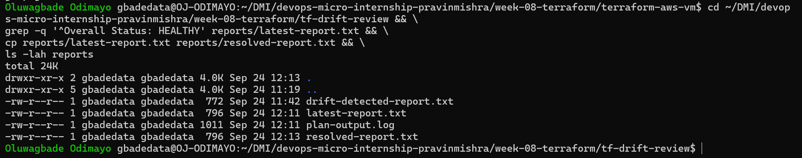

---

### Screenshot 19 — Drift Review Summary

Add a screenshot of `drift-review-summary.md` showing all required sections and your full name.

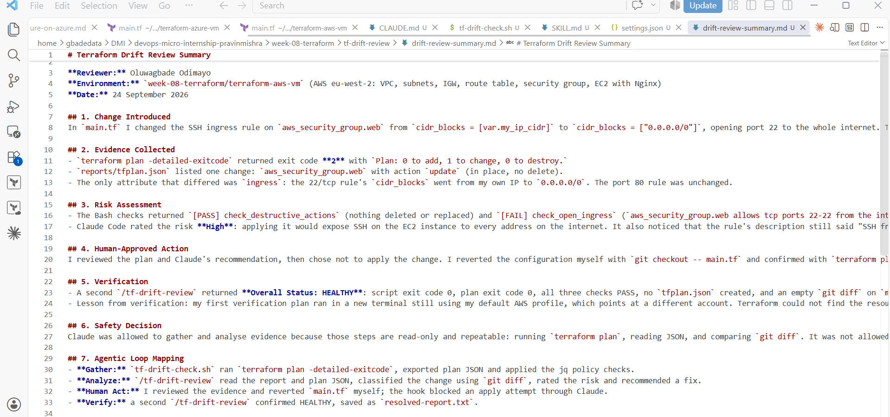

## Terraform Drift Review Summary

### 1. Change Introduced

Explain the controlled change you introduced.

State whether it was:

- True infrastructure drift, or
- A Terraform configuration change

I changed the SSH ingress rule on `aws_security_group.web` in `main.tf` from `[var.my_ip_cidr]` to `["0.0.0.0/0"]`, opening port 22 to the internet. This was a **Terraform configuration change, not true infrastructure drift**: the code changed, the real security group did not, and the change was never applied.

### 2. Evidence Collected

Describe the Terraform plan evidence and affected resource.

`terraform plan -detailed-exitcode` returned exit code `2` with `Plan: 0 to add, 1 to change, 0 to destroy.` `reports/tfplan.json` showed one change, `aws_security_group.web` (action `update`), where only `ingress` differed: the 22/tcp rule's `cidr_blocks` went from my IP to `0.0.0.0/0`.

### 3. Risk Assessment

Explain the risk identified by the Bash check and Claude Code.

The Bash checks returned `[PASS] check_destructive_actions` and `[FAIL] check_open_ingress: aws_security_group.web allows tcp ports 22-22 from the internet`, giving `Overall Status: FAIL`. Claude Code rated the risk High because applying it would expose SSH on the EC2 instance to the whole internet, and noted that the rule description would no longer be accurate.

### 4. Human-Approved Action

Explain the action you reviewed and executed manually.

I reviewed the plan and Claude's recommendation, chose not to apply, and reverted the configuration myself with `git checkout -- main.tf`. `terraform plan` then showed no changes. No `terraform apply` was needed because the risky change only ever existed in code. An apply attempt through Claude Code was blocked by the `PreToolUse` hook.

### 5. Verification

Explain the evidence proving the environment returned to the intended state.

A second `/tf-drift-review` returned `Overall Status: HEALTHY`: script exit code 0, plan exit code 0, all three checks PASS, no `tfplan.json`, and an empty `git diff` on `main.tf`. It is saved as `reports/resolved-report.txt`. My first verification plan ran under the wrong AWS profile and proposed recreating all 9 resources in another account; reading the plan caught it, and the correct profile showed no changes.

### 6. Safety Decision

Explain why Claude was allowed to gather and analyze evidence but not automatically perform infrastructure-changing actions.

Gathering and analysing evidence is read-only and repeatable, so Claude can do it safely. Applying changes affects real systems, may not be reversible and depends on context an agent can get wrong. `CLAUDE.md` and the skill keep Claude read-only, and the `PreToolUse` hook enforces the gate deterministically even when Claude is told to apply.

### 7. Agentic Loop Mapping

Explain how your workflow followed:

```text
Gather --> Analyze --> Human Act --> Verify
```

**Gather:** `tf-drift-check.sh` ran the plan, exported JSON and applied the jq checks. **Analyze:** `/tf-drift-review` read the evidence, classified the change and rated the risk. **Human Act:** I reviewed it and reverted `main.tf` myself, and the hook blocked an apply through Claude. **Verify:** a second review confirmed `HEALTHY`, saved as `resolved-report.txt`.

## Questions

### 1. What action did you execute to resolve the difference?

I reverted `main.tf` to the committed version with `git checkout -- main.tf`. No `terraform apply` was needed because the change had never been applied to AWS.

### 2. Did you review `terraform plan` before taking action?

Yes. I ran `terraform plan` after reverting. The first plan ran under the wrong AWS profile and showed `Plan: 9 to add`, which told me something was wrong; I switched to the correct profile and got `No changes`.

### 3. What evidence proves the environment is now aligned?

`terraform plan` shows `No changes`, the final `/tf-drift-review` reports `Overall Status: HEALTHY` with exit code 0 and all checks PASS, no `tfplan.json` was created, `git diff` on `main.tf` is empty, and `reports/resolved-report.txt` records the result.

### 4. Why is a second drift review required after the fix?

A fix can be incomplete or introduce a new change of its own, and only fresh evidence proves the environment is back to its intended state. It also refreshes `latest-report.txt`, which the hook reads, so the evidence the safety gate relies on matches reality.

### 5. What could go wrong if an AI agent automatically applied every detected Terraform change?

It could open ports to the internet, delete or replace resources (losing data), apply changes that were never meant to be applied, or act against the wrong account. In this assignment a plan under the wrong AWS profile proposed creating 9 duplicate resources; an agent that applied automatically would have done it, at machine speed and with no one checking.

### 6. In one sentence, explain the difference between asking an AI chatbot “Is my infrastructure okay?” and using this evidence-based Agentic AI workflow.

Asking a chatbot gets an opinion based on general knowledge, while this workflow gathers fresh evidence from my real Terraform plan, checks it against fixed rules and leaves the decision to act with me.

---

# LinkedIn Post — Mandatory

## Goal

Publish a LinkedIn post in your own words describing:

- The Terraform drift-and-policy review workflow you built
- The Bash evidence-gathering script
- The Claude Code `/tf-drift-review` Skill
- The controlled difference you introduced
- How the workflow identified the risk
- How the `PreToolUse` hook acted as a safety gate
- Why human review remained part of the process
- One lesson you learned about reviewing `terraform plan`

Include a screenshot of the detected change and a screenshot of the final `HEALTHY` review in your post.

Suggested tags:

```text
#DMIByPravinMishra #Terraform #AgenticAI #ClaudeCode #DevOps
```

## LinkedIn Evidence

### LinkedIn Post URL

Add your LinkedIn post URL here.

### Published LinkedIn Post Screenshot — Mandatory

Add a screenshot of the published LinkedIn post here.

---

# Required Assignment Files

Confirm that the following files are included in your GitHub repository:

- `CLAUDE.md`
- `AI Assignment/tf-drift-check.sh`
- `.claude/skills/tf-drift-review/SKILL.md`
- `.claude/settings.json` containing the safety hook
- `reports/drift-detected-report.txt`
- `reports/resolved-report.txt`
- `drift-review-summary.md`

---

# Submission Instructions

- Complete Tasks 1–8 in sequence.
- Include Screenshots 1–19 exactly as specified.
- Answer every question under Tasks 1–8 in your own words.
- Complete all seven sections of the Terraform Drift Review Summary.
- Include the GitHub repository/folder URL containing the assignment files.
- Include your full name in the required reports and screenshots.
- Include the LinkedIn post URL and a screenshot of the published LinkedIn post.
- Do not expose access keys, passwords, tokens, account IDs, private keys, Terraform secrets, or other sensitive information.
- Review all screenshots carefully and hide or redact sensitive details where necessary.

---

# Completion Checklist

- [ ] Confirmed a clean Terraform baseline
- [ ] Created the required assignment workspace
- [ ] Created or updated `CLAUDE.md`
- [ ] Added project context and safety rules
- [ ] Created `tf-drift-check.sh`
- [ ] Added my full name to the report
- [ ] Validated the Bash script
- [ ] Made the script executable
- [ ] Used `terraform plan -detailed-exitcode`
- [ ] Used Terraform plan JSON
- [ ] Used `jq` to inspect destructive actions
- [ ] Used `jq` to inspect unsafe ingress
- [ ] Confirmed the baseline returns `HEALTHY`
- [ ] Created `/tf-drift-review`
- [ ] Restricted the Skill to appropriate tools
- [ ] Confirmed the Skill remains read-only
- [ ] Confirmed the Skill never runs `terraform apply`
- [ ] Confirmed the Skill never runs `terraform destroy`
- [ ] Introduced a controlled detectable difference
- [ ] Correctly identified whether it was true drift or a configuration change
- [ ] Saved `drift-detected-report.txt`
- [ ] Added the `PreToolUse` safety hook
- [ ] Verified the hook blocks `terraform apply` when the report is `FAIL`
- [ ] Reviewed the Terraform evidence before resolving the change
- [ ] Performed any infrastructure-changing action manually
- [ ] Ran the drift review again after resolution
- [ ] Confirmed the final status is `HEALTHY`
- [ ] Saved `resolved-report.txt`
- [ ] Completed `drift-review-summary.md`
- [ ] Mapped the workflow to `Gather --> Analyze --> Human Act --> Verify`
- [ ] Included all 19 numbered screenshots
- [ ] Answered all required questions
- [ ] Published the required LinkedIn post
- [ ] Added the LinkedIn post URL and screenshot
- [ ] Included the GitHub repository/folder URL
- [ ] Confirmed that no sensitive information is exposed

---

*This submission is part of the DevOps Micro Internship (DMI) Cohort 3 — Agentic AI Track.*
