# Assignment 01 — Set Up a Team-Ready Ansible Development Workstation

Part of the DevOps Micro Internship (DMI) with Agentic AI

**Full Name:** Oluwagbade Odimayo  
**Environment:** Ubuntu 24.04 on WSL2, Python 3.12.3, ansible-core 2.21.4  
**Workspace files:** [`ansible-onboarding/`](./ansible-onboarding/)

---

## Purpose

In this assignment, you will prepare an isolated and reusable Ansible development workstation.

You will install Ansible and supporting tools inside a Python virtual environment, configure VS Code, prepare SSH access, configure Git and pre-commit hooks, and document the complete setup.

This workstation will be used as the Ansible controller in upcoming assignments.

---

# Task 1 — Create and Initialize the Ansible Workspace

## Goal

Create the assignment workspace, initialize a Git repository, prepare the required directories, and add Git ignore rules for local and sensitive files.

### Evidence

#### Screenshot 1 — Terminal showing the `ansible-onboarding` path, `ls -la` output, and `git status` confirming the Git repository is on the `main` branch

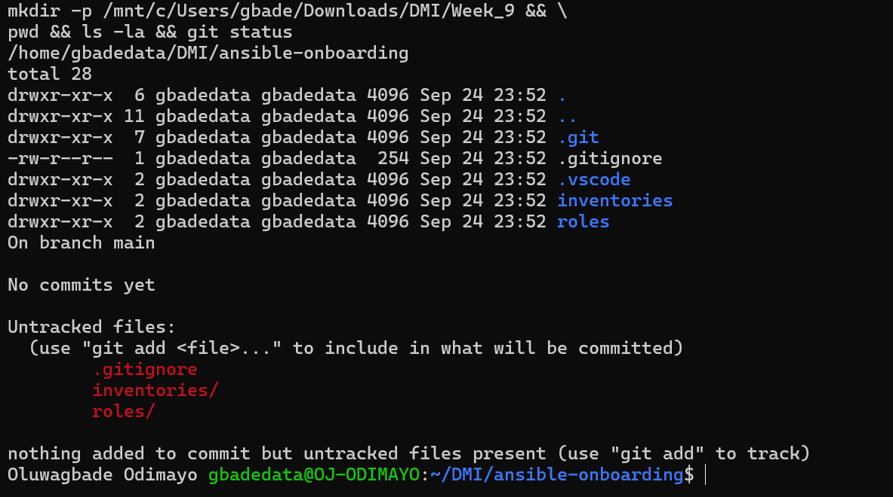

---

# Task 2 — Create the Virtual Environment and Install Ansible Tools

## Goal

Create an isolated Python virtual environment and install Ansible and the required validation tools without modifying the system Python environment.

### Evidence

#### Screenshot 2 — Terminal showing the active `(.venv)` environment, `which ansible`, `ansible --version`, `ansible-lint --version`, `yamllint --version`, and `pre-commit --version`

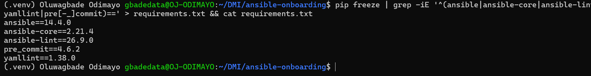

---

# Task 3 — Configure VS Code for Ansible Development

## Goal

Configure Visual Studio Code to use the project’s Python virtual environment and provide validation support for Python, YAML, and Ansible files.

### Evidence

#### Screenshot 3 — VS Code Extensions panel showing the Ansible, YAML, and Python extensions installed

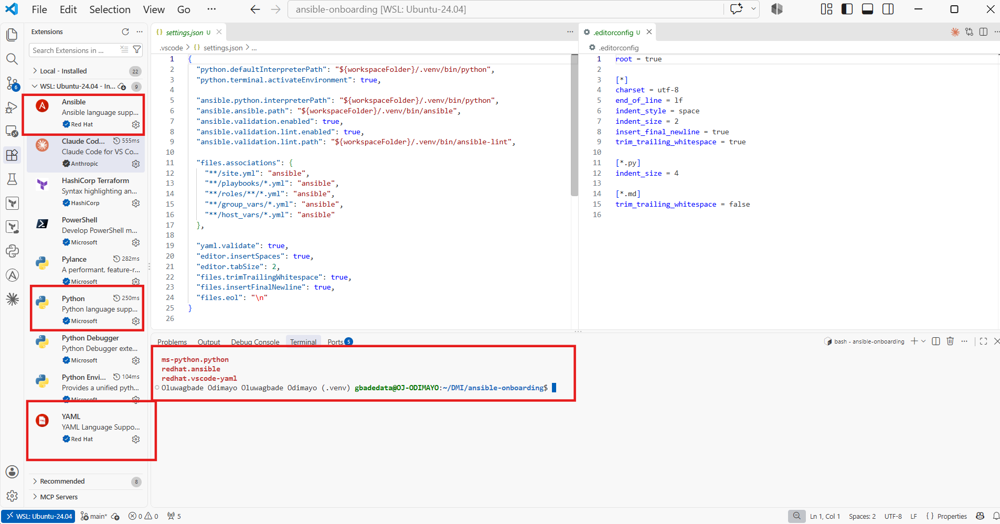

---

#### Screenshot 4 — VS Code showing `.vscode/settings.json` and `.editorconfig` open side by side, with the required settings clearly visible

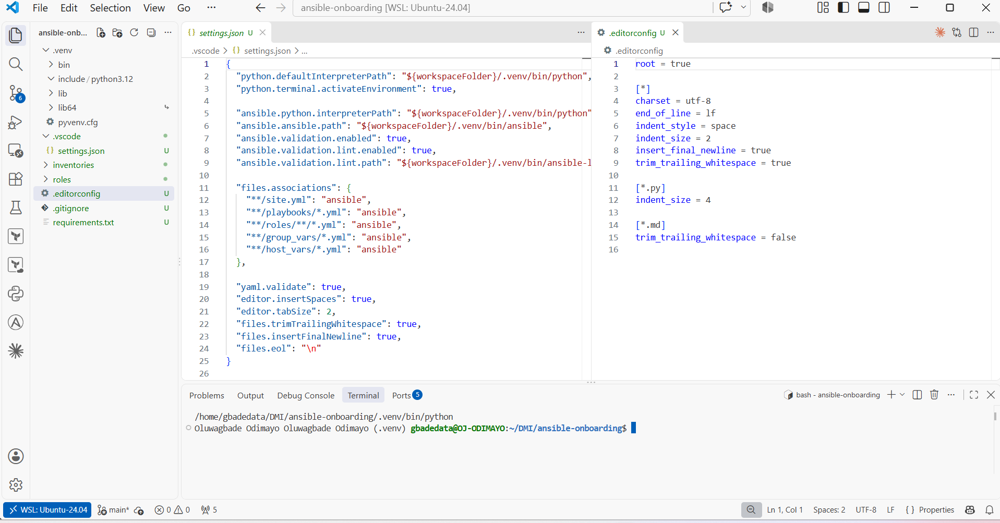

---

# Task 4 — Create the Baseline Ansible Configuration

## Goal

Create a reusable `ansible.cfg` file containing the default settings that will be used in this workspace and upcoming Ansible assignments.

### Evidence

#### Screenshot 5 — `ansible.cfg` open in VS Code or another editor, showing the complete configuration

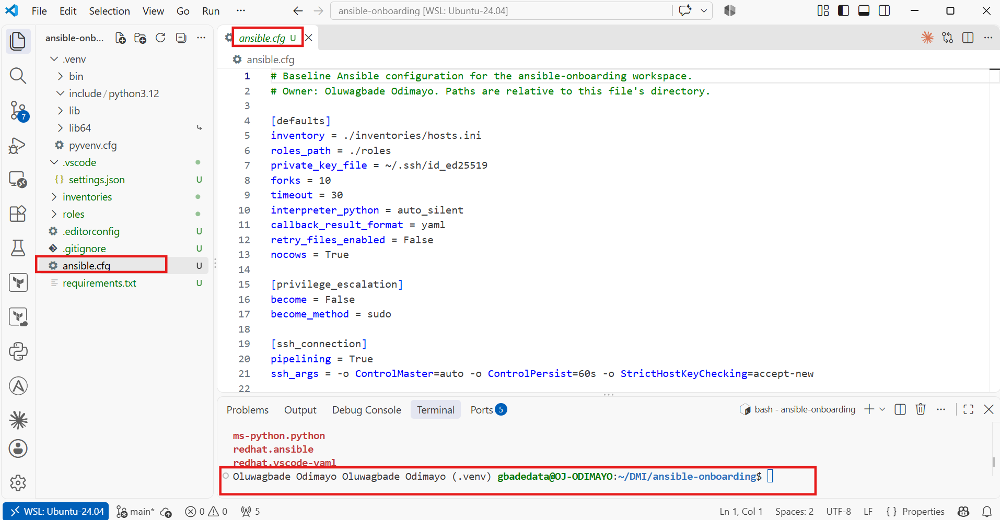

---

#### Screenshot 6 — Terminal showing `ansible --version` with the `ansible.cfg` path and the output of `ansible-config dump --only-changed`

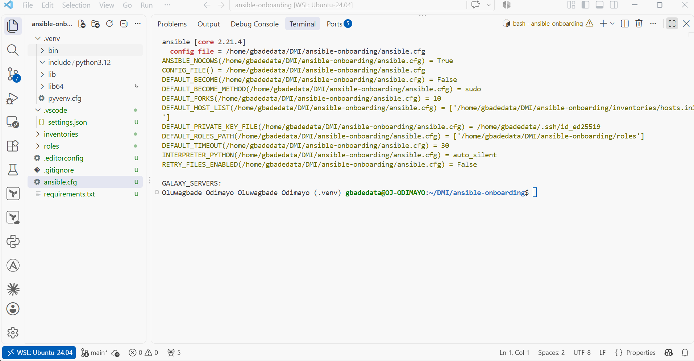

---

# Task 5 — Configure SSH Readiness

## Goal

Prepare SSH key authentication, load the key into the SSH agent, configure reusable SSH client settings, and understand how trusted host fingerprints are stored.

### Evidence

#### Screenshot 7 — Terminal showing `ssh-add -l` with the ED25519 key loaded and the SSH configuration verification output

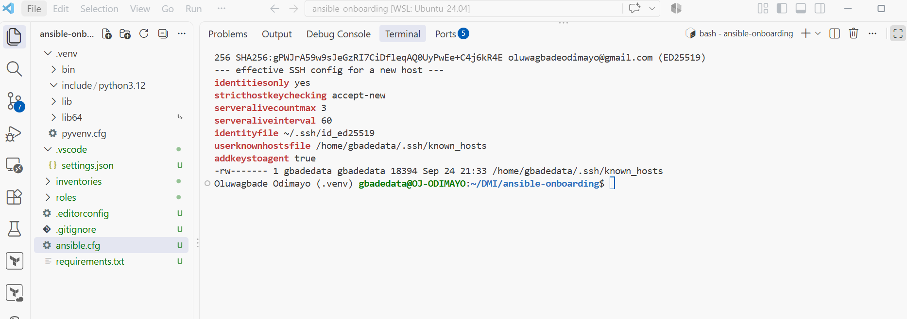

---

# Task 6 — Configure Git Identity and Pre-commit Hooks

## Goal

Configure your Git identity and install pre-commit hooks that validate YAML and Ansible files before commits are created.

### Evidence

#### Screenshot 8 — Terminal showing your Git full name, Git email, default branch, successful `pre-commit install` output, and `.git/hooks/pre-commit`

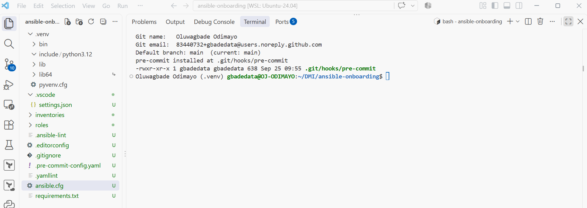

---

# Task 7 — Test the Complete Workstation Setup

## Goal

Verify that Ansible, the linting tools, Git hooks, SSH agent, and Git ignore rules are working correctly.

### Evidence

#### Screenshot 9 — Terminal showing `pre-commit run --all-files` completing successfully

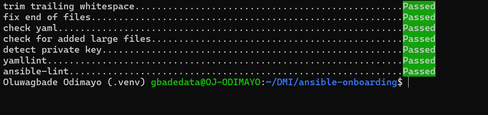

---

#### Screenshot 10 — Terminal showing `ansible --version` with the project configuration path and `ssh-add -l` with the ED25519 key loaded

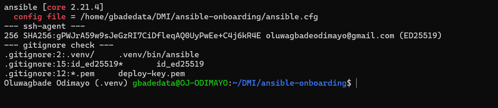

---

# Task 8 — Create the README and Onboarding Checklist

## Goal

Document the completed Ansible workstation setup and create a reusable checklist for preparing another workstation in the future.

### Evidence

#### Screenshot 11 — Terminal showing the final `ansible-onboarding` project structure

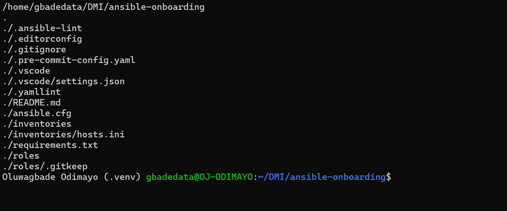

---

#### Screenshot 12 — VS Code Markdown preview showing your full name, project summary, and part of the “New Machine? Do This” checklist

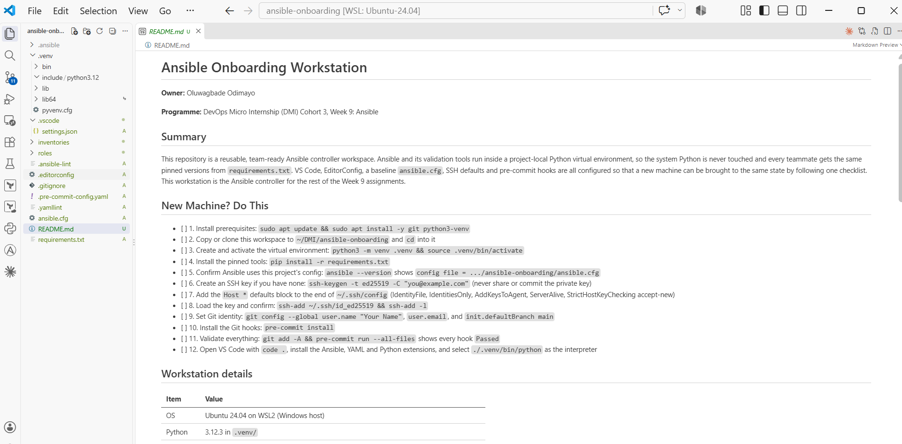

---

# Assignment Questions

Answer the following in your own words:

**1. What is one feature that makes your workstation setup team-friendly?**

Every version that matters is pinned inside the repository. `requirements.txt` pins Ansible, ansible-core, ansible-lint, yamllint and pre-commit, and `.pre-commit-config.yaml` pins each hook to an exact release. A teammate who clones the repo and follows the 12-step "New Machine? Do This" checklist gets the same tools and the same checks I have, so a playbook that passes on my machine passes on theirs, and nobody has to guess which version of Ansible the project expects.

---

**2. What is one pitfall you avoided while completing the setup?**

The pinned ansible-lint hook (v26.9.0) declares Python 3.14 as its language version, and my workstation runs Python 3.12. I tested the pre-commit configuration before relying on it, and the first run crashed with `failed to find interpreter for python_spec='python3.14'`. I added `language_version: python3` to the hook so it builds on the Python this machine actually has, then confirmed all seven hooks pass and that a deliberately broken playbook is rejected. Without that test, `pre-commit run --all-files` would have failed and every later commit would have been blocked. A smaller one along the way: `pip freeze` lists pre-commit as `pre_commit`, so my first filter silently left it out of `requirements.txt` until I checked the file.

---

**3. Why should Ansible be installed inside a Python virtual environment?**

A virtual environment keeps this project's Ansible completely separate from the operating system's Python. Ubuntu 24.04 marks its system Python as externally managed, so installing packages into it with pip is blocked, and forcing it can break tools the OS depends on. Inside `.venv` I can install or upgrade exact versions without sudo, another project can use a different Ansible version without conflict, and `pip install -r requirements.txt` rebuilds the identical toolset on any machine.

---

**4. Why must SSH private keys and `.venv/` remain outside version control?**

A private key is proof of identity: anyone who gets a copy can log in to every server that trusts the matching public key. Once a key is committed it stays in Git history even if the file is later deleted, so the only safe fix is to replace the key everywhere. `.gitignore` excludes key files and the `detect-private-key` hook is a second safety net. `.venv/` is different: it is not secret, but it is large, full of platform-specific binaries, and its scripts contain absolute paths to `/home/gbadedata/...`, so it would not work on anyone else's machine. It is fully reproducible from `requirements.txt`, so committing it would add noise and nothing useful.

---

# Required Files

Confirm that the following files are included in your assignment workspace:

- [x] `README.md`
- [x] `requirements.txt`
- [x] `.gitignore`
- [x] `.editorconfig`
- [x] `.vscode/settings.json`
- [x] `ansible.cfg`
- [x] `.pre-commit-config.yaml`
- [x] `inventories/`
- [x] `roles/`

---

# Submission Instructions

- Add all required screenshots in your submission.
- Full Name must be visible in required screenshots.
- All screenshots must be readable.
- Answer all assignment questions clearly in your own words.
- Do not expose SSH private-key contents, passwords, access tokens, API keys, credentials, private certificates, or other sensitive information.

---

# Completion Checklist

- [x] Task 1: `ansible-onboarding` workspace created
- [x] Task 1: Git initialized on the `main` branch
- [x] Task 1: `.gitignore` created
- [x] Task 2: Python virtual environment created
- [x] Task 2: Virtual environment activated
- [x] Task 2: Ansible installed inside `.venv`
- [x] Task 2: `ansible-lint`, `yamllint`, and `pre-commit` installed
- [x] Task 2: `requirements.txt` created
- [x] Task 3: Required VS Code extensions installed
- [x] Task 3: VS Code uses the Python interpreter from `.venv`
- [x] Task 3: `.vscode/settings.json` created
- [x] Task 3: `.editorconfig` created
- [x] Task 4: `ansible.cfg` created
- [x] Task 4: Ansible loads `ansible.cfg` from the project directory
- [x] Task 5: ED25519 SSH key exists
- [x] Task 5: SSH private key has not been exposed
- [x] Task 5: SSH key loaded into the SSH agent
- [x] Task 5: `~/.ssh/config` contains the required settings
- [x] Task 5: `~/.ssh/known_hosts` exists
- [x] Task 6: Git identity configured correctly
- [x] Task 6: Pre-commit hooks installed
- [x] Task 7: `pre-commit run --all-files` completes successfully
- [x] Task 8: `README.md` contains your full name and workstation details
- [x] Task 8: “New Machine? Do This” checklist contains 10–12 items
- [x] All 12 required screenshots are included
- [x] Assignment questions are answered
- [x] No sensitive information is exposed

---

## About DMI & CloudAdvisory

DevOps Micro Internship (DMI) is a project-based DevOps program run by Pravin Mishra and The CloudAdvisory, focused on real-world execution, systems thinking, and career readiness.

It helps learners build strong DevOps foundations with hands-on experience.

---

## Resources

- DMI Official Website: [https://dmi.pravinmishra.com?utm_source=github&utm_medium=readme](https://dmi.pravinmishra.com?utm_source=github&utm_medium=readme)
- University: [https://university.pravinmishra.com?utm_source=github&utm_medium=readme](https://university.pravinmishra.com?utm_source=github&utm_medium=readme)
- Discord Community: [https://discord.pravinmishra.com?utm_source=github&utm_medium=readme](https://discord.pravinmishra.com?utm_source=github&utm_medium=readme)
- Blog: [https://dmi.pravinmishra.com/blog?utm_source=github&utm_medium=readme](https://dmi.pravinmishra.com/blog?utm_source=github&utm_medium=readme)
- YouTube Playlist: [https://www.youtube.com/playlist?list=PLFeSNDtI4Cho](https://www.youtube.com/playlist?list=PLFeSNDtI4Cho)
- Pravin Mishra LinkedIn: [https://www.linkedin.com/in/pravin-mishra-aws-trainer/](https://www.linkedin.com/in/pravin-mishra-aws-trainer/)
- CloudAdvisory LinkedIn: [https://www.linkedin.com/company/thecloudadvisory/](https://www.linkedin.com/company/thecloudadvisory/)

---

*This submission is part of DevOps Micro Internship (DMI) — Agentic AI Track.*