# Assignment 02 — Provision Linux VMs with Terraform and Run Ansible Ad-Hoc Commands

Part of the DevOps Micro Internship (DMI) with Agentic AI

**Full Name:** Oluwagbade Odimayo  
**Cloud Platform:** AWS (eu-west-2, London)  
**Option:** Four-VM option (web1, web2, app1, db1)  
**Project files:** [`ansible-onboarding/ansible-adhoc-lab/`](./ansible-onboarding/ansible-adhoc-lab/)

| Host | Role | Public IP |
|---|---|---|
| web1 | web | 35.176.126.122 |
| web2 | web | 18.135.15.215 |
| app1 | app | 3.10.180.70 |
| db1 | db | 18.170.230.16 |

**Inventory proof:** [`inventory.ini`](./ansible-onboarding/ansible-adhoc-lab/ansible/inventory.ini) (Screenshots 10 and 11)

**What I learned:** Terraform and Ansible split the work cleanly. Terraform decides what exists and
exposes it as outputs, and Ansible consumes those outputs to manage the servers, so generating the
inventory from Terraform removed hand-typed IPs entirely. The ad-hoc runs also made idempotency concrete:
purpose-built modules like `apt` and `service` only report a change when they make one, while the
generic `command` module always reports `CHANGED` because it cannot tell.

---

## Purpose

In this assignment, you will use Terraform to provision three or four Ubuntu Linux Virtual Machines on either Microsoft Azure or Amazon Web Services.

You will configure SSH key-based authentication, organize the servers using a custom Ansible inventory, and run Ansible ad-hoc commands across individual hosts and inventory groups.

---

# Task 1 — Create the Multi-Host Lab Structure

## Goal

Create a separate project directory for the multi-host lab and prepare the Terraform, Ansible, and documentation files.

This project will use the Git repository and Ansible controller prepared in Assignment 01.

### Evidence

#### Screenshot 1 — Terminal showing the complete `ansible-adhoc-lab` project structure

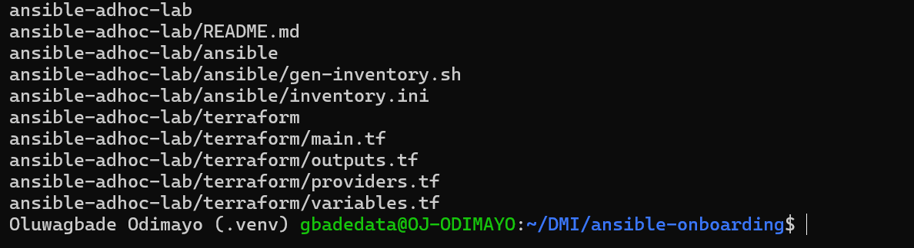

---

#### Screenshot 2 — Terminal showing `git status --short` with the new project files and updated `.gitignore`

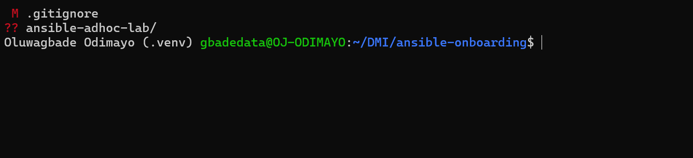

---

### Notes

I created `ansible-adhoc-lab/` inside the `ansible-onboarding` repository from Assignment 01, with `terraform/` for infrastructure, `ansible/` for the inventory and a `README.md`. Before any Terraform ran, I added `.terraform/`, `*.tfstate`, `*.tfstate.*`, `*.tfplan` and `tfplan` to the repository `.gitignore`. State files can hold sensitive values and the `.terraform/` folder holds provider binaries of several hundred MB, so neither belongs in Git. `.terraform.lock.hcl` is committed so every machine resolves the same provider version.

---

# Task 2 — Create the Terraform Configuration

## Goal

Create the Terraform configuration required to provision three or four Ubuntu Linux VMs on your selected cloud platform.

Complete only one option:

- Option A — Microsoft Azure
- Option B — Amazon Web Services

Do not configure both providers for this assignment.

### Evidence

#### Screenshot 3 — Terraform configuration showing the three or four server roles and the `for_each` or `count` implementation

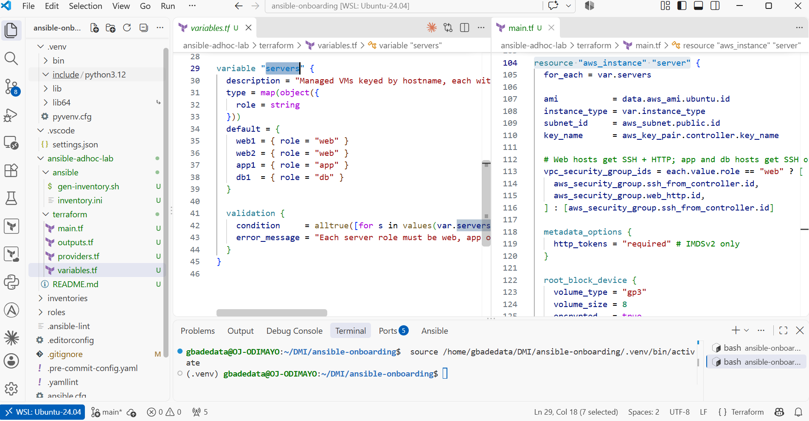

---

#### Screenshot 4 — Terraform configuration showing SSH restricted to the controller IP and HTTP allowed only for web hosts

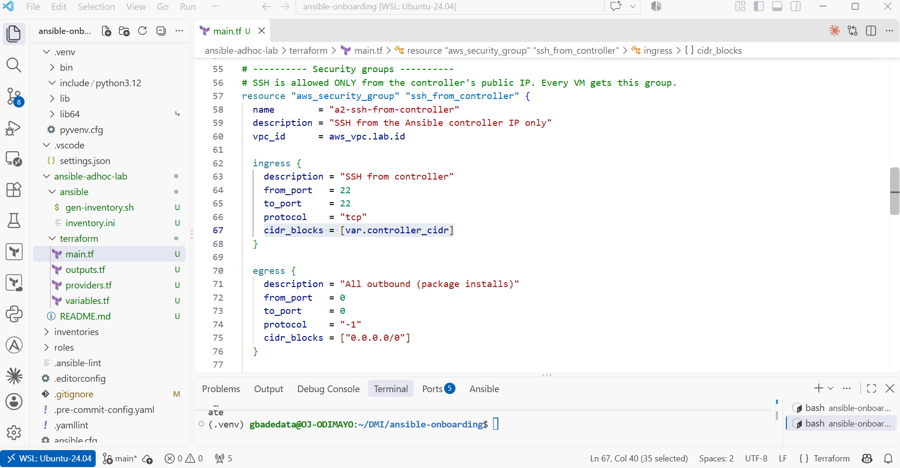

---

#### Screenshot 5 — Terraform output configuration showing how public IP addresses are associated with the server roles

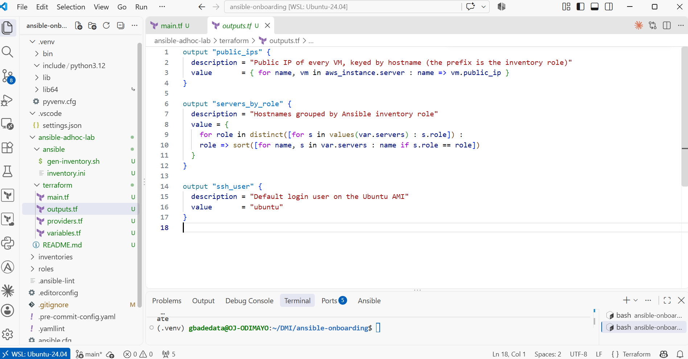

---

### Notes

I chose Option B (AWS) and the four-VM option. The `servers` variable is a map of hostname to role (`web1` and `web2` are web, `app1` is app, `db1` is db) and `aws_instance.server` uses `for_each` over it, so adding a host is a one-line change. There are two security groups: SSH on port 22 allowed only from `var.controller_cidr`, attached to every VM, and HTTP on port 80 attached only to web hosts through `each.value.role == "web" ? [ssh, http] : [ssh]`. My public IP is passed at runtime with `TF_VAR_controller_cidr` and a validation rule rejects anything that is not a /32, so the IP never appears in a committed file. The instances also require IMDSv2 and use encrypted gp3 root volumes.

---

# Task 3 — Provision the Infrastructure with Terraform

## Goal

Initialize and validate the Terraform configuration, review the execution plan, provision the selected three or four VMs, and retrieve their public IP addresses.

### Evidence

#### Screenshot 6 — Final `terraform apply` output showing `Apply complete`

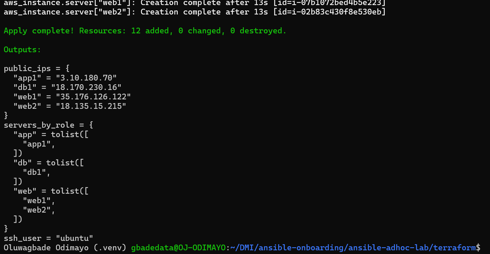

---

#### Screenshot 7 — `terraform output public_ips` showing the role-to-IP mapping for all three or four VMs

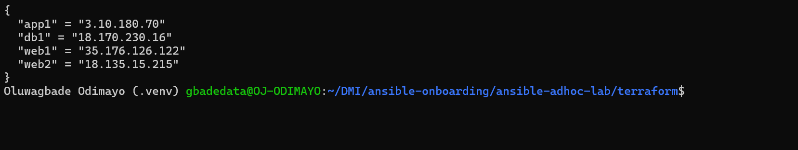

---

#### Screenshot 8 — Azure Portal or AWS Management Console showing all three or four VMs in the `Running` state, with their role-based names visible

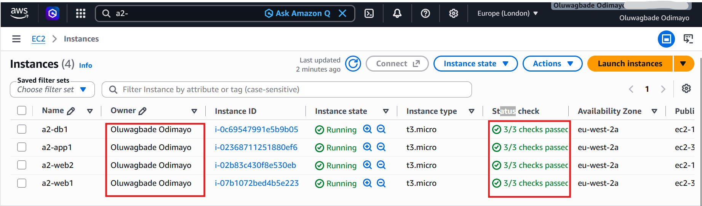

---

### Notes

Before planning I confirmed the AWS CLI was pointing at my credits account, because in Week 8 a terminal without `AWS_PROFILE` silently used a different account. `terraform init` installed the AWS provider v6.66.0, `terraform fmt -check` and `terraform validate` both passed, and I saved the plan with `terraform plan -out=tfplan`. I only applied after checking the plan said `12 to add, 0 to change, 0 to destroy`: one VPC, internet gateway, subnet, route table and association, two security groups, one key pair and four `t3.micro` instances in eu-west-2a. The apply completed with 12 resources added and all four instances passed 3/3 status checks.

---

# Task 4 — Verify SSH Key-Based Access

## Goal

Verify that each managed VM can be accessed from the Ansible controller using SSH key-based authentication.

### Evidence

#### Screenshot 9 — Terminal showing successful SSH hostname output from all VMs

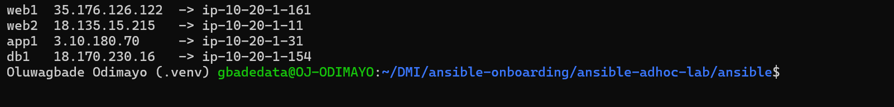

---

### Notes

I looped over the Terraform `public_ips` output and ran `ssh ubuntu@<ip> hostname` against each VM with `BatchMode=yes`, which makes SSH fail immediately instead of falling back to a password prompt, so a success can only mean key authentication worked. Because my SSH config uses `StrictHostKeyChecking accept-new`, the first connection recorded each host key in `known_hosts` without an interactive prompt. The hostnames returned are AWS defaults based on private IPs (`ip-10-20-1-161`, `ip-10-20-1-11`, `ip-10-20-1-31`, `ip-10-20-1-154`), so each line is labelled with its role name and public IP.

---

# Task 5 — Create the Custom Ansible Inventory

## Goal

Create an Ansible inventory file that groups the managed VMs by role.

The inventory allows Ansible to run commands against all servers, or only specific groups such as `web`, `app`, or `db`.

### Evidence

#### Screenshot 10 — `inventory.ini` showing the `web`, `app`, and `db` groups

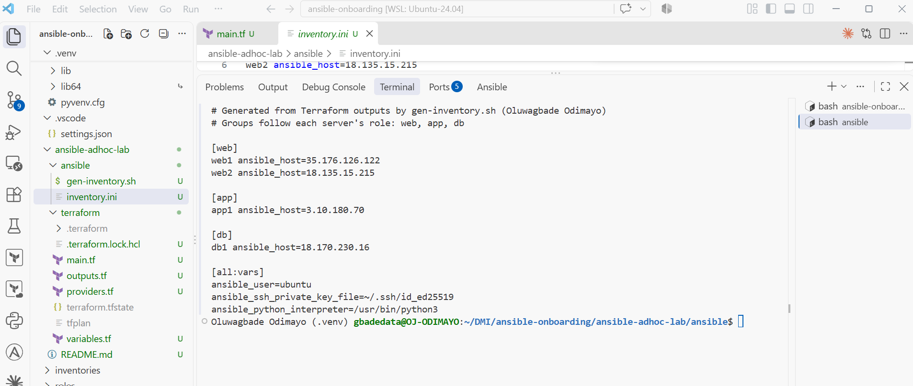

---

#### Screenshot 11 — Output of `ansible-inventory -i inventory.ini --graph`

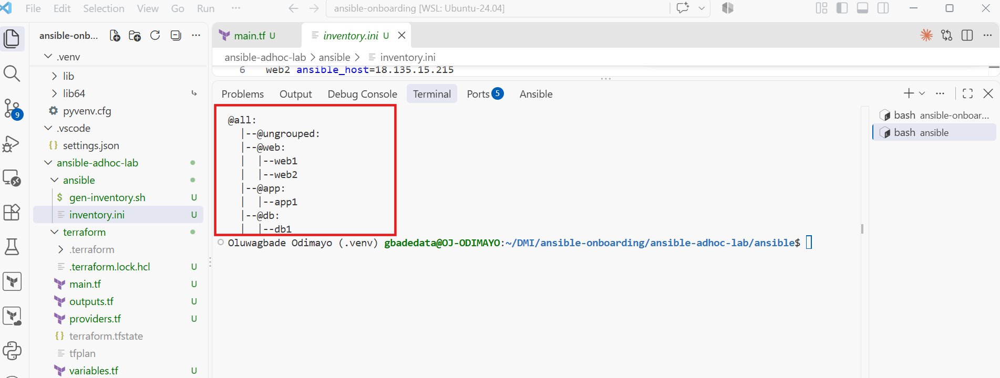

---

### Notes

Rather than typing IPs, I wrote `ansible/gen-inventory.sh`, which reads the `public_ips` and `servers_by_role` Terraform outputs as JSON and writes `inventory.ini` with `[web]`, `[app]` and `[db]` groups plus an `[all:vars]` block setting `ansible_user=ubuntu`, the ED25519 key and `/usr/bin/python3`. If the VMs are ever recreated with new IPs, rerunning the script keeps the inventory correct. `ansible-inventory --graph` confirmed web1 and web2 under `@web`, app1 under `@app` and db1 under `@db`.

---

# Task 6 — Run Ansible Ad-Hoc Commands

## Goal

Run Ansible ad-hoc commands from the controller to verify connectivity, check server information, and manage packages and services across inventory groups.

This task proves that the inventory is working and that Ansible can control multiple managed VMs without writing a playbook.

### Evidence

#### Screenshot 12 — Output of `ansible all -i inventory.ini -m ping`

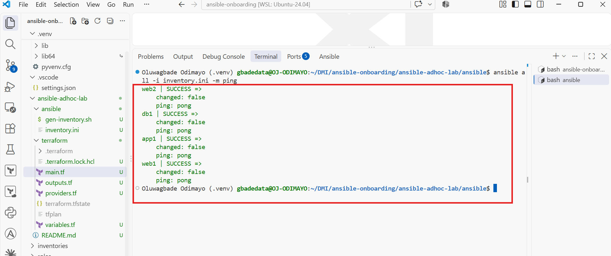

**Command run** (from `ansible-adhoc-lab/ansible`): `ansible all -i inventory.ini -m ping`

---

#### Screenshot 13 — Output of `ansible all -i inventory.ini -m command -a "uptime"`

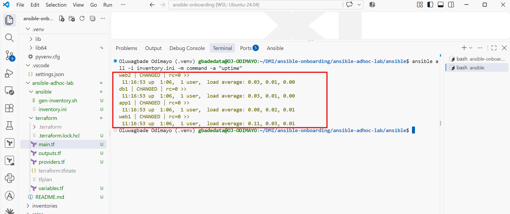

**Command run** (from `ansible-adhoc-lab/ansible`): `ansible all -i inventory.ini -m command -a "uptime"`

---

#### Screenshot 14 — Output of `ansible web -i inventory.ini -m apt -a "name=nginx state=present update_cache=yes" --become`

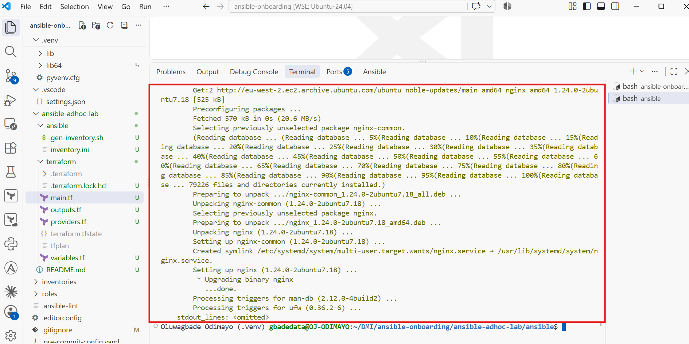

**Command run** (from `ansible-adhoc-lab/ansible`): `ansible web -i inventory.ini -m apt -a "name=nginx state=present update_cache=yes" --become`

---

#### Screenshot 15 — Output of `ansible web -i inventory.ini -m service -a "name=nginx state=started enabled=yes" --become`

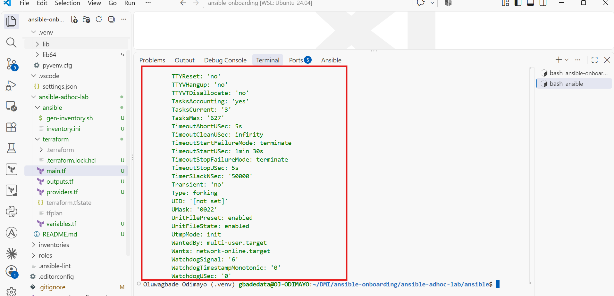

**Command run** (from `ansible-adhoc-lab/ansible`): `ansible web -i inventory.ini -m service -a "name=nginx state=started enabled=yes" --become`

---

#### Screenshot 16 — Output of `ansible all -i inventory.ini -m apt -a "name=htop state=present update_cache=yes" --become`

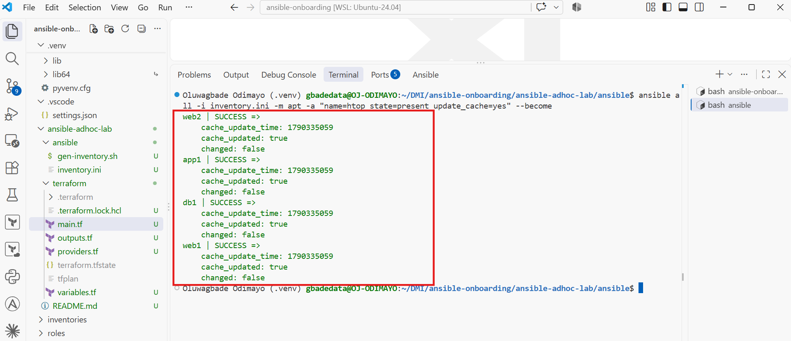

**Command run** (from `ansible-adhoc-lab/ansible`): `ansible all -i inventory.ini -m apt -a "name=htop state=present update_cache=yes" --become`

---

#### Screenshot 17 — Output of `ansible web -i inventory.ini -m command -a "systemctl is-active nginx"`

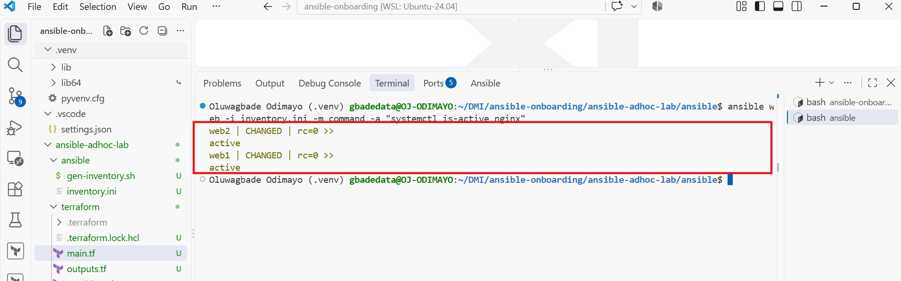

**Command run** (from `ansible-adhoc-lab/ansible`): `ansible web -i inventory.ini -m command -a "systemctl is-active nginx"`

---

### Notes

I pointed `ANSIBLE_CONFIG` at the Assignment 01 `ansible.cfg` so these runs used my baseline settings (pipelining, SSH connection reuse, readable YAML output), and ran `cloud-init status --wait` on every host first so no apt task would collide with first-boot package updates. `ping` returned `pong` from all four hosts. `uptime` reported `CHANGED` even though it changes nothing, because the `command` module cannot know what an arbitrary command did. The nginx install and service start reported `CHANGED` on web1 and web2. htop reported `SUCCESS` with `changed: false` on all four hosts because the Ubuntu image already includes it, which is idempotency in practice: the desired state already existed, so nothing was touched. `systemctl is-active nginx` returned `active` on both web hosts.

---

# LinkedIn Post Required

## Evidence

#### LinkedIn Post URL

Paste your LinkedIn post URL here:

Not published: I chose not to publish a LinkedIn post for this assignment.

---

#### Screenshot — Published LinkedIn post

Not published: I chose not to publish a LinkedIn post for this assignment.

---

# Assignment Questions

Answer the following in your own words:

**1. What is the purpose of an Ansible inventory file?**

The inventory tells Ansible which machines exist, how to reach them and how they are grouped. It maps a friendly hostname such as `web1` to a real address with `ansible_host`, holds connection settings such as the SSH user and key, and puts hosts into groups so a single command can target exactly the machines it should. Without it, every command would need a hand-typed list of IPs.

---

**2. What is the difference between the `web`, `app`, and `db` groups in your inventory?**

They separate the servers by the job they do. `web` holds web1 and web2, the public-facing servers that run nginx and are the only ones reachable on port 80. `app` holds app1, where application code would run, and `db` holds db1, where a database would live. All three groups accept SSH only from my controller, but only `web` is exposed to HTTP, so commands like the nginx install target `web` and never touch the app or database servers.

---

**3. What does the Ansible `ping` module verify?**

It checks that Ansible can do real work on the host, not just that the machine is on the network. It is not an ICMP ping: it connects over SSH with the inventory's user and key, starts the remote Python interpreter, runs a tiny module and returns `pong`. A `pong` therefore proves SSH access, authentication and a usable Python are all in place.

---

**4. Why do package installation commands require `--become`?**

Installing packages and managing system services changes files and processes owned by root, and the `ubuntu` user does not have that permission by default. `--become` tells Ansible to escalate with sudo for that command only. My `ansible.cfg` sets `become = False`, so nothing runs as root unless I explicitly ask for it, which keeps privileged changes deliberate and easy to spot.

---

**5. When would you use an ad-hoc command instead of a playbook?**

For quick, one-off tasks: checking whether hosts are reachable, reading uptime or disk space, restarting a service during an incident, or confirming a package version across a fleet. For anything I will repeat, anything with several dependent steps, or anything that should be reviewed and kept in Git, I would write a playbook, because a playbook is documented, repeatable and can be linted and version-controlled, while an ad-hoc command is gone once it has run.

---

**6. What is one challenge you faced while setting up SSH or inventory, and how did you fix it?**

The problem was the working directory. The inventory lives in `ansible-adhoc-lab/ansible/`, but the VS Code terminal opened at the repository root, so `cat inventory.ini` failed with `No such file or directory`. A related trap is that Ansible only reads `./ansible.cfg` from the current directory, so inside the lab folder my baseline config from Assignment 01 would have been silently ignored. I fixed both by changing into `ansible-adhoc-lab/ansible` before running anything and exporting `ANSIBLE_CONFIG` to point at the workspace `ansible.cfg`, then confirmed with `ansible --version` that the right config file was loaded. I also generated the inventory from Terraform outputs so a mistyped IP could not be the cause of any SSH failure.

---

# Required Files

Confirm that the following files are included in your assignment workspace:

- [x] `ansible-adhoc-lab/README.md`
- [x] `ansible-adhoc-lab/terraform/providers.tf`
- [x] `ansible-adhoc-lab/terraform/main.tf`
- [x] `ansible-adhoc-lab/terraform/variables.tf`
- [x] `ansible-adhoc-lab/terraform/outputs.tf`
- [x] `ansible-adhoc-lab/ansible/inventory.ini`
- [x] Updated `.gitignore`

---

# Submission Instructions

- Add all required screenshots from the tasks.
- Full Name must be visible in required screenshots.
- Mention whether you used Azure or AWS.
- Mention whether you used the three-VM option or four-VM option.
- Add the public IP addresses of the VMs, redacted if preferred.
- Add your `inventory.ini` proof.
- Add a short explanation of what you learned.
- Answer all assignment questions clearly in your own words.
- Add your LinkedIn post URL.
- Do not expose SSH private keys, Terraform state files, cloud credentials, passwords, access keys, secret keys, account IDs, or subscription IDs.

---

# Completion Checklist

- [x] Task 1: `ansible-adhoc-lab` project structure created
- [x] Task 1: `.gitignore` updated for Terraform files
- [x] Task 2: Terraform configuration created
- [x] Task 2: Server roles defined for either three or four VMs
- [x] Task 2: `count` or `for_each` used
- [x] Task 2: SSH restricted to the controller public IP
- [x] Task 2: HTTP allowed only for web hosts
- [x] Task 2: Terraform output maps roles to public IPs
- [x] Task 3: Terraform initialized successfully
- [x] Task 3: Terraform configuration validated
- [x] Task 3: Terraform apply completed successfully
- [x] Task 3: All selected VMs are running
- [x] Task 4: SSH key-based access works for every VM
- [x] Task 5: `inventory.ini` contains `web`, `app`, and `db` groups
- [x] Task 5: `ansible-inventory -i inventory.ini --graph` shows the correct groups
- [x] Task 6: `ansible all -i inventory.ini -m ping` returns `SUCCESS`
- [x] Task 6: Ad-hoc commands run successfully
- [x] Task 6: `--become` was used for package and service tasks
- [x] Task 6: Nginx is active on the `web` group
- [x] Screenshots 1–17 are included
- [x] Assignment questions are answered
- [ ] LinkedIn post published (not published, by choice)
- [ ] LinkedIn post URL added (not published, by choice)
- [x] No sensitive information is exposed

---

## About DMI & CloudAdvisory

DevOps Micro Internship (DMI) is a project-based DevOps program run by Pravin Mishra and The CloudAdvisory, focused on real-world execution, systems thinking, and career readiness.

It helps learners build strong DevOps foundations with hands-on experience.

---

## Resources

- DMI Official Website: [https://dmi.pravinmishra.com?utm_source=github&utm_medium=readme](https://dmi.pravinmishra.com?utm_source=github&utm_medium=readme)
- University: [https://university.pravinmishra.com?utm_source=github&utm_medium=readme](https://university.pravinmishra.com?utm_source=github&utm_medium=readme)
- Discord Community: [https://discord.pravinmishra.com?utm_source=github&utm_medium=readme](https://discord.pravinmishra.com?utm_source=github&utm_medium=readme)
- Blog: [https://dmi.pravinmishra.com/blog?utm_source=github&utm_medium=readme](https://dmi.pravinmishra.com/blog?utm_source=github&utm_medium=readme)
- YouTube Playlist: [https://www.youtube.com/playlist?list=PLFeSNDtI4Cho](https://www.youtube.com/playlist?list=PLFeSNDtI4Cho)
- Pravin Mishra LinkedIn: [https://www.linkedin.com/in/pravin-mishra-aws-trainer/](https://www.linkedin.com/in/pravin-mishra-aws-trainer/)
- CloudAdvisory LinkedIn: [https://www.linkedin.com/company/thecloudadvisory/](https://www.linkedin.com/company/thecloudadvisory/)

---

*This submission is part of DevOps Micro Internship (DMI) — Agentic AI Track.*