# Assignment 03 — Deploy a Static Website to Multiple Servers Using a Multi-Play Ansible Playbook

Part of the DevOps Micro Internship (DMI) with Agentic AI

---

## Student Details

**Full Name:** Oluwagbade Odimayo  
**Cloud Platform Used:** AWS (eu-west-2, London)  
**Server 1 URL:** `http://35.176.126.122`  
**Server 2 URL:** `http://18.135.15.215`

---

## Purpose

In this assignment, you will create a multi-play Ansible playbook to install Nginx, deploy a static website to two Ubuntu servers, and verify that the website is accessible from both servers.

You may use either AWS EC2 instances or Azure Virtual Machines as your managed servers.

---

# Task 1 — Create the Project Structure

## Goal

Create the required folders and files for the Ansible project.

## Evidence

### Screenshot 1 — Terminal or VS Code showing the complete `static-web` project structure

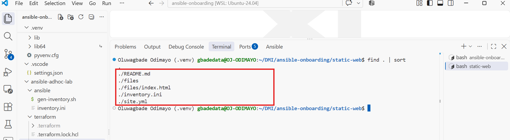

---

# Task 2 — Configure the Ansible Inventory

## Goal

Add both Ubuntu servers to the Ansible inventory.

## Evidence

### Screenshot 2 — Output of `ansible-inventory -i inventory.ini --graph` showing `web1` and `web2`

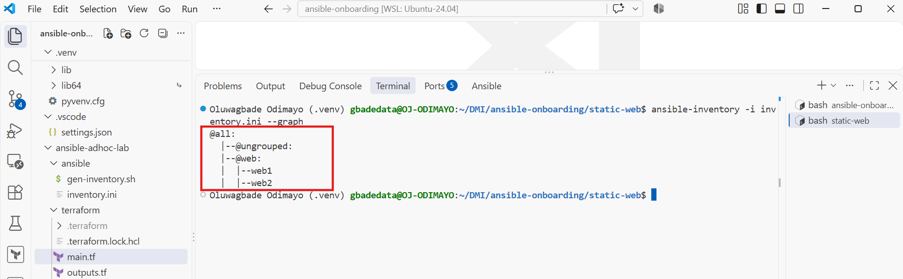

---

## Configuration File

Copy and paste the complete contents of your `inventory.ini` file below:

```ini
# Web servers from the A2 Terraform lab (Oluwagbade Odimayo)
[web]
web1 ansible_host=35.176.126.122
web2 ansible_host=18.135.15.215

[web:vars]
ansible_user=ubuntu
ansible_ssh_private_key_file=~/.ssh/id_ed25519
ansible_python_interpreter=/usr/bin/python3
```

---

# Task 3 — Verify Ansible Connectivity

## Goal

Confirm that the Ansible controller can connect to both servers.

## Evidence

### Screenshot 3 — Ansible ping output showing `SUCCESS` and `pong` for both servers

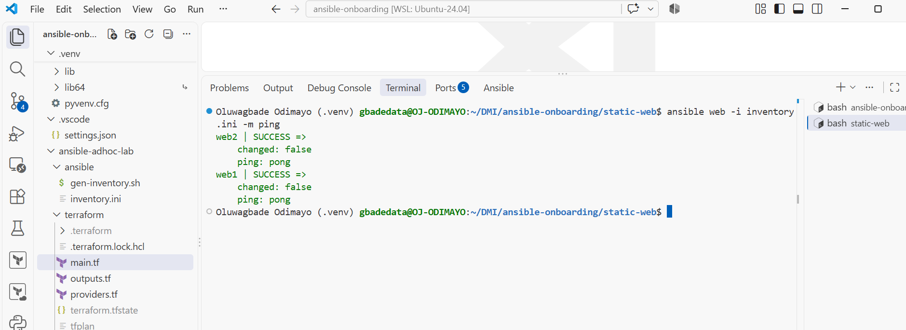

---

# Task 4 — Download and Personalize the Static Website

## Goal

Download `index.html` to the Ansible controller and personalize the website with your full name.

## Evidence

### Screenshot 4 — Edited `files/index.html` showing the footer line with your full name

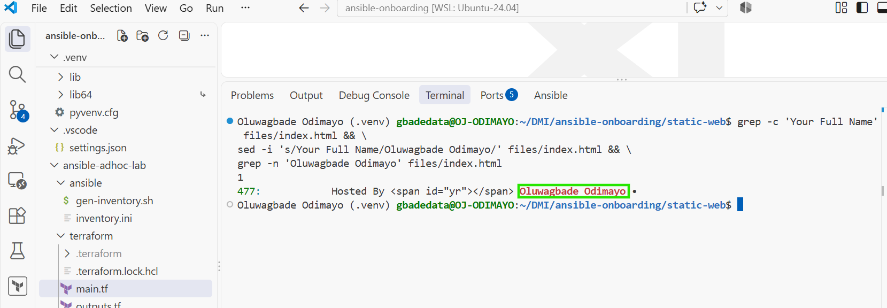

---

# Task 5 — Create the Multi-Play Ansible Playbook

## Goal

Create a single Ansible playbook containing separate plays for installation, deployment, and verification.

## Configuration File

Copy and paste the complete contents of your `site.yml` file below:

```yaml
---
# Multi-play static website deployment (Oluwagbade Odimayo).
# Play 1 installs Nginx, Play 2 deploys the site, Play 3 verifies both servers from the controller.

- name: Play 1 - Install and start Nginx on the web servers
  hosts: web
  become: true
  tasks:
    - name: Install Nginx
      ansible.builtin.apt:
        name: nginx
        state: present
        update_cache: true
        cache_valid_time: 3600

    - name: Ensure Nginx is started and enabled at boot
      ansible.builtin.service:
        name: nginx
        state: started
        enabled: true

- name: Play 2 - Deploy the static website
  hosts: web
  become: true
  tasks:
    - name: Copy index.html to the Nginx web root
      ansible.builtin.copy:
        src: files/index.html
        dest: /var/www/html/index.html
        owner: www-data
        group: www-data
        mode: "0644"
      notify: Reload Nginx

  handlers:
    - name: Reload Nginx
      ansible.builtin.service:
        name: nginx
        state: reloaded

- name: Play 3 - Verify both web servers from the controller
  hosts: localhost
  connection: local
  gather_facts: false
  tasks:
    - name: Request the home page from each web server
      ansible.builtin.uri:
        url: "http://{{ hostvars[item].ansible_host }}/"
        status_code: 200
      loop: "{{ groups['web'] }}"
      register: web_check

    - name: Show the HTTP status returned by each web server
      ansible.builtin.debug:
        msg: "{{ web_check.results | map(attribute='item') | zip(web_check.results | map(attribute='status')) | map('join', ' returned HTTP ') | list }}"

    - name: Assert every web server returned HTTP 200
      ansible.builtin.assert:
        that:
          - web_check.results | map(attribute='status') | select('equalto', 200) | list | length == groups['web'] | length
        success_msg: "All {{ groups['web'] | length }} web servers returned HTTP 200"
        fail_msg: "At least one web server did not return HTTP 200"
```

---

# Task 6 — Validate the Playbook Syntax

## Goal

Check the playbook for YAML or Ansible syntax errors before running it.

## Evidence

### Screenshot 5 — Successful syntax-check output showing `playbook: site.yml`

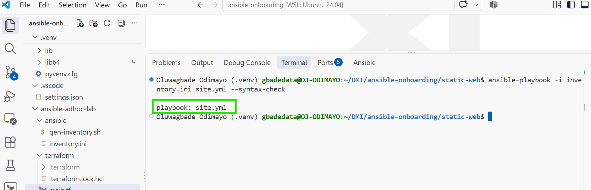

---

# Task 7 — Run the Multi-Play Playbook

## Goal

Install Nginx, deploy the website, and verify both servers in one playbook run.

## Evidence

### Screenshot 6 — Play 3 verification showing HTTP `200` for both servers

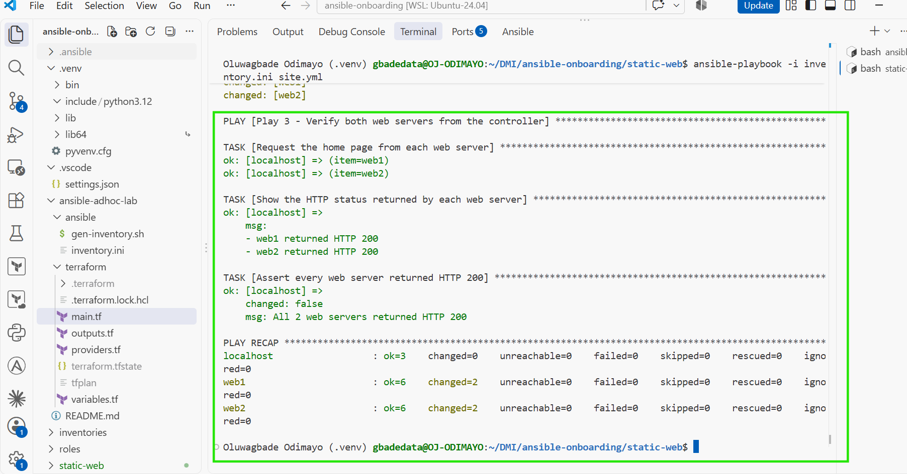

---

### Screenshot 7 — Final play recap showing `unreachable=0` and `failed=0` for `web1`, `web2`, and `localhost`

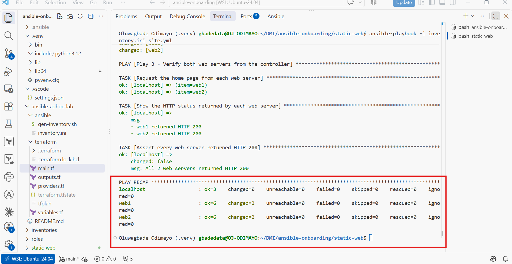

---

# Task 8 — Verify Idempotency

## Goal

Run the playbook again and confirm that it does not make unnecessary changes.

## Evidence

### Screenshot 8 — Second playbook run showing the play recap with `changed=0`, `unreachable=0`, and `failed=0` for both web servers

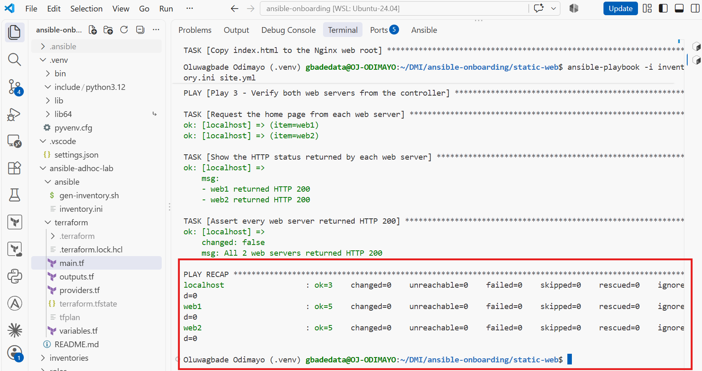

---

# Task 9 — Test Both Websites Manually

## Goal

Confirm that the static website is accessible from both public IP addresses.

## Evidence

### Screenshot 9 — `curl -I` output showing HTTP `200 OK` from both servers

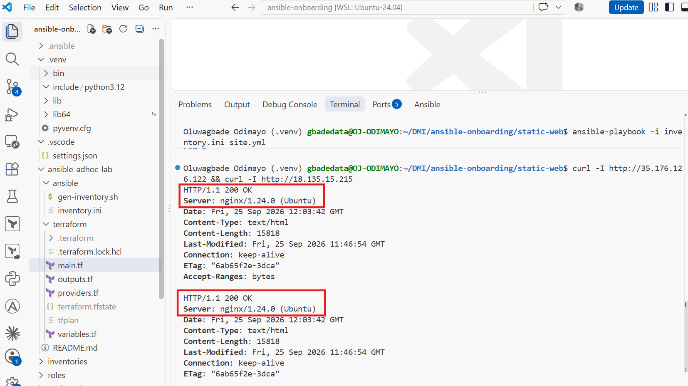

---

### Screenshot 10 — Browser showing the website from Server 1 with the public IP and your full name visible

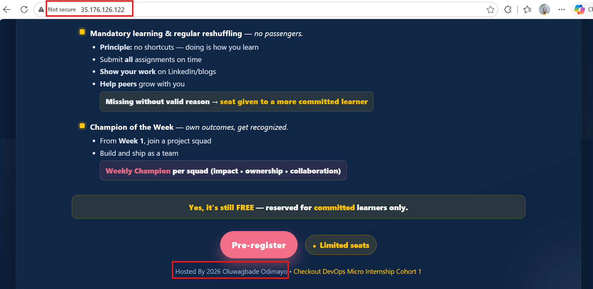

---

### Screenshot 11 — Browser showing the website from Server 2 with the public IP and your full name visible

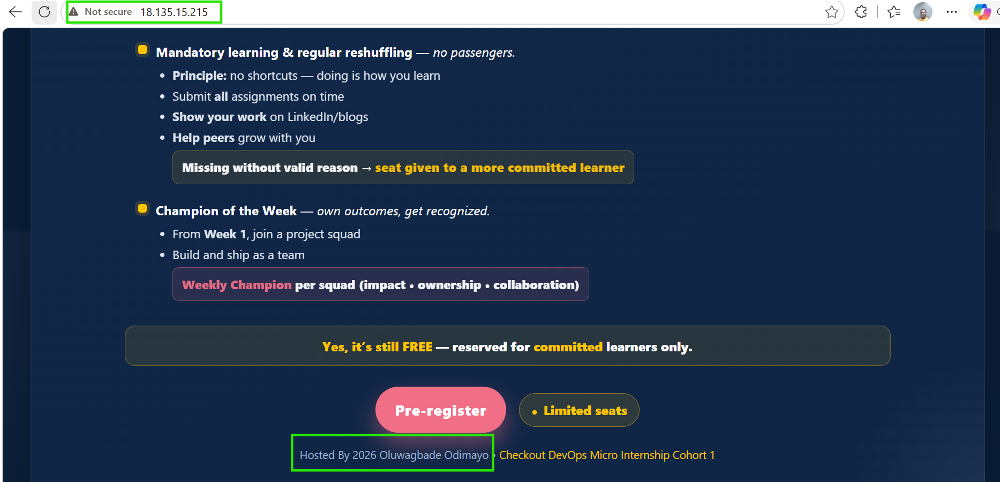

---

## Website URLs

Add both deployed website URLs below:

```text
Server 1 (web1): http://35.176.126.122
Server 2 (web2): http://18.135.15.215
```

---

# Task 10 — Complete the Project README

## Goal

Document how the project works and record what you learned.

## README Content

Copy and paste the complete contents of your `README.md` file below:

````markdown
# Static Website: Multi-Play Ansible Deployment

**Owner:** Oluwagbade Odimayo

**Cloud:** AWS (eu-west-2), reusing web1 and web2 from the Assignment 02 Terraform lab

## What this project does

One Ansible playbook installs Nginx on two Ubuntu servers, deploys a personalised static website to both,
and then checks from the controller that each server returns HTTP 200.

| Server | Public URL |
|---|---|
| web1 | http://35.176.126.122 |
| web2 | http://18.135.15.215 |

## Files

| File | Purpose |
|---|---|
| `inventory.ini` | `[web]` group with web1 and web2, built from the Assignment 02 Terraform outputs |
| `site.yml` | Three plays: install, deploy, verify |
| `files/index.html` | The website, downloaded from `pravinmishraaws/Azure-Static-Website` with my name in the footer |

## How the playbook works

1. **Play 1 (hosts: web)** installs Nginx with `apt` and makes sure the service is started and enabled at boot.
   `cache_valid_time: 3600` stops the package index being refreshed on every run.
2. **Play 2 (hosts: web)** copies `files/index.html` to `/var/www/html/index.html`, owned by `www-data`
   with mode `0644`. If the file changes, it notifies a handler that reloads Nginx.
3. **Play 3 (hosts: localhost)** requests the home page of every host in the `web` group with the `uri`
   module, prints the status for each, and asserts that all of them returned HTTP 200.

## How to run

```bash
export ANSIBLE_CONFIG=~/DMI/ansible-onboarding/ansible.cfg
ansible-playbook -i inventory.ini site.yml --syntax-check
ansible-playbook -i inventory.ini site.yml
```

## Results

- First deployment: web1 and web2 each reported `changed=2` (the page copy and the Nginx reload), with
  `failed=0` and `unreachable=0`. Play 1 reported `ok` because Nginx was already installed in Assignment 02.
- Second run: `changed=0` on both servers, proving the playbook is idempotent.
- `curl -I` and a browser both returned the site with HTTP 200 from each public IP.

## What I learned

- Splitting install, deploy and verify into separate plays keeps each concern readable, and lets the
  verification run from the controller, which is where a real user's request comes from.
- A handler only runs when something it watches has changed, so the Nginx reload happened on the first
  deployment and was skipped on the rerun.
- Idempotency means the playbook describes a desired state rather than a list of steps. When I removed
  `index.html` from both servers, the next run put it back and reloaded Nginx; when nothing had drifted,
  the same run changed nothing.
````

---

# LinkedIn Post Required

## Evidence

### LinkedIn Post URL

Paste your LinkedIn post URL here:

Not published: I chose not to publish a LinkedIn post for this assignment.

---

### Screenshot — Published LinkedIn post

Not published: I chose not to publish a LinkedIn post for this assignment.

---

# Assignment Questions

Answer the following in your own words:

**1. What issue did you face while completing this assignment, and how did you fix it?**

After the first deployment I cleared the terminal before capturing the recap, and the screenshot I kept came from a later run that showed `changed=0`, so it did not prove anything had been deployed. To get a genuine first run back, I removed the deployed page from both servers with an ad-hoc command, `ansible web -i inventory.ini -m file -a "path=/var/www/html/index.html state=absent" --become`, and ran the playbook again. It copied the page and fired the Nginx reload handler on both servers (`ok=6 changed=2`), and a further run showed `changed=0`. The mistake ended up demonstrating drift correction: Ansible put the missing file back because the servers no longer matched the desired state.

---

**2. What did you learn from this assignment?**

I learned how a single playbook can hold several plays that target different hosts, here the `web` group for installing and deploying and `localhost` for verifying. I also saw how handlers work in practice: the Nginx reload only ran when the page actually changed. Finally, I learned to trust the play recap as evidence. `changed=2` on the first run and `changed=0` on the second is the clearest proof that a playbook describes a state rather than repeating actions.

---

**3. Why is it useful to split installation, deployment, and verification into separate plays?**

Each play has one job, so the playbook reads like the process it automates: install, deploy, verify. Separate plays can target different hosts, which is what lets the verification run on `localhost` and test the servers from outside, the way a visitor would, instead of each server checking itself. It also makes failures easier to locate: if Play 3 fails, I know the software was installed and the file deployed, and the problem is in serving or reaching the site.

---

**4. What is one benefit of using the Ansible `copy` module instead of cloning the website directly from Git on every managed server?**

The controller becomes the single source of truth. The personalised `index.html` exists once, on the controller, and the `copy` module pushes exactly that file to every server, so both servers are guaranteed to serve identical content. The servers need neither Git nor access to GitHub, which means fewer packages and less outbound network access. `copy` is also naturally idempotent: it compares checksums and only transfers the file when it differs, whereas cloning on every server would pull whatever the repository holds at that moment and would not include my local edit.

---

**5. What does idempotency mean in this assignment?**

Running the playbook again produces the same end state without making unnecessary changes. On the first deployment web1 and web2 each reported `changed=2`, because the page was copied and Nginx was reloaded. On the second run both reported `changed=0`: Nginx was already installed and running, the page on each server already matched the controller's copy, and so the handler never fired. Play 1 even reported `ok` on the first run, because Nginx had already been installed during Assignment 02.

---

**6. What does the Ansible `uri` module verify in Play 3?**

The `uri` module sends a real HTTP request from the controller to each web server's public IP and checks that the response status is 200. That proves more than `systemctl is-active nginx` can: Nginx is running, it is serving the deployed page, port 80 is open in the security group, and the site is reachable over the internet from outside the server. The follow-up `assert` task fails the whole play if any server does not return 200, so a broken deployment cannot finish with a green recap.

---

# Required Files

Confirm that the following files are included in your assignment folder:

- [x] `inventory.ini`
- [x] `site.yml`
- [x] `files/index.html`
- [x] `README.md`

---

# Submission Instructions

- Add all required screenshots in the correct order.
- Full Name must be visible in required screenshots.
- Include both deployed website URLs.
- Paste `inventory.ini`, `site.yml`, and `README.md` as editable text.
- Answer all assignment questions clearly in your own words.
- Add your LinkedIn post URL.
- Do not expose SSH private keys, passwords, cloud account IDs, or other sensitive information.

---

# Completion Checklist

- [x] Task 1: `static-web` folder structure is complete
- [x] Task 2: Both servers are listed under the `[web]` group in `inventory.ini`
- [x] Task 2: Inventory graph shows `web1` and `web2`
- [x] Task 3: Ansible ping returns `SUCCESS` and `pong` for both servers
- [x] Task 4: `files/index.html` contains your full name
- [x] Task 5: `site.yml` contains three separate plays
- [x] Task 5: Play 1 installs, starts, and enables Nginx
- [x] Task 5: Play 2 deploys `index.html` using the `copy` module
- [x] Task 5: Nginx reload handler is included
- [x] Task 5: Play 3 verifies both web servers from the controller
- [x] Task 6: Playbook syntax check passes
- [x] Task 7: First playbook run completes with `unreachable=0` and `failed=0`
- [x] Task 7: URI verification returns HTTP `200` for both servers
- [x] Task 8: Second playbook run demonstrates idempotency
- [x] Task 8: Second run shows `changed=0` for both web servers
- [x] Task 9: Both `curl -I` commands return HTTP `200 OK`
- [x] Task 9: Website loads from Server 1
- [x] Task 9: Website loads from Server 2
- [x] Task 9: Full name is visible on both deployed websites
- [x] Task 10: `README.md` contains all required explanations
- [x] Screenshots 1–11 are included
- [x] `inventory.ini`, `site.yml`, and `README.md` are pasted as editable text
- [x] Both website URLs are included
- [x] Assignment questions are answered
- [ ] LinkedIn post published (not published, by choice)
- [ ] LinkedIn post URL added (not published, by choice)
- [x] No sensitive information is exposed

---

## About DMI & CloudAdvisory

DevOps Micro Internship (DMI) is a project-based DevOps program run by Pravin Mishra and The CloudAdvisory, focused on real-world execution, systems thinking, and career readiness.

It helps learners build strong DevOps foundations with hands-on experience.

---

## Resources

- DMI Official Website: [https://dmi.pravinmishra.com?utm_source=github&utm_medium=readme](https://dmi.pravinmishra.com?utm_source=github&utm_medium=readme)
- University: [https://university.pravinmishra.com?utm_source=github&utm_medium=readme](https://university.pravinmishra.com?utm_source=github&utm_medium=readme)
- Discord Community: [https://discord.pravinmishra.com?utm_source=github&utm_medium=readme](https://discord.pravinmishra.com?utm_source=github&utm_medium=readme)
- Blog: [https://dmi.pravinmishra.com/blog?utm_source=github&utm_medium=readme](https://dmi.pravinmishra.com/blog?utm_source=github&utm_medium=readme)
- YouTube Playlist: [https://www.youtube.com/playlist?list=PLFeSNDtI4Cho](https://www.youtube.com/playlist?list=PLFeSNDtI4Cho)
- Pravin Mishra LinkedIn: [https://www.linkedin.com/in/pravin-mishra-aws-trainer/](https://www.linkedin.com/in/pravin-mishra-aws-trainer/)
- CloudAdvisory LinkedIn: [https://www.linkedin.com/company/thecloudadvisory/](https://www.linkedin.com/company/thecloudadvisory/)

---

*This submission is part of DevOps Micro Internship (DMI) — Agentic AI Track.*