# Assignment 04 — Deploy Mini Finance on Azure Using Terraform and Ansible

Part of the DevOps Micro Internship (DMI) with Agentic AI

**Full Name:** Oluwagbade Odimayo  
**Cloud Platform:** Microsoft Azure (UK West)  
**Azure VM Public IP:** 51.137.182.18  
**Website URL:** http://51.137.182.18  
**Project files:** [`ansible-onboarding/mini-finance/`](./ansible-onboarding/mini-finance/)

---

## Purpose

In this assignment, you will provision Azure infrastructure using Terraform and deploy the Mini Finance website using an Ansible multi-play playbook.

Terraform will create the Azure Virtual Machine and networking resources. Ansible will install Nginx, clone the Mini Finance repository, deploy the website, and verify the deployment.

---

# Task 1 — Create the Project Structure

## Goal

Create separate directories and files for the Terraform infrastructure and Ansible configuration.

### Evidence

#### Screenshot 1 — Terminal or VS Code showing the complete `mini-finance` project structure

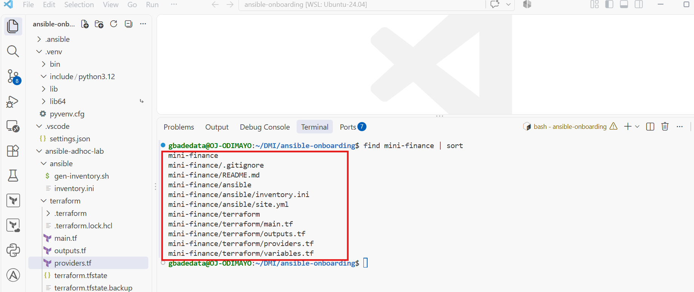

---

### Notes

I created `mini-finance/` inside my `ansible-onboarding` workspace with `terraform/` for the Azure infrastructure, `ansible/` for the inventory and playbook, a `README.md` and its own `.gitignore`. The `.gitignore` excludes Terraform state, plan files, the `.terraform/` provider cache, `*.auto.tfvars` and key files, so nothing sensitive or bulky can be committed from this project.

---

# Task 2 — Create the Azure Infrastructure Using Terraform

## Goal

Use Terraform to provision an Ubuntu Virtual Machine with the required Azure networking and security resources.

### Evidence

#### Screenshot 2 — Terraform code showing the `Allow-SSH` rule for port `22` and the `Allow-HTTP` rule for port `80`

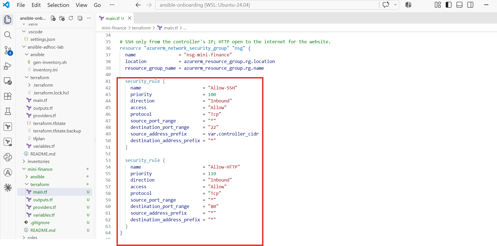

---

#### Screenshot 3 — Terraform code showing the association between `nsg-mini-finance` and `nic-mini-finance`

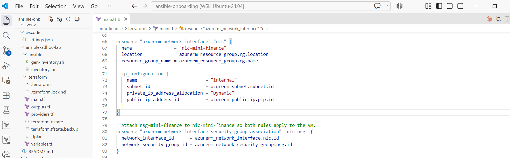

---

### Notes

Every resource is named to match the assignment: `rg-mini-finance`, `vnet-mini-finance`, `snet-mini-finance`, `pip-mini-finance`, `nsg-mini-finance`, `nic-mini-finance` and `vm-mini-finance`. The NSG has two inbound rules: `Allow-SSH` on port 22 with the source set to `var.controller_cidr` (my public IP as a /32), and `Allow-HTTP` on port 80 from anywhere. `azurerm_network_interface_security_group_association` attaches the NSG to the NIC, so both rules apply to the VM. The VM runs Ubuntu 24.04 on `Standard_B1s` with password login disabled, and its `computer_name` is `mini-finance`. The subscription ID and my IP are passed as environment variables and never written to a file. I used my RSA key for the VM because it had already worked with Azure on this subscription in Week 8.

---

# Task 3 — Initialize and Apply the Terraform Configuration

## Goal

Format and validate the Terraform configuration, review the execution plan, and provision the Azure infrastructure.

### Evidence

#### Screenshot 4 — End of the `terraform apply` output showing `Apply complete!` with no errors

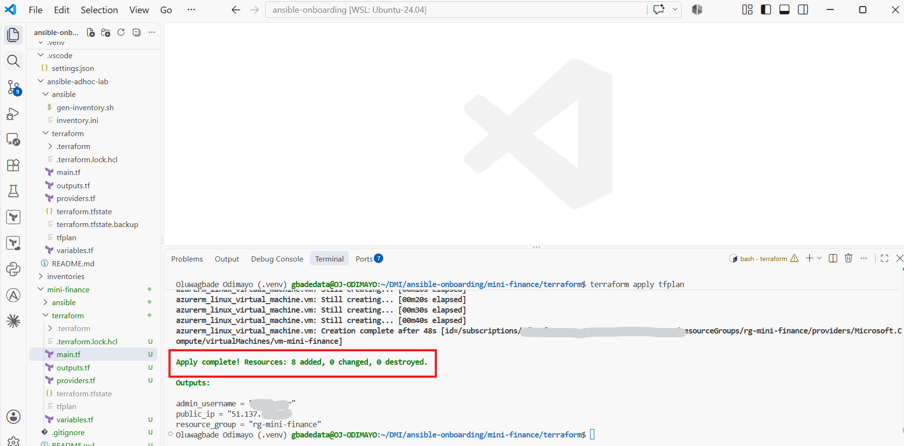

---

#### Screenshot 5 — Output of `terraform output public_ip` showing the VM’s public IP address

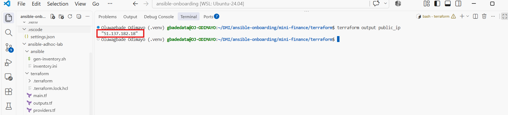

---

### Notes

Before planning I confirmed the subscription was enabled, loaded `ARM_SUBSCRIPTION_ID` without printing it, and checked that `Standard_B1s` had no restrictions in UK West. `terraform fmt` found nothing to change, `terraform init` installed AzureRM v4.81.0, and `terraform validate` passed. The saved plan showed `8 to add, 0 to change, 0 to destroy`, and `terraform apply tfplan` completed with 8 resources added. `terraform output public_ip` returned `51.137.182.18`.

---

# Task 4 — Verify Passwordless SSH Access

## Goal

Confirm that the Ansible controller can connect to the Terraform-provisioned Azure VM using SSH key authentication.

### Evidence

#### Screenshot 6 — Passwordless SSH command and the returned `mini-finance` hostname

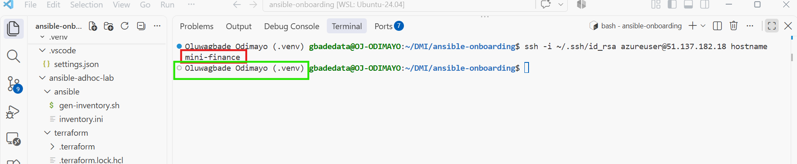

---

### Notes

`ssh -i ~/.ssh/id_rsa azureuser@51.137.182.18 hostname` returned `mini-finance` without asking for a password. On the first connection my `StrictHostKeyChecking accept-new` setting from Assignment 01 recorded the VM's host key automatically, so there was no interactive fingerprint prompt, and any later change to that key would be refused.

---

# Task 5 — Create the Ansible Inventory and Verify Connectivity

## Goal

Add the Terraform-provisioned Azure VM to the Ansible inventory and confirm that Ansible can connect to it.

### Evidence

#### Screenshot 7 — Ansible ping output showing `SUCCESS` and `pong` from the Azure VM

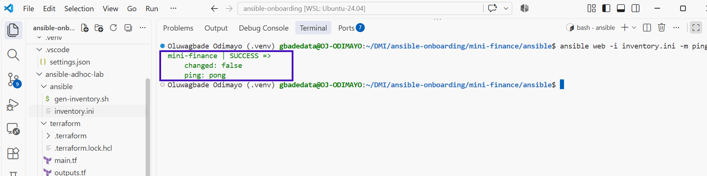

---

### Configuration File

Copy and paste the complete contents of your `ansible/inventory.ini` file below:

```ini
# Generated from the Terraform public_ip output (Oluwagbade Odimayo)
[web]
mini-finance ansible_host=51.137.182.18

[web:vars]
ansible_user=azureuser
ansible_ssh_private_key_file=~/.ssh/id_rsa
ansible_python_interpreter=/usr/bin/python3
```

---

# Task 6 — Create the Multi-Play Ansible Playbook

## Goal

Create one Ansible playbook containing separate plays to install Nginx, deploy the Mini Finance website, and verify the deployment.

### Evidence

#### Screenshot 8 — `site.yml` showing Play 1 and the beginning of Play 2

Screenshot must show:

- Play 1 targeting the `web` group
- Installation of `nginx`, `git`, and `rsync`
- Nginx service configured as started and enabled
- Beginning of Play 2 with the Git repository URL and synchronization task

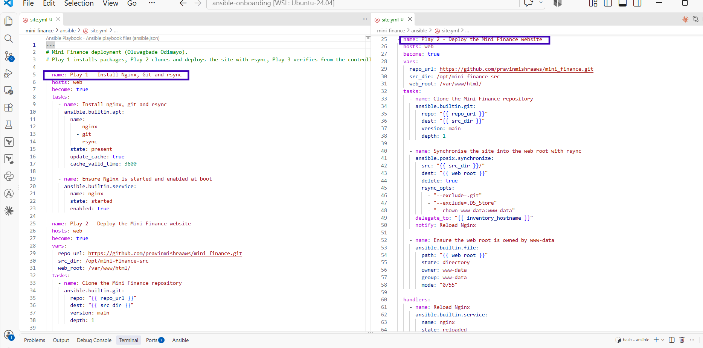

---

#### Screenshot 9 — `site.yml` showing the deployment destination, handler, and Play 3 verification

Screenshot must show:

- Website destination `/var/www/html/`
- Ownership set to `www-data:www-data`
- Nginx reload handler
- Play 3 targeting `localhost`
- The `uri` verification and `assert` condition

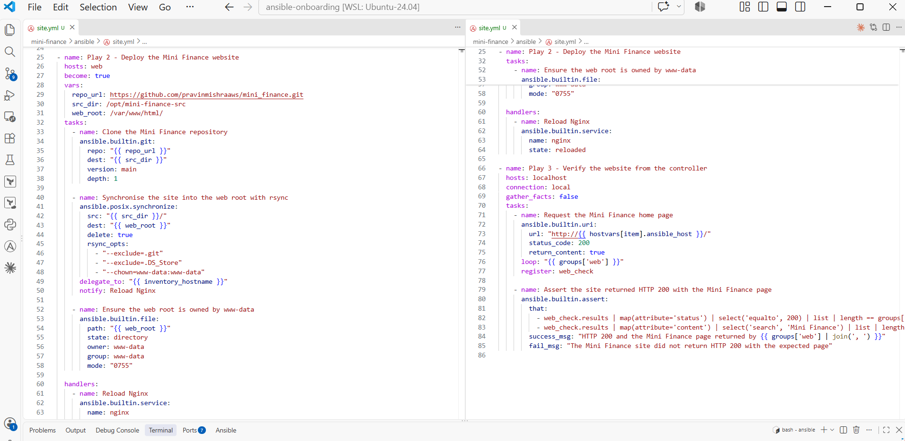

---

### Configuration File

Copy and paste the complete contents of your `ansible/site.yml` file below:

```yaml
---
# Mini Finance deployment (Oluwagbade Odimayo).
# Play 1 installs packages, Play 2 clones and deploys the site with rsync, Play 3 verifies from the controller.

- name: Play 1 - Install Nginx, Git and rsync
  hosts: web
  become: true
  tasks:
    - name: Install nginx, git and rsync
      ansible.builtin.apt:
        name:
          - nginx
          - git
          - rsync
        state: present
        update_cache: true
        cache_valid_time: 3600

    - name: Ensure Nginx is started and enabled at boot
      ansible.builtin.service:
        name: nginx
        state: started
        enabled: true

- name: Play 2 - Deploy the Mini Finance website
  hosts: web
  become: true
  vars:
    repo_url: https://github.com/pravinmishraaws/mini_finance.git
    src_dir: /opt/mini-finance-src
    web_root: /var/www/html/
  tasks:
    - name: Clone the Mini Finance repository
      ansible.builtin.git:
        repo: "{{ repo_url }}"
        dest: "{{ src_dir }}"
        version: main
        depth: 1

    - name: Synchronise the site into the web root with rsync
      ansible.posix.synchronize:
        src: "{{ src_dir }}/"
        dest: "{{ web_root }}"
        delete: true
        rsync_opts:
          - "--exclude=.git"
          - "--exclude=.DS_Store"
          - "--chown=www-data:www-data"
      delegate_to: "{{ inventory_hostname }}"
      notify: Reload Nginx

    - name: Ensure the web root is owned by www-data
      ansible.builtin.file:
        path: "{{ web_root }}"
        state: directory
        owner: www-data
        group: www-data
        mode: "0755"

  handlers:
    - name: Reload Nginx
      ansible.builtin.service:
        name: nginx
        state: reloaded

- name: Play 3 - Verify the website from the controller
  hosts: localhost
  connection: local
  gather_facts: false
  tasks:
    - name: Request the Mini Finance home page
      ansible.builtin.uri:
        url: "http://{{ hostvars[item].ansible_host }}/"
        status_code: 200
        return_content: true
      loop: "{{ groups['web'] }}"
      register: web_check

    - name: Assert the site returned HTTP 200 with the Mini Finance page
      ansible.builtin.assert:
        that:
          - web_check.results | map(attribute='status') | select('equalto', 200) | list | length == groups['web'] | length
          - web_check.results | map(attribute='content') | select('search', 'Mini Finance') | list | length == groups['web'] | length
        success_msg: "HTTP 200 and the Mini Finance page returned by {{ groups['web'] | join(', ') }}"
        fail_msg: "The Mini Finance site did not return HTTP 200 with the expected page"
```

---

# Task 7 — Validate and Run the Ansible Playbook

## Goal

Validate the syntax of the multi-play Ansible playbook and run it to install Nginx, deploy the Mini Finance website, and verify the deployment.

### Evidence

#### Screenshot 10 — Successful playbook syntax check showing `playbook: site.yml`

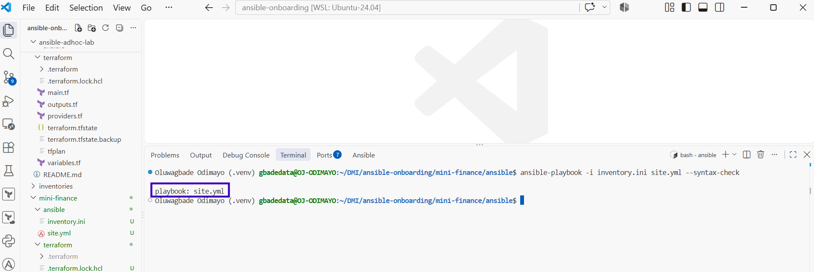

---

#### Screenshot 11 — Play 3 output showing the successful HTTP verification and assertion

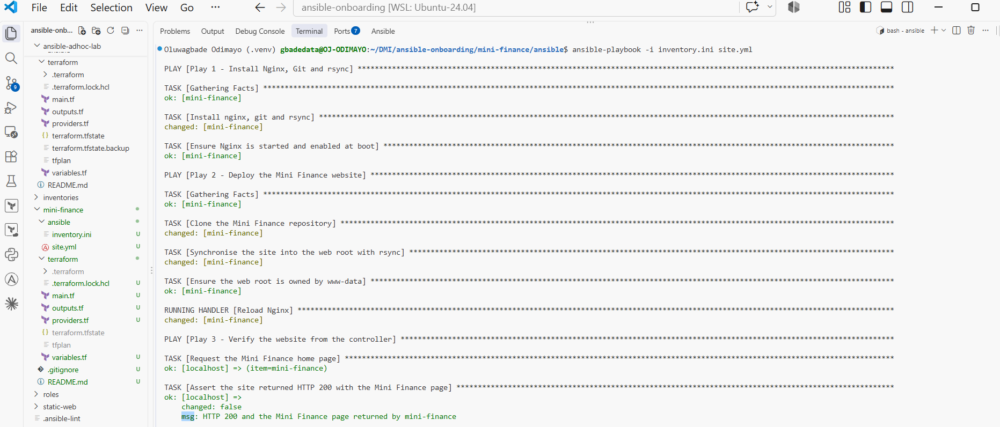

---

#### Screenshot 12 — Final `PLAY RECAP` showing `failed=0` and `unreachable=0`

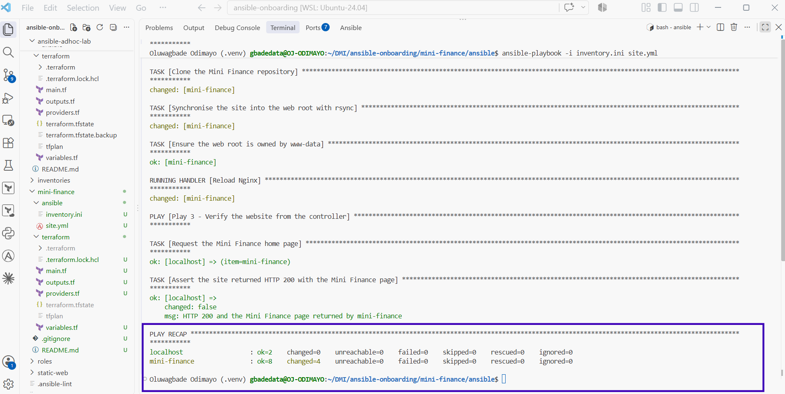

---

### Notes

The syntax check returned `playbook: site.yml`. Before the real run I waited for `cloud-init status --wait` to report `done`, so the package install would not collide with the VM's first-boot updates. The playbook installed the packages, cloned the repository, synchronised it into `/var/www/html/` and fired the Nginx reload handler. Play 3 confirmed HTTP 200 and that the returned page was Mini Finance, and the recap showed `failed=0` and `unreachable=0` for both `mini-finance` and `localhost`.

---

# Task 8 — Test the Mini Finance Website in a Browser

## Goal

Confirm that the Mini Finance website is publicly accessible through the Azure VM’s public IP address.

### Evidence

#### Screenshot 13 — Mini Finance website successfully loading in the browser, with the Azure VM’s public IP address visible in the address bar

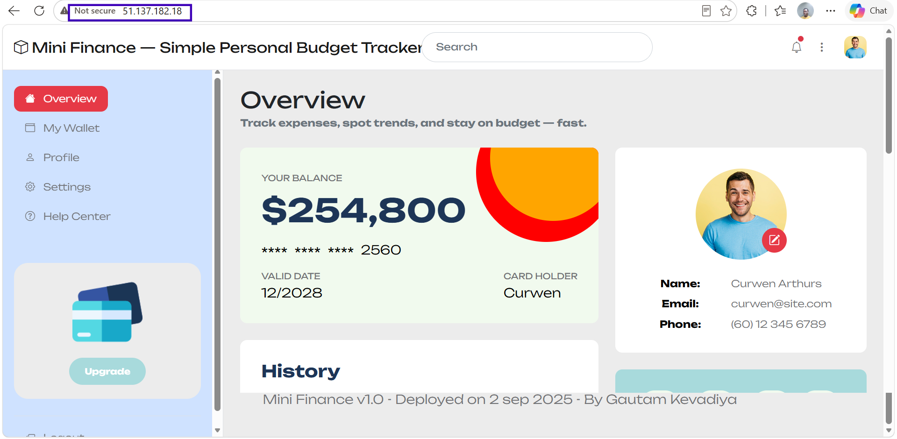

---

### Website URL

Add your deployed website URL below:

```text
http://51.137.182.18
```

---

# Task 9 — Create the Project README

## Goal

Create a `README.md` file to document the Mini Finance infrastructure and deployment project.

### Evidence

#### Screenshot 14 — Completed `README.md` displayed in the VS Code Markdown preview or terminal

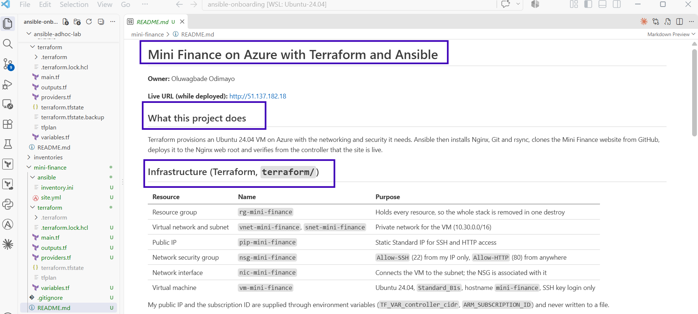

---

### README Content

Copy and paste the complete contents of your `README.md` file below:

````markdown
# Mini Finance on Azure with Terraform and Ansible

**Owner:** Oluwagbade Odimayo

**Live URL (while deployed):** http://51.137.182.18

## What this project does

Terraform provisions an Ubuntu 24.04 VM on Azure with the networking and security it needs. Ansible then
installs Nginx, Git and rsync, clones the Mini Finance website from GitHub, deploys it to the Nginx web
root and verifies from the controller that the site is live.

## Infrastructure (Terraform, `terraform/`)

| Resource | Name | Purpose |
|---|---|---|
| Resource group | `rg-mini-finance` | Holds every resource, so the whole stack is removed in one destroy |
| Virtual network and subnet | `vnet-mini-finance`, `snet-mini-finance` | Private network for the VM (10.30.0.0/16) |
| Public IP | `pip-mini-finance` | Static Standard IP for SSH and HTTP access |
| Network security group | `nsg-mini-finance` | `Allow-SSH` (22) from my IP only, `Allow-HTTP` (80) from anywhere |
| Network interface | `nic-mini-finance` | Connects the VM to the subnet; the NSG is associated with it |
| Virtual machine | `vm-mini-finance` | Ubuntu 24.04, `Standard_B1s`, hostname `mini-finance`, SSH key login only |

My public IP and the subscription ID are supplied through environment variables
(`TF_VAR_controller_cidr`, `ARM_SUBSCRIPTION_ID`) and never written to a file.

## Configuration and deployment (Ansible, `ansible/`)

| Play | Hosts | What it does |
|---|---|---|
| Play 1 | `web` | Installs `nginx`, `git` and `rsync`; makes sure Nginx is started and enabled |
| Play 2 | `web` | Clones `pravinmishraaws/mini_finance`, rsyncs it into `/var/www/html/` owned by `www-data:www-data` (excluding `.git`), reloads Nginx through a handler when files change |
| Play 3 | `localhost` | Requests the site with the `uri` module and asserts HTTP 200 and that the Mini Finance page is returned |

## How to run

```bash
# Infrastructure
cd terraform
export ARM_SUBSCRIPTION_ID="$(az account show --query id -o tsv)"
export TF_VAR_controller_cidr="$(curl -s https://checkip.amazonaws.com)/32"
terraform fmt && terraform init && terraform validate
terraform plan -out=tfplan && terraform apply tfplan

# Deployment
cd ../ansible
export ANSIBLE_CONFIG=~/DMI/ansible-onboarding/ansible.cfg
ansible web -i inventory.ini -m ping
ansible-playbook -i inventory.ini site.yml --syntax-check
ansible-playbook -i inventory.ini site.yml
```

Tear down with `terraform destroy` from `terraform/` once finished.

## Results

- Terraform: `Plan: 8 to add`, then `Apply complete! Resources: 8 added`.
- SSH: `ssh -i ~/.ssh/id_rsa azureuser@<public_ip> hostname` returned `mini-finance` with no password.
- Ansible: `ping` returned `pong`; the playbook finished with `failed=0` and `unreachable=0`, and Play 3
  confirmed HTTP 200 and the Mini Finance page.
- The site loaded in a browser at the VM's public IP.

## What I learned

- Terraform and Ansible have separate jobs: Terraform decides what exists, Ansible decides what runs on it.
  The only hand-off between them is the `public_ip` output, which I used to generate the inventory.
- Deploying with `rsync` from a clone on the server copies only changed files, removes files that no longer
  exist in the repository, and keeps `.git` out of the public web root.
- Verifying from the controller with `uri` tests what a visitor experiences, including the NSG rule for
  port 80, not just whether the Nginx service is running.
````

---

# LinkedIn Post Required

## Evidence

#### Screenshot 15 — Published LinkedIn post showing the text and at least one deployment screenshot

Not published: I chose not to publish a LinkedIn post for this assignment.

---

#### LinkedIn Post URL

Paste your LinkedIn post URL here:

Not published: I chose not to publish a LinkedIn post for this assignment.

---

### LinkedIn Submission Notes

**One challenge you faced and how you fixed it:**

Midway through I closed my terminal by mistake and lost the environment variables Terraform needed (`ARM_SUBSCRIPTION_ID` and `TF_VAR_controller_cidr`). In the new terminal I ran `terraform apply tfplan` from the wrong directory, and it failed immediately because no saved plan existed there. Nothing was touched, since the infrastructure had already been created and Terraform only applies a reviewed plan file. I confirmed the VM was fine with SSH, and learned to treat environment variables as session state that has to be restored before any Terraform command, not something to assume.

---

**One real-world example where you can use this learning:**

Standing up a demo or staging environment for a client: Terraform creates the VM and network with locked-down SSH, Ansible deploys the site or app in a repeatable way, and a single `terraform destroy` removes everything when the review is over, so nothing is left running and billing.

---

# Assignment Questions

Answer the following in your own words:

**1. What did you provision using Terraform in this assignment?**

A complete Azure environment for one web server: the `rg-mini-finance` resource group, a virtual network and subnet, a static Standard public IP, the `nsg-mini-finance` network security group with `Allow-SSH` and `Allow-HTTP` rules, the `nic-mini-finance` network interface with the NSG associated to it, and an Ubuntu 24.04 `Standard_B1s` VM with hostname `mini-finance` and SSH key login only. Eight resources in total.

---

**2. What did Ansible configure and deploy in this assignment?**

Ansible installed `nginx`, `git` and `rsync`, made sure Nginx was running and enabled at boot, cloned the Mini Finance repository onto the VM, synchronised the site into `/var/www/html/` owned by `www-data:www-data` without the `.git` folder, and reloaded Nginx through a handler. It then verified the deployment from the controller.

---

**3. Why is SSH access on port `22` restricted to your public IP address?**

SSH gives full control of the server, so it should only be reachable by the machine that manages it. Restricting port 22 to my /32 means the rest of the internet cannot even attempt to log in, which removes the constant password-guessing and scanning that any open SSH port attracts. Key-only login is a second layer on top of that, not a replacement for it.

---

**4. Why is HTTP port `80` open to the internet?**

Port 80 serves the website, and the site is meant to be public, so any visitor has to be able to reach it. The risk is low because Nginx only serves static files on that port and nothing on it grants control of the server. In production I would add HTTPS on 443 and redirect port 80 to it.

---

**5. What is the purpose of the Ansible inventory file?**

It tells Ansible which hosts to manage and how to connect to them. Mine puts the VM in the `web` group, maps the name `mini-finance` to its public IP with `ansible_host`, and sets the SSH user `azureuser`, the private key and the Python interpreter. I generated it from the Terraform `public_ip` output, so the inventory always matches the infrastructure that actually exists.

---

**6. Why does the playbook use separate plays for install, deploy, and verify?**

Each play has one responsibility, which makes the playbook read like the process: prepare the server, deploy the site, prove it works. The plays can also target different hosts, which is what lets Play 3 run on `localhost` and test the site from outside the VM, as a visitor would. If something fails, the play it fails in tells me immediately whether the problem is packages, deployment or reachability.

---

**7. Why is `rsync` useful when deploying website files?**

rsync compares source and destination and transfers only what differs, so re-runs are fast and report no change when nothing changed. With `delete` it also removes files from the web root that no longer exist in the repository, so the server exactly mirrors the source. I could exclude `.git` so repository history never lands in a public folder, and set `www-data` ownership during the copy.

---

**8. What does the Ansible `uri` module verify in this assignment?**

It sends a real HTTP request from the controller to the VM's public IP and checks the response is 200. My `assert` also checks that the returned page contains "Mini Finance", so it proves the right site is being served, not just that Nginx answered. Because the request comes from outside the VM, it also proves the NSG allows port 80 and the public IP is working.

---

**9. What issue did you face during this assignment, and how did you fix it?**

My first attempt to commit the project was blocked by the ansible-lint pre-commit hook with `syntax-check[unknown-module]: couldn't resolve module/action 'ansible.posix.synchronize'`. The playbook itself was fine and had already deployed the site, because my `.venv` has the full `ansible` package, which includes the `ansible.posix` collection. The hook, however, runs ansible-lint in its own isolated environment that only had `ansible-core`, so the collection did not exist there. I fixed it by adding `ansible==14.4.0`, the same version pinned in `requirements.txt`, to the hook's `additional_dependencies`, then confirmed all hooks passed and that a deliberately misspelled module name still failed, so the linter was genuinely checking modules rather than skipping them. The lesson: a playbook that runs on my machine is not proof that a teammate's tooling or CI will accept it.

---

**10. What did you learn from using Terraform and Ansible together?**

Each tool does the part it is best at. Terraform describes what should exist and can create or remove the whole environment in one command. Ansible describes what should run on it and can re-run safely at any time. The hand-off between them is small and explicit: one Terraform output became the Ansible inventory, so no IP address was ever typed by hand.

---

# Required Files

Confirm that the following files are included in your assignment folder:

- [x] `.gitignore`
- [x] `README.md`
- [x] `terraform/providers.tf`
- [x] `terraform/main.tf`
- [x] `terraform/variables.tf`
- [x] `terraform/outputs.tf`
- [x] `ansible/inventory.ini`
- [x] `ansible/site.yml`

---

# Submission Instructions

- Add all required screenshots in the correct order.
- Full Name must be visible in required screenshots.
- Add the Azure VM public IP address.
- Add the final Mini Finance website URL.
- Paste `inventory.ini`, `site.yml`, and `README.md` as editable text.
- Answer all assignment questions clearly in your own words.
- Add your LinkedIn post URL.
- Do not expose SSH private keys, passwords, Azure credentials, subscription IDs, Terraform state contents, or other sensitive information.

---

# Completion Checklist

- [x] Task 1: `mini-finance` project structure created
- [x] Task 1: `.gitignore` created
- [x] Task 2: Terraform Azure infrastructure code created
- [x] Task 2: `Allow-SSH` rule configured for port `22`
- [x] Task 2: `Allow-HTTP` rule configured for port `80`
- [x] Task 2: NSG associated with the Network Interface
- [x] Task 3: `terraform fmt` completed
- [x] Task 3: `terraform init` completed
- [x] Task 3: `terraform validate` completed successfully
- [x] Task 3: `terraform apply` completed successfully
- [x] Task 3: `terraform output public_ip` displayed the VM public IP
- [x] Task 4: Passwordless SSH works from the Ansible controller
- [x] Task 5: `inventory.ini` created
- [x] Task 5: Ansible ping returns `SUCCESS` and `pong`
- [x] Task 6: `site.yml` contains three separate plays
- [x] Task 6: Play 1 installs Nginx, Git, and rsync
- [x] Task 6: Play 2 clones and deploys the Mini Finance website
- [x] Task 6: Play 3 verifies HTTP status code `200`
- [x] Task 7: Playbook syntax check passes
- [x] Task 7: Ansible playbook completes successfully
- [x] Task 7: Final recap shows `failed=0` and `unreachable=0`
- [x] Task 8: Mini Finance website loads in the browser
- [x] Task 8: Azure VM public IP is visible in the browser screenshot
- [x] Task 9: `README.md` completed
- [x] Screenshots 1–15 are included
- [x] `inventory.ini`, `site.yml`, and `README.md` are pasted as editable text
- [x] Assignment questions are answered
- [ ] LinkedIn post published with Anyone visibility (not published, by choice)
- [ ] LinkedIn post URL added (not published, by choice)
- [x] No sensitive information is exposed

---

## About DMI & CloudAdvisory

DevOps Micro Internship (DMI) is a project-based DevOps program run by Pravin Mishra and The CloudAdvisory, focused on real-world execution, systems thinking, and career readiness.

It helps learners build strong DevOps foundations with hands-on experience.

---

## Resources

- DMI Official Website: [https://dmi.pravinmishra.com?utm_source=github&utm_medium=readme](https://dmi.pravinmishra.com?utm_source=github&utm_medium=readme)
- University: [https://university.pravinmishra.com?utm_source=github&utm_medium=readme](https://university.pravinmishra.com?utm_source=github&utm_medium=readme)
- Discord Community: [https://discord.pravinmishra.com?utm_source=github&utm_medium=readme](https://discord.pravinmishra.com?utm_source=github&utm_medium=readme)
- Blog: [https://dmi.pravinmishra.com/blog?utm_source=github&utm_medium=readme](https://dmi.pravinmishra.com/blog?utm_source=github&utm_medium=readme)
- YouTube Playlist: [https://www.youtube.com/playlist?list=PLFeSNDtI4Cho](https://www.youtube.com/playlist?list=PLFeSNDtI4Cho)
- Pravin Mishra LinkedIn: [https://www.linkedin.com/in/pravin-mishra-aws-trainer/](https://www.linkedin.com/in/pravin-mishra-aws-trainer/)
- CloudAdvisory LinkedIn: [https://www.linkedin.com/company/thecloudadvisory/](https://www.linkedin.com/company/thecloudadvisory/)

---

*This submission is part of DevOps Micro Internship (DMI) — Agentic AI Track.*