# Assignment — Deploy EpicBook with Terraform and Ansible Roles

Part of the DevOps Micro Internship (DMI) with Agentic AI

**Full Name:** Oluwagbade Odimayo  
**Cloud Provider:** AWS (eu-west-2, London)  
**VM Public IP:** 13.135.253.192  
**Application URL:** http://13.135.253.192  
**Project files:** [`ansible-onboarding/epicbook-prod/`](./ansible-onboarding/epicbook-prod/)

**Terraform output proof** (Screenshot 3; the database password is deliberately not an output):

```text
app_public_ip = "13.135.253.192"
app_url       = "http://13.135.253.192"
db_endpoint   = "epicbook-prod-mysql.cn60uk6w89cm.eu-west-2.rds.amazonaws.com"
db_name       = "bookstore"
db_username   = "epicbook_admin"
```

**Ansible role tree proof:**

```text
ansible/
|-- ansible.cfg
|-- group_vars/
    |-- web.yml
|-- inventory.ini
|-- roles/
    |-- common/
        |-- tasks/
            |-- main.yml
    |-- epicbook/
        |-- defaults/
            |-- main.yml
        |-- handlers/
            |-- main.yml
        |-- tasks/
            |-- main.yml
        |-- templates/
            |-- ecosystem.config.js.j2
    |-- nginx/
        |-- handlers/
            |-- main.yml
        |-- tasks/
            |-- main.yml
        |-- templates/
            |-- epicbook.conf.j2
|-- site.yml
```

---

## Purpose

In this assignment, you will deploy the EpicBook web application using Terraform and Ansible roles.

Terraform provisions the cloud infrastructure, including one Ubuntu VM and one managed MySQL database. Ansible roles configure the VM, install required software, deploy the EpicBook application, configure Nginx, connect the app to the managed MySQL database, and verify the deployment.

---

# Task 1 — Set Up the Project Folder Layout

## Goal

Create the project folder structure for Terraform and Ansible roles.

Terraform will be used to provision the cloud infrastructure. Ansible roles will be used to configure the VM and deploy the EpicBook application.

### Evidence

#### Screenshot 1 — Terminal showing the completed `epicbook-prod` project structure

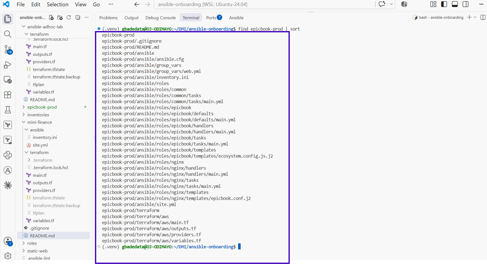

---

### Notes

Answer the following in your own words:

**1. Which cloud provider did you choose for this assignment?**

AWS, in eu-west-2 (London), using my credits account. EpicBook needs a managed MySQL database, and I had already deployed EpicBook against Amazon RDS for MySQL 8.0 in Week 8, so I knew the engine version, instance sizes and networking pattern that work.

---

**2. Why is it useful to keep Terraform files and Ansible files in separate folders?**

They have different jobs and lifecycles. Terraform creates and destroys infrastructure and keeps state; Ansible configures what runs on it and can be re-run at any time. Separate folders keep each tool's files, commands and ignore rules apart, so I can re-run the playbook without touching Terraform and I can see at a glance which layer a change belongs to. The only link between them is Terraform outputs feeding the inventory and environment variables.

---

**3. What is the purpose of the `roles` directory in Ansible?**

It holds reusable, self-contained units of configuration. Each role has a fixed layout (`tasks/`, `handlers/`, `templates/`, `defaults/`), so Ansible finds its pieces automatically and a playbook just lists the roles to apply. Here that splits the deployment into `common`, `nginx` and `epicbook`, each responsible for one layer.

---

# Task 2 — Provision the Infrastructure with Terraform

## Goal

Run Terraform to provision the cloud infrastructure for the EpicBook deployment.

Terraform will create the VM, managed MySQL database, networking, security rules, and required outputs.

### Evidence

#### Screenshot 2 — `terraform apply` completed successfully

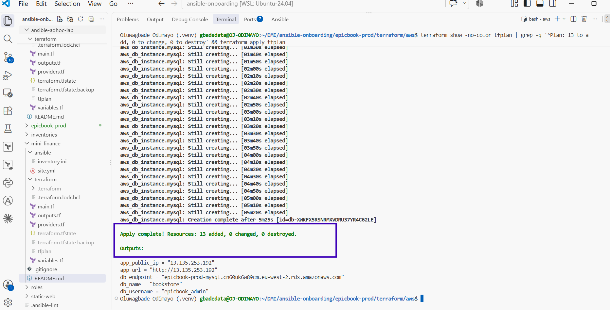

---

#### Screenshot 3 — Output of `terraform output`

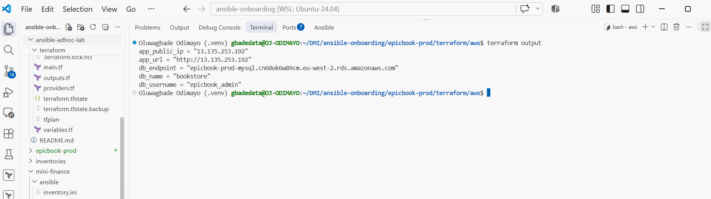

---

#### Screenshot 4 — Azure Portal or AWS Console showing the VM running

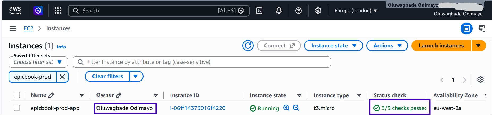

---

#### Screenshot 5 — Azure Portal or AWS Console showing the managed MySQL database created

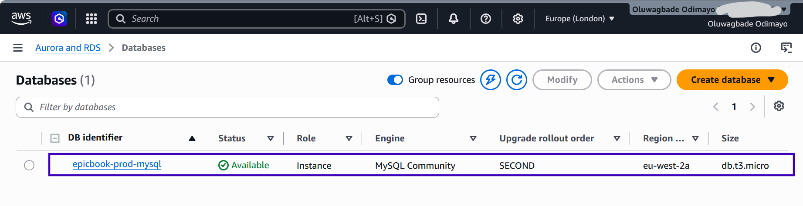

---

### Notes

Answer the following in your own words:

**1. What resources did Terraform create for this assignment?**

13 resources: a VPC, internet gateway, public subnet, two private database subnets in different availability zones, a route table and its association, two security groups (app and database), an SSH key pair, the Ubuntu 24.04 `t3.micro` app server, an RDS subnet group and the RDS MySQL 8.0 `db.t3.micro` instance.

---

**2. Why should you review `terraform plan` before running `terraform apply`?**

The plan is the only chance to catch a mistake before it costs money or destroys something. I saved it with `-out=tfplan`, checked it said exactly `13 to add, 0 to change, 0 to destroy`, and only then applied that saved file, so what ran was exactly what I had reviewed. In Week 8 a plan run from a terminal pointing at the wrong AWS account proposed recreating everything; reading the plan is what caught it.

---

**3. Why should database passwords not be shown in Terraform output?**

Terraform outputs are printed to the terminal, copied into logs and CI output, and readable by anyone with access to the state. A password there ends up in screenshots and chat histories. My database password is a `sensitive` variable supplied through the environment and is deliberately not an output; `terraform output` shows the endpoint, database name and user, which is all Ansible needs.

---

# Task 3 — Verify SSH Key-Based Access

## Goal

Verify that the cloud VM can be accessed from the Ansible controller using SSH key-based authentication.

### Evidence

#### Screenshot 6 — Successful SSH hostname check from the Ansible controller

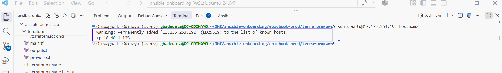

---

### Notes

Answer the following in your own words:

**1. What command did you use to verify SSH access?**

`ssh ubuntu@13.135.253.192 hostname`. My SSH config uses my ED25519 key by default, so no `-i` flag was needed.

---

**2. What proves that SSH key-based access worked successfully?**

The VM returned its hostname without asking for a password, and I had never set one. Only the private key on my controller matches the public key Terraform installed, so the login can only have succeeded through key authentication.

---

**3. What would you check if SSH returned `Permission denied (publickey)`?**

That the right user was used (`ubuntu` on AWS Ubuntu images), that the key I offered matches the key pair attached to the instance, that the private key file has permissions of 600 or stricter, and that my SSH config is not restricting SSH to a different key with `IdentitiesOnly`. Running `ssh -v` shows exactly which keys were offered and why each was refused.

---

# Task 4 — Create the Ansible Inventory and Configuration

## Goal

Create the Ansible inventory file and local Ansible configuration for the EpicBook VM.

The inventory tells Ansible which VM to manage and which SSH user to use.

### Evidence

#### Screenshot 7 — `inventory.ini` showing the VM under the `web` group

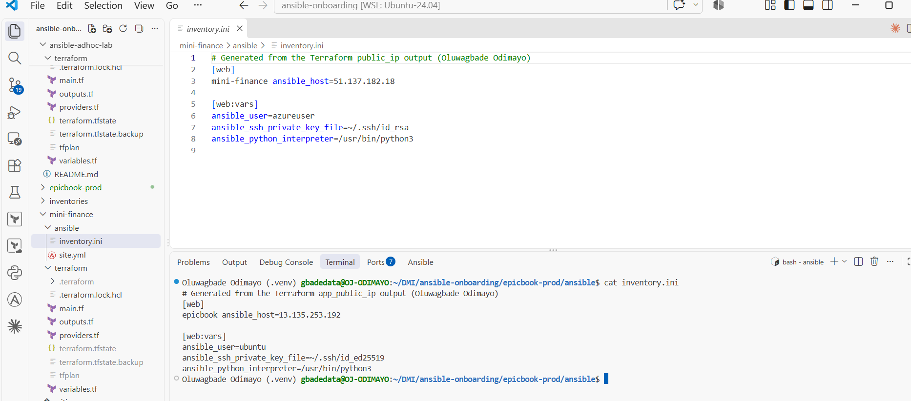

---

#### Screenshot 8 — Output of `ansible-inventory -i inventory.ini --graph`

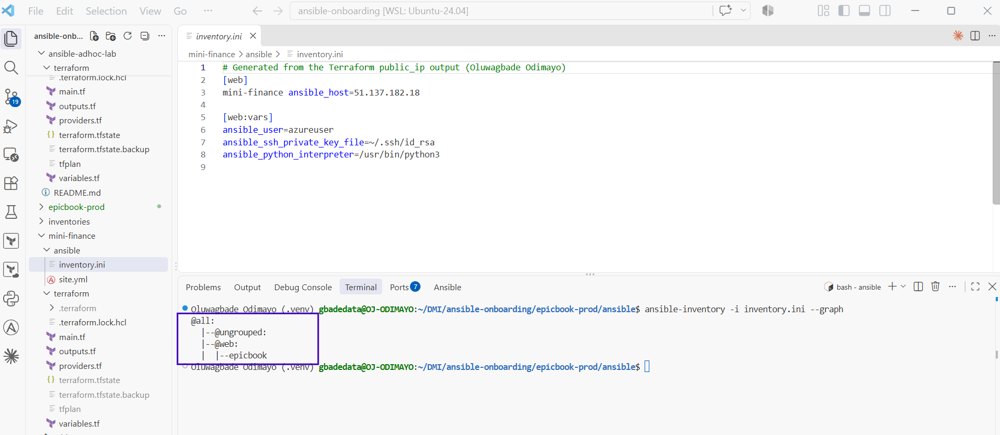

---

#### Screenshot 9 — Output of `ansible web -i inventory.ini -m ping`

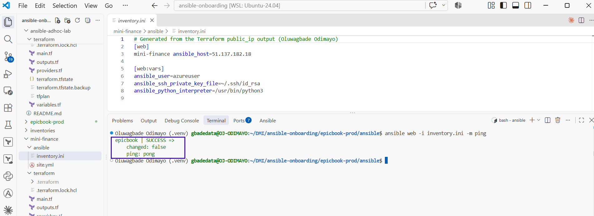

---

### Notes

Answer the following in your own words:

**1. What is the purpose of `inventory.ini`?**

It lists the hosts Ansible manages and how to reach them. Mine puts the EpicBook VM in the `web` group and sets its SSH user, key and Python interpreter. The group name matters because `site.yml` targets `hosts: web` and `group_vars/web.yml` applies to every host in that group.

---

**2. What does `ansible_host` store?**

The real address Ansible connects to, here the VM's public IP `13.135.253.192`, while the inventory name `epicbook` stays a readable label used in output and commands.

---

**3. What does `ansible_ssh_private_key_file` tell Ansible?**

Which private key to use for SSH, here `~/.ssh/id_ed25519`, the key whose public half Terraform installed on the VM. Without it Ansible would fall back to whatever SSH chooses by default.

---

**4. Why is `host_key_checking = False` used only for this temporary lab?**

Host key checking is what stops a man-in-the-middle from impersonating a server. In this lab the VM is created and destroyed repeatedly and gets a new host key each time, so strict checking would fail on every rebuild. Disabling it is acceptable only because the host is short-lived and reached over a path I control. In production I would keep it on and use `accept-new`, which I set up in Assignment 01, or pre-populate known host keys.

---

# Task 5 — Create the Main Ansible Playbook

## Goal

Create the main Ansible playbook that runs the required roles in the correct order.

The `site.yml` file will call the `common`, `nginx`, and `epicbook` roles.

### Evidence

#### Screenshot 10 — `site.yml` showing the roles in the correct order

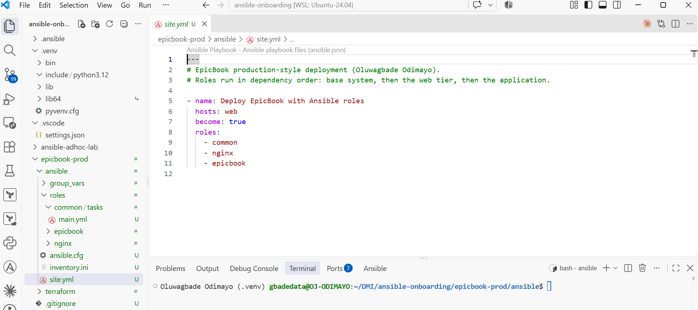

---

#### Screenshot 11 — Output of `ansible-playbook -i inventory.ini site.yml --syntax-check`

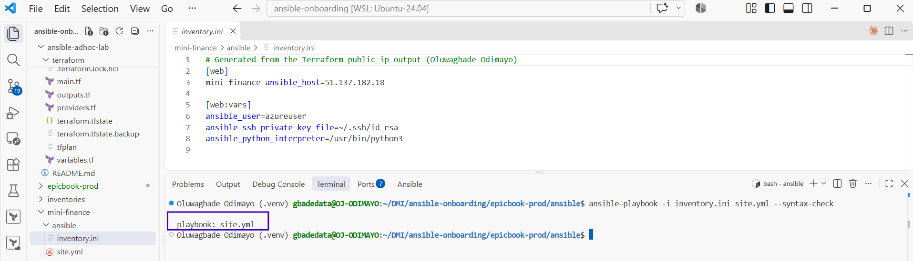

---

### Notes

Answer the following in your own words:

**1. What is the purpose of `site.yml`?**

It is the entry point for the deployment. It targets the `web` group, escalates privileges with `become: true` and applies the `common`, `nginx` and `epicbook` roles in order, so one command configures the whole server.

---

**2. Why should the roles run in the order `common`, `nginx`, and `epicbook`?**

Each role depends on the one before it. `common` installs base tools, including the MySQL client and `acl` that the application role relies on. `nginx` sets up the reverse proxy the application sits behind. `epicbook` then installs and starts the app. Running it first would mean using tools that do not exist yet.

---

**3. What does `become: true` allow Ansible to do?**

It lets Ansible run tasks with root privileges through sudo, which package installs, `/etc/nginx` changes and service management need. Where a task should not run as root, such as cloning the app and starting PM2, I set `become_user: ubuntu` so it runs as the application user instead.

---

# Task 6 — Create the `common` Role

## Goal

Create the `common` role to prepare the Ubuntu VM with the basic packages required for the EpicBook deployment.

This role handles the common server setup before Nginx and the application are configured.

### Evidence

#### Screenshot 12 — `roles/common/tasks/main.yml` showing the common setup tasks

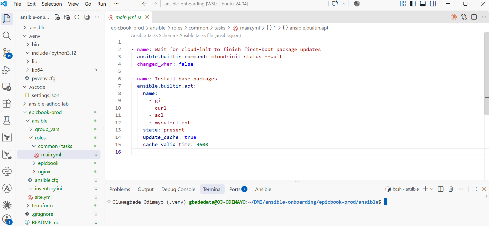

---

### Notes

Answer the following in your own words:

**1. What is the responsibility of the `common` role?**

Preparing the base system that every later role relies on: waiting for cloud-init to finish first-boot updates so apt is not locked, then installing `git`, `curl`, `acl` and `mysql-client`.

---

**2. Why should Nginx installation not be placed inside the `common` role?**

Because `common` is meant for things every server needs, and not every server is a web server. Keeping Nginx in its own role means `common` can be reused on a database or worker host, and the web tier can be changed, replaced or tested without touching the base setup.

---

**3. Why is `mysql-client` useful in this deployment?**

The database is private, so the only machine that can reach port 3306 is the app server. The MySQL client lets the `epicbook` role check whether the schema already exists and import the schema and seed data into RDS from there. It is also the tool I would use to debug connectivity if the app could not reach the database.

---

# Task 7 — Create the `nginx` Role

## Goal

Create the `nginx` role to install Nginx and configure it as a reverse proxy for the EpicBook application.

Nginx will receive browser traffic on port `80` and forward it to the EpicBook Node.js application running on the VM.

### Evidence

#### Screenshot 13 — `roles/nginx/tasks/main.yml` showing Nginx installation and site configuration tasks

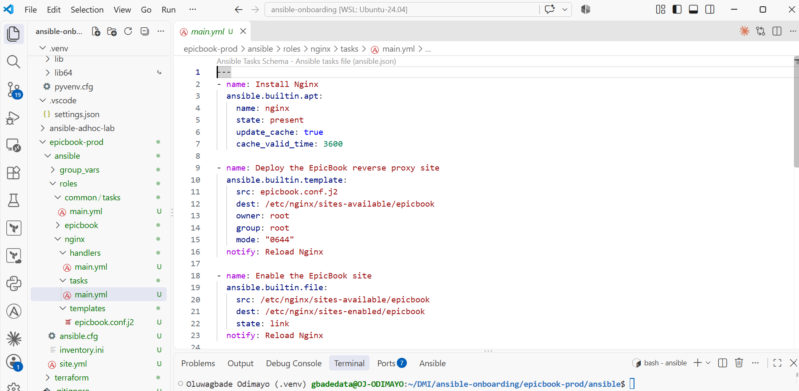

---

#### Screenshot 14 — `roles/nginx/templates/epicbook.conf.j2` showing the reverse proxy configuration

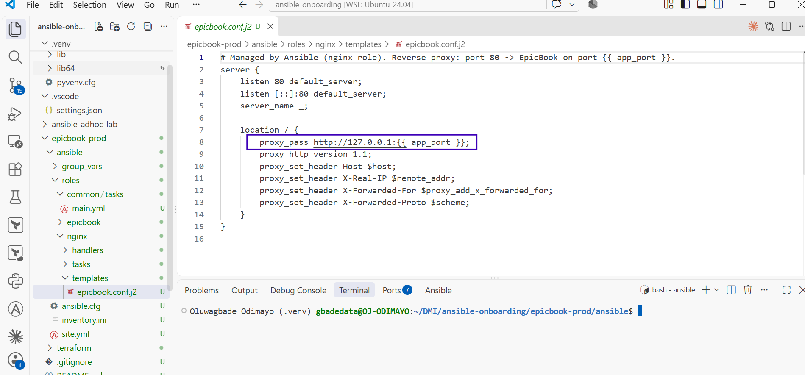

---

### Notes

Answer the following in your own words:

**1. What is the responsibility of the `nginx` role?**

Installing Nginx, deploying the EpicBook site from `epicbook.conf.j2`, enabling it, disabling the default site, validating the configuration with `nginx -t`, and making sure Nginx is running and starts at boot. A handler reloads Nginx only when the configuration actually changes.

---

**2. Why is Nginx configured as a reverse proxy in this deployment?**

The Node app listens on 8080 as an unprivileged user and Nginx faces the internet on port 80. Nginx is built for that job: it handles connections efficiently, can add HTTPS, compression, caching and rate limiting later without changing the app, and hides the application port. It also forwards the original client details in `X-Forwarded-For` and related headers.

---

**3. Why should the application port come from `group_vars/web.yml` instead of being hard-coded?**

The port is used in two places: the Nginx proxy target and the app's own configuration. Defining it once in `group_vars/web.yml` means both roles always agree. Changing it later is a one-line edit, and there is no risk of Nginx pointing at a port the app is no longer using.

---

# Task 8 — Create the `epicbook` Role

## Goal

Create the `epicbook` role to deploy the EpicBook application, connect it to the managed MySQL database, and run the application on port `8080` using PM2.

### Evidence

#### Screenshot 15 — `roles/epicbook/tasks/main.yml` showing application deployment tasks

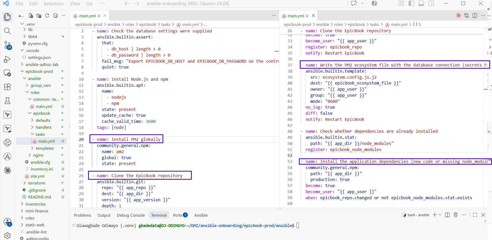

---

#### Screenshot 16 — Task or file showing how the database connection is configured, with secrets hidden

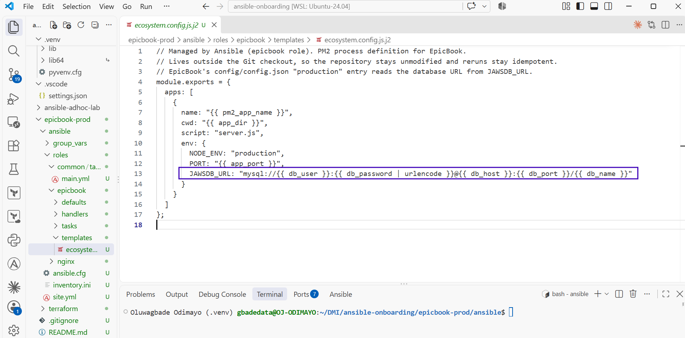

---

#### Screenshot 17 — Task or output showing the EpicBook application managed by PM2

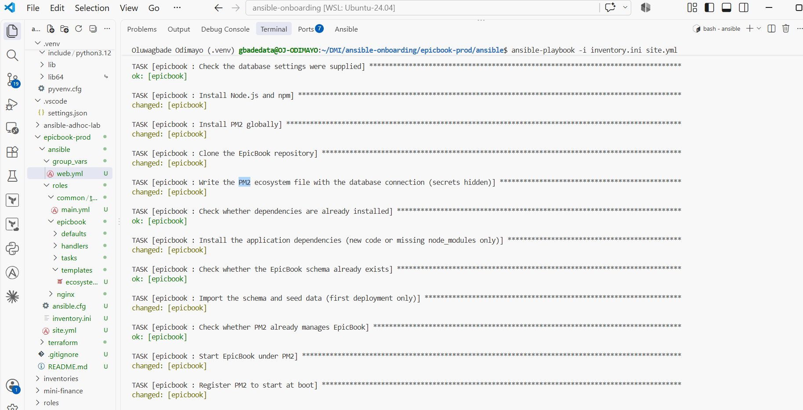

---

### Notes

Answer the following in your own words:

**1. What is the responsibility of the `epicbook` role?**

Deploying and running the application: installing Node.js, npm and PM2, cloning EpicBook, writing the database connection into a PM2 ecosystem file, installing dependencies, importing the schema and seed data on the first deployment only, starting the app under PM2 and registering PM2 to start at boot.

---

**2. Why is PM2 used for the EpicBook Node.js application?**

Node has no built-in supervisor. PM2 keeps the app running in the background, restarts it if it crashes, provides `pm2 status` and logs, and with `pm2 startup` and `pm2 save` brings it back automatically after a reboot. It also lets a handler restart the app cleanly when the code or its settings change.

---

**3. Why should database passwords not be hard-coded in public files?**

Public files are copied into forks, caches and backups and stay in Git history even after they are deleted, so a leaked password has to be treated as compromised and rotated everywhere. Keeping it out of files also lets different environments use different credentials without editing code.

---

**4. What does it mean for the application to run on port `8080` while Nginx listens on port `80`?**

Nginx is the only thing listening on the public port. It receives every request on 80 and forwards it to the Node process on 127.0.0.1:8080, which is not open to the internet at all. Visitors never talk to the app directly, which is what the reverse proxy is for.

---

# Task 9 — Create Group Variables

## Goal

Create reusable variables for the EpicBook deployment.

The `group_vars/web.yml` file stores values that can be reused across the Ansible roles.

### Evidence

#### Screenshot 18 — `group_vars/web.yml` showing the application, PM2, and database variables, with passwords hidden or masked

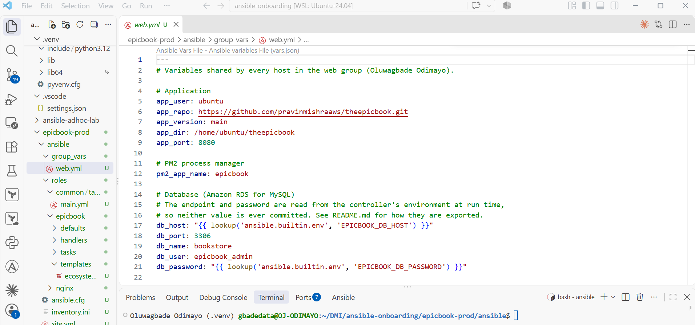

---

### Notes

Answer the following in your own words:

**1. What is the purpose of `group_vars/web.yml`?**

It holds the settings shared by every host in the `web` group in one place, so the roles read values instead of hard-coding them, and changing an environment means changing one file.

---

**2. Which values did you store in `group_vars/web.yml`?**

Application values (`app_user`, `app_repo`, `app_version`, `app_dir`, `app_port: 8080`), the PM2 process name (`pm2_app_name: epicbook`), and database values (`db_name: bookstore`, `db_user: epicbook_admin`, `db_port: 3306`). `db_host` and `db_password` are defined there too, but only as lookups of environment variables.

---

**3. How did you handle the database password securely?**

The password is generated locally with `openssl rand -hex 20` into `~/.config/dmi/`, outside the repository and readable only by me. Terraform receives it as `TF_VAR_db_password` and Ansible as `EPICBOOK_DB_PASSWORD`; `group_vars` only contains the lookup. On the server, the task that writes it uses `no_log: true` and `diff: false`, and the file is mode `0600`, owned by the app user and kept outside the Git checkout. Terraform marks the variable `sensitive` and never outputs it.

---

# Task 10 — Run the Ansible Playbook

## Goal

Run the Ansible playbook to configure the VM and deploy the EpicBook application.

The playbook should run the roles in this order:

1. `common`
2. `nginx`
3. `epicbook`

### Evidence

#### Screenshot 19 — Ansible playbook output showing the roles running

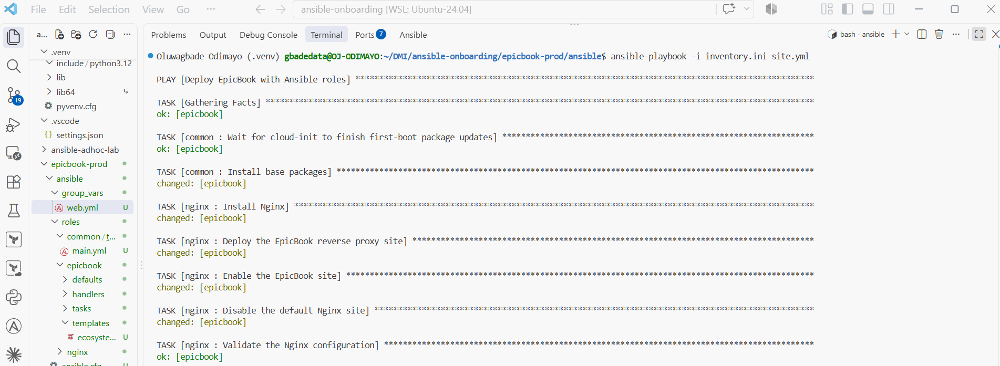

---

#### Screenshot 20 — Final Ansible recap showing `failed=0`

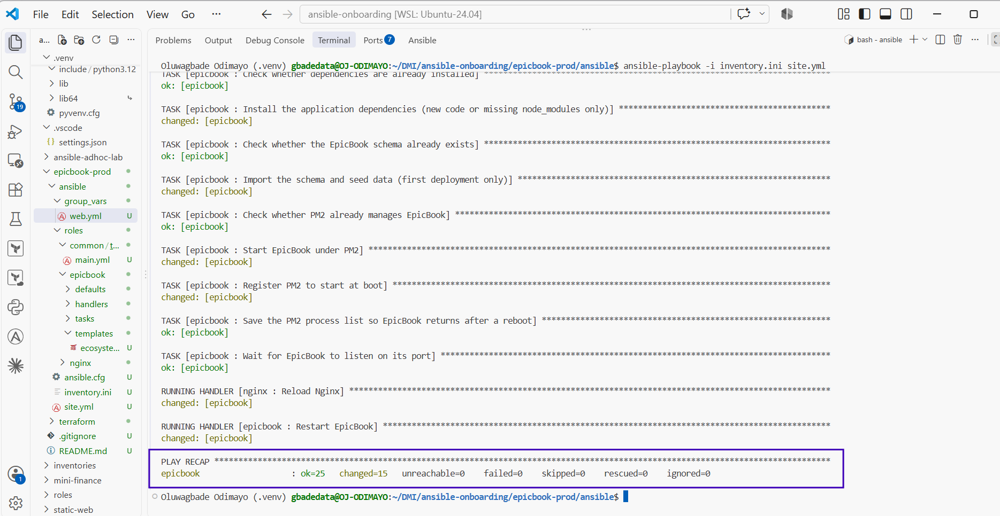

---

#### Screenshot 21 — Output of `ansible web -i inventory.ini -m command -a "systemctl is-active nginx" --become`

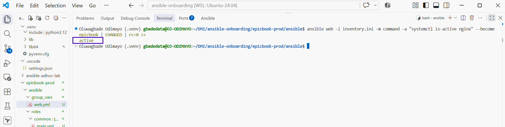

---

#### Screenshot 22 — Output of `ansible web -i inventory.ini -m command -a "pm2 status"`

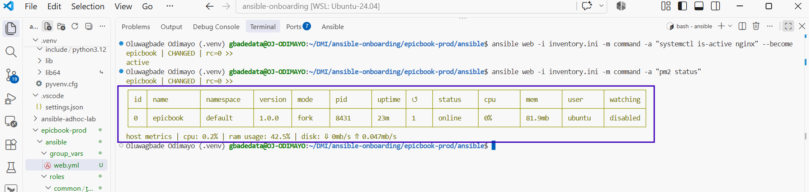

---

#### Screenshot 23 — Output of `ansible web -i inventory.ini -m command -a "curl -I http://localhost:8080"`

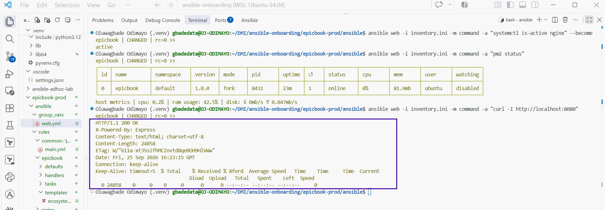

---

### Notes

Answer the following in your own words:

**1. What command did you run to execute the Ansible playbook?**

`ansible-playbook -i inventory.ini site.yml`, from the `ansible/` directory so the project's own `ansible.cfg` was loaded, which I confirmed with `ansible --version` beforehand.

---

**2. How do you know all roles completed successfully?**

The play recap showed `failed=0` and `unreachable=0` (`ok=25 changed=15`), and the output showed tasks from `common`, then `nginx`, then `epicbook`. A second run finished with `changed=0`, with the schema import, PM2 start and npm install correctly skipped.

---

**3. What proves that Nginx is active?**

`ansible web -i inventory.ini -m command -a "systemctl is-active nginx" --become` returned `active`.

---

**4. What proves that PM2 is managing the EpicBook application?**

`pm2 status`, run through Ansible as the `ubuntu` user, listed the `epicbook` process as `online`. The playbook output also shows the `Start EpicBook under PM2` task changing on the first run.

---

**5. What proves that the EpicBook application responds on port `8080`?**

`curl -I http://localhost:8080`, run on the VM through Ansible, returned `HTTP/1.1 200 OK` with the `X-Powered-By: Express` header, which comes from Node itself rather than from Nginx.

---

# Task 11 — Verify the EpicBook Deployment

## Goal

Verify that the EpicBook application is running, accessible in the browser, and connected to the managed MySQL database.

### Evidence

#### Screenshot 24 — Output of `curl -I http://<public_ip>`

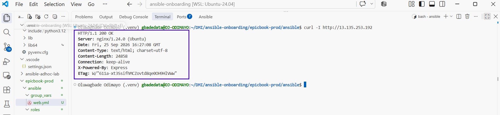

---

#### Screenshot 25 — Output of the cart API test command

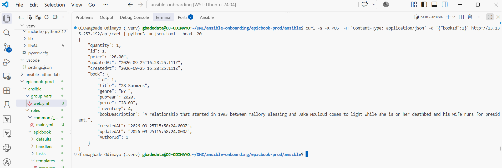

---

#### Screenshot 26 — Output of the `/cart` HTTP status check

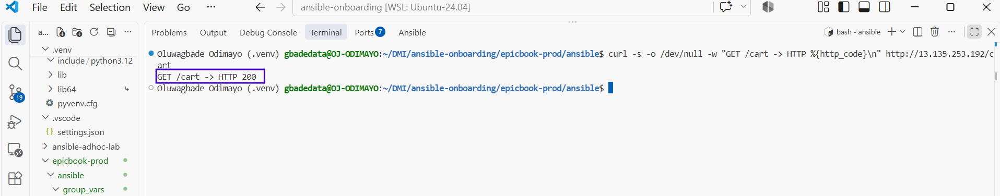

---

#### Screenshot 27 — Browser showing the EpicBook application loaded from `http://<public_ip>`

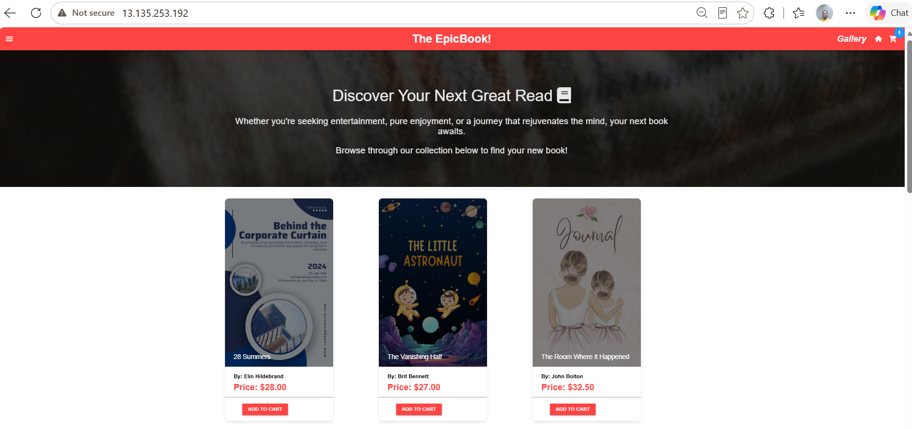

---

### Notes

Answer the following in your own words:

**1. What HTTP response did you receive from the public application URL?**

`HTTP/1.1 200 OK` from `http://13.135.253.192`, with `Server: nginx`, showing the request came through the reverse proxy.

---

**2. What did the cart API test prove?**

That the whole path works, not just the web page. The POST asked the app to look up book 1 and create a cart row, and the response contained the new cart entry with the book "28 Summers" at 28.00. That book only exists because my role imported the seed data into RDS, so the request travelled from my controller through Nginx and Node to the private database and back.

---

**3. What did the `/cart` status check return?**

`GET /cart -> HTTP 200`.

---

**4. What issue did you face during verification, and how did you fix it?**

While capturing evidence I noticed that three of my screenshots showed the Assignment 04 inventory open in the editor, with the old Azure IP and user, while the terminal underneath showed the correct EpicBook inventory. The commands were right, but the evidence was misleading. I closed the wrong file, opened the correct one, checked that the breadcrumb read `epicbook-prod > ansible > inventory.ini`, and retook them. The lesson was to verify the artefact I am presenting, not just the command I ran.

---

# LinkedIn Post Required

## Evidence

#### LinkedIn Post URL

Paste your LinkedIn post URL here:

Not published: I chose not to publish a LinkedIn post for this assignment.

---

#### Screenshot — Published LinkedIn post

Not published: I chose not to publish a LinkedIn post for this assignment.

---

# Assignment Questions

Answer the following in your own words:

**1. Why is Terraform used for infrastructure provisioning?**

Because it describes infrastructure as code that can be reviewed, versioned and reproduced. A plan shows exactly what will change before anything happens, the state tracks what exists, and the whole stack can be recreated or removed with one command. Here that meant 13 resources created, and later destroyed, in a known and repeatable way.

---

**2. Why are Ansible roles useful for production-style deployments?**

They break a deployment into focused, reusable parts with a standard layout, so each can be read, tested and changed on its own. They can be shared across projects and environments, and variables and defaults let the same role serve development and production. A single long playbook becomes hard to follow and impossible to reuse.

---

**3. What is the purpose of `group_vars/web.yml`?**

To keep every setting shared by the `web` group in one file, separate from the logic in the roles, so the same roles can deploy a different environment just by changing variables.

---

**4. Why should database passwords not be committed to GitHub?**

Anything pushed to GitHub is effectively public and permanent: it is cloned, forked, cached and scanned by bots within minutes, and deleting it later does not remove it from history. The only safe response to a committed password is to rotate it, so it is far better never to commit it.

---

**5. What is the purpose of Nginx in this deployment?**

Nginx is the public entry point. It listens on port 80 and forwards requests to the Node app on 8080, so the app is never exposed directly, and it is where HTTPS, caching and rate limiting would be added.

---

**6. Why should the managed MySQL database not be publicly accessible?**

The database holds all the application's data and only the app needs to reach it. Making it public would expose MySQL to constant scanning and password-guessing from the whole internet. Mine has no public IP, sits in private subnets, and its security group only allows 3306 from the app server's security group.

---

**7. Why is PM2 used for the EpicBook Node.js application?**

To keep the Node process running in the background, restart it if it crashes, bring it back after a reboot through `pm2 startup` and `pm2 save`, and give a simple view of its state with `pm2 status`.

---

**8. What does idempotency mean in Ansible?**

That running a playbook again only changes what is not already in the desired state. My first run reported `changed=15`; the second run reported `changed=0`, because every package, file, service and the database schema already matched, so the import and PM2 start were skipped.

---

**9. What issue did you face during the deployment, and how did you fix it?**

Testing the role before deploying exposed a design flaw. EpicBook keeps `config/config.json` inside its Git repository, and my first version wrote the database settings into that file. The next run failed at the `git` task with `Local modifications exist in the destination`, so the playbook could never be run twice. I changed the approach to use the app's own production mode: the role now writes the database URL into a PM2 ecosystem file outside the repository, leaving the checkout untouched. I also made `npm install` run only when the code changes or `node_modules` is missing. After that, a fresh deployment and a rerun gave `changed=15` and `changed=0`.

---

**10. What security improvement would you make before using this setup in production?**

I would add HTTPS with a certificate from Let's Encrypt and redirect port 80 to 443, so traffic including cart actions is encrypted. Alongside that I would move the database password into AWS Secrets Manager or Ansible Vault instead of an environment variable, and turn host key checking back on.

---

# Required Files

Confirm that the following files are included in your GitHub repository or assignment folder:

- [x] `README.md`
- [x] Terraform files under either `terraform/azure/` or `terraform/aws/`
- [x] `ansible/ansible.cfg`
- [x] `ansible/inventory.ini`
- [x] `ansible/site.yml`
- [x] `ansible/group_vars/web.yml`
- [x] `ansible/roles/common/tasks/main.yml`
- [x] `ansible/roles/nginx/tasks/main.yml`
- [x] `ansible/roles/nginx/templates/epicbook.conf.j2`
- [x] `ansible/roles/epicbook/tasks/main.yml`

---

# Submission Instructions

- Add all required screenshots in your submission.
- Full Name must be visible in required screenshots.
- Mention the cloud provider used: Azure or AWS.
- Add the VM public IP address.
- Add the final application URL.
- Add Terraform output proof.
- Add Ansible role tree proof.
- Add all required notes and assignment question answers.
- Add your LinkedIn post URL.
- Do not expose SSH private keys, passwords, cloud credentials, database credentials, Terraform state files, subscription IDs, or account IDs.

---

# Completion Checklist

- [x] Task 1: Project folder layout created
- [x] Task 2: Terraform infrastructure provisioned
- [x] Task 3: SSH key-based access verified
- [x] Task 4: Ansible inventory and configuration created
- [x] Task 5: Main Ansible playbook created
- [x] Task 6: `common` role created
- [x] Task 7: `nginx` role created
- [x] Task 8: `epicbook` role created
- [x] Task 9: Group variables created
- [x] Task 10: Ansible playbook run completed
- [x] Task 11: EpicBook deployment verified
- [x] Terraform files created under only one cloud provider folder
- [x] One Ubuntu VM was created
- [x] One managed MySQL database was created
- [x] SSH port `22` is restricted to the controller public IP
- [x] HTTP port `80` is accessible
- [x] MySQL port `3306` is not publicly open
- [x] `ansible web -i inventory.ini -m ping` returns `SUCCESS`
- [x] `site.yml` calls the roles in the correct order
- [x] Database secrets are hidden or handled securely
- [x] Nginx is active
- [x] PM2 shows the EpicBook application running
- [x] EpicBook responds on port `8080`
- [x] Public URL loads in the browser
- [x] Cart API verification works
- [x] Playbook completes with `failed=0`
- [x] Screenshots 1–27 are included
- [x] Assignment questions are answered
- [ ] LinkedIn post published (not published, by choice)
- [ ] LinkedIn post URL added (not published, by choice)
- [x] No sensitive information is exposed

---

## About DMI & CloudAdvisory

DevOps Micro Internship (DMI) is a project-based DevOps program run by Pravin Mishra and The CloudAdvisory, focused on real-world execution, systems thinking, and career readiness.

It helps learners build strong DevOps foundations with hands-on experience.

---

## Resources

- DMI Official Website: [https://dmi.pravinmishra.com?utm_source=github&utm_medium=readme](https://dmi.pravinmishra.com?utm_source=github&utm_medium=readme)
- University: [https://university.pravinmishra.com?utm_source=github&utm_medium=readme](https://university.pravinmishra.com?utm_source=github&utm_medium=readme)
- Discord Community: [https://discord.pravinmishra.com?utm_source=github&utm_medium=readme](https://discord.pravinmishra.com?utm_source=github&utm_medium=readme)
- Blog: [https://dmi.pravinmishra.com/blog?utm_source=github&utm_medium=readme](https://dmi.pravinmishra.com/blog?utm_source=github&utm_medium=readme)
- YouTube Playlist: [https://www.youtube.com/playlist?list=PLFeSNDtI4Cho](https://www.youtube.com/playlist?list=PLFeSNDtI4Cho)
- Pravin Mishra LinkedIn: [https://www.linkedin.com/in/pravin-mishra-aws-trainer/](https://www.linkedin.com/in/pravin-mishra-aws-trainer/)
- CloudAdvisory LinkedIn: [https://www.linkedin.com/company/thecloudadvisory/](https://www.linkedin.com/company/thecloudadvisory/)

---

*This submission is part of DevOps Micro Internship (DMI) — Agentic AI Track.*