# Assignment 6 — AI-Assisted Ansible Change Risk Review

Part of the DevOps Micro Internship (DMI) with Agentic AI

**Full Name:** Oluwagbade Odimayo  
**Target:** EpicBook on AWS (eu-west-2), deployed in Assignment 05  
**GitHub folder:** [https://github.com/gbadedata/devops-micro-internship-pravinmishra/tree/main/week-09-ansible/ansible-onboarding/epicbook-prod/risk-review](https://github.com/gbadedata/devops-micro-internship-pravinmishra/tree/main/week-09-ansible/ansible-onboarding/epicbook-prod/risk-review)  
**Change summary:** [`change-summary.md`](./ansible-onboarding/epicbook-prod/risk-review/change-summary.md)

| Stage | Report | Overall Status | Exit code |
|---|---|---|---|
| Baseline | `reports/ansible-risk-report.txt` | HEALTHY | 0 |
| Controlled risky change | `reports/risky-change-report.txt` | FAILED (HIGH: access and security) | 2 |
| After the human applied | `reports/post-apply-report.txt` | HEALTHY | 0 |

---

## Purpose

In this assignment, you will build an AI-assisted Ansible risk-review workflow using `ansible-playbook --check --diff`, Bash scripting, and Claude Code.

You will review possible server changes before applying them, classify risky tasks, and keep the final apply decision under human control.

---

# Task 1 — Confirm EpicBook Connectivity and Create the Workspace

## Goal

Confirm that your previous EpicBook Ansible project is working before creating the risk-review automation.

### Evidence

#### Screenshot 1 — Output of `ansible web -i inventory.ini -m ping`

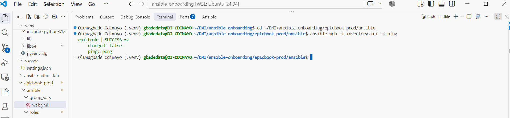

---

#### Screenshot 2 — Output of `ansible-playbook -i inventory.ini site.yml --syntax-check`

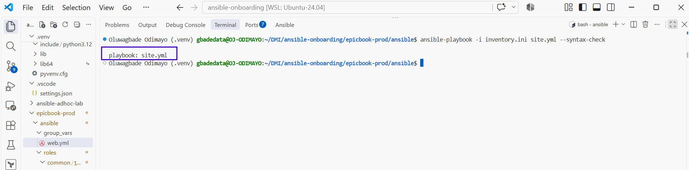

---

#### Screenshot 3 — Output of `pwd` and `find . -maxdepth 4 -type d | sort`

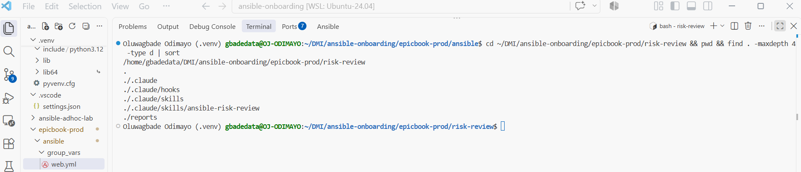

---

### Notes

Answer the following in your own words:

**1. What proves that Ansible can reach your EpicBook VM?**

`ansible web -i inventory.ini -m ping` returned `epicbook | SUCCESS` with `ping: pong`. That means Ansible connected over SSH with my key, ran Python on the VM and got a reply, so the host is reachable and manageable, not just switched on.

---

**2. Why should you confirm playbook syntax before building a risk-review script?**

The review script runs the playbook in check mode and interprets its output. If the playbook had a syntax error, every review would fail for a reason unrelated to risk and I could not tell a broken playbook from a risky change. A clean `--syntax-check` means any later failure is about the change, not the file.

---

# Task 2 — Create Project Context and Safety Rules in CLAUDE.md

## Goal

Create a `CLAUDE.md` file that tells Claude Code how this project must behave.

### Evidence

#### Screenshot 4 — `CLAUDE.md` open in VS Code or terminal showing the safety rules

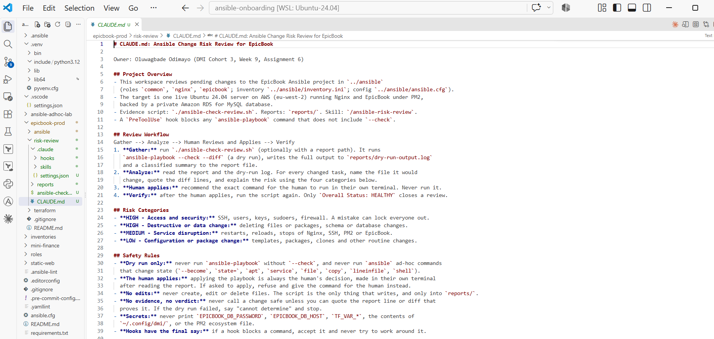

---

### Notes

Answer the following in your own words:

**1. Why should Claude Code have project-specific safety rules?**

A general AI assistant does not know which commands are dangerous in this project or what counts as evidence here. `CLAUDE.md` tells it that this server is live, that only dry runs are allowed, which files it may read, which secrets it must never print and how to structure its answer. It turns a capable but generic tool into one that behaves the way this team needs.

---

**2. Why should the human run the real Ansible playbook manually?**

Applying changes to a live server is a decision with consequences, and someone has to own it. The human reads the evidence, weighs the risk, can prepare a fallback such as an open SSH session, and is accountable for the result. An AI can be confidently wrong, as this assignment showed when the planning step invented a risk that did not exist.

---

**3. Which rule prevents Claude Code from applying changes automatically?**

"Dry run only: never run `ansible-playbook` without `--check`", backed by "The human applies". It is also enforced outside the model: a `PreToolUse` hook in `.claude/settings.json` blocks any `ansible-playbook` command from Claude Code that lacks `--check`, so the rule holds even if the model ignores `CLAUDE.md`.

---

# Task 3 — Ask Claude Code to Plan the Risk Review

## Goal

Use Claude Code to produce a read-only plan before writing the Bash script.

### Evidence

#### Screenshot 5 — Claude Code showing the four-category risk-classification plan

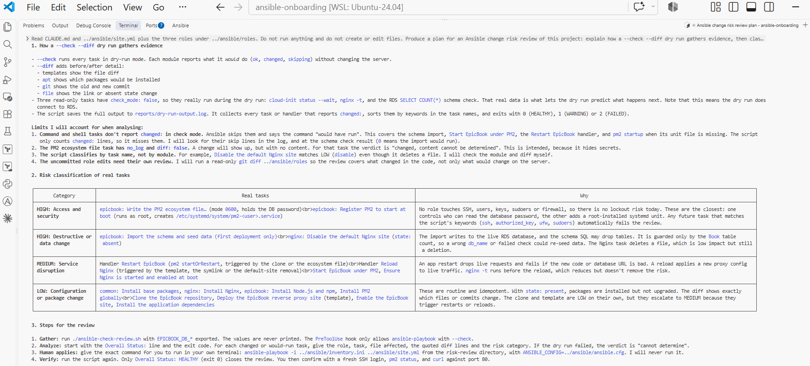

---

### Notes

Answer the following in your own words:

**1. Which part of this task represents the Gather phase?**

Reading the project: Claude Code read `CLAUDE.md`, `site.yml` and the three roles, and described how `--check --diff` gathers evidence by predicting every task's result and showing file diffs without changing the server.

---

**2. Which part represents the Analyze phase?**

Classifying what it had read: it placed real tasks from my roles into the four risk categories, for example the schema import as destructive or data change and the Nginx and EpicBook handlers as service disruption. It also found real limitations in my script: skipped `command` tasks are not counted, and classification by task name can misjudge a task such as "Disable the default Nginx site", which deletes a file.

---

**3. How did you verify Claude Code did not create or edit files?**

I ran `git status --short .` and counted files with `find . -type f | wc -l` before and after the session. Both showed `?? ./` and 6 files, so nothing was created or modified. Starting Claude Code with `--permission-mode plan` also meant it could not edit files during planning.

---

# Task 4 — Build the Ansible Risk Review Script

## Goal

Create a Bash script that runs an Ansible dry run and classifies risky changes.

### Evidence

#### Screenshot 6 — Top section of `ansible-check-review.sh` showing `full_name`, `playbook_path`, `inventory_path`, and the `checks` array

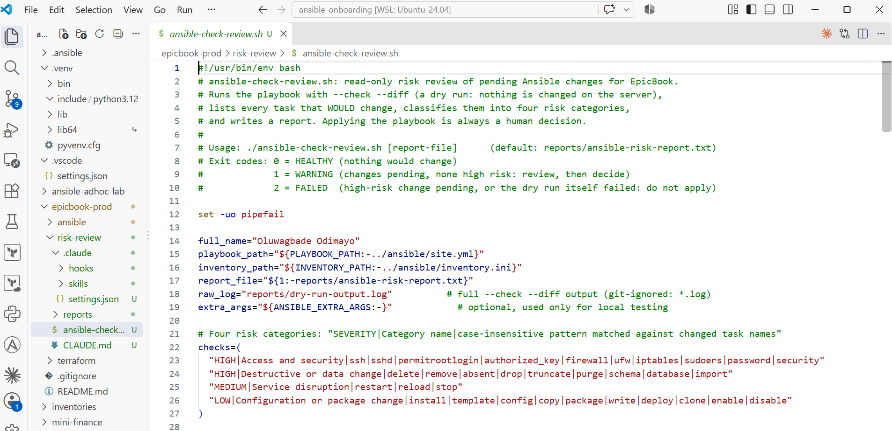

---

#### Screenshot 7 — Middle section showing `extract_changed_tasks` and `check_tasks_matching_pattern`

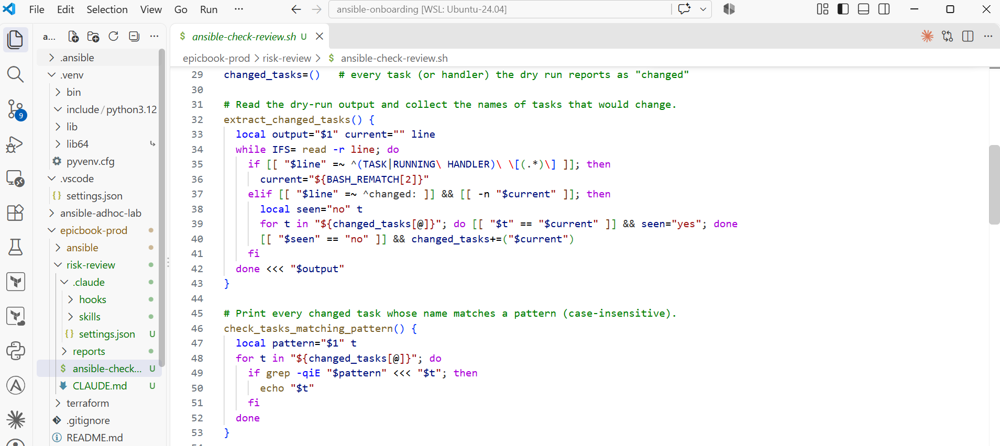

---

#### Screenshot 8 — Bottom section showing the loop, summary, and exit behavior

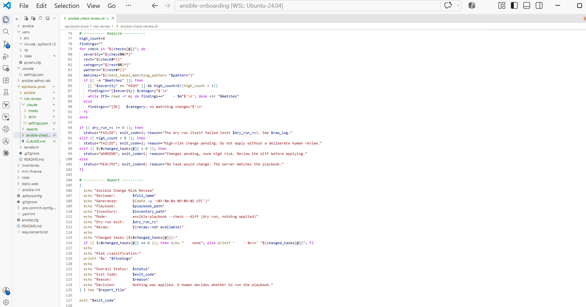

---

#### Screenshot 9 — Output of `bash -n ansible-check-review.sh` and `ls -l ansible-check-review.sh`

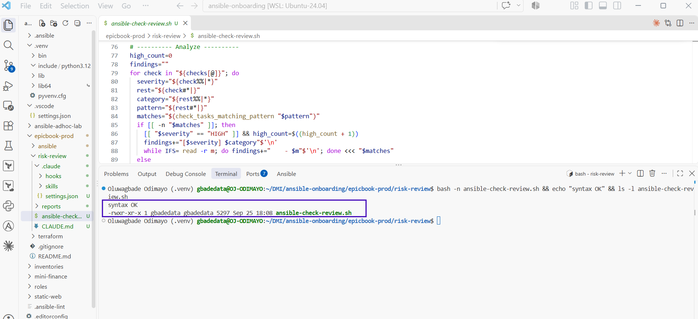

---

### Notes

Answer the following in your own words:

**1. What is stored in the `changed_tasks` array?**

The names of every task and handler that the dry run reports as `changed`, for example `common : Harden SSH by disabling root login`. Duplicates are skipped, so each pending change appears once.

---

**2. Which function finds changed tasks from the Ansible output?**

`extract_changed_tasks`. It reads the dry-run output line by line, remembers the most recent `TASK [...]` or `RUNNING HANDLER [...]` heading, and records it whenever a `changed:` line follows.

---

**3. Why does the script use `--check --diff`?**

`--check` makes Ansible predict what each task would do without changing anything on the server, so the review is safe on a live system. `--diff` adds the before and after lines for files, which is the evidence a human needs, such as `-#PermitRootLogin prohibit-password` becoming `+PermitRootLogin no`.

---

**4. Why does the script use different exit codes for healthy, warning, and failed results?**

So the result can drive decisions automatically. Exit 0 (HEALTHY) means nothing would change, 1 (WARNING) means low or medium-risk changes to review, and 2 (FAILED) means a high-risk change or a failed dry run. A pipeline, a hook or a person can act on the number without parsing text, and `$?` makes the outcome unambiguous.

---

# Task 5 — Run the Baseline Dry-Run Review

## Goal

Run the script against your current EpicBook playbook and confirm the baseline risk status.

### Evidence

#### Screenshot 10 — Output of `./ansible-check-review.sh`

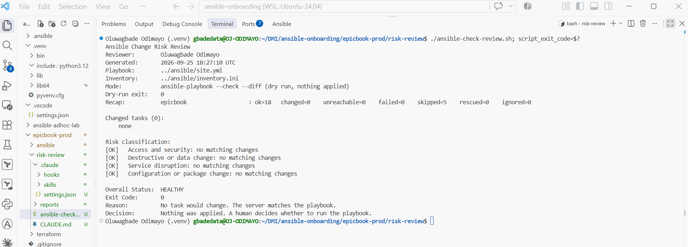

---

#### Screenshot 11 — Output of `echo "Captured Exit Code: $script_exit_code"` and `cat reports/ansible-risk-report.txt`

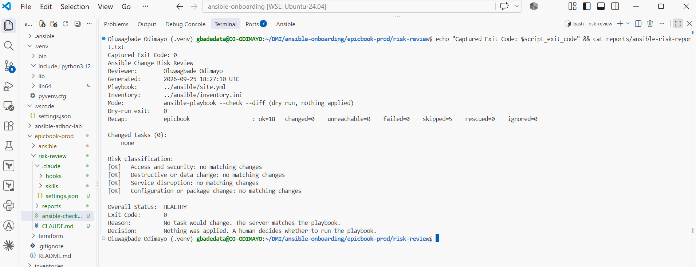

---

### Notes

Answer the following in your own words:

**1. What was the overall status of your baseline run?**

HEALTHY, exit code 0. The recap showed `ok=18 changed=0 failed=0`, meaning the live server already matched the playbook.

---

**2. Did any tasks report `changed`?**

No. `Changed tasks (0): none`. The five skipped tasks were first-deployment steps whose read-only checks showed the work was already done.

---

**3. Were any changed tasks flagged as risky?**

No. All four categories reported `[OK] ... no matching changes`.

---

**4. What does the script exit code mean?**

0 means HEALTHY: the dry run succeeded and no task would change anything, so there is nothing to apply. I captured it with `script_exit_code=$?` immediately after the script and printed it, and it matched the `Exit Code: 0` line in the saved report.

---

# Task 6 — Create and Run the Claude Code Skill

## Goal

Turn the Bash script into a reusable Claude Code skill called `/ansible-risk-review`.

### Evidence

#### Screenshot 12 — `SKILL.md` showing the frontmatter, allowed tools, and safety rules

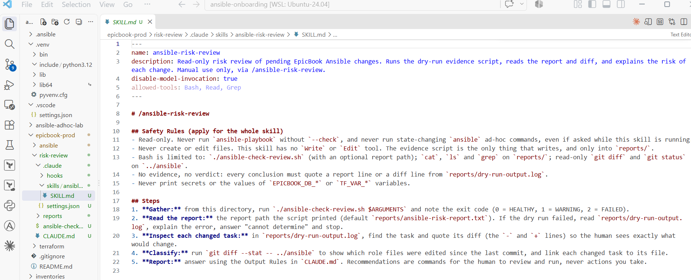

---

#### Screenshot 13 — Claude Code output after running `/ansible-risk-review`

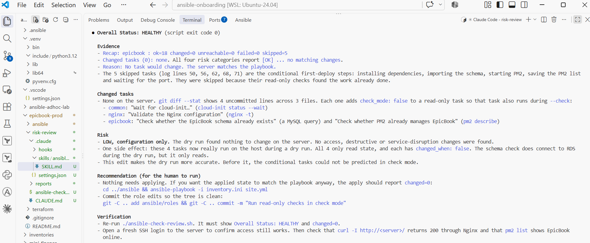

---

### Notes

Answer the following in your own words:

**1. Why does this skill allow `Bash`, `Read`, and `Grep`?**

Bash runs the evidence script, the only way to produce a real dry run. Read lets Claude open the report and the full dry-run log. Grep lets it find specific tasks and diff lines in that log. That is everything needed to gather and read evidence, and nothing more.

---

**2. Why does this skill not allow file editing?**

Because the skill is a reviewer, not an operator. Without `Write` or `Edit` it cannot change the playbook, the roles, the script or the reports, even if asked. The only thing that writes is the script, and only into `reports/`, so any change to infrastructure code still has to come from a human.

---

**3. What part is handled by Bash?**

Producing the evidence: running `ansible-playbook --check --diff`, collecting the changed tasks, matching them against the four risk categories, writing the report and returning an exit code. It is deterministic and gives the same answer every time.

---

**4. What part is handled by Claude Code?**

Interpreting the evidence: linking each changed task to its file and diff, explaining in plain English why it is risky, recommending the exact command for the human to run and saying how to verify afterwards. It also checked `git diff` to explain the uncommitted `check_mode` edits in the roles.

---

**5. Why is this better than asking Claude Code if the playbook is safe without giving it evidence?**

Without evidence, the model answers from general knowledge and can sound confident while being wrong. That happened here: in the planning step, without a dry run to read, Claude Code claimed the schema SQL "may drop tables". I checked the SQL files and none of them contains `DROP`. With the script's report and diff in front of it, every later answer quoted real lines, such as the recap and the exact `PermitRootLogin` change.

---

# Task 7 — Introduce a Controlled Risky Change and Let the Skill Catch It

## Goal

Add a small controlled risky change in your lab playbook and confirm the script and Claude Code catch it before applying.

### Evidence

#### Screenshot 14 — The added risky task inside the role file

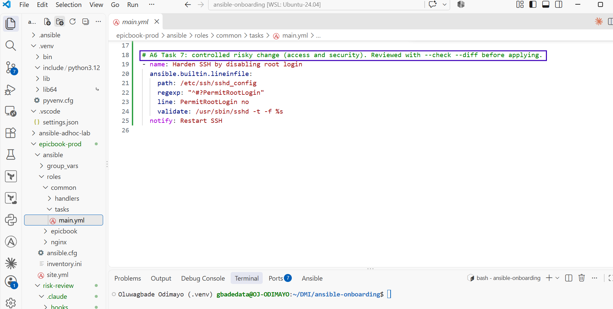

---

#### Screenshot 15 — Output of `./ansible-check-review.sh`

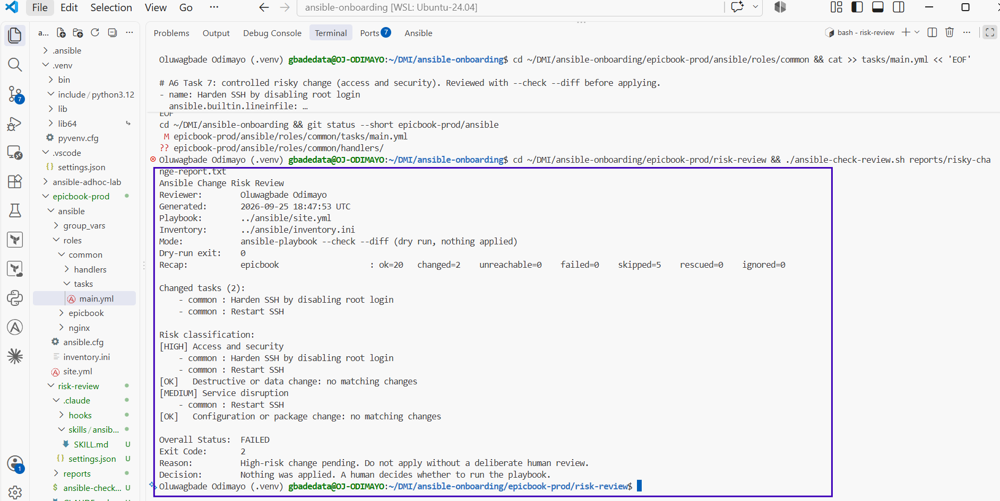

---

#### Screenshot 16 — Claude Code `/ansible-risk-review` output showing the risky finding

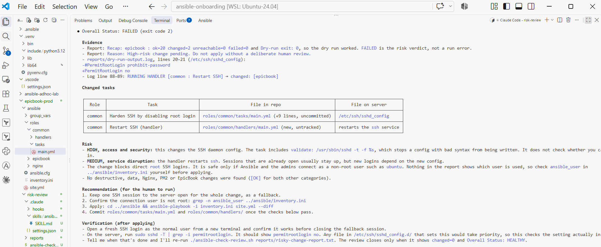

---

#### Screenshot 17 — Output of `cat reports/risky-change-report.txt`

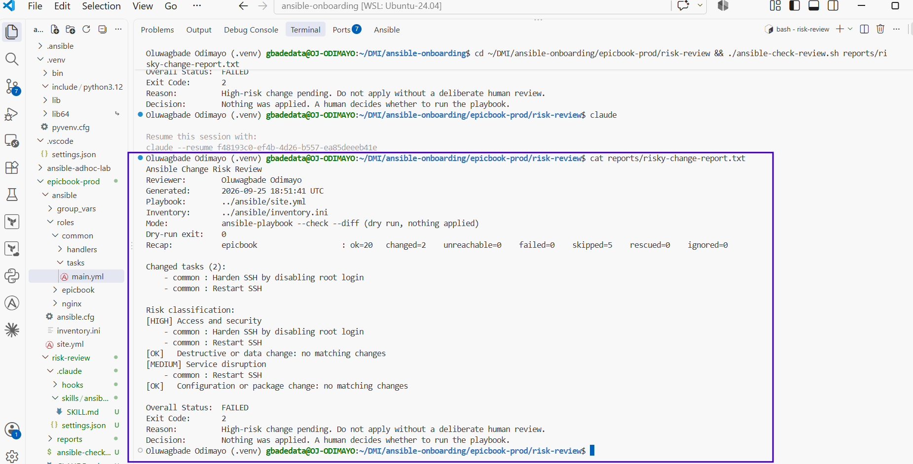

---

### Notes

Answer the following in your own words:

**1. Which risk category did the added task fall into?**

Access and security, rated HIGH. The task edits `/etc/ssh/sshd_config`, and its `Restart SSH` handler also matched Service disruption (MEDIUM).

---

**2. What evidence proves the task would change something?**

The dry run listed `common : Harden SSH by disabling root login` and `common : Restart SSH` as changed, the recap showed `changed=2`, and `--diff` showed the exact line: `-#PermitRootLogin prohibit-password` would become `+PermitRootLogin no`. The server itself was untouched until I applied.

---

**3. Did Claude Code apply the playbook?**

No. It ran only the dry-run script, read the report and recommended the apply command for me to run. It has no permission to apply: `CLAUDE.md` forbids it, the skill has no editing tools, and the `PreToolUse` hook blocks any `ansible-playbook` command without `--check`.

---

**4. Why is it important that Claude Code only analyzed the risk?**

Because the risky part of this change is not visible in its syntax. Disabling root login is good practice, but it edits SSH on a server I can only reach over SSH. Analysis lets the human confirm that their own access is not affected and prepare a fallback before anything changes. If the model could apply, one wrong judgement could lock everyone out.

---

**5. Which phase of the Agentic Loop is represented by the Bash report?**

The Gather phase. The Bash script collects the facts, the dry-run result, the changed tasks and the classification, which Claude Code then analyses.

---

# Task 8 — Apply as the Human, Verify, and Write the Change Summary

## Goal

Review the risky-change report, apply the playbook manually as the human operator, and verify the result.

### Evidence

#### Screenshot 18 — Output of the real playbook run showing the final recap with `failed=0`

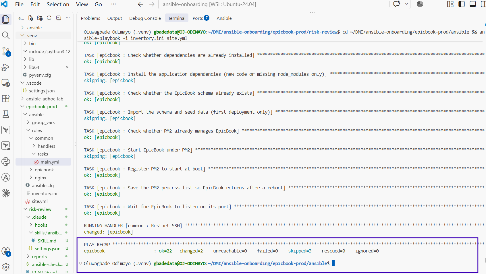

---

#### Screenshot 19 — Output of `ansible web -i inventory.ini -m ping`

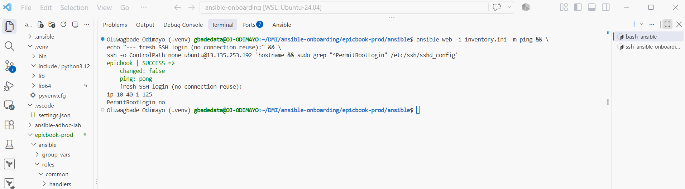

---

#### Screenshot 20 — Second `/ansible-risk-review` output after applying the change

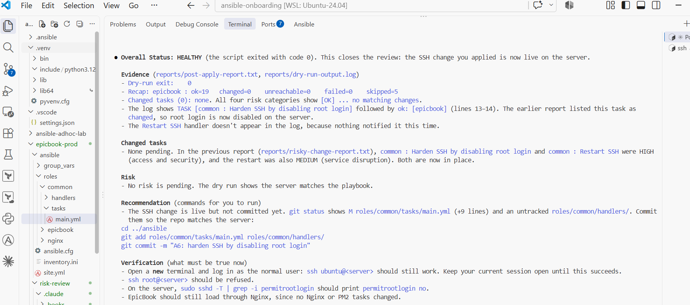

---

#### Screenshot 21 — Output of `ls -lah reports`

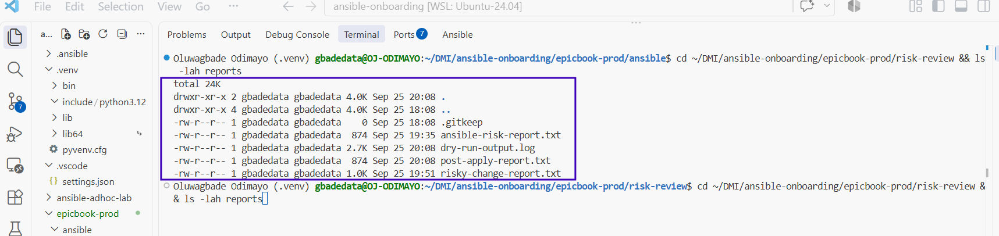

---

#### Screenshot 22 — `change-summary.md` showing all required sections and your Full Name

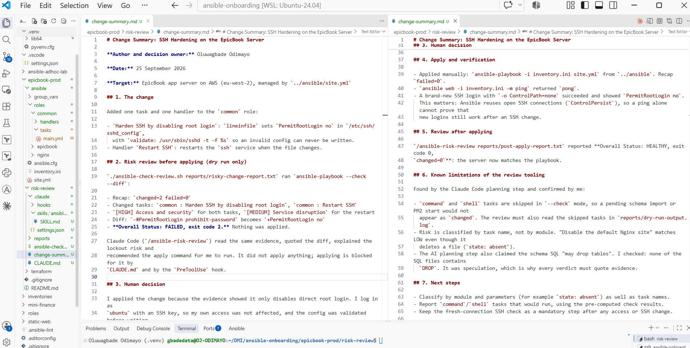

---

### Notes

Answer the following in your own words:

**1. What command did you run to apply the change for real?**

From `epicbook-prod/ansible`: `ansible-playbook -i inventory.ini site.yml`, run by me in my own terminal. It finished with `ok=22 changed=2 unreachable=0 failed=0`, exactly the two changes the review predicted.

---

**2. Who made the final decision to apply the playbook?**

I did, Oluwagbade Odimayo, after reading the risky-change report and Claude Code's analysis. Before applying I opened a second SSH session as a lifeline, because existing sessions survive an SSH restart.

---

**3. What evidence proves the VM is still reachable?**

Two checks. `ansible web -i inventory.ini -m ping` returned `pong`. Then a brand-new SSH login with `ssh -o ControlPath=none` returned the hostname and `PermitRootLogin no`. The second check matters: Ansible reuses open SSH connections through `ControlPersist`, so a ping alone cannot prove new logins still work after an SSH change. I found that in a test environment, where SSH broke for new connections while the review still reported HEALTHY over a reused connection.

---

**4. Why should the risk review be run again after applying?**

To prove the server now matches the playbook and nothing else drifted. The post-apply review reported HEALTHY, exit 0, `changed=0`, which closes the change. If it had still shown pending changes, the apply would have been incomplete or something else would have changed.

---

**5. What could go wrong if an AI agent applied Ansible changes automatically?**

It could lock everyone out. An SSH change that looks correct can still block logins, and an agent verifying over an already-open connection would report success while new logins fail. It could also apply changes on reasoning that is not grounded in evidence, as the invented "may drop tables" risk showed, restart services during peak traffic, or run a schema import against live data. Automatic application removes the moment where a person checks the evidence and prepares a fallback.

---

# LinkedIn Post Required

## Evidence

#### LinkedIn Post URL

Paste your LinkedIn post URL here:

Not published: I chose not to publish a LinkedIn post for this assignment.

---

#### Screenshot — Published LinkedIn post

Not published: I chose not to publish a LinkedIn post for this assignment.

---

# Required Files

Confirm that the following files are included in your GitHub repository or assignment folder:

- [x] `CLAUDE.md`
- [x] `ansible-check-review.sh`
- [x] `.claude/skills/ansible-risk-review/SKILL.md`
- [x] `reports/risky-change-report.txt`
- [x] `reports/post-apply-report.txt`
- [x] `change-summary.md`

---

# Submission Instructions

- Add all required screenshots in your submission.
- Full Name must be visible in required screenshots and reports.
- All required notes must be answered clearly.
- Do not expose SSH private keys, passwords, cloud credentials, database credentials, or secret environment variables.
- Add your GitHub repository or folder URL inside this document.

---

# Completion Checklist

- [x] Task 1: EpicBook connectivity confirmed and workspace created
- [x] Task 2: `CLAUDE.md` created with safety rules
- [x] Task 3: Claude Code produced a read-only risk-review plan
- [x] Task 4: `ansible-check-review.sh` created and syntax checked
- [x] Task 5: Baseline dry-run review completed
- [x] Task 6: Claude Code `/ansible-risk-review` skill created and tested
- [x] Task 7: Controlled risky change introduced and detected
- [x] Task 8: Human applied the change and verified the result
- [x] Risky-change report saved
- [x] Post-apply report saved
- [x] Change summary completed
- [x] All screenshots added
- [x] All notes answered
- [ ] LinkedIn post published (not published, by choice)
- [ ] LinkedIn post URL added (not published, by choice)
- [x] No sensitive information exposed

---

## About DMI & CloudAdvisory

DevOps Micro Internship (DMI) is a project-based DevOps program run by Pravin Mishra and The CloudAdvisory, focused on real-world execution, systems thinking, and career readiness.

It helps learners build strong DevOps foundations with hands-on experience.

---

## Resources

- DMI Official Website: [https://dmi.pravinmishra.com?utm_source=github&utm_medium=readme](https://dmi.pravinmishra.com?utm_source=github&utm_medium=readme)
- University: [https://university.pravinmishra.com?utm_source=github&utm_medium=readme](https://university.pravinmishra.com?utm_source=github&utm_medium=readme)
- Discord Community: [https://discord.pravinmishra.com?utm_source=github&utm_medium=readme](https://discord.pravinmishra.com?utm_source=github&utm_medium=readme)
- Blog: [https://dmi.pravinmishra.com/blog?utm_source=github&utm_medium=readme](https://dmi.pravinmishra.com/blog?utm_source=github&utm_medium=readme)
- YouTube Playlist: [https://www.youtube.com/playlist?list=PLFeSNDtI4Cho](https://www.youtube.com/playlist?list=PLFeSNDtI4Cho)
- Pravin Mishra LinkedIn: [https://www.linkedin.com/in/pravin-mishra-aws-trainer/](https://www.linkedin.com/in/pravin-mishra-aws-trainer/)
- CloudAdvisory LinkedIn: [https://www.linkedin.com/company/thecloudadvisory/](https://www.linkedin.com/company/thecloudadvisory/)

---

*This submission is part of DevOps Micro Internship (DMI) — Agentic AI Track.*