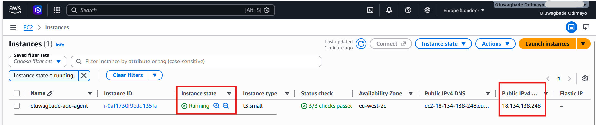
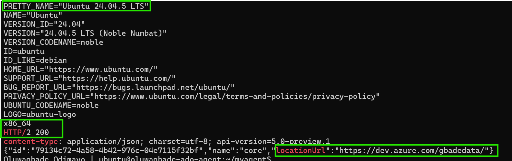
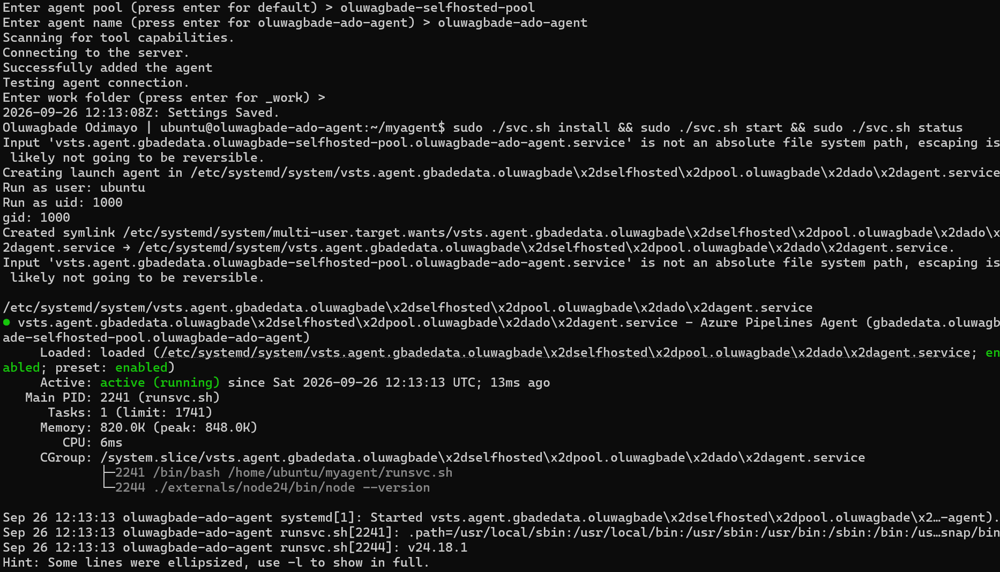
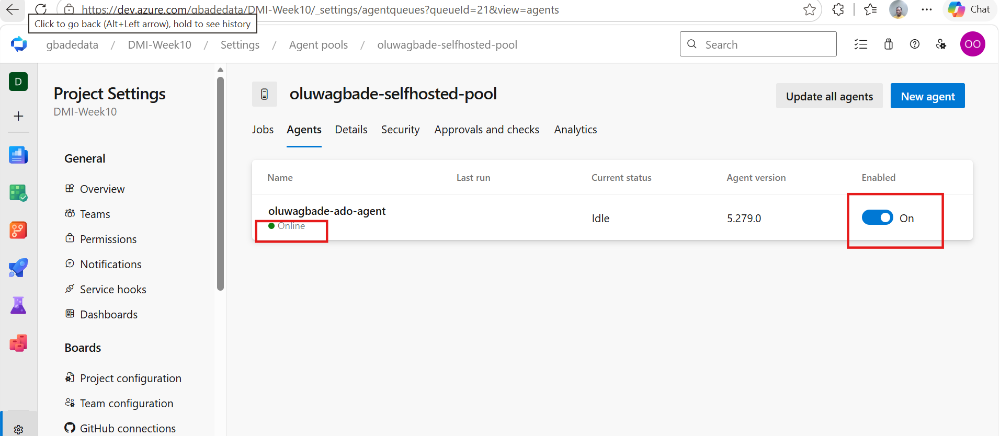
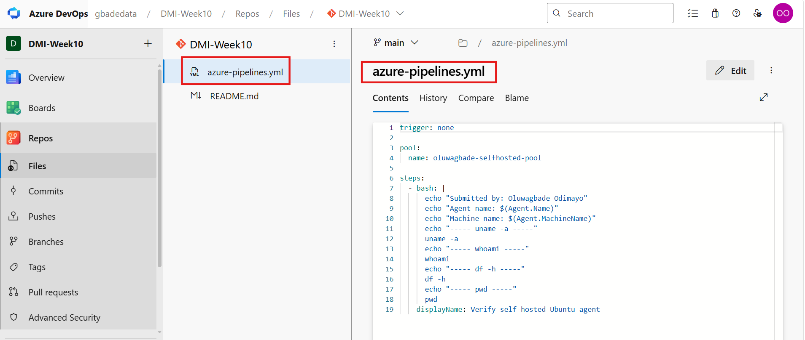
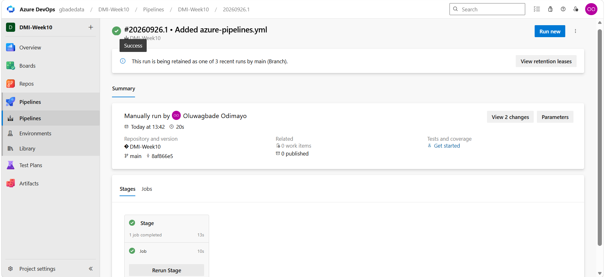
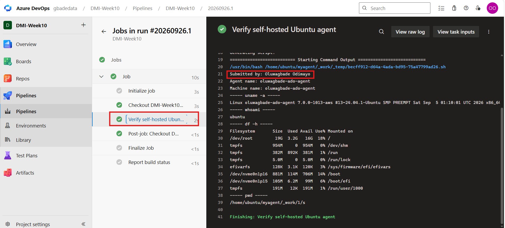

# Assignment 1 — Configure a Self-Hosted Azure DevOps Agent on Ubuntu

Part of the DevOps Micro Internship (DMI) with Agentic AI

---

## Purpose

In this assignment, you will provision an Ubuntu VM in AWS or Azure and configure it as a self-hosted Azure Pipelines agent. You will create an agent pool, register the agent using a Personal Access Token (PAT), run it as a Linux system service, and verify it by executing a test pipeline on the VM.

---

# Task 0 — Create or Access Azure DevOps

## Goal

Sign in to Azure DevOps and create or access an organization and project for the assignment.

No submission screenshot is required for this task.

---

# Task 1 — Create a Personal Access Token (PAT)

## Goal

Create and securely store the PAT required to register the self-hosted agent.

No submission screenshot is required for this task.

> Do not include the PAT in this document or in any screenshot.

---

# Task 2 — Create a Self-Hosted Agent Pool

## Goal

Create the Azure DevOps agent pool that will contain the Linux agent.

No submission screenshot is required for this task.

---

# Task 3 — Provision and Connect to the Ubuntu VM

## Goal

Provision an Ubuntu VM in AWS or Azure and verify its operating system, architecture, and outbound connection to Azure DevOps.

## Evidence

### Screenshot 1 — Ubuntu VM Running

Add a screenshot from AWS or Azure showing:

* Ubuntu VM name
* VM status as **Running**
* Public IP address



*AWS EC2, eu-west-2: `oluwagbade-ado-agent` (t3.small, Ubuntu 24.04 LTS) in the Running state with public IPv4 18.134.138.248. The security group allows SSH (port 22) only from my own public IP as a /32; there are no other inbound rules. The AWS account ID is blurred.*

---

### Screenshot 2 — Ubuntu, Architecture, and HTTPS Verification

Add an SSH terminal screenshot showing the output of:

* `cat /etc/os-release`
* `uname -m`
* `curl -I https://dev.azure.com`

The screenshot must confirm a supported Ubuntu version, `x86_64` architecture, and a successful HTTP response from Azure DevOps.



*Ubuntu 24.04.5 LTS (Noble Numbat) on `x86_64`, and a direct `HTTP/2 200` from `dev.azure.com`. The brief's `curl -I https://dev.azure.com` sends a HEAD request, which the bare domain answers with 404, and the organization's own URLs redirect anonymous requests to sign-in (302). So I used a GET to Azure DevOps' public resource-area lookup endpoint, which answers without authentication: it returns `200` with a JSON body whose `locationUrl` is my organization, `https://dev.azure.com/gbadedata/`.*

---

# Task 4 — Install and Configure the Azure Pipelines Agent

## Goal

Download, configure, and register the Linux Azure Pipelines agent, and run it as a system service.

## Evidence

### Screenshot 3 — Agent Configuration and Service Status

Add a terminal screenshot showing:

* Successful agent configuration
* Agent service installation
* Agent service start
* `sudo ./svc.sh status` reporting that the service is running



*`./config.sh` connected to the `gbadedata` organization, added the agent `oluwagbade-ado-agent` to `oluwagbade-selfhosted-pool`, and saved its settings. `sudo ./svc.sh install`, `start` and `status` then registered it as a systemd service that runs as the `ubuntu` user and reports `active (running)`. The PAT was entered at a hidden prompt and does not appear anywhere.*

> Ensure that the PAT is not visible.

---

# Task 5 — Verify That the Agent Is Online

## Goal

Confirm that the agent service is running and the agent appears online in Azure DevOps.

## Evidence

### Screenshot 4 — Agent Online in Azure DevOps

Add a screenshot of the Azure DevOps Agent Pool **Agents** page showing:

* Selected agent pool
* Selected agent name
* Agent status as **Online**
* Agent enabled and available



*The Agents tab for `oluwagbade-selfhosted-pool` in project `DMI-Week10`: `oluwagbade-ado-agent` is Online, Idle (available for jobs), enabled, and running agent version 5.279.0.*

---

# Task 6 — Create and Run a Test Pipeline

## Goal

Create an Azure DevOps YAML pipeline and verify that its commands execute on the self-hosted Ubuntu VM.

## Evidence

### Screenshot 5 — Azure Pipelines YAML

Add a screenshot of `azure-pipelines.yml` open in the Azure Repos editor showing:

* `trigger: none`
* Selected self-hosted agent pool
* Bash verification step
* Your Full Name
* Linux verification commands



*`azure-pipelines.yml` on `main` in the `DMI-Week10` repo: `trigger: none`, the self-hosted pool `oluwagbade-selfhosted-pool`, and a single Bash step named "Verify self-hosted Ubuntu agent" that prints my full name, the agent and machine names, and the four Linux checks.*

---

### Screenshot 6 — Successful Test Pipeline

Add a screenshot of the successful Azure DevOps pipeline run showing:

* Overall status as **Succeeded**
* Expanded **Verify self-hosted Ubuntu agent** step
* `Submitted by: <your-full-name>`
* Agent name
* Machine name
* Output from `uname -a`
* Output from `whoami`
* Output from `df -h`
* Output from `pwd`



*Run #20260926.1, manually triggered (the pipeline has `trigger: none`). Hovering the status icon shows **Success**, and the single stage and job both completed.*



*The expanded "Verify self-hosted Ubuntu agent" step: `Submitted by: Oluwagbade Odimayo`, agent name and machine name `oluwagbade-ado-agent`, `uname -a` (Linux 7.0.0-aws, x86_64), `whoami` = `ubuntu`, `df -h` for the 19 GB root volume, and `pwd` = `/home/ubuntu/myagent/_work/1/s`. That working directory is inside the agent's own folder on the VM, which confirms the job ran on the self-hosted agent rather than a Microsoft-hosted one.*

---

## Completed azure-pipelines.yml

Paste the contents of your completed `azure-pipelines.yml` file below.

```yaml
trigger: none

pool:
  name: oluwagbade-selfhosted-pool

steps:
  - bash: |
      echo "Submitted by: Oluwagbade Odimayo"
      echo "Agent name: $(Agent.Name)"
      echo "Machine name: $(Agent.MachineName)"
      echo "----- uname -a -----"
      uname -a
      echo "----- whoami -----"
      whoami
      echo "----- df -h -----"
      df -h
      echo "----- pwd -----"
      pwd
    displayName: Verify self-hosted Ubuntu agent
```

> Do not include your PAT, SSH private key, password, or cloud credentials in the YAML file.

---

# Assignment Summary

Write a short summary of what you configured.

I set up a self-hosted Linux agent for Azure DevOps and proved it by running a pipeline on it.

The agent runs on an AWS EC2 instance, `oluwagbade-ado-agent` (t3.small, Ubuntu 24.04 LTS, x86_64, eu-west-2), launched from the AWS CLI with a cloud-init file that sets the hostname and puts my name in the shell prompt. Its security group allows SSH only from my own public IP as a /32, and nothing else inbound. The agent itself needs no inbound ports at all, because it connects out to Azure DevOps over HTTPS and polls for jobs.

In Azure DevOps (organization `gbadedata`, project `DMI-Week10`), I created a Personal Access Token with a single scope, **Agent Pools: Read & manage**, which is all that registration needs, and a 30-day expiry. It is stored in my password manager, not on disk. I then created the self-hosted pool `oluwagbade-selfhosted-pool`, linked it to the project, and granted it access to all pipelines.

On the VM I downloaded agent 5.279.0 from `download.agent.dev.azure.com` (the portal's older CDN address has been retired), installed its dependencies, and registered it with `./config.sh`, entering the PAT at a hidden prompt. `svc.sh` then installed it as a systemd service running as `ubuntu`, so it starts on boot and doesn't depend on an open SSH session. The agent appears Online and enabled in the pool.

The test pipeline has `trigger: none` and targets the same pool name used during registration. Run #20260926.1 succeeded, and its output shows my name, the agent and machine names, and a working directory under `/home/ubuntu/myagent/_work`, which confirms the job executed on my VM.

The agent stays running because Assignments 2 to 5 use it for their deployments.

---

# LinkedIn Requirement (If Applicable)

## Screenshot 7 — LinkedInisor填Token Belle

Add a screenshot of your LinkedIn post showing:

* What you configured
* Why organizations use self-hosted agents
* Three to five lines explaining your experience
* A screenshot of the successful pipeline run with no secrets visible

Not published, by choice.

**LinkedIn Post URL:** Not published, by choice.

---

# Submission Instructions

* Include the short assignment summary.
* Include Screenshots 1–6.
* Include the contents of your completed `azure-pipelines.yml` file.
* Include Screenshot 7 and the LinkedIn post URL if the LinkedIn requirement applies.
* Do not expose a PAT, SSH private key, password, account details, or another secret.

---

# Completion Checklist

* Azure DevOps organization and project are ready
* A supported Ubuntu LTS VM is running and accessible through SSH
* SSH access is restricted to your public IP address
* Outbound HTTPS connectivity is working
* PAT was created with the required scopes and stored securely
* A self-hosted agent pool was created
* The same pool name was used during registration and in the pipeline YAML
* The agent service is running
* The agent appears **Online** in Azure DevOps
* The pipeline targets the selected agent pool
* The pipeline run completed with **Succeeded** status
* The pipeline output displays your Full Name
* Screenshots 1–6 are included and readable
* Screenshot 7 and the LinkedIn post URL are included if applicable
* The completed `azure-pipelines.yml` content is included
* No PAT, SSH private key, password, or other secret is visible

---

*This submission is part of the DevOps Micro Internship (DMI) — Agentic AI Track.*
