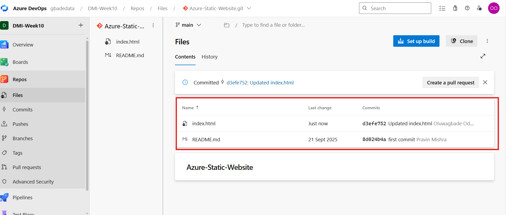
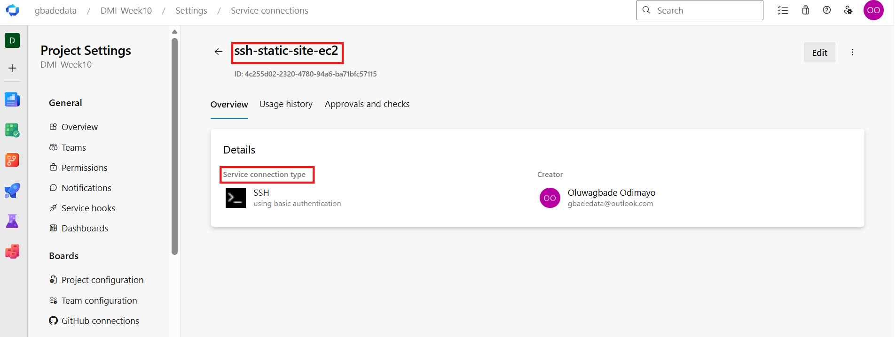
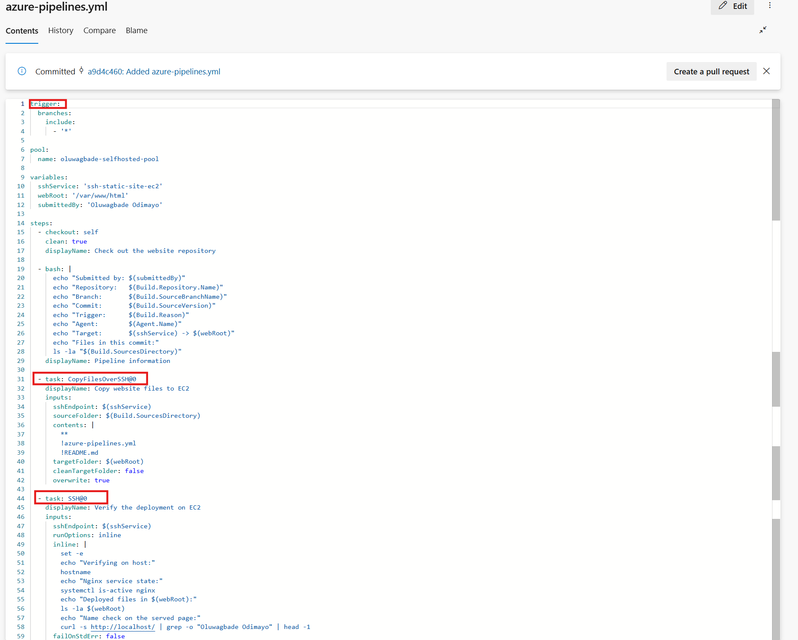
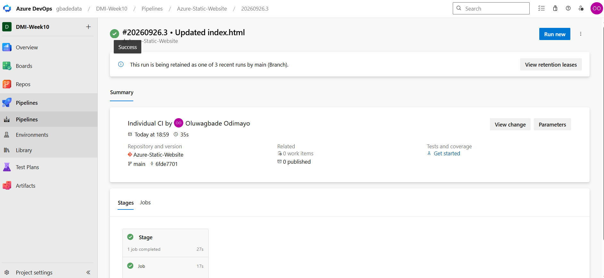
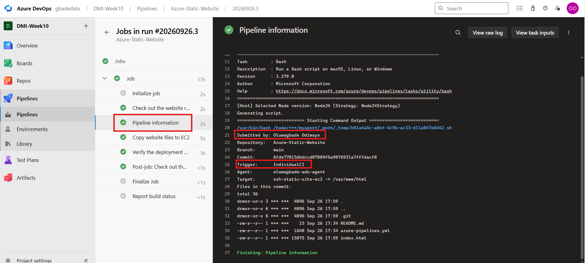
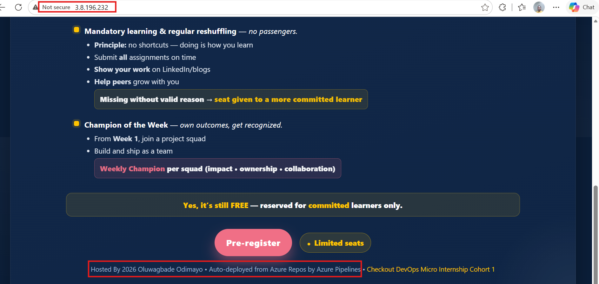

# Assignment 2 — Deploy A Static Website to AWS EC2 Using an Azure DevOps CI/CD Pipeline

Part of the DevOps Micro Internship (DMI) with Agentic AI

---

## Purpose

In this assignment, you will import and personalize the Static Website, provision and configure an AWS EC2 instance using Terraform and Ansible, and create an Azure DevOps CI/CD pipeline that automatically deploys the website to Nginx through an SSH Service Connection.

---

# Task 0 — Verify the Existing Tooling and Self-Hosted Agent

## Goal

Confirm that Terraform, Ansible, AWS CLI, SSH, and the self-hosted Azure Pipelines agent are ready.

No submission screenshot is required for this task.

---

# Task 1 — Import and Personalize the Azure Static Website Repository

## Goal

Import the Azure Static Website into Azure Repos and add your Full Name to the website.

## Evidence

### Screenshot 1 — Azure Static Website in Azure Repos

Add a screenshot of Azure Repos showing:

* Imported Azure Static Website repository
* Project files
* `index.html`

*The Azure Static Website imported into Azure Repos (project `DMI-Week10`) from `pravinmishraaws/Azure-Static-Website`. The files are `index.html` and `README.md`, and the latest commit on `index.html` is my edit adding my full name to the site footer.*

---

# Task 2 — Provision and Configure the Target EC2 Instance

## Goal

Provision the AWS EC2 instance using Terraform and configure Nginx, SSH access, and deployment permissions using Ansible.

No additional submission screenshot is required for this task.

---

# Task 3 — Create the SSH Service Connection

## Goal

Create an Azure DevOps SSH Service Connection that can connect to the target EC2 instance using your selected SSH authentication method.

## Evidence

### Screenshot 2 — SSH Service Connection

Add a screenshot of the saved SSH Service Connection **Overview** page showing:

* Service Connection name
* SSH connection type

*The saved SSH service connection `ssh-static-site-ec2`. It authenticates with a dedicated deploy key (RSA 4096) whose private half is stored only in the connection, with the password field left empty; "basic authentication" is the generic label Azure DevOps shows for every SSH connection. Its host is the web server's private IP, so the agent's SSH traffic stays inside the AWS VPC.*

> Do not expose a password, SSH private key, passphrase, or another credential.

---

# Task 4 — Create the Azure DevOps YAML Pipeline

## Goal

Create an Azure DevOps YAML pipeline that deploys the Azure Static Website to the target EC2 instance after a commit is pushed.

## Evidence

### Screenshot 3 — Azure Pipelines YAML

Add a screenshot of `azure-pipelines.yml` open in the Azure Repos editor showing:

* Push trigger
* Selected self-hosted agent pool
* Pipeline variables
* Repository checkout step
* Pipeline information step
* `CopyFilesOverSSH@0` task
* `SSH@0` verification task

*`azure-pipelines.yml` in Azure Repos: a push trigger covering all branches (`'*'`), the self-hosted pool `oluwagbade-selfhosted-pool`, pipeline variables, the checkout step, a pipeline information step, `CopyFilesOverSSH@0` (which deploys the site but leaves out the pipeline file and README), and an `SSH@0` verification task that fails the run unless Nginx is active and the page it serves contains my name.*

> Ensure that no password, SSH private key, PAT, or AWS credential is visible.

---

# Task 5 — Create, Authorize, and Run the Pipeline

## Goal

Run the Azure DevOps pipeline and confirm that the website files are transferred and verified successfully.

## Evidence

### Screenshot 4 — Successful Pipeline Run

Add a screenshot of the successful pipeline run and log summary showing:

* Overall pipeline status as **Succeeded**
* Pipeline information step completed
* File-copy step completed
* Remote-verification step completed
* Your Full Name visible in the pipeline output

*Run #20260926.3, started by "Individual CI", meaning my commit to `index.html` triggered it without anyone clicking Run. Hovering the status icon shows **Success**.*

*The same run's log. All steps completed: checkout, pipeline information, the file copy and the remote verification. The expanded information step shows `Submitted by: Oluwagbade Odimayo` and `Trigger: IndividualCI`. The `***` in the file listing is Azure DevOps masking the service connection's username (`ubuntu`) wherever it appears in the log.*

---

# Task 6 — Verify the Website and Automatic Trigger

## Goal

Confirm that the website is accessible through the EC2 public IP address and that a new pushed commit automatically triggers another deployment.

## Evidence

### Screenshot 5 — Deployed Azure Static Website

Add a browser screenshot showing:

* Deployed Azure Static Website
* EC2 public IP address in the browser address bar
* Your Full Name
* Updated website content after the automatic deployment

*The site served by Nginx at `http://3.8.196.232`. The footer shows my name and the line "Auto-deployed from Azure Repos by Azure Pipelines", which was the change in the commit that triggered run #20260926.3.*

## Final Website URL

`http://3.8.196.232`

Replace the placeholder with your actual website URL:

http://3.8.196.232

---

# Assignment Summary

Write a short summary of the completed CI/CD workflow.

Every push to the Azure Static Website repository now deploys the site to an AWS EC2 web server automatically, through a self-hosted Azure Pipelines agent.

**Code.** I imported the Azure Static Website into Azure Repos (project `DMI-Week10`) and added my name to the site footer.

**Infrastructure (Terraform).** From my workstation, Terraform created an Ubuntu 24.04 t3.micro instance in eu-west-2 and its security group. Port 80 is open to everyone for the website. Port 22 is open to only two sources: my own IP as a /32, so Ansible can connect, and the security group of the Azure Pipelines agent VM from Assignment 1. The provider is pinned to my AWS account with `allowed_account_ids`, and the instance uses IMDSv2.

**Configuration (Ansible).** A playbook installed and enabled Nginx, removed the default welcome page, gave the `ubuntu` user ownership of `/var/www/html` (group `www-data`), and authorised a dedicated deploy key for that user. The playbook ends by proving the deploy user can write to the web root.

**Connection.** The SSH service connection `ssh-static-site-ec2` uses that deploy key rather than a password, and targets the server's private IP. Because the agent and the web server are in the same VPC, the pipeline's SSH traffic never crosses the internet, and the security-group rule that references the agent's group only works for exactly that reason. Before touching Azure DevOps, I checked both paths: the deploy key logged in and wrote to the web root, and the agent reached port 22 on the private IP.

**Pipeline.** `azure-pipelines.yml` triggers on pushes to any branch and runs on my self-hosted pool. It checks out the repository, prints the run's details (including my name and the trigger reason), copies the site to `/var/www/html` with `CopyFilesOverSSH@0` (excluding the pipeline file and README), and then verifies over SSH with `SSH@0`: the verification fails the run unless Nginx is active and the page it actually serves contains my name.

**One problem along the way.** The first run failed at the copy step with `Cannot parse privateKey: Unsupported key format`. The key itself was fine, since it had already logged in from my workstation. The copy stored in the service connection had lost its line structure when it was pasted, and re-entering the key with its line breaks intact fixed it.

**Proof.** After a successful first run, I changed the footer and pushed. Run #20260926.3 started on its own (`Trigger: IndividualCI`), succeeded, and the updated page is live at http://3.8.196.232. The instance stays running for grading.

---

# LinkedIn Requirement

## LinkedIn Post Screenshot

Add a screenshot of your LinkedIn post containing:

* What you automated
* How Terraform, Ansible, and Azure DevOps worked together
* Three to five lines describing the CI/CD workflow
* A screenshot of the successful pipeline or deployed website

Not published, by choice.

## LinkedIn Post URL

Not published, by choice.

> Do not expose AWS credentials, SSH private keys, passwords, PATs, or other sensitive information.

---

# Submission Instructions

* Include the short assignment summary.
* Include Screenshots 1–5.
* Include the final website URL.
* Include the LinkedIn post screenshot and URL.
* Confirm that the EC2 instance is running during grading.
* Do not expose a password, SSH private key, passphrase, PAT, AWS credential, account ID, or another secret.

---

# Completion Checklist

* The correct Azure Static Website repository was imported into Azure Repos
* `index.html` is visible in Azure Repos
* Your Full Name was added to the website
* The target EC2 instance was provisioned using Terraform
* A suitable Ubuntu image and EC2 size were selected
* Nginx was configured using Ansible
* SSH login works using the selected authentication method
* The SSH user can write to `/var/www/html`
* TCP ports 22 and 80 are configured correctly
* The self-hosted Azure Pipelines agent is online
* The SSH Service Connection was created successfully
* The YAML trigger includes all branches
* The YAML uses the correct self-hosted agent pool
* The copy and remote-verification tasks completed successfully
* The pipeline status is **Succeeded**
* A new pushed commit triggered the pipeline automatically
* The Azure Static Website loads through the EC2 public IP address
* Your Full Name is visible on the deployed website
* Screenshots 1–5 are included and readable
* The final website URL is included
* The LinkedIn post screenshot and URL are included
* No sensitive information is exposed

---

*This submission is part of the DevOps Micro Internship (DMI) — Agentic AI Track.*
