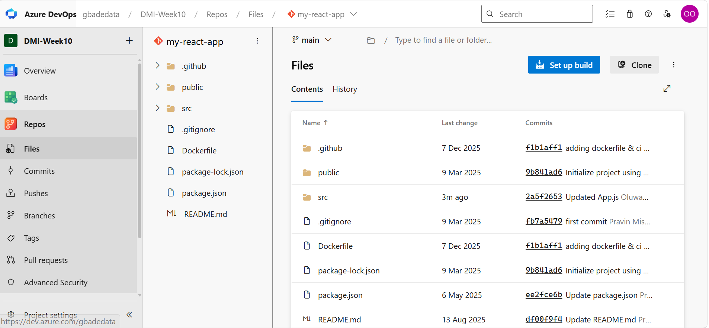
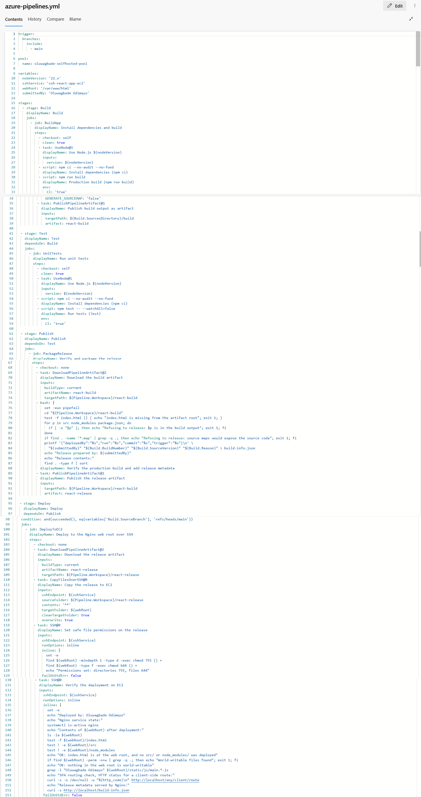
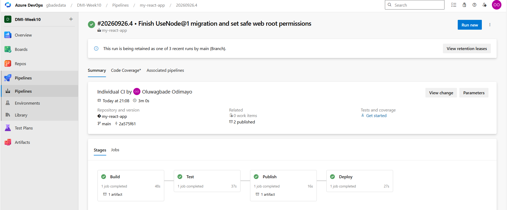
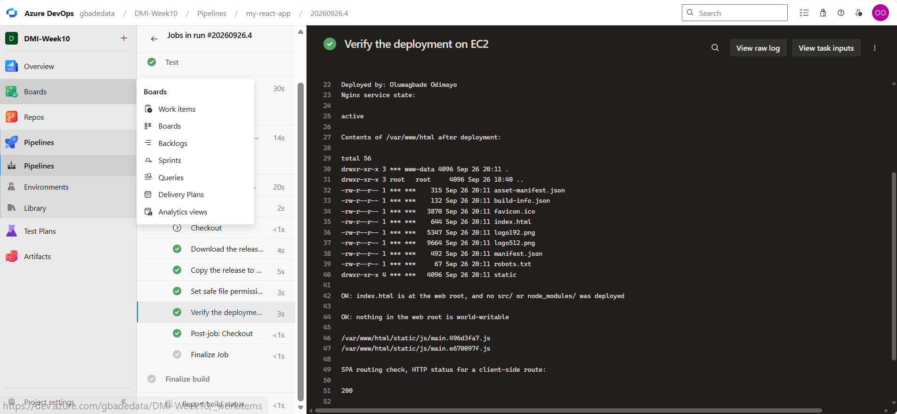
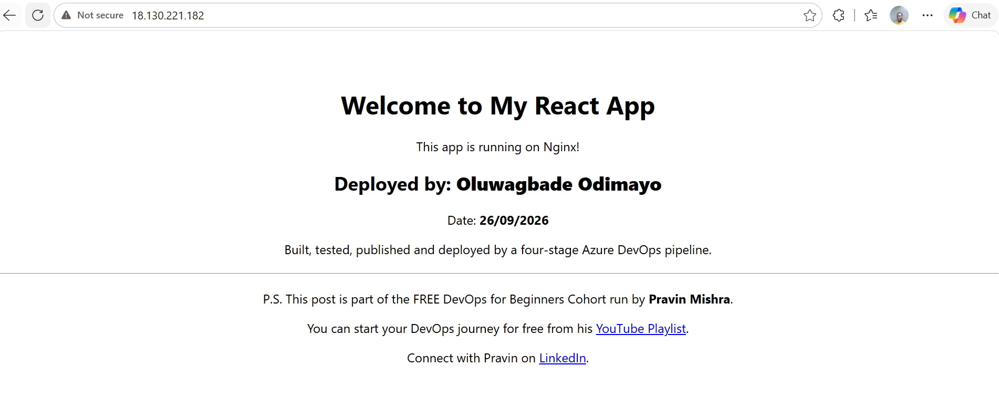

# Assignment 3 — Automate React App Deployment Using Azure DevOps CI/CD

Part of the DevOps Micro Internship (DMI) with Agentic AI

---

## Purpose

In this assignment, you will create a multi-stage Azure DevOps pipeline that builds, tests, publishes, and deploys a React application to an Ubuntu VM hosted on AWS or Azure. The pipeline will automatically run when changes are committed to `main`, transfer the production build as an artifact, and deploy it through Nginx.

---

# Task 0 — Verify the Starting Environment

## Goal

Confirm that Azure DevOps, the pipeline agent, Terraform, Ansible, and the selected cloud environment are ready.

No submission screenshot is required for this task.

---

# Task 1 — Import and Personalize the React Application

## Goal

Import the React application into Azure Repos and add your Full Name and the current date.

## Evidence

### Screenshot 1 — Imported React Project in Azure Repos

Add a screenshot of Azure Repos showing:

* Imported React project
* Repository name
* `main` branch
* Project files

*The React app imported into Azure Repos as `my-react-app` (project `DMI-Week10`) from `pravinmishraaws/my-react-app`, on the `main` branch. The `src` folder's latest commit is my edit to `App.js`, which adds my full name and the deployment date.*

---

# Task 2 — Provision and Configure the Target VM

## Goal

Provision an Ubuntu VM using Terraform and configure Nginx, React SPA routing, SSH access, and deployment permissions using Ansible.

No separate submission screenshot is required for this task.

---

# Task 3 — Create or Update the SSH Service Connection

## Goal

Create or update an Azure DevOps SSH Service Connection that allows the pipeline to connect securely to the target VM.

No separate submission screenshot is required for this task.

> Do not include the VM password, SSH private key, token, or another secret in the submission.

---

# Task 4 — Author the Multi-Stage Azure Pipeline

## Goal

Create an Azure Pipeline containing Build, Test, Publish, and Deploy stages with an automatic trigger for commits to `main`.

## Evidence

### Screenshot 2 — Multi-Stage Pipeline YAML

Add a screenshot of the Azure Pipeline YAML open in the editor showing:

* Trigger
* Build stage
* Test stage
* Publish stage
* Deploy stage

*The full `azure-pipelines.yml` (153 lines): a trigger on `main`, and the Build, Test, Publish and Deploy stages. The build output leaves Build as the `react-build` artifact, and Publish re-publishes it as the checked `react-release` artifact that Deploy installs. No password, key or token is in the file: the Deploy stage refers only to the SSH service connection by name.*

> Do not expose passwords, private keys, tokens, or cloud credentials.

---

# Task 5 — Run the Pipeline and Resolve Configuration Issues

## Goal

Complete a successful end-to-end pipeline run containing all four stages.

## Evidence

### Screenshot 3 — Successful Multi-Stage Pipeline Run

Add a screenshot of one Azure DevOps pipeline run showing all four stages succeeded:

* Build
* Test
* Publish
* Deploy

*Run #20260926.4, started by "Individual CI" from my commit to `main`, with all four stages succeeded in the same run and no warnings. Build and Publish each produced one artifact.*

---

# Task 6 — Verify the Deployment on the VM

## Goal

Confirm that the pipeline deployed the production-ready React files to the correct Nginx web root.

## Evidence

### Screenshot 4 — Post-Deployment Contents of /var/www/html

Add a screenshot of the pipeline SSH verification log or VM terminal showing the post-deployment contents of:

`/var/www/html`

*The Deploy stage's SSH verification step. `/var/www/html` contains the production build only: `index.html` at the top level with the other build files and `static/`, and no `src/` or `node_modules/`. Files are `644` and directories `755`, set by the step before it, and the check that nothing is world-writable passed. Nginx is active, and a client-side route returns `200` because of the SPA fallback. The name check lists two bundles: `main.e670097f.js` from this release, and `main.496d3fa7.js` left over from the first release (see the note in the summary). The `***` is Azure DevOps masking the service connection's username.*

---

# Task 7 — Verify the Website and Automatic Trigger

## Goal

Confirm that the React application is accessible and that a commit to `main` automatically triggers the CI/CD pipeline.

## Evidence

### Screenshot 5 — Deployed React Application

Add a browser screenshot showing:

* Deployed React application
* VM public IP address in the browser address bar
* Your Full Name
* Deployment date

*The React app at `http://18.130.221.182`, showing my full name, the deployment date (26/09/2026), and the line added by the commit that triggered the automatic run.*

## Final Application URL

`http://18.130.221.182`

Replace the placeholder and paste your final application URL below:

http://18.130.221.182

---

# CI/CD Workflow Summary

Write a short explanation of the CI/CD workflow you created.

Every commit to `main` in `my-react-app` now builds, tests, packages and deploys the React app to an Ubuntu EC2 web server, all on my self-hosted Azure Pipelines agent.

**Code.** I imported the React app into Azure Repos and set my name and the deployment date in `src/App.js`.

**Infrastructure and configuration.** Terraform created an Ubuntu 24.04 t3.micro in eu-west-2. Port 80 is open to everyone; port 22 is open only to my own IP and to the agent's security group. Ansible installed Nginx, gave the `ubuntu` deploy user the web root, and authorised the pipeline's deploy key. It also replaced the default site with an SPA configuration, which falls back to `index.html` so client-side routes work, and caches hashed files under `/static/` for a year. The config is checked with `nginx -t` before Nginx reloads, and the playbook ends by confirming a client-side route returns 200. The SSH service connection `ssh-react-app-ec2` uses the deploy key and the server's private IP, so deployment traffic stays inside the VPC.

**Pipeline.**
- **Build** runs `npm ci` and a production build with `CI=true` (warnings fail the build) and `GENERATE_SOURCEMAP=false` (source maps would otherwise publish the original source code), then publishes `build/` as the `react-build` artifact.
- **Test** runs the Jest tests non-interactively.
- **Publish** downloads `react-build`, refuses to release unless `index.html` is at its root and there is no `src/`, `node_modules/`, `package.json` or source map, adds a small `build-info.json` recording the run and commit, and publishes the result as `react-release`.
- **Deploy** runs only for `main`. It downloads `react-release`, copies it to `/var/www/html` over the SSH service connection, sets files to 644 and directories to 755, and then verifies over SSH that Nginx is active, the web root holds only the build, nothing is world-writable, my name is in the deployed bundle, and a client-side route returns 200.

**Issues I resolved.** The Node setup task `NodeTool@0` is deprecated and produced warnings, so I moved both Node steps to `UseNode@1`; run #20260926.4 has no warnings. The copy task created the files world-writable (`666`, with `777` directories), so I added the permission step and made the verification fail if anything world-writable remains.

**One known leftover.** `cleanTargetFolder` is enabled on the copy task, yet the verification log still shows the JavaScript bundle from the first release in `static/js`, so that clean-up did not remove it. It is harmless, because `index.html` only loads the current bundle, but my next change is an explicit clean-up step before the copy rather than relying on the task option.

**Proof.** Run #20260926.4 was started by my commit (Individual CI), all four stages succeeded in that one run, and the app is live at http://18.130.221.182. The instance stays running for grading.

---

# LinkedIn Requirement

## Evidence

### Screenshot 6 — LinkedIn Post

Add a screenshot of your LinkedIn post showing:

* Post text
* At least one image or link

Not published, by choice.

## LinkedIn Post URL

Not published, by choice.

> Do not expose VM passwords, tokens, private keys, cloud credentials, or other sensitive information.

---

# Submission Instructions

* Complete all tasks in sequence.
* Include the short CI/CD workflow summary.
* Include Screenshots 1–6.
* Include the final application URL.
* Include the public LinkedIn post URL.
* Confirm that all screenshots are readable and show the required context.
* Do not expose passwords, PATs, private keys, cloud credentials, subscription IDs, account IDs, or other secrets.
* Follow the Assignment Submission Guidelines.

---

# Completion Checklist

* [x] All tasks were completed in sequence
* [x] The correct React repository was imported into Azure Repos
* [x] Your Full Name and date were added to the application
* [x] The pipeline YAML was authored and committed to the repository
* [x] Commits to `main` trigger the pipeline automatically
* [x] The pipeline contains Build, Test, Publish, and Deploy stages
* [x] All four stages succeeded in the same pipeline run
* [x] The production build moved between stages as a pipeline artifact
* [x] The Deploy stage used the SSH Service Connection
* [x] No password or secret is stored in the YAML
* [x] `index.html` is directly inside `/var/www/html`
* [x] Raw React source code was not deployed to the Nginx web root
* [x] `node_modules/` was not deployed to the Nginx web root
* [x] Nginx is active
* [x] The application opens through the VM public IP address
* [x] Your Full Name and date are visible in the browser screenshot
* [x] Screenshots 1–6 are included and readable (Screenshot 6 is the LinkedIn post: not published, by choice)
* [x] No password, token, private key, account ID, or other secret is visible
* [x] The final application URL is included
* [ ] The LinkedIn post is published (not published, by choice)
* [ ] The LinkedIn post URL is included (not published, by choice)

---

*This submission is part of the DevOps Micro Internship (DMI) — Agentic AI Track.*
