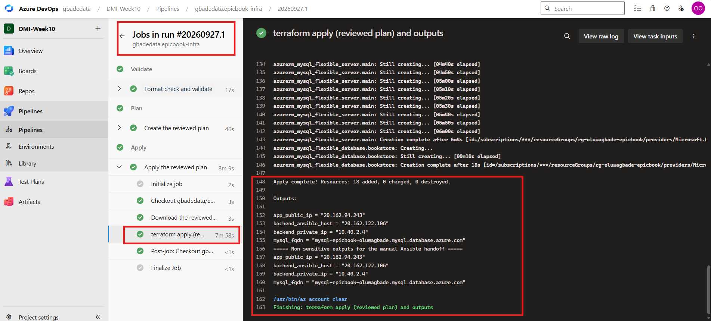
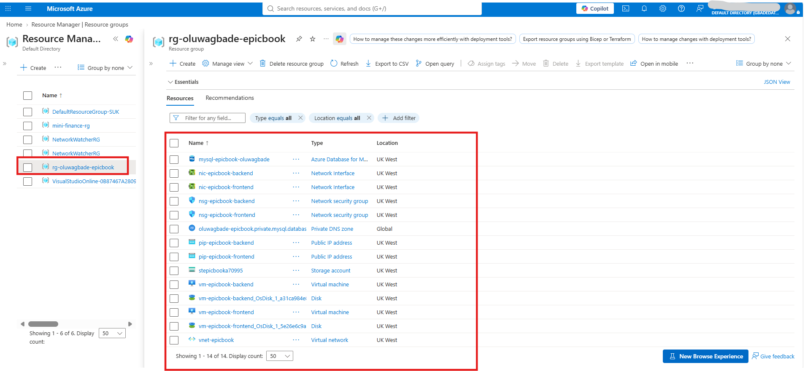
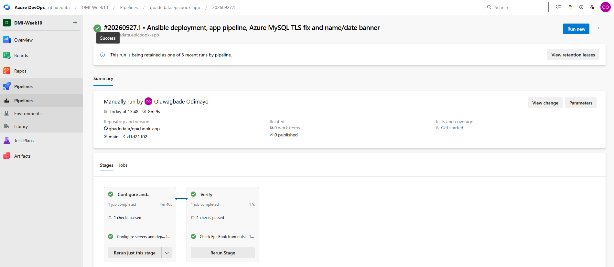
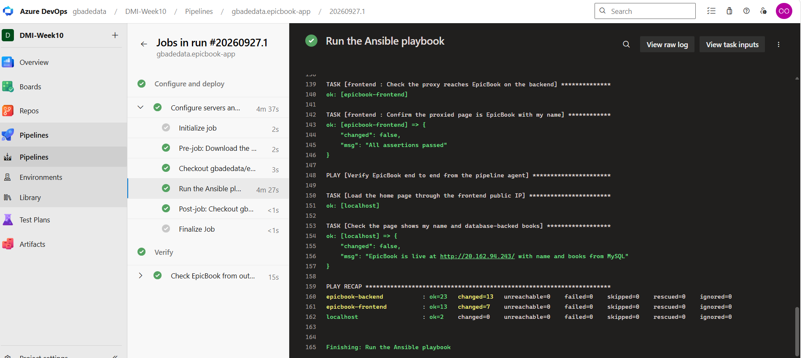
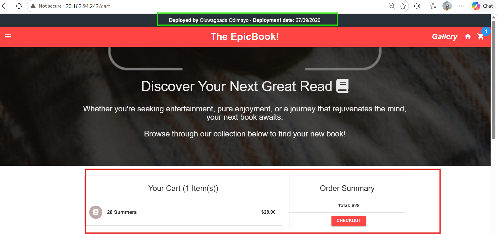

# Assignment 4 — Automate EpicBook Deployment with Dual Pipelines

Part of the DevOps Micro Internship (DMI) with Agentic AI

---

## Purpose

In this assignment, you will automate the EpicBook infrastructure and application deployment on Microsoft Azure using two repositories and two Azure DevOps pipelines. Terraform will provision the infrastructure, and Ansible will configure the servers, connect EpicBook to Azure Database for MySQL, and deploy the application through Nginx.

---

# Task 0 — Verify Accounts, Tools, and Pipeline Capacity

## Goal

Confirm that the required accounts, tools, pipeline agent, SSH key pair, and Terraform remote-state location are ready.

No submission screenshot is required for this task.

---

# Task 1 — Prepare the Two Repositories

## Goal

Create separate Infrastructure and Application Repositories for the EpicBook deployment.

No submission screenshot is required for this task.

---

# Task 2 — Configure Azure DevOps Connections, Secure Files, and Secrets

## Goal

Configure controlled pipeline access to GitHub, Microsoft Azure, the virtual machines, and Azure Database for MySQL.

No submission screenshot is required for this task.

> Do not expose the Azure Client Secret, SSH private key, MySQL password, access token, subscription ID, or another sensitive value.

---

# Task 3 — Author the Terraform Infrastructure Configuration

## Goal

Define the complete EpicBook Azure infrastructure using Terraform and an Azure Storage remote backend.

No submission screenshot is required for this task.

---

# Task 4 — Author and Run the Infrastructure Pipeline

## Goal

Validate, plan, approve, and apply the Terraform configuration through the Infrastructure Pipeline.

## Evidence

### Screenshot 1 — Successful Infrastructure Pipeline

Add a screenshot of the Infrastructure Pipeline run showing:

* Successful `terraform apply` completion
* `app_public_ip`
* `backend_ansible_host`
* `backend_private_ip`
* `mysql_fqdn`

*The Infrastructure Pipeline (`gbadedata.epicbook-infra`, run #20260927.1). The Apply stage ran only after my approval on the `epicbook-infra` environment, and applied the plan file saved by the Plan stage: `Apply complete! Resources: 18 added, 0 changed, 0 destroyed.` It then printed the four non-sensitive outputs: `app_public_ip`, `backend_ansible_host`, `backend_private_ip` and `mysql_fqdn`. The subscription ID in the resource IDs shows as `***`, because the pipeline registers it as a secret before Terraform runs.*

> Do not expose the MySQL password, Client Secret, Terraform state, SSH private key, or another sensitive value.

---

### Screenshot 2 — Provisioned Azure Resources

Add a screenshot of the Azure Portal Resource Group overview showing:

* Virtual Network and related networking resources
* Frontend VM
* Backend VM
* Azure Database for MySQL Flexible Server
* Related EpicBook resources

*Resource group `rg-oluwagbade-epicbook` (UK West): the virtual network `vnet-epicbook` with its NSGs, NICs and public IPs, the frontend and backend VMs with their disks, the MySQL Flexible Server `mysql-epicbook-oluwagbade`, the private DNS zone used for its private access, and the storage account `stepicbooka70995` that holds the Terraform state. The Essentials panel, which shows the subscription ID, is collapsed.*

> Hide sensitive IDs, credentials, and database details.

---

# Task 5 — Complete the Manual Terraform-to-Ansible Handoff

## Goal

Transfer the required non-sensitive Terraform outputs to the Application Repository for use by Ansible.

No submission screenshot is required for this task.

---

# Task 6 — Author the Ansible Application Configuration

## Goal

Create idempotent Ansible automation that configures the frontend and backend VMs, prepares the database, configures Nginx, and deploys EpicBook.

No submission screenshot is required for this task.

---

# Task 7 — Author and Run the Application Pipeline

## Goal

Run the Application Pipeline to configure the VMs, deploy EpicBook, and verify the application environment.

## Evidence

### Screenshot 3 — Successful Application Pipeline

Add a screenshot of the Application Pipeline run summary showing all required stages or jobs succeeded.

*The Application Pipeline (`gbadedata.epicbook-app`, run #20260927.1) with both stages succeeded: **Configure and deploy** runs the Ansible playbook, and **Verify** checks EpicBook from outside through the frontend public IP and confirms the backend's port 8080 cannot be reached from the internet.*

---

### Screenshot 4 — Successful Ansible Play Recap

Add a screenshot of the Application Pipeline log showing:

* Ansible play recap
* Successful configuration or verification
* Zero failed hosts
* Zero unreachable hosts

*The end of the Ansible run: the proxied page on the frontend passed its checks, the agent loaded EpicBook through the public IP ("EpicBook is live ... with name and books from MySQL"), and the PLAY RECAP shows `epicbook-backend` (ok=23), `epicbook-frontend` (ok=13) and `localhost` (ok=2), all with `unreachable=0` and `failed=0`.*

> Do not expose the SSH private key, MySQL password, Client Secret, or complete database connection string.

---

# Task 8 — Verify the Complete EpicBook Workflow

## Goal

Verify that the frontend, backend, and Azure Database for MySQL work together correctly.

## Evidence

### Screenshot 5 — Running EpicBook Application

Add a browser screenshot showing:

* Running EpicBook application
* Frontend public IP address in the browser address bar
* Your Full Name
* Deployment date

The screenshot may show a product, cart, or successful order view.

*EpicBook at `http://20.162.94.243/cart`, served through Nginx on the frontend VM. The banner shows my full name and the deployment date (27/09/2026), and the cart holds one book (28 Summers, $28.00) taken from the database. The row this created was confirmed in Azure Database for MySQL: `cart_rows` went from 0 before the click to 1, with one matching `Cartbook` link, and the catalogue holds 54 books.*

> Do not expose credentials or sensitive information.

---

# Required URLs

## Frontend Application URL

http://20.162.94.243

## Infrastructure Repository URL

https://github.com/gbadedata/epicbook-infra

## Application Repository URL

https://github.com/gbadedata/epicbook-app

---

# Two-Repository Model

Write a short explanation of why separate Infrastructure and Application Repositories were used.

I split the work the way a platform team and an application team usually do.

- **[`epicbook-infra`](https://github.com/gbadedata/epicbook-infra)** holds only the Terraform code and its pipeline. Infrastructure changes rarely and needs care, so its pipeline runs only when files under `terraform/` change, and Apply waits for a human approval.
- **[`epicbook-app`](https://github.com/gbadedata/epicbook-app)** holds the EpicBook code, the Ansible roles and their pipeline. It runs on every push to `main`, so the application can change often without touching or re-planning the infrastructure.

The split also keeps the security boundaries clear. Only the infrastructure pipeline uses the Azure service connection and reads the Terraform state. The application pipeline never has Azure credentials at all: it only has the VM SSH key and the database password. And code fixes stay with the team that owns the code: to make EpicBook verify TLS to Azure Database for MySQL, I changed `models/index.js` and `config/config.json` in the application repository, without touching the infrastructure.

---

# Manual Terraform-to-Ansible Handoff

Write a short explanation of how the following non-sensitive Terraform outputs were transferred to the Application Repository:

* `app_public_ip`
* `backend_ansible_host`
* `backend_private_ip`
* `mysql_fqdn`

The handoff is deliberately manual, so the two pipelines are not coupled.

1. The Apply stage of the infrastructure pipeline ends with `terraform output`, which prints the four values in the job log (Screenshot 1).
2. I copied them into two files in the application repository:
   - `ansible/inventory.ini`: `app_public_ip` (`20.162.94.243`) as the frontend host, and `backend_ansible_host` (`20.162.122.106`) as the backend host
   - `ansible/group_vars/all.yml`: `app_public_ip`, `backend_private_ip` (`10.40.2.4`, used by Nginx as its upstream) and `mysql_fqdn` (used by the backend to reach the database)
3. I committed the change to `main` (commit `d1d2110`, the version the application pipeline deployed in Screenshot 3).

Only these four non-sensitive values moved. The MySQL password never passes through Terraform outputs or Git: it lives only in a secret variable in the `epicbook` variable group, which the application pipeline maps into the environment for Ansible. The SSH private key comes from Azure DevOps Secure Files, and the application repository never reads the Terraform state.

---

# LinkedIn Requirement

## Evidence

### Screenshot 6 — LinkedIn Post

Add a screenshot of your LinkedIn post showing:

* Post text
* At least one image or link

Not published, by choice.

## LinkedIn Post URL

Not published, by choice.

Your post must include:

* What you automated
* Why separate Infrastructure and Application Repositories were used
* A brief explanation of the Terraform and Ansible pipelines
* How Azure credentials, the SSH key, and database secrets were protected
* One challenge you encountered
* How you solved the challenge
* Relevant technologies and skills

> Do not expose credentials, SSH keys, database passwords, subscription details, or other sensitive information.

---

# Submission Instructions

* Complete all tasks in sequence.
* Include your Full Name.
* Include a short explanation of the two-repository model.
* Include a short explanation of the manual Terraform-to-Ansible handoff.
* Include the Infrastructure Repository URL.
* Include the Application Repository URL.
* Include the final EpicBook application URL.
* Include Screenshots 1–6.
* Include the public LinkedIn post URL.
* Confirm that all screenshots are readable.
* Do not include Terraform state.
* Do not expose the Azure Client Secret, MySQL password, SSH private key, access token, complete connection string, subscription ID, tenant ID, account ID, or another sensitive value.
* Follow the Assignment Submission Guidelines.

---

# Completion Checklist

* [x] Two separate repositories were created
* [x] The Infrastructure Repository contains Terraform and its pipeline
* [x] The Application Repository contains EpicBook, Ansible, and its pipeline
* [x] Your Full Name and deployment date are visible in EpicBook
* [x] Both pipelines use the intended `main` branch
* [x] The Azure Resource Manager Service Connection works
* [x] The Azure Client Secret is not stored in Git or YAML
* [x] Terraform uses an Azure Storage remote backend
* [x] Terraform state was not published or committed
* [x] Separate frontend, backend, and database subnets were created
* [x] The frontend VM accepts public HTTP traffic on port 80
* [x] SSH access is restricted
* [x] The backend application port is not publicly accessible
* [x] Azure Database for MySQL uses private access
* [x] The Infrastructure Pipeline validates, plans, applies, and displays non-sensitive outputs
* [x] The reviewed Terraform plan was used during Apply
* [x] Approval or manual validation occurred before Apply
* [x] `app_public_ip` is available
* [x] `backend_ansible_host` is available
* [x] `backend_private_ip` is available
* [x] `mysql_fqdn` is available
* [x] Only non-sensitive Terraform outputs were transferred to the Application Repository
* [x] The SSH private key is stored in Azure DevOps Secure Files
* [x] The SSH private key was not committed or published
* [x] The MySQL password is stored as a secret pipeline variable
* [x] Ansible reaches both frontend and backend VMs
* [x] Ansible completes with zero failed and zero unreachable hosts
* [x] Nginx proxies requests to the backend private IP
* [x] EpicBook runs as a persistent service
* [x] The database schema and seed data are available
* [x] The application displays database-backed products
* [x] Cart or checkout actions are recorded in MySQL
* [x] The final application displays your Full Name and deployment date
* [x] Screenshots 1–6 are included and readable (Screenshot 6 is the LinkedIn post: not published, by choice)
* [x] The Infrastructure Repository URL is included
* [x] The Application Repository URL is included
* [x] The final EpicBook application URL is included
* [ ] The LinkedIn post is published (not published, by choice)
* [ ] The LinkedIn post URL is included (not published, by choice)
* [x] No secret or sensitive identifier is exposed

---

*This submission is part of the DevOps Micro Internship (DMI) — Agentic AI Track.*
