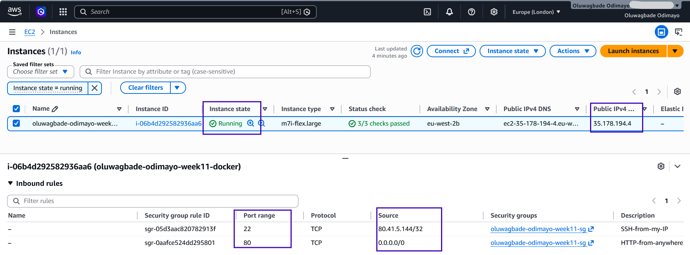
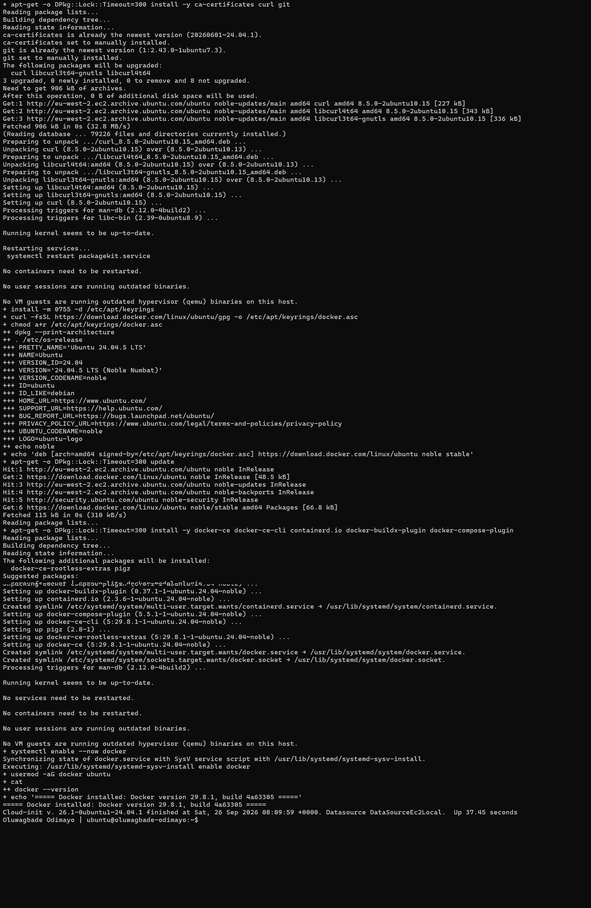
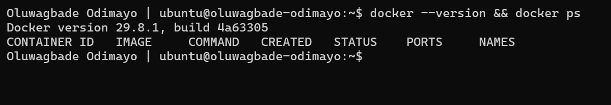
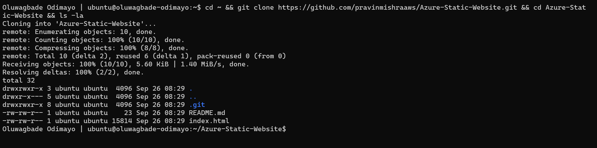
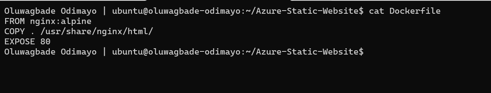
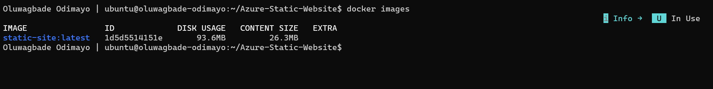
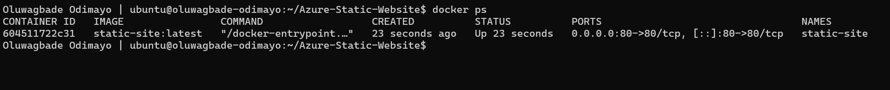
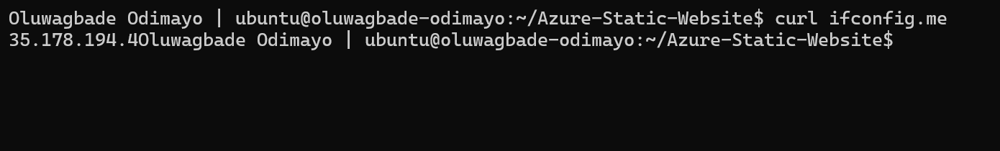
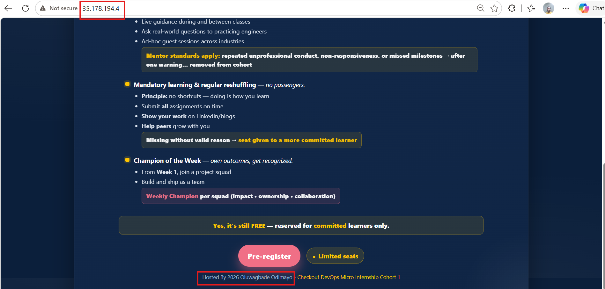

# Assignment 01 — Deploy a Static Website on a Cloud VM Using Docker

---

## Purpose

In this assignment, you will provision a cloud virtual machine on AWS or Azure, automate Docker installation using Cloud-Init, containerize a static website using Docker and Nginx, and deploy it so that it is accessible through the VM public IP address.

> Choose either AWS or Azure. You do not need to complete the assignment on both platforms.

---

# Task 1 — Provision the Cloud Virtual Machine

## Goal

Provision a Linux virtual machine with internet connectivity.

### Evidence

#### Screenshot 1 — Cloud VM Overview

Add a screenshot of the cloud console showing:

- Running VM
- Public IP address
- Security Group or Network Security Group inbound rules
- SSH port 22 enabled from your IP address
- HTTP port 80 enabled from Anywhere



---

# Task 2 — Configure Cloud-Init for Docker Installation

## Goal

Automatically install Docker during VM provisioning using Cloud-Init.

### Evidence

#### Screenshot 2 — Cloud-Init Docker Installation Log

Add a screenshot of the terminal showing the output of:

```bash
cat /var/log/cloud-init-output.log
```

The visible output must show Docker installation activity.



*Tail of `cat /var/log/cloud-init-output.log`: Docker packages installed from download.docker.com during provisioning, ending with the Docker version banner and cloud-init's finished line.*

---

# Task 3 — Verify Docker Installation

## Goal

Verify that Docker was installed successfully and that the Docker daemon is running.

### Evidence

#### Screenshot 3 — Docker Version and Running Docker Daemon

Add a screenshot of the terminal showing both:

```bash
docker --version
```

and

```bash
docker ps
```



---

# Task 4 — Clone the Application Repository

## Goal

Download the static website source code.

### Evidence

#### Screenshot 4 — Application Project Files

Add a screenshot of the terminal showing the contents of the `Azure-Static-Website` project directory after cloning the repository.



---

# Task 5 — Create a Dockerfile

## Goal

Containerize the static website using Nginx.

### Evidence

#### Screenshot 5 — Dockerfile Contents

Add a screenshot of the terminal showing the output of:

```bash
cat Dockerfile
```

The Dockerfile must use `nginx:alpine`, copy the website files to the Nginx web root, and expose port 80.



---

# Task 6 — Build the Docker Image

## Goal

Build a Docker image for the static website.

### Evidence

#### Screenshot 6 — Docker Image Verification

Add a screenshot of the terminal showing:

```bash
docker images
```

The output must include the `static-site` image with the `latest` tag.



---

# Task 7 — Deploy the Docker Container

## Goal

Run the containerized static website and map it to port 80 on the VM.

### Evidence

#### Screenshot 7 — Running Docker Container

Add a screenshot of the terminal showing:

```bash
docker ps
```

The output must show the running `static-site` container with the port mapping:

```text
0.0.0.0:80->80/tcp
```



---

# Task 8 — Verify the Deployment

## Goal

Verify that the static website is publicly accessible through the VM public IP address.

### Evidence

#### Screenshot 8 — VM Public IP Address

Add a screenshot of the terminal showing the output of:

```bash
curl ifconfig.me
```



---

#### Screenshot 9 — Deployed Static Website

Add a screenshot of the browser showing the deployed static website.

Ensure that the VM public IP address is visible in the browser address bar.



---

# Public Application URL

**VM Public IP / Application URL:** http://35.178.194.4

---

# LinkedIn Requirement

## Goal

Create a LinkedIn post describing what you deployed, the deployment process, and key learning outcomes.

### Evidence

**LinkedIn Post URL:** Not published, by choice.

#### LinkedIn Post Screenshot

Not published, by choice.

---

# Submission Instructions

- Complete all tasks in sequence.
- Include all required screenshots.
- Ensure that your full name is visible in all required screenshots.
- Do not expose passwords, private keys, access keys, tokens, account IDs, or other sensitive information.
- Follow the Assignment Submission Guidelines.

---

# Completion Checklist

- [x] Cloud VM provisioned successfully
- [x] Public IP enabled
- [x] SSH port 22 restricted to my IP address
- [x] HTTP port 80 enabled from Anywhere
- [x] Docker installed using Cloud-Init
- [x] Cloud-Init Docker installation log captured
- [x] Docker installation verified
- [x] Static website repository cloned
- [x] Dockerfile created and verified
- [x] Docker image built successfully
- [x] Docker container is running with port 80 mapped
- [x] Website is accessible through the VM public IP
- [x] All required screenshots included
- [x] Full name visible in required screenshots
- [x] No sensitive information exposed

---

## 📌 About DMI & CloudAdvisory

DevOps Micro Internship (DMI) is a project-based DevOps program run by Pravin Mishra (The CloudAdvisory) focused on real-world execution, systems thinking, and career readiness.

It helps learners build strong DevOps foundations with hands-on experience.

---

## 📌 Resources

- 🌐 DMI Official Website: https://dmi.pravinmishra.com?utm_source=github&utm_medium=readme  
- 🎓 University: https://university.pravinmishra.com?utm_source=github&utm_medium=readme  
- 💬 Discord Community: https://discord.pravinmishra.com?utm_source=github&utm_medium=readme  
- 📝 Blog: https://dmi.pravinmishra.com/blog?utm_source=github&utm_medium=readme  
- ▶️ YouTube Playlist: https://www.youtube.com/playlist?list=PLFeSNDtI4Cho  
- 🔗 Pravin Mishra (LinkedIn): https://www.linkedin.com/in/pravin-mishra-aws-trainer/  
- 🏢 CloudAdvisory (LinkedIn): https://www.linkedin.com/company/thecloudadvisory/

---

*This submission is part of DevOps Micro Internship (DMI) — Agentic AI Track.*
