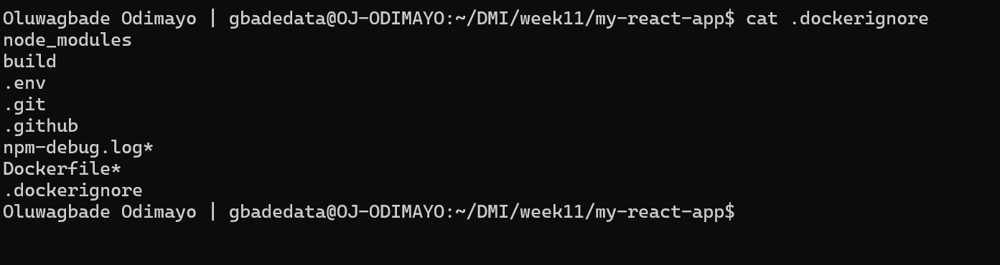
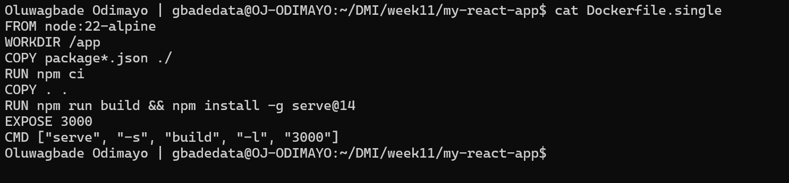
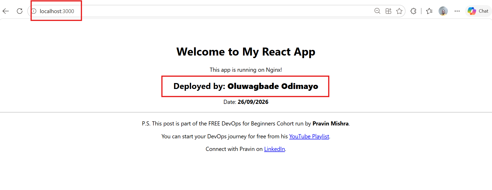
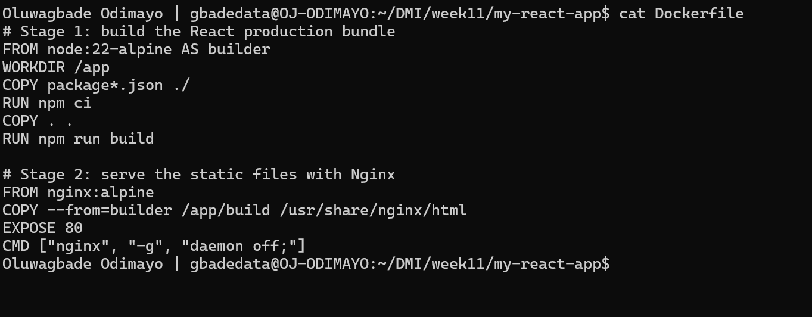
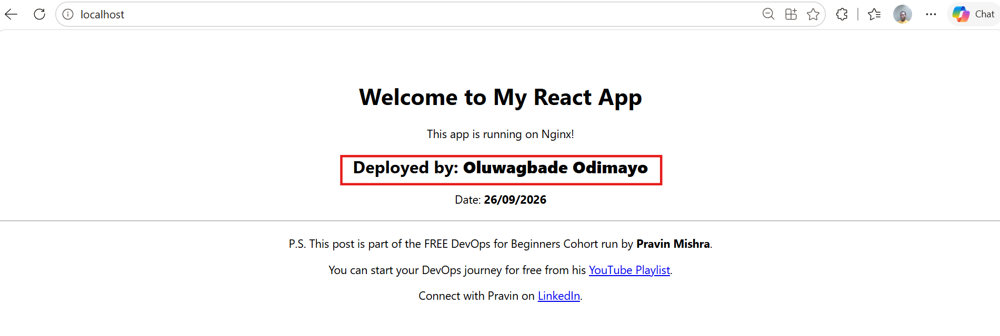
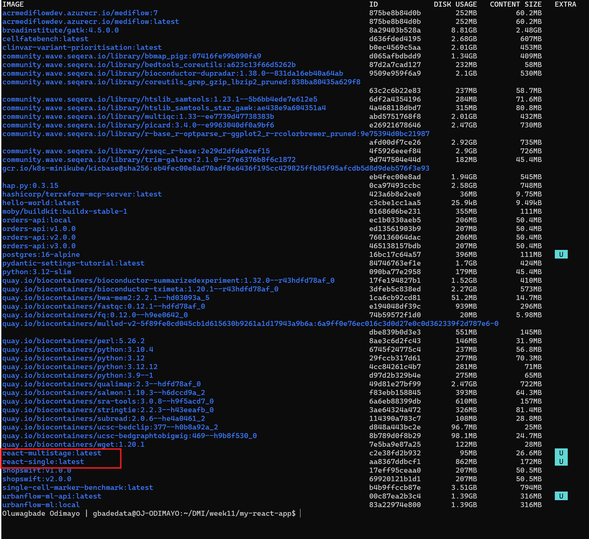

# Assignment 2 — Multi-Stage Docker Build for a React Application

Part of the DevOps Micro Internship (DMI) with Agentic AI

---

## Purpose

In this assignment, you will build both a single-stage and an optimized multi-stage Docker image for a React application, compare the resulting image sizes, and deploy the optimized version using a production-ready Nginx runtime container.

Complete this assignment locally on your own computer where Docker is installed and running.

---

# Task 1 — Prepare the Project

## Goal

Prepare the React application for Docker image creation.

### Evidence

#### Screenshot 1 — Contents of the `.dockerignore` File

Add a screenshot of the terminal showing:

```bash
cat .dockerignore
```

The file must exclude `node_modules`, `build`, and `.env`.



---

# Task 2 — Create a Single-Stage Docker Image

## Goal

Create a baseline single-stage Docker image and run the application on port 3000.

### Evidence

#### Screenshot 2 — Contents of `Dockerfile.single`

Add a screenshot showing the completed `Dockerfile.single`.



---

#### Screenshot 3 — Single-Stage Application in Browser

Add a screenshot of the browser showing the application at:

```text
http://localhost:3000
```

Ensure that your full name is visible in the application.



---

# Task 3 — Create a Multi-Stage Docker Build

## Goal

Create an optimized multi-stage Docker image with separate builder and Nginx runtime stages, then run the application on port 80.

### Evidence

#### Screenshot 4 — Contents of the Multi-Stage Dockerfile

Add a screenshot showing the completed multi-stage `Dockerfile`.



---

#### Screenshot 5 — Multi-Stage Application in Browser

Add a screenshot of the browser showing the application at:

```text
http://localhost
```

Ensure that your full name is visible in the application.



---

# Task 4 — Compare Docker Image Sizes

## Goal

Compare the single-stage and multi-stage image sizes and calculate the percentage reduction.

### Evidence

#### Screenshot 6 — Docker Image Size Comparison

Add a screenshot of the terminal showing:

```bash
docker images
```

The output must include both:

```text
react-single:latest
react-multistage:latest
```



---

### Percentage Reduction Calculation

Record the image sizes and calculate the reduction using the same unit for both images.

```text
Single-stage image size: 862 MB (react-single:latest, DISK USAGE column)

Multi-stage image size: 95 MB (react-multistage:latest, DISK USAGE column)

Percentage reduction =
((Single-stage image size − Multi-stage image size)
÷ Single-stage image size) × 100

((862 - 95) / 862) x 100 = 88.98%

Percentage reduction: 88.98%
```

---

# Task 5 — Analyze the Optimization Results

## Goal

Evaluate the advantages of using multi-stage Docker builds.

### Notes

Write a short analysis of 5–8 lines covering:

- The single-stage and multi-stage image sizes
- The percentage reduction in image size
- Security benefits of the smaller runtime image
- How a smaller runtime image reduces the attack surface
- How smaller images improve image pull and deployment speed
- One Docker build-caching optimization you used

The single-stage image (react-single:latest) is 862 MB on disk, and the multi-stage image (react-multistage:latest) is 95 MB, an 88.98% reduction.
Both builds start from the same node:22-alpine base, so the whole difference comes from what ships in the final image.
The single-stage image carries Node.js, npm and about 350 MB of node_modules into production just to serve a folder of static files, while the multi-stage runtime is nginx:alpine plus the compiled build/ output.
Every package left out of the runtime is one less place for a CVE to hide, and if the container were ever compromised there is no Node runtime or npm inside it for an attacker to use.
A smaller image also pulls faster onto a new host (26.6 MB compressed against 172 MB here), which speeds up deployments, rollbacks and scaling out.
For build caching, I copy package.json and package-lock.json and run npm ci before copying the source, so a code-only change reuses the cached dependency layer instead of reinstalling every package.

---

# Task 6 — Explore Additional Production Optimizations (Optional)

## Goal

Explore one or more additional production optimization techniques.

### Optional Work

You may choose to:

- Configure an Nginx health check
- Configure cache headers for static assets
- Experiment with a lighter runtime image
- Compare the resulting image size with your original multi-stage image

Screenshots are optional.

---

# LinkedIn Requirement

## Goal

Create a LinkedIn post describing what you built, what a multi-stage Docker build is, the image-size reduction achieved, and key learnings from the assignment.

### Evidence

#### LinkedIn Post URL

Paste your LinkedIn post URL here:

Not published, by choice.

---

#### LinkedIn Post Screenshot

Not published, by choice.

---

# Submission Instructions

- Complete all required tasks in sequence.
- Include Screenshots 1–6 exactly as specified.
- Include the percentage-reduction calculation and Task 5 analysis.
- Include the LinkedIn post URL and screenshot.
- Ensure that your full name is visible in all required screenshots.
- Do not expose passwords, keys, tokens, account IDs, or other sensitive information.

---

# Completion Checklist

- [x] Assignment completed locally
- [x] `.dockerignore` created and verified (Screenshot 1)
- [x] `Dockerfile.single` created (Screenshot 2)
- [x] Single-stage container verified in the browser (Screenshot 3)
- [x] Multi-stage `Dockerfile` created (Screenshot 4)
- [x] Multi-stage container verified in the browser (Screenshot 5)
- [x] Both Docker image sizes captured (Screenshot 6)
- [x] Percentage reduction calculated
- [x] Optimization analysis completed
- [ ] LinkedIn post URL and screenshot included (not published, by choice)
- [x] Full name visible in all required screenshots
- [x] No sensitive information exposed

---

## About DMI & CloudAdvisory

DevOps Micro Internship (DMI) is a project-based DevOps program run by Pravin Mishra (The CloudAdvisory), focused on real-world execution, systems thinking, and career readiness.

It helps learners build strong DevOps foundations through hands-on experience.

---

## 📌 About DMI & CloudAdvisory

DevOps Micro Internship (DMI) is a project-based DevOps program run by Pravin Mishra (The CloudAdvisory) focused on real-world execution, systems thinking, and career readiness.

It helps learners build strong DevOps foundations with hands-on experience.

---

## 📌 Resources

- 🌐 DMI Official Website: https://dmi.pravinmishra.com?utm_source=github&utm_medium=readme  
- 🎓 University: https://university.pravinmishra.com?utm_source=github&utm_medium=readme  
- 💬 Discord Community: https://discord.pravinmishra.com?utm_source=github&utm_medium=readme  
- 📝 Blog: https://dmi.pravinmishra.com/blog?utm_source=github&utm_medium=readme  
- ▶️ YouTube Playlist: https://www.youtube.com/playlist?list=PLFeSNDtI4Cho  
- 🔗 Pravin Mishra (LinkedIn): https://www.linkedin.com/in/pravin-mishra-aws-trainer/  
- 🏢 CloudAdvisory (LinkedIn): https://www.linkedin.com/company/thecloudadvisory/

---

*This submission is part of DevOps Micro Internship (DMI) — Agentic AI Track.*
