# Assignment 4 — Docker Volumes and Bind Mounts

Part of the DevOps Micro Internship (DMI) with Agentic AI

---

## Purpose

In this assignment, you will use Docker Bind Mounts and Docker Volumes to persist logs and application data outside a container’s lifecycle. You will verify that data remains available after containers are removed and recreated.

---

# Task 1 — Persist Nginx Logs Using a Bind Mount

## Goal

Deploy an Nginx container with a Bind Mount and verify that its log files remain on the VM host after the container is removed.

### Evidence

#### Screenshot 1 — Nginx Image Pull

Add a screenshot of the terminal showing successful completion of:

```bash
docker pull nginx:alpine
```

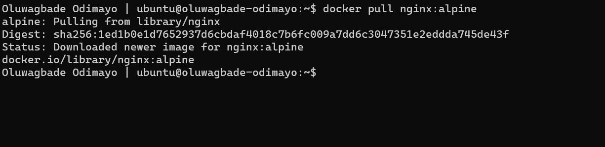

---

#### Screenshot 2 — Host Log Directory

Add a screenshot of the terminal showing the created host directory:

```text
$HOME/nginx-logs
```

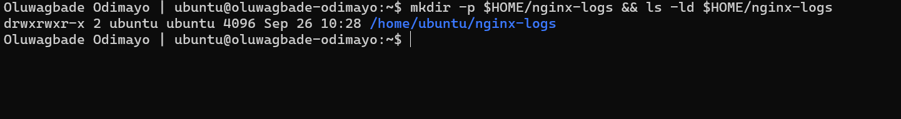

---

#### Screenshot 3 — Running Nginx Container with Port Mapping

Add a screenshot of the terminal showing:

```bash
docker ps
```

The output must show the `myweb` container with:

```text
0.0.0.0:80->80/tcp
```

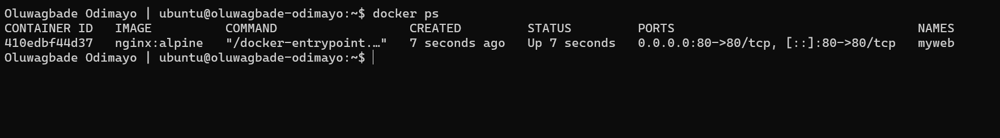

---

#### Screenshot 4 — Nginx Welcome Page

Add a browser screenshot showing the Nginx Welcome Page at:

```text
http://<YOUR-VM-PUBLIC-IP>
```

Ensure that the VM public IP is visible in the address bar. Add your full name as a clear caption directly below the screenshot.

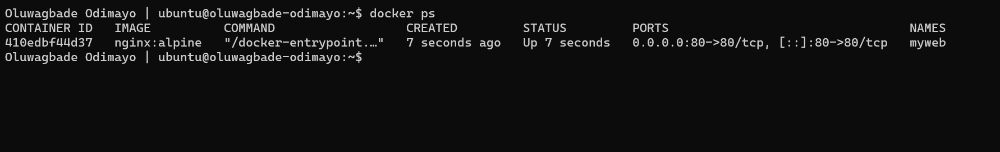

*Oluwagbade Odimayo*

---

#### Screenshot 5 — Bind-Mounted Log Files

Add a screenshot of the terminal showing the host log files and access-log content from:

```text
$HOME/nginx-logs
```

The output must show `access.log`, `error.log`, and an access-log entry created when you opened the Nginx page.

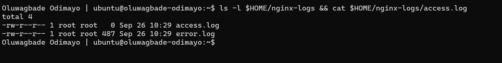

---

#### Screenshot 6 — Nginx Container Removed

Add a screenshot of the terminal showing successful completion of:

```bash
docker stop myweb
docker rm myweb
```

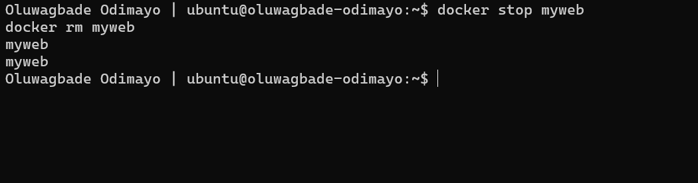

---

#### Screenshot 7 — Logs Persist After Container Removal

Add a screenshot of the terminal showing that `access.log` and `error.log` still exist in:

```text
$HOME/nginx-logs
```

The access log must retain its content after the container has been removed.

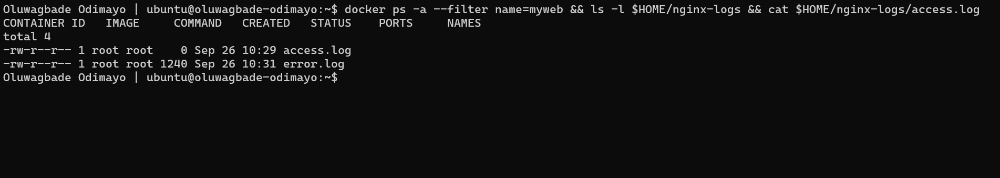

---

# Task 2 — Share Persistent Data Using a Docker Volume

## Goal

Deploy backend and frontend containers that share data through a named Docker Volume. Verify that the data remains after both containers are removed and recreated.

### Evidence

#### Screenshot 8 — Project File Structure

Add a screenshot of the terminal showing the `two-tier-app` project structure, including separate `backend` and `frontend` directories with a `Dockerfile` and `index.js` file in each.

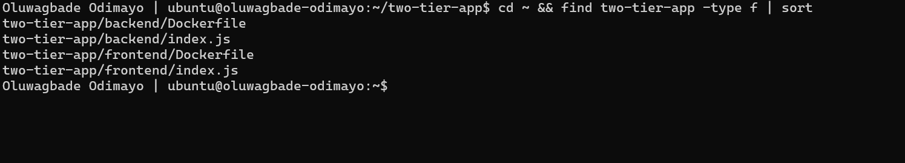

---

#### Screenshot 9 — Custom Docker Network

Add a screenshot of the terminal showing `mynetwork` in:

```bash
docker network ls
```

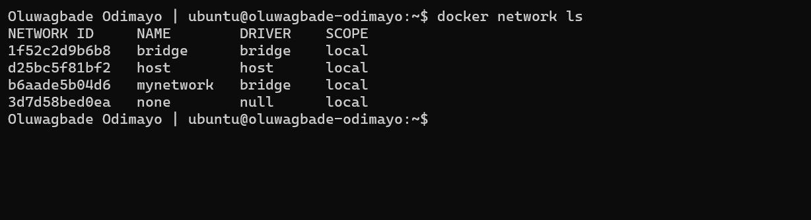

---

#### Screenshot 10 — Docker Volume

Add a screenshot of the terminal showing `shared-data` in:

```bash
docker volume ls
```

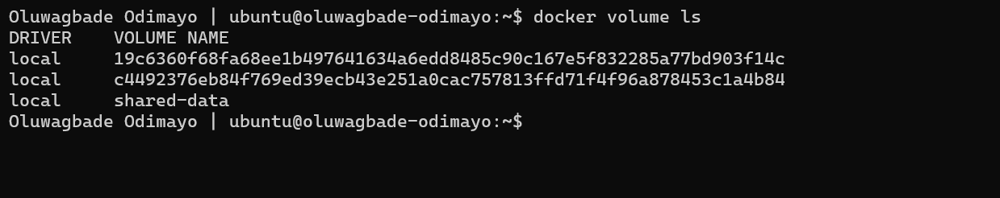

---

#### Screenshot 11 — Backend Dockerfile

Add a screenshot of the terminal showing the completed backend `Dockerfile`.

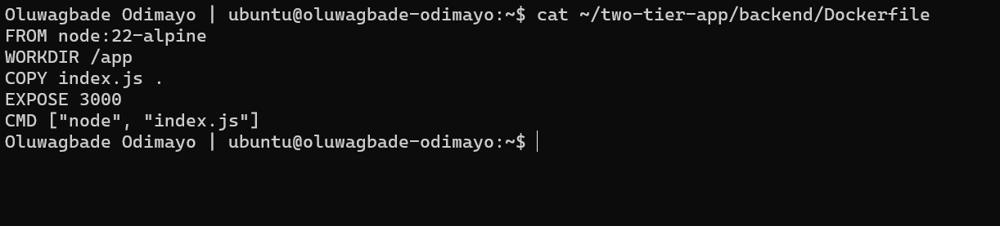

---

#### Screenshot 12 — Backend Image Build

Add a screenshot of the terminal showing successful completion of the `backend-app:latest` image build.

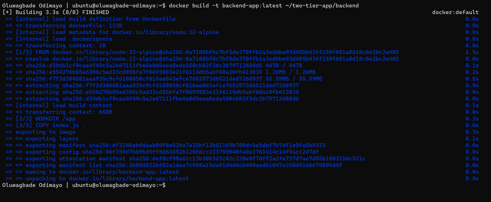

---

#### Screenshot 13 — Running Backend Container

Add a screenshot of the terminal showing:

```bash
docker ps
```

The output must show the running `backend` container.

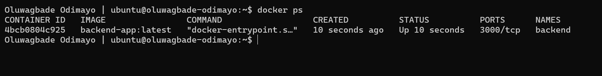

---

#### Screenshot 14 — Frontend Dockerfile

Add a screenshot of the terminal showing the completed frontend `Dockerfile`.

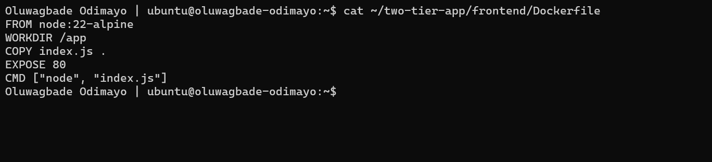

---

#### Screenshot 15 — Frontend Image Build

Add a screenshot of the terminal showing successful completion of the `frontend-app:latest` image build.

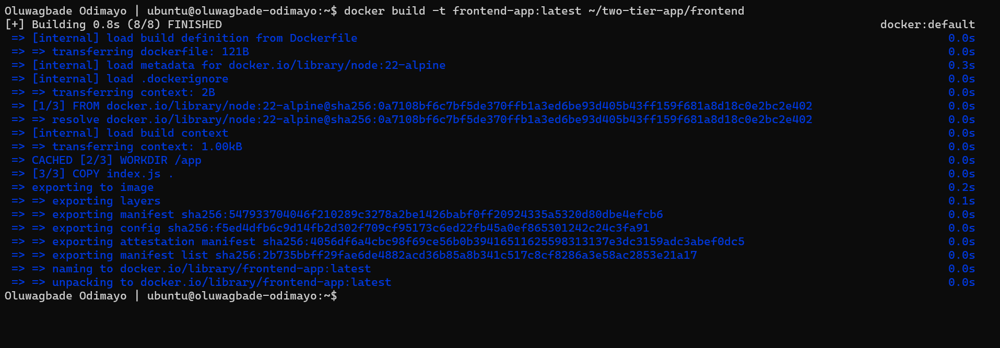

---

#### Screenshot 16 — Running Backend and Frontend Containers

Add a screenshot of the terminal showing:

```bash
docker ps
```

The output must show both `backend` and `frontend` containers running. Only `frontend` must have the published port mapping:

```text
0.0.0.0:80->80/tcp
```

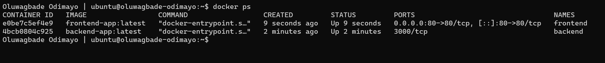

---

#### Screenshot 17 — Backend Write Operation

Add a screenshot of the terminal showing a successful backend write operation to the shared Docker Volume.

The output must include:

```text
Data written: Hello from Backend!
```

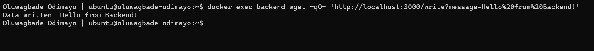

---

#### Screenshot 18 — Frontend Reads Shared Data

Add a browser screenshot showing:

```text
Hello from Backend!
```

Add your full name as a clear caption directly below the screenshot.

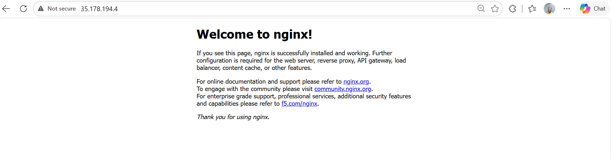

*Oluwagbade Odimayo*

---

#### Screenshot 19 — First Shared-Data Update

Add a browser screenshot showing:

```text
Test Data 1
```

Add your full name as a clear caption directly below the screenshot.

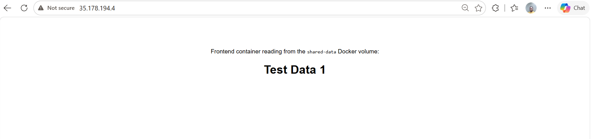

*Oluwagbade Odimayo*

---

#### Screenshot 20 — Second Shared-Data Update

Add a browser screenshot showing:

```text
Test Data 2 - New Update
```

Add your full name as a clear caption directly below the screenshot.

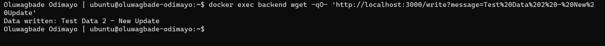

*Oluwagbade Odimayo*

---

#### Screenshot 21 — Container Removal and Recreation

Add a screenshot of the terminal showing the `frontend` and `backend` containers removed and recreated using the same `shared-data` Docker Volume.

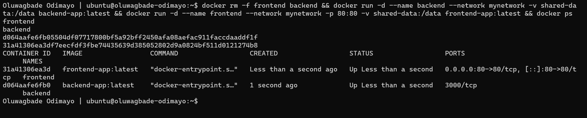

---

#### Screenshot 22 — Data Persists After Recreation

Add a browser screenshot showing:

```text
Test Data 2 - New Update
```

This proves that the `shared-data` Docker Volume outlived both application containers.

Add your full name as a clear caption directly below the screenshot.

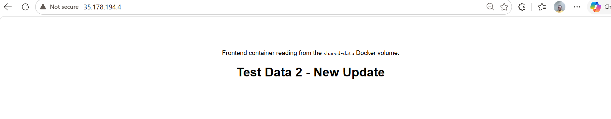

*Oluwagbade Odimayo*

---

# Storage Persistence Notes

Write a short explanation covering:

- The difference between a Bind Mount and a Docker Volume
- How Task 1 proved Bind Mount persistence
- How Task 2 proved Docker Volume persistence
- Why Docker Volumes are commonly used for application data

**Bind Mount vs Docker Volume.** A Bind Mount maps a specific directory on the host into the container, so I choose the path (`$HOME/nginx-logs`) and can read the files directly on the VM. A Docker Volume is storage that Docker creates and manages itself (`shared-data`); I refer to it by name and Docker decides where it lives on disk.

**How Task 1 proved Bind Mount persistence.** Nginx wrote `access.log` and `error.log` into `/var/log/nginx`, which was mounted from `$HOME/nginx-logs`, and my browser visit appeared in `access.log`. After `docker stop` and `docker rm`, the container was gone but both files and the logged request were still on the VM. In the stock `nginx:alpine` image those two log paths only point to the container's output stream, so the host directory mounted over them is what turned them into real files that outlive the container.

**How Task 2 proved Docker Volume persistence.** The backend wrote to `/data/message.txt` and the frontend read the same file, even though the two containers share nothing except the `shared-data` volume. Every update the backend made showed up on the next browser refresh. I then removed both containers and created new ones from the same images with no new write, and the page still showed `Test Data 2 - New Update`, so the data lived in the volume, not in either container.

**Why Docker Volumes are commonly used for application data.** Volumes are managed by Docker, so they do not depend on a particular folder layout on the host, can be listed, inspected and backed up with Docker commands, and can be shared by several containers at once. They are the normal choice for databases and other application data that has to survive container rebuilds and upgrades, while Bind Mounts suit cases like logs or config where I want direct access to the files on the host.

---

# Public Application URL

**Application URL:** http://35.178.194.4

---

# LinkedIn Requirement

## Goal

Create a LinkedIn post about Docker Volumes and Bind Mounts, including one difference between them, how you verified persistent storage, and your key learning outcomes.

### Evidence

#### LinkedIn Post URL

Paste your LinkedIn post URL here:

Not published, by choice.

---

#### LinkedIn Post Screenshot

Not published, by choice.

---

# Submission Instructions

- Complete all tasks in sequence.
- Include Screenshots 1–22 exactly as specified.
- Include the Storage Persistence Notes section.
- Include the public application URL.
- Include the LinkedIn post URL and screenshot.
- Ensure that your full name is visible in all terminal screenshots.
- Add your full name as a clear caption below every browser screenshot.
- Do not expose private keys, passwords, access keys, tokens, account IDs, or other sensitive information.

---

# Completion Checklist

- [x] Nginx image pulled successfully
- [x] Host log directory created
- [x] Bind Mount configured successfully
- [x] Nginx logs remain after container removal
- [x] Custom Docker network created
- [x] Docker Volume created
- [x] Backend Dockerfile and image created
- [x] Frontend Dockerfile and image created
- [x] Both containers mount `shared-data`
- [x] Backend writes data to the Docker Volume
- [x] Frontend reads the same data from the Docker Volume
- [x] Updated data appears after browser refresh
- [x] Data remains after frontend and backend containers are removed and recreated
- [x] All required screenshots included
- [x] Storage Persistence Notes completed
- [x] Public application URL included
- [ ] LinkedIn post URL and screenshot included (not published, by choice)
- [x] Full name visible in terminal screenshots
- [x] Browser screenshots have full-name captions
- [x] No sensitive information exposed

---

## 📌 About DMI & CloudAdvisory

DevOps Micro Internship (DMI) is a project-based DevOps program run by Pravin Mishra (The CloudAdvisory) focused on real-world execution, systems thinking, and career readiness.

It helps learners build strong DevOps foundations with hands-on experience.

---

## 📌 Resources

- 🌐 DMI Official Website: https://dmi.pravinmishra.com?utm_source=github&utm_medium=readme  
- 🎓 University: https://university.pravinmishra.com?utm_source=github&utm_medium=readme  
- 💬 Discord Community: https://discord.pravinmishra.com?utm_source=github&utm_medium=readme  
- 📝 Blog: https://dmi.pravinmishra.com/blog?utm_source=github&utm_medium=readme  
- ▶️ YouTube Playlist: https://www.youtube.com/playlist?list=PLFeSNDtI4Cho  
- 🔗 Pravin Mishra (LinkedIn): https://www.linkedin.com/in/pravin-mishra-aws-trainer/  
- 🏢 CloudAdvisory (LinkedIn): https://www.linkedin.com/company/thecloudadvisory/

---

*This submission is part of DevOps Micro Internship (DMI) — Agentic AI Track.*
