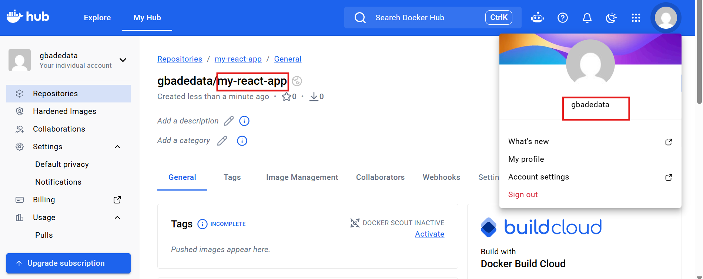
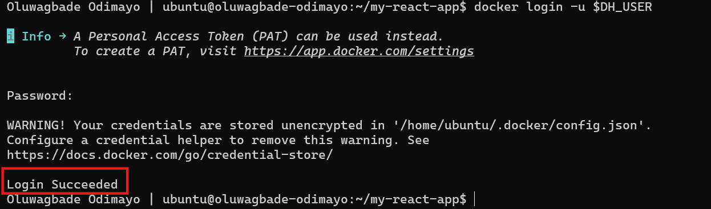
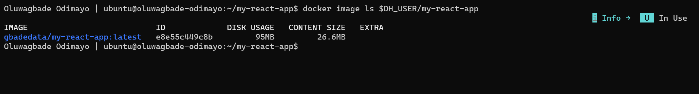
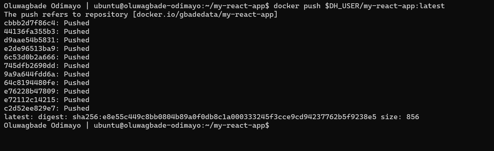
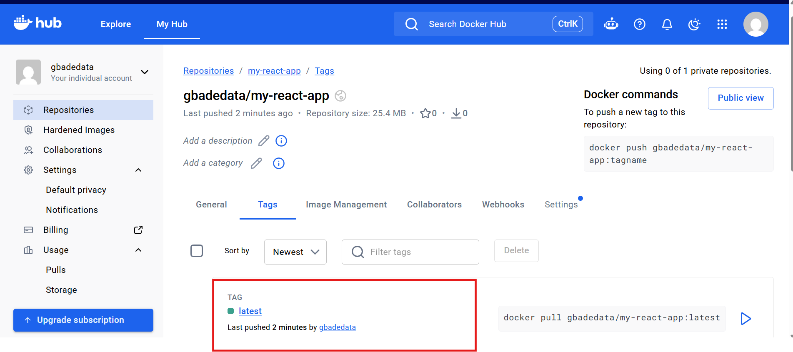
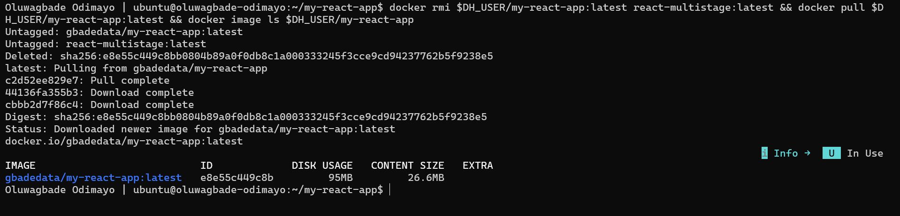
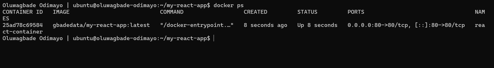
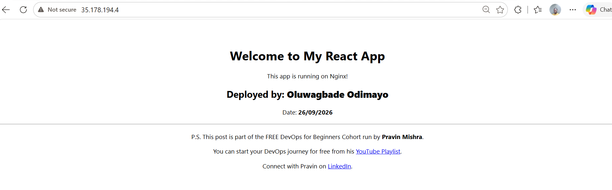

# Assignment 5 — Sharing the Docker Container on Docker Hub

Part of the DevOps Micro Internship (DMI) with Agentic AI

---

## Purpose

In this assignment, you will publish a Dockerized React application to Docker Hub, remove the local image tags, pull the image again from Docker Hub, and run it to verify that it can be downloaded and deployed from a container registry.

---

# Task 1 — Publish a Docker Image to Docker Hub

## Goal

Tag a locally built React image, publish it to Docker Hub, remove the local copy, pull it again from Docker Hub, and run it successfully.

### Evidence

#### Screenshot 1 — Public Docker Hub Repository

Add a screenshot of Docker Hub showing your newly created public repository:

```text
my-react-app
```



*Oluwagbade Odimayo*

---

#### Screenshot 2 — Successful Docker Login

Add a screenshot of the terminal showing:

```text
Login Succeeded
```

Ensure that your full name is visible and that no password, Personal Access Token, or device code is exposed.



---

#### Screenshot 3 — Correctly Tagged Image

Add a screenshot of the terminal showing:

```bash
docker image ls <YOUR_DOCKERHUB_USERNAME>/my-react-app
```

The output must show the `latest` tag.



---

#### Screenshot 4 — Successful Docker Push

Add a screenshot of the terminal showing successful completion of:

```bash
docker push <YOUR_DOCKERHUB_USERNAME>/my-react-app:latest
```

The output must include a pushed status or image digest.



---

#### Screenshot 5 — Published `latest` Tag in Docker Hub

Add a screenshot of your Docker Hub repository showing the uploaded `latest` image tag.



*Oluwagbade Odimayo*

---

#### Screenshot 6 — Local Image Removed and Pulled Again

Add a screenshot of the terminal showing:

- The targeted local image tags removed
- Successful `docker pull` output
- `docker image ls` showing the pulled image



---

#### Screenshot 7 — Running Pulled Image

Add a screenshot of the terminal showing:

```bash
docker ps
```

The output must show the running `react-container` with:

```text
0.0.0.0:80->80/tcp
```



---

#### Screenshot 8 — React Application in Browser

Add a browser screenshot showing the React application at:

```text
http://<YOUR-VM-PUBLIC-IP>
```

Ensure that the VM public IP is visible in the address bar. Add your full name as a clear caption directly below the screenshot.



*Oluwagbade Odimayo*

---

# Docker Hub Repository URL

**Repository URL:** https://hub.docker.com/r/gbadedata/my-react-app

---

# Registry and Image Tagging Notes

Write a short explanation covering:

- Why image tagging is required before pushing to Docker Hub
- Why a container registry is useful in DevOps workflows
- Why production deployments should use versioned image tags instead of relying only on `latest`

**Why image tagging is required before pushing.** Docker works out where to push from the image name itself. A local name like `react-multistage:latest` has no registry or account in it, so Docker would treat it as `docker.io/library/react-multistage`, the namespace reserved for official images, which I cannot push to. Tagging it as `gbadedata/my-react-app:latest` adds my Docker Hub account and repository to the name. The tag is only a second name for the same image ID, so nothing is copied or rebuilt.

**Why a container registry is useful in DevOps workflows.** A registry is the single place where a built image lives, so an image is built once and then pulled by any machine that needs to run it. In this assignment I deleted every local copy and the VM still pulled and ran the exact image I had pushed, which is the same pattern a CI pipeline uses: build and push once, then servers pull that image to deploy. Images are stored as layers, so a pull only downloads the layers a host does not already have.

**Why production should use versioned tags instead of only `latest`.** `latest` is just the default tag name, not a guarantee of the newest build, and it moves every time someone pushes. Two servers pulling `latest` at different times can end up running different code, and once `latest` has been overwritten there is no clean way to roll back to what was running before. Versioned tags such as `v1.0.0` or a Git commit SHA point at one specific build, so every environment runs a known version and a rollback is just redeploying the previous tag.

---

# LinkedIn Requirement

## Goal

Create a LinkedIn post about publishing a Docker container image to Docker Hub.

Include:

- Assignment title: **Publish a Docker Container Image to Docker Hub**
- Your Docker Hub repository URL
- What you published
- How you verified the remote image by pulling and running it
- Key learning outcomes

### Evidence

#### LinkedIn Post URL

Paste your LinkedIn post URL here:

Not published, by choice.

---

#### LinkedIn Post Screenshot

Not published, by choice.

---

# Submission Instructions

- Complete all steps in sequence.
- Include Screenshots 1–8 exactly as specified.
- Include your Docker Hub repository URL.
- Include the Registry and Image Tagging Notes.
- Include the LinkedIn post URL and screenshot.
- Ensure that your full name is visible in all terminal screenshots.
- Add your full name as a clear caption below the browser screenshot.
- Do not expose passwords, Personal Access Tokens, device codes, credentials, or other sensitive information.

---

# Completion Checklist

- [x] Public `my-react-app` repository created
- [x] Docker login completed successfully
- [x] `react-multistage:latest` tagged correctly
- [x] Image pushed to Docker Hub
- [x] `latest` tag verified in Docker Hub
- [x] Targeted local image tags removed
- [x] Image pulled again from Docker Hub
- [x] Pulled image runs successfully
- [x] React application is accessible through the VM public IP
- [x] Docker Hub repository URL included
- [x] Registry and image-tagging notes completed
- [ ] LinkedIn post URL and screenshot included (not published, by choice)
- [x] All required screenshots included
- [x] Full name visible in terminal screenshots
- [x] Browser screenshot has a full-name caption
- [x] No passwords, tokens, or credentials exposed
---

## 📌 About DMI & CloudAdvisory

DevOps Micro Internship (DMI) is a project-based DevOps program run by Pravin Mishra (The CloudAdvisory) focused on real-world execution, systems thinking, and career readiness.

It helps learners build strong DevOps foundations with hands-on experience.

---

## 📌 Resources

- 🌐 DMI Official Website: https://dmi.pravinmishra.com?utm_source=github&utm_medium=readme  
- 🎓 University: https://university.pravinmishra.com?utm_source=github&utm_medium=readme  
- 💬 Discord Community: https://discord.pravinmishra.com?utm_source=github&utm_medium=readme  
- 📝 Blog: https://dmi.pravinmishra.com/blog?utm_source=github&utm_medium=readme  
- ▶️ YouTube Playlist: https://www.youtube.com/playlist?list=PLFeSNDtI4Cho  
- 🔗 Pravin Mishra (LinkedIn): https://www.linkedin.com/in/pravin-mishra-aws-trainer/  
- 🏢 CloudAdvisory (LinkedIn): https://www.linkedin.com/company/thecloudadvisory/

---

*This submission is part of DevOps Micro Internship (DMI) — Agentic AI Track.*
