# Assignment 6 — Deploy the Book Review App with Docker Compose

Part of the DevOps Micro Internship (DMI) with Agentic AI

---

## Purpose

In this assignment, you will deploy the Book Review Application with Docker Compose using MySQL, a backend API, and a frontend user interface. You will configure health-gated startup, browser-facing API access, CORS, and persistent MySQL storage.

---

# Task 1 — Prepare the Project

## Goal

Prepare your fork of the Book Review App repository for Docker Compose deployment.

### Evidence

#### Screenshot 1 — Project Structure

Add a screenshot showing the project structure containing:

```text
frontend/
backend/
.env.example
.gitignore
docker-compose.yml
```

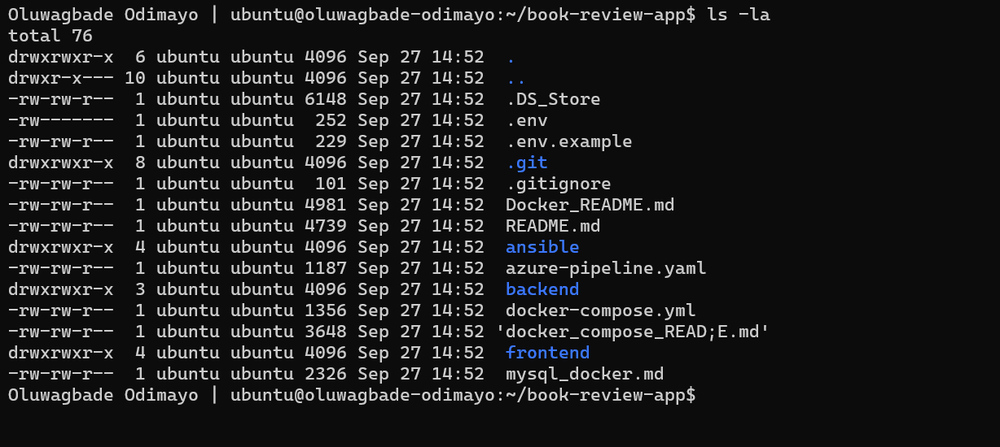

---

#### Screenshot 2 — Environment and Docker Ignore Files

Add a screenshot showing the contents of:

```text
.env.example
.gitignore
frontend/.dockerignore
backend/.dockerignore
```

Ensure that no real passwords, tokens, or secrets are visible.

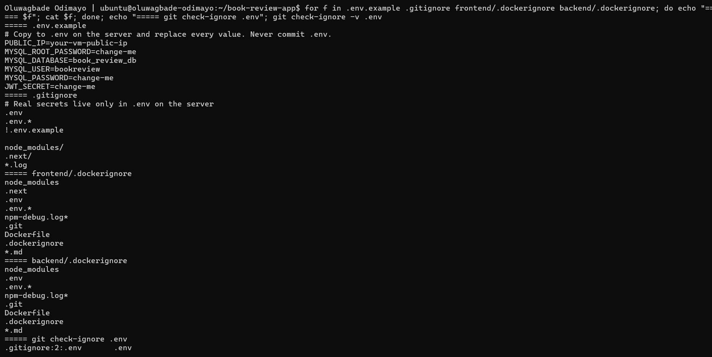

---

# Task 2 — Create or Confirm Application Dockerfiles

## Goal

Prepare Dockerfiles for the frontend and backend services and build both services through Docker Compose.

### Evidence

#### Screenshot 3 — Frontend Dockerfile

Add a screenshot showing the completed `frontend/Dockerfile`.

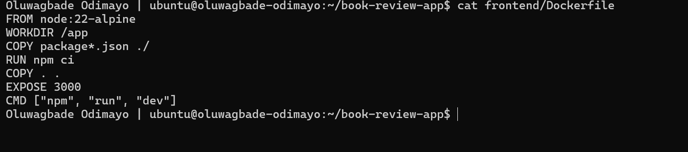

---

#### Screenshot 4 — Backend Dockerfile

Add a screenshot showing the completed `backend/Dockerfile`.

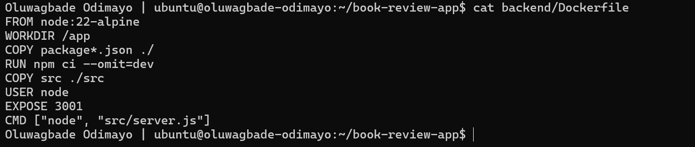

---

#### Screenshot 5 — Docker Compose Build

Add a screenshot of the terminal showing successful completion of:

```bash
docker compose build
```

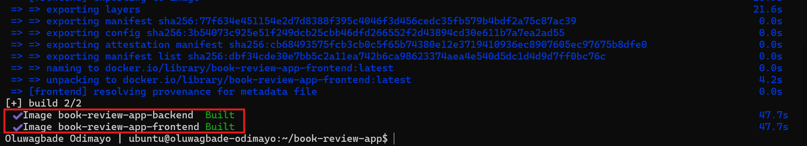

---

# Task 3 — Create the Docker Compose Stack

## Goal

Create one `docker-compose.yml` file that builds and runs MySQL, backend, and frontend services.

### Evidence

#### Screenshot 6 — MySQL Service, Health Check, and Volume Mount

Add a screenshot showing the MySQL service in `docker-compose.yml`, including:

- MySQL image
- Environment variables
- MySQL health check
- `mysql_data` volume mount
- No published MySQL port

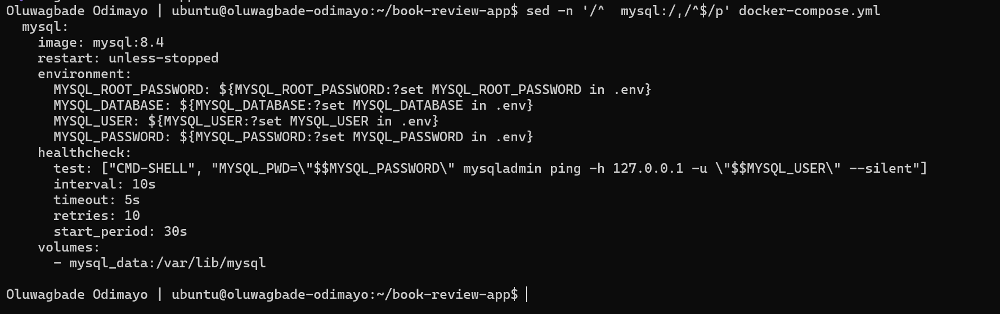

---

#### Screenshot 7 — Backend Configuration

Add a screenshot showing the backend service configuration, including:

- `depends_on` with `condition: service_healthy`
- Database host set to `mysql`
- Browser frontend origin configured for CORS
- Published backend port

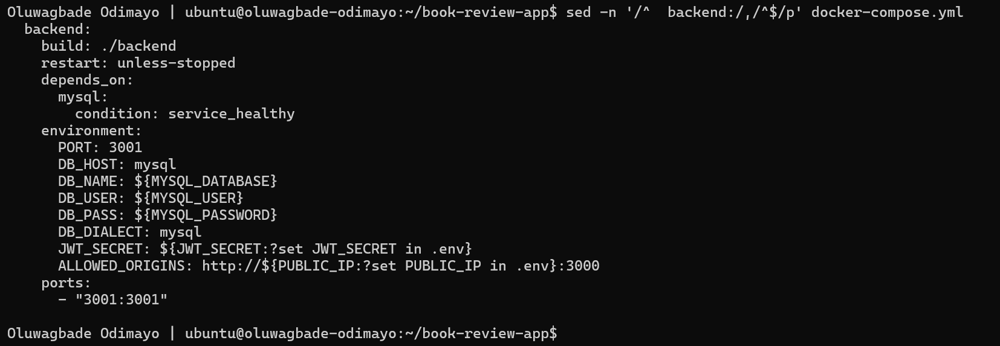

---

#### Screenshot 8 — Frontend Configuration

Add a screenshot showing the frontend service configuration, including:

- Published frontend port
- `depends_on` for the backend service
- Browser-facing `NEXT_PUBLIC_API_URL`

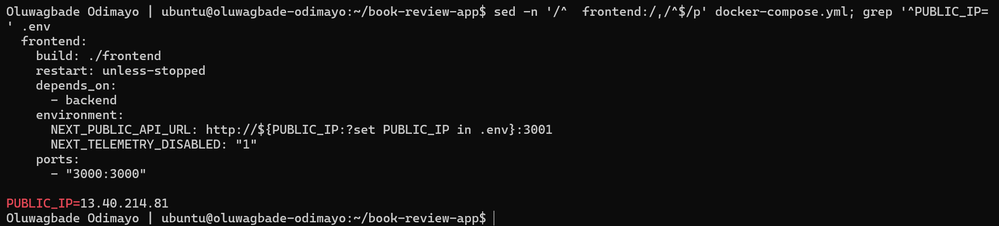

---

#### Screenshot 9 — Named Volume Definition

Add a screenshot showing the `mysql_data` volume definition in `docker-compose.yml`.

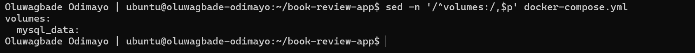

---

# Task 4 — Start and Verify the Stack

## Goal

Build and start all services through one Docker Compose workflow.

### Evidence

#### Screenshot 10 — Docker Compose Service Status

Add a screenshot of the terminal showing:

```bash
docker compose ps
```

The output must show the MySQL, backend, and frontend services running. MySQL must show as healthy.

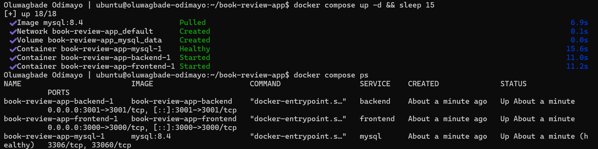

---

#### Screenshot 11 — MySQL and Backend Logs

Add a screenshot of the terminal showing:

```bash
docker compose logs mysql backend --tail=50
```

The logs must show MySQL readiness and successful backend database connection.

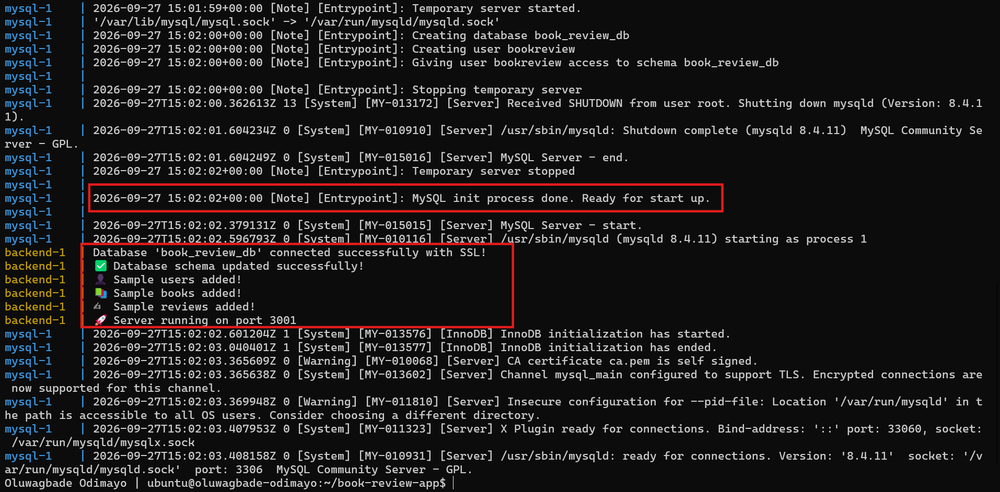

---

# Task 5 — Test End-to-End Application Functionality

## Goal

Verify that the Book Review App works through the browser.

### Evidence

#### Screenshot 12 — Successful Registration or Login

Add a browser screenshot showing successful user registration or login.

Add your full name as a clear caption directly below the screenshot.

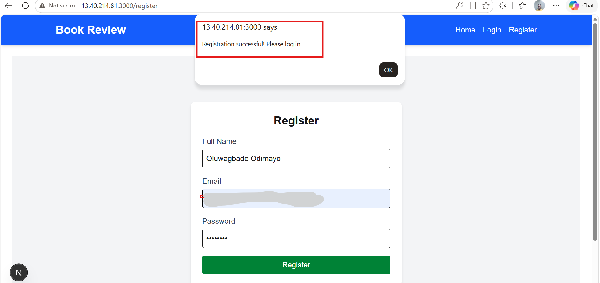

*Oluwagbade Odimayo*

---

#### Screenshot 13 — Created Book Review

Add a browser screenshot showing a created book review visible in the application.

Add your full name as a clear caption directly below the screenshot.

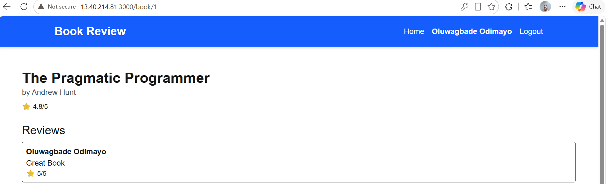

*Oluwagbade Odimayo*

---

#### Screenshot 14 — CORS Verification

Add a browser developer-tools screenshot with:

- The Network tab showing a successful API request
- The Console drawer showing no CORS error after the API interaction

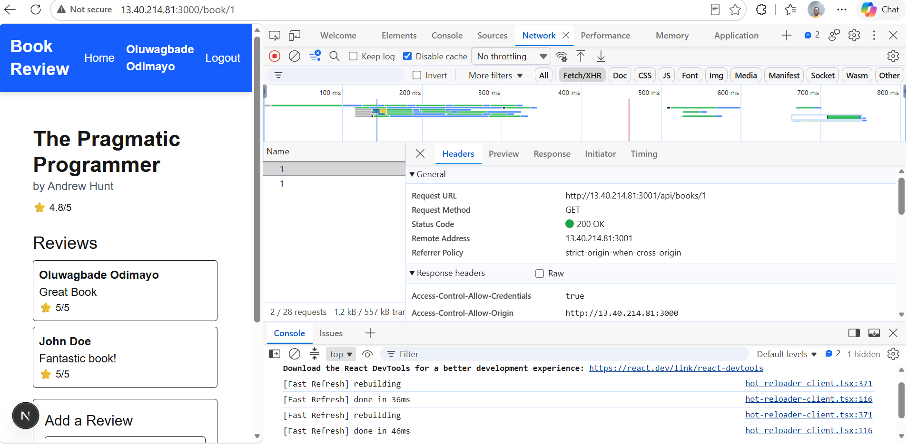

*Oluwagbade Odimayo*

---

# Task 6 — Prove MySQL Data Persistence

## Goal

Verify that MySQL data remains after a non-destructive Docker Compose down/up cycle.

### Evidence

#### Screenshot 15 — Data Before Restart

Add a browser screenshot showing the registered user or created review before the down/up cycle.

Add your full name as a clear caption directly below the screenshot.

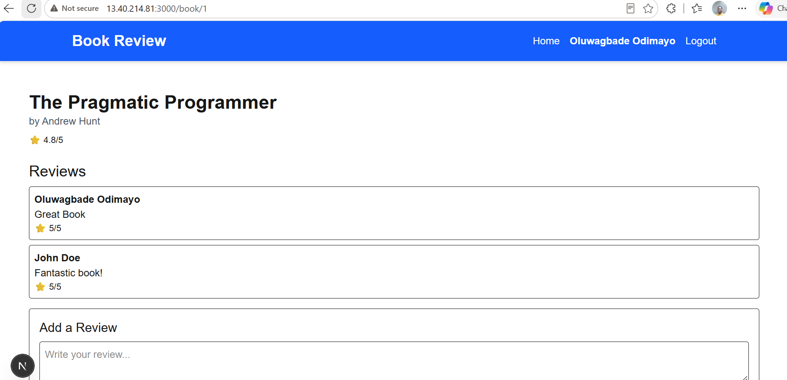

*Oluwagbade Odimayo*

---

#### Screenshot 16 — Non-Destructive Stack Restart

Add a screenshot of the terminal showing the non-destructive shutdown and restart:

```bash
docker compose down
docker compose up -d
docker compose ps
```

Do not use `docker compose down -v`.

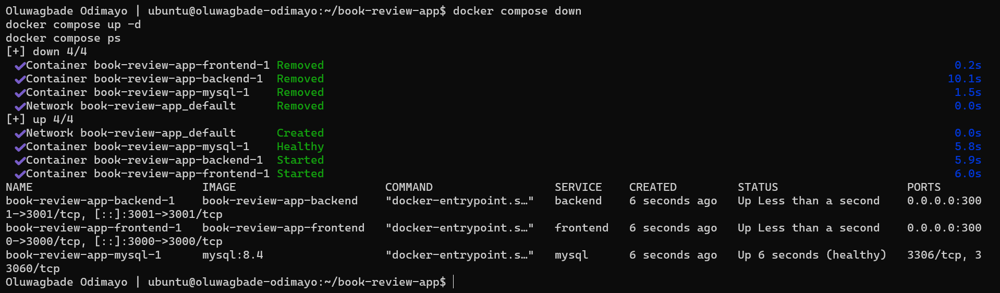

---

#### Screenshot 17 — Data After Restart

Add a browser screenshot showing the same registered user or review after the stack restarts.

Add your full name as a clear caption directly below the screenshot.

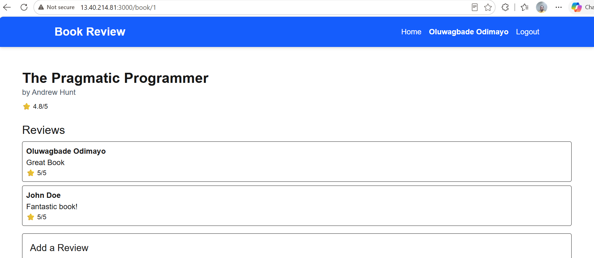

*Oluwagbade Odimayo*

---

# Task 7 — Explain Docker Compose Teardown Modes

## Goal

Explain the difference between preserving data and fully resetting a Docker Compose environment.

### Notes

Write a short explanation of 5–8 lines covering:

- What `docker compose down` removes and preserves
- Why named volumes should be kept when preserving MySQL data
- What happens when named volumes are removed
- When a full reset is useful
- Why a full reset must not be used before persistence evidence is captured

`docker compose down` stops and removes the stack's containers and its default network, but it leaves named volumes such as `mysql_data` in place, along with the built images.
Keeping `mysql_data` is what preserves the database: MySQL stores its files in that volume, so when `docker compose up -d` creates a new MySQL container it mounts the same volume and finds the users, books and reviews already there.
That is why my review was still on the book page after the down/up cycle in Screenshots 15 to 17.
`docker compose down -v` also deletes the named volumes, so the next start runs MySQL's first-time setup on an empty data directory and every registered user and review is gone.
A full reset is useful when I deliberately want a clean slate, for example to re-test first-run initialisation, to recover from a corrupted or half-initialised database, or when changed database credentials no longer match the existing data.
It must not be used before the persistence evidence is captured, because it destroys the very data that proves persistence, and there is no way to get it back without a backup.

---

# Final Public Frontend URL

**Frontend URL:** http://13.40.214.81:3000

Replace the placeholder with your working application URL.

---

# GitHub Repository URL

**Your Fork or Repository URL:** https://github.com/gbadedata/book-review-app

---

# LinkedIn Requirement

## Goal

Create a LinkedIn post about the Book Review App deployment and what you learned from using Docker Compose.

### Evidence

**LinkedIn Post URL:** Not published, by choice.

#### LinkedIn Post Screenshot

Not published, by choice.

---

# Submission Checklist

- [x] Book Review App repository forked and used
- [x] `.env` excluded from Git tracking
- [x] `.env.example` contains only safe placeholder values
- [x] Frontend and backend Dockerfiles created or confirmed
- [x] MySQL health check configured
- [x] Backend waits for healthy MySQL
- [x] Backend uses `mysql` as the database hostname
- [x] Frontend API URL uses the VM public IP and backend port
- [x] Backend CORS origin matches the frontend origin
- [x] MySQL port 3306 is not publicly exposed
- [x] Registration and login work
- [x] Book review creation works
- [x] Data persists after a non-destructive down/up cycle
- [x] Screenshots 1–17 included
- [x] Teardown explanation completed
- [x] Public frontend URL included
- [x] GitHub repository URL included
- [ ] LinkedIn post URL and screenshot included (not published, by choice)
- [x] Full name visible in required terminal screenshots
- [x] Browser screenshots include a full-name caption
- [x] No sensitive information exposed

---

## 📌 About DMI & CloudAdvisory

DevOps Micro Internship (DMI) is a project-based DevOps program run by Pravin Mishra (The CloudAdvisory) focused on real-world execution, systems thinking, and career readiness.

It helps learners build strong DevOps foundations with hands-on experience.

---

## 📌 Resources

- 🌐 DMI Official Website: https://dmi.pravinmishra.com?utm_source=github&utm_medium=readme  
- 🎓 University: https://university.pravinmishra.com?utm_source=github&utm_medium=readme  
- 💬 Discord Community: https://discord.pravinmishra.com?utm_source=github&utm_medium=readme  
- 📝 Blog: https://dmi.pravinmishra.com/blog?utm_source=github&utm_medium=readme  
- ▶️ YouTube Playlist: https://www.youtube.com/playlist?list=PLFeSNDtI4Cho  
- 🔗 Pravin Mishra (LinkedIn): https://www.linkedin.com/in/pravin-mishra-aws-trainer/  
- 🏢 CloudAdvisory (LinkedIn): https://www.linkedin.com/company/thecloudadvisory/

---

*This submission is part of DevOps Micro Internship (DMI) — Agentic AI Track.*
