# Assignment 7 — Capstone: Deploy a Production-Grade Stack for The EpicBook

Part of the DevOps Micro Internship (DMI) with Agentic AI

---

## Purpose

In this assignment, you will deploy the EpicBook application as a production-oriented Docker Compose stack on a cloud VM. You will use optimized container images, isolated networks, health checks, persistent MySQL storage, a selected reverse proxy, logging, backup and restore testing, and reliability procedures.

---

# Task 0 — App Discovery and Architecture

## Goal

Review the EpicBook repository and design the intended application architecture.

### Evidence

#### Screenshot 1 — EpicBook Project Structure

Add a terminal screenshot showing the EpicBook project structure after cloning the repository.

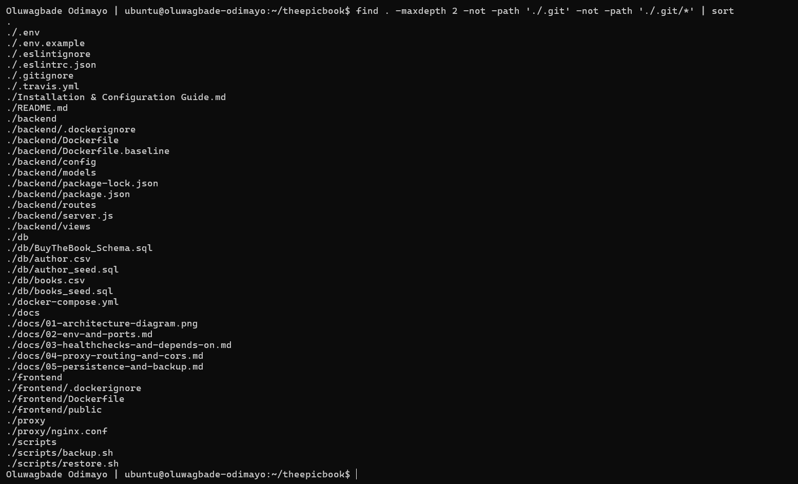

---

#### Screenshot 2 — Architecture Diagram

Add a screenshot of your architecture diagram showing:

- Public user
- Reverse proxy
- Frontend
- Backend
- Database
- Docker networks
- Public and private ports
- Persistent database storage

Add your full name inside the diagram or as a clear caption below it.

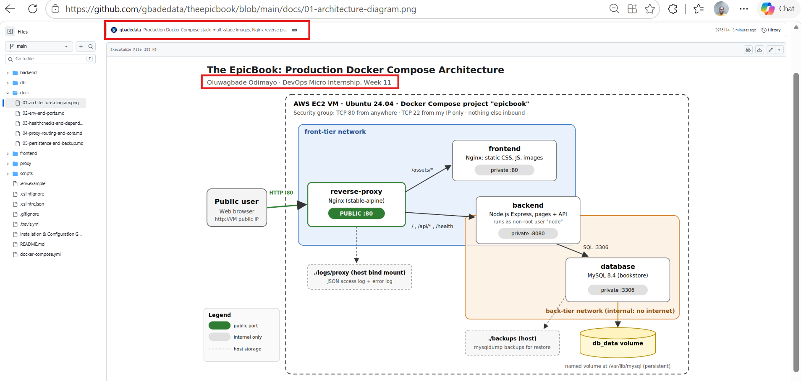

*Oluwagbade Odimayo*

---

#### Screenshot 3 — Environment Variables and Ports Document

Add a screenshot showing the contents of:

```text
docs/02-env-and-ports.md
```

It must document environment-variable names, internal ports, persistent-data details, and the health-check method. Do not expose real credentials or values.

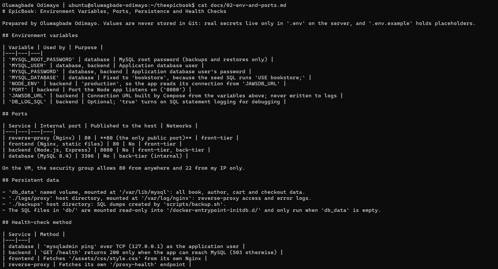

---

# Task 1 — Create Production Docker Images

## Goal

Create optimized production images for the EpicBook backend and frontend.

### Evidence

#### Screenshot 4 — Backend Dockerfile

Add a screenshot showing `backend/Dockerfile`, including:

- Dependency stage
- Minimal runtime stage
- Production startup command
- Internal backend port
- Non-root user configuration

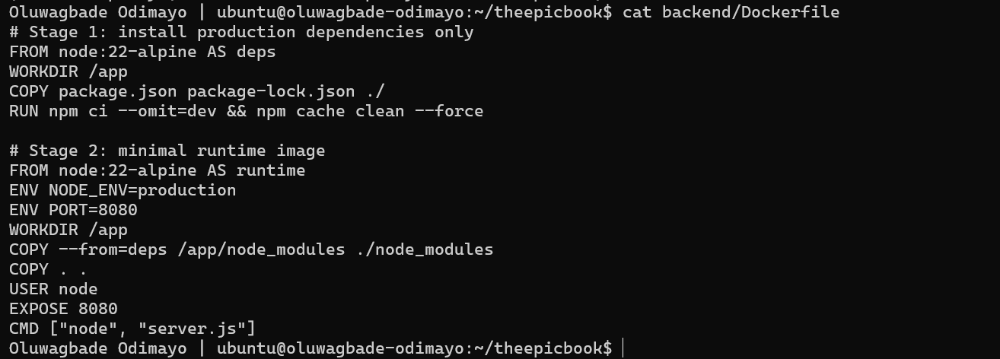

---

#### Screenshot 5 — Frontend Dockerfile

Add a screenshot showing `frontend/Dockerfile`, including:

- Nginx runtime image
- Static frontend files copied to the Nginx web root

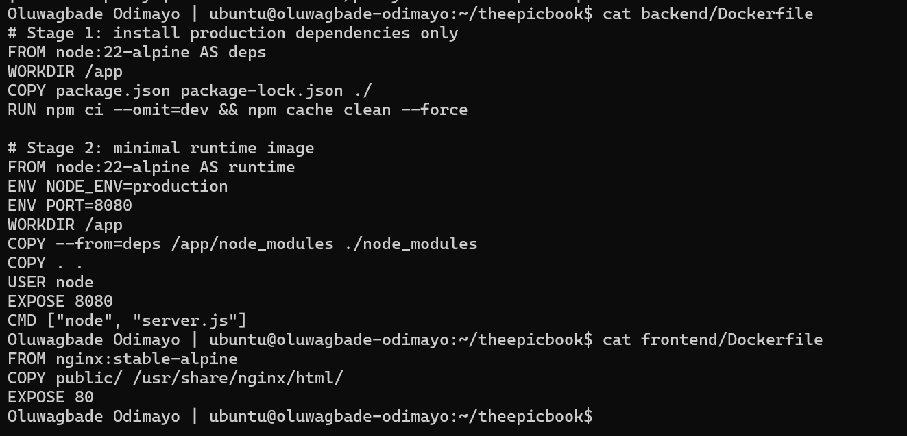

---

#### Screenshot 6 — Docker Ignore Files

Add a screenshot showing both:

```text
backend/.dockerignore
frontend/.dockerignore
```

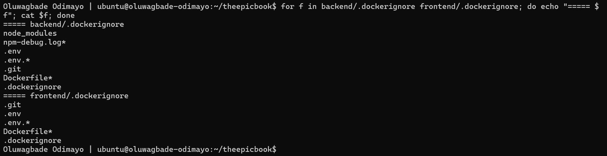

---

#### Screenshot 7 — Docker Image Builds and Size Comparison

Add a terminal screenshot showing successful builds of:

- Baseline backend image
- Optimized backend image
- Frontend image

The screenshot must also show the baseline and optimized backend image-size comparison.

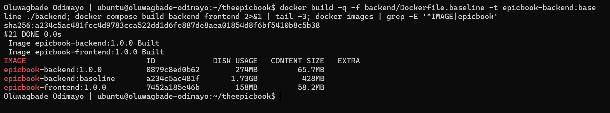

---

#### Screenshot 8 — Backend Running as Non-Root User

Add a terminal screenshot showing the optimized backend container running as a non-root user.

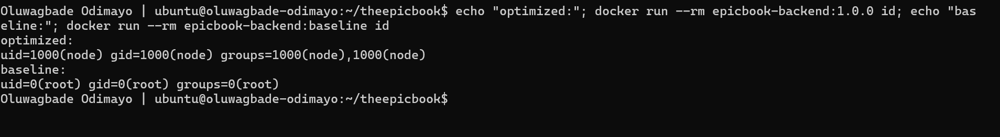

---

### Notes

Write a short note covering:

- Baseline and optimized backend image sizes
- The image-size reduction achieved
- One Docker layer-caching optimization used
- The security benefit of running the backend as a non-root user

- **Baseline backend image** (`epicbook-backend:baseline`, single stage on the full Debian `node:22` image): 1.73 GB on disk, 428 MB compressed content.
- **Optimized backend image** (`epicbook-backend:1.0.0`, multi-stage on `node:22-alpine`): 274 MB on disk, 65.7 MB compressed content.
- **Reduction:** 84.16% on disk ((1730 - 274) / 1730 x 100) and 84.65% in compressed size. EpicBook has no build step, so most of the saving comes from the Alpine base image and from shipping only production dependencies (`npm ci --omit=dev`) rather than from discarding build tools.
- **Layer caching:** `package.json` and `package-lock.json` are copied and `npm ci` runs before the application source is copied, so a code-only change reuses the cached dependency layer instead of reinstalling every package.
- **Non-root user:** the optimized backend runs as the built-in `node` user (uid 1000), while the baseline runs as root (uid 0), as Screenshot 8 shows. If the app were ever exploited, the attacker would get an unprivileged user that cannot install packages or change the application files, which are owned by root, so the damage is contained and escaping the container is much harder.

---

# Task 2 — Create the Docker Compose Stack and Networks

## Goal

Create one Docker Compose stack containing the reverse proxy, frontend, backend, and MySQL database.

### Evidence

#### Screenshot 9 — Docker Compose Services

Add a screenshot showing `docker-compose.yml` with all four services:

```text
reverse-proxy
frontend
backend
database
```

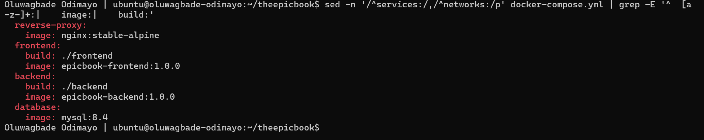

---

#### Screenshot 10 — Networks and Named Volume

Add a screenshot showing:

- `front-tier` network
- `back-tier` network
- `db_data` named volume

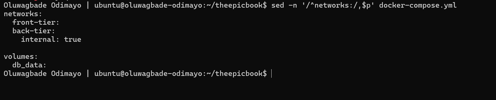

---

#### Screenshot 11 — Docker Compose Validation

Add a terminal screenshot showing successful Docker Compose validation without exposing environment-variable values or secrets.

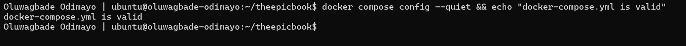

---

# Task 3 — Configure Health Checks and Startup Dependencies

## Goal

Configure health checks and ensure services start only after their dependencies are healthy.

### Evidence

#### Screenshot 12 — Backend Health Endpoint

Add a screenshot showing the backend application configuration for the `/health` endpoint.

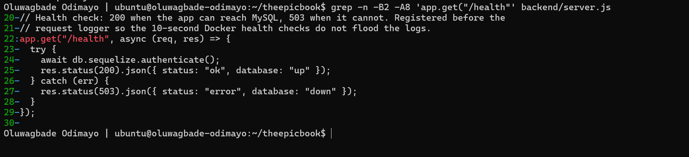

---

#### Screenshot 13 — MySQL and Backend Health Checks

Add a screenshot showing `docker-compose.yml` with health checks for MySQL and the backend.

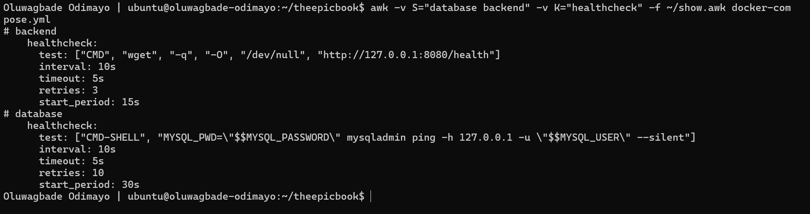

---

#### Screenshot 14 — Frontend and Reverse-Proxy Health Checks

Add a screenshot showing:

- Frontend health check
- Reverse-proxy health check
- `depends_on` conditions using `service_healthy`

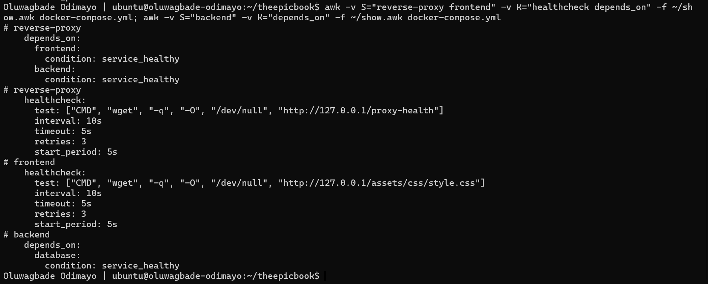

---

#### Screenshot 15 — Running Healthy Services

Add a terminal screenshot showing Docker Compose service status. The database, backend, frontend, and reverse proxy must be running successfully.

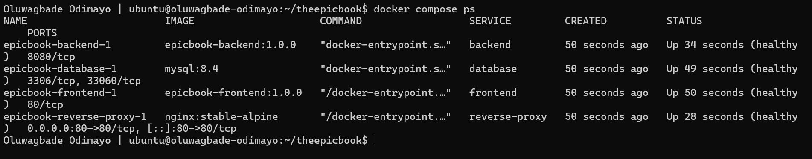

---

#### Screenshot 16 — Public Health Endpoint

Add a terminal screenshot showing a successful response from the public application health endpoint through the reverse proxy.

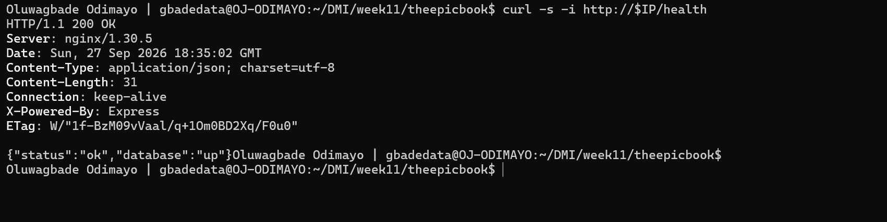

---

#### Screenshot 17 — Health-Check and Startup-Order Document

Add a screenshot showing the contents of:

```text
docs/03-healthchecks-and-depends-on.md
```

Explain the health-check method for each service and the startup dependency order.

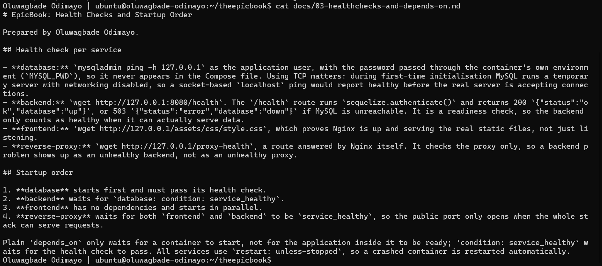

---

# Task 4 — Configure the Reverse Proxy and Same-Origin Routing

## Goal

Use either Nginx or Traefik as the only public entry point for the EpicBook application.

### Evidence

#### Screenshot 18 — Selected Reverse-Proxy Configuration

Add a screenshot showing the configuration for your selected reverse proxy.

It must show routes for:

- Static frontend assets
- Application pages
- API requests
- Health endpoint

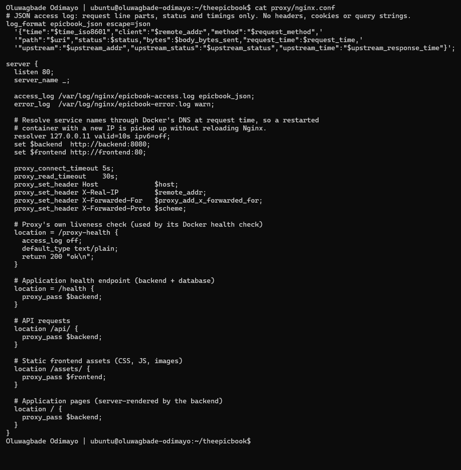

---

#### Screenshot 19 — Only Reverse Proxy Publishes Port 80

Add a screenshot of `docker-compose.yml` showing that only the `reverse-proxy` service publishes port 80.

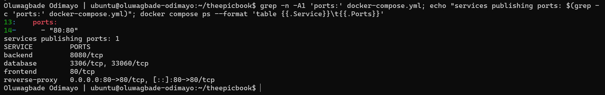

---

#### Screenshot 20 — Reverse-Proxy Route Testing

Add a terminal screenshot showing successful requests through the selected reverse proxy to:

- Application page
- One API endpoint
- One static asset
- Health endpoint

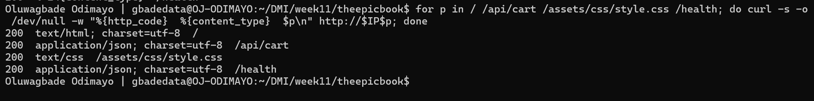

---

#### Screenshot 21 — EpicBook Application Through Public IP

Add a browser screenshot showing the EpicBook application loaded through the VM public IP address.

Add your full name as a clear caption below the screenshot.

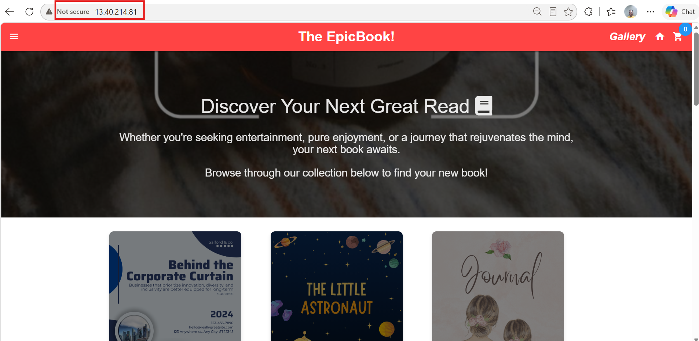

*Oluwagbade Odimayo*

---

#### Screenshot 22 — Proxy Routing and CORS Document

Add a screenshot showing the contents of:

```text
docs/04-proxy-routing-and-cors.md
```

Explain the proxy routes and state whether CORS was required and why.

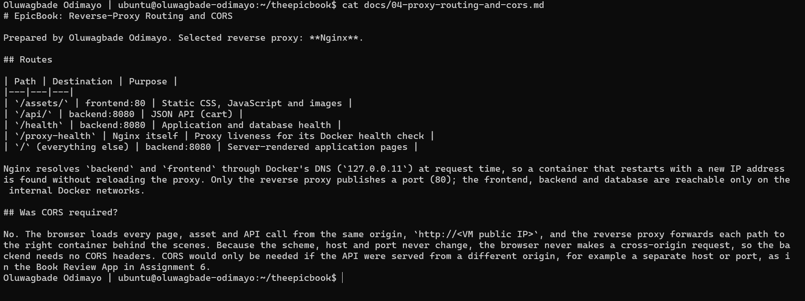

---

# Task 5 — Prove Data Persistence, Backup, and Restore

## Goal

Verify MySQL persistence and perform a controlled backup and restore drill.

### Evidence

#### Screenshot 23 — MySQL Volume Configuration

Add a terminal screenshot showing the `db_data` named volume and its MySQL mount configuration.

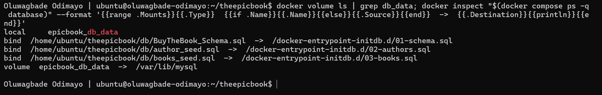

---

#### Screenshot 24 — Test Data Before Backup

Add a terminal screenshot showing the selected test data before the backup and restore drill.

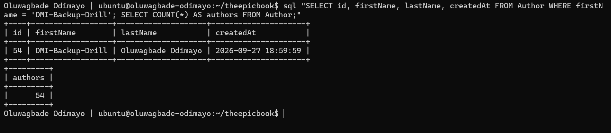

---

#### Screenshot 25 — Successful Backup Creation

Add a terminal screenshot showing successful backup creation and the backup file stored in the host backup directory.

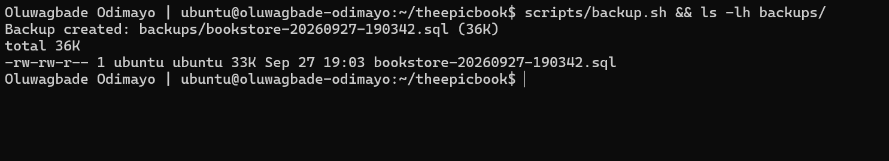

---

#### Screenshot 26 — Controlled Data-Loss Test

Add a terminal screenshot showing that the selected test record was removed during the controlled data-loss test.

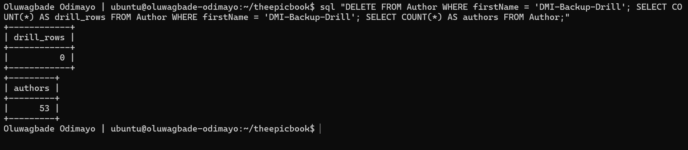

---

#### Screenshot 27 — Restore Verification

Add a terminal screenshot showing successful restore and verification that the deleted test record is available again.

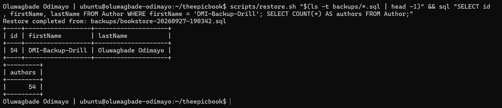

---

#### Screenshot 28 — Persistence After Down/Up Cycle

Add a terminal screenshot showing that database data remains available after a non-destructive Docker Compose down/up cycle.

Do not use `docker compose down -v`.

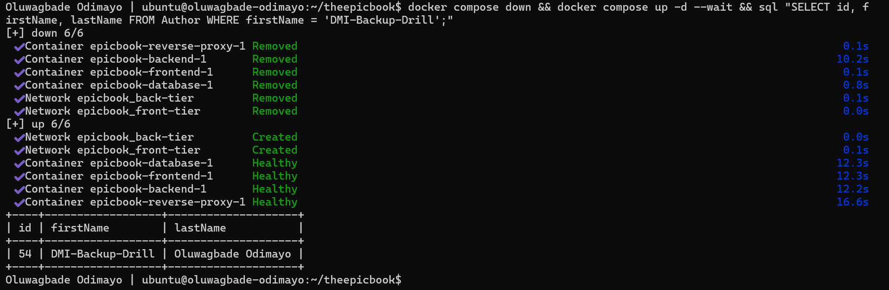

---

#### Screenshot 29 — Persistence and Backup Document

Add a screenshot showing the contents of:

```text
docs/05-persistence-and-backup.md
```

Include the backup plan and restore procedure.

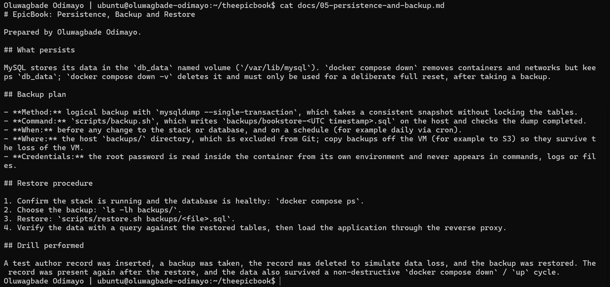

---

# Task 6 — Configure Logging and Observability

## Goal

Configure useful reverse-proxy and backend logs without exposing sensitive information.

### Evidence

#### Screenshot 30 — Logging Configuration

Add a screenshot showing:

- Configuration for the selected reverse proxy
- Proxy log format
- Docker Compose host log-directory bind mount

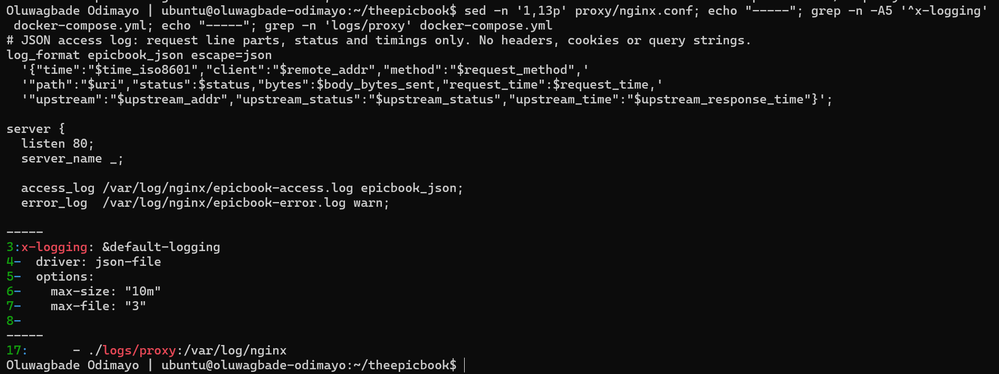

---

#### Screenshot 31 — Persistent Proxy Logs and Backend Logs

Add a terminal screenshot showing:

- Selected reverse-proxy logs available from the host directory after a proxy restart
- Backend logs displayed through Docker Compose

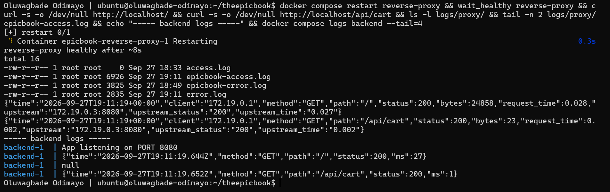

---

### Notes

Write a short note covering:

- The selected reverse proxy
- Host path used for reverse-proxy logs
- How backend logs are viewed
- Whether JSON or standard text logs were used
- Why passwords, tokens, headers, and database connection strings must not appear in logs

- **Selected reverse proxy:** Nginx (`nginx:stable-alpine`).
- **Host path for proxy logs:** `./logs/proxy` in the project directory on the VM (`/home/ubuntu/theepicbook/logs/proxy`), bind-mounted to `/var/log/nginx`. Nginx writes `epicbook-access.log` and `epicbook-error.log` there, so the logs survive proxy restarts and container recreation, as Screenshot 31 shows.
- **Backend logs:** viewed with `docker compose logs backend`. Every service uses the `json-file` logging driver with rotation at 10 MB and 3 files, so logs cannot fill the disk.
- **Log format:** JSON for both the proxy access log and the backend request log (one JSON object per request with method, path, status and timings), which makes them easy to filter and ship to a log platform. The Nginx error log uses Nginx's standard text format. I also switched off Sequelize's default SQL statement logging, which would otherwise print every query.
- **Why secrets must stay out of logs:** logs are copied, retained, forwarded to other systems and read by far more people than those who hold the credentials. A password, token, cookie, authorization header or database connection string in a log line would hand access to anyone who can read the logs, and it would outlive any rotation of the secret in backups and log archives. That is why the proxy logs the path without the query string and no headers, the backend logs only method, path, status and duration, and the `JAWSDB_URL` connection string is never printed.

---

# Task 7 — Deploy and Verify the Stack on a Cloud VM

## Goal

Deploy the completed Docker Compose stack on an AWS or Azure VM and verify public access.

### Evidence

#### Screenshot 32 — VM Public IP and Inbound Rules

Add a cloud-console screenshot showing:

- VM public IP address
- SSH port 22 restricted to your IP address
- HTTP port 80 allowed from Anywhere

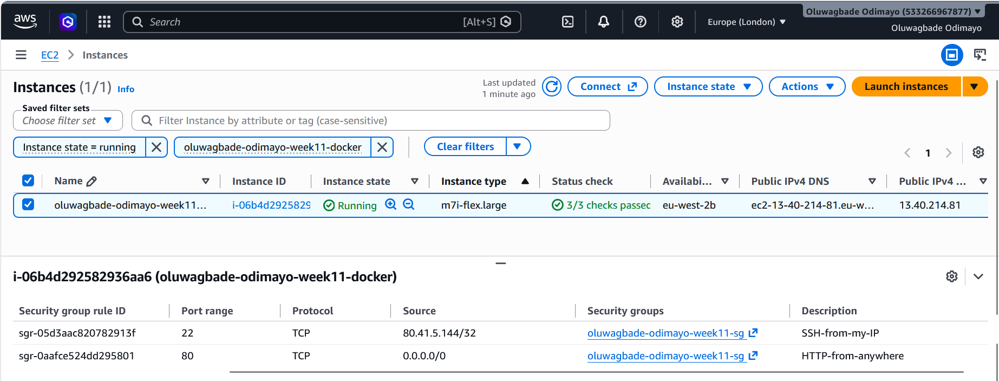

*Oluwagbade Odimayo*

---

#### Screenshot 33 — Cloud VM Stack Verification

Add a VM terminal screenshot showing:

- Docker Compose service status
- Successful public health or API response
- No published database, frontend, or backend ports

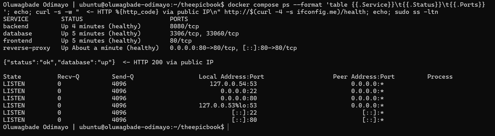

---

#### Screenshot 34 — EpicBook Application on Cloud VM

Add a browser screenshot showing the EpicBook application loaded through the VM public IP address.

Add your full name as a clear caption below the screenshot.

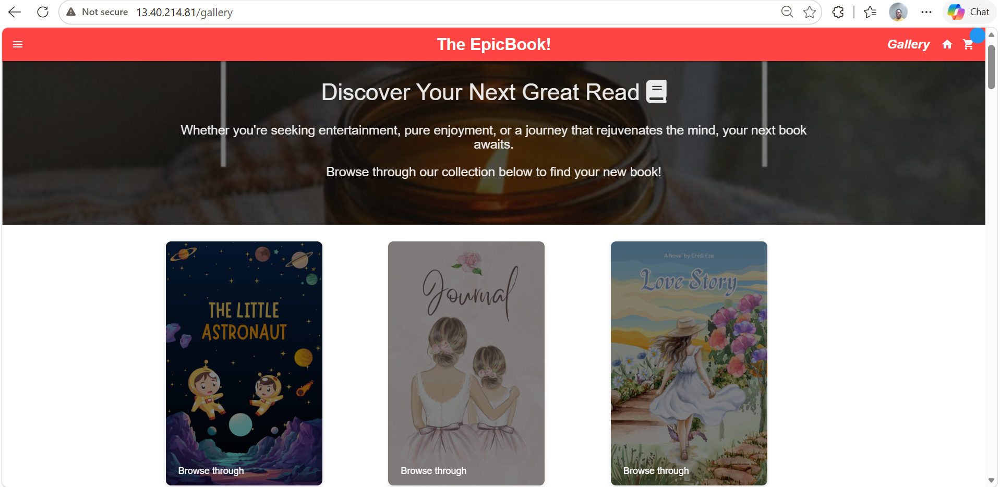

*Oluwagbade Odimayo*

---

### Notes

Write a short note covering:

- Cloud provider used
- VM operating system
- Public port exposed
- Security rules configured
- Confirmation that the application and backend API worked through the reverse proxy

- **Cloud provider:** AWS, EC2 instance `oluwagbade-odimayo-week11-docker` (m7i-flex.large) in eu-west-2 (London).
- **VM operating system:** Ubuntu 24.04 LTS, with Docker Engine and the Compose plugin installed from Docker's official repository by cloud-init.
- **Public port exposed:** only TCP 80, published by the `reverse-proxy` service. The frontend, backend and database publish no ports, and `ss -ltn` on the host shows only 22 and 80 listening publicly.
- **Security rules:** the security group allows TCP 80 from anywhere and TCP 22 from my own IP address only, with no other inbound rules. The database also sits on an internal Docker network with no internet access.
- **Verification:** the public `/health` endpoint returned `200 {"status":"ok","database":"up"}` through the reverse proxy, the home page, `/api/cart` and a CSS asset all returned 200 through the proxy, and the application and gallery loaded in the browser at the VM's public IP.

---

# Task 8 — Automate Deployment with CI/CD (Optional)

## Goal

Optionally automate image build, image push, and deployment through GitHub Actions or Azure Pipelines.

### Optional Evidence

#### Optional Screenshot — Successful CI/CD Pipeline Run

Add a screenshot showing a successful pipeline run with build, image push, deployment, and verification stages.

Not attempted (optional task).

---

### Optional Notes

Write a short note covering:

- CI/CD platform used
- Image-tagging method
- Registry used
- Deployment trigger
- Manual approval or secret-handling approach

Not attempted (optional task).

---

# Task 9 — Perform Reliability Tests and Create an Operations Runbook

## Goal

Test controlled service failures and document safe operating procedures.

### Evidence

#### Screenshot 35 — Backend Failure and Recovery

Add a terminal screenshot showing:

- Backend failure test
- Expected unavailable response through the reverse proxy
- Backend restart
- Successful health-check recovery

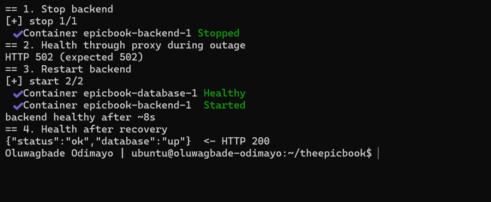

---

#### Screenshot 36 — Database Failure and Recovery

Add a terminal screenshot showing:

- Database outage test
- Failed database-dependent request
- Database restart
- Successful application recovery

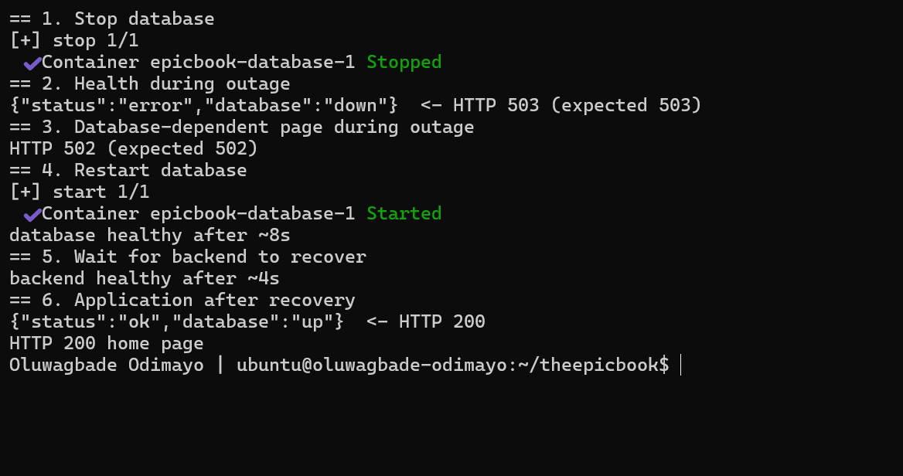

---

### Notes

Write a short operations runbook covering:

- Safe restart procedure for reverse proxy, frontend, backend, and database
- Backup and restore procedure
- Secret-rotation approach
- Database recovery procedure
- What to check when the application returns an error
- Results of backend and database reliability tests

#### Safe restart procedure

- **Reverse proxy:** validate first with `docker compose exec reverse-proxy nginx -t`, then `docker compose restart reverse-proxy`. The outage is about a second, and logs persist in `./logs/proxy`.
- **Frontend:** `docker compose restart frontend`. Pages still render, but static assets fail until its health check passes again.
- **Backend:** `docker compose restart backend`, then confirm `docker compose ps` shows it healthy. The proxy resolves the backend through Docker DNS at request time, so it finds the restarted container without a reload.
- **Database:** take a backup first (`scripts/backup.sh`), then `docker compose restart database`. Database-dependent requests fail during the restart and the backend may restart itself, so wait until both show healthy. Never use `docker compose down -v`, which deletes `db_data`.

#### Backup and restore procedure

- **Backup:** `scripts/backup.sh` runs `mysqldump --single-transaction` inside the database container and writes `backups/bookstore-<UTC timestamp>.sql` on the host, checking the dump completed. Copy backups off the VM (for example to S3) so they survive the loss of the VM.
- **Restore:** `scripts/restore.sh backups/<file>.sql`, then verify with a query and by loading the application. The drill in Screenshots 24 to 27 proved it: the deleted test record came back after the restore.

#### Secret-rotation approach

Secrets live only in `.env` on the VM (permissions 600, excluded from Git), and `.env.example` holds placeholders. To rotate the application password: generate a new value with `openssl rand -hex 16`, run `ALTER USER 'epicbook'@'%' IDENTIFIED BY '<new value>';` as root inside the database container, update `MYSQL_PASSWORD` in `.env`, then run `docker compose up -d --wait`, which recreates the backend with the new connection URL and the database with the matching health-check password. The `MYSQL_*` variables only create users on first initialisation, so an existing password must be changed with `ALTER USER`, not just in `.env`. Rotate the root password the same way, and rotate immediately if a secret is ever exposed.

#### Database recovery procedure

1. Check status and logs: `docker compose ps` and `docker compose logs database --tail=50`.
2. If the container stopped or crashed, run `docker compose start database` and wait for it to report healthy. The backend recovers on its own through its restart policy.
3. If the data is damaged, restore the latest good backup with `scripts/restore.sh`.
4. Last resort, full reset: take a backup if possible, run `docker compose down -v` and `docker compose up -d --wait` (the seed scripts re-run on the empty volume), then restore the backup.

#### What to check when the application returns an error

1. `docker compose ps` to see which service is not healthy.
2. `curl http://localhost/health`: `503` with `"database":"down"` points at MySQL, and `502` means the backend is not running or not reachable.
3. The proxy logs in `./logs/proxy`: `upstream_status` in `epicbook-access.log` and connection errors in `epicbook-error.log`.
4. `docker compose logs backend --tail=50` and `docker compose logs database --tail=50`.
5. Disk space with `df -h`, and that the security group still allows port 80.

#### Reliability test results

- **Backend failure (Screenshot 35):** with the backend stopped, `/health` through the proxy returned `502`. After `docker compose start backend` it was healthy again in about 8 seconds and `/health` returned `200`.
- **Database failure (Screenshot 36):** with MySQL stopped, `/health` returned `503 {"status":"error","database":"down"}` and the home page returned `502`. After `docker compose start database`, MySQL was healthy in about 8 seconds and the backend about 4 seconds later, and both `/health` and the home page returned `200`.
- **Weakness found:** EpicBook's route handlers do not catch database errors, so a page request during a database outage makes the Node process exit. That is where the `502` comes from, and Docker's `restart: unless-stopped` policy is what brings the backend back. The proper fix is error handling in the async route handlers that returns `503` instead of crashing, which I would add before calling this stack production-ready.

---

# Final Public Application URL

**EpicBook URL:** http://13.40.214.81

Replace the placeholder with your working public URL.

---

# GitHub Repository URL

**Your Fork or Repository URL:** https://github.com/gbadedata/theepicbook

---

# LinkedIn Requirement

## Goal

Create a professional LinkedIn post of 6–10 lines about your EpicBook capstone deployment.

Your post must include:

- The architectural decision that most improved reliability
- Your biggest image-size reduction, with numbers
- Key production-hardening lessons
- A deployment verification image

### Evidence

**LinkedIn Post URL:** Not published, by choice.

#### LinkedIn Post Screenshot

Not published, by choice.

---

# Submission Checklist

- [x] EpicBook repository reviewed and architecture diagram created
- [x] Environment variables, ports, persistence, and health-check details documented
- [x] Backend and frontend production Dockerfiles created
- [x] Backend runs as a non-root user
- [x] Docker image-size comparison completed
- [x] Docker Compose stack includes reverse proxy, frontend, backend, and database
- [x] `front-tier` and `back-tier` networks configured
- [x] `db_data` named volume configured
- [x] MySQL, backend, frontend, and reverse-proxy health checks configured
- [x] Startup dependencies use `service_healthy`
- [x] Nginx or Traefik selected as the only public reverse proxy
- [x] Only reverse-proxy port 80 is publicly published
- [x] Same-origin routing configured and CORS used only when required
- [x] Backup, restore, and persistence testing completed
- [x] Reverse-proxy and backend logs verified
- [x] Cloud VM deployment verified through the public IP
- [x] Backend and database reliability tests completed
- [x] Screenshots 1–36 included
- [x] Required notes completed
- [ ] LinkedIn post URL and screenshot included (not published, by choice)
- [x] Full name visible in required screenshots or captions
- [x] No passwords, tokens, private keys, account IDs, or other sensitive information exposed

---

## 📌 About DMI & CloudAdvisory

DevOps Micro Internship (DMI) is a project-based DevOps program run by Pravin Mishra (The CloudAdvisory) focused on real-world execution, systems thinking, and career readiness.

It helps learners build strong DevOps foundations with hands-on experience.

---

## 📌 Resources

- 🌐 DMI Official Website: https://dmi.pravinmishra.com?utm_source=github&utm_medium=readme  
- 🎓 University: https://university.pravinmishra.com?utm_source=github&utm_medium=readme  
- 💬 Discord Community: https://discord.pravinmishra.com?utm_source=github&utm_medium=readme  
- 📝 Blog: https://dmi.pravinmishra.com/blog?utm_source=github&utm_medium=readme  
- ▶️ YouTube Playlist: https://www.youtube.com/playlist?list=PLFeSNDtI4Cho  
- 🔗 Pravin Mishra (LinkedIn): https://www.linkedin.com/in/pravin-mishra-aws-trainer/  
- 🏢 CloudAdvisory (LinkedIn): https://www.linkedin.com/company/thecloudadvisory/

---

*This submission is part of DevOps Micro Internship (DMI) — Agentic AI Track.*
