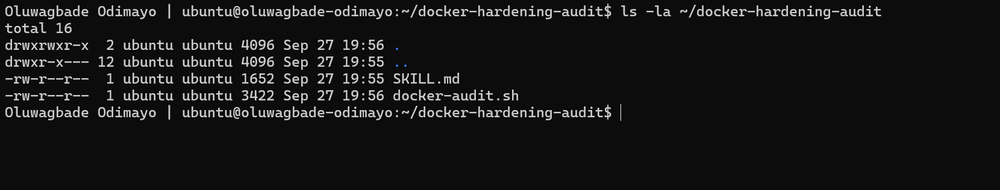
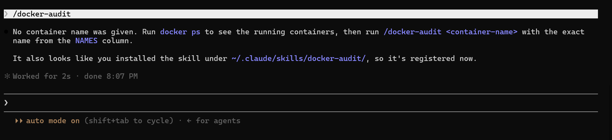
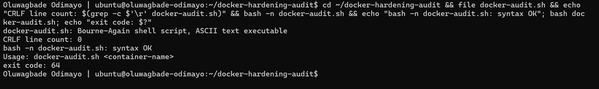
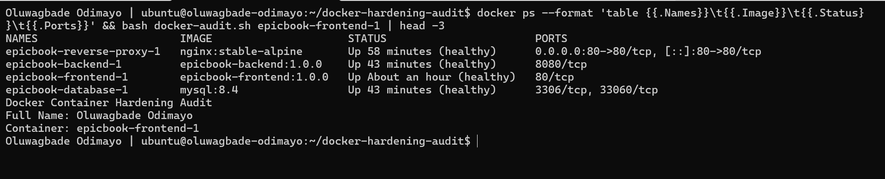
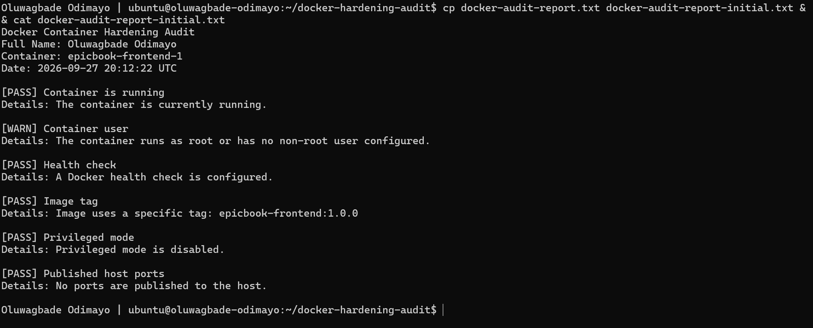
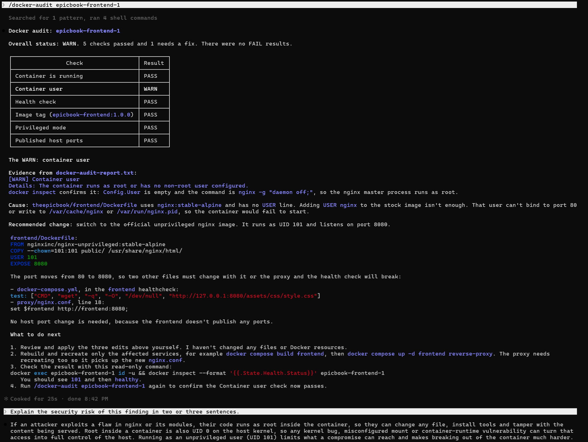
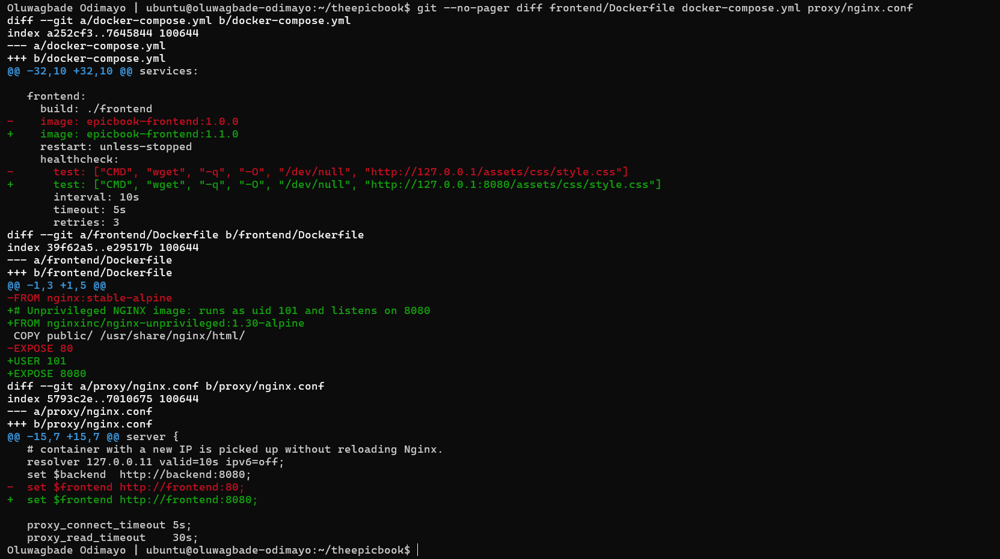
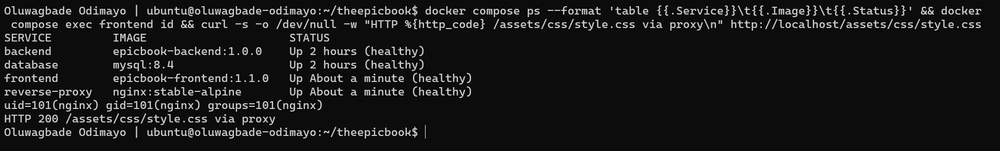
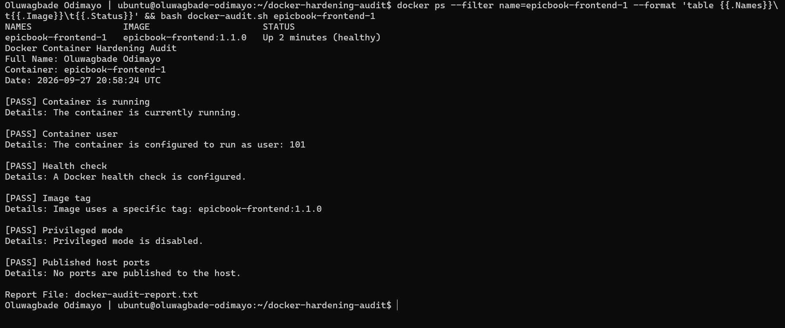

# Assignment 8 — AI-Assisted Docker Container Hardening Audit

Part of the DevOps Micro Internship (DMI) with Agentic AI

---

## Purpose

In this assignment, you will build a read-only Bash script that audits a running Docker container for common hardening gaps — running as root, missing health checks, unpinned image tags, privileged mode, and unnecessary exposed ports — then connect that script to Claude Code as a reusable `/docker-audit` skill. You will run the audit against your production-grade EpicBook stack, fix what it finds by editing the Dockerfile yourself, rebuild the image, and re-run the audit to prove the fix worked. Claude analyzes evidence and recommends a fix; it never edits your Dockerfile or rebuilds the image itself.

---

# Target Container

**Target Container Name:** `epicbook-frontend-1`

---

# Task 1 — Prepare the Audit Workspace

## Goal

Create an audit workspace and confirm that the supplied files are available.

### Evidence

#### Screenshot 1 — Audit Workspace Files

Add a terminal screenshot showing your full name and both supplied files:

```text
docker-audit.sh
SKILL.md
```



---

# Task 2 — Add the Docker Audit Skill to Claude Code

## Goal

Add the supplied `docker-audit` skill to Claude Code and confirm that it is available.

### Evidence

#### Screenshot 2 — Docker Audit Skill Available in Claude Code

Add a screenshot of Claude Code showing `docker-audit` in the available skill list.



*Oluwagbade Odimayo*

---

# Task 3 — Validate the Audit Script

## Goal

Verify the audit script line endings, Bash syntax, and usage message.

### Evidence

#### Screenshot 3 — Script Validation

Add a terminal screenshot showing:

- LF line-ending check
- Successful `bash -n docker-audit.sh` validation
- Your full name
- The usage message displayed when the script runs without a container name



---

# Task 4 — Run the Initial Docker Security Audit

## Goal

Audit a running container and record the initial findings.

### Evidence

#### Screenshot 4 — Selected Target Container

Add a terminal screenshot showing:

- Your full name
- `docker ps`
- The audit command using the selected target container name



---

#### Screenshot 5 — Initial Audit Results

Add a terminal screenshot showing the initial Docker audit results.



---

# Task 5 — Use AI Assistance to Understand the Findings

## Goal

Use the supplied `docker-audit` skill to understand the initial audit results safely.

### Evidence

#### Screenshot 6 — Audit Explanation and Recommended Fix

Add a Claude Code screenshot showing:

- Audit finding
- Security risk
- Recommended manual fix
- Verification method



*Oluwagbade Odimayo*

---

# Task 6 — Apply One Container-Hardening Fix

## Goal

Manually fix one WARN or FAIL finding from the initial audit.

### Evidence

#### Screenshot 7 — Hardening Configuration Change

Add a screenshot of the updated Dockerfile or `docker-compose.yml` showing the selected hardening fix.



---

#### Screenshot 8 — Updated Service Running

Add a terminal screenshot showing your full name and the rebuilt or recreated service/container running successfully.



---

# Task 7 — Re-Run the Audit and Compare Results

## Goal

Verify that the selected hardening fix improved the container configuration.

### Evidence

#### Screenshot 9 — Final Audit Results

Add a terminal screenshot showing:

- Your full name
- The updated running container
- The final audit report



---

### Before-and-After Comparison

Write a short comparison covering:

- Initial audit finding
- Dockerfile or Docker Compose change applied
- Final audit result
- Security benefit of the improvement

- **Initial audit finding:** the first audit of `epicbook-frontend-1` (image `epicbook-frontend:1.0.0`, built on `nginx:stable-alpine`) returned five PASS results and one **WARN: Container user**, because no non-root user was configured and the Nginx master process ran as root.
- **Change applied:** I switched the frontend's base image to `nginxinc/nginx-unprivileged:1.30-alpine`, which NGINX maintains for running as a non-root user, and added `USER 101` and `EXPOSE 8080` to `frontend/Dockerfile`. Because the unprivileged image listens on 8080, I also updated the frontend health check in `docker-compose.yml` to port 8080, bumped the image tag to `epicbook-frontend:1.1.0`, and pointed the reverse proxy at `frontend:8080`. I made the edits myself, then rebuilt and recreated only the frontend and restarted the proxy; the backend and database kept running.
- **Final audit result:** all six checks PASS, and the user check now reports `The container is configured to run as user: 101`. `docker compose exec frontend id` shows `uid=101(nginx)`, the frontend is healthy, and static assets still return 200 through the reverse proxy.
- **Security benefit:** if an attacker found a flaw in Nginx or in how it serves files, they would now land in the container as an unprivileged user instead of root. They could not install packages, change the served files or system configuration, or use root privileges as a starting point to attack the host, so the damage from a compromise is much smaller. It also removes a WARN that would otherwise recur in every future audit of this service.

---

# LinkedIn Requirement

## Goal

Create a LinkedIn post about the container security checks you performed, one hardening improvement you applied, and why the improvement matters.

### Evidence

**LinkedIn Post URL:** Not published, by choice.

#### LinkedIn Post Screenshot

Not published, by choice.

Not published, by choice.

---

# Submission Instructions

- Include Screenshots 1–9 exactly as specified.
- Include the target container name and before-and-after comparison.
- Include the LinkedIn post URL and screenshot.
- Ensure that your full name is visible in all required terminal screenshots.
- Do not expose passwords, API keys, tokens, account IDs, or `.env` file contents.

---

# Completion Checklist

- [x] Audit workspace created and supplied files verified
- [x] `docker-audit` skill added to Claude Code
- [x] Audit script validated successfully
- [x] Running target container identified
- [x] Initial Docker audit completed
- [x] Claude Code explanation of findings captured
- [x] One hardening fix applied manually
- [x] Affected service or container rebuilt and recreated
- [x] Final Docker audit completed
- [x] Before-and-after comparison completed
- [x] Screenshots 1–9 included
- [ ] LinkedIn post URL and screenshot included (not published, by choice)
- [x] No sensitive information exposed

---

## 📌 About DMI & CloudAdvisory

DevOps Micro Internship (DMI) is a project-based DevOps program run by Pravin Mishra (The CloudAdvisory) focused on real-world execution, systems thinking, and career readiness.

It helps learners build strong DevOps foundations with hands-on experience.

---

## 📌 Resources

- 🌐 DMI Official Website: https://dmi.pravinmishra.com?utm_source=github&utm_medium=readme  
- 🎓 University: https://university.pravinmishra.com?utm_source=github&utm_medium=readme  
- 💬 Discord Community: https://discord.pravinmishra.com?utm_source=github&utm_medium=readme  
- 📝 Blog: https://dmi.pravinmishra.com/blog?utm_source=github&utm_medium=readme  
- ▶️ YouTube Playlist: https://www.youtube.com/playlist?list=PLFeSNDtI4Cho  
- 🔗 Pravin Mishra (LinkedIn): https://www.linkedin.com/in/pravin-mishra-aws-trainer/  
- 🏢 CloudAdvisory (LinkedIn): https://www.linkedin.com/company/thecloudadvisory/

---

*This submission is part of DevOps Micro Internship (DMI) — Agentic AI Track.*
